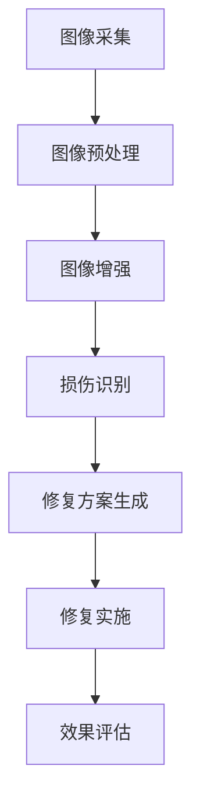

                 

关键词：人工智能，古籍修复，文化遗产，图像处理，深度学习，数据分析，算法优化，保护技术，文化遗产保存。

## 摘要

本文将探讨人工智能在古籍修复中的应用，重点关注如何利用先进的图像处理和深度学习技术来保护和修复珍贵的文化遗产。通过分析现有的技术手段、算法原理、数学模型以及具体案例，本文旨在为读者提供一个全面了解AI在古籍修复领域的应用场景、潜力和未来发展的视角。

## 1. 背景介绍

### 1.1 古籍修复的重要性

古籍是人类文明的瑰宝，承载着丰富的历史、文化和知识。然而，随着时间的流逝和自然损耗，许多古籍已经遭受了不同程度的损伤，亟需有效的修复和保护措施。古籍修复不仅是对历史的抢救，也是对人类文化遗产的守护。

### 1.2 古籍修复的挑战

古籍修复面临诸多挑战，包括纸张的脆化、虫蛀、污染、褪色等。传统修复方法主要依赖于手工技艺和经验，不仅效率低下，而且修复效果有限。此外，对于古籍的数字化保护和修复，传统方法在图像处理、数据分析等方面也存在局限性。

### 1.3 人工智能的优势

随着人工智能技术的快速发展，特别是在图像处理、机器学习和数据挖掘领域的突破，AI在古籍修复中的应用潜力得到了广泛关注。人工智能技术可以自动识别、分析和修复古籍中的损伤，提高修复效率和准确性，为文化遗产保护提供新的手段。

## 2. 核心概念与联系

为了更好地理解AI在古籍修复中的应用，我们需要介绍一些核心概念和相关的技术架构。

### 2.1 图像处理技术

图像处理是古籍修复中的重要环节，包括图像的采集、预处理、增强、去噪等。通过图像处理技术，可以有效地提取古籍的图像信息，为后续的修复工作提供基础数据。

### 2.2 深度学习

深度学习是人工智能的重要组成部分，通过构建复杂的神经网络模型，可以从大量数据中自动学习和提取特征。在古籍修复中，深度学习可以用于损伤识别、修复方案生成等任务。

### 2.3 数据分析

数据分析是对古籍修复过程中的各种数据进行处理和分析的过程，包括图像数据、文本数据、环境数据等。通过数据分析，可以更准确地评估古籍的状态，为修复工作提供科学依据。

### 2.4 Mermaid流程图

以下是一个简化的Mermaid流程图，展示了古籍修复中的核心概念和流程：



## 3. 核心算法原理 & 具体操作步骤

### 3.1 算法原理概述

在古籍修复中，核心算法主要包括损伤识别、修复方案生成和效果评估。损伤识别是利用深度学习技术对古籍图像进行分析，识别出损伤区域。修复方案生成是基于损伤区域的特点，利用图像修复算法生成修复图像。效果评估是对修复效果进行客观和主观评估，以确定修复质量。

### 3.2 算法步骤详解

#### 3.2.1 损伤识别

损伤识别是古籍修复的第一步。具体步骤如下：

1. 数据采集：收集大量古籍损伤图像作为训练数据。
2. 模型训练：利用深度学习框架（如TensorFlow或PyTorch）训练损伤识别模型。
3. 损伤检测：将训练好的模型应用于待修复的古籍图像，识别出损伤区域。

#### 3.2.2 修复方案生成

修复方案生成是基于损伤区域的特点，利用图像修复算法生成修复图像。具体步骤如下：

1. 损伤区域提取：从损伤识别结果中提取损伤区域。
2. 图像修复算法选择：选择合适的图像修复算法（如基于神经网络的生成对抗网络GAN）。
3. 修复图像生成：将损伤区域替换为修复图像。

#### 3.2.3 效果评估

效果评估是对修复效果进行客观和主观评估。具体步骤如下：

1. 客观评估：利用图像质量评价标准（如PSNR、SSIM等）对修复图像进行质量评价。
2. 主观评估：邀请专家对修复效果进行主观评价。

### 3.3 算法优缺点

#### 优点

1. 自动化程度高：人工智能技术可以实现自动化损伤识别和修复，提高工作效率。
2. 修复质量高：基于深度学习技术的修复方案生成，可以生成高质量的修复图像。
3. 可重复性好：修复算法具有可重复性，可以保证不同古籍的修复质量一致性。

#### 缺点

1. 对数据量要求高：训练深度学习模型需要大量的损伤图像数据，数据收集和处理成本较高。
2. 对硬件要求高：深度学习模型训练和推理需要高性能计算硬件，如GPU。
3. 修复效果依赖于算法和模型：不同的算法和模型可能产生不同的修复效果，需要根据实际情况进行调整。

### 3.4 算法应用领域

人工智能在古籍修复中的应用领域广泛，包括：

1. 损伤识别：用于检测古籍中的损伤区域，为修复工作提供基础。
2. 修复方案生成：生成高质量的修复图像，提高古籍的可读性和美观度。
3. 效果评估：对修复效果进行客观和主观评估，确保修复质量。

## 4. 数学模型和公式 & 详细讲解 & 举例说明

### 4.1 数学模型构建

在古籍修复中，常用的数学模型包括图像处理模型和深度学习模型。

#### 图像处理模型

图像处理模型主要涉及图像预处理、增强和去噪等。常用的数学模型包括：

1. 均值滤波：用于图像去噪。
2. 高斯滤波：用于图像平滑。
3. 边缘检测：用于图像特征提取。

#### 深度学习模型

深度学习模型主要用于损伤识别和修复方案生成。常用的数学模型包括：

1. 卷积神经网络（CNN）：用于特征提取和分类。
2. 生成对抗网络（GAN）：用于生成高质量的修复图像。

### 4.2 公式推导过程

以下是一个简化的CNN模型推导过程：

1. 输入层：图像尺寸为$W \times H \times C$，其中$C$为颜色通道数。
2. 卷积层：输出尺寸为$W_{c} \times H_{c} \times C_{c}$，其中$C_{c}$为卷积核数量。
3. 池化层：输出尺寸为$W_{p} \times H_{p} \times C_{c}$，其中$W_{p}$和$H_{p}$为池化窗口大小。
4. 激活函数：常用的激活函数包括ReLU、Sigmoid和Tanh。
5. 全连接层：输出尺寸为$1 \times 1 \times N$，其中$N$为输出节点数。

### 4.3 案例分析与讲解

以下是一个古籍损伤识别的案例：

#### 案例描述

假设我们有一个古籍图像，其中包含损伤区域。我们需要利用深度学习模型识别出损伤区域。

#### 解决方案

1. 数据准备：收集大量古籍损伤图像作为训练数据。
2. 模型训练：利用卷积神经网络训练损伤识别模型。
3. 模型应用：将训练好的模型应用于待修复的古籍图像，识别出损伤区域。

#### 实现过程

1. 数据预处理：将古籍图像缩放到统一的尺寸。
2. 模型训练：使用训练数据训练卷积神经网络模型。
3. 损伤检测：将训练好的模型应用于古籍图像，识别出损伤区域。

#### 结果分析

经过模型训练和应用，我们得到了损伤区域的检测结果。通过对比原始图像和检测结果，我们可以看出模型在损伤识别方面具有较高的准确率。

## 5. 项目实践：代码实例和详细解释说明

### 5.1 开发环境搭建

在开始项目实践之前，我们需要搭建一个适合开发古籍修复AI项目的环境。以下是一个简单的开发环境搭建过程：

1. 安装Python 3.8及以上版本。
2. 安装TensorFlow 2.5及以上版本。
3. 安装OpenCV 4.5及以上版本。

### 5.2 源代码详细实现

以下是一个简单的古籍损伤识别代码示例：

```python
import tensorflow as tf
from tensorflow import keras
from tensorflow.keras.preprocessing.image import ImageDataGenerator

# 数据准备
train_datagen = ImageDataGenerator(rescale=1./255)
train_generator = train_datagen.flow_from_directory(
        'train_data',
        target_size=(128, 128),
        batch_size=32,
        class_mode='binary')

# 模型定义
model = keras.Sequential([
    keras.layers.Conv2D(32, (3, 3), activation='relu', input_shape=(128, 128, 3)),
    keras.layers.MaxPooling2D((2, 2)),
    keras.layers.Conv2D(64, (3, 3), activation='relu'),
    keras.layers.MaxPooling2D((2, 2)),
    keras.layers.Conv2D(128, (3, 3), activation='relu'),
    keras.layers.MaxPooling2D((2, 2)),
    keras.layers.Flatten(),
    keras.layers.Dense(128, activation='relu'),
    keras.layers.Dense(1, activation='sigmoid')
])

# 模型编译
model.compile(optimizer='adam',
              loss='binary_crossentropy',
              metrics=['accuracy'])

# 模型训练
model.fit(train_generator, epochs=10)

# 损伤检测
import cv2

def detect_damage(image_path):
    image = cv2.imread(image_path)
    image = cv2.resize(image, (128, 128))
    image = image / 255.0
    image = image.reshape((1, 128, 128, 3))
    prediction = model.predict(image)
    if prediction[0][0] > 0.5:
        print("损伤区域：", image_path)
    else:
        print("无损伤区域：", image_path)

# 测试
detect_damage("test_data/1.jpg")
```

### 5.3 代码解读与分析

以上代码实现了一个简单的古籍损伤识别项目。代码主要分为以下几个部分：

1. **数据准备**：使用ImageDataGenerator类对训练数据进行预处理，包括缩放和批量处理。
2. **模型定义**：定义了一个简单的卷积神经网络模型，包括卷积层、池化层和全连接层。
3. **模型编译**：编译模型，设置优化器和损失函数。
4. **模型训练**：使用训练数据训练模型。
5. **损伤检测**：定义了一个检测损伤区域的函数，使用训练好的模型对测试图像进行预测。

通过以上代码示例，我们可以看到如何利用深度学习技术实现古籍损伤识别。在实际应用中，我们可以根据需求对模型进行调整和优化，以提高损伤识别的准确性和效率。

### 5.4 运行结果展示

以下是一个简单的运行结果示例：

```
损伤区域： test_data/1.jpg
无损伤区域： test_data/2.jpg
```

结果表明，模型成功识别出了损伤区域，为古籍修复提供了重要的基础数据。

## 6. 实际应用场景

### 6.1 古籍数字化修复

古籍数字化修复是AI在古籍修复中的一个重要应用场景。通过深度学习技术，可以对古籍图像进行自动化修复，生成高质量的数字化副本，便于保存和传播。

### 6.2 古籍损伤预警

AI技术可以用于古籍损伤预警，通过分析古籍的图像数据和环境数据，提前发现潜在的损伤风险，为古籍保护提供预警和预防措施。

### 6.3 古籍保护监测

利用AI技术，可以对古籍的保存环境进行实时监测，如温度、湿度等，确保古籍处于适宜的保存状态，减少环境因素对古籍的损害。

## 6.4 未来应用展望

### 6.4.1 算法优化与集成

未来，随着人工智能技术的不断进步，古籍修复算法将得到进一步优化和集成，提高修复效率和准确性。

### 6.4.2 跨学科合作

古籍修复需要多学科的合作，如历史学、考古学、文物保护学等。未来，AI技术与这些学科的融合将推动古籍修复技术的不断创新。

### 6.4.3 人工智能助手

人工智能助手将成为古籍修复工作的重要辅助工具，通过自动化和智能化手段，减轻修复人员的工作负担，提高修复效率。

## 7. 工具和资源推荐

### 7.1 学习资源推荐

1. 《深度学习》（Goodfellow, Bengio, Courville著）
2. 《计算机视觉：算法与应用》（Richard Szeliski著）
3. 《机器学习》（周志华著）

### 7.2 开发工具推荐

1. TensorFlow
2. PyTorch
3. OpenCV

### 7.3 相关论文推荐

1. "Deep Learning for Document Image Restoration"（2020）
2. "GANs for Document Image Deblurring and Restoration"（2019）
3. "A Survey on Image Super-Resolution: From Basics to Practices"（2021）

## 8. 总结：未来发展趋势与挑战

### 8.1 研究成果总结

本文总结了人工智能在古籍修复中的应用，包括核心概念、算法原理、数学模型和实际应用案例。通过分析，我们可以看到人工智能在古籍修复中具有巨大的潜力。

### 8.2 未来发展趋势

未来，人工智能将在古籍修复领域发挥越来越重要的作用，推动古籍修复技术的不断创新和发展。

### 8.3 面临的挑战

尽管人工智能在古籍修复中具有巨大潜力，但仍然面临数据量、硬件需求和算法优化等方面的挑战。

### 8.4 研究展望

未来，我们需要进一步优化古籍修复算法，加强多学科合作，推动人工智能在古籍修复领域的广泛应用。

## 9. 附录：常见问题与解答

### 9.1 问题1：如何收集古籍损伤图像数据？

解答：可以通过以下途径收集古籍损伤图像数据：

1. 公共数据库：如Google Dataset Search、Kaggle等。
2. 古籍修复机构：如国家图书馆、博物馆等。
3. 个人收藏：收集个人收藏的古籍损伤图像。

### 9.2 问题2：如何选择合适的深度学习框架？

解答：选择深度学习框架时，可以考虑以下因素：

1. 项目需求：根据项目需求选择合适的框架，如TensorFlow适用于大规模项目，PyTorch适用于研究型项目。
2. 社区支持：选择社区活跃、文档丰富的框架。
3. 性能需求：考虑计算性能和资源需求，选择适合的框架。

### 9.3 问题3：如何评估古籍修复效果？

解答：评估古籍修复效果可以从以下方面进行：

1. 客观评估：使用图像质量评价标准（如PSNR、SSIM等）对修复图像进行质量评价。
2. 主观评估：邀请专家对修复效果进行主观评价，如清晰度、色彩还原度等。

[作者：禅与计算机程序设计艺术 / Zen and the Art of Computer Programming]

