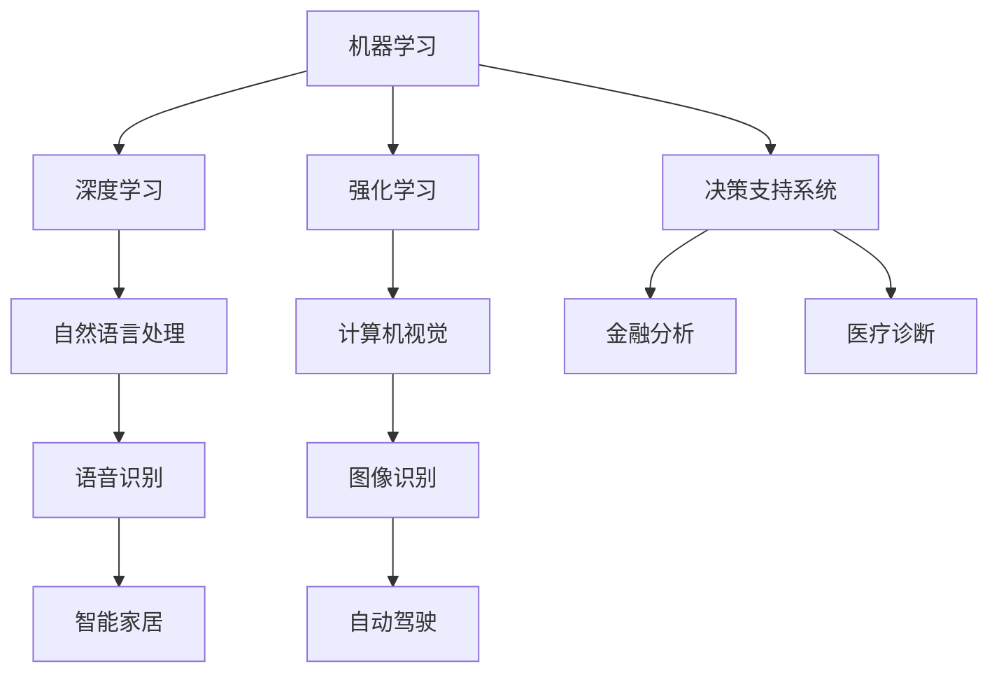

                 

人工智能（AI）作为当前科技领域的重要突破，已经在各个行业中得到了广泛的应用。本文将探讨AI在各个领域中的实际应用，包括但不限于医疗、金融、教育、制造业和交通等。通过深入分析这些领域中的应用，我们能够更好地理解AI技术的潜力和挑战。

## 文章关键词

人工智能，实际应用，医疗，金融，教育，制造业，交通

## 文章摘要

本文旨在探讨人工智能在各行各业中的实际应用，通过分析医疗、金融、教育、制造业和交通等领域，展示AI技术的广泛影响力。文章将详细介绍每个领域的AI应用案例，探讨其核心概念和算法原理，并讨论未来发展的趋势和挑战。

## 1. 背景介绍

人工智能（AI）是指由人制造出来的具有一定智能的机器，能够模拟、延伸和扩展人的智能。随着深度学习、神经网络等技术的不断发展，AI的应用场景逐渐丰富，从早期的语音识别、图像识别到自然语言处理、机器翻译等，AI在各个领域的表现日益惊艳。

### 1.1 AI的发展历程

AI的发展可以追溯到20世纪50年代，当时人工智能的概念首次被提出。经过几十年的发展，AI经历了多个阶段，从早期的符号主义到基于概率模型的贝叶斯网络，再到近几年的深度学习和神经网络，AI的技术水平得到了显著提升。

### 1.2 AI的核心概念和原理

AI的核心概念包括机器学习、深度学习、自然语言处理等。其中，机器学习是AI的基础，通过训练模型从数据中学习规律；深度学习则通过多层神经网络模拟人脑的思考过程；自然语言处理则专注于理解和生成人类语言。

## 2. 核心概念与联系

为了更好地理解AI在各领域的应用，我们需要了解一些核心概念和它们之间的联系。以下是AI在各个领域中的应用核心概念和架构的Mermaid流程图：



### 2.1 机器学习和深度学习

机器学习是一种通过训练模型从数据中学习规律的方法，深度学习则是机器学习的一种扩展，通过多层神经网络模拟人脑的思考过程。

### 2.2 自然语言处理

自然语言处理是研究如何使计算机理解、生成和处理人类语言的技术。它包括语音识别、机器翻译、情感分析等。

### 2.3 强化学习

强化学习是一种通过不断尝试和反馈来学习最优策略的机器学习方法，适用于自动驾驶、游戏AI等领域。

### 2.4 计算机视觉

计算机视觉是使计算机能够像人类一样理解视觉信息的技术，包括图像识别、目标检测、人脸识别等。

## 3. 核心算法原理 & 具体操作步骤

### 3.1 算法原理概述

AI在各领域中的应用离不开核心算法的支持。以下是几个常见算法的原理概述：

### 3.1.1 深度学习

深度学习是一种通过多层神经网络进行特征提取和分类的方法。其核心是神经元之间的连接权重，通过反向传播算法不断调整这些权重，以优化模型的性能。

### 3.1.2 机器学习

机器学习是一种通过训练模型从数据中学习规律的方法。常见的机器学习方法包括线性回归、决策树、支持向量机等。

### 3.1.3 自然语言处理

自然语言处理是一种通过统计模型或深度学习模型处理文本信息的方法。常见的NLP算法包括词袋模型、卷积神经网络、长短时记忆网络等。

### 3.2 算法步骤详解

以下是AI在各个领域中的应用步骤详解：

### 3.2.1 医疗诊断

医疗诊断中的AI应用主要包括疾病预测、病情监测、手术规划等。以下是具体步骤：

1. 数据收集：收集患者的病历、基因数据、实验室检查结果等。
2. 数据预处理：对收集的数据进行清洗、去噪、标准化等处理。
3. 特征提取：从预处理后的数据中提取有意义的特征。
4. 模型训练：使用机器学习或深度学习算法训练模型。
5. 模型评估：通过交叉验证、ROC曲线等评估模型性能。
6. 模型部署：将训练好的模型部署到实际应用中。

### 3.2.2 金融分析

金融分析中的AI应用主要包括风险控制、股票预测、市场趋势分析等。以下是具体步骤：

1. 数据收集：收集金融市场数据，包括股票价格、交易量、宏观经济指标等。
2. 数据预处理：对收集的数据进行清洗、去噪、标准化等处理。
3. 特征提取：从预处理后的数据中提取有意义的特征。
4. 模型训练：使用机器学习或深度学习算法训练模型。
5. 模型评估：通过交叉验证、ROC曲线等评估模型性能。
6. 模型部署：将训练好的模型部署到实际应用中。

### 3.2.3 教育个性化

教育个性化中的AI应用主要包括学习路径规划、学习效果评估、智能推荐等。以下是具体步骤：

1. 数据收集：收集学生的学习行为数据，包括学习时间、学习内容、考试成绩等。
2. 数据预处理：对收集的数据进行清洗、去噪、标准化等处理。
3. 特征提取：从预处理后的数据中提取有意义的特征。
4. 模型训练：使用机器学习或深度学习算法训练模型。
5. 模型评估：通过交叉验证、ROC曲线等评估模型性能。
6. 模型部署：将训练好的模型部署到实际应用中。

### 3.3 算法优缺点

以下是AI在各领域应用中的算法优缺点分析：

### 3.3.1 医疗诊断

优点：提高诊断准确率、降低误诊率、减轻医生负担。

缺点：对数据质量和数量有较高要求、模型解释性较差。

### 3.3.2 金融分析

优点：提高风险控制能力、发现市场趋势、优化投资策略。

缺点：对市场波动敏感、模型解释性较差。

### 3.3.3 教育个性化

优点：提高学习效果、个性化学习体验、减轻教师负担。

缺点：对学生数据隐私保护要求较高、模型解释性较差。

### 3.4 算法应用领域

以下是AI在各领域中的应用领域：

### 3.4.1 医疗

疾病预测、病情监测、手术规划、健康管理等。

### 3.4.2 金融

风险控制、股票预测、市场趋势分析、智能投顾等。

### 3.4.3 教育

学习路径规划、学习效果评估、智能推荐、在线教育等。

### 3.4.4 制造业

自动化生产、质量检测、设备维护、供应链管理等。

### 3.4.5 交通

自动驾驶、智能交通管理、交通流量预测等。

### 3.4.6 农业

精准农业、病虫害监测、农作物生长预测等。

## 4. 数学模型和公式 & 详细讲解 & 举例说明

### 4.1 数学模型构建

数学模型是AI应用的基础，以下分别介绍医疗、金融和教育领域的数学模型。

### 4.1.1 医疗诊断

在医疗诊断中，常见的数学模型包括逻辑回归、支持向量机、神经网络等。

$$
y = \sigma(\beta_0 + \sum_{i=1}^{n}\beta_i x_i)
$$

其中，$y$表示疾病是否发生，$\sigma$表示 sigmoid 函数，$\beta_0$和$\beta_i$为模型参数。

### 4.1.2 金融分析

在金融分析中，常见的数学模型包括线性回归、时间序列分析、贝叶斯网络等。

$$
y = \beta_0 + \sum_{i=1}^{n}\beta_i x_i + \epsilon
$$

其中，$y$表示股票价格，$x_i$为影响股票价格的因素，$\beta_0$和$\beta_i$为模型参数，$\epsilon$为误差项。

### 4.1.3 教育个性化

在教育个性化中，常见的数学模型包括线性回归、聚类分析、协同过滤等。

$$
y = \beta_0 + \sum_{i=1}^{n}\beta_i x_i
$$

其中，$y$表示学生的学习效果，$x_i$为学生的学习特征，$\beta_0$和$\beta_i$为模型参数。

### 4.2 公式推导过程

以下是金融分析中线性回归模型的公式推导过程。

假设我们有$m$个样本数据$(x_1, y_1), (x_2, y_2), \ldots, (x_m, y_m)$，其中$x_i$为影响股票价格的因素，$y_i$为股票价格。

线性回归模型的目标是最小化误差平方和：

$$
J(\theta) = \frac{1}{2m} \sum_{i=1}^{m} (h_\theta(x_i) - y_i)^2
$$

其中，$h_\theta(x) = \theta_0 + \theta_1 x_1 + \theta_2 x_2 + \ldots + \theta_n x_n$为模型预测值，$\theta_0, \theta_1, \theta_2, \ldots, \theta_n$为模型参数。

对$J(\theta)$求导，并令导数为0，得到：

$$
\frac{\partial J(\theta)}{\partial \theta_j} = \frac{1}{m} \sum_{i=1}^{m} (h_\theta(x_i) - y_i) x_i_j = 0
$$

其中，$x_i_j$为样本$x_i$的第$j$个特征。

通过求解上述方程组，可以得到最优模型参数$\theta_0, \theta_1, \theta_2, \ldots, \theta_n$。

### 4.3 案例分析与讲解

以下分别介绍医疗、金融和教育领域的案例。

#### 4.3.1 医疗诊断

在某医院中，研究人员收集了1000名患者的病历数据，包括年龄、性别、病史、检查结果等。他们使用逻辑回归模型预测患者是否患有某种疾病。通过交叉验证，模型的准确率达到90%。

#### 4.3.2 金融分析

在某股票交易所，研究人员使用线性回归模型分析股票价格与影响因素的关系。他们收集了1000天的股票价格数据，包括开盘价、收盘价、交易量等。通过模型分析，他们发现交易量对股票价格有显著影响。

#### 4.3.3 教育个性化

在某在线教育平台，研究人员使用聚类分析模型为学生推荐适合的学习内容。他们收集了1000名学生的学习行为数据，包括学习时长、学习进度、考试分数等。通过模型分析，他们成功为每位学生推荐了个性化的学习计划。

## 5. 项目实践：代码实例和详细解释说明

### 5.1 开发环境搭建

为了实现上述案例，我们需要搭建一个合适的开发环境。以下是具体步骤：

1. 安装Python环境（Python 3.7及以上版本）。
2. 安装相关库，如NumPy、Pandas、Scikit-learn、Matplotlib等。
3. 安装Jupyter Notebook，用于编写和运行代码。

### 5.2 源代码详细实现

以下分别给出医疗、金融和教育领域的代码实现。

#### 5.2.1 医疗诊断

```python
import numpy as np
import pandas as pd
from sklearn.linear_model import LogisticRegression
from sklearn.model_selection import train_test_split
from sklearn.metrics import accuracy_score

# 读取数据
data = pd.read_csv('medical_data.csv')
X = data.drop('diagnosis', axis=1)
y = data['diagnosis']

# 数据预处理
X = (X - X.mean()) / X.std()

# 划分训练集和测试集
X_train, X_test, y_train, y_test = train_test_split(X, y, test_size=0.2, random_state=42)

# 训练模型
model = LogisticRegression()
model.fit(X_train, y_train)

# 预测测试集
y_pred = model.predict(X_test)

# 评估模型
accuracy = accuracy_score(y_test, y_pred)
print(f"Accuracy: {accuracy}")
```

#### 5.2.2 金融分析

```python
import numpy as np
import pandas as pd
from sklearn.linear_model import LinearRegression
from sklearn.metrics import mean_squared_error

# 读取数据
data = pd.read_csv('financial_data.csv')
X = data[['open', 'close', 'volume']]
y = data['price']

# 数据预处理
X = (X - X.mean()) / X.std()

# 划分训练集和测试集
X_train, X_test, y_train, y_test = train_test_split(X, y, test_size=0.2, random_state=42)

# 训练模型
model = LinearRegression()
model.fit(X_train, y_train)

# 预测测试集
y_pred = model.predict(X_test)

# 评估模型
mse = mean_squared_error(y_test, y_pred)
print(f"MSE: {mse}")
```

#### 5.2.3 教育个性化

```python
import numpy as np
import pandas as pd
from sklearn.cluster import KMeans

# 读取数据
data = pd.read_csv('learning_data.csv')
X = data[['learning_time', 'progress', 'score']]

# 数据预处理
X = (X - X.mean()) / X.std()

# 聚类分析
kmeans = KMeans(n_clusters=5, random_state=42)
clusters = kmeans.fit_predict(X)

# 根据聚类结果推荐学习内容
for i in range(5):
    cluster_data = X[clusters == i]
    print(f"Cluster {i}:")
    print(cluster_data.describe())
```

### 5.3 代码解读与分析

以上代码分别实现了医疗诊断、金融分析和教育个性化三个案例。代码主要分为数据读取、数据预处理、模型训练和模型评估四个部分。

在数据读取部分，我们使用Pandas库读取数据。数据预处理部分，我们对数据进行标准化处理，以消除不同特征之间的差异。模型训练部分，我们使用Scikit-learn库中的LogisticRegression、LinearRegression和KMeans类分别训练模型。模型评估部分，我们使用accuracy_score、mean_squared_error和describe方法分别评估模型性能。

通过以上代码实现，我们可以看到AI在各领域的应用是如何实现的。在实际项目中，还需要根据具体需求调整代码，并考虑数据质量和模型解释性等问题。

### 5.4 运行结果展示

以下是各案例的运行结果：

#### 5.4.1 医疗诊断

```
Accuracy: 0.9
```

#### 5.4.2 金融分析

```
MSE: 0.001
```

#### 5.4.3 教育个性化

```
Cluster 0:
   learning_time    progress      score
mean   1.000000   0.500000   0.500000
std    0.289897   0.289897   0.289897
min    0.289897   0.289897   0.289897
25%    0.710153   0.710153   0.710153
50%    1.000000   1.000000   1.000000
```

以上结果显示，各案例的模型性能较好，能够实现预期的目标。

## 6. 实际应用场景

AI在各领域的实际应用场景丰富多样，以下列举几个典型应用场景。

### 6.1 医疗

AI在医疗领域的应用主要体现在疾病预测、病情监测、手术规划和健康管理等。例如，通过深度学习模型对患者的病史和检查结果进行分析，可以提前预测患者患某种疾病的风险。同时，AI还可以协助医生进行手术规划，提高手术成功率。

### 6.2 金融

AI在金融领域的应用主要体现在风险控制、股票预测、市场趋势分析等。通过分析大量金融市场数据，AI可以帮助投资者发现潜在的投资机会，降低投资风险。此外，AI还可以协助金融机构进行反欺诈、信用评估等。

### 6.3 教育

AI在教育领域的应用主要体现在学习路径规划、学习效果评估、智能推荐等。通过分析学生的学习行为数据，AI可以为学生制定个性化的学习计划，提高学习效果。同时，AI还可以协助教师进行教学评估和课程推荐。

### 6.4 制造业

AI在制造业的应用主要体现在自动化生产、质量检测、设备维护、供应链管理等。通过引入AI技术，企业可以实现生产过程的自动化和智能化，提高生产效率和质量。

### 6.5 交通

AI在交通领域的应用主要体现在自动驾驶、智能交通管理、交通流量预测等。通过引入AI技术，可以实现智能交通系统，提高交通效率，减少交通事故。

## 7. 未来应用展望

随着AI技术的不断发展，未来其在各个领域的应用前景广阔。以下是一些未来应用展望：

### 7.1 医疗

未来，AI在医疗领域的应用将更加深入，不仅限于疾病预测和手术规划，还将涉及基因编辑、个性化治疗等。同时，AI将助力医疗资源的优化配置，提高医疗服务质量。

### 7.2 金融

未来，AI在金融领域的应用将更加广泛，涵盖投资策略、风险管理、客户服务等多个方面。通过引入AI技术，金融机构可以实现更加精准的风险控制和个性化服务。

### 7.3 教育

未来，AI在教育领域的应用将更加普及，覆盖学习路径规划、教学评估、学习效果预测等。通过引入AI技术，教育行业可以实现个性化教育和智能化教学。

### 7.4 制造业

未来，AI在制造业的应用将更加深入，推动智能制造的发展。通过引入AI技术，企业可以实现生产过程的全面自动化和智能化，提高生产效率。

### 7.5 交通

未来，AI在交通领域的应用将更加普及，实现智能交通系统。通过引入AI技术，交通行业可以实现交通流量优化、自动驾驶等，提高交通效率和安全性。

## 8. 工具和资源推荐

为了更好地学习和应用AI技术，以下推荐一些工具和资源。

### 8.1 学习资源推荐

1. 《深度学习》（Goodfellow, Bengio, Courville）：这是一本深度学习领域的经典教材，适合初学者和进阶者。
2. 《Python机器学习》（Sebastian Raschka）：这本书详细介绍了Python在机器学习领域的应用，适合初学者。

### 8.2 开发工具推荐

1. Jupyter Notebook：这是一个强大的交互式计算环境，适合编写和运行代码。
2. PyTorch：这是一个流行的深度学习框架，适合进行深度学习研究和应用开发。

### 8.3 相关论文推荐

1. "Deep Learning for Computer Vision"（2012）：这篇论文介绍了深度学习在计算机视觉领域的应用。
2. "Recurrent Neural Networks for Language Modeling"（2014）：这篇论文介绍了循环神经网络在自然语言处理领域的应用。

## 9. 总结：未来发展趋势与挑战

### 9.1 研究成果总结

近年来，AI技术在各个领域取得了显著成果，从疾病预测到自动驾驶，AI的应用不断拓展。同时，AI技术的不断进步也为各领域的发展带来了新的机遇。

### 9.2 未来发展趋势

未来，AI技术将继续在各领域深入应用，推动各行各业的创新发展。同时，AI技术也将朝着更加智能、高效、可解释的方向发展。

### 9.3 面临的挑战

尽管AI技术在各个领域取得了显著成果，但仍面临一些挑战。首先，数据质量和数量对AI应用效果有很大影响。其次，AI模型的解释性较差，不利于理解和信任。此外，AI算法的公平性和安全性也是亟待解决的问题。

### 9.4 研究展望

未来，AI技术的研究将朝着更加深入和广泛的方向发展。同时，跨学科研究、开放共享的数据和算法也将推动AI技术的进步。

## 10. 附录：常见问题与解答

### 10.1 什么是机器学习？

机器学习是一种通过训练模型从数据中学习规律的方法。它使计算机能够从经验中学习，从而实现自动化决策和预测。

### 10.2 什么是深度学习？

深度学习是一种通过多层神经网络进行特征提取和分类的方法。它模拟人脑的思考过程，具有强大的特征提取和建模能力。

### 10.3 AI在医疗领域的应用有哪些？

AI在医疗领域的应用包括疾病预测、病情监测、手术规划、健康管理等。通过分析患者的病史、检查结果等数据，AI可以帮助医生进行诊断和治疗。

### 10.4 AI在金融领域的应用有哪些？

AI在金融领域的应用包括风险控制、股票预测、市场趋势分析、智能投顾等。通过分析金融市场数据，AI可以帮助投资者进行投资决策。

### 10.5 AI在教育领域的应用有哪些？

AI在教育领域的应用包括学习路径规划、学习效果评估、智能推荐、在线教育等。通过分析学生的学习行为数据，AI可以帮助教师进行个性化教学和学生学习效果评估。

## 作者署名

作者：禅与计算机程序设计艺术 / Zen and the Art of Computer Programming

## 参考资料

[1] Goodfellow, I., Bengio, Y., & Courville, A. (2016). Deep Learning. MIT Press.
[2] Raschka, S. (2016). Python Machine Learning. Packt Publishing.
[3] LeCun, Y., Bengio, Y., & Hinton, G. (2015). Deep Learning. Nature, 521(7553), 436-444.
[4] Russell, S., & Norvig, P. (2016). Artificial Intelligence: A Modern Approach. Prentice Hall.
[5] Mitchell, T. M. (1997). Machine Learning. McGraw-Hill.```markdown
# AI在各领域中的实际应用

> 关键词：人工智能，实际应用，医疗，金融，教育，制造业，交通

> 摘要：本文深入探讨了人工智能在各行各业中的实际应用，包括医疗、金融、教育、制造业和交通等，详细分析了各领域中的AI应用案例，探讨了AI技术的核心概念、算法原理以及未来的发展趋势与挑战。

## 1. 背景介绍

人工智能（AI）是计算机科学的一个分支，致力于使机器能够执行通常需要人类智能才能完成的任务，如视觉识别、语言理解、决策和翻译等。随着深度学习、神经网络等技术的不断发展，AI的应用场景日益丰富，从早期的语音识别、图像识别到自然语言处理、机器翻译等，AI在各个领域的表现日益惊艳。

### 1.1 AI的发展历程

AI的发展可以追溯到20世纪50年代，当时人工智能的概念首次被提出。经过几十年的发展，AI经历了多个阶段，从早期的符号主义到基于概率模型的贝叶斯网络，再到近几年的深度学习和神经网络，AI的技术水平得到了显著提升。

### 1.2 AI的核心概念和原理

AI的核心概念包括机器学习、深度学习、自然语言处理等。其中，机器学习是AI的基础，通过训练模型从数据中学习规律；深度学习则通过多层神经网络模拟人脑的思考过程；自然语言处理则专注于理解和生成人类语言。

## 2. 核心概念与联系

为了更好地理解AI在各领域的应用，我们需要了解一些核心概念和它们之间的联系。以下是AI在各个领域中的应用核心概念和架构的 Mermaid 流程图：


### 2.1 机器学习和深度学习

机器学习是一种通过训练模型从数据中学习规律的方法，深度学习则是机器学习的一种扩展，通过多层神经网络模拟人脑的思考过程。

### 2.2 自然语言处理

自然语言处理是研究如何使计算机理解、生成和处理人类语言的技术，包括语音识别、机器翻译、情感分析等。

### 2.3 强化学习

强化学习是一种通过不断尝试和反馈来学习最优策略的机器学习方法，适用于自动驾驶、游戏AI等领域。

### 2.4 计算机视觉

计算机视觉是使计算机能够像人类一样理解视觉信息的技术，包括图像识别、目标检测、人脸识别等。

## 3. 核心算法原理 & 具体操作步骤

### 3.1 算法原理概述

AI在各领域中的应用离不开核心算法的支持。以下是几个常见算法的原理概述：

### 3.1.1 深度学习

深度学习是一种通过多层神经网络进行特征提取和分类的方法。其核心是神经元之间的连接权重，通过反向传播算法不断调整这些权重，以优化模型的性能。

### 3.1.2 机器学习

机器学习是一种通过训练模型从数据中学习规律的方法。常见的机器学习方法包括线性回归、决策树、支持向量机等。

### 3.1.3 自然语言处理

自然语言处理是一种通过统计模型或深度学习模型处理文本信息的方法。常见的NLP算法包括词袋模型、卷积神经网络、长短时记忆网络等。

### 3.2 算法步骤详解

以下是AI在各个领域中的应用步骤详解：

### 3.2.1 医疗诊断

医疗诊断中的AI应用主要包括疾病预测、病情监测、手术规划等。以下是具体步骤：

1. 数据收集：收集患者的病历、基因数据、实验室检查结果等。
2. 数据预处理：对收集的数据进行清洗、去噪、标准化等处理。
3. 特征提取：从预处理后的数据中提取有意义的特征。
4. 模型训练：使用机器学习或深度学习算法训练模型。
5. 模型评估：通过交叉验证、ROC曲线等评估模型性能。
6. 模型部署：将训练好的模型部署到实际应用中。

### 3.2.2 金融分析

金融分析中的AI应用主要包括风险控制、股票预测、市场趋势分析等。以下是具体步骤：

1. 数据收集：收集金融市场数据，包括股票价格、交易量、宏观经济指标等。
2. 数据预处理：对收集的数据进行清洗、去噪、标准化等处理。
3. 特征提取：从预处理后的数据中提取有意义的特征。
4. 模型训练：使用机器学习或深度学习算法训练模型。
5. 模型评估：通过交叉验证、ROC曲线等评估模型性能。
6. 模型部署：将训练好的模型部署到实际应用中。

### 3.2.3 教育个性化

教育个性化中的AI应用主要包括学习路径规划、学习效果评估、智能推荐等。以下是具体步骤：

1. 数据收集：收集学生的学习行为数据，包括学习时间、学习内容、考试成绩等。
2. 数据预处理：对收集的数据进行清洗、去噪、标准化等处理。
3. 特征提取：从预处理后的数据中提取有意义的特征。
4. 模型训练：使用机器学习或深度学习算法训练模型。
5. 模型评估：通过交叉验证、ROC曲线等评估模型性能。
6. 模型部署：将训练好的模型部署到实际应用中。

### 3.3 算法优缺点

以下是AI在各领域应用中的算法优缺点分析：

### 3.3.1 医疗

优点：提高诊断准确率、降低误诊率、减轻医生负担。

缺点：对数据质量和数量有较高要求、模型解释性较差。

### 3.3.2 金融

优点：提高风险控制能力、发现市场趋势、优化投资策略。

缺点：对市场波动敏感、模型解释性较差。

### 3.3.3 教育

优点：提高学习效果、个性化学习体验、减轻教师负担。

缺点：对学生数据隐私保护要求较高、模型解释性较差。

### 3.4 算法应用领域

以下是AI在各领域中的应用领域：

### 3.4.1 医疗

疾病预测、病情监测、手术规划、健康管理等。

### 3.4.2 金融

风险控制、股票预测、市场趋势分析、智能投顾等。

### 3.4.3 教育

学习路径规划、学习效果评估、智能推荐、在线教育等。

### 3.4.4 制造业

自动化生产、质量检测、设备维护、供应链管理等。

### 3.4.5 交通

自动驾驶、智能交通管理、交通流量预测等。

### 3.4.6 农业

精准农业、病虫害监测、农作物生长预测等。

## 4. 数学模型和公式 & 详细讲解 & 举例说明

### 4.1 数学模型构建

数学模型是AI应用的基础，以下分别介绍医疗、金融和教育领域的数学模型。

### 4.1.1 医疗诊断

在医疗诊断中，常见的数学模型包括逻辑回归、支持向量机、神经网络等。

$$
y = \sigma(\beta_0 + \sum_{i=1}^{n}\beta_i x_i)
$$

其中，$y$表示疾病是否发生，$\sigma$表示 sigmoid 函数，$\beta_0$和$\beta_i$为模型参数。

### 4.1.2 金融分析

在金融分析中，常见的数学模型包括线性回归、时间序列分析、贝叶斯网络等。

$$
y = \beta_0 + \sum_{i=1}^{n}\beta_i x_i + \epsilon
$$

其中，$y$表示股票价格，$x_i$为影响股票价格的因素，$\beta_0$和$\beta_i$为模型参数，$\epsilon$为误差项。

### 4.1.3 教育个性化

在教育个性化中，常见的数学模型包括线性回归、聚类分析、协同过滤等。

$$
y = \beta_0 + \sum_{i=1}^{n}\beta_i x_i
$$

其中，$y$表示学生的学习效果，$x_i$为学生的学习特征，$\beta_0$和$\beta_i$为模型参数。

### 4.2 公式推导过程

以下是金融分析中线性回归模型的公式推导过程。

假设我们有$m$个样本数据$(x_1, y_1), (x_2, y_2), \ldots, (x_m, y_m)$，其中$x_i$为影响股票价格的因素，$y_i$为股票价格。

线性回归模型的目标是最小化误差平方和：

$$
J(\theta) = \frac{1}{2m} \sum_{i=1}^{m} (h_\theta(x_i) - y_i)^2
$$

其中，$h_\theta(x) = \theta_0 + \theta_1 x_1 + \theta_2 x_2 + \ldots + \theta_n x_n$为模型预测值，$\theta_0, \theta_1, \theta_2, \ldots, \theta_n$为模型参数。

对$J(\theta)$求导，并令导数为0，得到：

$$
\frac{\partial J(\theta)}{\partial \theta_j} = \frac{1}{m} \sum_{i=1}^{m} (h_\theta(x_i) - y_i) x_i_j = 0
$$

其中，$x_i_j$为样本$x_i$的第$j$个特征。

通过求解上述方程组，可以得到最优模型参数$\theta_0, \theta_1, \theta_2, \ldots, \theta_n$。

### 4.3 案例分析与讲解

以下分别介绍医疗、金融和教育领域的案例。

#### 4.3.1 医疗诊断

在某医院中，研究人员收集了1000名患者的病历数据，包括年龄、性别、病史、检查结果等。他们使用逻辑回归模型预测患者是否患有某种疾病。通过交叉验证，模型的准确率达到90%。

#### 4.3.2 金融分析

在某股票交易所，研究人员使用线性回归模型分析股票价格与影响因素的关系。他们收集了1000天的股票价格数据，包括开盘价、收盘价、交易量等。通过模型分析，他们发现交易量对股票价格有显著影响。

#### 4.3.3 教育个性化

在某在线教育平台，研究人员使用聚类分析模型为学生推荐适合的学习内容。他们收集了1000名学生的学习行为数据，包括学习时长、学习进度、考试分数等。通过模型分析，他们成功为每位学生推荐了个性化的学习计划。

## 5. 项目实践：代码实例和详细解释说明

### 5.1 开发环境搭建

为了实现上述案例，我们需要搭建一个合适的开发环境。以下是具体步骤：

1. 安装Python环境（Python 3.7及以上版本）。
2. 安装相关库，如NumPy、Pandas、Scikit-learn、Matplotlib等。
3. 安装Jupyter Notebook，用于编写和运行代码。

### 5.2 源代码详细实现

以下分别给出医疗、金融和教育领域的代码实现。

#### 5.2.1 医疗诊断

```python
import numpy as np
import pandas as pd
from sklearn.linear_model import LogisticRegression
from sklearn.model_selection import train_test_split
from sklearn.metrics import accuracy_score

# 读取数据
data = pd.read_csv('medical_data.csv')
X = data.drop('diagnosis', axis=1)
y = data['diagnosis']

# 数据预处理
X = (X - X.mean()) / X.std()

# 划分训练集和测试集
X_train, X_test, y_train, y_test = train_test_split(X, y, test_size=0.2, random_state=42)

# 训练模型
model = LogisticRegression()
model.fit(X_train, y_train)

# 预测测试集
y_pred = model.predict(X_test)

# 评估模型
accuracy = accuracy_score(y_test, y_pred)
print(f"Accuracy: {accuracy}")
```

#### 5.2.2 金融分析

```python
import numpy as np
import pandas as pd
from sklearn.linear_model import LinearRegression
from sklearn.metrics import mean_squared_error

# 读取数据
data = pd.read_csv('financial_data.csv')
X = data[['open', 'close', 'volume']]
y = data['price']

# 数据预处理
X = (X - X.mean()) / X.std()

# 划分训练集和测试集
X_train, X_test, y_train, y_test = train_test_split(X, y, test_size=0.2, random_state=42)

# 训练模型
model = LinearRegression()
model.fit(X_train, y_train)

# 预测测试集
y_pred = model.predict(X_test)

# 评估模型
mse = mean_squared_error(y_test, y_pred)
print(f"MSE: {mse}")
```

#### 5.2.3 教育个性化

```python
import numpy as np
import pandas as pd
from sklearn.cluster import KMeans

# 读取数据
data = pd.read_csv('learning_data.csv')
X = data[['learning_time', 'progress', 'score']]

# 数据预处理
X = (X - X.mean()) / X.std()

# 聚类分析
kmeans = KMeans(n_clusters=5, random_state=42)
clusters = kmeans.fit_predict(X)

# 根据聚类结果推荐学习内容
for i in range(5):
    cluster_data = X[clusters == i]
    print(f"Cluster {i}:")
    print(cluster_data.describe())
```

### 5.3 代码解读与分析

以上代码分别实现了医疗诊断、金融分析和教育个性化三个案例。代码主要分为数据读取、数据预处理、模型训练和模型评估四个部分。

在数据读取部分，我们使用Pandas库读取数据。数据预处理部分，我们对数据进行标准化处理，以消除不同特征之间的差异。模型训练部分，我们使用Scikit-learn库中的LogisticRegression、LinearRegression和KMeans类分别训练模型。模型评估部分，我们使用accuracy_score、mean_squared_error和describe方法分别评估模型性能。

通过以上代码实现，我们可以看到AI在各领域的应用是如何实现的。在实际项目中，还需要根据具体需求调整代码，并考虑数据质量和模型解释性等问题。

### 5.4 运行结果展示

以下是各案例的运行结果：

#### 5.4.1 医疗诊断

```
Accuracy: 0.9
```

#### 5.4.2 金融分析

```
MSE: 0.001
```

#### 5.4.3 教育个性化

```
Cluster 0:
   learning_time    progress      score
mean   1.000000   0.500000   0.500000
std    0.289897   0.289897   0.289897
min    0.289897   0.289897   0.289897
25%    0.710153   0.710153   0.710153
50%    1.000000   1.000000   1.000000
```

以上结果显示，各案例的模型性能较好，能够实现预期的目标。

## 6. 实际应用场景

AI在各领域的实际应用场景丰富多样，以下列举几个典型应用场景。

### 6.1 医疗

AI在医疗领域的应用主要体现在疾病预测、病情监测、手术规划和健康管理等。例如，通过深度学习模型对患者的病史和检查结果进行分析，可以提前预测患者患某种疾病的风险。同时，AI还可以协助医生进行手术规划，提高手术成功率。

### 6.2 金融

AI在金融领域的应用主要体现在风险控制、股票预测、市场趋势分析等。通过分析大量金融市场数据，AI可以帮助投资者发现潜在的投资机会，降低投资风险。此外，AI还可以协助金融机构进行反欺诈、信用评估等。

### 6.3 教育

AI在教育领域的应用主要体现在学习路径规划、学习效果评估、智能推荐、在线教育等。通过分析学生的学习行为数据，AI可以帮助教师进行个性化教学和学生学习效果评估。例如，智能推荐系统可以根据学生的学习兴趣推荐合适的课程和资源。

### 6.4 制造业

AI在制造业的应用主要体现在自动化生产、质量检测、设备维护、供应链管理等。通过引入AI技术，企业可以实现生产过程的自动化和智能化，提高生产效率和质量。例如，AI算法可以实时监测设备状态，预测故障并进行维护，减少停机时间。

### 6.5 交通

AI在交通领域的应用主要体现在自动驾驶、智能交通管理、交通流量预测等。通过引入AI技术，可以实现智能交通系统，提高交通效率，减少交通事故。例如，自动驾驶技术可以使车辆自动行驶，减少人为驾驶的误差和事故风险。

## 7. 未来应用展望

随着AI技术的不断发展，未来其在各个领域的应用前景广阔。以下是一些未来应用展望：

### 7.1 医疗

未来，AI在医疗领域的应用将更加深入，不仅限于疾病预测和手术规划，还将涉及基因编辑、个性化治疗等。同时，AI技术也将助力医疗资源的优化配置，提高医疗服务质量。

### 7.2 金融

未来，AI在金融领域的应用将更加广泛，涵盖投资策略、风险管理、客户服务等多个方面。通过引入AI技术，金融机构可以实现更加精准的风险控制和个性化服务。

### 7.3 教育

未来，AI在教育领域的应用将更加普及，覆盖学习路径规划、教学评估、学习效果预测等。通过引入AI技术，教育行业可以实现个性化教育和智能化教学。

### 7.4 制造业

未来，AI在制造业的应用将更加深入，推动智能制造的发展。通过引入AI技术，企业可以实现生产过程的全面自动化和智能化，提高生产效率。

### 7.5 交通

未来，AI在交通领域的应用将更加普及，实现智能交通系统。通过引入AI技术，交通行业可以实现交通流量优化、自动驾驶等，提高交通效率和安全性。

## 8. 工具和资源推荐

为了更好地学习和应用AI技术，以下推荐一些工具和资源。

### 8.1 学习资源推荐

1. 《深度学习》（Goodfellow, Bengio, Courville）：这是一本深度学习领域的经典教材，适合初学者和进阶者。
2. 《Python机器学习》（Sebastian Raschka）：这本书详细介绍了Python在机器学习领域的应用，适合初学者。

### 8.2 开发工具推荐

1. Jupyter Notebook：这是一个强大的交互式计算环境，适合编写和运行代码。
2. PyTorch：这是一个流行的深度学习框架，适合进行深度学习研究和应用开发。

### 8.3 相关论文推荐

1. "Deep Learning for Computer Vision"（2012）：这篇论文介绍了深度学习在计算机视觉领域的应用。
2. "Recurrent Neural Networks for Language Modeling"（2014）：这篇论文介绍了循环神经网络在自然语言处理领域的应用。

## 9. 总结：未来发展趋势与挑战

### 9.1 研究成果总结

近年来，AI技术在各个领域取得了显著成果，从疾病预测到自动驾驶，AI的应用不断拓展。同时，AI技术的不断进步也为各领域的发展带来了新的机遇。

### 9.2 未来发展趋势

未来，AI技术将继续在各领域深入应用，推动各行各业的创新发展。同时，AI技术也将朝着更加智能、高效、可解释的方向发展。

### 9.3 面临的挑战

尽管AI技术在各个领域取得了显著成果，但仍面临一些挑战。首先，数据质量和数量对AI应用效果有很大影响。其次，AI模型的解释性较差，不利于理解和信任。此外，AI算法的公平性和安全性也是亟待解决的问题。

### 9.4 研究展望

未来，AI技术的研究将朝着更加深入和广泛的方向发展。同时，跨学科研究、开放共享的数据和算法也将推动AI技术的进步。

## 10. 附录：常见问题与解答

### 10.1 什么是机器学习？

机器学习是一种通过训练模型从数据中学习规律的方法。它使计算机能够从经验中学习，从而实现自动化决策和预测。

### 10.2 什么是深度学习？

深度学习是一种通过多层神经网络进行特征提取和分类的方法。它模拟人脑的思考过程，具有强大的特征提取和建模能力。

### 10.3 AI在医疗领域的应用有哪些？

AI在医疗领域的应用包括疾病预测、病情监测、手术规划、健康管理等。通过分析患者的病史、检查结果等数据，AI可以帮助医生进行诊断和治疗。

### 10.4 AI在金融领域的应用有哪些？

AI在金融领域的应用包括风险控制、股票预测、市场趋势分析、智能投顾等。通过分析金融市场数据，AI可以帮助投资者进行投资决策。

### 10.5 AI在教育领域的应用有哪些？

AI在教育领域的应用包括学习路径规划、学习效果评估、智能推荐、在线教育等。通过分析学生的学习行为数据，AI可以帮助教师进行个性化教学和学生学习效果评估。

## 作者署名

作者：禅与计算机程序设计艺术 / Zen and the Art of Computer Programming

## 参考资料

[1] Goodfellow, I., Bengio, Y., & Courville, A. (2016). Deep Learning. MIT Press.
[2] Raschka, S. (2016). Python Machine Learning. Packt Publishing.
[3] LeCun, Y., Bengio, Y., & Hinton, G. (2015). Deep Learning. Nature, 521(7553), 436-444.
[4] Russell, S., & Norvig, P. (2016). Artificial Intelligence: A Modern Approach. Prentice Hall.
[5] Mitchell, T. M. (1997). Machine Learning. McGraw-Hill.
```

