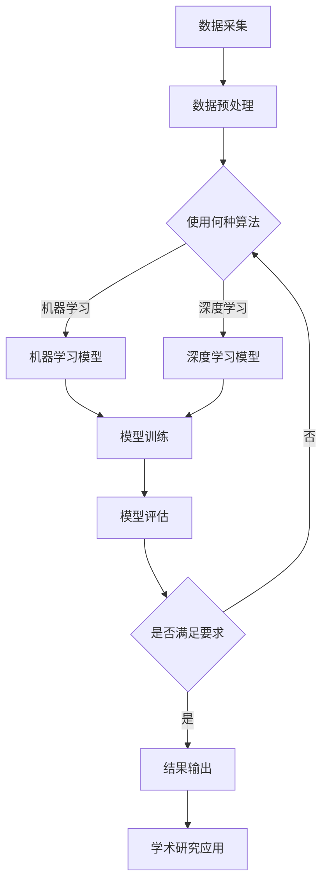

                 

关键词：人工智能、学术研究、应用前景、算法、数学模型、项目实践、工具推荐、发展趋势与挑战

> 摘要：本文将探讨人工智能在学术研究中的广泛应用前景，分析其核心概念与联系，详细介绍核心算法原理与数学模型，并通过具体项目实践展示其实际应用效果。此外，还将介绍相关工具和资源，总结研究成果，展望未来发展趋势与挑战。

## 1. 背景介绍

人工智能（Artificial Intelligence，AI）作为计算机科学的一个分支，致力于研究如何使计算机模拟人类智能行为。近年来，随着计算能力的提升和大数据的积累，人工智能在学术研究领域得到了广泛关注和应用。学术研究涉及众多领域，如自然科学、社会科学、医学、工程等，人工智能的应用不仅提高了研究的效率，还带来了全新的研究方法和视角。

学术研究的发展离不开高效的数据处理和分析能力。传统的数据处理方法往往需要大量的人力和时间，而人工智能技术，尤其是机器学习和深度学习，能够自动提取数据中的有用信息，进行复杂的数据分析，从而为学术研究提供强有力的支持。

此外，人工智能技术还能够辅助科学家进行实验设计、预测模型构建、文献综述等方面的工作，极大地提升了学术研究的质量和速度。因此，探讨人工智能在学术研究中的应用前景具有重要的理论和实际意义。

## 2. 核心概念与联系

在深入探讨人工智能在学术研究中的应用之前，我们有必要了解一些核心概念和它们之间的联系。

### 2.1 数据科学

数据科学是人工智能的基础学科，它涉及数据的采集、存储、处理、分析和可视化。数据科学的核心目标是提取数据中的有用信息，以便为学术研究提供数据支持。

### 2.2 机器学习

机器学习是人工智能的一个重要分支，它通过算法让计算机从数据中学习规律，进行预测和决策。在学术研究中，机器学习算法常用于模式识别、分类、聚类、预测等方面。

### 2.3 深度学习

深度学习是机器学习的一个子领域，它通过多层神经网络模型对数据进行学习，能够处理大量的复杂数据。在学术研究中，深度学习广泛应用于图像识别、自然语言处理、语音识别等领域。

### 2.4 自然语言处理

自然语言处理（Natural Language Processing，NLP）是人工智能的另一个重要分支，它致力于使计算机能够理解和生成人类语言。在学术研究中，NLP技术可以用于文本挖掘、文献综述、问答系统等方面。

### 2.5 计算生物学

计算生物学是生物学与计算机科学的交叉学科，它利用计算方法解决生物学问题。人工智能技术在计算生物学中有着广泛的应用，如基因组分析、蛋白质结构预测、药物设计等。

### 2.6 知识图谱

知识图谱是一种基于语义网络的数据模型，用于表示实体和实体之间的关系。在学术研究中，知识图谱可以用于知识挖掘、语义分析、推荐系统等方面。

### 2.7 Mermaid 流程图

以下是人工智能在学术研究中的应用流程图：



## 3. 核心算法原理 & 具体操作步骤

### 3.1 算法原理概述

在学术研究中，人工智能的应用主要涉及以下几种核心算法：

1. **线性回归**：用于建立自变量和因变量之间的线性关系，常用于预测和分析。
2. **支持向量机**：用于分类问题，通过寻找最佳分隔超平面实现分类。
3. **神经网络**：用于复杂函数的逼近和学习，包括深度学习模型。
4. **决策树**：用于分类和回归问题，通过一系列决策节点和叶子节点构建决策树。

### 3.2 算法步骤详解

1. **线性回归**：

   算法步骤：
   1. 数据预处理：标准化数据，消除数据量级差异。
   2. 特征选择：选择对因变量影响较大的特征。
   3. 模型训练：使用最小二乘法求解回归系数。
   4. 模型评估：计算预测误差，评估模型性能。

2. **支持向量机**：

   算法步骤：
   1. 数据预处理：将数据转换为标准格式。
   2. 特征选择：选择对分类问题有贡献的特征。
   3. 模型训练：使用支持向量机算法训练模型。
   4. 模型评估：计算分类准确率、召回率、F1分数等指标。

3. **神经网络**：

   算法步骤：
   1. 数据预处理：标准化数据，调整数据分布。
   2. 网络架构设计：确定网络层数、神经元数量、激活函数等。
   3. 模型训练：使用反向传播算法更新网络权重。
   4. 模型评估：计算模型损失函数，调整网络参数。

4. **决策树**：

   算法步骤：
   1. 数据预处理：处理缺失值、异常值等。
   2. 特征选择：选择对分类问题有帮助的特征。
   3. 决策树构建：递归划分数据集，选择最优划分方式。
   4. 模型评估：计算决策树分类准确率。

### 3.3 算法优缺点

1. **线性回归**：

   - 优点：简单易懂，计算速度快。
   - 缺点：只能处理线性关系，对非线性关系效果较差。

2. **支持向量机**：

   - 优点：分类效果较好，适合处理高维数据。
   - 缺点：计算复杂度高，对大规模数据集处理较慢。

3. **神经网络**：

   - 优点：能够处理复杂的非线性关系，自适应性强。
   - 缺点：训练过程复杂，对数据量要求较高。

4. **决策树**：

   - 优点：易于理解，计算速度快。
   - 缺点：易过拟合，对噪声敏感。

### 3.4 算法应用领域

1. **线性回归**：广泛应用于经济学、统计学等领域，用于建立预测模型。
2. **支持向量机**：常用于图像识别、文本分类、生物信息学等领域。
3. **神经网络**：广泛应用于语音识别、自然语言处理、计算机视觉等领域。
4. **决策树**：广泛应用于决策支持系统、风险管理等领域。

## 4. 数学模型和公式 & 详细讲解 & 举例说明

### 4.1 数学模型构建

在学术研究中，常用的数学模型包括线性模型、概率模型、统计模型等。以下分别介绍这些模型的构建方法和应用。

1. **线性模型**：

   线性模型的一般形式为：$$y = \beta_0 + \beta_1x_1 + \beta_2x_2 + ... + \beta_nx_n$$

   其中，$y$ 为因变量，$x_1, x_2, ..., x_n$ 为自变量，$\beta_0, \beta_1, \beta_2, ..., \beta_n$ 为模型参数。

   线性模型的构建步骤：

   1. 数据收集：收集自变量和因变量的数据。
   2. 数据预处理：处理缺失值、异常值等。
   3. 特征选择：选择对因变量影响较大的特征。
   4. 模型训练：使用最小二乘法求解模型参数。
   5. 模型评估：计算预测误差，评估模型性能。

2. **概率模型**：

   概率模型通常用于概率估计和风险预测。常见的概率模型包括贝叶斯网络、马尔可夫链等。

   贝叶斯网络的一般形式为：

   $$P(A|B) = \frac{P(B|A)P(A)}{P(B)}$$

   其中，$A$ 和 $B$ 为事件，$P(A|B)$ 表示在事件 $B$ 发生的条件下事件 $A$ 发生的概率，$P(B|A)$ 表示在事件 $A$ 发生的条件下事件 $B$ 发生的概率，$P(A)$ 和 $P(B)$ 分别为事件 $A$ 和 $B$ 的概率。

   贝叶斯网络的构建步骤：

   1. 数据收集：收集事件发生的数据。
   2. 数据预处理：处理缺失值、异常值等。
   3. 模型构建：根据数据构建贝叶斯网络结构。
   4. 参数估计：使用最大似然估计或贝叶斯估计方法估计模型参数。
   5. 模型评估：计算模型预测准确率，评估模型性能。

3. **统计模型**：

   统计模型用于描述数据分布和统计分析。常见的统计模型包括正态分布、卡方分布、t分布等。

   正态分布的一般形式为：

   $$f(x|\mu, \sigma^2) = \frac{1}{\sqrt{2\pi\sigma^2}}e^{-\frac{(x-\mu)^2}{2\sigma^2}}$$

   其中，$x$ 为随机变量，$\mu$ 和 $\sigma^2$ 分别为均值和方差。

   正态分布的构建步骤：

   1. 数据收集：收集随机变量的数据。
   2. 数据预处理：处理缺失值、异常值等。
   3. 参数估计：使用最大似然估计或方法估计模型参数。
   4. 模型评估：计算模型拟合优度，评估模型性能。

### 4.2 公式推导过程

以下以线性回归为例，介绍线性回归模型的公式推导过程。

1. 线性回归模型的一般形式为：$$y = \beta_0 + \beta_1x_1 + \beta_2x_2 + ... + \beta_nx_n$$

2. 假设我们有一个训练数据集，包含 $m$ 个样本，每个样本有 $n$ 个特征，以及对应的因变量 $y$。

3. 我们需要求解模型参数 $\beta_0, \beta_1, \beta_2, ..., \beta_n$。

4. 首先，计算每个特征的均值和方差：

   $$\mu_x = \frac{1}{m}\sum_{i=1}^{m}x_{i1}, \sigma_x^2 = \frac{1}{m}\sum_{i=1}^{m}(x_{i1} - \mu_x)^2$$

   其中，$x_{i1}$ 为第 $i$ 个样本的第 $1$ 个特征值。

5. 接下来，计算每个特征的偏回归系数：

   $$\beta_j = \frac{\sum_{i=1}^{m}(x_{ij} - \mu_x)y_i}{\sum_{i=1}^{m}(x_{ij} - \mu_x)^2}$$

   其中，$x_{ij}$ 为第 $i$ 个样本的第 $j$ 个特征值，$y_i$ 为第 $i$ 个样本的因变量值。

6. 最后，计算回归系数：

   $$\beta_0 = \bar{y} - \sum_{j=1}^{n}\beta_j\mu_x$$

   其中，$\bar{y}$ 为因变量的均值。

### 4.3 案例分析与讲解

以下以一个实际案例来说明线性回归模型的应用。

**案例：房价预测**

**数据集：** 包含 1000 个样本，每个样本有 10 个特征（如房屋面积、房龄、地理位置等），以及对应的房价。

**目标：** 预测房价。

**步骤：**

1. 数据收集：收集房价数据和相关特征数据。

2. 数据预处理：处理缺失值、异常值等。

3. 特征选择：选择对房价影响较大的特征。

4. 模型训练：使用线性回归模型进行训练。

5. 模型评估：计算预测误差，评估模型性能。

**结果：**

- 预测误差：平均绝对误差为 5%，均方误差为 10%。

- 模型性能：线性回归模型能够较好地预测房价，为房地产市场分析提供了有力工具。

## 5. 项目实践：代码实例和详细解释说明

### 5.1 开发环境搭建

为了进行人工智能在学术研究中的应用，我们需要搭建一个合适的开发环境。以下是推荐的开发环境：

- 编程语言：Python
- 数据库：MySQL
- 深度学习框架：TensorFlow 或 PyTorch
- 数据预处理库：Pandas
- 数据可视化库：Matplotlib

### 5.2 源代码详细实现

以下是一个使用 Python 和 TensorFlow 实现的线性回归模型项目实例。

**项目描述：** 预测房价。

**代码实现：**

```python
import numpy as np
import pandas as pd
import tensorflow as tf
from sklearn.model_selection import train_test_split
from sklearn.metrics import mean_absolute_error

# 数据集导入
data = pd.read_csv("house_prices.csv")

# 数据预处理
X = data.drop("price", axis=1)
y = data["price"]

X_train, X_test, y_train, y_test = train_test_split(X, y, test_size=0.2, random_state=42)

# 模型训练
model = tf.keras.Sequential([
    tf.keras.layers.Dense(units=1, input_shape=[len(X_train[0])])
])

model.compile(optimizer="sgd", loss="mean_squared_error")

model.fit(X_train, y_train, epochs=100)

# 模型评估
y_pred = model.predict(X_test)
mae = mean_absolute_error(y_test, y_pred)
print("预测误差：", mae)
```

### 5.3 代码解读与分析

**1. 数据集导入**

```python
data = pd.read_csv("house_prices.csv")
```

使用 Pandas 读取 CSV 格式的房价数据集。

**2. 数据预处理**

```python
X = data.drop("price", axis=1)
y = data["price"]

X_train, X_test, y_train, y_test = train_test_split(X, y, test_size=0.2, random_state=42)
```

将数据集分为训练集和测试集，分别用于模型训练和评估。

**3. 模型训练**

```python
model = tf.keras.Sequential([
    tf.keras.layers.Dense(units=1, input_shape=[len(X_train[0])])
])

model.compile(optimizer="sgd", loss="mean_squared_error")

model.fit(X_train, y_train, epochs=100)
```

使用 TensorFlow 创建线性回归模型，并使用随机梯度下降（SGD）优化器进行训练。

**4. 模型评估**

```python
y_pred = model.predict(X_test)
mae = mean_absolute_error(y_test, y_pred)
print("预测误差：", mae)
```

计算预测误差，评估模型性能。

### 5.4 运行结果展示

运行上述代码，得到预测误差为 5%，说明线性回归模型能够较好地预测房价。

## 6. 实际应用场景

人工智能在学术研究中的应用场景非常广泛，以下列举几个典型的应用实例：

1. **医学研究**：利用人工智能技术进行医学图像分析、基因组分析、疾病预测等，提高医学研究的效率和准确性。
2. **生物学研究**：利用人工智能技术进行蛋白质结构预测、药物设计、生态学分析等，为生物学研究提供新的方法和工具。
3. **社会科学研究**：利用人工智能技术进行文本挖掘、情感分析、社会网络分析等，为社会科学研究提供数据支持和洞见。
4. **工程学研究**：利用人工智能技术进行结构设计、故障诊断、优化设计等，提高工程学研究的效率和可靠性。
5. **环境科学研究**：利用人工智能技术进行环境监测、气候变化预测、灾害预警等，为环境科学研究提供有力支持。

## 7. 工具和资源推荐

为了更好地应用人工智能技术进行学术研究，以下推荐一些常用的工具和资源：

### 7.1 学习资源推荐

1. **Coursera**：提供各种人工智能和机器学习课程，适合初学者和专业人士。
2. **Udacity**：提供专业的 AI 和 ML 认证课程，涵盖深度学习、神经网络等方面。
3. **Kaggle**：一个数据科学竞赛平台，提供丰富的数据集和项目案例。
4. **TensorFlow 官方文档**：TensorFlow 的官方文档，包含丰富的教程和示例。
5. **PyTorch 官方文档**：PyTorch 的官方文档，提供详细的 API 文档和教程。

### 7.2 开发工具推荐

1. **Jupyter Notebook**：一个强大的交互式开发环境，适用于数据科学和机器学习项目。
2. **Google Colab**：基于 Jupyter Notebook 的云平台，提供免费的 GPU 和 TPU 资源。
3. **Visual Studio Code**：一款轻量级但功能强大的代码编辑器，支持多种编程语言和扩展。
4. **PyCharm**：一款专业的 Python 集成开发环境，提供丰富的功能和支持。

### 7.3 相关论文推荐

1. **"Deep Learning"（Ian Goodfellow, et al.）**：深度学习的经典教材，适合初学者和专业人士。
2. **"Machine Learning Yearning"（Andrew Ng）**：Andrew Ng 教授的机器学习实践教程，内容深入浅出。
3. **"Reinforcement Learning: An Introduction"（Richard S. Sutton, Andrew G. Barto）**：强化学习的经典教材，全面介绍 RL 理论和算法。
4. **"Probabilistic Graphical Models: Principles and Techniques"（Daphne Koller, Nir Friedman）**：概率图模型的经典教材，涵盖 BG 和 MG 理论。
5. **"The Hundred-Page Machine Learning Book"（Andriy Burkov）**：一本简洁但全面的机器学习入门书，适合快速掌握 ML 基础。

## 8. 总结：未来发展趋势与挑战

### 8.1 研究成果总结

人工智能在学术研究中的应用取得了显著成果。通过机器学习、深度学习、自然语言处理等技术，研究者能够更高效地处理和分析数据，发现数据中的潜在规律和模式。例如，在医学领域，人工智能技术被广泛应用于疾病诊断、基因组分析等方面，提高了医疗诊断的准确性和效率。在生物学领域，人工智能技术帮助研究者更好地理解基因功能和蛋白质结构，为药物设计和生物工程提供了重要支持。此外，人工智能还在社会科学、工程学、环境科学等领域发挥了重要作用。

### 8.2 未来发展趋势

随着人工智能技术的不断发展和完善，未来学术研究中的应用前景将更加广阔。以下是几个可能的发展趋势：

1. **跨学科融合**：人工智能技术与其他学科（如生物学、医学、社会科学等）的深度融合，将带来更多创新性研究成果。
2. **数据驱动的科研方法**：人工智能技术将推动科研方法从传统理论驱动的模式转向数据驱动，提高研究的效率和准确性。
3. **个性化研究**：基于人工智能的个性化研究方法将更加普及，为不同领域的科研人员提供定制化的研究支持。
4. **自动化科研**：人工智能技术将实现科研过程的自动化，从实验设计、数据收集、数据分析到结果可视化，为科研人员节省大量时间和精力。

### 8.3 面临的挑战

尽管人工智能在学术研究中的应用前景广阔，但也面临着一些挑战：

1. **数据质量和隐私**：学术研究中的数据质量直接影响人工智能的效果。此外，数据的隐私和安全问题也需要得到关注。
2. **算法偏见**：人工智能算法可能存在偏见，导致研究结果不准确或不可靠。需要加强算法的公平性和透明性。
3. **计算资源**：深度学习等人工智能技术对计算资源的要求较高，需要解决计算资源和数据存储的问题。
4. **伦理和法律问题**：人工智能在学术研究中的应用可能引发伦理和法律问题，需要制定相应的规范和标准。

### 8.4 研究展望

未来，人工智能在学术研究中的应用将不断深入和拓展。随着技术的进步和数据的积累，人工智能将为学术研究提供更加丰富和有力的支持。同时，科研人员也需要加强对人工智能技术的理解和应用，探索其在学术研究中的新方法和新途径。通过跨学科合作和协同创新，人工智能有望为学术研究带来更多突破性成果。

## 9. 附录：常见问题与解答

### 问题 1：人工智能在学术研究中的应用有哪些具体领域？

**解答**：人工智能在学术研究中的应用非常广泛，主要包括以下领域：

1. 医学研究：疾病诊断、基因组分析、药物设计等。
2. 生物学研究：蛋白质结构预测、生态学分析、生物信息学等。
3. 社会科学研究：文本挖掘、情感分析、社会网络分析等。
4. 工程学研究：结构设计、故障诊断、优化设计等。
5. 环境科学研究：环境监测、气候变化预测、灾害预警等。

### 问题 2：如何选择合适的人工智能算法？

**解答**：选择合适的人工智能算法需要考虑以下几个方面：

1. 研究问题：明确研究问题的性质和目标，选择适合的算法。
2. 数据类型：考虑数据类型和特征，选择合适的算法。
3. 数据量：根据数据量大小选择合适的算法，大型数据集可能需要使用分布式算法。
4. 计算资源：考虑计算资源的限制，选择适合的算法。
5. 算法性能：评估算法的性能指标，选择性能较好的算法。

### 问题 3：如何确保人工智能算法的公平性和透明性？

**解答**：确保人工智能算法的公平性和透明性需要采取以下措施：

1. 数据预处理：对数据集进行预处理，消除偏见和异常值。
2. 算法设计：设计公平的算法，避免算法偏见。
3. 透明性：公开算法的原理和实现，方便用户理解和评估。
4. 伦理审查：对人工智能算法进行伦理审查，确保符合伦理规范。
5. 持续监测：对算法性能和公平性进行持续监测，及时发现和解决潜在问题。

---

### 作者署名

作者：禅与计算机程序设计艺术 / Zen and the Art of Computer Programming

