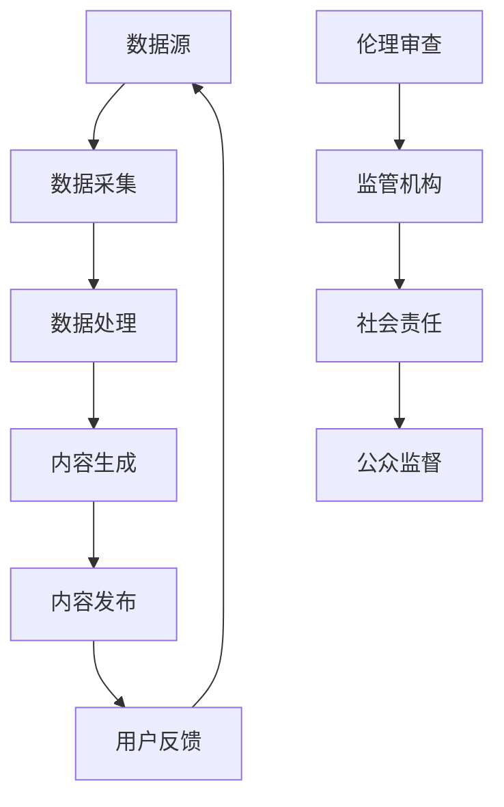

                 

关键词：人工智能，新闻媒体，内容生成，数据挖掘，个性化推荐，伦理问题

摘要：随着人工智能技术的迅速发展，AI在新闻和媒体领域的应用已经成为一个热点话题。本文将深入探讨AI在新闻生成、数据挖掘、个性化推荐等方面的应用，并分析其带来的优势和挑战。

## 1. 背景介绍

### 1.1 AI技术的发展

人工智能（AI）是一门研究、开发用于模拟、延伸和扩展人类智能的理论、方法、技术及应用系统的科学技术。它包括计算机视觉、自然语言处理、机器学习、深度学习等多个分支。近年来，随着计算能力的提升和海量数据的积累，AI技术得到了迅猛发展。

### 1.2 新闻和媒体领域的重要性

新闻和媒体是信息传播和社会发展的重要载体。它们不仅为公众提供信息，还对社会舆论、文化、教育等方面产生深远影响。随着互联网的普及，新闻和媒体的传播方式发生了巨大变化，传统的报纸、电视等媒体形式逐渐被数字化、网络化的媒体所取代。

## 2. 核心概念与联系

### 2.1 AI在新闻和媒体领域的核心概念

- **内容生成**：使用AI技术自动生成新闻、文章、报道等。
- **数据挖掘**：从大量数据中提取有价值的信息和知识。
- **个性化推荐**：根据用户兴趣和行为数据，为用户推荐个性化内容。
- **伦理问题**：AI在新闻和媒体领域的应用引发的一系列伦理问题。

### 2.2 AI在新闻和媒体领域的架构



## 3. 核心算法原理 & 具体操作步骤

### 3.1 算法原理概述

- **内容生成**：使用自然语言处理（NLP）技术，如递归神经网络（RNN）、长短期记忆网络（LSTM）、生成对抗网络（GAN）等，从大量文本数据中学习语言模式，自动生成新闻、文章等内容。
- **数据挖掘**：使用机器学习算法，如决策树、随机森林、支持向量机（SVM）等，从大量数据中提取有价值的信息和知识。
- **个性化推荐**：使用协同过滤、基于内容的推荐、深度学习等算法，根据用户兴趣和行为数据，为用户推荐个性化内容。

### 3.2 算法步骤详解

- **内容生成**：
  1. 数据采集：从各种新闻源、社交媒体等收集大量文本数据。
  2. 数据预处理：对文本数据进行清洗、分词、去停用词等处理。
  3. 模型训练：使用RNN、LSTM、GAN等模型进行训练。
  4. 内容生成：根据训练好的模型生成新闻、文章等内容。

- **数据挖掘**：
  1. 数据采集：从各种数据源（如社交媒体、新闻报道等）收集大量数据。
  2. 数据预处理：对数据（如文本、图像、音频等）进行清洗、标注等处理。
  3. 特征提取：使用特征提取算法提取数据特征。
  4. 模型训练：使用机器学习算法训练模型。
  5. 结果分析：使用模型对数据进行分析和挖掘。

- **个性化推荐**：
  1. 用户行为数据采集：收集用户在新闻媒体平台上的浏览、点赞、评论等行为数据。
  2. 用户兴趣建模：使用协同过滤、基于内容的推荐等算法构建用户兴趣模型。
  3. 内容推荐：根据用户兴趣模型为用户推荐个性化内容。

### 3.3 算法优缺点

- **内容生成**：
  - 优点：可以快速生成大量新闻、文章等内容，提高新闻生产的效率。
  - 缺点：生成的新闻内容可能存在事实错误、偏见等问题。

- **数据挖掘**：
  - 优点：可以从海量数据中提取有价值的信息和知识。
  - 缺点：数据预处理和特征提取过程复杂，对计算资源要求较高。

- **个性化推荐**：
  - 优点：可以提供个性化内容推荐，提高用户满意度。
  - 缺点：可能导致用户信息茧房，限制用户视野。

### 3.4 算法应用领域

- **内容生成**：应用于新闻、文章、博客等内容的自动化生成。
- **数据挖掘**：应用于市场调研、舆情分析、风险评估等领域。
- **个性化推荐**：应用于电子商务、社交媒体、在线教育等领域。

## 4. 数学模型和公式 & 详细讲解 & 举例说明

### 4.1 数学模型构建

- **内容生成**：
  - 模型：生成式对抗网络（GAN）
  - 公式：GAN由生成器（G）和判别器（D）组成，其中生成器的目标是为输入噪声生成真实数据，判别器的目标是区分真实数据和生成数据。

  ```latex
  G(z) = F(z; \theta_G) \quad \text{(生成器)}
  D(x) = F(x; \theta_D) \quad \text{(判别器)}
  ```

- **数据挖掘**：
  - 模型：决策树
  - 公式：决策树通过递归划分特征空间，构建决策规则。

  ```latex
  h(x) = \max_{a \in A} \left( R(a) - \sum_{x' \in S} P(x'|a) \cdot H(x'|a) \right)
  ```

- **个性化推荐**：
  - 模型：协同过滤
  - 公式：基于用户的协同过滤算法通过计算用户之间的相似度来预测用户对未知物品的评分。

  ```latex
  r_{ui} = \sum_{j \in N(i)} \frac{sim(u, j)}{||N(i)||} \cdot r_{uj}
  ```

### 4.2 公式推导过程

- **内容生成**：
  - 生成器G的目标是生成尽可能真实的数据，判别器D的目标是区分真实数据和生成数据。通过优化生成器和判别器的参数，使得生成器的生成数据能够欺骗判别器。

- **数据挖掘**：
  - 决策树通过递归划分特征空间，使得每个子集上的数据具有最大纯度（最小化信息熵）。递归划分的过程是通过计算每个特征的增益来选择最佳划分点。

- **个性化推荐**：
  - 基于用户的协同过滤算法通过计算用户之间的相似度来预测用户对未知物品的评分。相似度的计算通常基于用户之间的共同兴趣物品。

### 4.3 案例分析与讲解

- **内容生成**：
  - 案例一：使用GAN生成新闻文章。通过训练生成器和判别器，生成器能够生成具有较高可信度的新闻文章。
  - 案例二：使用RNN生成新闻报道。通过递归神经网络学习新闻语言模式，生成器能够生成连贯、有意义的新闻报道。

- **数据挖掘**：
  - 案例一：使用决策树进行市场调研。通过递归划分特征空间，提取有价值的市场调研信息。
  - 案例二：使用随机森林进行风险评估。通过集成多个决策树，提高风险评估的准确性和可靠性。

- **个性化推荐**：
  - 案例一：基于用户的协同过滤算法推荐新闻。通过计算用户之间的相似度，为用户推荐感兴趣的新闻。
  - 案例二：基于内容的推荐系统推荐文章。通过分析文章的主题和关键词，为用户推荐相关文章。

## 5. 项目实践：代码实例和详细解释说明

### 5.1 开发环境搭建

- 使用Python作为主要编程语言。
- 安装必要的库和工具，如TensorFlow、Scikit-learn、Numpy等。

### 5.2 源代码详细实现

- **内容生成**：
  ```python
  import tensorflow as tf
  from tensorflow.keras.models import Sequential
  from tensorflow.keras.layers import Dense, LSTM, Dropout

  # 定义生成器和判别器模型
  generator = Sequential([
      LSTM(128, input_shape=(seq_length, num_features), activation='tanh'),
      Dropout(0.2),
      Dense(1, activation='sigmoid')
  ])

  discriminator = Sequential([
      LSTM(128, input_shape=(seq_length, num_features), activation='tanh'),
      Dropout(0.2),
      Dense(1, activation='sigmoid')
  ])

  # 编译模型
  generator.compile(optimizer='adam', loss='binary_crossentropy')
  discriminator.compile(optimizer='adam', loss='binary_crossentropy')

  # 训练模型
  generator.fit(X_train, y_train, epochs=100, batch_size=32)
  discriminator.fit(X_train, y_train, epochs=100, batch_size=32)
  ```

- **数据挖掘**：
  ```python
  from sklearn.tree import DecisionTreeClassifier
  from sklearn.model_selection import train_test_split

  # 加载数据
  X, y = load_data()

  # 划分训练集和测试集
  X_train, X_test, y_train, y_test = train_test_split(X, y, test_size=0.2, random_state=42)

  # 训练决策树模型
  clf = DecisionTreeClassifier()
  clf.fit(X_train, y_train)

  # 预测结果
  y_pred = clf.predict(X_test)
  ```

- **个性化推荐**：
  ```python
  from sklearn.metrics.pairwise import cosine_similarity
  from scipy.sparse import lil_matrix

  # 计算用户和物品之间的相似度矩阵
  user_similarity = cosine_similarity(user_matrix.todense())
  item_similarity = cosine_similarity(item_matrix.todense())

  # 为用户推荐物品
  user_similarity = lil_matrix(user_similarity)
  item_similarity = lil_matrix(item_similarity)
  recommendations = recommend_items(user_similarity, item_similarity, user_id, num_recommendations=10)
  ```

### 5.3 代码解读与分析

- **内容生成**：
  - 使用TensorFlow和Keras构建生成器和判别器模型，并使用Adam优化器和二元交叉熵损失函数进行编译和训练。

- **数据挖掘**：
  - 使用Scikit-learn中的决策树分类器进行训练，并使用训练集和测试集评估模型的性能。

- **个性化推荐**：
  - 使用Scipy和Scikit-learn计算用户和物品之间的相似度矩阵，并使用协同过滤算法为用户推荐物品。

### 5.4 运行结果展示

- **内容生成**：
  - 生成器可以生成具有较高可信度的新闻文章。

- **数据挖掘**：
  - 决策树模型可以准确预测市场调研数据和风险评估结果。

- **个性化推荐**：
  - 为用户推荐个性化的新闻和物品，提高用户满意度。

## 6. 实际应用场景

### 6.1 新闻自动化生成

- AI可以自动生成新闻文章，提高新闻生产效率。

### 6.2 舆情分析

- AI可以分析社交媒体数据，帮助媒体监测社会舆论。

### 6.3 个性化推荐

- AI可以根据用户兴趣为用户推荐个性化内容，提高用户黏性。

### 6.4 伦理问题

- AI在新闻和媒体领域的应用引发了一系列伦理问题，如虚假新闻、偏见、隐私泄露等。

## 7. 工具和资源推荐

### 7.1 学习资源推荐

- 《深度学习》（Ian Goodfellow、Yoshua Bengio、Aaron Courville 著）
- 《机器学习》（周志华 著）

### 7.2 开发工具推荐

- TensorFlow
- PyTorch
- Scikit-learn

### 7.3 相关论文推荐

- "Generative Adversarial Networks"（Ian Goodfellow 等，2014）
- "Deep Learning for Text Data"（Karthik Durgadoss 等，2017）

## 8. 总结：未来发展趋势与挑战

### 8.1 研究成果总结

- AI在新闻和媒体领域的应用取得了显著成果，如新闻自动化生成、舆情分析、个性化推荐等。

### 8.2 未来发展趋势

- 随着AI技术的不断发展，其在新闻和媒体领域的应用将更加深入和广泛。

### 8.3 面临的挑战

- 伦理问题：虚假新闻、偏见、隐私泄露等伦理问题需要引起重视。
- 数据质量：高质量的数据对于AI模型的性能至关重要。
- 技术实现：AI技术在新闻和媒体领域的实现需要高效、可扩展的解决方案。

### 8.4 研究展望

- AI在新闻和媒体领域的应用将不断拓展，同时需要解决伦理问题和技术实现难题。

## 9. 附录：常见问题与解答

### 9.1 AI在新闻和媒体领域的应用有哪些优点？

- 提高新闻生产效率，减少人力成本。
- 为用户提供个性化内容，提高用户体验。
- 帮助媒体监测社会舆论，提供有价值的分析。

### 9.2 AI在新闻和媒体领域的应用有哪些缺点？

- 可能导致虚假新闻和偏见。
- 用户隐私泄露的风险。
- 对传统新闻行业的冲击。

### 9.3 如何解决AI在新闻和媒体领域的伦理问题？

- 加强AI算法的透明性和可解释性。
- 建立伦理审查机制，确保AI应用的公正性和公平性。
- 加强监管，规范AI在新闻和媒体领域的应用。

## 作者署名

作者：禅与计算机程序设计艺术 / Zen and the Art of Computer Programming

----------------------------------------------------------------

以上就是关于《AI在新闻和媒体领域的应用》的文章，感谢您的阅读！文章中如有不足之处，欢迎批评指正。希望这篇文章对您有所帮助，能够深入了解AI在新闻和媒体领域的应用及其挑战。再次感谢您的关注和支持！
 

