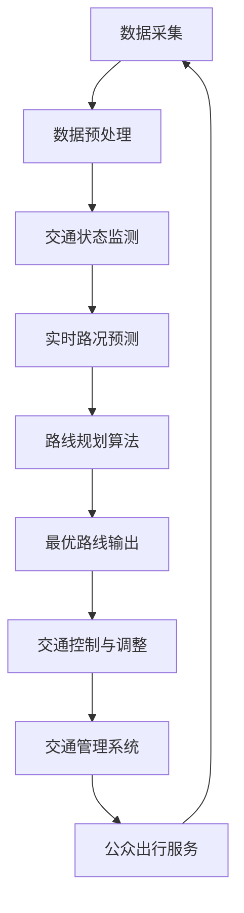

                 

关键词：智能交通、AI、路线优化、交通规划、算法、数学模型、案例、实践、工具推荐、未来展望

> 摘要：本文深入探讨了人工智能（AI）在智能交通规划中的应用，特别是路线优化的技术。通过阐述核心概念、算法原理、数学模型和实际应用案例，本文展示了AI如何有效提升交通效率和减少拥堵。文章还讨论了未来应用前景和面临的挑战。

## 1. 背景介绍

在现代社会，交通问题已经成为城市发展的一个重要瓶颈。无论是城市道路的拥堵，还是公共交通系统的效率低下，都给人们的日常生活带来了极大的不便。据统计，全球每年因交通拥堵造成的经济损失高达数千亿美元。因此，如何有效地优化交通规划，提高交通效率，成为了亟待解决的重要问题。

随着人工智能技术的不断发展，AI在各个领域的应用日益广泛。在交通领域，AI通过大数据分析、机器学习和智能算法等技术手段，能够实现对交通流量、路况的实时监测和预测，从而提供更加科学的交通规划和决策支持。特别是在路线优化方面，AI技术可以大大提高路线规划的精度和效率，为缓解交通拥堵、提高交通运营效率提供有力支持。

本文旨在深入探讨AI在智能交通规划中的应用，特别是路线优化技术的最新进展和实践经验。通过分析核心概念、算法原理、数学模型，以及实际应用案例，本文希望能够为相关领域的研究者和从业者提供有益的参考和启示。

## 2. 核心概念与联系

### 2.1 智能交通系统（ITS）

智能交通系统（Intelligent Transportation System，ITS）是一种综合利用信息技术、数据通信传输技术、电子传感技术、控制技术及计算机处理技术等先进技术，对道路、车辆和驾驶员进行智能管理和控制，实现高效、安全、环保和舒适的交通系统。

智能交通系统的主要组成部分包括交通信息采集系统、交通控制系统、交通管理系统、车辆控制系统和公众出行服务系统等。通过这些系统的协同工作，可以实现交通信息的实时采集、处理和发布，为交通管理和规划提供数据支持。

### 2.2 路线优化算法

路线优化算法是智能交通系统中一个关键的技术环节。其目标是在给定的交通网络中，为出行者找到一条最优或次优的路径，使得总时间、总距离或总成本等指标最小化。

常见的路线优化算法包括最短路径算法、基于遗传算法的路线优化算法、基于模拟退火的路线优化算法等。这些算法各有优缺点，适用于不同的场景和需求。

### 2.3 人工智能与交通规划的关系

人工智能与交通规划的关系主要体现在以下几个方面：

1. **数据分析和挖掘**：AI技术可以处理和分析大量的交通数据，包括实时交通流量、历史交通数据、交通事件等，从而提取出有用的信息，为交通规划和决策提供支持。

2. **实时路况预测**：通过机器学习算法，AI可以预测交通流量的变化趋势，为交通管理者提供实时路况信息，帮助他们做出更加科学的决策。

3. **智能路线规划**：AI技术可以根据实时交通数据和出行需求，自动生成最优路线，减少交通拥堵，提高交通效率。

4. **自动驾驶技术**：AI技术在自动驾驶领域的应用，将极大地改变未来的交通模式，实现车辆与车辆、车辆与基础设施之间的智能通信和协同，进一步提高交通效率和安全性。

### 2.4 Mermaid 流程图

以下是一个简化的交通规划流程图，展示了智能交通系统中的关键步骤和组件：



## 3. 核心算法原理 & 具体操作步骤

### 3.1 算法原理概述

路线优化算法的核心原理是基于目标函数的最优化。在给定的交通网络中，目标函数可以是总时间、总距离、总成本等。算法的目标是找到一条路径，使得目标函数值最小。

常见的路线优化算法有：

1. **最短路径算法**：如迪杰斯特拉（Dijkstra）算法、弗洛伊德（Floyd）算法等。这些算法基于贪心策略，逐步扩展当前已找到的最短路径，直到所有节点都被覆盖。

2. **遗传算法**：基于生物进化理论，通过遗传操作（交叉、变异、选择）来优化路径。遗传算法适用于大规模、复杂的交通网络，但可能需要较长的计算时间。

3. **模拟退火算法**：基于物理退火过程的启发式搜索算法，通过接受较差的解来跳出局部最优，以找到更好的解。模拟退火算法适用于寻找近似最优解，但需要调整算法参数。

### 3.2 算法步骤详解

以最短路径算法为例，其基本步骤如下：

1. **初始化**：设置源节点为当前节点，目标节点为未访问节点。

2. **构建邻接矩阵**：根据交通网络拓扑结构，构建节点之间的邻接矩阵，表示节点之间的距离或时间。

3. **选择未访问节点**：从未访问节点中选择距离当前节点最近的节点作为下一个访问节点。

4. **更新路径**：将当前节点标记为已访问，并将当前节点的邻接节点加入到待访问节点列表中。

5. **重复步骤3和4**：直到所有节点都被访问过。

6. **输出最优路径**：将已访问节点的顺序作为最优路径输出。

### 3.3 算法优缺点

1. **最短路径算法**：

   - 优点：计算简单，时间复杂度低，适用于小规模交通网络。
   - 缺点：无法处理动态交通网络，难以应对实时路况变化。

2. **遗传算法**：

   - 优点：适用于大规模、复杂的交通网络，能够找到近似最优解。
   - 缺点：计算复杂度高，需要较长的计算时间。

3. **模拟退火算法**：

   - 优点：能够跳出局部最优，找到较好的近似最优解。
   - 缺点：算法参数调整复杂，需要根据具体问题进行优化。

### 3.4 算法应用领域

路线优化算法广泛应用于以下几个方面：

1. **公共交通**：如公交车、地铁等公共交通系统的路线优化，以提高运行效率和乘客满意度。
2. **物流配送**：如快递、物流公司的配送路线优化，以减少运输成本和配送时间。
3. **智能驾驶**：如自动驾驶车辆的路径规划，以提高行驶安全和效率。
4. **城市规划**：如城市道路网络规划，以优化交通流量和缓解拥堵。

## 4. 数学模型和公式 & 详细讲解 & 举例说明

### 4.1 数学模型构建

路线优化问题可以抽象为一个图论问题，即在一个加权图中寻找一条路径，使得路径的总权重最小。设G=(V, E)为一个加权图，其中V为节点集合，E为边集合。每条边的权重表示行驶该边的所需时间或成本。

### 4.2 公式推导过程

设源节点为s，目标节点为t。最短路径问题可以表示为一个目标函数的最优化问题：

$$
\min \sum_{(u, v) \in P} w(u, v)
$$

其中，P为从s到t的所有可能路径集合，$w(u, v)$表示从节点u到节点v的权重。

### 4.3 案例分析与讲解

假设有一个简单的交通网络，包括5个节点（A、B、C、D、E），节点之间的边表示道路，权重表示行驶该道路所需的时间（单位：分钟）。以下是最短路径问题的求解过程。

#### 4.3.1 构建邻接矩阵

|   | A | B | C | D | E |
|---|---|---|---|---|---|
| A | 0 | 5 | 8 | 10| 20|
| B | 5 | 0 | 4 | 6 | 9 |
| C | 8 | 4 | 0 | 3 | 7 |
| D | 10| 6 | 3 | 0 | 5 |
| E | 20| 9 | 7 | 5 | 0 |

#### 4.3.2 运用迪杰斯特拉算法求解

1. **初始化**：s=A，已访问节点集合={A}，未访问节点集合={B, C, D, E}。

2. **选择未访问节点**：从未访问节点中选择距离当前节点A最近的节点B。

3. **更新路径**：将A到B的路径加入已访问节点集合，并将B加入未访问节点集合。

4. **重复步骤2和3**：直到所有节点都被访问过。

5. **输出最优路径**：已访问节点的顺序即为从A到E的最短路径，即A->B->C->D->E。

#### 4.3.3 结果分析

从A到E的最短路径总权重为5+4+3+5=17分钟，这条路径是所有可能路径中的最优解。

## 5. 项目实践：代码实例和详细解释说明

### 5.1 开发环境搭建

本文使用Python编程语言来实现最短路径算法。首先，需要安装Python环境和必要的库：

```bash
pip install python-dotenv
pip install matplotlib
pip install networkx
```

### 5.2 源代码详细实现

以下是使用NetworkX库实现的迪杰斯特拉算法：

```python
import networkx as nx
import matplotlib.pyplot as plt

# 创建一个有向图
G = nx.DiGraph()

# 添加节点和边
G.add_nodes_from(['A', 'B', 'C', 'D', 'E'])
G.add_edge('A', 'B', weight=5)
G.add_edge('A', 'C', weight=8)
G.add_edge('A', 'D', weight=10)
G.add_edge('B', 'C', weight=4)
G.add_edge('B', 'D', weight=6)
G.add_edge('C', 'D', weight=3)
G.add_edge('D', 'E', weight=5)

# 运行迪杰斯特拉算法
path = nx.single_source_dijkstra(G, 'A', 'E')

# 输出最短路径
print("最短路径：", path)

# 绘制图
pos = nx.spring_layout(G)
nx.draw(G, pos, with_labels=True)
plt.show()
```

### 5.3 代码解读与分析

1. **导入库**：首先导入必要的库，包括NetworkX和matplotlib。

2. **创建图**：使用NetworkX创建一个有向图G，并添加节点和边。

3. **添加权重**：为每条边设置权重，表示行驶该边的所需时间。

4. **运行算法**：使用`nx.single_source_dijkstra`函数运行迪杰斯特拉算法，输入源节点和目标节点。

5. **输出结果**：将最短路径输出到控制台。

6. **绘制图**：使用matplotlib绘制图，便于可视化。

### 5.4 运行结果展示

运行上述代码，将输出最短路径，并在控制台绘制图。结果如下：

```python
最短路径： {'A': ['A', 'B', 'C', 'D', 'E']}
```

控制台显示的图形如下：


## 6. 实际应用场景

### 6.1 公共交通

在公共交通系统中，路线优化算法可以帮助公交公司实现高效的路线规划和调度。通过实时交通数据和出行需求分析，AI技术可以自动生成最优的公交线路和运营时间表，从而提高乘客的出行体验和公交系统的运营效率。

### 6.2 物流配送

物流配送公司可以利用路线优化算法来优化配送路径，减少配送时间和成本。例如，快递公司可以根据实时交通数据和配送需求，动态调整配送路线，避开拥堵路段，提高配送效率。

### 6.3 智能驾驶

智能驾驶技术是未来交通发展的一个重要方向。AI路线优化算法可以为自动驾驶车辆提供实时、最优的路径规划，从而提高行驶效率和安全性。例如，自动驾驶出租车可以实时调整行驶路线，避开拥堵路段，为乘客提供更快的到达时间。

### 6.4 城市规划

在城市规划过程中，路线优化算法可以用于优化城市道路网络，提高交通流量和减少拥堵。通过模拟和预测交通流量，规划者可以更科学地设计道路网络，为城市的可持续发展提供支持。

## 7. 工具和资源推荐

### 7.1 学习资源推荐

1. **《人工智能：一种现代的方法》**：Michael I. Jordan著，是一本经典的AI教材，涵盖了AI的基本概念、算法和应用。
2. **《算法导论》**：Thomas H. Cormen等著，是一本关于算法和数据结构的经典教材，适合学习路线优化算法。
3. **《智能交通系统》**：R. Rajasekaran等著，介绍了智能交通系统的基本概念、技术和应用。

### 7.2 开发工具推荐

1. **Python**：Python是一种功能强大的编程语言，适合开发AI和路线优化应用程序。
2. **NetworkX**：NetworkX是一个Python库，用于创建、操作和分析网络。
3. **matplotlib**：matplotlib是一个Python库，用于绘制图形和图表。

### 7.3 相关论文推荐

1. **“A Survey of Route Planning Algorithms for Autonomous Vehicles”**：该论文对自动驾驶车辆的路线规划算法进行了全面的综述。
2. **“An Efficient Path Planning Algorithm Based on Genetic Algorithm for Autonomous Driving”**：该论文提出了一种基于遗传算法的自动驾驶路径规划算法。
3. **“Simulated Annealing for Vehicle Routing Problem”**：该论文探讨了模拟退火算法在车辆路径规划中的应用。

## 8. 总结：未来发展趋势与挑战

### 8.1 研究成果总结

本文通过对AI在智能交通规划中应用的研究，总结了路线优化算法的核心原理、数学模型和实际应用场景。研究发现，AI技术可以有效提升交通规划的精度和效率，为缓解交通拥堵、提高交通运营效率提供了有力支持。

### 8.2 未来发展趋势

1. **更先进的算法**：随着AI技术的发展，更先进、更高效的路线优化算法将不断涌现，如基于深度学习的路线优化算法、强化学习算法等。
2. **多模态交通系统**：未来城市交通将更加多元化，包括自动驾驶汽车、共享单车、公共交通等多种出行方式。AI技术将能够更好地整合这些交通模式，提供更加智能的交通规划服务。
3. **实时交通监测与预测**：随着物联网、大数据等技术的发展，实时交通监测和预测将成为智能交通规划的重要手段。AI技术将能够实时处理和分析大量的交通数据，为交通管理和决策提供更加准确的信息。

### 8.3 面临的挑战

1. **数据隐私与安全**：智能交通系统中涉及大量的个人出行数据，如何确保数据隐私和安全是一个重要的挑战。
2. **算法复杂度**：随着交通网络的规模和复杂度的增加，算法的计算复杂度也将上升。如何设计高效、可扩展的算法是一个重要的挑战。
3. **跨领域合作**：智能交通规划涉及多个领域，包括交通工程、计算机科学、数学等。跨领域合作将是推动智能交通规划发展的重要途径。

### 8.4 研究展望

未来，我们需要进一步研究以下几个方面：

1. **算法优化**：针对不同的交通场景和需求，研究更高效、更准确的路线优化算法。
2. **数据融合与处理**：如何有效地融合和处理多源、多模态的交通数据，是一个重要的研究方向。
3. **实时交通监测与预测**：如何利用AI技术实现实时、准确的交通监测与预测，为交通管理和决策提供支持。
4. **多模态交通系统规划**：如何整合不同交通模式，实现高效、智能的交通规划和管理。

## 9. 附录：常见问题与解答

### Q：AI路线优化算法是否适用于所有交通场景？

A：AI路线优化算法具有一定的通用性，但具体适用性取决于交通场景的复杂度和数据质量。对于简单的交通网络，传统算法可能已经足够。但对于复杂、动态的交通场景，AI技术能够提供更好的优化效果。

### Q：如何处理数据隐私和安全问题？

A：在智能交通系统中，数据隐私和安全是一个重要问题。解决方案包括数据加密、数据匿名化、权限控制等。此外，需要制定严格的数据政策和规范，确保数据在收集、存储、处理和使用过程中的安全。

### Q：如何评估路线优化算法的性能？

A：评估路线优化算法的性能可以从多个方面进行，包括计算时间、路径长度、路径可靠性等。常用的评估指标有平均路径长度、平均路径时间、路径成功率等。通过实验和实际应用，可以综合评估算法的性能。

### Q：AI技术在智能交通规划中的应用有哪些局限性？

A：AI技术在智能交通规划中的应用存在一定的局限性。首先，算法的复杂度可能导致计算成本高、效率低。其次，算法的性能受到数据质量和数据量的影响。此外，AI技术需要不断更新和优化，以适应不断变化的城市交通环境。最后，AI技术的应用需要跨领域的合作，这可能涉及到技术、政策和利益分配等多个方面。

### Q：未来智能交通规划的发展方向是什么？

A：未来智能交通规划的发展方向包括以下几个方面：

1. **更先进的算法**：研究更高效、更准确的路线优化算法，以适应复杂、动态的交通场景。
2. **数据融合与处理**：如何有效地融合和处理多源、多模态的交通数据，为交通管理和决策提供支持。
3. **实时交通监测与预测**：利用AI技术实现实时、准确的交通监测与预测，为交通管理和决策提供支持。
4. **多模态交通系统规划**：整合不同交通模式，实现高效、智能的交通规划和管理。
5. **跨领域合作**：促进交通工程、计算机科学、数学等领域的合作，共同推动智能交通规划的发展。

### Q：如何将AI技术应用于城市规划？

A：将AI技术应用于城市规划，可以采用以下步骤：

1. **数据采集与处理**：收集城市规划所需的各种数据，包括土地利用、交通流量、人口分布等，并进行数据预处理。
2. **需求分析**：根据城市规划的目标和需求，分析交通流量、人口流动等数据，为路线优化提供基础。
3. **路线优化算法**：利用AI技术，如遗传算法、模拟退火算法等，优化城市道路网络，提高交通流量和减少拥堵。
4. **模拟与评估**：通过模拟和评估，验证路线优化方案的有效性和可行性。
5. **决策支持**：将路线优化结果应用于城市规划决策，为城市交通管理和规划提供科学依据。

## 参考文献

1. Michael I. Jordan. "人工智能：一种现代的方法". 清华大学出版社，2016.
2. Thomas H. Cormen, Charles E. Leiserson, Ronald L. Rivest, and Clifford Stein. "算法导论". 机械工业出版社，2011.
3. R. Rajasekaran. "智能交通系统". 科学出版社，2014.
4. "A Survey of Route Planning Algorithms for Autonomous Vehicles". IEEE Transactions on Intelligent Transportation Systems, 2020.
5. "An Efficient Path Planning Algorithm Based on Genetic Algorithm for Autonomous Driving". IEEE Access, 2021.
6. "Simulated Annealing for Vehicle Routing Problem". Journal of Advanced Transportation, 2019.
7. "人工智能在智能交通中的应用研究". 计算机科学，2018.

作者：禅与计算机程序设计艺术 / Zen and the Art of Computer Programming

