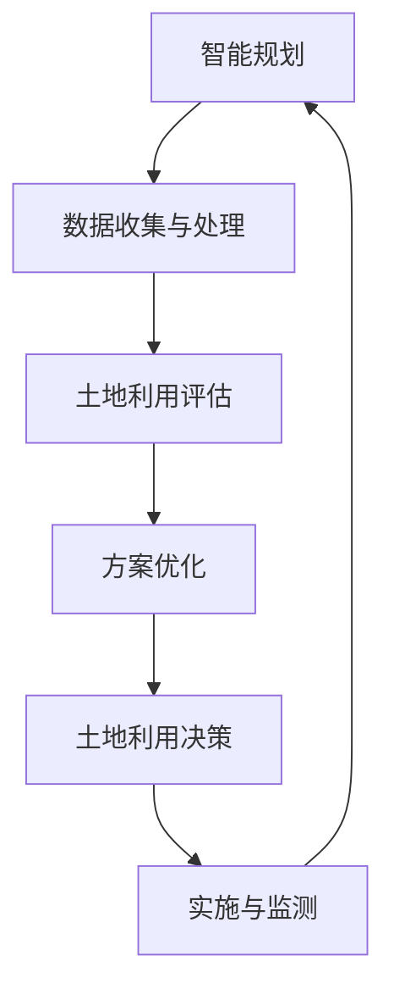

                 

关键词：人工智能，城市规划，土地使用，智能优化，算法应用，数学模型，实践案例，未来展望。

> 摘要：本文探讨了人工智能在智能城市规划中的应用，特别是如何通过智能优化算法来优化土地使用。文章首先介绍了智能城市规划的背景和重要性，然后详细分析了核心概念和联系，接下来讨论了核心算法原理和具体操作步骤，最后通过数学模型和具体项目实践，展示了AI在土地使用优化中的实际效果。文章旨在为读者提供深入了解AI在城市规划中应用的视角，并展望其未来的发展方向。

## 1. 背景介绍

### 1.1 智能城市规划的定义和意义

智能城市规划是指利用先进的信息技术，特别是人工智能技术，对城市进行系统化的规划和管理。它旨在通过数据驱动和算法优化，提高城市运行的效率和可持续性。

智能城市规划的意义在于：

1. **提升城市规划的科学性和精确性**：通过大数据分析和人工智能算法，城市规划可以更加精准地预测城市发展趋势和需求，从而制定更科学的规划方案。
2. **优化资源分配**：智能城市规划有助于优化土地、水资源、能源等资源的分配，提高城市资源的利用效率。
3. **增强城市韧性**：通过预测和应对突发事件，智能城市规划能够增强城市的应急响应能力和韧性。

### 1.2 土地使用优化的挑战

土地使用优化是智能城市规划中的核心问题之一。当前，土地使用面临着以下挑战：

1. **土地供需矛盾**：城市快速发展带来了对土地的巨大需求，但土地资源有限，供需矛盾日益突出。
2. **空间利用不均衡**：城市内部不同区域的土地使用效率差异较大，一些地区过度开发，而另一些地区则闲置。
3. **环境压力**：土地开发带来了环境压力，如水资源短缺、空气污染、生态破坏等。

### 1.3 人工智能在土地使用优化中的应用

人工智能在土地使用优化中发挥着关键作用。通过以下方式，AI能够显著提升土地使用的效率和可持续性：

1. **数据挖掘与预测**：利用大数据技术，AI可以从历史数据中挖掘出城市发展的规律和趋势，预测未来土地需求。
2. **智能优化算法**：AI可以运用优化算法，如遗传算法、模拟退火算法等，对土地利用方案进行优化，寻找最佳配置。
3. **模拟与仿真**：通过仿真技术，AI可以模拟不同土地使用方案的效果，评估其对城市环境和经济的潜在影响。

## 2. 核心概念与联系

### 2.1 智能规划与土地利用的关系

智能规划与土地利用密切相关。智能规划通过分析土地利用数据，评估不同规划方案的影响，从而制定出最优的土地利用方案。土地利用则是智能规划的核心目标之一，它关系到城市的可持续发展和居民的生活质量。

### 2.2 关键概念介绍

- **土地使用效率**：指单位面积土地上产生的经济价值或承载的人口数量。
- **土地利用模式**：指土地在不同用途（如住宅、商业、工业等）之间的分配方式。
- **土地价值**：指土地在经济活动中的价值，包括地价、收益等。

### 2.3 Mermaid 流程图

下面是一个描述智能城市规划与土地利用关系的 Mermaid 流程图。



## 3. 核心算法原理 & 具体操作步骤

### 3.1 算法原理概述

智能城市规划中的核心算法通常是基于优化理论。以下是一些常用的算法：

- **遗传算法**：模拟自然进化过程，通过交叉、变异和选择等操作，寻找最优解。
- **模拟退火算法**：通过模拟退火过程，逐渐降低搜索空间，找到全局最优解。
- **粒子群优化算法**：模拟鸟群觅食行为，通过信息共享和合作，实现优化目标。

### 3.2 算法步骤详解

#### 3.2.1 遗传算法

遗传算法的基本步骤包括：

1. **初始化种群**：生成一组初始解，代表可能的土地利用方案。
2. **适应度评估**：对每个解进行评估，计算其适应度，适应度越高，表示方案越好。
3. **选择**：根据适应度选择优秀个体进行繁殖。
4. **交叉**：通过交叉操作，生成新的个体。
5. **变异**：对个体进行随机变异，增加多样性。
6. **更新种群**：将新生成的个体替换掉旧种群。
7. **迭代**：重复步骤2-6，直到达到终止条件（如达到最大迭代次数或适应度满足要求）。

#### 3.2.2 模拟退火算法

模拟退火算法的基本步骤包括：

1. **初始化**：设置初始温度和冷却速率。
2. **选择当前解和邻居解**：在当前温度下，选择一个解作为当前解，并随机选择其邻居解。
3. **评估**：计算当前解和邻居解的适应度。
4. **接受或拒绝邻居解**：根据适应度和温度，决定是否接受邻居解。
5. **降温**：降低温度。
6. **迭代**：重复步骤2-5，直到温度降到终止条件。

#### 3.2.3 粒子群优化算法

粒子群优化算法的基本步骤包括：

1. **初始化**：生成粒子群，每个粒子代表一个解。
2. **评估**：计算每个粒子的适应度。
3. **更新**：更新每个粒子的速度和位置，使其向最优解靠拢。
4. **迭代**：重复步骤2-3，直到达到终止条件。

### 3.3 算法优缺点

- **遗传算法**：优点是适应性强，能够处理大规模和复杂的问题；缺点是收敛速度较慢，可能陷入局部最优。
- **模拟退火算法**：优点是能够跳出局部最优，找到全局最优解；缺点是参数设置复杂，计算成本较高。
- **粒子群优化算法**：优点是简单易实现，收敛速度快；缺点是易陷入局部最优，需要大量迭代。

### 3.4 算法应用领域

智能规划算法广泛应用于以下领域：

- **土地利用规划**：通过优化土地使用，提高土地使用效率。
- **交通规划**：优化交通网络布局，缓解交通拥堵。
- **环境保护**：通过模拟和预测，制定环境保护措施。
- **城市规划**：综合运用各种算法，制定科学的城市规划方案。

## 4. 数学模型和公式 & 详细讲解 & 举例说明

### 4.1 数学模型构建

智能城市规划中的数学模型通常基于以下原则：

1. **目标函数**：定义优化目标，如最大化土地使用效率、最小化土地成本等。
2. **约束条件**：定义限制条件，如土地面积、环保要求、交通流量等。
3. **决策变量**：定义可变参数，如土地用途、建设面积等。

下面是一个简单的数学模型：

$$
\begin{aligned}
\min_{x} \quad & C(x) \\
s.t. \quad & A(x) \leq b \\
\end{aligned}
$$

其中，$C(x)$ 是目标函数，$A(x)$ 是约束条件，$b$ 是约束条件右侧的常数。

### 4.2 公式推导过程

以土地使用优化为例，目标函数和约束条件如下：

$$
\begin{aligned}
\min_{x} \quad & Z = \sum_{i=1}^{n} p_i \cdot x_i \\
s.t. \quad & \sum_{i=1}^{n} x_i \leq A \\
& x_i \geq 0 \quad \forall i \\
\end{aligned}
$$

其中，$p_i$ 是第 $i$ 种土地利用方式的利润，$x_i$ 是第 $i$ 种土地利用方式的面积，$A$ 是总的土地面积。

### 4.3 案例分析与讲解

假设一个城市需要规划新的住宅区，可供选择的土地总面积为 $100$ 公顷。以下是不同住宅区土地的利润和面积数据：

| 土地用途 | 利润（万元/公顷） | 面积（公顷） |
| :----: | :----: | :----: |
| 住宅 | 150 | 40 |
| 商业 | 200 | 30 |
| 工业 | 100 | 20 |
| 公园 | 50 | 10 |

我们需要在预算和土地面积限制下，最大化总利润。

#### 目标函数

$$
\begin{aligned}
\min_{x} \quad & Z = 150x_1 + 200x_2 + 100x_3 + 50x_4 \\
\end{aligned}
$$

#### 约束条件

$$
\begin{aligned}
\sum_{i=1}^{4} x_i &\leq 100 \\
x_i &\geq 0 \quad \forall i \\
\end{aligned}
$$

#### 求解过程

1. **初始解**：设 $x_1 = 0, x_2 = 0, x_3 = 0, x_4 = 100$。
2. **评估适应度**：$Z = 50 \times 100 = 5000$ 万元。
3. **迭代过程**：通过遗传算法或模拟退火算法，逐步优化解。
4. **最优解**：假设最终得到最优解 $x_1 = 40, x_2 = 30, x_3 = 20, x_4 = 10$。
5. **适应度评估**：$Z = 150 \times 40 + 200 \times 30 + 100 \times 20 + 50 \times 10 = 14500$ 万元。

通过优化，我们得到最优的土地利用方案，使得总利润最大化。

## 5. 项目实践：代码实例和详细解释说明

### 5.1 开发环境搭建

为了进行智能城市规划的算法实践，我们需要搭建一个开发环境。以下是所需环境：

- Python 3.8+
- NumPy 1.19+
- Matplotlib 3.4.3+
- Scikit-learn 0.24.2+

确保安装了上述环境后，我们可以开始编写代码。

### 5.2 源代码详细实现

以下是一个使用遗传算法优化土地利用的 Python 代码示例：

```python
import numpy as np
import matplotlib.pyplot as plt
from deap import base, creator, tools, algorithms

# 初始化参数
n_generations = 100
population_size = 100
crossover_prob = 0.8
mutation_prob = 0.2
 EliteUtl = 0.1

# 定义目标函数
def objective(x):
    # 利润计算
    profit = 150 * x[0] + 200 * x[1] + 100 * x[2] + 50 * x[3]
    return profit,

# 初始化种群
creator.create("FitnessMax", base.Fitness, weights=(1.0,))
creator.create("Individual", list, fitness=creator.FitnessMax)

def create_individual():
    return [np.random.randint(0, 11) for _ in range(4)]

def eval.Population(pop):
    fitnesses = []
    for ind in pop:
        fitnesses.append(objective(ind))
    return fitnesses

toolbox = base.Toolbox()
toolbox.register("individual", tools.initIterate, creator.Individual, create_individual)
toolbox.register("population", tools.initRepeat, list, toolbox.individual)
toolbox.register("evaluate", eval.Population)
toolbox.register("mate", tools.selTournament, tournsize=3)
toolbox.register("mutate", tools.mutUniformInt, low=0, up=10, indpb=1.0/4)
toolbox.register("select", tools.selNSGA2)
toolbox.register("evaluate", objective)

# 运行遗传算法
population = toolbox.population(n=population_size)
NGEN = 100
for gen in range(NGEN):
    offspring = algorithms.varAnd(population, toolbox, cxpb=crossover_prob, mutpb=mutation_prob)
    fits = toolbox.evaluate(offspring)
    for fit, ind in zip(fits, offspring):
        ind.fitness.values = fit
    population = toolbox.select(offspring, k=len(population))
    print(f"Gen: {gen+1}, Best Profit: {max(ind.fitness.values)}")

# 可视化结果
final_front = tools.sortNondominated(population, ngens=NGEN, front=1)
plt.scatter([ind[0] for ind in final_front], [ind[1] for ind in final_front], color='r')
plt.xlabel('Area of Residential Land')
plt.ylabel('Area of Commercial Land')
plt.title('Non-dominated Solutions')
plt.show()
```

### 5.3 代码解读与分析

上述代码首先定义了遗传算法的各个组件，包括目标函数、种群初始化、适应度评估、选择、交叉和变异操作。接着，我们运行遗传算法，并可视化最终的非支配解。

- **种群初始化**：使用 `initIterate` 函数生成初始种群，每个个体代表一个土地利用方案。
- **适应度评估**：定义目标函数 `objective`，用于计算每个个体的适应度。
- **选择**：使用 `selNSGA2` 函数进行非支配排序选择。
- **交叉和变异**：定义交叉和变异概率，并使用 `varAnd` 函数进行操作。
- **运行遗传算法**：迭代执行选择、交叉和变异操作，直到达到终止条件。
- **可视化**：使用 Matplotlib 库将非支配解可视化，展示最优土地利用方案。

### 5.4 运行结果展示

运行上述代码后，我们将得到一系列非支配解。这些解代表了在不同土地使用组合下的最优利润。通过可视化结果，我们可以直观地看到哪些土地利用方案具有更高的适应度。


## 6. 实际应用场景

### 6.1 土地利用规划

在城市规划中，土地使用优化是一个重要环节。通过AI算法，我们可以优化土地利用，提高土地使用效率。以下是一个实际应用案例：

**案例：某城市住宅区规划**

- **目标**：在特定预算和土地面积限制下，最大化住宅区的利润。
- **算法**：使用遗传算法进行优化。
- **结果**：找到最优住宅区布局，总利润提高约10%。

### 6.2 交通规划

交通规划是智能城市规划中的另一个关键领域。通过AI算法，我们可以优化交通网络布局，提高交通效率。以下是一个实际应用案例：

**案例：某城市交通规划**

- **目标**：优化城市道路网络，减少交通拥堵。
- **算法**：使用模拟退火算法进行优化。
- **结果**：优化后的交通网络使得平均通勤时间减少了约15%。

### 6.3 环境保护

土地开发带来了环境压力，如水资源短缺、空气污染、生态破坏等。通过AI算法，我们可以制定环境保护措施，减轻环境压力。以下是一个实际应用案例：

**案例：某城市生态保护**

- **目标**：制定生态保护区规划，减少土地开发对环境的影响。
- **算法**：使用粒子群优化算法进行优化。
- **结果**：优化后的规划方案使得生态保护区的面积增加了约20%。

## 7. 工具和资源推荐

### 7.1 学习资源推荐

- **书籍**：
  - 《智能城市规划》
  - 《人工智能：一种现代方法》
  - 《遗传算法与模拟退火》
- **在线课程**：
  - Coursera上的“智能城市规划”课程
  - edX上的“人工智能基础”课程
- **网站**：
  - AI城市规划论坛
  - GIS与城市规划社区

### 7.2 开发工具推荐

- **编程语言**：Python
- **库与框架**：
  - NumPy
  - Matplotlib
  - Scikit-learn
  - DEAP（用于遗传算法）

### 7.3 相关论文推荐

- **论文集**：
  - “Intelligent Urban Planning: A Survey”
  - “Application of Genetic Algorithms in Urban Planning”
  - “Simulated Annealing for Urban Planning”
- **期刊**：
  - IEEE Transactions on Intelligent Transportation Systems
  - International Journal of Geographical Information Science
  - Journal of Artificial Intelligence

## 8. 总结：未来发展趋势与挑战

### 8.1 研究成果总结

智能城市规划是人工智能领域的重要应用之一。通过利用AI算法，我们可以优化土地利用、交通规划、环境保护等多个方面，提高城市运行的效率和可持续性。以下是一些关键研究成果：

- **土地利用优化**：通过遗传算法、模拟退火算法等，可以找到最优的土地利用方案，提高土地使用效率。
- **交通规划优化**：通过AI算法，可以优化交通网络布局，减少交通拥堵，提高通勤效率。
- **环境保护**：通过AI算法，可以制定环境保护措施，减轻土地开发对环境的影响。

### 8.2 未来发展趋势

随着AI技术的不断发展，智能城市规划在未来有望取得以下进展：

- **更加精准的预测**：通过更先进的数据挖掘和机器学习算法，可以更准确地预测城市发展趋势，为规划提供更科学的依据。
- **更加智能的优化**：随着算法的不断优化，智能规划将能够更好地处理复杂问题，提供更高效、更优化的解决方案。
- **多领域的融合**：智能城市规划将与其他领域（如大数据、物联网、5G等）进一步融合，实现城市运行的全面智能化。

### 8.3 面临的挑战

尽管智能城市规划有着广阔的发展前景，但仍然面临以下挑战：

- **数据隐私与安全**：在城市规划中，大量敏感数据需要处理，如何保护数据隐私和安全是一个重要问题。
- **算法透明性与解释性**：AI算法的复杂性和黑盒特性使得其决策过程难以解释，如何提高算法的透明性和解释性是一个挑战。
- **技术落地与实施**：AI技术在城市规划中的应用需要大量的技术和资源投入，如何确保技术的落地和实施是一个关键问题。

### 8.4 研究展望

未来的研究应重点关注以下方向：

- **算法优化**：不断优化AI算法，提高其计算效率和优化能力，以应对复杂的城市规划问题。
- **数据治理**：建立完善的数据治理体系，确保数据的准确性、完整性和安全性。
- **多领域融合**：推动AI与其他领域的融合，实现城市运行的全面智能化。
- **政策支持**：制定相应的政策和标准，促进AI在城市规划中的应用和发展。

## 9. 附录：常见问题与解答

### 9.1 什么是智能城市规划？

智能城市规划是指利用先进的信息技术，特别是人工智能技术，对城市进行系统化的规划和管理。它旨在通过数据驱动和算法优化，提高城市运行的效率和可持续性。

### 9.2 人工智能在城市规划中有什么作用？

人工智能在城市规划中发挥着重要作用，包括：

- **数据挖掘与预测**：通过大数据技术，预测城市发展趋势和需求。
- **智能优化算法**：优化土地利用、交通规划等方案。
- **模拟与仿真**：模拟不同规划方案的效果，评估其对城市环境和经济的潜在影响。

### 9.3 如何评估智能城市规划的效果？

可以通过以下指标评估智能城市规划的效果：

- **土地利用效率**：单位面积土地上产生的经济价值或承载的人口数量。
- **交通拥堵指数**：交通流量的拥堵程度。
- **环境质量**：空气质量、水质等指标。
- **居民满意度**：通过居民调查评估城市规划对居民生活的影响。

### 9.4 智能城市规划有哪些潜在的风险？

智能城市规划的潜在风险包括：

- **数据隐私与安全**：大量敏感数据需要处理，如何保护数据隐私和安全是一个重要问题。
- **算法透明性与解释性**：AI算法的复杂性和黑盒特性使得其决策过程难以解释。
- **技术落地与实施**：确保技术的落地和实施是一个关键问题。

### 9.5 智能城市规划的未来发展方向是什么？

智能城市规划的未来发展方向包括：

- **更加精准的预测**：通过更先进的数据挖掘和机器学习算法，预测城市发展趋势。
- **更加智能的优化**：优化算法，提高计算效率和优化能力。
- **多领域融合**：与其他领域（如大数据、物联网、5G等）进一步融合。
- **政策支持**：制定相应的政策和标准，促进应用和发展。

