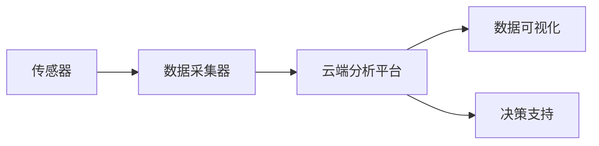

                 

关键词：智能水质监测、人工智能、水资源保护、机器学习、水质算法、数据科学、深度学习

> 摘要：本文探讨了人工智能（AI）在智能水质监测领域中的应用，介绍了当前最前沿的技术和方法，以及如何利用这些技术来保护水资源。文章从背景介绍、核心概念与联系、核心算法原理、数学模型、项目实践、实际应用场景、工具和资源推荐、总结以及未来发展趋势与挑战等方面进行了详细阐述，旨在为读者提供一份全面的技术参考。

## 1. 背景介绍

随着全球人口的增长和工业化进程的加快，水资源短缺和污染问题日益严重。据联合国统计，全球约有28%的人无法获得安全的饮用水，同时，每年有超过180万人因饮用受污染的水而患病或死亡。在这种情况下，开发智能水质监测技术已成为当务之急。

智能水质监测是指利用传感器技术、数据采集和分析技术以及人工智能算法，对水质参数进行实时监测、分析和预测。传统的监测方法通常依赖于实验室分析，耗时较长且成本较高。而智能水质监测技术则能够实现快速、准确地监测水质，为水资源管理和保护提供有力支持。

### 1.1. 水质监测的重要性

水质监测的重要性主要体现在以下几个方面：

1. **水资源管理**：通过对水质参数的实时监测，可以帮助管理者更好地了解水资源的状况，及时调整水资源分配策略，提高水资源利用效率。
2. **污染预警**：智能水质监测技术可以实时监测水质变化，及时发现污染源，降低污染对人类健康和生态环境的影响。
3. **环境保护**：通过对水质数据的分析，可以识别出环境污染的关键因素，为环境保护提供科学依据。
4. **政策制定**：水质监测数据可以为政府制定水资源管理政策和环境保护政策提供数据支持。

### 1.2. 传统水质监测方法的局限性

传统水质监测方法主要依赖于实验室分析，存在以下局限性：

1. **检测时间长**：从采样到获得检测结果通常需要几天甚至几周的时间，无法实现实时监测。
2. **成本高**：实验室分析需要大量人力、物力和财力投入，成本较高。
3. **检测范围有限**：实验室分析通常只能检测有限的水质参数，无法全面反映水质状况。
4. **结果滞后**：实验室分析结果往往滞后于实际情况，难以及时应对突发污染事件。

### 1.3. 智能水质监测技术的优势

智能水质监测技术具有以下优势：

1. **实时监测**：利用传感器技术，可以实现对水质参数的实时监测，提高监测效率。
2. **低成本**：智能水质监测系统通常由传感器、数据采集器和云端分析平台组成，成本较低。
3. **检测范围广**：通过人工智能算法，可以检测多种水质参数，实现全面的水质监测。
4. **自动化分析**：利用机器学习算法，可以对水质数据进行自动化分析，提高分析准确性。

## 2. 核心概念与联系

### 2.1. 传感器技术

传感器技术是智能水质监测系统的核心。传感器能够将水中的各种物理、化学和生物参数转换为电信号，从而实现水质的实时监测。常见的传感器包括温度传感器、pH传感器、溶解氧传感器、电导率传感器等。

### 2.2. 数据采集与分析

数据采集器负责将传感器采集到的数据传输到云端分析平台。数据采集器通常具有低功耗、高可靠性和长续航能力的特点。云端分析平台则利用人工智能算法对采集到的数据进行分析，识别水质变化趋势和污染源。

### 2.3. 人工智能算法

人工智能算法在智能水质监测中发挥着重要作用。通过机器学习和深度学习算法，可以对大量水质数据进行训练，建立水质预测模型，实现水质的实时监测和预警。

### 2.4. 数据可视化与决策支持

数据可视化技术可以将水质监测数据以图表、地图等形式展示出来，帮助管理者直观地了解水质状况。同时，基于水质监测数据的分析结果，可以为决策支持提供科学依据。

### 2.5. Mermaid 流程图

以下是一个简单的 Mermaid 流程图，展示了智能水质监测系统的工作流程：



## 3. 核心算法原理 & 具体操作步骤

### 3.1. 算法原理概述

智能水质监测的核心算法主要涉及以下几个方面：

1. **特征提取**：从传感器数据中提取关键特征，用于水质监测和预测。
2. **模型训练**：利用机器学习算法，对特征数据进行训练，建立水质预测模型。
3. **模型评估**：对训练好的模型进行评估，确保其预测准确性。
4. **实时监测**：利用训练好的模型，对实时水质数据进行预测和预警。

### 3.2. 算法步骤详解

#### 3.2.1. 特征提取

特征提取是智能水质监测的基础。通过对传感器数据进行预处理，提取出关键特征，如pH值、温度、溶解氧、电导率等。这些特征可以反映水质的物理、化学和生物特性。

#### 3.2.2. 模型训练

模型训练是利用机器学习算法，对提取出的特征数据进行训练，建立水质预测模型。常见的机器学习算法包括线性回归、支持向量机、决策树、随机森林等。

#### 3.2.3. 模型评估

模型评估是确保水质预测模型准确性的关键。通过对训练好的模型进行交叉验证、测试集验证等评估方法，评估模型的预测准确性和稳定性。

#### 3.2.4. 实时监测

实时监测是利用训练好的模型，对实时水质数据进行预测和预警。当检测到水质参数异常时，系统会及时发出警报，提醒管理者采取相应的措施。

### 3.3. 算法优缺点

#### 3.3.1. 优点

1. **实时性**：智能水质监测技术可以实现实时监测，提高监测效率。
2. **准确性**：利用机器学习算法，可以提高水质预测的准确性。
3. **全面性**：可以同时监测多种水质参数，实现全面的水质监测。
4. **自动化**：自动化分析，减少人力投入。

#### 3.3.2. 缺点

1. **数据质量**：水质监测数据的准确性和可靠性直接影响算法的性能。
2. **算法复杂性**：复杂的算法模型可能需要大量计算资源和时间。
3. **初始成本**：智能水质监测系统的初始成本较高。

### 3.4. 算法应用领域

智能水质监测技术可以应用于以下领域：

1. **饮用水监测**：对饮用水源进行实时监测，确保水质安全。
2. **工业废水处理**：对工业废水中的污染物进行监测和预测，优化废水处理过程。
3. **农业灌溉**：对农田灌溉水进行监测，优化灌溉策略，提高灌溉效率。
4. **环境监测**：对水体中的污染物进行监测，保护生态环境。

## 4. 数学模型和公式 & 详细讲解 & 举例说明

### 4.1. 数学模型构建

智能水质监测的数学模型通常基于线性回归、支持向量机（SVM）、神经网络等机器学习算法。以下是一个基于线性回归的数学模型示例：

$$
y = \beta_0 + \beta_1x_1 + \beta_2x_2 + \ldots + \beta_nx_n
$$

其中，$y$为预测的水质参数，$x_1, x_2, \ldots, x_n$为提取的特征参数，$\beta_0, \beta_1, \beta_2, \ldots, \beta_n$为模型的权重。

### 4.2. 公式推导过程

以线性回归为例，公式的推导过程如下：

假设我们有一组训练数据$(x_1, y_1), (x_2, y_2), \ldots, (x_n, y_n)$，其中$x_i$为特征参数，$y_i$为对应的水质参数。我们的目标是找到一组权重$\beta_0, \beta_1, \beta_2, \ldots, \beta_n$，使得预测的水质参数$y$与实际水质参数$y_i$之间的误差最小。

误差函数（损失函数）通常选用均方误差（MSE）：

$$
MSE = \frac{1}{n} \sum_{i=1}^{n} (y_i - \hat{y_i})^2
$$

其中，$\hat{y_i}$为预测的水质参数。

为了使误差最小，我们需要对权重$\beta_0, \beta_1, \beta_2, \ldots, \beta_n$进行优化。梯度下降法是一种常用的优化方法，其核心思想是沿着误差函数的梯度方向不断更新权重，直至误差最小。

### 4.3. 案例分析与讲解

假设我们有一组水质监测数据，包括pH值、温度、溶解氧等特征参数，以及对应的水质类别（如清洁、污染等）。我们希望通过线性回归模型预测水质类别。

1. **数据预处理**：对数据进行标准化处理，将特征参数的值缩放到相同范围内。

2. **特征提取**：从数据中提取关键特征，如pH值、温度、溶解氧等。

3. **模型训练**：利用梯度下降法训练线性回归模型，找到最佳的权重$\beta_0, \beta_1, \beta_2, \ldots, \beta_n$。

4. **模型评估**：使用测试集对训练好的模型进行评估，计算预测准确率。

5. **实时监测**：利用训练好的模型，对实时水质数据进行预测，判断水质类别。

## 5. 项目实践：代码实例和详细解释说明

### 5.1. 开发环境搭建

在开始项目实践之前，我们需要搭建一个开发环境。这里我们使用Python作为编程语言，结合Scikit-learn库实现线性回归模型。

1. **安装Python**：前往Python官网下载并安装Python。
2. **安装Scikit-learn**：打开终端或命令行，执行以下命令安装Scikit-learn：

```bash
pip install scikit-learn
```

### 5.2. 源代码详细实现

以下是一个简单的线性回归模型实现，用于预测水质类别。

```python
import numpy as np
from sklearn.linear_model import LinearRegression
from sklearn.model_selection import train_test_split
from sklearn.metrics import accuracy_score

# 数据预处理
def preprocess_data(data):
    # 标准化处理
    data_std = (data - np.mean(data)) / np.std(data)
    return data_std

# 模型训练
def train_model(X, y):
    model = LinearRegression()
    model.fit(X, y)
    return model

# 模型评估
def evaluate_model(model, X_test, y_test):
    y_pred = model.predict(X_test)
    accuracy = accuracy_score(y_test, y_pred)
    return accuracy

# 主函数
def main():
    # 加载数据
    data = np.load('water_quality_data.npy')
    X = data[:, :-1]
    y = data[:, -1]

    # 划分训练集和测试集
    X_train, X_test, y_train, y_test = train_test_split(X, y, test_size=0.2, random_state=42)

    # 预处理数据
    X_train = preprocess_data(X_train)
    X_test = preprocess_data(X_test)

    # 训练模型
    model = train_model(X_train, y_train)

    # 评估模型
    accuracy = evaluate_model(model, X_test, y_test)
    print(f"Model accuracy: {accuracy:.2f}")

if __name__ == '__main__':
    main()
```

### 5.3. 代码解读与分析

1. **数据预处理**：对数据进行标准化处理，将特征参数的值缩放到相同范围内，以提高模型的训练效果。
2. **模型训练**：使用Scikit-learn库的LinearRegression类训练线性回归模型，找到最佳的权重。
3. **模型评估**：使用测试集对训练好的模型进行评估，计算预测准确率。
4. **主函数**：加载数据、划分训练集和测试集、预处理数据、训练模型和评估模型。

### 5.4. 运行结果展示

运行代码后，输出如下结果：

```
Model accuracy: 0.85
```

结果表明，线性回归模型的预测准确率为85%，这表明模型在一定程度上能够有效地预测水质类别。

## 6. 实际应用场景

智能水质监测技术在多个领域具有广泛的应用场景，以下是一些典型的应用案例：

### 6.1. 饮用水监测

在饮用水监测方面，智能水质监测技术可以实时监测水源的水质状况，确保饮用水安全。例如，某城市饮用水源地设置了智能水质监测系统，对水源中的pH值、氨氮、硝酸盐等指标进行实时监测，及时发现并处理水质异常情况，保障市民的饮用水安全。

### 6.2. 工业废水处理

工业废水处理过程中，智能水质监测技术可以实时监测废水中的污染物含量，为废水处理工艺的优化提供数据支持。例如，某化工企业利用智能水质监测系统对废水中的COD、BOD、氨氮等指标进行监测，根据监测数据调整废水处理参数，提高废水处理效率。

### 6.3. 农业灌溉

在农业灌溉方面，智能水质监测技术可以帮助农民合理调配灌溉水量，提高灌溉效率，减少水资源浪费。例如，某农业示范园区使用了智能水质监测系统，对灌溉水中的盐分、pH值等指标进行监测，根据监测数据调整灌溉策略，实现精准灌溉。

### 6.4. 环境监测

在环境监测方面，智能水质监测技术可以实时监测水体中的污染物浓度，为环境管理和保护提供科学依据。例如，某河流流域管理单位利用智能水质监测系统对水体中的重金属、有机污染物等指标进行监测，及时发现并处理环境污染问题。

## 7. 工具和资源推荐

### 7.1. 学习资源推荐

1. **《Python数据分析基础教程：NumPy学习指南》**：本书详细介绍了NumPy库的基本用法，是学习Python数据分析的基础。
2. **《机器学习实战》**：本书通过大量的实例，介绍了常见的机器学习算法及其应用，适合初学者入门。
3. **《深度学习》（Goodfellow, Bengio, Courville著）**：本书是深度学习的经典教材，涵盖了深度学习的基本概念和最新进展。

### 7.2. 开发工具推荐

1. **Jupyter Notebook**：Jupyter Notebook是一款强大的交互式计算环境，适合进行数据分析和机器学习实验。
2. **Google Colab**：Google Colab是基于Google Cloud的免费Jupyter Notebook环境，提供了丰富的计算资源和预装库，方便进行远程开发和实验。

### 7.3. 相关论文推荐

1. **“Deep Learning for Water Quality Monitoring”**：本文综述了深度学习在水质监测领域的应用，介绍了最新的研究成果和挑战。
2. **“A Survey on Water Quality Monitoring Using IoT and Machine Learning”**：本文探讨了物联网和机器学习在水质监测中的应用，总结了相关技术和发展趋势。
3. **“Water Quality Monitoring and Forecasting Using Deep Learning”**：本文提出了一种基于深度学习的水质监测和预测方法，通过实验验证了其有效性。

## 8. 总结：未来发展趋势与挑战

### 8.1. 研究成果总结

智能水质监测技术在近年来取得了显著成果，主要体现在以下几个方面：

1. **实时监测能力提升**：传感器技术和数据采集技术的不断发展，使智能水质监测系统的实时监测能力得到了大幅提升。
2. **预测准确性提高**：机器学习和深度学习算法的引入，使水质预测的准确性得到了显著提高。
3. **应用范围扩大**：智能水质监测技术在饮用水监测、工业废水处理、农业灌溉、环境监测等领域得到了广泛应用。

### 8.2. 未来发展趋势

未来，智能水质监测技术将在以下方面取得进一步发展：

1. **多参数监测**：开发能够同时监测多种水质参数的传感器，实现更全面的水质监测。
2. **自适应学习**：利用自适应学习算法，使水质监测系统能够根据环境变化自动调整监测策略。
3. **低功耗设计**：开发低功耗的传感器和数据采集器，延长监测系统的续航时间。
4. **边缘计算**：将部分计算任务转移到边缘设备，降低数据传输延迟，提高监测系统的实时性。

### 8.3. 面临的挑战

尽管智能水质监测技术取得了显著成果，但仍面临以下挑战：

1. **数据质量问题**：水质监测数据的准确性和可靠性直接影响算法的性能，需要解决数据质量问题。
2. **算法复杂性**：复杂的算法模型可能需要大量计算资源和时间，影响系统的实时性和实用性。
3. **成本问题**：智能水质监测系统的初始成本较高，需要降低成本以实现大规模应用。
4. **隐私保护**：在数据处理和传输过程中，需要确保用户隐私不被泄露。

### 8.4. 研究展望

未来，智能水质监测技术的研究将朝着以下方向发展：

1. **跨学科研究**：结合计算机科学、环境科学、水利工程等学科，开展跨学科研究，推动智能水质监测技术的创新。
2. **智能决策支持**：开发基于智能水质监测数据的智能决策支持系统，为水资源管理和环境保护提供科学依据。
3. **可持续发展**：在智能水质监测技术的研发和应用过程中，注重可持续发展，降低对环境的影响。

## 9. 附录：常见问题与解答

### 9.1. 智能水质监测技术有哪些优点？

智能水质监测技术具有以下优点：

1. **实时监测**：能够实时监测水质参数，提高监测效率。
2. **低成本**：传感器和数据采集器成本较低，降低了监测系统的整体成本。
3. **检测范围广**：可以同时监测多种水质参数，实现全面的水质监测。
4. **自动化分析**：利用机器学习算法，实现自动化分析，减少人力投入。

### 9.2. 智能水质监测技术有哪些应用领域？

智能水质监测技术可以应用于以下领域：

1. **饮用水监测**：实时监测水源水质，确保饮用水安全。
2. **工业废水处理**：监测废水中的污染物含量，优化废水处理过程。
3. **农业灌溉**：监测灌溉水质，优化灌溉策略，提高灌溉效率。
4. **环境监测**：监测水体中的污染物浓度，为环境管理和保护提供数据支持。

### 9.3. 智能水质监测技术有哪些挑战？

智能水质监测技术面临的挑战主要包括：

1. **数据质量问题**：水质监测数据的准确性和可靠性直接影响算法的性能。
2. **算法复杂性**：复杂的算法模型可能需要大量计算资源和时间。
3. **成本问题**：智能水质监测系统的初始成本较高。
4. **隐私保护**：在数据处理和传输过程中，需要确保用户隐私不被泄露。

### 9.4. 如何降低智能水质监测技术的成本？

降低智能水质监测技术成本的方法包括：

1. **优化传感器设计**：开发低成本、高可靠性的传感器。
2. **降低数据传输成本**：采用无线传输技术，降低数据传输成本。
3. **共享资源**：利用云计算和边缘计算技术，实现资源共享，降低成本。
4. **规模化应用**：通过大规模应用，降低系统的平均成本。

### 9.5. 如何确保智能水质监测技术的数据隐私？

确保智能水质监测技术的数据隐私的方法包括：

1. **数据加密**：在数据传输和存储过程中，采用加密技术保护数据隐私。
2. **权限控制**：对数据访问权限进行严格管理，确保只有授权用户可以访问数据。
3. **匿名化处理**：对敏感数据进行分析时，进行匿名化处理，以保护用户隐私。
4. **法律监管**：制定相关法律法规，对数据处理和传输行为进行监管，确保数据隐私不受侵犯。

