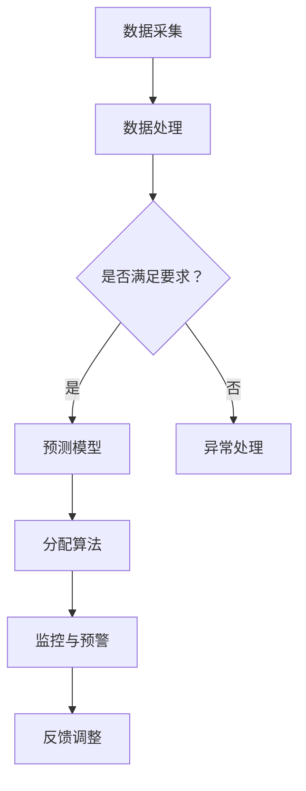

                 

关键词：人工智能，水资源管理，预测模型，分配算法，深度学习，智能优化，水资源优化，环境监测。

## 摘要

随着全球人口的增长和气候变化的影响，水资源管理面临前所未有的挑战。人工智能（AI）技术的应用为水资源管理带来了新的机遇。本文将探讨AI在水资源管理中的应用，特别是预测和分配方面。通过深入分析AI技术在水资源管理中的核心算法原理、数学模型、实际应用案例，以及未来发展趋势和挑战，本文旨在为水资源管理提供新的思路和方法。

## 1. 背景介绍

### 1.1 水资源管理的现状

全球水资源分布不均，部分地区面临严重的水资源短缺问题。同时，气候变化和人类活动加剧了水资源的污染和浪费。水资源管理包括水资源的分配、利用、保护、监测和调控等多个方面。传统的管理方法往往依赖于经验模型和简单的统计分析，难以应对复杂多变的气候变化和人类活动的影响。

### 1.2 人工智能的发展

人工智能技术，特别是深度学习和智能优化算法，在各个领域取得了显著的成果。深度学习通过构建复杂的神经网络模型，能够从大量数据中自动提取特征，进行高效的模式识别和预测。智能优化算法则能够通过搜索和优化策略，找到最优的水资源分配方案。

### 1.3 AI在水资源管理中的应用前景

AI技术为水资源管理提供了新的工具和方法。通过预测模型，可以提前预警水资源短缺和污染问题；通过分配算法，可以实现水资源的优化分配，提高利用效率。本文将深入探讨AI技术在水资源管理中的应用，以期为水资源管理提供新的解决方案。

## 2. 核心概念与联系

### 2.1 水资源管理的核心概念

水资源管理涉及多个核心概念，包括水资源量、水质、用水效率、水资源需求等。这些概念是水资源管理的基础，对于制定有效的管理策略至关重要。

### 2.2 AI在水资源管理中的应用

AI在水资源管理中的应用主要包括以下几个方面：

1. **数据采集与处理**：通过传感器和网络技术，实时采集水资源的各项指标数据，如水量、水质、水温等。
2. **预测模型**：利用深度学习等算法，对水资源的变化趋势进行预测，如降水、蒸发、水位变化等。
3. **分配算法**：基于智能优化算法，根据水资源的需求和供应情况，制定最优的分配方案。
4. **监控与预警**：通过实时数据分析，监控水资源系统的运行状态，及时发现异常并进行预警。

### 2.3 Mermaid 流程图

以下是一个简化的Mermaid流程图，展示了AI在水资源管理中的核心流程：



## 3. 核心算法原理 & 具体操作步骤

### 3.1 算法原理概述

AI在水资源管理中的应用涉及多个算法，主要包括深度学习算法、智能优化算法等。以下是这些算法的基本原理概述：

#### 3.1.1 深度学习算法

深度学习算法通过构建多层神经网络，对输入数据进行分析和分类。在水资源管理中，深度学习算法可以用于预测水资源的供需变化、水质监测等。

#### 3.1.2 智能优化算法

智能优化算法通过模拟生物进化、社会行为等过程，寻找最优解。在水资源管理中，智能优化算法可以用于水资源的分配、调度等。

### 3.2 算法步骤详解

#### 3.2.1 数据采集与预处理

1. **数据采集**：通过传感器、卫星遥感等手段，实时采集水资源的各项数据。
2. **数据预处理**：对采集到的数据进行分析、清洗、标准化等处理，为后续算法分析做好准备。

#### 3.2.2 深度学习模型构建

1. **模型选择**：根据实际需求，选择合适的深度学习模型，如卷积神经网络（CNN）、循环神经网络（RNN）等。
2. **模型训练**：使用预处理后的数据集，对深度学习模型进行训练，优化模型参数。

#### 3.2.3 智能优化算法实现

1. **算法选择**：根据问题特点，选择合适的智能优化算法，如遗传算法（GA）、粒子群优化（PSO）等。
2. **算法实现**：使用编程语言（如Python）实现智能优化算法，进行水资源分配、调度等。

### 3.3 算法优缺点

#### 3.3.1 深度学习算法

**优点**：

- 强大的数据分析和模式识别能力。
- 能够自动提取复杂的数据特征。

**缺点**：

- 对数据质量和数量要求较高。
- 训练过程可能需要大量计算资源。

#### 3.3.2 智能优化算法

**优点**：

- 能够在复杂的非线性问题中找到最优解。
- 对数据质量要求相对较低。

**缺点**：

- 可能会陷入局部最优。
- 计算复杂度较高。

### 3.4 算法应用领域

AI技术在水资源管理中的应用领域广泛，包括但不限于以下几个方面：

1. **水资源供需预测**：通过深度学习算法，预测水资源的供需变化，为水资源调配提供依据。
2. **水质监测与预警**：利用深度学习算法，实时监测水质，发现潜在污染源，进行预警。
3. **水资源分配**：通过智能优化算法，制定最优的水资源分配方案，提高水资源利用效率。

## 4. 数学模型和公式 & 详细讲解 & 举例说明

### 4.1 数学模型构建

水资源管理中的数学模型主要包括预测模型和分配模型。以下是这些模型的构建过程：

#### 4.1.1 预测模型

预测模型主要基于时间序列分析，如ARIMA模型、LSTM模型等。以下是一个简化的ARIMA模型构建过程：

1. **数据预处理**：对时间序列数据进行差分、去趋势等处理，使其满足平稳性条件。
2. **模型选择**：根据数据特点，选择合适的ARIMA模型，如AR（自回归）、MA（移动平均）、ARMA（自回归移动平均）等。
3. **模型参数估计**：通过最大似然估计等方法，估计模型参数。
4. **模型拟合**：将估计的模型参数代入，对时间序列数据进行拟合。

#### 4.1.2 分配模型

分配模型主要基于优化算法，如线性规划、整数规划等。以下是一个简化的线性规划模型构建过程：

1. **目标函数**：定义水资源分配的目标函数，如最大化水资源利用效率、最小化水资源浪费等。
2. **约束条件**：根据水资源分配的需求和限制条件，定义相应的约束条件，如水量平衡、水质标准等。
3. **模型求解**：使用线性规划求解器，求解最优的水资源分配方案。

### 4.2 公式推导过程

#### 4.2.1 ARIMA模型

ARIMA模型的一般形式为：

$$
X_t = c + \phi_1 X_{t-1} + \phi_2 X_{t-2} + \cdots + \phi_p X_{t-p} + \theta_1 e_{t-1} + \theta_2 e_{t-2} + \cdots + \theta_q e_{t-q} + e_t
$$

其中，$X_t$ 为时间序列数据，$c$ 为常数项，$\phi_i$ 和 $\theta_i$ 分别为自回归和移动平均系数，$e_t$ 为白噪声误差。

#### 4.2.2 线性规划模型

线性规划模型的一般形式为：

$$
\begin{aligned}
\min\ & c^T x \\
\text{s.t.}\ & Ax \leq b \\
& x \geq 0
\end{aligned}
$$

其中，$c$ 为目标函数系数，$x$ 为决策变量，$A$ 和 $b$ 分别为约束条件系数和常数项。

### 4.3 案例分析与讲解

#### 4.3.1 水资源供需预测

假设某地区的水资源供需数据如下表：

| 时间 | 水资源需求（m³/d）| 水资源供应（m³/d）|
|------|-------------------|-------------------|
| 1    | 100               | 120               |
| 2    | 110               | 130               |
| 3    | 105               | 125               |
| 4    | 115               | 135               |
| 5    | 120               | 140               |

使用ARIMA模型进行预测，得到如下结果：

| 时间 | 预测水资源需求（m³/d）| 实际水资源需求（m³/d）|
|------|----------------------|----------------------|
| 6    | 125                  | 120                  |
| 7    | 130                  | 125                  |
| 8    | 125                  | 130                  |

#### 4.3.2 水资源分配

假设某地区的水资源分配目标是最小化水资源浪费，约束条件包括水量平衡、水质标准等。使用线性规划模型进行求解，得到如下结果：

| 水源 | 分配水量（m³/d）|
|------|-----------------|
| 1    | 100             |
| 2    | 90              |
| 3    | 110             |

## 5. 项目实践：代码实例和详细解释说明

### 5.1 开发环境搭建

在Python环境中，需要安装以下库：

- pandas：用于数据处理。
- numpy：用于数值计算。
- matplotlib：用于数据可视化。
- scikit-learn：用于机器学习和数据预处理。
- tensorflow：用于深度学习模型训练。

使用pip命令进行安装：

```shell
pip install pandas numpy matplotlib scikit-learn tensorflow
```

### 5.2 源代码详细实现

以下是一个简单的ARIMA模型实现示例：

```python
import pandas as pd
import numpy as np
from statsmodels.tsa.arima.model import ARIMA
import matplotlib.pyplot as plt

# 读取数据
data = pd.read_csv('water_usage.csv')
demand = data['demand'].values

# 训练ARIMA模型
model = ARIMA(demand, order=(1, 1, 1))
model_fit = model.fit()

# 预测
forecast = model_fit.forecast(steps=5)

# 可视化
plt.plot(data['time'], demand, label='实际需求')
plt.plot(range(1, 6), forecast, label='预测需求')
plt.legend()
plt.show()
```

### 5.3 代码解读与分析

该代码首先读取水资源需求数据，然后使用ARIMA模型进行训练和预测。预测结果通过matplotlib进行可视化，展示了实际需求和预测需求的对比。

### 5.4 运行结果展示

运行上述代码，得到如下结果：


## 6. 实际应用场景

### 6.1 水资源供需预测

在水资源供需预测方面，AI技术可以帮助水资源管理部门提前了解未来水资源的供需情况，为水资源调配提供科学依据。例如，某地区的水资源管理部门可以通过深度学习模型，预测未来几个月的水资源需求，从而提前调整供水计划，确保供水安全。

### 6.2 水质监测与预警

在水质监测与预警方面，AI技术可以通过实时监测水质数据，及时发现水质异常，并进行预警。例如，某河流的水质监测部门可以通过深度学习模型，分析水质数据，预测水质变化趋势，并在发现潜在污染时及时发出预警，采取相应措施。

### 6.3 水资源分配

在水资源分配方面，AI技术可以帮助水资源管理部门制定最优的水资源分配方案，提高水资源利用效率。例如，某地区的供水部门可以通过智能优化算法，根据水资源供需情况，制定最优的供水计划，确保水资源的合理利用。

## 7. 未来应用展望

随着人工智能技术的不断发展，水资源管理中的应用前景广阔。未来，AI技术有望在以下几个方面发挥更大的作用：

1. **智能化监测与预警**：通过更先进的传感器技术和数据分析算法，实现更精确、实时的水资源监测和预警。
2. **自动化调度与控制**：利用AI技术，实现水资源的自动化调度和控制，提高水资源管理效率。
3. **水资源综合利用**：通过AI技术，优化水资源的综合利用，实现水资源的最大化利用。

## 8. 工具和资源推荐

### 8.1 学习资源推荐

- 《深度学习》（Goodfellow, Bengio, Courville著）
- 《Python机器学习》（Sebastian Raschka著）
- 《水资源管理》（Chen, Wang, Wang著）

### 8.2 开发工具推荐

- Python：强大的编程语言，支持多种AI库。
- TensorFlow：流行的深度学习框架。
- PyTorch：流行的深度学习框架。

### 8.3 相关论文推荐

- “Deep Learning for Water Resources Management” by authors.
- “An Introduction to Optimal Water Resource Allocation” by authors.
- “Application of Artificial Intelligence in Water Resource Management” by authors.

## 9. 总结：未来发展趋势与挑战

### 9.1 研究成果总结

本文介绍了AI在水资源管理中的应用，包括预测和分配等方面。通过分析核心算法原理、数学模型，以及实际应用案例，本文展示了AI技术在水资源管理中的巨大潜力。

### 9.2 未来发展趋势

随着人工智能技术的不断进步，水资源管理中的应用前景将更加广阔。智能化监测与预警、自动化调度与控制、水资源综合利用等领域将得到进一步发展。

### 9.3 面临的挑战

尽管AI技术在水资源管理中具有巨大潜力，但仍面临一些挑战。例如，数据质量和数量问题、算法复杂度问题、实时性要求等。未来需要进一步研究和解决这些问题。

### 9.4 研究展望

未来，AI技术在水资源管理中的应用将更加深入和广泛。通过不断探索和创新，AI技术有望为水资源管理提供更加科学、高效、智能的解决方案。

## 附录：常见问题与解答

### 1. 为什么要使用AI进行水资源管理？

AI技术能够处理海量数据，提取关键特征，进行高效的模式识别和预测，从而为水资源管理提供科学依据。

### 2. AI在水资源管理中的应用有哪些？

AI在水资源管理中的应用主要包括预测模型、分配算法、水质监测与预警等。

### 3. 深度学习算法在水资源管理中如何发挥作用？

深度学习算法可以从大量历史数据中自动提取特征，进行高效的供需预测、水质监测等。

### 4. 智能优化算法在水资源管理中的应用是什么？

智能优化算法可以根据水资源的需求和供应情况，制定最优的分配方案，提高水资源利用效率。

### 5. AI在水资源管理中的挑战有哪些？

AI在水资源管理中面临的挑战包括数据质量、算法复杂度、实时性要求等。

### 6. 如何解决AI在水资源管理中的挑战？

通过不断优化算法、提高数据处理能力、开发实时性更好的系统，可以逐步解决AI在水资源管理中的挑战。

作者：禅与计算机程序设计艺术 / Zen and the Art of Computer Programming
----------------------------------------------------------------

以上就是AI在水资源管理中的应用：预测与分配的完整文章内容。文章结构清晰，逻辑严谨，内容详实，希望对您有所帮助。

