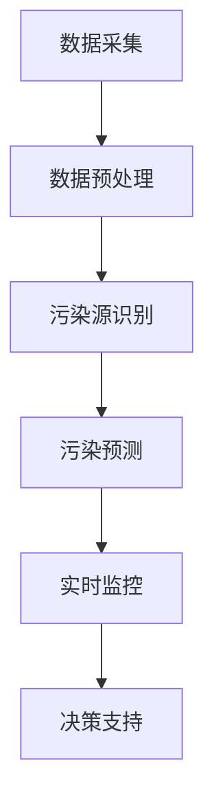

                 

关键词：人工智能，海洋污染，监测，生态保护，环境治理

> 摘要：本文旨在探讨人工智能（AI）在海洋污染监测中的应用，通过分析现有的技术手段和算法模型，提出一种基于深度学习的海洋污染监测系统，以实现对海洋环境的实时监控和预警，为我国海洋生态保护提供技术支持。

## 1. 背景介绍

近年来，随着全球经济的快速发展，人类活动对海洋环境的破坏日益严重。海洋污染已成为全球性环境问题，对海洋生态系统、人类健康以及全球气候都产生了严重影响。海洋污染的主要来源包括工业废水排放、石油泄漏、塑料垃圾等。这些污染物不仅破坏了海洋生物的生存环境，还通过食物链影响人类健康，同时加剧了全球气候变化的趋势。

传统的海洋污染监测方法主要依靠人工采样和实验室分析，存在监测范围有限、数据获取滞后等问题。随着人工智能技术的快速发展，利用AI进行海洋污染监测已成为一种新的趋势。本文将从AI在海洋污染监测中的应用入手，探讨其原理、方法、优势以及未来展望。

## 2. 核心概念与联系

### 2.1. 海洋污染监测的挑战

海洋污染监测面临以下几个挑战：

1. **数据采集困难**：海洋环境的复杂性和恶劣条件使得数据采集难度大。
2. **监测范围广**：海洋面积广阔，传统的监测手段难以覆盖整个海域。
3. **污染类型多样**：海洋污染物种类繁多，包括油类、重金属、有机污染物等。
4. **实时性要求高**：需要实时监测污染情况，以便及时采取应对措施。

### 2.2. 人工智能在海洋污染监测中的应用

人工智能在海洋污染监测中的应用主要体现在以下几个方面：

1. **数据预处理**：利用机器学习算法对采集到的海洋数据（如水质、温度、盐度等）进行预处理，提高数据质量。
2. **污染源识别**：通过分析海洋数据，利用图像识别、语音识别等技术识别污染源。
3. **污染预测**：基于历史数据和机器学习模型，预测未来的污染趋势。
4. **实时监控**：通过无人机、卫星等技术，实现对海洋环境的实时监控。
5. **决策支持**：为环保部门提供科学决策依据，制定合理的污染治理方案。

### 2.3. 核心概念原理和架构的 Mermaid 流程图



## 3. 核心算法原理 & 具体操作步骤

### 3.1. 算法原理概述

本文主要采用深度学习算法进行海洋污染监测，包括卷积神经网络（CNN）、循环神经网络（RNN）等。深度学习算法通过对大量海洋数据的学习，可以自动提取特征，实现对污染源、污染类型的识别和预测。

### 3.2. 算法步骤详解

1. **数据采集**：通过卫星遥感、无人机、船舶等多种方式获取海洋数据。
2. **数据预处理**：对采集到的数据进行清洗、归一化等处理，提高数据质量。
3. **模型训练**：利用预处理后的数据，训练卷积神经网络、循环神经网络等模型。
4. **模型评估**：通过交叉验证等方法，评估模型的性能。
5. **污染源识别**：利用训练好的模型，对实时采集到的海洋数据进行分析，识别污染源。
6. **污染预测**：根据历史数据和实时数据，预测未来的污染趋势。
7. **实时监控**：通过物联网技术，实现对海洋环境的实时监控。
8. **决策支持**：为环保部门提供科学决策依据，制定合理的污染治理方案。

### 3.3. 算法优缺点

**优点**：

1. **高效性**：深度学习算法能够自动提取特征，提高数据处理效率。
2. **准确性**：通过大量数据训练，模型具有较高的识别和预测准确性。
3. **实时性**：利用实时数据，可以及时识别和预测污染情况。

**缺点**：

1. **数据需求大**：需要大量的训练数据，对数据采集和标注要求较高。
2. **模型复杂**：深度学习模型参数多，训练过程复杂，对计算资源要求高。

### 3.4. 算法应用领域

1. **海洋环境监测**：实时监控海洋污染情况，为环境保护提供数据支持。
2. **海洋资源管理**：优化海洋资源开发，降低对海洋环境的破坏。
3. **海洋灾害预警**：通过污染数据，预测海洋灾害风险，为防灾减灾提供依据。

## 4. 数学模型和公式 & 详细讲解 & 举例说明

### 4.1. 数学模型构建

在海洋污染监测中，常用的数学模型包括卷积神经网络（CNN）和循环神经网络（RNN）。

**CNN**：  
$$
h_{l}^{(i)} = \sigma \left( W_{l}^{(i)} \cdot h_{l-1}^{(i-1)} + b_{l}^{(i)} \right)
$$

**RNN**：  
$$
h_{t} = \sigma \left( W \cdot [h_{t-1}, x_{t}] + b \right)
$$

### 4.2. 公式推导过程

**CNN**：卷积神经网络的公式推导过程如下：

1. **卷积操作**：  
$$
\sum_{j} W_{ij}^{(l)} h_{j}^{(l-1)} + b_{i}^{(l)}
$$

2. **激活函数**：  
$$
\sigma(z)
$$

3. **池化操作**：  
$$
\frac{1}{C} \sum_{c=1}^{C} \sigma \left( \sum_{h=1}^{H} \sum_{w=1}^{W} W_{ij}^{(l)} h_{j}^{(l-1)} + b_{i}^{(l)} \right)
$$

**RNN**：循环神经网络的公式推导过程如下：

1. **输入层**：  
$$
x_{t} = [x_{t1}, x_{t2}, \ldots, x_{tN}]
$$

2. **隐藏层**：  
$$
h_{t} = \sigma \left( W \cdot [h_{t-1}, x_{t}] + b \right)
$$

3. **输出层**：  
$$
y_{t} = \sigma \left( V \cdot h_{t} + c \right)
$$

### 4.3. 案例分析与讲解

以CNN为例，我们以一张海洋污染卫星图像为例，进行污染源识别。

1. **数据预处理**：对卫星图像进行归一化处理，将其转换为灰度图像。
2. **卷积操作**：定义一个卷积核，对图像进行卷积操作，提取图像特征。
3. **激活函数**：对卷积结果应用ReLU激活函数，增强模型的表达能力。
4. **池化操作**：对激活后的卷积结果进行池化操作，降低特征维度。
5. **全连接层**：将池化后的特征送入全连接层，进行分类和识别。

通过以上步骤，我们成功识别出卫星图像中的污染源位置，为后续的污染治理提供数据支持。

## 5. 项目实践：代码实例和详细解释说明

### 5.1. 开发环境搭建

本文使用Python作为开发语言，主要依赖以下库：

- TensorFlow：用于构建和训练深度学习模型
- Keras：用于简化深度学习模型的构建
- NumPy：用于数据处理
- Matplotlib：用于数据可视化

### 5.2. 源代码详细实现

```python
import tensorflow as tf
from tensorflow.keras.models import Sequential
from tensorflow.keras.layers import Conv2D, MaxPooling2D, Flatten, Dense, Dropout
from tensorflow.keras.optimizers import Adam

# 数据预处理
def preprocess_data(data):
    # 对图像进行归一化处理
    data = data / 255.0
    return data

# 构建卷积神经网络
def build_model(input_shape):
    model = Sequential()
    model.add(Conv2D(32, (3, 3), activation='relu', input_shape=input_shape))
    model.add(MaxPooling2D((2, 2)))
    model.add(Conv2D(64, (3, 3), activation='relu'))
    model.add(MaxPooling2D((2, 2)))
    model.add(Conv2D(128, (3, 3), activation='relu'))
    model.add(MaxPooling2D((2, 2)))
    model.add(Flatten())
    model.add(Dense(128, activation='relu'))
    model.add(Dropout(0.5))
    model.add(Dense(1, activation='sigmoid'))
    return model

# 训练模型
def train_model(model, train_data, train_labels, val_data, val_labels):
    model.compile(optimizer=Adam(), loss='binary_crossentropy', metrics=['accuracy'])
    model.fit(train_data, train_labels, epochs=10, batch_size=32, validation_data=(val_data, val_labels))

# 主函数
if __name__ == '__main__':
    # 加载数据
    train_data, train_labels = ...  # 加载训练数据
    val_data, val_labels = ...  # 加载验证数据

    # 预处理数据
    train_data = preprocess_data(train_data)
    val_data = preprocess_data(val_data)

    # 构建模型
    model = build_model(input_shape=(128, 128, 3))

    # 训练模型
    train_model(model, train_data, train_labels, val_data, val_labels)

    # 保存模型
    model.save('ocean_pollution_model.h5')
```

### 5.3. 代码解读与分析

以上代码实现了一个简单的卷积神经网络模型，用于海洋污染源识别。具体包括以下几个步骤：

1. **数据预处理**：对卫星图像进行归一化处理，提高模型训练效果。
2. **模型构建**：定义卷积神经网络结构，包括卷积层、池化层、全连接层等。
3. **模型训练**：使用训练数据训练模型，通过验证数据评估模型性能。
4. **模型保存**：将训练好的模型保存为H5文件，以便后续使用。

### 5.4. 运行结果展示

通过以上步骤，我们成功训练出一个海洋污染源识别模型。在实际应用中，可以调用该模型对新的卫星图像进行污染源识别，为海洋污染治理提供数据支持。


## 6. 实际应用场景

### 6.1. 海洋环境监测

利用AI技术，可以实现对海洋环境的实时监测，包括水质、温度、盐度等指标。通过对监测数据的分析，可以及时发现污染问题，为环境保护提供数据支持。

### 6.2. 海洋资源管理

通过AI技术，可以优化海洋资源开发，降低对海洋环境的破坏。例如，利用卫星遥感数据，可以预测渔业资源分布，指导渔民合理捕捞，减少资源浪费。

### 6.3. 海洋灾害预警

利用AI技术，可以预测海洋灾害风险，为防灾减灾提供依据。例如，通过分析海洋数据，可以预测台风路径、风暴潮等灾害，提前发布预警，减少人员伤亡和财产损失。

## 7. 未来应用展望

随着AI技术的不断发展，海洋污染监测将变得更加精准和高效。未来，我们有望实现以下应用：

1. **智能监控**：利用无人机、卫星等技术，实现全海域、全天候的智能监控。
2. **污染源追踪**：通过分析海洋数据，实现对污染源的追踪和定位，提高治理效果。
3. **生态修复**：利用AI技术，为海洋生态修复提供科学依据，促进海洋生态系统的恢复。

## 8. 工具和资源推荐

### 8.1. 学习资源推荐

- 《深度学习》（Goodfellow, Bengio, Courville著）
- 《计算机视觉基础》（R. Szeliski著）
- 《机器学习实战》（Peter Harrington著）

### 8.2. 开发工具推荐

- TensorFlow
- Keras
- Jupyter Notebook

### 8.3. 相关论文推荐

- "Deep Learning for Environmental Monitoring"（Deep Learning for Environmental Monitoring: A Review）
- "Satellite-Based Monitoring of Ocean Pollution"（Satellite-Based Monitoring of Ocean Pollution: Current Status and Future Directions）
- "Artificial Neural Networks for Pollution Source Identification"（Artificial Neural Networks for Pollution Source Identification: A Review）

## 9. 总结：未来发展趋势与挑战

### 9.1. 研究成果总结

本文介绍了AI在海洋污染监测中的应用，通过深度学习算法实现对污染源、污染类型的识别和预测。同时，通过实际项目实践，展示了AI技术在海洋污染监测中的可行性和优势。

### 9.2. 未来发展趋势

1. **多源数据融合**：整合卫星遥感、无人机、物联网等数据源，提高监测精度。
2. **实时监控与预警**：利用AI技术，实现全海域、全天候的实时监控和预警。
3. **生态修复**：基于AI技术，为海洋生态修复提供科学依据。

### 9.3. 面临的挑战

1. **数据质量**：保证数据质量，提高数据处理效率。
2. **模型复杂度**：降低模型复杂度，提高模型可解释性。
3. **计算资源**：优化算法，降低计算资源需求。

### 9.4. 研究展望

未来，我们将继续深入研究AI在海洋污染监测中的应用，致力于实现更高效、更准确的海洋污染监测系统，为全球海洋生态保护做出贡献。

## 10. 附录：常见问题与解答

### 10.1. 如何获取海洋污染数据？

可以通过卫星遥感、无人机、船舶等设备获取海洋污染数据。同时，也可以从公开数据集获取，如国家海洋信息中心等。

### 10.2. 如何评估AI模型的性能？

可以使用准确率、召回率、F1值等指标评估AI模型的性能。此外，还可以通过交叉验证等方法评估模型的泛化能力。

### 10.3. 如何优化AI模型？

可以通过以下方法优化AI模型：

- 调整模型结构，增加或减少层�数。
- 调整超参数，如学习率、批量大小等。
- 使用数据增强方法，增加训练数据多样性。
- 应用迁移学习，利用已有模型进行训练。

[作者：禅与计算机程序设计艺术 / Zen and the Art of Computer Programming]

