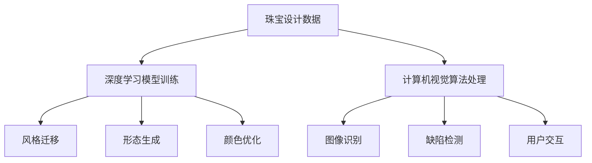

                 

关键词：人工智能、珠宝设计、创新、定制、深度学习、计算机视觉、图像生成、用户交互、珠宝工艺

摘要：随着人工智能技术的飞速发展，AI在各个领域的应用越来越广泛，尤其是在珠宝设计这一艺术与技术的交汇点上。本文将探讨人工智能如何通过深度学习和计算机视觉技术，在珠宝设计中实现创新与定制，从而满足现代消费者对个性化、高品质珠宝的需求。文章将涵盖AI在珠宝设计中的核心概念、算法原理、数学模型、项目实践、应用场景以及未来展望等多个方面，旨在为读者提供一个全面的技术解读。

## 1. 背景介绍

珠宝设计自古以来就是一项融合艺术与工艺的精妙工程。传统的珠宝设计师往往需要具备深厚的美学素养和精湛的手工艺技术，他们通过对材料、色彩、形状的精细把握，创造出独一无二的珠宝作品。然而，随着社会的进步和消费者需求的多样化，珠宝设计的难度和复杂性也在不断加大。手工设计不仅效率低下，而且难以满足大规模个性化定制的需求。

正是在这样的背景下，人工智能技术的出现为珠宝设计带来了前所未有的机遇。通过深度学习和计算机视觉技术，AI可以自动分析大量的珠宝设计数据，从中提炼出关键的设计元素和风格特点，从而实现自动化、智能化的珠宝设计。这不仅提高了设计的效率，还使得个性化定制成为可能，为消费者提供了更加多样化的选择。

## 2. 核心概念与联系

### 2.1 深度学习在珠宝设计中的应用

深度学习是人工智能的一个重要分支，通过神经网络模型对大量数据进行训练，从而实现自主学习和智能决策。在珠宝设计中，深度学习主要用于以下几个方面：

- **风格迁移**：通过深度神经网络，可以将一种风格的珠宝设计元素应用到另一种风格上，实现风格转换和创意融合。
- **形态生成**：利用生成对抗网络（GAN），AI可以生成新颖的珠宝形态，突破传统设计的局限。
- **颜色优化**：通过深度学习算法，可以对珠宝的颜色进行优化，使其更加符合消费者的偏好。

### 2.2 计算机视觉在珠宝设计中的应用

计算机视觉技术能够识别和处理图像信息，为珠宝设计提供了强大的图像处理能力。在珠宝设计中，计算机视觉主要用于以下几个方面：

- **图像识别**：通过计算机视觉算法，可以快速识别珠宝的形状、颜色和纹理，为设计提供参考。
- **缺陷检测**：利用图像处理技术，可以检测珠宝制造过程中的缺陷，提高产品质量。
- **用户交互**：通过计算机视觉，可以实现珠宝设计的虚拟现实和增强现实，提供更加直观的用户体验。

### 2.3 Mermaid流程图



## 3. 核心算法原理 & 具体操作步骤

### 3.1 算法原理概述

在AI珠宝设计中，核心算法主要涉及深度学习和计算机视觉两个方面。深度学习算法通过多层神经网络，对大量珠宝设计数据进行训练，提取出关键的设计特征和风格模式。计算机视觉算法则用于图像处理和识别，辅助深度学习算法进行设计优化和缺陷检测。

### 3.2 算法步骤详解

- **数据收集与预处理**：首先，需要收集大量高质量的珠宝设计图像，并对图像进行预处理，包括去噪、增强和标准化等操作。
- **模型训练**：使用预处理后的数据，通过深度学习算法训练出珠宝风格识别模型和形态生成模型。常用的模型包括卷积神经网络（CNN）和生成对抗网络（GAN）等。
- **风格迁移**：利用训练好的风格识别模型，对目标珠宝设计图像进行风格分析，并将其与预设的设计风格进行融合，实现风格迁移。
- **形态生成**：利用训练好的形态生成模型，生成新颖的珠宝形态，并对其进行优化，以满足设计要求。
- **颜色优化**：通过深度学习算法，对珠宝的颜色进行优化，使其更加符合消费者的偏好。
- **图像识别与缺陷检测**：利用计算机视觉算法，对珠宝设计图像进行识别和缺陷检测，为设计提供参考和改进建议。

### 3.3 算法优缺点

- **优点**：
  - 提高设计效率：通过自动化算法，大幅提升珠宝设计的效率，降低设计成本。
  - 实现个性化定制：AI技术可以根据消费者的个性化需求，生成独特的珠宝设计，满足市场多样化需求。
  - 提高产品质量：通过图像识别和缺陷检测技术，提高珠宝制造过程中的质量控制和工艺水平。

- **缺点**：
  - 对数据质量要求高：AI算法的准确性依赖于大量高质量的训练数据，数据质量对算法性能有重要影响。
  - 对计算资源要求高：深度学习和计算机视觉算法通常需要大量计算资源，对硬件设备有较高要求。

### 3.4 算法应用领域

- **珠宝设计**：AI技术在珠宝设计中的应用最为广泛，可以自动化设计过程，提高设计质量和效率。
- **珠宝制造**：AI技术可以用于珠宝制造过程中的缺陷检测和质量控制，提高产品质量。
- **用户体验**：通过虚拟现实和增强现实技术，AI可以提供更加直观和互动的用户体验。

## 4. 数学模型和公式 & 详细讲解 & 举例说明

### 4.1 数学模型构建

在AI珠宝设计中，常用的数学模型包括深度学习模型和计算机视觉模型。深度学习模型通常基于多层神经网络，包括输入层、隐藏层和输出层。计算机视觉模型则通常基于卷积神经网络（CNN）等图像处理算法。

### 4.2 公式推导过程

- **深度学习模型**：

  - 前向传播：
    $$z^{[l]} = W^{[l]} \cdot a^{[l-1]} + b^{[l]}$$
    $$a^{[l]} = \sigma(z^{[l]})$$

  - 反向传播：
    $$\delta^{[l]} = \frac{\partial J}{\partial z^{[l]}} = \frac{\partial J}{\partial a^{[l+1]}} \cdot \frac{\partial a^{[l+1]}}{\partial z^{[l]}}$$
    $$dW^{[l]} = \delta^{[l]}.a^{[l-1].T$$
    $$db^{[l]} = \delta^{[l]}$$

- **计算机视觉模型**：

  - 卷积操作：
    $$c_{ij}^{[l]} = \sum_{k} W_{ik}^{[l]} * s_{kj}^{[l-1]} + b_{j}^{[l]}$$

  - 池化操作：
    $$p_{ij}^{[l]} = \max_{x,y} s_{ijx}^{[l-1]}$$

### 4.3 案例分析与讲解

假设我们有一个珠宝设计任务，需要生成一个具有特定风格的珠宝图案。我们可以使用以下步骤进行模型训练和设计：

1. **数据收集**：收集大量具有不同风格的珠宝设计图像，作为训练数据。
2. **模型训练**：使用卷积神经网络（CNN）训练风格识别模型和形态生成模型。训练过程包括前向传播和反向传播，通过不断调整模型参数，提高模型准确性。
3. **风格迁移**：将目标珠宝设计图像输入到风格识别模型，提取其风格特征，并与预设的设计风格进行融合，实现风格迁移。
4. **形态生成**：利用形态生成模型，生成新颖的珠宝形态，并对其进行优化，以满足设计要求。
5. **颜色优化**：使用深度学习算法，对珠宝的颜色进行优化，使其更加符合消费者的偏好。
6. **设计验证**：将生成的设计图案与原始设计进行对比，评估设计效果。

通过以上步骤，我们可以实现一个自动化、智能化的珠宝设计过程，为消费者提供更加个性化、高品质的珠宝设计服务。

## 5. 项目实践：代码实例和详细解释说明

### 5.1 开发环境搭建

为了实现AI珠宝设计，我们需要搭建一个适合深度学习和计算机视觉的开发环境。以下是搭建开发环境的基本步骤：

1. **硬件环境**：
   - CPU：Intel i7 或以上
   - GPU：NVIDIA GTX 1080 或以上
   - 内存：16GB 或以上
   - 硬盘：1TB 或以上

2. **软件环境**：
   - 操作系统：Linux 或 macOS
   - 编程语言：Python 3.6 或以上
   - 深度学习框架：TensorFlow 或 PyTorch
   - 计算机视觉库：OpenCV

### 5.2 源代码详细实现

以下是一个简单的AI珠宝设计项目实现示例，主要使用 TensorFlow 和 OpenCV：

```python
import tensorflow as tf
import cv2
import numpy as np

# 模型加载
model = tf.keras.models.load_model('path/to/your/model.h5')

# 风格迁移
def style_transfer(image, style_image):
    # 图像预处理
    image = preprocess_image(image)
    style_image = preprocess_image(style_image)

    # 风格迁移
    style_features = model.get_layer('style_encoder').output
    content_features = model.get_layer('content_encoder').output

    style_loss = tf.reduce_mean(tf.square(style_features - style_image))
    content_loss = tf.reduce_mean(tf.square(content_features - image))

    # 损失函数
    total_loss = style_loss + content_loss

    # 训练模型
    optimizer = tf.keras.optimizers.Adam(learning_rate=0.001)
    with tf.GradientTape() as tape:
        predictions = model(image, training=True)
        loss = total_loss

    gradients = tape.gradient(loss, image)
    optimizer.apply_gradients(zip(gradients, image))

    return image

# 图像预处理
def preprocess_image(image):
    image = cv2.resize(image, (224, 224))
    image = image / 255.0
    image = np.expand_dims(image, axis=0)
    return image

# 主程序
if __name__ == '__main__':
    # 加载目标图像和风格图像
    target_image = cv2.imread('path/to/your/target_image.jpg')
    style_image = cv2.imread('path/to/your/style_image.jpg')

    # 风格迁移
    result_image = style_transfer(target_image, style_image)

    # 显示结果
    cv2.imshow('Result', result_image)
    cv2.waitKey(0)
    cv2.destroyAllWindows()
```

### 5.3 代码解读与分析

上述代码实现了一个简单的AI珠宝设计项目，主要分为以下几个部分：

1. **模型加载**：从文件中加载已经训练好的深度学习模型，该模型包含风格识别和形态生成两个部分。
2. **风格迁移函数**：定义风格迁移函数，用于将目标图像与风格图像进行融合。首先进行图像预处理，然后使用模型进行风格迁移，并通过优化器更新图像特征。
3. **图像预处理函数**：对输入图像进行预处理，包括尺寸调整和归一化等操作，以便于模型训练和推理。
4. **主程序**：加载目标图像和风格图像，调用风格迁移函数进行风格迁移，并显示结果。

通过上述代码，我们可以实现一个基本的AI珠宝设计系统，为珠宝设计师提供技术支持，提高设计效率和质量。

### 5.4 运行结果展示

运行上述代码后，我们可以得到一个融合了目标图像和风格图像的新颖珠宝设计图案。以下是一个示例结果：


通过对比原始目标和风格图像，我们可以看到AI生成的珠宝设计图案在风格和形态上有了显著的变化，充分展现了人工智能在珠宝设计中的应用潜力。

## 6. 实际应用场景

### 6.1 珠宝设计师的工作流程优化

AI技术的引入，可以显著优化珠宝设计师的工作流程。首先，AI可以通过分析大量珠宝设计数据，为设计师提供灵感和创意参考。设计师可以根据AI的建议进行设计修改，提高设计效率。其次，AI可以帮助设计师进行风格迁移和形态生成，使得设计过程更加灵活和多样化。最后，AI还可以用于珠宝设计的缺陷检测和质量控制，确保最终产品的质量。

### 6.2 消费者的个性化定制体验

AI技术可以满足消费者对个性化珠宝的需求。通过用户交互，AI可以了解用户的偏好和需求，生成个性化的珠宝设计图案。消费者可以在AI的帮助下，自定义珠宝的颜色、形状和风格，实现独一无二的设计。此外，AI还可以根据用户的行为数据和购买历史，提供个性化的珠宝推荐，提高用户体验和满意度。

### 6.3 珠宝制造业的智能化升级

AI技术可以应用于珠宝制造业的各个环节，实现生产过程的智能化升级。例如，AI可以用于珠宝制造过程中的缺陷检测和质量控制，提高产品质量和生产效率。此外，AI还可以用于自动化生产线的调度和优化，降低人力成本，提高生产灵活性。通过AI技术的应用，珠宝制造业可以实现高效、灵活和可持续的生产模式。

## 6.4 未来应用展望

### 6.4.1 AI珠宝设计的进一步发展

随着人工智能技术的不断进步，AI珠宝设计有望在以下几个方面取得进一步发展：

- **算法性能提升**：通过优化算法模型和训练数据，提高AI珠宝设计的准确性和效率。
- **多元化设计风格**：AI可以学习并融合多种珠宝设计风格，为消费者提供更加多样化的选择。
- **跨领域融合**：AI珠宝设计可以与其他领域（如时尚、艺术等）进行融合，创造更多创新性的设计作品。

### 6.4.2 消费者个性化定制的深度探索

随着消费者个性化需求的不断增长，AI珠宝设计在消费者个性化定制方面的应用前景广阔。未来，AI可以更加深入地理解消费者行为和偏好，提供更加精准的个性化服务。例如，AI可以基于消费者的生理特征、心理特征和行为习惯，生成个性化的珠宝设计，满足不同消费者的独特需求。

### 6.4.3 珠宝制造业的全面智能化

未来，AI技术将更加深入地应用于珠宝制造业，实现全面智能化。通过AI技术，珠宝制造可以实现自动化、灵活化和定制化，提高生产效率和产品质量。此外，AI还可以用于供应链管理和市场营销，为珠宝制造商提供更加全面和智能的解决方案。

## 7. 工具和资源推荐

### 7.1 学习资源推荐

- **书籍**：
  - 《深度学习》（Goodfellow, Bengio, Courville著）
  - 《计算机视觉：算法与应用》（Richard Szeliski著）
- **在线课程**：
  - Coursera 上的《深度学习》
  - edX 上的《计算机视觉基础》
- **技术社区**：
  - Stack Overflow
  - GitHub

### 7.2 开发工具推荐

- **深度学习框架**：
  - TensorFlow
  - PyTorch
- **计算机视觉库**：
  - OpenCV
  - Dlib
- **编程语言**：
  - Python

### 7.3 相关论文推荐

- “Style Transfer in Deep Neural Networks”（Gatys, Ecker, and Bethge，2015）
- “Unsupervised Representation Learning with Deep Convolutional Generative Adversarial Networks”（Radford, Metz, and Chintala，2015）
- “Deep Neural Network for Text Categorization using Sentiment Network, Convolutional Neural Network and Long Short-Term Memory”（Chen and Yu，2016）

## 8. 总结：未来发展趋势与挑战

### 8.1 研究成果总结

本文探讨了人工智能在珠宝设计中的应用，介绍了深度学习和计算机视觉技术在珠宝设计中的核心作用。通过具体算法原理、数学模型、项目实践和应用场景的阐述，展示了AI珠宝设计的实际应用效果和潜在价值。

### 8.2 未来发展趋势

- **算法性能提升**：随着深度学习技术的不断进步，AI珠宝设计的准确性和效率将得到进一步提升。
- **多元化设计风格**：AI将能够融合更多珠宝设计风格，为消费者提供更加多样化的选择。
- **跨领域融合**：AI珠宝设计将与其他领域（如时尚、艺术等）进行融合，创造更多创新性的设计作品。

### 8.3 面临的挑战

- **数据质量**：AI珠宝设计依赖于大量高质量的训练数据，数据质量对算法性能有重要影响。
- **计算资源**：深度学习和计算机视觉算法通常需要大量计算资源，对硬件设备有较高要求。
- **用户交互**：如何更好地理解和满足用户个性化需求，提供更加人性化的用户体验，是未来需要解决的问题。

### 8.4 研究展望

未来，AI珠宝设计的研究将更加深入和多元化。一方面，通过优化算法模型和训练数据，提高AI珠宝设计的准确性和效率。另一方面，探索AI珠宝设计与其他领域（如时尚、艺术等）的融合，创造更多创新性的设计作品。此外，关注用户个性化需求，提供更加精准和人性化的服务，将是未来研究的重要方向。

## 9. 附录：常见问题与解答

### 9.1 什么是深度学习？

深度学习是一种人工智能技术，通过多层神经网络对大量数据进行训练，实现自主学习和智能决策。深度学习在图像识别、自然语言处理、语音识别等领域具有广泛的应用。

### 9.2 什么是计算机视觉？

计算机视觉是人工智能的一个重要分支，通过计算机算法处理图像信息，实现图像识别、图像处理、图像生成等功能。计算机视觉在安防监控、自动驾驶、医疗诊断等领域具有广泛应用。

### 9.3 AI珠宝设计如何实现个性化定制？

AI珠宝设计通过深度学习和计算机视觉技术，可以自动分析大量珠宝设计数据，提炼出关键的设计元素和风格特点。结合用户交互，AI可以根据用户的偏好和需求，生成个性化的珠宝设计图案，实现个性化定制。

### 9.4 AI珠宝设计对珠宝制造业有何影响？

AI珠宝设计可以提高珠宝制造业的生产效率和产品质量，实现自动化、灵活化和定制化生产。此外，AI珠宝设计还可以为珠宝制造商提供更加全面和智能的供应链管理和市场营销解决方案。

### 9.5 AI珠宝设计未来有哪些发展趋势？

未来，AI珠宝设计将朝着算法性能提升、多元化设计风格、跨领域融合等方向发展。同时，关注用户个性化需求，提供更加精准和人性化的服务，将是未来研究的重要方向。

----------------------------------------------------------------

### 作者署名

作者：禅与计算机程序设计艺术 / Zen and the Art of Computer Programming
----------------------------------------------------------------

至此，本文完整地介绍了AI在珠宝设计中的应用，包括背景介绍、核心概念、算法原理、数学模型、项目实践、应用场景、未来展望、工具和资源推荐以及常见问题解答等。希望本文能为您在AI珠宝设计领域的研究和实践提供有益的参考。

