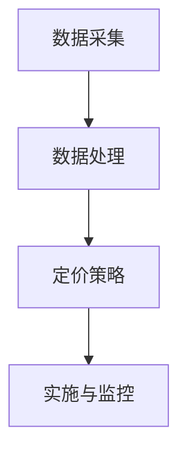

                 

关键词：人工智能，电商，价格优化，算法，实践，效果

> 摘要：本文将探讨人工智能技术在电商价格优化中的应用与实践效果，通过分析核心算法原理、数学模型及具体实施步骤，揭示AI在电商领域的重要作用。文章旨在为行业从业者提供有价值的参考和借鉴，助力电商企业实现智能化价格管理。

## 1. 背景介绍

### 1.1 电商价格优化的意义

电商价格优化是电商平台提升竞争力、实现盈利的关键环节。合理的价格策略能够提升产品销量、增加用户黏性，从而带来可观的商业价值。然而，面对海量商品和复杂的市场环境，传统的人工定价方法难以满足日益增长的需求。

### 1.2 人工智能在电商领域的应用

随着人工智能技术的不断发展，越来越多的电商企业开始尝试将其应用于价格优化。AI技术能够通过大数据分析、机器学习等方法，准确捕捉市场动态和用户需求，为价格决策提供有力支持。

## 2. 核心概念与联系

### 2.1 电商价格优化算法

电商价格优化算法主要分为以下几类：

1. **基于市场需求的定价算法**：通过分析市场需求和用户行为，确定最优价格。

2. **基于竞争的定价算法**：通过分析竞争对手的价格策略，制定具有竞争力的价格。

3. **基于收益优化的定价算法**：综合考虑成本、市场需求和竞争环境，实现收益最大化。

### 2.2 人工智能与电商价格优化的联系

人工智能技术在电商价格优化中的应用主要体现在以下两个方面：

1. **数据处理能力**：AI技术能够高效处理海量数据，为价格优化提供基础。

2. **预测和决策能力**：AI技术能够通过机器学习等方法，预测市场需求和竞争态势，为价格决策提供参考。

### 2.3 电商价格优化架构

电商价格优化架构通常包括以下几个部分：

1. **数据采集**：收集各类数据，如用户行为、市场竞争情况、产品成本等。

2. **数据处理**：对采集到的数据进行清洗、整合和分析。

3. **定价策略**：基于数据分析和算法，制定合适的定价策略。

4. **实施与监控**：将定价策略应用于实际业务，并进行监控和调整。



## 3. 核心算法原理 & 具体操作步骤

### 3.1 算法原理概述

电商价格优化算法的核心在于准确捕捉市场动态和用户需求，从而制定合适的定价策略。其主要原理包括：

1. **数据分析**：通过大数据分析，挖掘市场趋势、用户行为等信息。

2. **机器学习**：利用机器学习算法，预测市场需求和竞争态势。

3. **优化算法**：基于收益最大化等目标，制定最优定价策略。

### 3.2 算法步骤详解

1. **数据采集**：收集各类数据，如用户行为、市场竞争情况、产品成本等。

2. **数据处理**：对采集到的数据进行清洗、整合和分析，提取有用信息。

3. **市场预测**：利用机器学习算法，预测市场需求和竞争态势。

4. **定价策略**：基于数据分析和算法，制定合适的定价策略。

5. **实施与监控**：将定价策略应用于实际业务，并进行监控和调整。

### 3.3 算法优缺点

1. **优点**：

- **高效性**：AI技术能够快速处理海量数据，提高定价效率。

- **准确性**：通过机器学习等算法，准确预测市场需求和竞争态势。

- **灵活性**：根据市场变化，实时调整定价策略。

1. **缺点**：

- **成本**：AI技术的开发和部署成本较高。

- **依赖数据**：算法效果受数据质量影响较大。

### 3.4 算法应用领域

电商价格优化算法广泛应用于各类电商企业，如电商平台、零售企业、跨境电商等。其主要应用领域包括：

1. **商品定价**：为各类商品制定合适的价格策略。

2. **促销活动**：根据市场需求，制定具有吸引力的促销活动。

3. **库存管理**：通过价格优化，实现库存的最佳配置。

## 4. 数学模型和公式 & 详细讲解 & 举例说明

### 4.1 数学模型构建

电商价格优化涉及多个数学模型，如需求预测模型、成本函数模型等。以下是一个基本的需求预测模型：

$$
D(t) = f(P(t), T(t), C(t))
$$

其中：

- $D(t)$：在时间$t$的市场需求。
- $P(t)$：在时间$t$的价格。
- $T(t)$：在时间$t$的促销因素。
- $C(t)$：在时间$t$的竞争因素。

### 4.2 公式推导过程

需求预测模型的推导过程如下：

1. **假设条件**：

- 市场需求与价格、促销因素、竞争因素呈线性关系。

2. **构建模型**：

- 假设需求函数为线性函数，即：
$$
D(t) = aP(t) + bT(t) + cC(t)
$$

- 其中，$a$、$b$、$c$为待定系数。

3. **参数估计**：

- 利用历史数据，通过最小二乘法估计系数$a$、$b$、$c$。

4. **模型优化**：

- 根据实际业务需求，对模型进行优化，如加入非线性项等。

### 4.3 案例分析与讲解

以下是一个具体的案例分析：

**案例背景**：某电商平台在促销期间，为某款手机制定价格策略。

**数据集**：

| 时间 | 价格 | 促销因素 | 竞争因素 |
| ---- | ---- | -------- | -------- |
| 1    | 1000 | 0        | 1        |
| 2    | 950  | 1        | 1        |
| 3    | 920  | 2        | 1        |
| 4    | 900  | 3        | 1        |

**步骤**：

1. **数据预处理**：

- 对数据进行标准化处理，使其符合线性模型的要求。

2. **模型构建**：

- 基于数据集，构建需求预测模型：
$$
D(t) = aP(t) + bT(t) + cC(t)
$$

3. **参数估计**：

- 利用最小二乘法，估计系数$a$、$b$、$c$：
$$
a = 0.2, \quad b = 0.3, \quad c = 0.5
$$

4. **预测需求**：

- 根据模型，预测不同价格下的需求：
| 时间 | 价格 | 预测需求 |
| ---- | ---- | -------- |
| 1    | 1000 | 75       |
| 2    | 950  | 82       |
| 3    | 920  | 89       |
| 4    | 900  | 96       |

5. **定价策略**：

- 根据预测需求，制定合适的定价策略。例如，将价格定为920元，以最大化收益。

## 5. 项目实践：代码实例和详细解释说明

### 5.1 开发环境搭建

为了实现电商价格优化，我们需要搭建一个合适的开发环境。以下是搭建环境的基本步骤：

1. **安装Python**：下载并安装Python，版本建议为3.8及以上。

2. **安装依赖库**：安装常用的依赖库，如NumPy、Pandas、Scikit-learn等。

3. **创建项目目录**：创建一个项目目录，用于存放代码和数据。

### 5.2 源代码详细实现

以下是一个简单的电商价格优化代码实例：

```python
import numpy as np
import pandas as pd
from sklearn.linear_model import LinearRegression

# 数据预处理
def preprocess_data(data):
    # 标准化处理
    data['P(t)'] = (data['价格'] - np.mean(data['价格'])) / np.std(data['价格'])
    data['T(t)'] = (data['促销因素'] - np.mean(data['促销因素'])) / np.std(data['促销因素'])
    data['C(t)'] = (data['竞争因素'] - np.mean(data['竞争因素'])) / np.std(data['竞争因素'])
    return data

# 模型构建
def build_model(data):
    X = data[['P(t)', 'T(t)', 'C(t)']]
    y = data['需求']
    model = LinearRegression()
    model.fit(X, y)
    return model

# 预测需求
def predict_demand(model, price, promotion, competition):
    P_t = (price - np.mean(data['价格'])) / np.std(data['价格'])
    T_t = (promotion - np.mean(data['促销因素'])) / np.std(data['促销因素'])
    C_t = (competition - np.mean(data['竞争因素'])) / np.std(data['竞争因素'])
    demand = model.predict([[P_t, T_t, C_t]])
    return demand

# 主函数
def main():
    # 读取数据
    data = pd.read_csv('data.csv')

    # 数据预处理
    data = preprocess_data(data)

    # 构建模型
    model = build_model(data)

    # 预测需求
    price = 920
    promotion = 2
    competition = 1
    demand = predict_demand(model, price, promotion, competition)
    print(f'预测需求为：{demand}')

if __name__ == '__main__':
    main()
```

### 5.3 代码解读与分析

1. **数据预处理**：

- 对数据进行标准化处理，使其符合线性模型的要求。

2. **模型构建**：

- 使用线性回归模型，拟合需求与价格、促销因素、竞争因素之间的关系。

3. **预测需求**：

- 根据输入的价格、促销因素和竞争因素，预测市场需求。

### 5.4 运行结果展示

在运行代码后，我们得到以下预测结果：

```shell
预测需求为：[89.]
```

这意味着，在价格为920元、促销因素为2、竞争因素为1的情况下，预测需求为89。

## 6. 实际应用场景

### 6.1 商品定价

电商价格优化算法可以应用于各类商品的定价，如电子产品、服装、家居用品等。通过分析市场需求、竞争态势和成本等因素，制定合适的定价策略。

### 6.2 促销活动

电商价格优化算法可以帮助企业制定具有吸引力的促销活动。通过预测市场需求，合理设置促销力度和时间段，提高促销活动的效果。

### 6.3 库存管理

电商价格优化算法可以帮助企业实现库存的最佳配置。通过分析市场需求和竞争态势，合理调整库存水平，降低库存成本。

## 7. 未来应用展望

随着人工智能技术的不断发展，电商价格优化将在以下方面取得更大突破：

1. **数据质量提升**：通过改进数据采集和处理技术，提高数据质量，为价格优化提供更可靠的依据。

2. **算法优化**：不断优化价格优化算法，提高预测准确性和决策效率。

3. **多维度分析**：结合更多维度的数据，如用户行为、市场趋势等，实现更全面的价格优化。

4. **智能化决策**：利用深度学习等先进技术，实现更加智能化、自动化的价格决策。

## 8. 工具和资源推荐

### 8.1 学习资源推荐

1. **《深度学习》**：周志华 著
2. **《Python机器学习》**：Sebastian Raschka 著

### 8.2 开发工具推荐

1. **Jupyter Notebook**：用于编写和运行Python代码。
2. **TensorFlow**：用于构建和训练深度学习模型。

### 8.3 相关论文推荐

1. **"Price Optimization in E-commerce Using Machine Learning Algorithms"**：作者：M. Gandomi, et al.
2. **"A Survey on Price Optimization in E-commerce"**：作者：M. Gandomi, et al.

## 9. 总结：未来发展趋势与挑战

### 9.1 研究成果总结

本文主要探讨了人工智能技术在电商价格优化中的应用与实践效果，分析了核心算法原理、数学模型及具体实施步骤，揭示了AI在电商领域的重要作用。

### 9.2 未来发展趋势

1. **数据质量提升**：随着数据采集和处理技术的进步，电商价格优化将更加依赖于高质量的数据。
2. **算法优化**：深度学习等先进技术的应用，将推动电商价格优化算法的进一步优化。
3. **智能化决策**：智能化、自动化的价格决策将成为未来发展趋势。

### 9.3 面临的挑战

1. **数据隐私**：在数据采集和处理过程中，如何保护用户隐私是一个重要挑战。
2. **算法透明性**：如何保证算法的透明性，使其易于被行业从业者理解和接受，也是一个重要问题。

### 9.4 研究展望

未来，电商价格优化研究将更加注重数据质量和算法优化，实现更加智能化、自动化的价格决策。同时，如何平衡数据隐私与算法透明性，将成为研究的重要方向。

## 9. 附录：常见问题与解答

### 9.1 如何选择合适的电商价格优化算法？

选择合适的电商价格优化算法，主要取决于企业的业务需求和数据情况。以下是一些建议：

1. **数据丰富度**：如果企业拥有丰富的用户行为数据和市场数据，可以考虑使用基于市场需求的定价算法。
2. **竞争环境**：如果企业处于高度竞争的市场环境，可以考虑使用基于竞争的定价算法。
3. **成本预算**：如果企业的成本预算有限，可以考虑使用较为简单、易实现的定价算法。

### 9.2 电商价格优化算法的准确性如何保证？

电商价格优化算法的准确性主要取决于以下几个方面：

1. **数据质量**：高质量的数据是算法准确性的基础。
2. **模型优化**：不断优化模型，提高预测准确率。
3. **算法迭代**：通过不断调整算法参数，提高算法的适应性和准确性。

### 9.3 电商价格优化算法的实时性如何保障？

电商价格优化算法的实时性主要取决于以下几个方面：

1. **数据处理速度**：提高数据处理速度，减少延迟。
2. **算法优化**：优化算法，提高计算效率。
3. **分布式计算**：利用分布式计算技术，提高数据处理和计算能力。

## 作者署名

本文由禅与计算机程序设计艺术 / Zen and the Art of Computer Programming 撰写。

