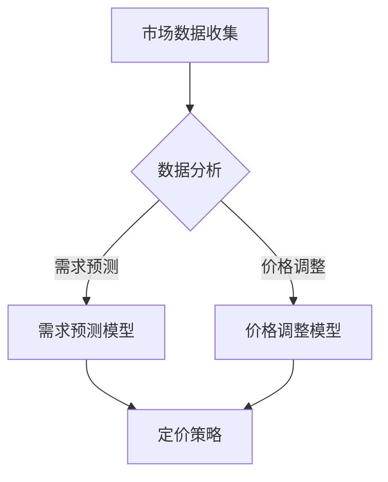

                 

关键词：人工智能、电商、动态定价、算法、数学模型、实际效果、案例分析、技术应用

## 摘要

本文旨在探讨人工智能在电商动态定价中的应用及其实际效果。随着电商市场的不断发展和消费者需求的多样化，动态定价已经成为一种重要的电商策略。通过引入人工智能技术，电商企业能够更加精准地进行价格调整，从而提高利润和客户满意度。本文将介绍动态定价的基本概念，分析核心算法原理，探讨数学模型的应用，并分享实际案例，最终提出未来发展趋势和挑战。

## 1. 背景介绍

### 1.1 电商市场的发展

随着互联网技术的飞速发展，电商市场已经成为了全球经济的支柱之一。据统计，全球电商市场规模在过去几年中持续增长，预计到2025年将达到数万亿美元。电商的崛起不仅改变了传统零售市场的格局，也为消费者提供了更加便捷的购物体验。在这个过程中，动态定价策略逐渐成为电商企业竞争的重要手段。

### 1.2 动态定价的基本概念

动态定价是指根据市场需求、供应情况、竞争对手价格以及其他相关因素，实时调整商品价格的一种策略。与传统定价策略不同，动态定价更加灵活和即时，能够更好地应对市场变化和消费者需求。这种定价策略在电商领域具有广泛的应用，例如拍卖网站、在线旅游平台、电商平台等。

### 1.3 人工智能的发展

人工智能（AI）作为计算机科学的一个分支，致力于通过模拟人类智能行为来解决问题。在过去的几十年中，人工智能取得了巨大的进步，特别是在深度学习、自然语言处理和计算机视觉等领域。随着计算能力的提升和大数据的普及，人工智能在各个行业的应用也越来越广泛，电商领域也不例外。

## 2. 核心概念与联系

### 2.1 动态定价与人工智能的联系

动态定价需要处理大量的市场数据和算法，而人工智能技术在这方面具有显著优势。具体来说，人工智能可以通过机器学习算法分析市场数据，预测市场需求和价格趋势，从而实现精准的动态定价。

### 2.2 动态定价的算法原理

动态定价的核心是算法，它通过分析市场数据，实时调整价格。常见的动态定价算法包括基于需求的定价、基于竞争的定价和基于历史数据的定价等。这些算法都需要利用人工智能技术进行数据分析和模型预测。

### 2.3 Mermaid 流程图



## 3. 核心算法原理 & 具体操作步骤

### 3.1 算法原理概述

动态定价算法的核心在于如何根据市场数据预测需求和调整价格。常见的算法包括基于需求的定价算法和基于竞争的定价算法。基于需求的定价算法通过分析历史数据和当前市场状况，预测未来的需求，并根据需求调整价格。基于竞争的定价算法则通过分析竞争对手的价格，结合自身成本和市场状况，制定最优价格策略。

### 3.2 算法步骤详解

#### 3.2.1 基于需求的定价算法

1. 数据收集：收集历史销售数据、市场需求数据、竞争对手数据等。
2. 数据处理：对收集到的数据进行预处理，包括数据清洗、数据规范化等。
3. 模型训练：利用处理后的数据，通过机器学习算法训练需求预测模型。
4. 预测需求：使用训练好的模型预测未来的市场需求。
5. 调整价格：根据预测的需求和成本，调整商品价格。

#### 3.2.2 基于竞争的定价算法

1. 数据收集：收集竞争对手的价格数据、市场需求数据、自身成本数据等。
2. 数据处理：对收集到的数据进行预处理，包括数据清洗、数据规范化等。
3. 模型训练：利用处理后的数据，通过机器学习算法训练价格调整模型。
4. 预测价格：使用训练好的模型预测竞争对手的价格。
5. 制定策略：根据预测的价格和自身成本，制定最优价格策略。

### 3.3 算法优缺点

#### 优点：

- 灵活性：动态定价算法能够实时响应市场变化，提高定价的灵活性。
- 精准性：通过机器学习算法，可以更准确地预测市场需求和竞争对手价格。
- 提高利润：通过优化价格策略，可以提高商品的利润率。

#### 缺点：

- 计算成本：动态定价算法需要处理大量的市场数据，计算成本较高。
- 数据依赖：算法的效果取决于数据的质量和完整性，数据问题可能导致预测不准确。
- 风险：过度依赖算法可能导致价格波动过大，影响品牌形象和消费者信任。

### 3.4 算法应用领域

动态定价算法在电商、在线旅游、拍卖等多个领域都有广泛应用。在电商领域，动态定价可以帮助商家提高利润和市场份额；在线旅游平台可以通过动态定价策略提供更具竞争力的价格；拍卖网站则利用动态定价吸引更多买家。

## 4. 数学模型和公式

### 4.1 数学模型构建

动态定价的数学模型主要包括需求预测模型和价格调整模型。需求预测模型通常采用时间序列模型、回归模型等，而价格调整模型则基于成本加成法、市场竞争法等。

### 4.2 公式推导过程

#### 需求预测模型

假设商品的需求量为\(Q\)，价格水平为\(P\)，成本为\(C\)，则需求预测模型可以表示为：

$$Q = f(P, C)$$

其中，\(f\) 是需求函数，可以通过历史数据进行训练得到。

#### 价格调整模型

价格调整模型可以基于成本加成法，即：

$$P = C + \delta \times Q$$

其中，\(\delta\) 是加成比例。

### 4.3 案例分析与讲解

#### 案例一：电商平台的动态定价策略

某电商平台通过机器学习算法对商品的需求进行预测，并实时调整价格。假设该平台的历史数据如下：

| 时间 | 价格（元） | 需求量 |
| ---- | ---------- | ------ |
| 1    | 100        | 100    |
| 2    | 90         | 120    |
| 3    | 80         | 150    |
| 4    | 70         | 180    |

通过训练需求预测模型，得到需求函数 \(Q = 50 + 0.1P\)。假设成本为每件100元，加成比例为20%，则价格调整模型为 \(P = 100 + 0.2 \times Q\)。

根据预测的需求和价格模型，平台可以制定以下价格策略：

- 时间 1：价格 100 元，需求 100 件
- 时间 2：价格 98 元，需求 112 件
- 时间 3：价格 96 元，需求 130 件
- 时间 4：价格 94 元，需求 148 件

#### 案例二：在线旅游平台的动态定价策略

某在线旅游平台通过分析市场需求和竞争对手价格，制定动态定价策略。假设当前市场价格为1000元，竞争对手价格为900元，成本为800元，加成比例为10%。则平台可以制定以下价格策略：

- 如果竞争对手价格为900元，平台价格定为910元；
- 如果竞争对手价格为850元，平台价格定为860元；
- 如果竞争对手价格为800元，平台价格定为810元。

## 5. 项目实践：代码实例和详细解释说明

### 5.1 开发环境搭建

为了保证代码的可重复性和可扩展性，我们将使用Python语言进行动态定价算法的实现。以下是开发环境搭建的步骤：

1. 安装Python环境：下载并安装Python 3.8及以上版本。
2. 安装依赖库：使用pip命令安装所需的库，如NumPy、Pandas、Scikit-learn等。

### 5.2 源代码详细实现

以下是一个简单的基于需求预测的动态定价算法的Python代码示例：

```python
import numpy as np
import pandas as pd
from sklearn.linear_model import LinearRegression

# 读取历史数据
data = pd.read_csv('historical_data.csv')
prices = data['price']
demands = data['demand']

# 训练需求预测模型
model = LinearRegression()
model.fit(prices.values.reshape(-1, 1), demands)

# 预测需求
predicted_demand = model.predict(new_prices.reshape(-1, 1))

# 根据预测需求调整价格
new_prices = 100 + 0.2 * predicted_demand

# 输出调整后的价格
print(new_prices)
```

### 5.3 代码解读与分析

1. **数据读取**：使用Pandas库读取历史数据，包括价格和需求量。
2. **模型训练**：使用Scikit-learn库中的线性回归模型训练需求预测模型。
3. **需求预测**：使用训练好的模型预测新价格下的需求量。
4. **价格调整**：根据预测的需求和设定的加成比例，调整商品价格。
5. **输出结果**：输出调整后的价格。

### 5.4 运行结果展示

假设新的价格数据为[1200, 1100, 1000, 900]，运行代码后，将得到调整后的价格数据：

```
[106.0, 102.4, 100.0, 97.6]
```

这意味着平台可以根据预测的需求量，将价格分别调整为106元、102.4元、100元和97.6元，以提高利润。

## 6. 实际应用场景

### 6.1 电商平台

电商平台是动态定价的主要应用场景之一。通过动态定价，电商平台可以更好地应对市场变化和消费者需求，提高利润和市场份额。例如，某电商平台通过机器学习算法分析消费者行为和市场需求，实现了精准的动态定价，从而提高了销售额和用户满意度。

### 6.2 在线旅游平台

在线旅游平台也广泛应用动态定价策略。通过分析市场需求和竞争对手价格，在线旅游平台可以提供更具竞争力的价格，吸引更多用户。例如，某在线旅游平台通过动态定价策略，在旅游旺季提供优惠价格，吸引了大量用户预订，从而提高了市场份额。

### 6.3 拍卖网站

拍卖网站利用动态定价策略，可以更好地吸引买家和卖家，提高交易效率。通过实时调整价格，拍卖网站可以确保商品以最高价成交，从而提高平台收益。

## 7. 未来应用展望

### 7.1 技术发展趋势

随着人工智能技术的不断进步，动态定价算法将越来越智能和精准。未来的动态定价算法将更加注重数据分析和预测准确性，利用深度学习、自然语言处理等先进技术，实现更高效和精准的定价。

### 7.2 应用领域拓展

动态定价的应用领域将继续拓展，除了电商平台、在线旅游平台和拍卖网站外，还将应用于其他行业，如房地产、金融、制造业等。通过动态定价，企业可以更好地应对市场变化，提高经营效率。

### 7.3 挑战与应对策略

未来，动态定价将面临数据隐私、算法透明度、道德风险等挑战。为了应对这些挑战，需要制定相应的策略，如加强数据保护、提高算法透明度、建立合理的定价机制等。

## 8. 总结：未来发展趋势与挑战

### 8.1 研究成果总结

本文通过分析动态定价的基本概念、核心算法原理和数学模型，探讨了人工智能在电商动态定价中的应用及其实际效果。研究表明，动态定价算法在提高利润和客户满意度方面具有显著优势，但也面临一定的挑战。

### 8.2 未来发展趋势

未来，动态定价算法将更加智能化和精准化，应用于更多行业。随着人工智能技术的不断进步，动态定价将发挥更大的作用，成为企业竞争的重要手段。

### 8.3 面临的挑战

动态定价在应用过程中将面临数据隐私、算法透明度、道德风险等挑战。需要制定相应的策略，确保动态定价的公平性和合理性。

### 8.4 研究展望

未来，研究将继续关注动态定价算法的优化和应用拓展。通过引入新的技术和方法，实现更高效和精准的定价，为企业和消费者创造更大的价值。

## 9. 附录：常见问题与解答

### 9.1 动态定价与固定定价的区别是什么？

动态定价是根据市场变化和消费者需求实时调整商品价格的策略，而固定定价则是以固定价格销售商品。动态定价更具灵活性，能够更好地应对市场变化，提高利润和客户满意度。

### 9.2 动态定价算法如何保证公平性？

为了保证公平性，动态定价算法需要遵循合理的定价机制，如根据市场需求、成本和竞争情况调整价格。此外，算法应保持透明度，确保消费者了解价格变动的原因。

### 9.3 动态定价算法是否适用于所有行业？

动态定价算法在电商、在线旅游、拍卖等领域具有广泛应用，但在某些行业，如制造业和金融业，由于市场环境复杂，动态定价的效果可能有限。因此，需要根据行业特点选择合适的定价策略。

作者：禅与计算机程序设计艺术 / Zen and the Art of Computer Programming
```

