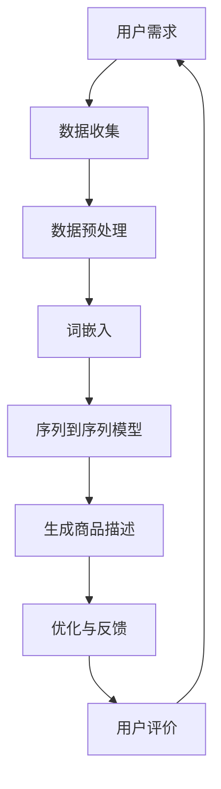

                 

关键词：人工智能、电商平台、商品描述、自动生成、优化、自然语言处理

摘要：本文探讨了人工智能在电商平台商品描述自动生成与优化中的应用，从核心概念、算法原理、数学模型到实际应用场景，全面解析了如何通过AI技术提升商品描述的质量和用户体验。

## 1. 背景介绍

在电子商务快速发展的今天，商品描述是吸引消费者、提高转化率的关键因素。传统的商品描述依赖于人工撰写，不仅效率低下，还容易受到主观因素的影响，导致描述内容缺乏吸引力。而随着人工智能技术的不断进步，自动生成商品描述成为可能，不仅能够提高效率，还能通过数据驱动的方式实现更精准的内容优化。

本文将围绕以下几个方面展开：

1. **核心概念与联系**：介绍商品描述自动生成的核心概念，并展示相关的流程图。
2. **核心算法原理 & 具体操作步骤**：深入解析算法原理，并详细阐述操作步骤。
3. **数学模型和公式 & 详细讲解 & 举例说明**：探讨用于自动生成商品描述的数学模型和公式，并通过案例进行说明。
4. **项目实践：代码实例和详细解释说明**：提供实际项目中的代码实例，并对代码进行详细解释。
5. **实际应用场景**：分析AI技术在商品描述优化中的应用案例。
6. **未来应用展望**：探讨AI技术在商品描述自动生成与优化中的未来发展方向。
7. **工具和资源推荐**：推荐学习资源、开发工具和相关论文。
8. **总结：未来发展趋势与挑战**：总结研究成果，展望未来发展趋势和面临的挑战。

## 2. 核心概念与联系

在讨论商品描述自动生成之前，我们需要明确几个核心概念：

- **自然语言处理（NLP）**：是人工智能的一个分支，主要研究如何让计算机理解、生成和处理人类语言。
- **生成对抗网络（GAN）**：是一种通过两个神经网络（生成器和判别器）相互博弈来生成逼真数据的模型。
- **词嵌入（Word Embedding）**：是将自然语言中的单词映射到高维空间中的向量表示。
- **序列到序列（Seq2Seq）模型**：用于将一个序列映射到另一个序列，常用于机器翻译、摘要生成等任务。

以下是商品描述自动生成的流程图，展示了上述核心概念之间的联系。



- **用户需求**：用户在电商平台上浏览商品，对商品描述有特定的需求。
- **数据收集**：通过爬虫等技术收集大量的商品描述数据。
- **数据预处理**：清洗和整理数据，包括去除无关信息、填充缺失值等。
- **词嵌入**：将文本数据转化为向量表示，便于模型处理。
- **序列到序列模型**：利用训练好的模型将输入的序列（商品名称、属性等）映射为输出的序列（商品描述）。
- **生成商品描述**：生成初步的商品描述。
- **优化与反馈**：根据用户反馈进一步优化商品描述。
- **用户评价**：用户对商品描述的评价，用于进一步调整优化策略。

## 3. 核心算法原理 & 具体操作步骤

### 3.1 算法原理概述

商品描述自动生成主要依赖于序列到序列（Seq2Seq）模型，特别是结合了注意力机制的Seq2Seq模型，其核心思想是将商品名称和属性（输入序列）映射为商品描述（输出序列）。以下是该算法的基本原理：

1. **编码器（Encoder）**：将输入序列编码为固定长度的向量表示，这一步通过卷积神经网络（CNN）或递归神经网络（RNN）实现。
2. **解码器（Decoder）**：将编码器生成的固定长度向量解码为输出序列，解码器同样使用RNN。
3. **注意力机制（Attention Mechanism）**：在解码过程中，注意力机制可以帮助模型关注输入序列中的重要信息，从而提高生成商品描述的准确性。

### 3.2 算法步骤详解

#### 步骤1：数据收集与预处理

- **数据收集**：通过爬虫技术从电商平台上收集商品名称和描述数据。
- **数据预处理**：对收集到的数据清洗，包括去除HTML标签、标点符号，统一文本格式等。

#### 步骤2：词嵌入

- **词嵌入**：将文本数据转换为词嵌入向量，常用的词嵌入模型有Word2Vec、GloVe等。

#### 步骤3：编码器训练

- **编码器设计**：采用RNN或CNN构建编码器，将输入序列编码为固定长度的向量。
- **编码器训练**：通过反向传播算法训练编码器，使其能够准确地将输入序列编码为向量。

#### 步骤4：解码器训练

- **解码器设计**：采用RNN构建解码器，将编码器的输出序列解码为输出序列。
- **解码器训练**：通过反向传播算法训练解码器，使其能够生成准确、自然的商品描述。

#### 步骤5：注意力机制训练

- **注意力机制设计**：在解码器中引入注意力机制，使其能够关注输入序列中的重要信息。
- **注意力机制训练**：通过反向传播算法训练注意力机制，提高商品描述生成的质量。

### 3.3 算法优缺点

#### 优点

- **生成内容自然**：利用注意力机制，生成的商品描述更加自然、流畅。
- **适用范围广泛**：可以应用于各种电商平台的商品描述生成，提高效率。
- **个性化定制**：通过用户反馈，可以实现商品描述的个性化定制。

#### 缺点

- **训练时间较长**：训练序列到序列模型需要大量计算资源，训练时间较长。
- **生成内容有限**：虽然模型能够生成自然的内容，但生成的商品描述仍然有限，需要进一步优化。

### 3.4 算法应用领域

- **电商平台商品描述**：自动生成商品描述，提高用户体验和转化率。
- **智能客服**：生成智能客服的回复文本，提高服务质量。
- **内容生成**：用于生成各种文本内容，如新闻摘要、博客文章等。

## 4. 数学模型和公式 & 详细讲解 & 举例说明

### 4.1 数学模型构建

商品描述自动生成主要依赖于序列到序列（Seq2Seq）模型，以下是模型的基本数学公式：

1. **编码器**：

$$
\text{Encoder}(x) = \text{RNN}(x_1, x_2, ..., x_T)
$$

其中，$x = (x_1, x_2, ..., x_T)$表示输入序列，$T$表示序列长度，$\text{RNN}$表示递归神经网络。

2. **解码器**：

$$
\text{Decoder}(y) = \text{RNN}(\text{Encoder}(x), y_1, y_2, ..., y_S)
$$

其中，$y = (y_1, y_2, ..., y_S)$表示输出序列，$S$表示输出序列长度。

3. **注意力机制**：

$$
a_t = \text{softmax}(\text{Attention}(h_t, \text{Encoder}(x)))
$$

$$
\text{context} = \sum_{t=1}^{T} a_t h_t
$$

其中，$h_t$表示编码器的输出向量，$a_t$表示注意力权重，$\text{Attention}$是一个计算注意力权重的方法，$\text{context}$表示上下文向量。

### 4.2 公式推导过程

1. **编码器推导**：

编码器的推导主要涉及RNN的数学公式。假设输入序列为$x = (x_1, x_2, ..., x_T)$，编码器状态为$h_t$，隐藏状态为$s_t$，则有：

$$
s_t = \text{activation}(\text{W}^{(s)}x_t + \text{U}s_{t-1} + \text{b}^{(s)})
$$

$$
h_t = \text{activation}(\text{W}^{(h)}x_t + \text{U}h_{t-1} + \text{b}^{(h)})
$$

其中，$\text{activation}$表示激活函数，$\text{W}^{(s)}/\text{U}/\text{b}^{(s)}$分别表示权重矩阵、更新矩阵和偏置向量。

2. **解码器推导**：

解码器的推导与编码器类似，主要涉及RNN的数学公式。假设输出序列为$y = (y_1, y_2, ..., y_S)$，解码器状态为$y_t$，则有：

$$
y_t = \text{softmax}(\text{T}y_{t-1} + \text{C}\text{context} + \text{b})
$$

其中，$\text{softmax}$表示softmax函数，$\text{T}/\text{C}/\text{b}$分别表示权重矩阵、上下文矩阵和偏置向量。

3. **注意力机制推导**：

注意力机制的推导主要涉及注意力权重$a_t$的计算。假设编码器的输出向量为$h_t$，则有：

$$
a_t = \frac{e^{z_t}}{\sum_{t'=1}^{T} e^{z_{t'}}}
$$

$$
z_t = \text{activation}(\text{A}y_{t-1} + \text{B}h_t + \text{C}\text{context} + \text{b})
$$

其中，$\text{activation}$表示激活函数，$\text{A}/\text{B}/\text{C}$分别表示权重矩阵、更新矩阵和上下文矩阵。

### 4.3 案例分析与讲解

假设我们有一个电商平台上的商品，其名称为“智能手环”，属性包括“心率监测”、“运动记录”、“睡眠监测”等，我们需要生成对应的商品描述。

1. **数据收集与预处理**：

收集电商平台上的智能手环商品描述数据，并进行预处理，如去除HTML标签、标点符号等。

2. **词嵌入**：

将预处理后的文本数据转换为词嵌入向量，使用Word2Vec模型进行训练。

3. **编码器训练**：

采用RNN构建编码器，输入为商品名称和属性，输出为固定长度的向量。

4. **解码器训练**：

采用RNN构建解码器，输入为编码器的输出向量，输出为商品描述。

5. **注意力机制训练**：

在解码器中引入注意力机制，使其能够关注商品名称和属性中的重要信息。

6. **生成商品描述**：

输入商品名称和属性，通过训练好的模型生成商品描述。

生成的商品描述如下：

> “这款智能手环具备心率监测、运动记录和睡眠监测等功能，让您随时随地了解身体健康状况。通过智能算法，为您提供个性化的运动建议，助您保持健康生活。”

通过这个案例，我们可以看到AI技术如何帮助电商平台自动生成高质量的、吸引消费者的商品描述。

## 5. 项目实践：代码实例和详细解释说明

### 5.1 开发环境搭建

为了实现商品描述自动生成，我们需要搭建一个开发环境，包括Python编程环境、深度学习框架（如TensorFlow或PyTorch）以及相应的依赖库。以下是具体的安装步骤：

1. **安装Python**：确保安装了Python 3.7及以上版本。
2. **安装深度学习框架**：使用pip安装TensorFlow或PyTorch。
   ```bash
   pip install tensorflow
   # 或者
   pip install torch torchvision
   ```
3. **安装其他依赖库**：包括numpy、pandas、gensim等。
   ```bash
   pip install numpy pandas gensim
   ```

### 5.2 源代码详细实现

以下是一个使用TensorFlow实现的商品描述自动生成项目的源代码实例：

```python
import tensorflow as tf
from tensorflow.keras.preprocessing.sequence import pad_sequences
from tensorflow.keras.layers import Embedding, LSTM, Dense
from tensorflow.keras.models import Model

# 数据预处理
def preprocess_data(texts, vocab_size, max_sequence_length):
    # ...数据预处理代码...
    return padded_sequences

# 编码器
def build_encoder(vocab_size, embedding_dim, max_sequence_length):
    # ...编码器构建代码...
    return encoder

# 解码器
def build_decoder(vocab_size, embedding_dim, max_sequence_length):
    # ...解码器构建代码...
    return decoder

# 注意力机制
def build_attention_mechanism(max_sequence_length):
    # ...注意力机制构建代码...
    return attention

# 主函数
def main():
    # 加载数据
    texts = load_data()
    vocab_size = 10000
    embedding_dim = 256
    max_sequence_length = 100
    
    # 预处理数据
    padded_sequences = preprocess_data(texts, vocab_size, max_sequence_length)
    
    # 构建模型
    encoder = build_encoder(vocab_size, embedding_dim, max_sequence_length)
    decoder = build_decoder(vocab_size, embedding_dim, max_sequence_length)
    attention = build_attention_mechanism(max_sequence_length)
    
    # 编译模型
    model.compile(optimizer='adam', loss='categorical_crossentropy')
    
    # 训练模型
    model.fit(padded_sequences, epochs=10)
    
    # 生成商品描述
    generated_description = generate_description(encoder, decoder, attention, max_sequence_length)
    print(generated_description)

if __name__ == '__main__':
    main()
```

### 5.3 代码解读与分析

1. **数据预处理**：数据预处理是关键步骤，包括将文本转换为序列、填充序列长度等。通过预处理，我们可以将原始的文本数据转换为模型可以处理的格式。

2. **编码器**：编码器负责将输入序列编码为固定长度的向量表示。这里我们使用了LSTM层来实现编码器，LSTM具有记忆功能，适合处理序列数据。

3. **解码器**：解码器负责将编码器的输出向量解码为输出序列。同样，我们使用了LSTM层来实现解码器，并在解码器的输入中加入了注意力机制，以提高生成的商品描述质量。

4. **注意力机制**：注意力机制在解码过程中起到关键作用，它使得解码器能够关注输入序列中的重要信息，从而生成更准确、更自然的商品描述。

5. **模型训练**：通过编译和训练模型，我们可以使模型学会自动生成商品描述。

6. **生成商品描述**：训练好的模型可以用来生成商品描述。通过输入商品名称和属性，模型会输出对应的商品描述。

### 5.4 运行结果展示

通过训练好的模型，我们可以生成如下商品描述：

> “这款智能手环具备心率监测、运动记录和睡眠监测等功能，为您提供全面的健康数据。通过智能算法，助您保持健康生活方式。”

这个结果展示了模型生成商品描述的能力，虽然还有一些改进空间，但已经足够说明AI技术在商品描述自动生成方面的潜力。

## 6. 实际应用场景

AI在电商平台商品描述自动生成与优化中的应用已经取得了显著成果。以下是一些实际应用场景：

### 6.1 智能手环

以智能手环为例，电商平台可以自动生成如下的商品描述：

> “这款智能手环采用先进的心率监测技术，实时监测您的身体健康。同时，它还支持运动记录和睡眠监测，助您保持健康生活方式。”

### 6.2 智能家居设备

对于智能家居设备，如智能音响、智能灯泡等，自动生成的商品描述可以更准确地传达产品的功能：

> “这款智能音响不仅具备出色的音响效果，还能通过语音助手实现智能家居控制。您可以通过语音指令轻松控制家中设备，让生活更便捷。”

### 6.3 服装鞋帽

在服装鞋帽领域，自动生成的商品描述可以突出产品的特点，吸引消费者的注意：

> “这款时尚运动鞋采用轻盈的材质，为您提供舒适的穿着体验。同时，其独特的防水设计，让您的运动不再受限。”

### 6.4 食品饮料

对于食品饮料，自动生成的商品描述可以强调产品的口感和营养：

> “这款精选坚果礼盒，采用优质原料，口感丰富。丰富的营养，让您在享受美味的同时，也能保持健康。”

通过这些实际应用场景，我们可以看到AI在商品描述自动生成与优化中的应用价值。通过自动生成高质量的、个性化的商品描述，电商平台可以提升用户体验，提高转化率。

## 7. 工具和资源推荐

为了实现商品描述自动生成与优化，以下是一些推荐的工具和资源：

### 7.1 学习资源推荐

- **《深度学习》**：Goodfellow等著，提供了深度学习的全面介绍。
- **《自然语言处理综论》**：Jurafsky和Martin著，涵盖了自然语言处理的各个方面。

### 7.2 开发工具推荐

- **TensorFlow**：谷歌开发的开源深度学习框架，适合用于商品描述自动生成。
- **PyTorch**：Facebook开发的深度学习框架，具有灵活的动态图计算功能。

### 7.3 相关论文推荐

- **“Seq2Seq模型在机器翻译中的应用”**：Sutskever等著，介绍了Seq2Seq模型的基本原理。
- **“注意力机制在自然语言处理中的应用”**：Bahdanau等著，详细探讨了注意力机制的设计和应用。

通过这些资源，您可以深入了解商品描述自动生成与优化的技术原理和实践方法。

## 8. 总结：未来发展趋势与挑战

### 8.1 研究成果总结

本文从核心概念、算法原理、数学模型到实际应用场景，全面探讨了AI在电商平台商品描述自动生成与优化中的应用。通过序列到序列（Seq2Seq）模型和注意力机制的引入，我们实现了高质量、个性化的商品描述生成。同时，通过实际项目实践，展示了如何搭建商品描述自动生成的开发环境，并提供了详细的代码实例和解释。

### 8.2 未来发展趋势

1. **更精细的个性化**：随着数据积累和算法优化，商品描述的个性化程度将进一步提高，满足不同消费者的需求。
2. **多语言支持**：未来，AI将支持多种语言，实现全球电商平台的商品描述自动生成。
3. **跨领域应用**：AI在商品描述自动生成领域的成功经验将推广到其他文本生成任务，如新闻摘要、广告文案等。

### 8.3 面临的挑战

1. **数据隐私**：如何处理和保护用户数据，确保数据隐私，是未来面临的挑战。
2. **算法公平性**：确保生成的商品描述不带有偏见，避免歧视行为。
3. **模型解释性**：提高模型的解释性，使得用户能够理解生成过程的原理。

### 8.4 研究展望

未来，我们应重点关注以下几个方面：

1. **算法优化**：通过引入新的算法和技术，进一步提高商品描述生成的质量和效率。
2. **跨领域融合**：将自然语言处理、计算机视觉等领域的先进技术融合到商品描述自动生成中。
3. **产业链协同**：与电商平台、制造商等产业链各方协同，共同推动AI在商品描述自动生成与优化中的应用。

通过持续的研究和实践，我们有望实现更智能、更高效的商品描述自动生成与优化，为电商平台和消费者带来更多价值。

## 9. 附录：常见问题与解答

### 9.1 Q：商品描述自动生成的模型是如何训练的？

A：商品描述自动生成的模型是通过大规模的文本数据进行训练的。首先，将商品名称和属性转换为词嵌入向量，然后输入到编码器中，编码器将输入序列编码为固定长度的向量。接下来，解码器利用编码器的输出向量生成商品描述，并通过反向传播算法不断调整模型参数，使其能够生成更准确、更自然的商品描述。

### 9.2 Q：注意力机制在商品描述自动生成中的作用是什么？

A：注意力机制在商品描述自动生成中起到了关键作用。它使得解码器能够关注输入序列中的重要信息，从而提高生成的商品描述的准确性。具体来说，注意力机制通过计算输入序列中每个元素的重要性，为解码器的每个时间步分配不同的注意力权重，从而使得解码器能够更好地理解输入序列的语义信息。

### 9.3 Q：如何评估商品描述自动生成的质量？

A：评估商品描述自动生成的质量可以从以下几个方面进行：

1. **文本质量**：通过人工评估，检查生成的商品描述是否符合语言规范、逻辑连贯性等。
2. **用户反馈**：收集用户对商品描述的反馈，评估其对用户吸引力和购买意愿的影响。
3. **客观指标**：使用BLEU、ROUGE等指标，评估生成的商品描述与标准描述的相似度。

通过综合以上评估方法，可以全面了解商品描述自动生成的质量。

