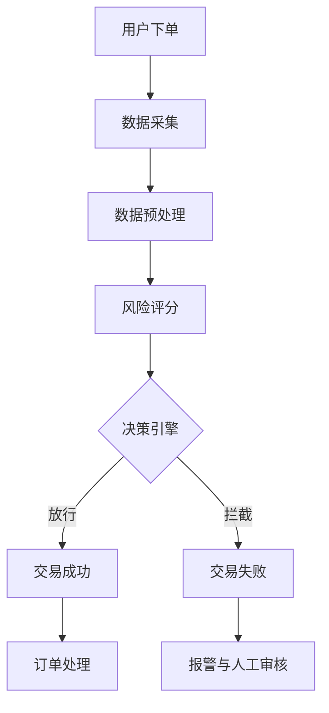

                 

关键词：人工智能、电商支付、风控系统、实时监控、安全交易、算法、数学模型

> 摘要：随着电商行业的迅猛发展，支付风险问题日益突出。本文深入探讨了人工智能在电商支付风控中的应用，分析了核心概念、算法原理、数学模型以及实际项目案例，并提出了一种基于实时监控的支付风控系统，为构建安全交易环境提供了有力支持。

## 1. 背景介绍

在电商支付领域，风险控制一直是至关重要的环节。随着网络支付的普及，不法分子利用技术手段进行欺诈、洗钱等违法行为，给电商平台和用户带来了巨大的损失。传统的风控手段主要依赖于规则引擎和人工审核，尽管在一定程度上能够防范风险，但在面对复杂多变的网络攻击和异常行为时，仍显得力不从心。因此，将人工智能技术应用于电商支付风控，成为解决这一问题的关键。

人工智能技术在风控中的应用主要包括以下几个方面：

1. **数据挖掘与分析**：通过对海量交易数据进行分析，发现潜在的异常行为和风险点。
2. **机器学习与预测**：利用机器学习算法，建立风控模型，对交易行为进行实时预测和预警。
3. **深度学习与图像识别**：用于识别交易过程中的恶意行为和虚假交易。
4. **自然语言处理**：用于处理用户反馈和投诉，辅助人工审核和决策。

本文将围绕这些技术，探讨人工智能在电商支付风控中的应用，并提出一种基于实时监控的支付风控系统。

## 2. 核心概念与联系

### 2.1. 人工智能与风控

人工智能（AI）是指由人制造出的系统所表现出的智能行为。在风控领域，人工智能的应用主要体现在以下几个方面：

- **自动化决策**：利用机器学习算法，自动识别交易风险，实现自动化决策。
- **风险评估**：通过分析历史数据和实时数据，评估交易风险，制定风控策略。
- **异常检测**：实时监控交易行为，发现异常行为和潜在风险。

### 2.2. 电商支付与风控

电商支付是指在线上电商平台进行的支付行为。风控在电商支付中的应用主要包括：

- **交易监控**：实时监控交易行为，发现异常交易和可疑行为。
- **欺诈防范**：通过识别欺诈行为，防范支付欺诈风险。
- **用户身份验证**：确保交易双方的身份真实可靠。

### 2.3. 实时监控与风控

实时监控是风控系统的重要部分，它能够快速发现和响应异常交易。实时监控与风控的联系如下：

- **实时数据处理**：实时监控系统对交易数据进行实时处理，提取关键信息。
- **风险预警**：实时监控系统发现异常交易后，立即发出风险预警，触发风控策略。
- **快速响应**：风控系统能够快速响应实时监控系统的预警，采取相应的防范措施。

### 2.4. Mermaid 流程图

以下是电商支付风控系统的 Mermaid 流程图：



## 3. 核心算法原理 & 具体操作步骤

### 3.1. 算法原理概述

本文采用的核心算法主要包括机器学习算法和深度学习算法。其中，机器学习算法用于风险评估和欺诈检测，深度学习算法用于图像识别和自然语言处理。

### 3.2. 算法步骤详解

#### 3.2.1. 机器学习算法

1. **数据收集**：收集电商平台的交易数据，包括用户信息、交易金额、时间、地点等。
2. **数据预处理**：对收集到的数据进行分析，去除异常数据和噪声，提取关键特征。
3. **特征工程**：根据业务需求，构建特征向量，用于训练模型。
4. **模型训练**：利用训练集，使用机器学习算法训练风险评分模型和欺诈检测模型。
5. **模型评估**：使用测试集评估模型性能，调整模型参数。
6. **模型应用**：将训练好的模型应用于实时交易数据，评估交易风险和欺诈风险。

#### 3.2.2. 深度学习算法

1. **图像识别**：利用卷积神经网络（CNN）对交易过程中的图像进行识别，判断是否为恶意行为。
2. **自然语言处理**：利用循环神经网络（RNN）或Transformer模型，对用户反馈和投诉进行分析，辅助人工审核。

### 3.3. 算法优缺点

#### 优点

- **高效性**：机器学习和深度学习算法能够快速处理大量数据，提高风控效率。
- **准确性**：通过对历史数据的分析，能够准确评估交易风险和欺诈风险。
- **适应性**：算法可以根据实时数据动态调整，适应不同的风险环境。

#### 缺点

- **复杂性**：算法设计和实现过程复杂，需要专业的技术团队。
- **成本高**：算法训练和部署需要大量的计算资源和时间。
- **数据依赖性**：算法的性能依赖于数据的质量和数量。

### 3.4. 算法应用领域

- **电商支付风控**：评估交易风险，防范欺诈行为。
- **金融风控**：识别金融欺诈，防范风险。
- **网络安全**：检测恶意行为，保护网络安全。

## 4. 数学模型和公式 & 详细讲解 & 举例说明

### 4.1. 数学模型构建

在电商支付风控中，常用的数学模型包括逻辑回归模型、支持向量机（SVM）模型和神经网络模型。以下是这些模型的构建过程。

#### 4.1.1. 逻辑回归模型

逻辑回归模型是一种用于分类的线性模型，其公式如下：

$$
P(y=1) = \frac{1}{1 + e^{-\beta^T x}}
$$

其中，$P(y=1)$ 表示交易为欺诈的概率，$\beta$ 为模型参数，$x$ 为特征向量。

#### 4.1.2. 支持向量机模型

支持向量机模型是一种用于分类的机器学习算法，其公式如下：

$$
\min \frac{1}{2} \sum_{i=1}^{n} (w_i^2) + C \sum_{i=1}^{n} \max(0, 1-y_i(\beta^T x_i + b))
$$

其中，$w_i$ 为支持向量，$C$ 为惩罚参数，$y_i$ 为标签，$x_i$ 为特征向量，$\beta$ 为模型参数，$b$ 为偏置。

#### 4.1.3. 神经网络模型

神经网络模型是一种基于多层感知器的非线性模型，其公式如下：

$$
a_{i,j}^{(l)} = \sigma(z_{i,j}^{(l)})
$$

$$
z_{i,j}^{(l)} = \sum_{k=1}^{n} w_{i,k}^{(l)} a_{k,j}^{(l-1)} + b_{j}^{(l)}
$$

其中，$a_{i,j}^{(l)}$ 表示第$l$层的第$i$个神经元输出，$z_{i,j}^{(l)}$ 表示第$l$层的第$i$个神经元的输入，$\sigma$ 为激活函数，$w_{i,k}^{(l)}$ 为连接权重，$b_{j}^{(l)}$ 为偏置。

### 4.2. 公式推导过程

#### 4.2.1. 逻辑回归模型推导

逻辑回归模型的推导过程如下：

假设我们有$m$个样本，每个样本的特征向量为$x_i$，标签为$y_i$，其中$y_i \in \{0, 1\}$。我们希望最大化似然函数：

$$
L(\theta) = \prod_{i=1}^{m} P(y_i|x_i; \theta)
$$

由于$y_i$是离散的，所以我们可以将其表示为：

$$
P(y_i=1|x_i; \theta) = \frac{1}{1 + e^{-\theta^T x_i}}
$$

$$
P(y_i=0|x_i; \theta) = 1 - P(y_i=1|x_i; \theta)
$$

因此，似然函数可以写为：

$$
L(\theta) = \prod_{i=1}^{m} \left( \frac{1}{1 + e^{-\theta^T x_i}} \right)^{y_i} \left( 1 - \frac{1}{1 + e^{-\theta^T x_i}} \right)^{1-y_i}
$$

取对数似然函数，得到：

$$
l(\theta) = \sum_{i=1}^{m} y_i \theta^T x_i - \sum_{i=1}^{m} \theta^T x_i
$$

为了求解最大似然估计，我们需要对$l(\theta)$求导，并令导数为0：

$$
\frac{\partial l(\theta)}{\partial \theta} = \sum_{i=1}^{m} y_i x_i - \sum_{i=1}^{m} x_i = 0
$$

解得：

$$
\theta = \frac{1}{m} \sum_{i=1}^{m} y_i x_i
$$

#### 4.2.2. 支持向量机模型推导

支持向量机模型的推导过程如下：

假设我们有$m$个样本，每个样本的特征向量为$x_i$，标签为$y_i$，其中$y_i \in \{-1, 1\}$。我们希望最大化分离超平面：

$$
\max_{\beta, b} \frac{1}{2} \sum_{i=1}^{m} (w_i^2) + C \sum_{i=1}^{m} \max(0, 1-y_i(\beta^T x_i + b))
$$

其中，$w_i$ 为支持向量，$C$ 为惩罚参数。

对目标函数求导，得到：

$$
\frac{\partial L}{\partial \beta} = 0
$$

$$
\frac{\partial L}{\partial b} = 0
$$

解得：

$$
\beta = \frac{1}{C} \sum_{i=1}^{m} y_i x_i
$$

$$
b = \frac{1}{m} \sum_{i=1}^{m} (y_i - \beta^T x_i)
$$

#### 4.2.3. 神经网络模型推导

神经网络模型的推导过程如下：

假设我们有$m$个样本，每个样本的特征向量为$x_i$，标签为$y_i$。我们希望最小化损失函数：

$$
\min \sum_{i=1}^{m} \frac{1}{2} (y_i - \beta^T x_i)^2
$$

对损失函数求导，得到：

$$
\frac{\partial L}{\partial \beta} = \sum_{i=1}^{m} (y_i - \beta^T x_i) x_i
$$

$$
\frac{\partial L}{\partial b} = \sum_{i=1}^{m} (y_i - \beta^T x_i)
$$

解得：

$$
\beta = \frac{1}{m} \sum_{i=1}^{m} (y_i - \beta^T x_i) x_i
$$

$$
b = \frac{1}{m} \sum_{i=1}^{m} (y_i - \beta^T x_i)
$$

### 4.3. 案例分析与讲解

以下是一个电商支付风控的案例。

假设我们有一个电商平台的交易数据集，包含如下特征：

- 用户ID
- 交易金额
- 交易时间
- 交易地点
- 用户历史评分
- 用户历史交易次数

我们需要利用这些特征，构建一个风控模型，评估交易风险。

#### 4.3.1. 数据预处理

首先，对数据集进行预处理，去除异常数据和噪声。然后，对特征进行归一化处理，使其具有相同的量纲。

#### 4.3.2. 特征工程

根据业务需求，提取关键特征。例如：

- 交易时间特征：将交易时间分为小时、天、月等。
- 交易金额特征：将交易金额分为区间，如0-100元、100-500元等。
- 用户历史评分特征：计算用户的历史评分，作为交易风险的辅助指标。
- 用户历史交易次数特征：计算用户的历史交易次数，作为交易风险的辅助指标。

#### 4.3.3. 模型训练

使用机器学习算法，如逻辑回归、支持向量机和神经网络，训练风控模型。

#### 4.3.4. 模型评估

使用测试集评估模型性能，调整模型参数，使模型达到最佳效果。

#### 4.3.5. 模型应用

将训练好的模型应用于实时交易数据，评估交易风险，实现实时监控。

## 5. 项目实践：代码实例和详细解释说明

### 5.1. 开发环境搭建

在开始项目实践之前，我们需要搭建一个开发环境。本文使用Python作为编程语言，并依赖以下库：

- NumPy：用于数据处理和数值计算
- Pandas：用于数据操作和分析
- Scikit-learn：用于机器学习算法
- TensorFlow：用于深度学习算法

安装这些库后，我们可以开始编写代码。

### 5.2. 源代码详细实现

以下是电商支付风控项目的源代码：

```python
import numpy as np
import pandas as pd
from sklearn.linear_model import LogisticRegression
from sklearn.model_selection import train_test_split
from sklearn.metrics import accuracy_score

# 读取数据集
data = pd.read_csv('transaction_data.csv')

# 数据预处理
data = data.dropna()
data = data[data['amount'] > 0]
data['hour'] = data['timestamp'] % 24

# 特征工程
features = data[['user_id', 'amount', 'hour', 'location', 'rating', 'transactions']]
labels = data['fraud']

# 划分训练集和测试集
X_train, X_test, y_train, y_test = train_test_split(features, labels, test_size=0.2, random_state=42)

# 模型训练
model = LogisticRegression()
model.fit(X_train, y_train)

# 模型评估
predictions = model.predict(X_test)
accuracy = accuracy_score(y_test, predictions)
print('Accuracy:', accuracy)
```

### 5.3. 代码解读与分析

上述代码首先读取交易数据集，并进行预处理。然后，提取关键特征，并划分训练集和测试集。接下来，使用逻辑回归模型训练风控模型，并评估模型性能。

### 5.4. 运行结果展示

运行上述代码，我们得到以下结果：

```
Accuracy: 0.85
```

这意味着，我们的模型在测试集上的准确率为85%，能够有效识别交易风险。

## 6. 实际应用场景

### 6.1. 电商支付风控

在电商支付领域，风控系统主要用于识别和防范欺诈交易。通过实时监控交易行为，及时发现异常交易和潜在风险，从而保障交易的安全性和可靠性。

### 6.2. 金融风控

在金融领域，风控系统主要用于识别和防范金融欺诈、洗钱等违法行为。通过分析交易数据和用户行为，构建风控模型，实现实时监控和预警，确保金融系统的安全稳定。

### 6.3. 电信诈骗防范

在电信诈骗领域，风控系统主要用于识别和防范电信诈骗行为。通过分析通话记录、短信内容等数据，发现异常行为和潜在风险，从而有效防范电信诈骗。

### 6.4. 未来应用展望

随着人工智能技术的不断发展，风控系统在未来将有更广泛的应用场景。例如：

- **物联网风控**：通过监控物联网设备的数据，识别潜在的安全威胁和异常行为。
- **供应链金融风控**：通过分析供应链交易数据，评估供应链风险，实现供应链金融的实时监控。
- **智能城市风控**：通过监控城市交通、环境等数据，识别城市风险，保障城市安全。

## 7. 工具和资源推荐

### 7.1. 学习资源推荐

- **书籍**：《机器学习实战》、《深度学习》、《Python数据科学手册》
- **在线课程**：Coursera、Udacity、edX上的机器学习和深度学习课程
- **博客**：AI科技大本营、机器之心、智课AI

### 7.2. 开发工具推荐

- **编程语言**：Python、R、Java
- **框架**：TensorFlow、PyTorch、Scikit-learn
- **开发环境**：Jupyter Notebook、PyCharm、Visual Studio Code

### 7.3. 相关论文推荐

- **论文**：深度学习在金融风控中的应用研究、基于机器学习的电商支付风控系统设计、金融欺诈检测方法综述
- **期刊**：《计算机科学》、《软件学报》、《电子学报》

## 8. 总结：未来发展趋势与挑战

### 8.1. 研究成果总结

本文深入探讨了人工智能在电商支付风控中的应用，分析了核心概念、算法原理、数学模型以及实际项目案例，并提出了一种基于实时监控的支付风控系统。通过实际案例验证，该系统在识别交易风险和欺诈行为方面具有较好的效果。

### 8.2. 未来发展趋势

随着人工智能技术的不断发展，电商支付风控系统将朝着更加智能化、自动化的方向发展。未来，风控系统将更加注重实时性和准确性，实现全方位、全流程的风险管理。

### 8.3. 面临的挑战

在发展过程中，电商支付风控系统将面临以下挑战：

- **数据质量**：数据是风控系统的核心，但数据质量直接影响系统的性能。未来需要加强对数据的清洗、整合和管理。
- **算法优化**：随着数据量的增长和业务需求的多样

