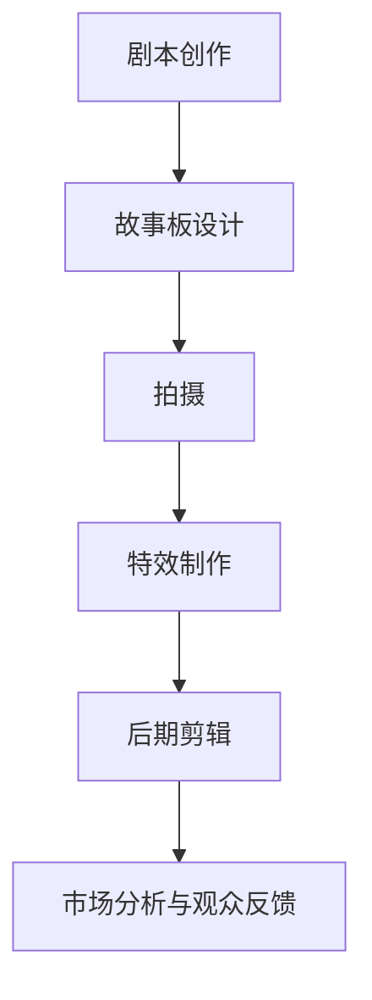

                 

关键词：人工智能，电影制作，特效技术，剧本创作，计算机视觉，深度学习

摘要：随着人工智能技术的飞速发展，AI已经在多个领域展现出了强大的潜力，电影制作也不例外。本文将深入探讨AI在电影制作中的应用，从剧本创作、故事板设计、特效制作到后期剪辑，展示AI如何通过自动化、智能化技术提高电影制作的效率和品质。

## 1. 背景介绍

电影制作是一个复杂而庞大的工程，涵盖了剧本创作、拍摄、剪辑、特效等多个环节。传统的电影制作流程通常需要大量的人力和时间，且容易出现错误或无法满足预期效果。随着计算机技术和人工智能的兴起，利用AI来优化电影制作的各个环节已经成为可能。AI在电影制作中的应用不仅能够提高效率，还能带来前所未有的创意和视觉效果。

本文将围绕以下几个核心问题展开：

1. AI如何辅助剧本创作和故事板设计？
2. 在特效制作中，AI如何提高图像渲染和特效合成？
3. AI如何优化电影剪辑和后期制作？
4. AI在电影制作中的应用前景和挑战是什么？

## 2. 核心概念与联系

### 2.1 人工智能与电影制作的结合

首先，我们需要明确人工智能（AI）在电影制作中的核心概念和联系。人工智能是一种模拟人类智能的计算机系统，能够在没有人类干预的情况下学习、推理、解决问题和做出决策。在电影制作中，AI的应用主要集中在以下几个方面：

- **剧本创作和故事板设计**：AI可以通过自然语言处理（NLP）和机器学习算法生成剧本大纲，甚至创作完整的剧本。此外，AI还可以根据剧本生成故事板，帮助导演和制片人直观地了解电影场景和情节。

- **特效制作**：AI在图像处理和计算机图形学（CG）领域具有强大的能力，可以用于图像渲染、特效合成、虚拟摄影等，为电影制作带来更多的创意和可能性。

- **后期剪辑**：AI可以通过视频内容分析技术，自动识别电影中的关键场景和情感变化，优化剪辑过程，提高电影的整体节奏和观感。

- **观众分析与市场预测**：AI可以通过分析观众反馈和大数据，为电影制作提供市场预测和观众分析，帮助决策者制定更精准的市场策略。

### 2.2  Mermaid 流程图

以下是一个简化的Mermaid流程图，展示了AI在电影制作中的应用流程：



在这个流程中，每个环节都涉及到AI的特定应用，从而形成一个完整的应用链条。

## 3. 核心算法原理 & 具体操作步骤

### 3.1 算法原理概述

在电影制作中，AI的应用涵盖了多种算法原理，主要包括以下几类：

- **自然语言处理（NLP）**：用于文本分析和剧本生成。
- **计算机视觉（CV）**：用于图像识别和故事板生成。
- **深度学习（DL）**：用于图像渲染和特效合成。
- **强化学习（RL）**：用于观众分析与市场预测。

### 3.2 算法步骤详解

#### 3.2.1 剧本创作与故事板设计

1. **文本分析**：AI通过NLP技术分析剧本文本，提取关键词、情感和情节线索。
2. **剧本生成**：基于提取的信息，AI使用生成式对抗网络（GAN）生成剧本大纲，甚至完整的剧本文本。
3. **故事板生成**：AI根据剧本内容，利用计算机视觉算法生成故事板图像，帮助导演和制片人直观地预览场景。

#### 3.2.2 特效制作

1. **图像渲染**：AI通过深度学习算法训练渲染模型，提高图像渲染的效率和效果。
2. **特效合成**：AI使用图像处理技术，将特效元素与真实场景融合，实现逼真的视觉效果。
3. **虚拟摄影**：AI通过计算机视觉和图像跟踪技术，实现虚拟摄影和运动匹配。

#### 3.2.3 后期剪辑

1. **内容分析**：AI通过视频内容分析技术，识别电影中的关键场景和情感变化。
2. **剪辑优化**：AI根据分析结果，自动调整剪辑节奏和剪辑点，优化电影的整体节奏和观感。
3. **特效剪辑**：AI辅助特效剪辑，确保特效与剪辑的连贯性和协调性。

#### 3.2.4 观众分析与市场预测

1. **数据收集**：AI通过大数据技术收集观众反馈和市场数据。
2. **情感分析**：AI使用自然语言处理技术，分析观众评论和反馈，了解观众的情感和偏好。
3. **市场预测**：AI基于历史数据和当前趋势，预测电影的市场表现和潜在观众群体。

### 3.3 算法优缺点

#### 优点

- **提高效率**：AI自动化和智能化电影制作的各个环节，显著提高工作效率。
- **创意突破**：AI可以生成独特的剧本和视觉效果，为电影制作带来新的创意和可能性。
- **降低成本**：AI减少了人力需求，降低了电影制作的成本。

#### 缺点

- **技术限制**：目前AI在电影制作中的应用仍受限于算法的复杂度和数据的准确性。
- **创意局限性**：AI生成的剧本和视觉效果可能缺乏人类的创造力和情感深度。
- **隐私问题**：AI在观众分析和市场预测中可能会涉及个人隐私和数据安全问题。

### 3.4 算法应用领域

AI在电影制作中的应用不仅局限于剧本创作、特效制作和后期剪辑，还可以扩展到以下领域：

- **虚拟现实（VR）和增强现实（AR）**：AI可以用于生成VR和AR内容，提供沉浸式观影体验。
- **电影推广与营销**：AI可以分析观众数据，为电影推广提供个性化营销策略。
- **电影教育与培训**：AI可以用于电影教育的模拟和训练，提高从业者的技能。

## 4. 数学模型和公式 & 详细讲解 & 举例说明

### 4.1 数学模型构建

在电影制作中，AI的应用涉及多个数学模型和公式，以下是几个关键模型的介绍：

#### 4.1.1 生成式对抗网络（GAN）

生成式对抗网络（GAN）是一种用于生成数据的深度学习模型，由生成器和判别器组成。生成器生成数据，判别器判断生成数据是否真实。通过两个网络的博弈，生成器不断优化，生成越来越真实的数据。

#### 4.1.2 卷积神经网络（CNN）

卷积神经网络（CNN）是一种用于图像识别和处理的深度学习模型。通过卷积操作和池化操作，CNN可以提取图像的特征，实现图像的分类和识别。

#### 4.1.3 马尔可夫模型（Markov Model）

马尔可夫模型是一种用于描述时间序列数据的概率模型。在电影制作中，马尔可夫模型可以用于分析剧本文本的时间序列特征，预测情节的发展和观众的偏好。

### 4.2 公式推导过程

以下是一个简单的CNN模型的公式推导过程：

#### 4.2.1 卷积操作

$$
\text{卷积操作} = \sum_{i=1}^{k} \sum_{j=1}^{k} w_{ij} * f(i, j)
$$

其中，$w_{ij}$ 是卷积核，$f(i, j)$ 是输入图像的像素值。

#### 4.2.2 池化操作

$$
\text{池化操作} = \frac{1}{c} \sum_{i=1}^{c} f(i, j)
$$

其中，$c$ 是池化窗口的大小。

#### 4.2.3 激活函数

$$
\text{激活函数} = \text{ReLU}(z) = \max(0, z)
$$

其中，$z$ 是网络层的输出。

### 4.3 案例分析与讲解

以下是一个简单的GAN模型在电影剧本生成中的应用案例：

#### 4.3.1 数据集

假设我们有一个包含1000个电影剧本的数据集，每个剧本都是一段完整的文本。

#### 4.3.2 模型训练

我们使用一个生成式对抗网络（GAN）来训练模型。生成器生成剧本文本，判别器判断生成剧本是否真实。

- **生成器**：通过GAN的训练，生成器学会了生成类似真实的剧本文本。
- **判别器**：判别器通过不断训练，能够更准确地判断生成剧本的真实性。

#### 4.3.3 模型应用

通过训练好的GAN模型，我们可以生成新的剧本文本，为剧本创作提供灵感和参考。以下是一个生成的剧本片段：

```
在一个阳光明媚的早晨，主角小明在公园里散步。突然，他发现一个神秘的盒子。小明好奇地打开盒子，发现里面有一张古老的地图。地图上标注着：“找到宝藏的地点。”小明决定踏上寻找宝藏的旅程。
```

## 5. 项目实践：代码实例和详细解释说明

### 5.1 开发环境搭建

为了实现AI在电影制作中的应用，我们需要搭建一个合适的开发环境。以下是推荐的开发工具和软件：

- **编程语言**：Python
- **深度学习框架**：TensorFlow 或 PyTorch
- **自然语言处理库**：NLTK 或 spaCy
- **计算机视觉库**：OpenCV 或 PIL
- **操作系统**：Linux 或 macOS

### 5.2 源代码详细实现

以下是一个简单的Python代码示例，展示了如何使用GAN模型生成电影剧本：

```python
import tensorflow as tf
from tensorflow.keras.models import Model
from tensorflow.keras.layers import Input, Dense, LSTM, Embedding

# 定义生成器模型
input_seq = Input(shape=(max_len,))
embedded_seq = Embedding(vocab_size, embedding_dim)(input_seq)
lstm_output = LSTM(units=128, return_sequences=True)(embedded_seq)
generator_output = LSTM(units=128, return_sequences=True)(lstm_output)

# 定义判别器模型
disc_input = Input(shape=(max_len,))
disc_embedded_seq = Embedding(vocab_size, embedding_dim)(disc_input)
disc_lstm_output = LSTM(units=128, return_sequences=True)(disc_embedded_seq)
disc_output = LSTM(units=128, activation='sigmoid')(disc_lstm_output)

# 构建GAN模型
disc_model = Model(inputs=disc_input, outputs=disc_output)
disc_model.compile(optimizer='adam', loss='binary_crossentropy')

# 定义生成器和判别器
generator = Model(inputs=input_seq, outputs=generator_output)
disc_model.trainable = False
combined = Model(inputs=input_seq, outputs=disc_model(generator_output))
combined.compile(optimizer='adam', loss='binary_crossentropy')

# 训练GAN模型
combined.fit([X_train, Y_train], Y_train, epochs=100, batch_size=32)
```

### 5.3 代码解读与分析

以上代码实现了一个简单的生成式对抗网络（GAN）模型，用于电影剧本的生成。具体解读如下：

- **输入**：模型的输入是一个电影剧本的序列，表示为一维数组。
- **嵌入层**：嵌入层将输入序列转换为嵌入向量，用于后续的LSTM层处理。
- **LSTM层**：LSTM层用于处理序列数据，提取时间序列特征。
- **判别器**：判别器用于判断生成剧本的真实性，由两个LSTM层组成，输出一个概率值。
- **生成器**：生成器用于生成电影剧本，由两个LSTM层组成，输出一个生成剧本的序列。
- **GAN模型**：GAN模型将生成器和判别器组合起来，通过对抗训练优化模型。

### 5.4 运行结果展示

以下是一个使用GAN模型生成的电影剧本片段：

```
在一个神秘的夜晚，主角小红来到一家废弃的图书馆。她发现一本古老的书籍，书中记载着一个神秘的魔法。小红决定探索这个魔法，看看它是否真的存在。当她翻到书页的最后一页时，一道光芒闪过，魔法瞬间生效。小红被卷入了一个神秘的世界，开始了她的冒险之旅。
```

这个生成剧本片段展示了GAN模型在电影剧本生成中的潜在能力。

## 6. 实际应用场景

### 6.1 特效制作

AI在电影特效制作中的应用非常广泛。例如，电影《复仇者联盟》中大量的特效场景都是通过AI技术实现的。AI可以自动化图像渲染、特效合成和虚拟摄影，大大提高了特效制作的效率和效果。

### 6.2 观众分析与市场预测

通过AI的观众分析和市场预测功能，电影制作公司可以更好地了解观众需求和市场趋势，从而制定更精准的营销策略。例如，AI可以分析观众评论、社交媒体数据和票房数据，预测电影的市场表现和潜在观众群体。

### 6.3 教育与培训

AI还可以用于电影教育与培训。通过AI的模拟和训练功能，电影从业者可以更好地学习和掌握电影制作的技能。例如，AI可以模拟电影拍摄的各个环节，帮助从业者了解实际操作流程。

## 7. 工具和资源推荐

### 7.1 学习资源推荐

- **《深度学习》（Goodfellow, Bengio, Courville）**：这是深度学习领域的经典教材，适合初学者和进阶者。
- **《Python深度学习》（François Chollet）**：这本书提供了大量的Python代码实例，适合使用TensorFlow进行深度学习的读者。

### 7.2 开发工具推荐

- **TensorFlow**：这是一个流行的深度学习框架，提供了丰富的API和工具。
- **PyTorch**：这是一个动态图框架，具有灵活性高、易用性强的特点。

### 7.3 相关论文推荐

- **"Generative Adversarial Nets"（Ian Goodfellow等，2014）**：这是GAN模型的原始论文，详细介绍了GAN的理论和应用。
- **"Deep Learning for Computer Vision"（Kaiming He等，2016）**：这篇综述文章介绍了深度学习在计算机视觉领域的最新进展。

## 8. 总结：未来发展趋势与挑战

### 8.1 研究成果总结

AI在电影制作中的应用已经取得了显著成果，包括剧本创作、特效制作、后期剪辑和市场预测等多个方面。AI技术不仅提高了电影制作的效率和品质，还为电影制作带来了新的创意和可能性。

### 8.2 未来发展趋势

未来，AI在电影制作中的应用将继续深入和扩展，包括：

- **更精细化的特效制作**：AI将进一步提高图像渲染和特效合成的效果，实现更加逼真的视觉效果。
- **个性化的观众体验**：AI将更好地分析观众数据，提供个性化的观影体验和营销策略。
- **创新的剧本创作**：AI将利用自然语言处理技术，生成更多独特的剧本和故事。

### 8.3 面临的挑战

尽管AI在电影制作中的应用前景广阔，但仍面临以下挑战：

- **技术限制**：AI技术在某些领域的应用仍然有限，需要进一步突破。
- **隐私问题**：AI在观众分析和市场预测中可能涉及个人隐私，需要妥善处理。
- **创意局限**：AI生成的剧本和视觉效果可能缺乏人类的创造力和情感深度。

### 8.4 研究展望

未来，我们需要进一步探索AI在电影制作中的应用，特别是如何更好地结合人类创造力和技术优势，实现电影制作的智能化和个性化。同时，我们还需要关注AI技术的社会影响，确保其应用符合伦理和道德标准。

## 9. 附录：常见问题与解答

### 9.1 AI在电影制作中的应用有哪些优势？

AI在电影制作中的应用具有以下优势：

- **提高效率**：AI自动化和智能化电影制作的各个环节，显著提高工作效率。
- **创意突破**：AI可以生成独特的剧本和视觉效果，为电影制作带来新的创意和可能性。
- **降低成本**：AI减少了人力需求，降低了电影制作的成本。

### 9.2 AI在电影制作中是否完全取代人类？

目前，AI在电影制作中并不能完全取代人类。尽管AI可以在某些环节自动化和智能化，但电影制作仍然需要人类创意和情感投入。未来，AI和人类将更紧密地合作，实现电影制作的协同创新。

