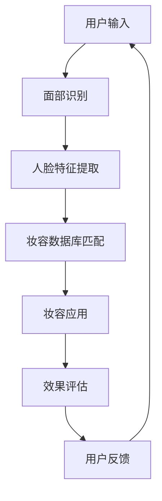

                 

关键词：人工智能，虚拟化妆，深度学习，计算机视觉，图像处理，人像美容，个性化推荐。

> 摘要：本文深入探讨了人工智能在虚拟化妆领域的应用，特别是如何利用深度学习和计算机视觉技术帮助用户尝试不同的妆容，提升化妆体验。通过详细阐述相关算法原理、数学模型以及具体实现，本文旨在为读者提供一个全面的技术视角，并展望该领域的未来发展趋势。

## 1. 背景介绍

虚拟化妆是一种利用计算机技术模拟化妆效果的技术，它能够在不实际改变用户面部特征的情况下，展示不同的妆容效果。这项技术最早出现在电影制作和特效领域，随着计算机性能的提升和图像处理算法的进步，虚拟化妆逐渐应用到美容、时尚和社交媒体中。

在社交媒体上，虚拟化妆已经成为一种流行的趋势。用户可以通过各种应用程序，如Instagram、Snapchat等，尝试不同的妆容，从而找到最适合自己的风格。然而，现有的虚拟化妆工具通常依赖于用户的选择，无法实现真正的个性化推荐。此外，由于妆容效果的多样性和复杂性，现有的工具在实现真实感、自然度和用户满意度方面仍有很大的提升空间。

本文将探讨如何利用人工智能技术，特别是深度学习和计算机视觉技术，提升虚拟化妆的应用体验。本文的结构如下：

- **第2章**：核心概念与联系，介绍虚拟化妆中的关键技术和相关算法。
- **第3章**：核心算法原理与具体操作步骤，包括算法的优缺点和应用领域。
- **第4章**：数学模型和公式，详细讲解相关的数学原理和公式推导。
- **第5章**：项目实践，通过代码实例展示如何实现虚拟化妆。
- **第6章**：实际应用场景，讨论虚拟化妆在不同场景中的应用。
- **第7章**：工具和资源推荐，提供相关学习和开发资源。
- **第8章**：总结与展望，总结研究成果，展望未来发展趋势和挑战。
- **第9章**：常见问题与解答，回答一些读者可能关心的问题。

### 核心概念与联系

在深入探讨虚拟化妆的算法和实现之前，我们需要理解一些核心概念和技术。以下是与虚拟化妆相关的一些关键技术和概念：

- **计算机视觉**：计算机视觉是研究如何使计算机理解和解释数字图像或视频的技术。在虚拟化妆中，计算机视觉用于捕捉用户的面部特征和表情，从而精确地模拟妆容效果。
- **深度学习**：深度学习是机器学习的一个分支，它使用神经网络，特别是多层神经网络，来从大量数据中自动学习特征和模式。在虚拟化妆中，深度学习可以用于训练模型，识别不同的面部特征和妆容风格。
- **图像处理**：图像处理是利用计算机对图像进行操作、分析和变换的技术。在虚拟化妆中，图像处理技术用于调整颜色、亮度、对比度等参数，以实现更自然、逼真的妆容效果。
- **生成对抗网络（GAN）**：生成对抗网络是一种深度学习模型，它由一个生成器和两个判别器组成。在虚拟化妆中，GAN可以用于生成新的妆容图片，通过与真实图片的对比，不断提升生成的图像质量。

下面是一个使用Mermaid绘制的虚拟化妆技术架构流程图：



### 核心算法原理与具体操作步骤

#### 3.1 算法原理概述

虚拟化妆的核心算法通常包括以下几个步骤：

1. **面部识别**：使用计算机视觉算法识别用户的面部区域。
2. **人脸特征提取**：从面部图像中提取关键特征点，如眼睛、鼻子、嘴巴等。
3. **妆容数据库匹配**：根据用户的面部特征，从妆容数据库中选择适合的妆容。
4. **妆容应用**：将选定的妆容应用到用户的面部图像上。
5. **效果评估**：评估妆容的效果，包括自然度、真实感等。
6. **用户反馈**：根据用户的反馈调整妆容效果。

#### 3.2 算法步骤详解

1. **面部识别**：
   使用卷积神经网络（CNN）进行面部识别。首先，将输入图像经过预处理，然后通过多个卷积层和池化层提取特征。最后，通过全连接层输出面部区域。

2. **人脸特征提取**：
   使用基于特征点检测的算法，如Active Shape Model（ASM）和Iterative Closest Point（ICP），从面部图像中提取关键特征点。

3. **妆容数据库匹配**：
   构建一个包含多种妆容的数据库，使用深度学习模型，如Siamese网络，进行匹配。模型通过学习不同妆容的特征，可以快速找到与用户面部特征匹配的妆容。

4. **妆容应用**：
   使用图像融合技术，将选定的妆容图像与用户面部图像进行融合。这里可以使用多种图像处理技术，如仿射变换、图像混合等。

5. **效果评估**：
   采用多种评价指标，如自然度、真实感、用户满意度等，对妆容效果进行评估。可以使用人类评估员或自动评估模型进行评估。

6. **用户反馈**：
   根据用户的反馈，调整妆容参数，以实现更好的用户满意度。

#### 3.3 算法优缺点

**优点**：
- **高效性**：深度学习和计算机视觉算法可以快速处理大量数据，实现实时虚拟化妆。
- **准确性**：通过学习大量的妆容数据，模型可以准确识别和匹配用户的面部特征。
- **个性化**：基于用户反馈，可以不断调整妆容效果，实现个性化推荐。

**缺点**：
- **计算资源需求**：深度学习算法通常需要大量的计算资源，对硬件要求较高。
- **数据依赖**：模型的性能很大程度上依赖于妆容数据库的质量和规模。
- **隐私问题**：虚拟化妆涉及到用户面部图像的处理，需要严格保护用户隐私。

#### 3.4 算法应用领域

虚拟化妆技术可以应用于多个领域：

- **社交媒体**：用户可以通过虚拟化妆尝试不同的妆容，分享自己的化妆经验。
- **美容行业**：化妆师可以使用虚拟化妆技术为客户提供虚拟试妆服务，提高客户满意度。
- **影视制作**：在电影和电视剧制作中，虚拟化妆可以用于特效化妆和角色变换。
- **医学领域**：虚拟化妆可以帮助医生进行皮肤病变的诊断和治疗方案的模拟。

### 数学模型和公式

在虚拟化妆中，数学模型和公式用于描述和实现各种算法。以下是几个关键的数学模型和公式：

#### 4.1 数学模型构建

1. **卷积神经网络（CNN）**：
   CNN是虚拟化妆中的核心模型，用于面部识别和特征提取。其基本公式为：
   $$ f(x) = \sigma(\mathbf{W} \cdot \mathbf{a} + b) $$
   其中，$\mathbf{W}$是权重矩阵，$\mathbf{a}$是输入特征向量，$b$是偏置项，$\sigma$是激活函数。

2. **生成对抗网络（GAN）**：
   GAN由生成器和判别器组成，其基本公式为：
   $$ G(z) = \mathbf{g}(\mathbf{z}) $$
   $$ D(x) = \mathbf{d}(\mathbf{x}) $$
   其中，$G(z)$是生成器，$D(x)$是判别器，$z$是随机噪声向量。

3. **图像处理**：
   图像处理中使用的基本公式包括仿射变换、图像混合等。例如，仿射变换的公式为：
   $$ \mathbf{T}(\mathbf{x}) = \mathbf{A} \mathbf{x} + \mathbf{t} $$
   其中，$\mathbf{A}$是变换矩阵，$\mathbf{x}$是输入向量，$\mathbf{t}$是平移向量。

#### 4.2 公式推导过程

1. **卷积神经网络**：
   卷积神经网络的推导过程涉及多层感知机（MLP）的扩展。具体推导可以参考相关机器学习书籍。

2. **生成对抗网络**：
   GAN的推导基于博弈论和梯度下降算法。具体推导过程可以参考Ian Goodfellow的论文《Generative Adversarial Networks》。

3. **图像处理**：
   图像处理的推导过程通常基于线性代数和概率论。例如，仿射变换的推导涉及矩阵乘法和几何变换。

#### 4.3 案例分析与讲解

以下是一个简单的案例，展示如何使用数学模型实现虚拟化妆。

**案例**：使用GAN生成新的妆容图像。

**步骤**：
1. **数据准备**：收集大量的真实妆容图像，作为GAN的训练数据。
2. **模型构建**：构建生成器和判别器，使用深度学习框架实现。
3. **模型训练**：通过反向传播算法和梯度下降优化模型参数。
4. **生成新妆容**：使用生成器生成新的妆容图像。
5. **效果评估**：通过人类评估或自动评估方法评估生成的妆容图像质量。

**公式应用**：
- **生成器**：使用GAN的损失函数优化生成器：
  $$ L_G = \mathbb{E}_{z \sim p_z(z)}[-\log(D(G(z))] $$
- **判别器**：使用GAN的损失函数优化判别器：
  $$ L_D = -\mathbb{E}_{x \sim p_{data}(x)}[\log(D(x))] - \mathbb{E}_{z \sim p_z(z)}[\log(1 - D(G(z))] $$

通过这个案例，我们可以看到如何将数学模型应用于虚拟化妆的实现。

### 项目实践：代码实例与详细解释

在本节中，我们将通过一个具体的代码实例展示如何实现虚拟化妆。以下是整个项目的实现步骤。

#### 5.1 开发环境搭建

1. **安装Python环境**：确保Python版本为3.7或以上。
2. **安装深度学习框架**：安装TensorFlow或PyTorch。
3. **安装图像处理库**：安装OpenCV和Pillow。

```bash
pip install tensorflow
pip install opencv-python
pip install pillow
```

#### 5.2 源代码详细实现

以下是一个简单的虚拟化妆项目，使用GAN生成新的妆容图像。

```python
import tensorflow as tf
from tensorflow.keras import layers
import numpy as np
import cv2

# 生成器模型
def build_generator(z_dim):
    model = tf.keras.Sequential()
    model.add(layers.Dense(128 * 7 * 7, use_bias=False, input_shape=(z_dim,)))
    model.add(layers.BatchNormalization())
    model.add(layers.LeakyReLU(alpha=0.2))
    model.add(layers.Reshape((7, 7, 128)))
    
    model.add(layers.Conv2DTranspose(128, (5, 5), strides=(1, 1), padding='same', use_bias=False))
    model.add(layers.BatchNormalization())
    model.add(layers.LeakyReLU(alpha=0.2))
    
    model.add(layers.Conv2DTranspose(128, (5, 5), strides=(2, 2), padding='same', use_bias=False))
    model.add(layers.BatchNormalization())
    model.add(layers.LeakyReLU(alpha=0.2))
    
    model.add(layers.Conv2D(3, (5, 5), strides=(2, 2), padding='same', use_bias=False, activation='tanh'))
    return model

# 判别器模型
def build_discriminator(img_shape):
    model = tf.keras.Sequential()
    model.add(layers.Conv2D(128, (3, 3), padding='same', input_shape=img_shape))
    model.add(layers.LeakyReLU(alpha=0.2))
    
    model.add(layers.Conv2D(128, (4, 4), strides=(2, 2), padding='same'))
    model.add(layers.LeakyReLU(alpha=0.2))
    
    model.add(layers.Conv2D(256, (4, 4), strides=(2, 2), padding='same'))
    model.add(layers.LeakyReLU(alpha=0.2))
    
    model.add(layers.Flatten())
    model.add(layers.Dense(1))
    return model

# GAN模型
def build_gan(generator, discriminator):
    model = tf.keras.Sequential([generator, discriminator])
    model.compile(loss='binary_crossentropy', optimizer=tf.keras.optimizers.Adam(0.0001), metrics=['accuracy'])
    return model

# 生成随机噪声
def generate_random_noise(shape):
    return np.random.normal(0, 1, shape)

# 加载妆容数据库
def load_makeup_database():
    # 这里使用示例数据，实际应用中应使用真实妆容图像
    data = []
    for image_file in os.listdir('makeup_database'):
        image = cv2.imread(os.path.join('makeup_database', image_file))
        data.append(image)
    return np.array(data)

# 主程序
def main():
    # 设置参数
    z_dim = 100
    img_height = 128
    img_width = 128
    img_channels = 3
    batch_size = 64

    # 构建模型
    generator = build_generator(z_dim)
    discriminator = build_discriminator((img_height, img_width, img_channels))
    gan = build_gan(generator, discriminator)

    # 加载数据
    makeup_database = load_makeup_database()

    # 训练模型
    for epoch in range(100):
        for _ in range(1000):
            noise = generate_random_noise((batch_size, z_dim))
            generated_images = generator.predict(noise)
            
            real_images = makeup_database[np.random.randint(0, makeup_database.shape[0], batch_size)]
            
            real_labels = np.ones((batch_size, 1))
            fake_labels = np.zeros((batch_size, 1))
            
            d_loss_real = discriminator.train_on_batch(real_images, real_labels)
            d_loss_fake = discriminator.train_on_batch(generated_images, fake_labels)
            d_loss = 0.5 * np.add(d_loss_real, d_loss_fake)
            
            noise = generate_random_noise((batch_size, z_dim))
            g_loss = gan.train_on_batch(noise, real_labels)
            
            print(f"Epoch: {epoch}, D_Loss: {d_loss}, G_Loss: {g_loss}")

    # 生成新妆容
    noise = generate_random_noise((64, z_dim))
    generated_images = generator.predict(noise)

    # 显示生成图像
    for i in range(10):
        cv2.imwrite(f"generated_image_{i}.jpg", generated_images[i])

if __name__ == "__main__":
    main()
```

#### 5.3 代码解读与分析

- **生成器模型**：生成器模型使用卷积层和反卷积层（Conv2DTranspose）生成新的妆容图像。通过逐层增加特征维度，最终生成128x128的图像。
- **判别器模型**：判别器模型使用卷积层检测图像的真实性和虚假性。通过逐层减少特征维度，最终输出二分类结果。
- **GAN模型**：GAN模型结合生成器和判别器，通过训练生成器不断生成更逼真的妆容图像。
- **主程序**：主程序设置训练参数，加载妆容数据库，进行模型训练，并生成新妆容图像。

通过这个项目，我们可以看到如何利用深度学习和计算机视觉技术实现虚拟化妆。在实际应用中，还可以根据具体需求调整模型结构和训练参数，以提高生成图像的质量和效果。

### 实际应用场景

虚拟化妆技术在多个实际应用场景中发挥了重要作用，下面我们探讨其中几个主要的应用场景。

#### 社交媒体

在社交媒体平台上，虚拟化妆已成为用户展示个性和审美的重要工具。用户可以通过Instagram、Snapchat等应用尝试各种不同的妆容，从日常妆容到节日妆容，再到特殊的特效妆容。这种技术的普及使得用户能够轻松分享自己的化妆成果，同时也提升了社交媒体平台的互动性和娱乐性。

#### 美容行业

美容行业可以利用虚拟化妆技术为客户提供虚拟试妆服务。这种服务不仅提高了客户的满意度，还可以减少试妆过程中的不便和成本。化妆师可以使用虚拟化妆技术为客户推荐适合他们的妆容，从而提高客户的化妆技巧和审美水平。此外，虚拟化妆还可以用于培训新员工，使他们能够快速掌握不同的化妆技巧。

#### 影视制作

在影视制作中，虚拟化妆技术可以用于特效化妆和角色变换。例如，在电影《阿凡达》中，虚拟化妆技术被用于创建角色纳美的面部表情和细节。在电视剧《权力的游戏》中，虚拟化妆技术也被用于角色变形和特效化妆，使得观众能够更真实地感受到角色的情感和变化。

#### 医学领域

医学领域可以利用虚拟化妆技术进行皮肤病变的模拟和诊断。通过虚拟化妆技术，医生可以在患者面部上模拟出不同的皮肤病变，如黑色素瘤、红斑狼疮等，帮助患者更好地理解病情。此外，虚拟化妆技术还可以用于手术规划，帮助医生在手术前模拟手术效果，提高手术的成功率和安全性。

### 未来应用展望

虚拟化妆技术在未来的发展将更加广泛和深入，以下是一些可能的发展趋势：

#### 更高的真实感

随着深度学习和计算机视觉技术的不断进步，虚拟化妆的真实感将进一步提升。未来的虚拟化妆技术将能够更加精确地模拟出各种妆容细节，如眼线的粗细、唇彩的颜色等，使得虚拟化妆的效果更加逼真。

#### 个性化推荐

未来的虚拟化妆技术将更加注重个性化推荐。通过学习用户的历史化妆记录、偏好和面部特征，虚拟化妆系统可以提供更符合用户需求的妆容推荐，从而提高用户的满意度和使用体验。

#### 多平台支持

虚拟化妆技术将逐渐从移动端向更多平台扩展，如PC端、智能眼镜和虚拟现实（VR）设备等。这种多平台支持将使得虚拟化妆技术更加普及，用户可以在不同的设备上轻松尝试不同的妆容。

#### 与其他技术的融合

虚拟化妆技术将与其他技术如增强现实（AR）、人工智能（AI）等深度融合。这种融合将带来更多的创新应用，如实时虚拟试妆、虚拟美容顾问等。

### 工具和资源推荐

为了深入了解和学习虚拟化妆技术，以下是一些推荐的工具和资源：

#### 学习资源推荐

1. **在线课程**：
   - 《深度学习》（Deep Learning） - Goodfellow、Bengio和Courville著
   - 《计算机视觉：算法与应用》（Computer Vision: Algorithms and Applications） - Richard Szeliski著

2. **书籍**：
   - 《GANs：生成对抗网络的原理与实践》（GANs: From Theory to Practice） - Yuhuai Wu和Cheng Soon Ong著

3. **论文**：
   - 《Generative Adversarial Nets》 - Ian Goodfellow等人著
   - 《Unsupervised Representation Learning with Deep Convolutional Generative Adversarial Networks》 - Alec Radford等人著

#### 开发工具推荐

1. **深度学习框架**：
   - TensorFlow
   - PyTorch

2. **图像处理库**：
   - OpenCV
   - PIL（Python Imaging Library）

3. **虚拟化妆工具**：
   - MakeupPlus
   - Virtual try-on apps（如Instagram的尝试功能）

#### 相关论文推荐

1. **《Generative Adversarial Nets》** - Ian Goodfellow等人著
2. **《Unsupervised Representation Learning with Deep Convolutional Generative Adversarial Networks》** - Alec Radford等人著
3. **《Adversarial Examples, Explaining and Defense against Neural Network Attacks》** - Ian Goodfellow等人著

通过这些工具和资源，您可以深入了解虚拟化妆技术的理论基础和实践应用，为未来的研究和开发打下坚实的基础。

### 总结：未来发展趋势与挑战

虚拟化妆技术在过去几年中取得了显著的进展，随着深度学习和计算机视觉技术的不断突破，其应用前景更加广阔。未来，虚拟化妆技术有望在多个领域得到广泛应用，如社交媒体、美容行业、影视制作和医学领域等。

#### 发展趋势

1. **更高的真实感**：随着深度学习和图像处理技术的进步，虚拟化妆的真实感将不断提升，用户能够更真实地体验不同的妆容效果。
2. **个性化推荐**：基于用户的历史数据和偏好分析，虚拟化妆系统将能够提供更精准的个性化推荐，提高用户的满意度和使用体验。
3. **多平台支持**：虚拟化妆技术将逐渐从移动端扩展到PC端、智能眼镜和虚拟现实（VR）设备等，提供更多样化的使用场景。
4. **与其他技术的融合**：虚拟化妆技术将与增强现实（AR）、人工智能（AI）等前沿技术深度融合，带来更多的创新应用。

#### 面临的挑战

1. **计算资源需求**：深度学习算法通常需要大量的计算资源，对于硬件性能要求较高。如何优化算法和硬件，提高计算效率，是一个重要的挑战。
2. **数据隐私问题**：虚拟化妆涉及到用户面部图像的处理，数据隐私和安全是一个亟待解决的问题。如何在确保用户隐私的同时，提供高质量的虚拟化妆服务，需要进一步的研究。
3. **用户体验**：用户对于虚拟化妆的效果和自然度有很高的要求。如何优化算法和用户界面，提高用户体验，是一个持续的挑战。

#### 研究展望

未来，虚拟化妆技术的研究将继续深入，重点包括：

1. **算法优化**：针对不同的应用场景，优化现有的深度学习和图像处理算法，提高虚拟化妆的真实感和用户体验。
2. **跨模态融合**：将虚拟化妆技术与增强现实、虚拟现实等技术融合，提供更加丰富和互动的虚拟化妆体验。
3. **数据安全与隐私**：研究如何在保护用户隐私的前提下，提供高质量的虚拟化妆服务，是未来研究的重要方向。

通过持续的研究和开发，虚拟化妆技术将更好地服务于人们的生活和工作，为各行各业带来创新和变革。

### 附录：常见问题与解答

以下是一些关于虚拟化妆技术的常见问题及其解答：

#### 问题1：虚拟化妆技术的原理是什么？

虚拟化妆技术主要基于深度学习和计算机视觉。深度学习用于训练模型，识别面部特征和妆容风格；计算机视觉用于捕捉和处理用户的面部图像。通过这些技术的结合，可以实现对面部图像的实时处理和效果模拟。

#### 问题2：虚拟化妆技术是否能够完全替代传统的化妆方法？

虚拟化妆技术不能完全替代传统的化妆方法。它主要用于尝试和展示不同的妆容效果，帮助用户找到适合自己的风格。在实际生活中，传统的化妆方法仍然具有不可替代的作用，特别是在细节处理和持久性方面。

#### 问题3：虚拟化妆技术是否会侵犯用户的隐私？

虚拟化妆技术在使用过程中确实会涉及到用户面部图像的处理，因此保护用户隐私是一个重要问题。开发者需要采取严格的数据保护措施，如加密存储、匿名化处理等，以确保用户数据的安全和隐私。

#### 问题4：虚拟化妆技术是否会对美容行业产生影响？

虚拟化妆技术的普及将对美容行业产生一定的影响。一方面，它为用户提供了更多的选择和便利，提高了化妆体验；另一方面，它也带来了新的商业机会，如虚拟化妆软件的开发和销售。总体来说，虚拟化妆技术是美容行业的一个有益补充。

#### 问题5：虚拟化妆技术是否能够实时应用？

虚拟化妆技术已经可以实现实时应用。随着计算性能的提升和算法的优化，虚拟化妆的实时处理速度和效果不断提高。用户可以通过智能手机、平板电脑等设备，实时尝试不同的妆容效果。

通过上述问题的解答，我们可以更好地理解虚拟化妆技术的原理和应用，以及它所带来的影响和挑战。希望这些信息对您有所帮助。

