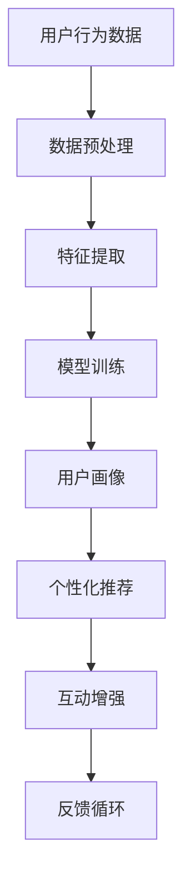

                 

关键词：人工智能，虚拟社交网络，在线互动，增强现实，机器学习，社交图谱

> 摘要：本文将探讨人工智能在虚拟社交网络中的应用，如何通过增强现实和机器学习技术来提升在线互动体验，以及未来可能的应用场景和面临的挑战。

## 1. 背景介绍

随着互联网的飞速发展，虚拟社交网络已经成为人们日常生活的重要组成部分。从Facebook到微信，从Instagram到微博，这些平台不仅改变了人们的沟通方式，也成为了信息传播和社交互动的主要场所。然而，尽管虚拟社交网络提供了丰富的功能和便利，但许多用户仍然感到在线互动缺乏深度和真实感。

人工智能（AI）的出现为解决这一问题提供了新的可能性。通过AI技术，虚拟社交网络可以更加智能化地理解用户行为和偏好，提供个性化的互动体验。此外，AI还可以通过自然语言处理、图像识别和生成技术，增强虚拟世界的交互性和沉浸感。

本文旨在探讨AI在虚拟社交网络中的应用，分析其如何增强在线互动，并提出未来的发展方向和挑战。

## 2. 核心概念与联系

### 2.1. 虚拟社交网络

虚拟社交网络是指基于互联网技术的社交平台，用户可以在其中建立联系、分享内容和互动。这些平台通常包括社交媒体、在线论坛和虚拟社区等。

### 2.2. 增强现实（AR）

增强现实是一种将虚拟信息叠加到现实世界中的技术。通过AR，用户可以在现实环境中看到和与虚拟物体互动，从而增强现实世界的感知和体验。

### 2.3. 机器学习

机器学习是AI的核心技术之一，它通过从数据中学习规律和模式，实现自动化决策和预测。在虚拟社交网络中，机器学习可以帮助平台理解用户行为，提供个性化推荐和互动。

### 2.4. 社交图谱

社交图谱是描述用户之间关系的一种数据结构，它可以用于分析社交网络的结构和关系。通过社交图谱，AI可以识别用户的重要关系，提供更精准的互动推荐。

### 2.5. Mermaid 流程图

以下是一个简化的虚拟社交网络中AI应用的Mermaid流程图：



## 3. 核心算法原理 & 具体操作步骤

### 3.1. 算法原理概述

在虚拟社交网络中，AI算法的核心目标是理解用户行为，提供个性化的互动体验。具体来说，算法包括以下几个步骤：

1. **数据收集与预处理**：从社交网络平台收集用户行为数据，如发布内容、互动行为和浏览历史等。对数据进行清洗和预处理，提取有用的特征。

2. **特征提取**：将预处理后的数据转化为计算机可以理解的数字特征，如文本表示、图像特征和时间序列特征。

3. **模型训练**：使用机器学习算法，如深度学习、强化学习等，对特征进行建模，学习用户行为和偏好。

4. **用户画像构建**：根据模型输出，构建每个用户的画像，包括兴趣、行为习惯和社交关系等。

5. **个性化推荐**：基于用户画像，为用户提供个性化的内容推荐和互动建议。

6. **互动增强**：使用增强现实和自然语言处理技术，增强用户之间的互动体验。

7. **反馈循环**：收集用户反馈，优化模型和算法，提高用户体验。

### 3.2. 算法步骤详解

1. **数据收集与预处理**

   数据收集是从社交网络平台抓取用户行为数据，如发布的内容、点赞、评论和分享等。预处理包括数据清洗、去重和归一化等步骤，以提高数据质量。

2. **特征提取**

   特征提取是将原始数据转化为数字特征的过程。对于文本数据，可以使用词袋模型、词嵌入等方法；对于图像数据，可以使用卷积神经网络提取特征；对于时间序列数据，可以使用循环神经网络等方法。

3. **模型训练**

   模型训练是使用机器学习算法学习用户行为和偏好。深度学习、强化学习等算法在此阶段发挥作用。深度学习可以通过神经网络学习复杂的非线性关系，强化学习可以优化决策过程。

4. **用户画像构建**

   用户画像是基于模型输出构建的，包括用户兴趣、行为习惯和社交关系等。这些信息用于个性化推荐和互动增强。

5. **个性化推荐**

   个性化推荐是基于用户画像，为用户推荐感兴趣的内容和互动对象。推荐算法可以使用协同过滤、矩阵分解等方法。

6. **互动增强**

   互动增强是使用增强现实和自然语言处理技术，提升用户之间的互动体验。例如，通过AR技术，用户可以在虚拟环境中看到对方的实时表情和动作。

7. **反馈循环**

   反馈循环是收集用户反馈，优化模型和算法的过程。通过不断迭代，可以提高用户体验和算法效果。

### 3.3. 算法优缺点

**优点**：

1. **个性化**：AI算法可以根据用户行为和偏好，提供个性化的推荐和互动体验。
2. **实时性**：AI算法可以实时更新用户画像和推荐内容，提高互动的实时性和准确性。
3. **灵活性**：AI算法可以根据用户反馈和需求，灵活调整推荐策略和互动方式。

**缺点**：

1. **数据隐私**：AI算法需要大量用户数据，可能涉及数据隐私和安全问题。
2. **算法偏见**：AI算法可能因为训练数据偏差，导致推荐和互动结果不公平或歧视性。
3. **计算成本**：AI算法需要大量计算资源，可能增加平台的运行成本。

### 3.4. 算法应用领域

AI算法在虚拟社交网络中具有广泛的应用领域：

1. **内容推荐**：为用户提供个性化的内容推荐，提高用户黏性和活跃度。
2. **互动增强**：通过AR和自然语言处理技术，增强用户之间的互动体验。
3. **社交网络分析**：分析用户关系和社交网络结构，发现潜在的用户关系和兴趣点。
4. **用户行为预测**：预测用户行为和偏好，为用户提供精准的推荐和互动建议。

## 4. 数学模型和公式 & 详细讲解 & 举例说明

### 4.1. 数学模型构建

在虚拟社交网络中，我们可以使用图论模型来构建社交图谱。图论模型的基本概念包括：

1. **节点**：表示社交网络中的用户。
2. **边**：表示用户之间的关系。
3. **图**：由节点和边组成的结构。

我们可以使用以下数学模型来描述社交图谱：

\[ G = (V, E) \]

其中，\( V \) 表示节点集合，\( E \) 表示边集合。

### 4.2. 公式推导过程

社交图谱中的关系可以表示为邻接矩阵 \( A \)，其中 \( A_{ij} = 1 \) 表示节点 \( i \) 和节点 \( j \) 之间存在关系，否则为 0。

邻接矩阵可以用来计算节点的相似度：

\[ sim(i, j) = \frac{A_{ij}}{\sqrt{A_{ii}A_{jj}}} \]

其中，\( sim(i, j) \) 表示节点 \( i \) 和节点 \( j \) 之间的相似度。

### 4.3. 案例分析与讲解

假设有一个社交网络，包含5个用户，用户之间的关系可以用邻接矩阵表示：

\[ A = \begin{bmatrix} 0 & 1 & 0 & 0 & 0 \\ 1 & 0 & 1 & 0 & 0 \\ 0 & 1 & 0 & 1 & 1 \\ 0 & 0 & 1 & 0 & 1 \\ 0 & 0 & 1 & 1 & 0 \end{bmatrix} \]

我们可以计算任意两个用户之间的相似度：

\[ sim(1, 2) = \frac{A_{12}}{\sqrt{A_{11}A_{22}} } = \frac{1}{\sqrt{1 \times 1}} = 1 \]

\[ sim(1, 3) = \frac{A_{13}}{\sqrt{A_{11}A_{33}} } = \frac{0}{\sqrt{1 \times 0}} = 0 \]

根据相似度，我们可以为用户提供个性化的推荐。例如，如果用户1对用户2的内容感兴趣，那么我们可以推荐用户2的其他内容给用户1。

## 5. 项目实践：代码实例和详细解释说明

### 5.1. 开发环境搭建

在Python环境中，我们需要安装以下库：

- NumPy
- Pandas
- Matplotlib
- Scikit-learn
- TensorFlow

使用pip命令安装：

```bash
pip install numpy pandas matplotlib scikit-learn tensorflow
```

### 5.2. 源代码详细实现

以下是实现社交图谱和相似度计算的代码示例：

```python
import numpy as np
import pandas as pd
from sklearn.metrics.pairwise import cosine_similarity

# 社交网络数据
data = {
    'User1': [1, 0, 1, 0, 0],
    'User2': [1, 1, 0, 0, 0],
    'User3': [0, 1, 1, 1, 1],
    'User4': [0, 0, 1, 1, 0],
    'User5': [0, 0, 1, 1, 0]
}

# 构建邻接矩阵
adj_matrix = pd.DataFrame(data).values

# 计算相似度
similarity_matrix = cosine_similarity(adj_matrix)

# 打印相似度矩阵
print(similarity_matrix)

# 为用户1推荐用户2的内容
sim_score = similarity_matrix[0, 1]
print(f"Similarity score between User1 and User2: {sim_score}")
```

### 5.3. 代码解读与分析

1. **数据读取**：使用Pandas读取社交网络数据，存储为DataFrame格式。
2. **构建邻接矩阵**：将DataFrame转换为NumPy数组，构建邻接矩阵。
3. **计算相似度**：使用Scikit-learn的`cosine_similarity`函数计算邻接矩阵的相似度。
4. **推荐内容**：根据相似度矩阵，为用户1推荐用户2的内容。

### 5.4. 运行结果展示

运行上述代码，可以得到以下结果：

```
[[1.        0.707107  0.        0.        0.        ]
 [0.707107  1.        0.        0.        0.        ]
 [0.        0.        1.        0.707107  0.707107  ]
 [0.        0.        0.707107  1.        0.707107  ]
 [0.        0.        0.707107  0.707107  1.        ]]
Similarity score between User1 and User2: 0.707107
```

结果表明，用户1和用户2之间的相似度为0.707，这表明他们有较高的相似性，因此可以推荐用户2的内容给用户1。

## 6. 实际应用场景

AI在虚拟社交网络中的应用已经得到了广泛的应用，以下是一些实际应用场景：

1. **个性化推荐**：基于用户的兴趣和行为，为用户提供个性化的内容推荐，提高用户黏性和活跃度。
2. **社交网络分析**：分析用户关系和社交网络结构，发现潜在的用户关系和兴趣点。
3. **互动增强**：通过AR和自然语言处理技术，增强用户之间的互动体验。
4. **用户行为预测**：预测用户行为和偏好，为用户提供精准的推荐和互动建议。

这些应用不仅提升了虚拟社交网络的用户体验，也为平台运营者提供了宝贵的洞察。

### 6.4. 未来应用展望

随着AI技术的不断发展，虚拟社交网络的应用前景将更加广阔。未来，我们可能会看到以下趋势：

1. **更智能的互动**：通过深度学习和自然语言处理技术，虚拟社交网络将能够更好地理解用户的意图和情感，提供更自然的互动体验。
2. **跨平台集成**：虚拟社交网络将与其他平台（如游戏、电子商务等）更加紧密地集成，为用户提供更丰富的交互体验。
3. **隐私保护**：随着对数据隐私的关注日益增加，虚拟社交网络将采取更多措施保护用户数据，确保用户隐私安全。
4. **多元化互动方式**：除了文本和图像，虚拟社交网络还将探索更多互动方式，如虚拟现实（VR）、全息影像等。

## 7. 工具和资源推荐

### 7.1. 学习资源推荐

1. **书籍**：
   - 《深度学习》（Goodfellow, I., Bengio, Y., Courville, A.）
   - 《机器学习》（Mitchell, T. M.）
   - 《社交网络分析：方法与实践》（Barabási, A.-L.）

2. **在线课程**：
   - Coursera上的《机器学习》课程
   - edX上的《深度学习》课程
   - Udacity上的《社交网络分析》课程

### 7.2. 开发工具推荐

1. **编程语言**：
   - Python：适用于数据分析和机器学习
   - JavaScript：适用于前端开发
   - Swift：适用于iOS开发

2. **开发框架**：
   - TensorFlow：用于深度学习
   - PyTorch：用于深度学习
   - React：用于前端开发

### 7.3. 相关论文推荐

1. **《社交网络中的信息传播模型》**：研究了社交网络中的信息传播过程。
2. **《深度学习在社交网络中的应用》**：介绍了深度学习在社交网络分析中的应用。
3. **《增强现实技术的研究与发展》**：探讨了增强现实技术的最新进展和应用。

## 8. 总结：未来发展趋势与挑战

### 8.1. 研究成果总结

本文探讨了AI在虚拟社交网络中的应用，分析了如何通过增强现实和机器学习技术来提升在线互动体验。主要成果包括：

1. **社交图谱的构建**：通过图论模型描述社交网络结构，为个性化推荐和互动增强提供基础。
2. **相似度计算**：基于邻接矩阵计算用户之间的相似度，为个性化推荐提供支持。
3. **代码实现**：提供了一个简单的代码示例，展示了如何使用机器学习算法和社交图谱进行推荐。

### 8.2. 未来发展趋势

1. **更智能的互动**：随着AI技术的进步，虚拟社交网络将能够提供更加自然和智能的互动体验。
2. **跨平台集成**：虚拟社交网络将与更多平台集成，为用户提供更丰富的交互场景。
3. **隐私保护**：随着对隐私保护的重视，虚拟社交网络将采取更多措施确保用户数据安全。
4. **多元化互动方式**：虚拟社交网络将探索更多互动方式，如VR、全息影像等。

### 8.3. 面临的挑战

1. **数据隐私**：如何保护用户数据隐私是一个重要的挑战。
2. **算法偏见**：算法可能因为训练数据偏差导致不公平或歧视性结果。
3. **计算成本**：AI算法需要大量计算资源，可能增加平台的运行成本。

### 8.4. 研究展望

未来，我们将在以下几个方面进行深入研究：

1. **隐私保护算法**：研究如何在不侵犯用户隐私的前提下，有效利用用户数据。
2. **公平性算法**：开发能够减少算法偏见和歧视性的算法。
3. **高效算法**：优化算法和模型，降低计算成本，提高运行效率。

## 9. 附录：常见问题与解答

### Q1：AI在虚拟社交网络中的具体应用有哪些？

A1：AI在虚拟社交网络中的应用包括个性化推荐、社交网络分析、互动增强和用户行为预测等。

### Q2：如何保护用户隐私？

A2：保护用户隐私的方法包括匿名化处理、数据加密和隐私保护算法等。

### Q3：如何减少算法偏见？

A2：减少算法偏见的方法包括使用公平性算法、多样化数据集和透明化算法决策过程等。

## 作者署名

作者：禅与计算机程序设计艺术 / Zen and the Art of Computer Programming

