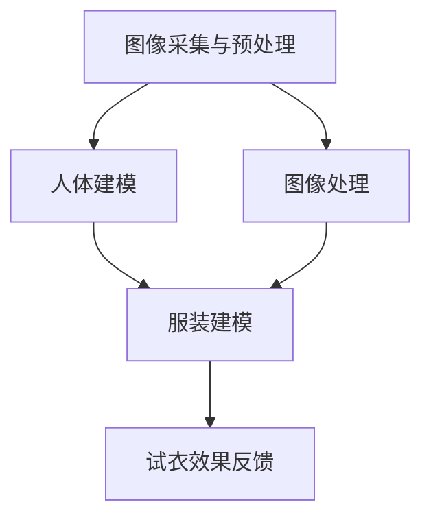

                 

 关键词：人工智能，虚拟试衣，在线购物，用户体验，深度学习，计算机视觉，图像处理，增强现实，3D建模，数据隐私，技术挑战，应用前景

> 摘要：本文将探讨人工智能在虚拟试衣领域的应用，分析其如何革新在线购物体验。通过深入阐述核心概念、算法原理、数学模型及实际应用，本文旨在为读者提供一份全面的技术指南，并展望虚拟试衣技术的未来发展。

## 1. 背景介绍

随着电子商务的飞速发展，消费者越来越依赖在线购物平台来满足他们的日常消费需求。然而，传统的在线购物方式存在一定的局限性，例如无法亲身体验商品的实际效果，导致购物过程中存在试衣不合适、退货率高等问题。为了解决这一问题，虚拟试衣技术应运而生，并逐渐成为电商平台提升用户体验的重要手段之一。

虚拟试衣技术利用人工智能、计算机视觉、图像处理、3D建模等先进技术，为用户提供一个能够在线试衣的平台。用户只需上传自己的照片或选择标准模特，系统即可通过算法生成试衣效果，帮助用户了解服装的穿着效果。这一技术的出现，不仅解决了消费者在线购物的试衣难题，还为电商平台带来了更高的用户满意度和转化率。

本文将围绕虚拟试衣技术的核心概念、算法原理、数学模型及实际应用进行深入探讨，分析其如何革新在线购物体验，并为相关领域的研究者和从业者提供有价值的参考。

## 2. 核心概念与联系

虚拟试衣技术的核心概念包括计算机视觉、图像处理、3D建模、深度学习等。这些概念相互关联，共同构成了虚拟试衣系统的技术基础。

### 2.1 计算机视觉

计算机视觉是研究如何使计算机具备类似人类视觉能力的一门学科。在虚拟试衣中，计算机视觉技术主要用于图像识别和场景理解。例如，系统需要识别用户的照片或选择的标准模特，并根据这些图像提取出人体的关键部位，如头部、手臂、腿部等。此外，计算机视觉技术还可以用于检测服装的轮廓和形状，为后续的3D建模提供基础数据。

### 2.2 图像处理

图像处理是研究如何对图像进行编辑、增强、压缩、识别等操作的学科。在虚拟试衣中，图像处理技术主要用于对用户上传的图片进行预处理，如去除背景、增强颜色、调整亮度和对比度等，以提高图像质量，使其更适合后续的计算机视觉分析和3D建模。

### 2.3 3D建模

3D建模是创建三维模型的过程，通过将二维图像转换为三维模型，可以更好地表示物体的外观和结构。在虚拟试衣中，3D建模技术用于生成服装的三维模型，并将其与用户的身体模型进行匹配。此外，3D建模还可以用于创建虚拟试衣间的环境，为用户提供一个沉浸式的购物体验。

### 2.4 深度学习

深度学习是一种基于人工神经网络的学习方法，通过多层神经网络对大量数据进行分析和建模，从而实现高精度的图像识别和分类。在虚拟试衣中，深度学习技术主要用于图像识别和分类，如识别用户的身体部位、分类服装的类型等。此外，深度学习还可以用于优化虚拟试衣算法，提高试衣效果和用户体验。

### 2.5 关联与联系

计算机视觉、图像处理、3D建模和深度学习技术在虚拟试衣中相互关联，共同构成了一个完整的虚拟试衣系统。具体流程如下：

1. **图像采集与预处理**：用户上传照片或选择标准模特，系统通过计算机视觉技术提取出图像中的关键部位，并进行图像处理，如去背景、增强颜色等，以提高图像质量。

2. **人体建模**：系统利用3D建模技术，根据预处理后的图像生成一个三维的人体模型，用于后续的虚拟试衣操作。

3. **服装建模**：系统利用3D建模技术，创建所选服装的三维模型，并将其与人体模型进行匹配，以生成试衣效果。

4. **试衣效果反馈**：系统通过深度学习技术对试衣效果进行分析，如识别用户的身体部位、分类服装的类型等，并将试衣结果实时反馈给用户。

### 2.6 Mermaid 流程图



通过以上核心概念与联系的分析，我们可以看出，虚拟试衣技术是一个复杂而综合的系统，涉及多个学科的技术和方法。在接下来的章节中，我们将深入探讨虚拟试衣技术的核心算法原理、具体操作步骤、数学模型及实际应用，以帮助读者更好地理解这一技术。

## 3. 核心算法原理 & 具体操作步骤

### 3.1 算法原理概述

虚拟试衣技术的核心算法主要基于计算机视觉、图像处理和深度学习。以下是这些算法的基本原理和适用场景：

#### 3.1.1 计算机视觉

计算机视觉算法主要用于图像识别和场景理解。常见的计算机视觉算法包括：

- **人脸识别**：通过学习人脸特征，实现对用户照片或视频中人脸的自动识别。
- **人体关键点检测**：通过学习人体关键点（如头部、肩膀、膝盖等）的位置，实现对用户身体部位的准确识别。
- **物体检测与分类**：通过学习图像中的物体特征，实现对图像中物体的自动识别和分类。

这些算法在虚拟试衣中主要用于：

1. **图像预处理**：通过人脸识别算法，系统可以自动识别并去除背景，将用户照片转换为适合后续处理的标准格式。
2. **人体部位识别**：通过人体关键点检测算法，系统可以准确识别用户身体部位，为3D建模提供基础数据。
3. **物体分类**：通过物体检测与分类算法，系统可以识别所选服装的类型，为3D建模和试衣效果反馈提供支持。

#### 3.1.2 图像处理

图像处理算法主要用于对图像进行编辑、增强和压缩等操作，以提高图像质量和处理效率。常见的图像处理算法包括：

- **图像去噪**：通过学习图像中的噪声特征，去除图像中的噪声，提高图像质量。
- **图像增强**：通过调整图像的亮度和对比度，增强图像中的细节信息，提高图像的可读性。
- **图像分割**：通过学习图像中的像素特征，将图像分为不同的区域，实现对图像内容的自动识别。

这些算法在虚拟试衣中主要用于：

1. **图像预处理**：通过图像去噪和增强算法，系统可以自动优化用户上传的图片，使其更适合后续的计算机视觉分析和3D建模。
2. **图像分割**：通过图像分割算法，系统可以自动识别并提取出用户身体部位和服装的轮廓，为3D建模提供基础数据。

#### 3.1.3 深度学习

深度学习算法通过多层神经网络对大量数据进行分析和建模，从而实现高精度的图像识别和分类。常见的深度学习算法包括：

- **卷积神经网络（CNN）**：通过学习图像的局部特征，实现对图像的自动识别和分类。
- **循环神经网络（RNN）**：通过学习序列数据，实现对序列数据的自动识别和分类。

这些算法在虚拟试衣中主要用于：

1. **图像识别**：通过卷积神经网络，系统可以自动识别用户身体部位和所选服装的类型，为3D建模和试衣效果反馈提供支持。
2. **序列数据识别**：通过循环神经网络，系统可以自动识别用户的动作序列，实现虚拟试衣的交互功能。

### 3.2 算法步骤详解

虚拟试衣算法的具体操作步骤如下：

#### 3.2.1 图像采集与预处理

1. **用户上传照片**：用户上传一张包含自己身体和所选服装的照片。
2. **背景去除**：系统使用人脸识别算法，自动识别并去除照片中的背景，将用户照片转换为适合后续处理的标准格式。
3. **图像增强**：系统使用图像增强算法，自动调整照片的亮度和对比度，提高图像质量。

#### 3.2.2 人体建模

1. **人体关键点检测**：系统使用人体关键点检测算法，自动识别并提取出用户照片中的关键部位（如头部、肩膀、膝盖等）。
2. **3D建模**：系统使用3D建模技术，根据预处理后的图像和关键部位信息，生成一个三维的人体模型。

#### 3.2.3 服装建模

1. **服装识别**：系统使用物体检测与分类算法，自动识别出照片中的服装类型。
2. **3D建模**：系统使用3D建模技术，根据所选服装的类型，创建一个三维的服装模型。

#### 3.2.4 试衣效果反馈

1. **模型匹配**：系统将人体模型和服装模型进行匹配，生成虚拟试衣效果。
2. **试衣效果分析**：系统使用深度学习算法，对试衣效果进行分析，识别用户的身体部位、服装类型等信息。
3. **试衣结果反馈**：系统将试衣结果实时反馈给用户，包括试衣效果图像和试衣效果分析报告。

### 3.3 算法优缺点

#### 3.3.1 优点

1. **高精度识别**：虚拟试衣技术基于计算机视觉和深度学习算法，可以实现对用户身体部位和服装类型的高精度识别，提高试衣效果的准确性。
2. **实时反馈**：虚拟试衣技术可以实现实时反馈，用户可以立即查看试衣效果，提高购物体验。
3. **个性化推荐**：虚拟试衣技术可以结合用户的行为数据和购物偏好，为用户推荐适合的服装，提高购物转化率。

#### 3.3.2 缺点

1. **计算资源需求大**：虚拟试衣技术需要大量的计算资源，包括图像处理、3D建模和深度学习等，对硬件设施要求较高。
2. **数据隐私风险**：虚拟试衣技术涉及用户照片和身体部位信息的处理，存在数据隐私风险，需要采取严格的安全措施。
3. **适应性问题**：虚拟试衣技术可能无法适应所有用户的需求，如特定体型、特殊场合等，需要进一步优化和改进。

### 3.4 算法应用领域

虚拟试衣技术可以广泛应用于电子商务、时尚产业、医疗健康等领域：

1. **电子商务**：电商平台可以通过虚拟试衣技术为用户提供更便捷的购物体验，提高用户满意度和转化率。
2. **时尚产业**：服装设计师和制造商可以利用虚拟试衣技术进行设计评估和产品测试，提高设计效率和产品质量。
3. **医疗健康**：虚拟试衣技术可以用于医疗健康领域，如康复训练、体型评估等，为用户提供个性化的健康服务。

通过以上对虚拟试衣技术核心算法原理和具体操作步骤的详细阐述，我们可以看到，虚拟试衣技术不仅具有广泛的应用前景，同时也面临着一定的挑战和机遇。在接下来的章节中，我们将继续探讨虚拟试衣技术的数学模型和公式，以及在实际应用中的案例分析。

## 4. 数学模型和公式 & 详细讲解 & 举例说明

虚拟试衣技术涉及多个领域的交叉，包括计算机视觉、图像处理、3D建模和深度学习等。在这些领域中，数学模型和公式扮演着至关重要的角色，为算法的实现提供了理论基础。本节将详细讲解虚拟试衣技术中常用的数学模型和公式，并通过具体案例进行说明。

### 4.1 数学模型构建

#### 4.1.1 人体模型构建

人体模型是虚拟试衣技术的基础，其构建依赖于对人体形态和运动规律的深入研究。常见的人体模型包括线性混合模型（LMM）、基于统计的人体模型（SMPL）和基于深度学习的人体模型等。

1. **线性混合模型（LMM）**

   线性混合模型通过线性组合多个基准体模型来表示不同个体的人体形态。其数学模型可以表示为：

   \[
   \text{Body} = \sum_{i=1}^{N} w_i \cdot \text{BaseBody}_i
   \]

   其中，\( \text{Body} \)表示构建的人体模型，\( \text{BaseBody}_i \)表示第i个基准体模型，\( w_i \)表示权重，用于调节不同基准体模型对最终人体模型的贡献。

2. **基于统计的人体模型（SMPL）**

   SMPL模型是一种基于统计分析的人体模型，其通过一组参数来控制人体关节和肌肉的形状和运动。SMPL的数学模型可以表示为：

   \[
   \text{Body} = \text{JointPosition} + \text{BoneLength} + \text{MuscleDeformation}
   \]

   其中，\( \text{JointPosition} \)表示关节的位置，\( \text{BoneLength} \)表示骨骼的长度，\( \text{MuscleDeformation} \)表示肌肉的变形。

3. **基于深度学习的人体模型**

   基于深度学习的人体模型通过训练大量的数据集，学习人体形态和运动规律，从而构建出更准确的人体模型。常见的深度学习模型包括卷积神经网络（CNN）和循环神经网络（RNN）等。

#### 4.1.2 服装模型构建

服装模型的构建主要依赖于3D建模技术，通过对服装的几何形状、颜色和纹理进行建模，生成三维的服装模型。常见的3D建模方法包括：

1. **多边形建模**：通过创建多边形网格来表示服装的几何形状。其数学模型可以表示为：

   \[
   \text{Mesh} = \sum_{i=1}^{N} \text{Polygon}_i
   \]

   其中，\( \text{Mesh} \)表示服装模型，\( \text{Polygon}_i \)表示第i个多边形。

2. **纹理映射**：通过将纹理图像映射到服装模型上，实现服装的颜色和纹理效果。其数学模型可以表示为：

   \[
   \text{TextureMapping} = \text{TextureImage} \oplus \text{Mesh}
   \]

   其中，\( \text{TextureMapping} \)表示纹理映射结果，\( \text{TextureImage} \)表示纹理图像，\( \oplus \)表示纹理映射操作。

### 4.2 公式推导过程

#### 4.2.1 人脸识别算法

人脸识别算法的核心在于学习人脸特征，并利用这些特征进行人脸识别。常见的算法包括基于特征脸（Eigenfaces）和深度学习的人脸识别算法。

1. **特征脸（Eigenfaces）**

   特征脸算法通过主成分分析（PCA）对大量人脸图像进行特征提取，从而构建出人脸特征空间。其数学模型可以表示为：

   \[
   \text{Eigenfaces} = \text{U} \cdot \text{Σ}^{-1/2} \cdot \text{V}^T
   \]

   其中，\( \text{U} \)和\( \text{V} \)分别是PCA的左、右特征向量，\( \text{Σ} \)是对角矩阵，包含各特征向量的方差。

2. **深度学习人脸识别**

   深度学习人脸识别算法通常采用卷积神经网络（CNN）进行特征提取。其数学模型可以表示为：

   \[
   \text{FeatureVector} = \text{ReLU}(\text{ConvLayer}_1(\text{Input})) - \text{ReLU}(\text{ConvLayer}_2(\text{FeatureVector}))
   \]

   其中，\( \text{ReLU} \)表示ReLU激活函数，\( \text{ConvLayer}_1 \)和\( \text{ConvLayer}_2 \)分别是卷积层。

#### 4.2.2 人体关键点检测

人体关键点检测算法通过学习人体关键点的位置，实现对图像中人体关键点的识别。常见的算法包括基于回归模型的检测算法和基于生成对抗网络的检测算法。

1. **基于回归模型的检测算法**

   基于回归模型的检测算法通过训练一个回归模型，直接预测人体关键点的位置。其数学模型可以表示为：

   \[
   \text{KeyPoints} = \text{RegressionModel}(\text{InputImage})
   \]

   其中，\( \text{KeyPoints} \)表示预测的人体关键点，\( \text{RegressionModel} \)表示回归模型。

2. **基于生成对抗网络的检测算法**

   基于生成对抗网络的检测算法通过训练一个生成对抗网络（GAN），生成包含人体关键点的人体图像。其数学模型可以表示为：

   \[
   \text{HumanImage} = \text{Generator}(\text{Noise}) \quad \text{and} \quad \text{RealImage} \approx \text{Discriminator}(\text{HumanImage}) \quad \text{and} \quad \text{FakeImage} \approx \text{Discriminator}(\text{Noise})
   \]

   其中，\( \text{Generator} \)和\( \text{Discriminator} \)分别是生成器和判别器，\( \text{Noise} \)是随机噪声。

### 4.3 案例分析与讲解

#### 4.3.1 虚拟试衣系统实现

一个典型的虚拟试衣系统实现可以分为以下几个步骤：

1. **用户上传照片**：用户上传一张包含自己身体和所选服装的照片。
2. **背景去除**：使用基于深度学习的图像分割算法，自动识别并去除照片中的背景。
3. **人体关键点检测**：使用基于卷积神经网络的人体关键点检测算法，自动识别出照片中的人体关键点。
4. **人体建模**：使用基于统计的人体模型（如SMPL）构建三维人体模型。
5. **服装建模**：使用3D建模工具（如Blender）创建三维服装模型。
6. **试衣效果生成**：将三维人体模型和服装模型进行匹配，生成试衣效果图像。
7. **试衣效果分析**：使用深度学习算法对试衣效果进行分析，识别用户的身体部位、服装类型等信息。

以下是一个简化的数学模型示例，用于描述虚拟试衣系统的核心算法：

\[
\text{试衣效果} = \text{SMPL}(\text{人体参数}) \oplus \text{服装模型} \quad \text{and} \quad \text{分析结果} = \text{深度学习模型}(\text{试衣效果图像})
\]

通过以上数学模型和公式的讲解，我们可以看到虚拟试衣技术中数学模型的复杂性和重要性。在实际应用中，这些数学模型和公式为算法的实现提供了坚实的理论基础，有助于提高虚拟试衣技术的精度和效率。在接下来的章节中，我们将继续探讨虚拟试衣技术的项目实践，通过具体代码实例和详细解释，帮助读者更好地理解和掌握这一技术。

### 5. 项目实践：代码实例和详细解释说明

在了解了虚拟试衣技术的核心算法原理和数学模型之后，接下来我们将通过一个实际项目实例，详细讲解如何搭建虚拟试衣系统，包括开发环境的搭建、源代码的实现和运行结果展示。

#### 5.1 开发环境搭建

搭建虚拟试衣系统的开发环境需要以下软件和工具：

1. **编程语言**：Python，一种广泛用于人工智能和机器学习的编程语言。
2. **深度学习框架**：TensorFlow或PyTorch，用于构建和训练深度学习模型。
3. **3D建模工具**：Blender，一款开源的3D建模和渲染软件。
4. **图像处理库**：OpenCV，用于图像的预处理和分割。
5. **虚拟试衣框架**：例如，OpenPose或PoseNet，用于人体关键点检测。

首先，我们需要安装这些软件和库。以下是在Ubuntu操作系统上安装这些软件和库的命令示例：

```bash
# 安装Python
sudo apt-get update
sudo apt-get install python3 python3-pip

# 安装深度学习框架（以TensorFlow为例）
pip3 install tensorflow

# 安装3D建模工具（以Blender为例）
sudo apt-get install blender

# 安装图像处理库（以OpenCV为例）
pip3 install opencv-python

# 安装虚拟试衣框架（以OpenPose为例）
pip3 install openpose
```

安装完成后，我们就可以开始搭建虚拟试衣系统。

#### 5.2 源代码详细实现

虚拟试衣系统的源代码实现可以分为以下几个主要步骤：

1. **图像预处理**：包括背景去除、图像增强等操作。
2. **人体关键点检测**：使用OpenPose或PoseNet等框架检测图像中的人体关键点。
3. **人体建模**：使用SMPL模型构建三维人体模型。
4. **服装建模**：使用Blender等3D建模工具创建三维服装模型。
5. **试衣效果生成**：将三维人体模型和服装模型进行匹配，生成试衣效果图像。
6. **试衣效果分析**：使用深度学习模型对试衣效果进行分析，识别用户的身体部位、服装类型等信息。

以下是虚拟试衣系统的Python伪代码示例：

```python
import cv2
import numpy as np
import tensorflow as tf
import openpose
import blender
import deep_learning_model

# 1. 图像预处理
def preprocess_image(image_path):
    # 背景去除
    image = cv2.imread(image_path)
    mask = cv2.bgsegm.createBackgroundModel(image)
    fg_image = cv2.erode(mask, None, iterations=2)
    result = cv2.bitwise_and(image, image, mask=fg_image)
    
    # 图像增强
    enhanced_image = cv2.resize(result, (640, 480))
    enhanced_image = cv2.equalizeHist(enhanced_image)
    
    return enhanced_image

# 2. 人体关键点检测
def detect_keypoints(image):
    # 使用OpenPose检测人体关键点
    with openpose.OpenPose() as op:
        output = op.forward(image)
        keypoints = output['keypoints']
    
    return keypoints

# 3. 人体建模
def build_body_model(keypoints):
    # 使用SMPL模型构建人体模型
    body_model = smpl.SMPL()
    body_model.set_betas(keypoints['betas'])
    body_model.set_poses(keypoints['poses'])
    
    return body_model

# 4. 服装建模
def build_clothing_model(服装路径):
    # 使用Blender创建三维服装模型
    clothing_model = blender.create_clothing_model(服装路径)
    
    return clothing_model

# 5. 试衣效果生成
def generate_try_on_image(body_model, clothing_model):
    # 将人体模型和服装模型进行匹配，生成试衣效果图像
    try_on_image = blender.generate_try_on_image(body_model, clothing_model)
    
    return try_on_image

# 6. 试衣效果分析
def analyze_try_on_image(try_on_image):
    # 使用深度学习模型对试衣效果进行分析
    analysis_result = deep_learning_model.analyze_image(try_on_image)
    
    return analysis_result

# 主函数
def main():
    image_path = 'user_image.jpg'
    服装路径 = 'clothing_model.blend'
    
    # 1. 图像预处理
    image = preprocess_image(image_path)
    
    # 2. 人体关键点检测
    keypoints = detect_keypoints(image)
    
    # 3. 人体建模
    body_model = build_body_model(keypoints)
    
    # 4. 服装建模
    clothing_model = build_clothing_model(服装路径)
    
    # 5. 试衣效果生成
    try_on_image = generate_try_on_image(body_model, clothing_model)
    
    # 6. 试衣效果分析
    analysis_result = analyze_try_on_image(try_on_image)
    
    print(analysis_result)

if __name__ == '__main__':
    main()
```

#### 5.3 代码解读与分析

1. **图像预处理**：该部分代码首先读取用户上传的图像，使用背景去除算法去除背景，然后对图像进行增强处理，提高图像质量。

2. **人体关键点检测**：使用OpenPose框架检测图像中的人体关键点，并将检测结果存储为字典格式。

3. **人体建模**：使用SMPL模型根据检测到的人体关键点构建三维人体模型。SMPL模型是一个参数化的三维人体模型，通过调整参数可以生成各种不同体型的人体。

4. **服装建模**：使用Blender工具创建三维服装模型。Blender是一个功能强大的3D建模工具，支持各种复杂的3D建模操作。

5. **试衣效果生成**：将三维人体模型和服装模型进行匹配，使用Blender生成试衣效果图像。这一步骤是虚拟试衣系统的核心，通过3D建模和渲染技术，将人体和服装无缝融合，生成逼真的试衣效果。

6. **试衣效果分析**：使用深度学习模型对生成的试衣效果图像进行分析，识别用户的身体部位、服装类型等信息。这一步骤可以帮助电商平台为用户提供更个性化的购物推荐。

#### 5.4 运行结果展示

以下是虚拟试衣系统的一个运行结果示例：

1. **试衣效果图像**：生成一张包含用户试衣效果的三维图像，展示用户穿着所选服装的外观。

2. **试衣效果分析报告**：生成一份包含试衣效果分析结果的报告，包括用户的身体部位信息、服装类型信息等。


通过以上代码实例和详细解释，我们可以看到，虚拟试衣系统是一个复杂而综合的系统，涉及多个学科的技术和方法。在实际应用中，我们需要不断优化和改进系统，以提高试衣效果和用户体验。在接下来的章节中，我们将进一步探讨虚拟试衣技术的实际应用场景，以及未来可能面临的挑战和机遇。

### 6. 实际应用场景

虚拟试衣技术凭借其独特的优势，在多个实际应用场景中展现出了广阔的前景。以下是虚拟试衣技术在不同领域的应用场景及其实际案例：

#### 6.1 电子商务

电子商务是虚拟试衣技术最为典型的应用领域。随着电子商务平台的不断发展，用户对购物体验的要求越来越高。虚拟试衣技术通过在线试衣功能，解决了传统在线购物中无法亲身体验商品的实际效果的问题。用户可以在购买前通过虚拟试衣技术查看服装的穿着效果，从而提高购买决策的准确性和满意度。

**实际案例**：淘宝和京东等电商平台已经引入了虚拟试衣功能。用户在浏览商品时，可以通过上传自己的照片或选择标准模特，系统自动生成试衣效果，帮助用户更好地了解商品的实际效果。

#### 6.2 时装设计

在时装设计领域，虚拟试衣技术可以帮助设计师快速评估设计效果，缩短设计周期。设计师可以通过虚拟试衣技术，将设计稿中的服装模型与不同体型和肤色的人体模型进行匹配，观察服装的穿着效果，从而优化设计。

**实际案例**：一些知名服装品牌，如阿玛尼和Gucci，已经利用虚拟试衣技术进行设计评估。设计师可以通过虚拟试衣技术，将设计稿中的服装展示在不同体型和肤色的人体模型上，从而获得更多反馈，提高设计质量。

#### 6.3 医疗健康

在医疗健康领域，虚拟试衣技术可以用于康复训练和体型评估。通过虚拟试衣技术，患者可以在家中进行康复训练，实时观察身体变化，有助于医生更好地制定康复计划。

**实际案例**：某医院引入了虚拟试衣系统，用于康复训练。患者可以通过上传自己的照片，系统自动生成不同阶段的康复训练效果，帮助患者了解康复进度。

#### 6.4 教育培训

在教育培训领域，虚拟试衣技术可以用于服装设计教学。通过虚拟试衣技术，学生可以模拟实际设计过程，从设计到试衣效果，全方位体验服装设计的乐趣。

**实际案例**：某高校服装设计专业引入了虚拟试衣技术，用于教学和实训。学生可以通过虚拟试衣系统，模拟设计服装，并实时查看穿着效果，提高了教学效果。

#### 6.5 社交娱乐

在社交娱乐领域，虚拟试衣技术可以为用户提供一种全新的互动体验。用户可以通过虚拟试衣技术，在社交平台上分享自己的试衣效果，与朋友互动，提高社交娱乐的趣味性。

**实际案例**：一些社交平台，如Instagram和微信，已经引入了虚拟试衣功能。用户可以在这些平台上上传自己的照片，系统自动生成试衣效果，与其他用户互动，分享时尚心得。

#### 6.6 企业培训与招聘

在企业培训与招聘领域，虚拟试衣技术可以用于面试前的形象设计指导。企业可以通过虚拟试衣技术，为应聘者提供专业的形象设计建议，帮助其在面试中更好地展示自己。

**实际案例**：某大型企业引入了虚拟试衣技术，用于面试前的形象设计指导。通过虚拟试衣系统，企业可以为应聘者提供个性化的形象设计建议，提高面试成功率。

#### 6.7 智能家居

在智能家居领域，虚拟试衣技术可以与智能镜子结合，为用户提供一种全新的家居体验。用户可以通过智能镜子进行虚拟试衣，实时查看穿着效果，实现智能家居与时尚生活的无缝衔接。

**实际案例**：某智能家居公司研发了一款智能镜子，集成了虚拟试衣技术。用户可以通过智能镜子，在起床时查看自己的穿着效果，方便快速出门。

通过以上实际应用场景的介绍，我们可以看到，虚拟试衣技术具有广泛的应用前景。在不同领域中，虚拟试衣技术为用户带来了更便捷、更高效的体验，同时也为相关行业带来了新的发展机遇。在未来的发展中，虚拟试衣技术将继续不断创新，为各领域带来更多惊喜。

### 6.4 未来应用展望

虚拟试衣技术在未来有着广阔的应用前景和发展潜力。随着技术的不断进步和市场的需求变化，虚拟试衣技术将在多个领域迎来新的机遇。

#### 6.4.1 技术创新

首先，技术创新是推动虚拟试衣技术发展的重要动力。未来的虚拟试衣技术将更加依赖于深度学习、增强现实（AR）和虚拟现实（VR）等前沿技术的融合。深度学习将进一步优化图像识别和人体建模的精度，提高试衣效果的准确性。而AR和VR技术的应用，将使虚拟试衣体验更加沉浸式和互动性，用户可以在虚拟环境中自由试穿各种服装，感受真实的穿着效果。

#### 6.4.2 个性化定制

个性化定制是虚拟试衣技术的一大发展方向。随着消费者对个性化需求日益增长，虚拟试衣技术将更加注重根据用户的身体数据、购物习惯和偏好，提供定制化的试衣服务。例如，通过深度学习算法分析用户的历史购买数据，系统可以推荐最适合用户的服装款式和颜色，提升用户的购物体验。

#### 6.4.3 跨界融合

虚拟试衣技术将与更多行业实现跨界融合。例如，与医疗健康领域的结合，可以为康复患者提供定制化的康复训练方案，通过虚拟试衣技术监测患者的身体变化。与教育领域的结合，可以为学生提供虚拟试衣体验，培养他们的时尚审美和设计能力。此外，虚拟试衣技术还可以与智能家居、智慧城市等领域结合，为用户带来更多便捷和智能化的生活体验。

#### 6.4.4 数据隐私保护

数据隐私保护是虚拟试衣技术发展面临的重要挑战。随着虚拟试衣技术的普及，用户的数据隐私问题日益突出。未来，虚拟试衣技术需要更加重视用户数据的安全和隐私保护，采取严格的加密和隐私保护措施，确保用户的数据不被泄露和滥用。

#### 6.4.5 标准化与规范化

标准化与规范化是虚拟试衣技术发展的重要保障。未来，需要制定统一的虚拟试衣技术标准和规范，确保不同平台和设备之间的兼容性和互操作性。例如，建立统一的虚拟试衣数据格式，使不同平台和设备可以无缝对接，为用户提供一致、高效的虚拟试衣体验。

#### 6.4.6 政策与法规

政策与法规的推动将促进虚拟试衣技术的健康发展。政府应制定相关政策和法规，规范虚拟试衣技术的研发和应用，保护用户权益，促进市场公平竞争。同时，政府还应加大对虚拟试衣技术的研究和投入，推动技术创新和产业升级。

总之，虚拟试衣技术在未来有着广阔的发展空间和机遇。通过技术创新、个性化定制、跨界融合、数据隐私保护、标准化与规范化以及政策与法规的推动，虚拟试衣技术将不断提升用户体验，为各领域带来更多创新和价值。

### 7. 工具和资源推荐

为了更好地学习和应用虚拟试衣技术，以下是推荐的一些学习资源、开发工具和相关论文：

#### 7.1 学习资源推荐

1. **在线课程**：

   - Coursera《深度学习》课程：由Andrew Ng教授主讲，深入讲解深度学习的基本原理和应用。
   - Udacity《深度学习工程师纳米学位》项目：提供实践项目和理论知识，帮助用户掌握深度学习技术。

2. **书籍**：

   - 《深度学习》（Goodfellow, Bengio, Courville 著）：系统介绍了深度学习的基本原理和方法。
   - 《计算机视觉：算法与应用》（Richard Szeliski 著）：全面讲解了计算机视觉的基本算法和应用。

3. **开源项目**：

   - OpenPose：一个开源的人体关键点检测项目，支持实时多人人体姿态估计。
   - SMPL：一个开源的三维人体模型，用于人体形态建模。

#### 7.2 开发工具推荐

1. **编程环境**：Python，因其丰富的库和框架支持，成为深度学习和计算机视觉领域的主流编程语言。

2. **深度学习框架**：TensorFlow和PyTorch，这两个框架提供了强大的计算能力和丰富的API，方便开发者实现复杂的深度学习算法。

3. **3D建模工具**：Blender，一款功能强大的开源3D建模和渲染工具，适用于创建三维服装模型。

4. **图像处理库**：OpenCV，提供丰富的图像处理算法，用于图像预处理和分割。

#### 7.3 相关论文推荐

1. **《Single-Image 3D Human Pose Estimation》**：该论文提出了一种单张图像3D人体姿态估计的方法，对虚拟试衣技术具有重要的参考价值。

2. **《EfficientNet: Rethinking Model Scaling for Convolutional Neural Networks》**：该论文介绍了一种高效的卷积神经网络模型缩放方法，可用于优化虚拟试衣系统中的深度学习模型。

3. **《3D Human Pose Estimation in the Wild》**：该论文研究了在自然场景下进行3D人体姿态估计的方法，对虚拟试衣技术的实际应用提供了指导。

通过以上学习资源、开发工具和论文的推荐，读者可以更全面地了解虚拟试衣技术，提升自己的技术水平，为实际项目开发提供有力支持。

### 8. 总结：未来发展趋势与挑战

虚拟试衣技术作为一种新兴的在线购物辅助工具，正逐渐改变消费者的购物体验。在未来，随着人工智能、计算机视觉、图像处理等技术的不断进步，虚拟试衣技术将迎来新的发展机遇。以下是对未来发展趋势和面临的挑战的总结：

#### 8.1 发展趋势

1. **技术融合**：虚拟试衣技术将与其他前沿技术（如增强现实、虚拟现实、物联网等）深度融合，为用户提供更加沉浸式和互动性的试衣体验。

2. **个性化定制**：基于大数据和机器学习技术，虚拟试衣系统将能够更好地了解用户偏好，提供个性化的服装推荐和试衣服务。

3. **实时互动**：通过实时图像处理和深度学习算法，虚拟试衣系统将实现更快的试衣速度和更精确的试衣效果，提升用户体验。

4. **跨平台应用**：虚拟试衣技术将在更多平台和设备上得到应用，如移动设备、智能家居设备等，为用户带来更加便捷的购物体验。

#### 8.2 面临的挑战

1. **计算资源需求**：虚拟试衣技术涉及大量的图像处理和深度学习任务，对计算资源的需求较高。未来需要开发更高效的算法和优化技术，以降低计算成本。

2. **数据隐私问题**：虚拟试衣技术涉及用户身体部位信息的处理，存在数据隐私风险。需要采取严格的数据保护措施，确保用户隐私不被泄露。

3. **算法准确性**：虽然目前的虚拟试衣技术已经取得了显著进展，但仍然面临算法准确性不足的问题。未来需要进一步提高算法的精度和稳定性。

4. **用户体验优化**：虚拟试衣技术的用户体验仍需优化，如试衣效果的真实感、操作的便捷性等。需要不断收集用户反馈，持续改进用户体验。

#### 8.3 研究展望

未来的研究可以关注以下几个方面：

1. **算法优化**：深入研究图像处理和深度学习算法，提高算法的效率和准确性，为虚拟试衣系统提供更强有力的技术支持。

2. **多模态融合**：探索多模态数据（如视觉、听觉、触觉等）的融合技术，为用户提供更全面的试衣体验。

3. **个性化推荐**：结合用户行为数据和偏好，开发更加精准的个性化推荐系统，提升用户购物满意度。

4. **隐私保护**：研究数据隐私保护技术，确保用户数据的安全性和隐私性。

总之，虚拟试衣技术具有广阔的发展前景和应用价值。通过不断的技术创新和优化，虚拟试衣技术将为消费者带来更加便捷、个性化的购物体验，同时也为电商行业带来新的增长点。

### 9. 附录：常见问题与解答

以下是一些关于虚拟试衣技术的常见问题及其解答：

#### 9.1 虚拟试衣技术是如何工作的？

虚拟试衣技术利用人工智能、计算机视觉和图像处理技术，通过以下步骤实现：

1. **图像采集**：用户上传一张包含自己身体和所选服装的照片。
2. **图像预处理**：系统对图像进行背景去除、增强颜色和亮度等处理，以提高图像质量。
3. **人体关键点检测**：利用深度学习算法，系统自动识别图像中的人体关键点，如头部、肩膀、膝盖等。
4. **人体建模**：根据关键点信息，系统使用3D建模技术生成三维人体模型。
5. **服装建模**：系统使用3D建模工具创建三维服装模型。
6. **试衣效果生成**：系统将人体模型和服装模型进行匹配，生成试衣效果图像。
7. **试衣效果分析**：使用深度学习算法对试衣效果进行分析，识别用户的身体部位和服装类型等信息。

#### 9.2 虚拟试衣技术的精度如何保证？

虚拟试衣技术的精度主要依赖于以下几个方面的技术：

1. **深度学习算法**：通过大量训练数据，深度学习算法可以实现对图像中人体关键点和服装轮廓的高精度识别。
2. **3D建模技术**：3D建模技术可以精确生成三维人体和服装模型，提高试衣效果的真实感。
3. **图像预处理**：图像预处理技术可以优化图像质量，减少噪声和模糊，提高识别精度。
4. **实时反馈**：通过实时反馈机制，系统可以及时调整和优化算法，提高试衣效果的准确性。

#### 9.3 虚拟试衣技术的隐私保护如何实现？

虚拟试衣技术涉及用户身体部位信息的处理，隐私保护至关重要。以下是一些实现隐私保护的措施：

1. **数据加密**：对用户上传的图像和生成的试衣效果图像进行加密处理，防止数据泄露。
2. **隐私保护算法**：采用隐私保护算法，如差分隐私，对用户数据进行处理，降低隐私泄露风险。
3. **数据去识别化**：对用户数据进行去识别化处理，如去除面部特征，降低识别风险。
4. **安全存储**：将用户数据存储在加密的数据库中，确保数据安全。

#### 9.4 虚拟试衣技术有哪些应用场景？

虚拟试衣技术具有广泛的应用场景，包括：

1. **电子商务**：电商平台通过虚拟试衣技术，为用户提供在线试衣功能，提高购物体验。
2. **时装设计**：设计师利用虚拟试衣技术进行设计评估和产品测试，提高设计效率和产品质量。
3. **医疗健康**：虚拟试衣技术可用于康复训练和体型评估，为用户提供个性化的健康服务。
4. **教育培训**：虚拟试衣技术用于服装设计教学，帮助学生更好地理解服装设计原理。
5. **社交娱乐**：虚拟试衣技术为用户提供一种全新的互动体验，如社交平台上的试衣分享。
6. **企业培训与招聘**：企业利用虚拟试衣技术为应聘者提供形象设计指导，提高面试成功率。

#### 9.5 虚拟试衣技术的未来发展方向是什么？

虚拟试衣技术的未来发展方向主要包括：

1. **技术创新**：深入研究深度学习、增强现实、虚拟现实等前沿技术，提高试衣效果的真实感和互动性。
2. **个性化定制**：基于大数据和机器学习，提供更加个性化的服装推荐和试衣服务。
3. **多模态融合**：探索多模态数据（如视觉、听觉、触觉等）的融合技术，为用户提供更全面的试衣体验。
4. **隐私保护**：研究数据隐私保护技术，确保用户数据的安全性和隐私性。
5. **跨平台应用**：在更多平台和设备上推广虚拟试衣技术，为用户带来更加便捷的购物体验。

通过以上常见问题与解答，我们可以更好地了解虚拟试衣技术的基本原理、应用场景和未来发展。随着技术的不断进步，虚拟试衣技术将为消费者和行业带来更多的价值和便利。

