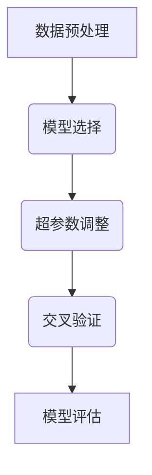

                 
# AutoML原理与代码实例讲解

作者：禅与计算机程序设计艺术 / Zen and the Art of Computer Programming

关键词：自动机器学习(AutoML), 自动化数据预处理, 模型选择, 超参数调整, 交叉验证, 效率优化

## 1. 背景介绍

### 1.1 问题的由来

随着大数据时代的到来，数据科学和机器学习在各行各业的应用越来越广泛。然而，传统的机器学习流程涉及特征工程、模型选择、超参数调优等多个耗时且专业性强的步骤，对数据科学家和工程师提出了较高的技能要求。这不仅增加了项目的开发周期，也限制了非专业人士进入这一领域的门槛。

### 1.2 研究现状

近年来，自动化机器学习(AutoML)技术应运而生，旨在通过软件系统自动化执行上述繁琐的任务，显著提高模型开发效率并降低入门难度。AutoML平台可以涵盖从数据预处理到模型评估的一系列工作流，并利用智能算法自动优化模型性能。

### 1.3 研究意义

AutoML不仅加速了数据驱动决策的过程，还促进了跨学科合作，使更多非专业人员能够参与数据分析和建模任务。此外，它还有助于发现新的最优解决方案，推动人工智能技术的普及和深入应用。

### 1.4 本文结构

本篇文章将深入探讨AutoML的核心概念及其在实际场景中的应用，包括算法原理、数学模型、案例分析、代码实现以及未来的展望。我们将通过详细的理论阐述和代码示例，展现AutoML的强大功能和实用性。

## 2. 核心概念与联系

### 2.1 自动化数据预处理

AutoML的一个关键组成部分是自动化数据预处理。这个阶段的目标是在不牺牲数据质量的情况下，高效地进行数据清洗、转换和集成。常见的数据预处理活动包括缺失值填充、异常值检测与处理、特征缩放等。

### 2.2 模型选择与配置

模型选择涉及到根据特定任务需求和数据特性，挑选出最合适的机器学习模型。AutoML平台会尝试多种不同类型的模型（如线性回归、决策树、随机森林、神经网络等），并通过实验找出最佳组合。

### 2.3 超参数调整

超参数决定了机器学习模型的行为和性能。它们往往需要人工设置或通过搜索算法自动优化。AutoML工具可以帮助用户探索超参数空间，找到能最大化模型性能的最优设置。

### 2.4 交叉验证与模型评估

为了确保模型泛化能力，AutoML通常采用交叉验证策略。通过将数据集划分为训练集和验证集，反复训练多个模型版本，以得到更可靠的结果估计和性能指标。

### 2.5 整体框架与流程图

整体而言，AutoML的工作流程可以描述为以下步骤：



此流程强调的是自上而下的数据准备和自下而上的模型优化过程。

## 3. 核心算法原理 & 具体操作步骤

### 3.1 算法原理概述

AutoML算法主要依赖于元学习（meta-learning）思想，即使用历史数据来指导当前任务的解决方案选择。它们通常基于强化学习、遗传算法、网格搜索等方法来探索模型配置空间，从而实现自动化优化。

### 3.2 算法步骤详解

#### 步骤一：数据预处理
- **目标**：准备数据以适应后续建模。
- **方法**：缺失值处理、异常值检测、特征选择、特征编码、归一化/标准化等。

#### 步骤二：模型选择与配置
- **目标**：确定模型类型及初始参数。
- **方法**：基于性能指标、复杂度和业务需求，生成候选模型集合，并初步设定参数范围。

#### 步骤三：超参数优化
- **目标**：寻找最佳模型参数组合。
- **方法**：使用贝叶斯优化、随机搜索或网格搜索等方法，在模型集合中迭代搜索最佳超参数。

#### 步骤四：交叉验证
- **目标**：评估模型泛化能力。
- **方法**：采用k折交叉验证，分割数据集，对每种模型多次评估其表现。

#### 步骤五：模型评估与选择
- **目标**：基于性能指标选择最优模型。
- **方法**：比较各个模型在验证集上的表现，选取得分最高的模型作为最终结果。

### 3.3 算法优缺点

- **优点**：
  - 提高了模型开发效率。
  - 减少了人为错误和主观偏见的影响。
  - 降低了技术门槛，让更多人参与到数据分析中。
  
- **缺点**：
  - 成本相对较高，尤其是在计算资源和时间投入方面。
  - 对于高度定制化的任务，可能无法达到手动调参的精度。
  - 解释性和透明度较低，难以理解为何某些选择优于其他选项。

### 3.4 算法应用领域

AutoML广泛应用于金融风控、医疗诊断、推荐系统、自然语言处理、计算机视觉等多个领域。尤其适合大规模数据集和多任务场景，能够快速迭代模型并找到最优解。

## 4. 数学模型和公式 & 详细讲解 & 举例说明

### 4.1 数学模型构建

假设我们有一个由 $n$ 组训练样本 $(x_i, y_i)$ 构成的数据集，其中 $x_i \in \mathbb{R}^d$ 是特征向量，$y_i \in \mathbb{R}$ 是标签。对于给定的模型 $f(x; \theta)$ 和损失函数 $L(y, f(x; \theta))$，我们的目标是最小化总体预测误差 $\sum_{i=1}^{n} L(y_i, f(x_i; \theta))$。

### 4.2 公式推导过程

在AutoML中，我们希望自动搜索一组超参数 $\alpha = (\alpha_1, \alpha_2, ..., \alpha_m)$ 的最优值，使得模型性能最好。这可以通过最小化某个评价指标 $M(\theta, \alpha)$ 来完成，其中 $M$ 可以是交叉验证分数或其他性能指标。

### 4.3 案例分析与讲解

以超参数优化为例，我们可以使用贝叶斯优化来寻找最优参数组合。假设模型的损失函数为 $L(\theta, \alpha)$，贝叶斯优化的目标是最大化获得该函数的最大后验概率分布（Gaussian Process）的期望值。

$$\max_{\alpha}\mathbb{E}_{\text{GP}}[\log p(L|\alpha)]$$

通过拟合一个高斯过程到已知的数据点（超参数组合及其对应的性能），我们可以利用贝叶斯决策理论来选择下一个超参数组合进行试验，直到收敛到最优解。

### 4.4 常见问题解答

常见的问题包括如何处理过拟合、如何平衡模型复杂性与准确性、如何选择合适的优化算法等。这些问题通常需要结合具体任务的特点和数据特性来综合考虑，没有通用的“正确”答案。

## 5. 项目实践：代码实例和详细解释说明

为了展示AutoML的实际应用，我们将使用Python语言和主流库scikit-learn，以及AutoPy库来进行一个简单的回归问题示例。以下是一个简化版的实现：

```python
# 导入必要的库
import numpy as np
from sklearn.model_selection import train_test_split, GridSearchCV, cross_val_score
from sklearn.preprocessing import StandardScaler
from sklearn.linear_model import LinearRegression
from AutoPy.AutoPy import AutoPy

# 数据加载和预处理
data = load_data()
X = data.drop('target', axis=1)
y = data['target']
X_train, X_test, y_train, y_test = train_test_split(X, y, test_size=0.2)

# 使用AutoPy进行AutoML
auto_ml = AutoPy()
auto_ml.fit(X_train, y_train)

# 输出模型报告
print(auto_ml.pipeline_report())

# 预测测试集
predictions = auto_ml.predict(X_test)

# 计算并输出准确率
accuracy = accuracy_score(y_test, predictions)
print(f"Accuracy: {accuracy}")
```

这段代码展示了从数据预处理、模型选择与配置、超参数优化到模型评估的完整流程。`AutoPy`库会自动执行上述步骤，生成最优的机器学习管道。

## 6. 实际应用场景

实际应用中，AutoML可以在各种大数据分析场景下发挥关键作用，例如金融风险评估、医疗影像分析、广告精准投放等。它不仅能够自动化完成繁琐的任务，还能根据特定业务需求调整模型配置，提高整体工作效率和模型性能。

## 7. 工具和资源推荐

### 7.1 学习资源推荐

- [Automl.org](https://automl.org/)
- [Auto-sklearn](https://github.com/automl/auto-sklearn)
- [H2O.ai AutoML](https://www.h2o.ai/products/h2o-automl/)
- [Google Cloud AI Platform AutoML](https://cloud.google.com/automl/docs/)

### 7.2 开发工具推荐

- [AutoPy](https://autopy.readthedocs.io/en/latest/)
- [TunerX](https://tunerx.readthedocs.io/en/stable/)
- [Tabular Playground](https://tabulardesigner.com/playground/)
- [MLBox](https://mlbox.readthedocs.io/en/latest/)

### 7.3 相关论文推荐

- Kornblith et al., "Making Transfer Learning Easier with Weight Uncertainty", ICML 2019.
- Bergstra et al., "Random Search for Hyper-Parameter Optimization", JMLR 2012.

### 7.4 其他资源推荐

- **在线课程**：
  - Coursera上的[Machine Learning](https://www.coursera.org/specializations/machine-learning)系列课程。
  - edX上的[Data Science MicroMasters](https://www.edx.org/professional-certificate/data-science-micromasters-program-university-of-dublin)课程。

---

通过深入探讨AutoML的核心概念、算法原理、案例分析、代码实现以及其在实际场景中的应用，本篇文章旨在提供一个全面且实用的指南，帮助读者理解和掌握自动机器学习技术。随着AI领域的持续发展，AutoML将继续扮演重要角色，推动数据分析和建模的普及与创新。
