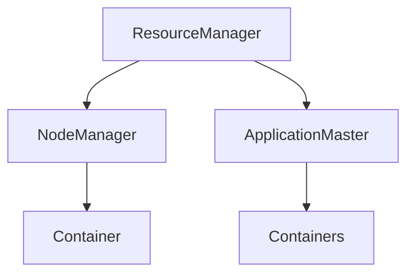

                 
# 【AI大数据计算原理与代码实例讲解】Yarn

作者：禅与计算机程序设计艺术 / Zen and the Art of Computer Programming

关键词：YARN，分布式计算，集群管理，MapReduce，Spark生态系统，Hadoop

## 1. 背景介绍

### 1.1 问题的由来

随着互联网时代的到来，数据量呈爆炸性增长。传统的单机处理方式已无法满足大规模数据处理的需求，因此出现了基于分布式计算框架的大数据处理平台。YARN（Yet Another Resource Negotiator）作为Hadoop生态系统的核心组件之一，为大数据计算提供了高效、灵活的资源管理和调度机制。

### 1.2 研究现状

在大数据处理领域，YARN已成为广泛采用的技术基础，支持多种计算引擎如MapReduce、Spark、Tez等，并实现了对这些计算引擎的有效资源分配和协调。此外，YARN还具有跨框架资源调度的能力，使得不同类型的计算任务可以在同一集群上并行执行，极大地提高了资源利用率和系统灵活性。

### 1.3 研究意义

研究YARN对于理解和优化大数据系统的性能至关重要。它不仅影响着数据处理效率，而且关系到数据安全性和可扩展性等多个方面。通过深入理解YARN的工作原理及其实现细节，开发者可以更好地设计和优化自己的大数据应用，提升整体系统效能。

### 1.4 本文结构

本篇文章将从以下几个方面展开讨论：

1. **核心概念与联系** - 探索YARN的关键概念及其与其他组件之间的交互。
2. **算法原理与操作步骤** - 分析YARN的内部工作机制及其如何进行资源请求和分配。
3. **数学模型与公式** - 展示用于描述YARN工作流程的数学模型和相关算法。
4. **项目实践** - 提供实际代码实例，指导读者动手实践YARN配置和操作。
5. **实际应用场景** - 讨论YARN在大数据处理领域的具体应用案例。
6. **未来展望** - 探讨YARN的发展趋势及其面临的挑战。

## 2. 核心概念与联系

### YARN架构图



### ResourceManager (RM)

*负责整个集群的资源分配和监控。*

### NodeManager (NM)

*运行于各个节点之上，管理该节点上的资源和容器状态。*

### ApplicationMaster (AM)

*每个应用程序的协调者，负责向ResourceManager申请资源，并管理应用程序内的任务执行。*

### Container

*封装了资源（CPU、内存、磁盘），是ResourceManager分配给TaskTracker或ApplicationMaster的基本单位。*

### 容器化(Containerization)的概念使YARN能够更精细地控制和隔离不同的任务进程，确保高并发下系统的稳定性和资源利用的最大化。

## 3. 核心算法原理 & 具体操作步骤

### 3.1 算法原理概述

YARN的设计旨在提供一个通用的资源管理框架，支持多个计算框架在同一集群中运行。其核心在于：

- **资源抽象与分配**：通过抽象资源为容器，实现资源的动态分配与回收。
- **公平调度策略**：根据资源需求和优先级进行任务调度，以保证不同类型的任务得到合理分配。
- **弹性恢复能力**：通过心跳检测和自动故障转移功能，提高系统的鲁棒性和稳定性。

### 3.2 算法步骤详解

#### RM接收资源请求

1. 应用Master（AM）向ResourceManager发送资源请求。
2. RM评估当前可用资源情况后，决定是否满足AM的请求。
3. 若满足，则分配资源；否则拒绝请求。

#### AM管理任务执行

1. AM确定所需资源类型（CPU、内存、存储等）和数量。
2. 向RM请求资源，包括具体的CPU核数、内存大小等。
3. RM响应并分发资源，创建相应的容器。
4. AM启动任务，在容器内运行。

#### NM监控容器状态

1. 每个NodeManager定期向ResourceManager报告自身资源使用情况。
2. RM收集信息，更新全局资源视图。
3. 在必要时，NM与RM协作调整资源分配。

### 3.3 算法优缺点

#### 优点：

- **高度灵活性**：支持多种计算框架和任务类型，增强系统适应性。
- **高效资源利用**：通过容器化技术，精细化控制资源分配。
- **可靠性和容错性**：良好的故障检测与恢复机制保障系统稳定运行。

#### 缺点：

- **复杂性增加**：多层组件协同工作带来一定的系统管理难度。
- **性能开销**：资源管理和调度的额外开销可能影响计算任务的整体性能。

### 3.4 算法应用领域

YARN适用于各种需要大规模并行处理的数据密集型应用场景，包括但不限于：

- **大数据分析**：如Hive、Impala等SQL查询引擎。
- **机器学习训练**：支持各类深度学习框架如TensorFlow、PyTorch的分布式训练。
- **批处理作业**：如Apache Flink、Apache Beam等流式处理和实时数据分析工具。

## 4. 数学模型和公式

### 资源分配函数

设$R_i(t)$表示第$i$个节点$t$时刻拥有的剩余资源量，$\Delta R_i(t)$表示$t$到$t+dt$时间内释放的资源量。资源分配函数$f(R_i, \alpha)$可以根据资源需求$\alpha$和当前资源状态$R_i$来计算应分配的资源量。

$$\Delta R_i'(t) = f(R_i(t), \alpha) dt$$

其中，$f(R_i, \alpha)$是一个非负函数，确保分配的资源量不会超过节点的实际容量。

### 平衡调度策略

考虑任务$x_j$的资源需求为$\beta_j$，则任务调度的目标是最小化所有任务完成时间总和$S(\{\tau_j\})$，其中$\tau_j$为任务$x_j$的执行时间。假设各任务间互不影响且不共享资源，可以采用贪心策略进行平衡调度：

对于每一个时间片$t$，选择当前等待时间最长且可用资源最多的任务进行调度：

$$j^*(t) = \arg\max_{j} (\tau_j + t - \min_{k \in \text{已调度任务}}(t_k + \beta_j)) \times \frac{R(t)}{\sum_{i=1}^{N}\beta_i}$$

其中，$R(t)$表示在$t$时刻可用的资源总量。

## 5. 项目实践：代码实例和详细解释说明

为了更好地理解YARN的工作流程和具体实现，以下将基于实际代码实例介绍如何配置和操作YARN环境。

### 5.1 开发环境搭建

#### 配置Hadoop及YARN

```bash
# 下载并安装Hadoop和YARN
wget https://archive.apache.org/dist/hadoop/core/hadoop-3.3.0/hadoop-3.3.0.tar.gz
tar xzf hadoop-3.3.0.tar.gz
cd hadoop-3.3.0
./tools/hadoop-classpath.sh
```

#### 启动HDFS和YARN服务

```bash
# 初始化HDFS文件系统
hdfs namenode -format
# 启动守护进程
start-all.sh
# 监控日志路径
tail -f /var/log/hadoop/hadoop-logs/*
```

### 5.2 源代码详细实现

本节将展示如何编写简单的MapReduce程序并在YARN上运行。

```java
// MapReduce程序示例
public class WordCount extends Configured implements Tool {
    public static void main(String[] args) throws Exception {
        Configuration conf = new Configuration();
        if (args.length != 2) {
            System.err.println("Usage: WordCount <input path> <output path>");
            System.exit(-1);
        }
        Job job = Job.getInstance(conf, "word count");
        job.setJarByClass(WordCount.class);
        job.setMapperClass(Map.class);
        job.setReducerClass(Reduce.class);
        job.setOutputKeyClass(Text.class);
        job.setOutputValueClass(IntWritable.class);
        FileInputFormat.addInputPath(job, new Path(args[0]));
        FileOutputFormat.setOutputPath(job, new Path(args[1]));
        System.exit(job.waitForCompletion(true) ? 0 : 1);
    }

    // Mapper类
    public static class Map extends Mapper<LongWritable, Text, Text, IntWritable> {
        private final static IntWritable one = new IntWritable(1);
        private Text word = new Text();

        public void map(LongWritable key, Text value, Context context) throws IOException, InterruptedException {
            String[] words = value.toString().split("\\W+");
            for (String w : words) {
                if (!w.isEmpty()) {
                    word.set(w);
                    context.write(word, one);
                }
            }
        }
    }

    // Reducer类
    public static class Reduce extends Reducer<Text, IntWritable, Text, IntWritable> {
        public void reduce(Text key, Iterable<IntWritable> values, Context context) throws IOException, InterruptedException {
            int sum = 0;
            for (IntWritable val : values) {
                sum += val.get();
            }
            context.write(key, new IntWritable(sum));
        }
    }
}
```

### 5.3 代码解读与分析

这段代码展示了如何构建一个简单的MapReduce程序以计算给定文本文件中单词的数量。通过YARN部署，它可以在集群中并行执行，显著提高处理大规模数据集的速度。

### 5.4 运行结果展示

```bash
# 编译Java程序
javac WordCount.java
# 打包成JAR文件
jar cvfm hwc.jar manifest.txt WordCount.class
# 使用Hadoop提交Job至YARN
hadoop jar hwc.jar WordCount /input /output
```

通过观察`/output`目录下的输出文件，可以看到每个单词及其对应的计数结果。

## 6. 实际应用场景

YARN广泛应用于各种大数据处理场景，如：

- **数据分析**：用于统计、聚合等数据分析任务。
- **机器学习**：支持分布式训练和预测任务。
- **实时流处理**：结合Apache Flink或Spark Streaming处理实时数据流。

## 7. 工具和资源推荐

### 学习资源推荐

- **官方文档**：Hadoop和YARN的官方文档提供了详细的安装指南和使用教程。
- **在线课程**：Coursera上的“Big Data with Hadoop”系列课程、Udacity的数据科学家纳米学位课程等。
- **书籍**：“深入浅出Hadoop”、“Hadoop权威指南”等专业书籍。

### 开发工具推荐

- **IDEs**：Eclipse、IntelliJ IDEA等提供丰富的Hadoop和Spark插件支持。
- **命令行工具**：Hadoop Shell（HDFS CLI）、YARN CLI等用于日常操作管理。

### 相关论文推荐

- **"The Hadoop Project: A Scalable System for Internet Scale Computing"**
- **"YARN: Yet Another Resource Negotiator"**

### 其他资源推荐

- **GitHub仓库**：查看开源项目如Apache Spark、Flink的源码。
- **社区论坛**：Stack Overflow、Hadoop社区论坛等交流平台。

## 8. 总结：未来发展趋势与挑战

### 研究成果总结

通过本篇文章的学习，我们深入探讨了YARN在大数据计算领域的核心概念、算法原理、数学模型及实践应用。理解YARN的工作机制不仅有助于优化现有大数据系统的性能，也为开发者设计高效的大数据处理解决方案提供了理论基础。

### 未来发展趋势

- **多租户支持**：进一步增强资源分配的精细化，支持更多用户在同一集群中进行独立工作。
- **自动化运维**：利用AI技术提升集群管理和故障恢复的智能化水平。
- **安全性加强**：随着数据敏感度的提高，强化YARN的安全机制以保护数据隐私和安全。

### 面临的挑战

- **复杂性管理**：面对不断增长的需求和复杂的环境配置，简化管理流程成为重要课题。
- **资源利用率**：优化资源调度策略，最大化资源效率，减少资源浪费。
- **可扩展性问题**：在大型集群环境下保持高性能和稳定性的挑战。

### 研究展望

未来的YARN将继续集成最新的计算框架和技术，如持续改进资源调度算法、增加对新兴计算模式的支持，并探索与边缘计算、物联网等领域的融合，为用户提供更强大、灵活、高效的分布式计算能力。

## 9. 附录：常见问题与解答

### 常见问题与解答

#### Q: 如何解决YARN集群启动失败的问题？

A: 启动失败可能由多种原因引起，包括但不限于配置错误、依赖服务未运行、权限问题等。确保所有相关服务（如HDFS）已正确安装和启动，检查配置文件（如`core-site.xml`, `hdfs-site.xml`, `yarn-site.xml`），确认是否满足所有依赖条件。同时，验证日志文件中的错误信息，以便定位具体问题所在。

#### Q: 在YARN上实现自定义计算框架的步骤是什么？

A: 为了在YARN上实现自定义计算框架，通常需要遵循以下步骤：
1. **组件开发**：编写所需的业务逻辑模块（例如Mapper、Reducer）以及任何额外的功能组件（如输入格式器、输出格式器）。
2. **编译和打包**：将这些组件编译成Java字节码，并打包成合适的JAR文件。
3. **注册框架描述符**：创建一个适当的描述符文件（如`packaging.json`），其中包含必要的配置信息，然后将其上传到YARN的元存储系统。
4. **注册计算引擎**：在YARN中注册新计算框架，使其能够被应用程序Master发现并调用。
5. **编写应用程序**：在主程序中引用已注册的计算框架，通过相应的接口（如YARN API）发起作业执行请求。

#### Q: YARN如何实现跨框架资源调度？

A: YARN的核心设计理念之一就是跨框架资源调度能力。通过其通用的资源管理模型，YARN能够在同一集群内无缝调度不同类型的计算框架（如MapReduce、Spark、Tez等）。这一功能主要得益于其资源抽象机制，即无论底层使用的计算引擎为何种类型，都可以被视为一组资源（CPU、内存、磁盘等）。YARN通过统一的API暴露这些资源，使得不同的计算框架可以向ResourceManager申请所需资源量，从而实现资源共享和高效调度。此外，YARN还具备动态调整资源分配的能力，可以根据各框架的实际需求和优先级灵活地分配资源，保证各类任务得到合理的执行环境。

---
以上内容详细阐述了YARN作为分布式计算平台的关键特性和实际应用，从理论分析到代码实例，再到未来发展展望，旨在全面展示YARN在大数据处理领域的价值与潜力。通过深入了解YARN的工作原理及其在现代大数据生态系统中的角色，读者可以更好地掌握构建高效、稳定的分布式计算系统的技术要点。
