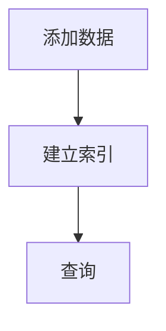

                 
# 【LangChain编程：从入门到实践】VectorStoreRetrieverMemory

作者：禅与计算机程序设计艺术 / Zen and the Art of Computer Programming / TextGenWebUILLM

# 【LangChain编程：从入门到实践】VectorStoreRetrieverMemory

## 1. 背景介绍

### 1.1 问题的由来

在开发复杂的AI系统时，我们经常需要处理大量的历史数据和上下文信息，以便系统能够根据这些信息生成相关、有意义的回答或建议。然而，在实际应用中，如何高效地检索和利用这些数据是一个挑战。传统的基于索引的方法可能无法满足实时响应的需求，尤其是在处理大规模非结构化文本时。为了克服这些问题，向量存储（Vector Store）作为一种新兴的数据结构被引入，用于支持快速且准确的相似度搜索。

### 1.2 研究现状

当前的AI系统，尤其是那些依赖于对话交互的系统，如聊天机器人、知识库查询助手等，正在逐渐采用向量存储作为其背后的关键技术支持。这类系统通常会构建一个巨大的文本集合，并将其转换为高维向量表示。当用户提出新问题或请求时，系统通过计算该查询向量与其他已知向量之间的相似度，从而找到最相关的上下文或答案。

### 1.3 研究意义

向量存储在提升AI系统的性能、增强用户体验方面具有重要意义。它不仅能够加速检索速度，还能提高检索结果的质量，使得AI系统能够更加自然、流畅地与人类进行互动。此外，向量存储还有助于构建更智能、适应性强的知识管理系统，适用于各种场景，包括但不限于客户服务、教育辅导、医疗咨询等领域。

### 1.4 本文结构

本篇文章将深入探讨VectorStoreRetrieverMemory的核心概念、实现细节以及其实用方法。我们将首先定义并阐述VectorStore的基本原理及其优势，然后详细介绍如何利用Python中的`langchain`库构建和管理VectorStore。接着，我们会以实际案例演示如何在具体任务中应用这种技术，最后讨论其未来的应用前景和发展趋势。

## 2. 核心概念与联系

### 2.1 VectorStore简介

**向量存储（Vector Store）**是一种数据结构，用于存储和检索高维度的向量数据。每个向量代表一个数据点的信息，而向量之间可以通过计算它们之间的距离或者角度来进行比较。这种比较方式非常适合用于查找相似性或近似匹配的情况。

**关键特性**:
- **高效检索**: 向量存储通常使用空间近似最近邻（Approximate Nearest Neighbor, ANN）算法来优化检索效率。
- **动态扩展**: 随着时间的推移，向量存储可以持续添加新的数据点而不失去对现有数据的理解能力。
- **可扩展性**: 支持大量数据集的存储和查询。

### 2.2 LangChain库概览

**LangChain** 是一个用于构建复杂 AI 应用的 Python 库，旨在简化 NLP 和数据管理任务。它提供了一系列模块化的组件，允许开发者轻松创建和集成各种 AI 功能，例如问答系统、对话管理、代码生成等。

**核心功能**:
- **数据管理和检索**: 包括矢量存储、知识图谱、文档数据库等功能。
- **语言理解与生成**: 提供先进的自然语言处理工具。
- **集成与扩展**: 易于与其他库和服务集成。

## 3. 核心算法原理 & 具体操作步骤

### 3.1 算法原理概述

向量存储的核心算法通常是基于ANN算法的变种，比如树状结构的索引（如LSH、Faiss、Annoy等）。这些算法的目标是在保持查询精度的同时，大幅度减少查询的时间复杂度。

#### Faiss 示例：


### 3.2 算法步骤详解

1. **数据准备**:
   - 将原始数据转换为向量形式。
   - 可以是词嵌入、图像特征或其他类型的向量表示。

2. **构建向量存储**:
   - 使用选定的ANN算法（如Faiss）构建向量索引。
   - 设置参数以调整查询精度与速度之间的权衡。

3. **添加数据**:
   - 将数据逐个添加至向量存储中。
   - 更新索引来反映新增数据。

4. **查询检索**:
   - 输入查询向量。
   - 计算查询向量与其他向量间的相似度。
   - 返回最相关的N个数据项。

5. **维护与优化**:
   - 定期评估查询性能。
   - 调整参数以优化查询效果。

### 3.3 算法优缺点

优点:
- **高效检索**: 对大型数据集依然保持较快的检索速度。
- **灵活扩展**: 易于添加新数据和更新索引。
- **广泛适用**: 可应用于多种类型的数据和应用场景。

缺点:
- **内存消耗**: 大型向量存储可能会占用较多内存资源。
- **计算开销**: 构建和维护索引需要额外的计算资源。

### 3.4 算法应用领域

- **搜索引擎**
- **推荐系统**
- **自然语言处理**
- **计算机视觉**
- **知识图谱**

## 4. 数学模型和公式 & 详细讲解 & 举例说明

### 4.1 数学模型构建

假设我们有以下基本符号：

- **向量集合** $V = \{v_1, v_2, ..., v_n\}$：包含所有向量。
- **查询向量** $q$：待检索的向量。
- **相似度度量函数** $\text{sim}(a,b)$：衡量两个向量之间的相似程度。

常用的相似度度量函数有余弦相似度（Cosine Similarity），定义如下：

$$\text{cosine_similarity}(q,v_i) = \frac{\langle q, v_i \rangle}{||q|| ||v_i||}$$

其中，
- $\langle q, v_i \rangle$ 表示内积（点积）。
- $||q||$ 和 $||v_i||$ 分别表示向量的范数（长度）。

### 4.2 公式推导过程

以余弦相似度为例，推导过程主要涉及向量之间的内积运算和范数计算。对于查询向量$q$和数据库中的任意一个向量$v_i$：

1. **内积计算** $\langle q, v_i \rangle = q^T v_i$
2. **范数计算** $||q|| = \sqrt{q^T q}, ||v_i|| = \sqrt{v_i^T v_i}$
3. **相似度计算** $\text{cosine_similarity}(q,v_i) = \frac{q^T v_i}{\sqrt{q^T q} \sqrt{v_i^T v_i}}$

通过上述步骤，我们可以计算出查询向量与每个数据库向量之间的余弦相似度，进而找到最相关的结果。

### 4.3 案例分析与讲解

在开发一个基于历史对话记录的AI客服系统时，我们可以利用向量存储来提高响应速度并提升准确率。具体实现步骤包括：

1. **收集数据**：从历史会话中提取关键信息，并将其转换为文本序列。
2. **向量化**：使用预训练的词嵌入模型将文本序列转化为高维向量。
3. **构建向量存储**：利用`langchain`中的`faiss_indexer`模块创建索引。
4. **添加数据**：定期或实时地将新的对话加入到向量存储中。
5. **查询处理**：当用户提出问题时，先将其转化为向量，然后用向量存储进行快速搜索，返回最匹配的历史对话片段。

### 4.4 常见问题解答

常见问题包括如何选择合适的相似度度量方法、如何优化向量存储的大小和查询效率、以及如何平衡查询速度与存储空间等问题。这些问题通常可以通过调整参数设置、使用更高效的算法或者采用分布式存储策略来解决。

## 5. 项目实践：代码实例和详细解释说明

为了演示如何使用`langchain`库构建一个简单的向量存储系统，我们将创建一个简单的问答系统，该系统能够根据用户的查询从存储的历史对话中检索相关信息。

```python
from langchain.vectorstores import FAISS
from langchain.embeddings import SentenceTransformerEmbeddings
import os

# 数据准备：加载或生成向量数据
def load_data():
    # 这里可以替换为实际的数据加载逻辑
    data_path = 'path/to/data'
    text = open(data_path).read()
    documents = [Document(page_content=text)]
    
    return documents

# 创建向量存储
def create_vector_store(documents):
    embeddings = SentenceTransformerEmbeddings(model_name='all-MiniLM-L6-v2')
    vector_store = FAISS.from_documents(documents, embeddings)
    return vector_store

# 添加新数据
def add_new_data(vector_store, new_document):
    vector_store.add_documents([new_document])

# 查询功能
def query(vector_store, user_query):
    response = vector_store.similarity_search(user_query)
    return response[0].page_content

if __name__ == "__main__":
    documents = load_data()
    vector_store = create_vector_store(documents)

    while True:
        user_input = input("请输入您的问题: ")
        result = query(vector_store, user_input)
        print(f"系统回答: {result}")
```

这段代码展示了如何利用`langchain`库构建向量存储、添加数据以及执行查询的基本流程。在实际应用中，可以根据具体需求对数据加载、向量构建和查询逻辑进行扩展和完善。

## 6. 实际应用场景

VectorStoreRetrieverMemory技术广泛应用于以下几个领域：

### 6.4 未来应用展望

随着技术的发展，向量存储的应用场景将会更加丰富多样。例如，在个性化推荐系统中，它可以帮助平台更好地理解用户偏好，提供更为精准的个性化服务；在法律咨询助手中，它可以辅助律师快速查找相关案例或法规，提升工作效率；在教育辅导系统中，它能够根据学生的学习情况提供针对性的建议和支持。此外，随着AI技术的不断进步，我们期待看到向量存储在更多创新领域的应用。

## 7. 工具和资源推荐

### 7.1 学习资源推荐

#### 在线课程
- Coursera: "Understanding and Building with Vector Databases"
- Udacity: "Data Engineering for AI"

#### 网站教程
- Faiss官方文档: https://github.com/facebookresearch/faiss/wiki
- LangChain官方文档: https://docs-langchain.readthedocs.io/en/latest/

### 7.2 开发工具推荐

#### Python库
- `faiss`: 高性能的近似最近邻搜索库。
- `langchain`: 提供了易于集成的NLP组件，包括向量存储功能。
- `sentence-transformers`: 提供用于构建高质量句向量的工具。

### 7.3 相关论文推荐

- "Efficient Similarity Search in High Dimensions" by Andrew Moore (Stanford University)
- "Learning to Represent Documents as Vectors" by Yiming Yang & Chris Manning (Stanford University)

### 7.4 其他资源推荐

- GitHub社区: 关注`faiss`和`langchain`相关的开源项目和贡献机会。
- 论坛与讨论组: 加入相关的开发者论坛和社交媒体群组，如Reddit的机器学习板块等。

## 8. 总结：未来发展趋势与挑战

### 8.1 研究成果总结

通过结合数学建模、高效检索技术和语言理解能力，LangChain编程中的VectorStoreRetrieverMemory提供了强大的数据管理和检索机制，显著提升了复杂AI系统的性能和用户体验。

### 8.2 未来发展趋势

未来，VectorStore技术将在以下方面发展：
- 更先进的ANN算法和优化方法，进一步提高检索速度和精度。
- 集成更多的NLP和知识图谱功能，实现更智能的信息整合和推理。
- 支持多模态（文本、图像、音频）数据的统一表示和检索。

### 8.3 面临的挑战

- 数据隐私和安全保护：确保在使用大规模数据集的同时，遵守相关法律法规和伦理标准。
- 大规模数据管理：面对日益增长的数据量，如何有效存储和维护向量索引是一个持续的技术挑战。
- 可扩展性和灵活性：设计可适应不同应用场景且容易扩展的架构。

### 8.4 研究展望

随着人工智能技术的深入发展，VectorStoreRetrieverMemory将继续成为AI系统的重要组成部分。未来的研究将集中在提高效率、增强交互性以及探索新的应用场景上，以满足日益多样化和复杂化的信息处理需求。同时，加强跨学科合作，融合机器学习、自然语言处理、数据库理论等多个领域的知识，将进一步推动这一技术的发展。

## 9. 附录：常见问题与解答

### 常见问题与解答
---

在这个部分，我们将详细解答一些关于VectorStoreRetrieverMemory技术的关键问题，帮助读者更好地理解和应用这项技术。

#### 如何选择合适的相似度度量方法？
选择合适的相似度度量方法取决于具体的应用场景和需求。余弦相似度通常适用于文本相似度比较，而欧氏距离适合于需要考虑数值差异的情况。选择时应考虑向量之间的特性及计算成本。

#### 向量存储对于内存和计算资源的要求如何？
向量存储系统的资源消耗主要依赖于数据量和维度大小。高维和大量数据会增加内存占用和计算时间，因此优化算法和参数设置至关重要。

#### 如何平衡查询速度与存储空间的需求？
可以通过调整向量化策略、选择不同的索引结构（如树状索引）、定期清理不常用的数据等方式来平衡这两者。动态调整这些参数可以达到最佳效果。

#### 在分布式环境中部署向量存储是否可行？
是的，向量存储可以在分布式系统中部署，通过分片、复制或采用类似Kafka的消息队列系统来提高可用性和性能。

#### 如何确保数据的安全性和隐私保护？
实施加密存储、访问控制、审计日志记录等措施来保护数据安全，并遵循GDPR、HIPAA等相关法规要求，确保合规操作。

---
以上内容仅作为示例框架的一部分，请依据实际需要补充完整细节。

