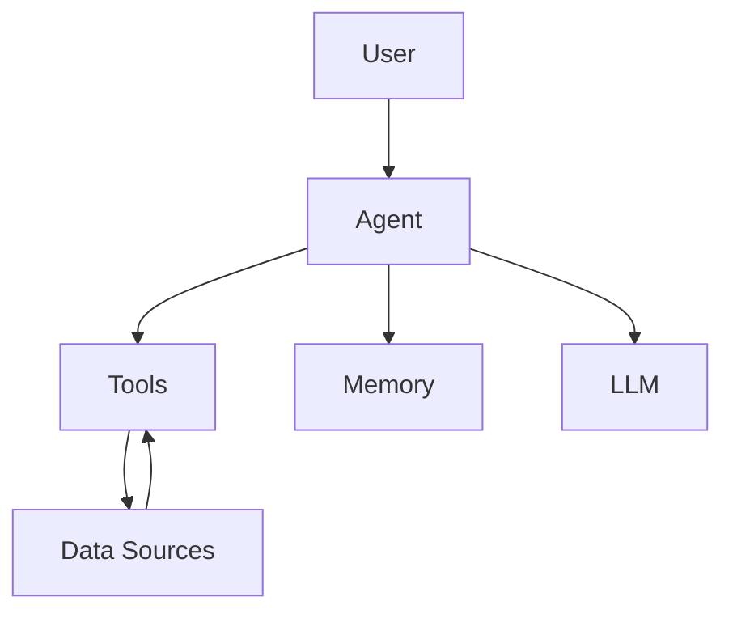
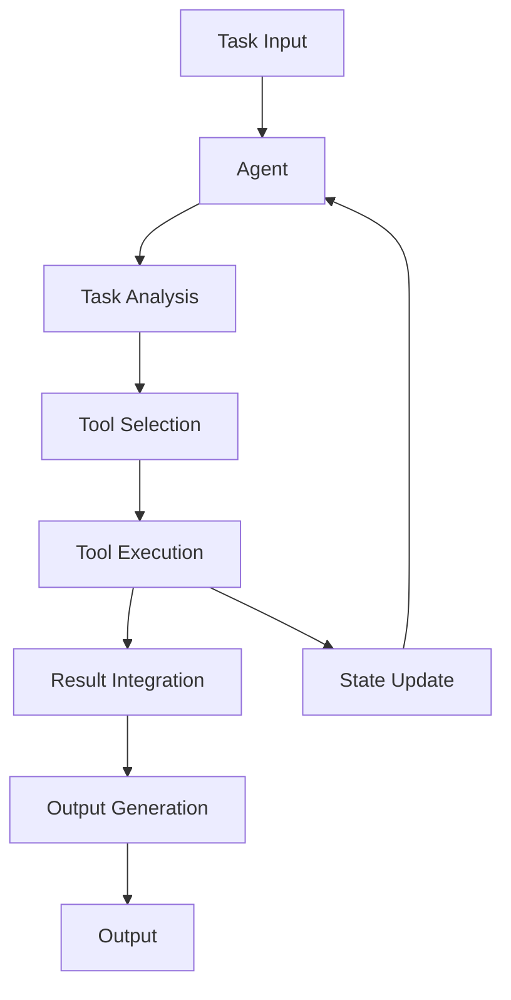

# 【LangChain编程：从入门到实践】最佳安全实践

## 1. 背景介绍

### 1.1 问题的由来

在当今的数字时代,人工智能(AI)和大数据分析已经成为推动科技创新和商业发展的核心动力。作为一种强大的编程范式,LangChain为开发人员提供了一种简单而高效的方式,将大语言模型(LLM)与其他数据源和工具相集成,从而构建智能应用程序。

然而,随着LangChain应用程序的不断增多,确保其安全性和可靠性变得至关重要。由于LangChain应用程序通常会处理敏感数据和执行关键任务,任何安全漏洞或错误都可能导致严重的后果,如数据泄露、系统故障或恶意行为。

### 1.2 研究现状

目前,LangChain安全性的研究仍处于起步阶段。虽然LangChain提供了一些内置的安全措施,如代理和工具头,但这些措施往往不够全面,无法应对复杂的威胁场景。此外,缺乏系统的安全最佳实践指南,使得开发人员在设计和部署LangChain应用程序时容易忽视潜在的安全风险。

### 1.3 研究意义

通过深入研究LangChain安全性,制定全面的安全最佳实践,可以帮助开发人员更好地保护他们的应用程序免受各种威胁,如数据泄露、系统入侵和恶意代码执行。这不仅有助于提高LangChain应用程序的可靠性和用户信任度,还可以促进人工智能技术在各个领域的安全应用。

### 1.4 本文结构

本文将全面探讨LangChain编程的安全最佳实践,内容包括:

1. 核心概念与联系
2. 核心算法原理与具体操作步骤
3. 数学模型和公式详细讲解与案例分析
4. 项目实践:代码实例和详细解释
5. 实际应用场景
6. 工具和资源推荐
7. 总结:未来发展趋势与挑战
8. 附录:常见问题与解答

## 2. 核心概念与联系

在探讨LangChain安全最佳实践之前,我们需要了解一些核心概念及其相互关系。

### 2.1 LangChain架构

LangChain是一个用于构建应用程序的框架,它将大语言模型(LLM)与其他数据源和工具相集成。它的核心架构包括以下几个主要组件:

1. **Agents**: 代理是LangChain的核心组件,负责协调和管理整个应用程序的工作流程。它们可以根据用户的指令,调用不同的工具和数据源来完成任务。

2. **Tools**: 工具是LangChain中的可执行组件,用于执行特定的任务,如查询数据库、调用API或执行计算等。工具可以由开发人员自定义,也可以使用LangChain提供的内置工具。

3. **Memory**: 内存组件用于存储和管理应用程序的状态和上下文信息,以便代理和工具可以访问和更新这些信息。

4. **LLM(Large Language Model)**: LLM是LangChain的核心驱动力,它提供自然语言处理和生成能力,使应用程序能够与用户进行自然语言交互。

### 2.2 安全威胁

在设计和部署LangChain应用程序时,我们需要考虑以下几种主要的安全威胁:

1. **数据泄露**: 由于LangChain应用程序可能会处理敏感数据,如个人信息、财务数据或商业机密,任何数据泄露都可能导致严重的后果。

2. **系统入侵**: 恶意行为者可能试图利用LangChain应用程序中的漏洞来入侵系统,获取未经授权的访问权限,从而执行恶意操作。

3. **恶意代码执行**: LangChain应用程序可能会执行来自不可信来源的代码,如果没有适当的安全措施,这可能会导致恶意代码执行,从而危及系统安全。

4. **模型漏洞**: 大语言模型本身可能存在一些安全漏洞,如生成有害或不当内容、受到对抗性攻击的影响等。

为了应对这些威胁,我们需要采取全面的安全措施,涵盖数据保护、系统安全、代码安全和模型安全等多个方面。

## 3. 核心算法原理与具体操作步骤

### 3.1 算法原理概述

LangChain的核心算法原理是基于代理-工具-内存的架构,通过将大语言模型与各种工具和数据源相集成,实现智能应用程序的构建。

代理在这个架构中扮演着关键角色,它负责协调和管理整个应用程序的工作流程。当用户提出一个任务时,代理会根据任务的性质和复杂程度,选择合适的工具和数据源,并将它们组合在一起执行任务。

在执行任务的过程中,代理会与大语言模型进行交互,利用大语言模型的自然语言处理和生成能力,理解用户的指令,并生成相应的输出。同时,代理还会利用内存组件来存储和管理应用程序的状态和上下文信息,以便在执行任务时可以访问和更新这些信息。

### 3.2 算法步骤详解

LangChain的核心算法可以概括为以下几个步骤:

1. **任务分析**: 代理首先需要分析用户提出的任务,理解其性质和复杂程度。这可能涉及自然语言理解、任务分解和规划等技术。

2. **工具选择**: 根据任务的特点,代理需要选择合适的工具和数据源来执行任务。这可能需要对工具的功能、输入输出格式、成本和性能等因素进行评估和权衡。

3. **工具调用**: 代理调用选定的工具,并将任务分解为一系列子任务,交由工具执行。在这个过程中,代理需要管理工具之间的数据流和控制流,确保任务的正确执行。

4. **结果整合**: 工具执行完成后,代理需要整合各个工具的输出结果,形成最终的任务输出。这可能需要进行数据清理、格式转换和结果汇总等操作。

5. **输出生成**: 代理利用大语言模型的自然语言生成能力,将任务结果转换为自然语言形式,作为最终的输出呈现给用户。

6. **状态更新**: 在执行任务的过程中,代理会根据需要更新内存中的状态和上下文信息,以便后续任务可以利用这些信息。

这个过程可以通过迭代和反馈机制不断优化和改进,以提高任务执行的效率和质量。

### 3.3 算法优缺点

LangChain的核心算法具有以下优点:

1. **模块化设计**: 代理-工具-内存的架构使得LangChain具有良好的模块化设计,便于扩展和定制。

2. **灵活性**: 通过组合不同的工具和数据源,LangChain可以应对各种复杂的任务场景。

3. **可解释性**: 由于算法的执行过程是可见的,LangChain应用程序的行为和决策过程具有较好的可解释性。

4. **高效性**: 通过任务分解和并行执行,LangChain可以提高任务执行的效率。

然而,LangChain的核心算法也存在一些缺点和挑战:

1. **安全性**: 如何确保代理、工具和数据源的安全性,防止数据泄露、系统入侵和恶意代码执行,是一个重大挑战。

2. **可靠性**: 由于涉及多个组件的交互,LangChain应用程序的可靠性需要进行全面的测试和验证。

3. **性能瓶颈**: 在处理大规模数据或计算密集型任务时,LangChain可能会遇到性能瓶颈。

4. **成本**: 使用大语言模型和各种工具可能会产生较高的计算和存储成本。

### 3.4 算法应用领域

LangChain的核心算法可以应用于各种领域,包括但不限于:

1. **自然语言处理**: 利用大语言模型的能力,LangChain可以用于文本分类、情感分析、机器翻译等自然语言处理任务。

2. **知识管理**: 通过集成各种数据源和工具,LangChain可以用于知识提取、知识图谱构建和问答系统等知识管理应用。

3. **自动化流程**: LangChain可以用于自动化各种复杂的任务流程,如数据处理、报告生成和决策支持等。

4. **智能助手**: 利用自然语言交互能力,LangChain可以构建智能助手应用程序,为用户提供个性化的服务和支持。

5. **科学计算**: 通过集成各种计算工具和数据源,LangChain可以应用于科学计算和建模领域。

6. **教育和培训**: LangChain可以用于构建智能教育系统,提供个性化的学习路径和反馈。

总的来说,LangChain的核心算法为构建智能应用程序提供了一种灵活和可扩展的方式,具有广阔的应用前景。

## 4. 数学模型和公式详细讲解与举例说明

在探讨LangChain安全最佳实践时,我们需要了解一些与安全相关的数学模型和公式,以便更好地量化和分析安全风险。

### 4.1 数学模型构建

#### 4.1.1 信息熵模型

信息熵是衡量信息的不确定性或随机性的度量,它可以用于量化数据泄露的风险。对于一个离散随机变量 $X$,其信息熵 $H(X)$ 定义为:

$$H(X) = -\sum_{x \in \mathcal{X}} P(x) \log_2 P(x)$$

其中,$ \mathcal{X}$ 是随机变量 $X$ 的取值集合,$ P(x)$ 是 $X$ 取值 $x$ 的概率。

在LangChain应用程序中,我们可以将敏感数据视为一个随机变量,并计算其信息熵。信息熵越高,表示数据的不确定性越大,泄露的风险也就越小。相反,如果信息熵较低,则需要采取更严格的安全措施来保护数据。

#### 4.1.2 攻击图模型

攻击图是一种用于建模和分析系统安全风险的方法。它将系统中的资产、漏洞和攻击者行为建模为一个图形结构,并利用图理论和概率模型来计算各种攻击路径的可能性和影响。

在LangChain应用程序中,我们可以构建一个攻击图,其中节点表示系统组件(如代理、工具、数据源等)和安全事件,边表示攻击步骤和漏洞利用。通过分析攻击图,我们可以识别系统中的关键漏洞和高风险路径,从而制定相应的安全对策。

### 4.2 公式推导过程

#### 4.2.1 数据泄露风险计算

假设我们有一个LangChain应用程序,需要处理一些敏感数据 $D$。我们可以将数据 $D$ 视为一个离散随机变量,其取值集合为 $ \mathcal{D}$,概率分布为 $P(d)$,其中 $d \in \mathcal{D}$。

如果发生数据泄露,泄露的数据子集为 $D_l \subseteq D$,那么数据泄露造成的信息损失可以用条件熵 $H(D|D_l)$ 来衡量:

$$H(D|D_l) = -\sum_{d \in \mathcal{D}} P(d) \log_2 P(d|D_l)$$

其中,$ P(d|D_l)$ 是在已知泄露数据子集 $D_l$ 的条件下,数据 $d$ 的条件概率。

我们的目标是最