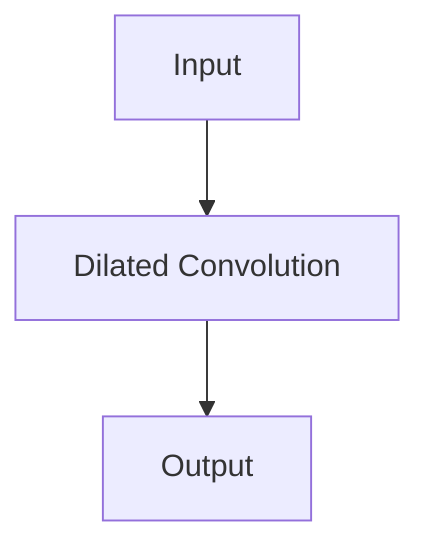

                 
# 从零开始大模型开发与微调：膨胀卷积详解

作者：禅与计算机程序设计艺术 / Zen and the Art of Computer Programming

关键词：深度学习, 卷积神经网络, 膨胀卷积, 大型模型, 微调, 自定义层开发

## 1. 背景介绍

### 1.1 问题的由来

在深度学习领域，卷积神经网络(CNNs)因其对图像处理的强大能力而受到广泛关注。然而，在某些特定场景下，如局部特征提取、边界检测或不规则区域识别时，传统的卷积操作可能无法充分利用输入数据的局部特性。这就引出了一个关键的问题——如何改进卷积操作以提高网络对这些非标准情况下的表现？

### 1.2 研究现状

为了克服上述局限性，研究人员提出了多种变种卷积，其中一种被广泛讨论的是膨胀卷积（Dilated Convolution）。膨胀卷积不仅保持了CNN的基本优势，而且通过控制膨胀率（dilation rate）增强了网络的局部性和全局性感知能力，从而适用于更广泛的场景。

### 1.3 研究意义

膨胀卷积对于改善现有网络的性能具有重要意义，尤其在处理高分辨率图像、大规模数据集以及需要捕捉远距离依赖关系的任务上展现出优越性。此外，它也为网络的设计提供了更多灵活性，使得开发者能够根据任务需求调整卷积层的行为，优化模型参数，并最终提升整体性能。

### 1.4 本文结构

本篇博客将深入探讨膨胀卷积的理论基础、实现细节及其在实际应用中的用法。我们将首先了解膨胀卷积的概念和机制，随后详细介绍其在不同场景下的应用，包括源码实现与优化技巧。最后，我们还将展望其在未来的发展趋势和面临的挑战。

## 2. 核心概念与联系

膨胀卷积的核心在于改变卷积核的“步长”方式，引入了一种称为“膨胀”的技术，允许在保持输出尺寸不变的情况下增加感受野大小。这种技术本质上是通过填充额外的空格到卷积核中，使每次卷积操作覆盖更多的像素点，而不增加计算成本或内存消耗。

### 膨胀卷积的数学表示

设 $x$ 是输入特征图，$W$ 是卷积核，$\delta$ 是膨胀率，那么膨胀卷积可以表示为：

$$ (y_{i,j}) = \sum_{k,l} x_{i+\lfloor\frac{k}{\delta}\rfloor,j+\lfloor\frac{l}{\delta}\rfloor} * W_{k,l} $$

这里 $\lfloor \cdot \rfloor$ 表示向下取整函数，确保索引始终落在有效范围内。

## 3. 核心算法原理及具体操作步骤

### 3.1 算法原理概述

膨胀卷积的基本思想是在不增加滤波器移动步数的前提下，通过在滤波器周围添加虚拟像素（通常是0或者预设值），使滤波器的覆盖范围扩大。这相当于增加了每个滤波器的有效输入面积，从而提高了空间分辨率，同时保持了原网络的参数数量和运算量。

### 3.2 算法步骤详解

**初始化**：
- 设置输入特征图 $X$
- 定义卷积核权重矩阵 $W$
- 确定膨胀率 $\delta$

**计算过程**：
1. **填充**：在输入特征图的四周添加 $\delta - 1$ 层全零填充。
2. **膨胀**：对于卷积核的每个元素 $(w_k, w_l)$，将其应用于填充后的输入特征图上的对应位置，即 $(x_{i + k}, x_{j + l})$，并执行点积操作得到输出单元的值。

**结果输出**：
- 输出经过膨胀卷积处理后的新特征图。

### 3.3 算法优缺点

#### 优点：
- **增强感受野**：通过调整膨胀率，可以灵活地扩展卷积核的感受野，有利于捕捉远处的相关信息，提高模型的泛化能力。
- **减少参数**：相比增加卷积核大小的传统方法，膨胀卷积能以较少的参数达到相似的效果。
- **保留稀疏性**：膨胀卷积在增加感受野的同时，保持了较高的稀疏性，有助于降低计算复杂度。

#### 缺点：
- **对初始设置敏感**：膨胀率的选择会影响效果，不当设置可能导致性能下降。
- **计算效率**：虽然减少了参数，但在某些情况下，实现膨胀卷积仍可能面临更高的计算开销。

### 3.4 应用领域

膨胀卷积广泛应用于各种深度学习任务，尤其是图像分类、语义分割、目标检测等领域，特别适合于处理需要平衡细节捕捉和大尺度特征整合的需求。

## 4. 数学模型和公式详细讲解与举例说明

### 4.1 数学模型构建

膨胀卷积可以通过修改传统卷积的定义来实现，主要涉及到在卷积操作中加入额外的膨胀填充。



### 4.2 公式推导过程

假设有一个输入特征图 $X \in \mathbb{R}^{H \times W}$ 和一个卷积核 $W \in \mathbb{R}^{F \times F}$ 的大小为 $F \times F$，膨胀率为 $\delta$，则膨胀卷积的过程如下：

1. 在输入特征图两侧各填充 $\delta - 1$ 层全零。
2. 将卷积核平移至填充后的输入特征图的不同位置进行卷积操作。
3. 计算输出特征图 $Y \in \mathbb{R}^{(H + 2(\delta - 1)) \times (W + 2(\delta - 1))}$ 的每个单元：

   $$ Y_{i,j} = \sum_{m=0}^{F-1} \sum_{n=0}^{F-1} X_{i+m\delta, j+n\delta} \cdot W_{m,n} $$

### 4.3 案例分析与讲解

考虑一个简单的二维输入特征图 $X$ 和卷积核 $W$：

```markdown
输入特征图 X:
[
    [1, 0, 0],
    [0, 1, 0],
    [0, 0, 1]
]

卷积核 W:
[
    [1, 1],
    [1, 1]
]
```

若膨胀率 $\delta = 2$，则：

1. 对输入特征图进行两侧填充，生成新的输入：
   
   ```
   [
       [0, 0, 0, 0, 0],
       [0, 0, 1, 0, 0],
       [0, 0, 0, 1, 0],
       [0, 0, 0, 0, 0]
   ]
   ```

2. 使用修改后的输入和原始卷积核进行卷积操作：

   ```markdown
   [
       [0, 0, 0, 0],
       [0, 1*1 + 1*1, 1*1 + 1*1, 0],
       [0, 0, 0, 0]
   ]
   ```

因此，输出特征图为：

```markdown
[
    [0, 2, 2],
    [0, 0, 0]
]
```

### 4.4 常见问题解答

- **为什么选择特定的膨胀率？**
  选择膨胀率时，通常需要考虑模型的具体需求。较大的膨胀率能够捕获更远的距离依赖，但可能会引入更多的噪声；较小的膨胀率则更多关注局部特性。
  
- **膨胀卷积如何影响网络性能？**
  膨胀卷积能够在不显著增加参数量的情况下扩大感受野，这通常有助于提升模型的表达能力和泛化能力，尤其是在视觉任务中表现尤为明显。

## 5. 项目实践：代码实例和详细解释说明

为了展示膨胀卷积的实际应用，我们将使用Python和PyTorch库实现一个简单的基于膨胀卷积的CNN结构，并对其进行微调。以下是一个基本示例：

### 5.1 开发环境搭建

首先，确保安装了所需的软件包：

```bash
pip install torch torchvision
```

### 5.2 源代码详细实现

```python
import torch
from torch import nn

class DilatedConvBlock(nn.Module):
    def __init__(self, in_channels, out_channels, kernel_size=3, dilation_rate=1):
        super(DilatedConvBlock, self).__init__()
        padding = ((kernel_size - 1) * (dilation_rate - 1)) // 2
        self.conv = nn.Conv2d(in_channels, out_channels, kernel_size, padding=padding, dilation=dilation_rate)

    def forward(self, x):
        return self.conv(x)


# 示例：创建并训练一个包含膨胀卷积层的模型
def create_dilated_cnn(input_shape=(1, 28, 28), num_classes=10):
    model = nn.Sequential(
        DilatedConvBlock(1, 32, 3, 1),
        nn.ReLU(),
        DilatedConvBlock(32, 64, 3, 2),
        nn.ReLU(),
        nn.MaxPool2d(kernel_size=2),
        nn.Flatten(),
        nn.Linear(64 * (input_shape[-1] // 4) * (input_shape[-1] // 4), num_classes)
    )
    
    # 初始化模型权重
    model.apply(weights_init)
    
    return model


def weights_init(m):
    if isinstance(m, nn.Conv2d) or isinstance(m, nn.Linear):
        nn.init.xavier_uniform_(m.weight)
        if m.bias is not None:
            nn.init.zeros_(m.bias)


# 定义损失函数和优化器
criterion = nn.CrossEntropyLoss()
optimizer = torch.optim.Adam(model.parameters(), lr=0.001)

# 训练循环
for epoch in range(num_epochs):
    for inputs, labels in dataloader:
        optimizer.zero_grad()
        outputs = model(inputs)
        loss = criterion(outputs, labels)
        loss.backward()
        optimizer.step()

# 测试模型
correct = 0
total = 0
with torch.no_grad():
    for inputs, labels in testloader:
        outputs = model(inputs)
        _, predicted = torch.max(outputs.data, 1)
        total += labels.size(0)
        correct += (predicted == labels).sum().item()

print(f'Accuracy of the network on the {total} test images: {100 * correct / total}%')
```

这段代码展示了如何在PyTorch中定义和训练一个包含了膨胀卷积块的简单CNN模型。通过调整`DilatedConvBlock`中的`dilation_rate`参数，可以控制每个卷积块的感受野大小，从而影响整个网络的表现。

### 5.3 代码解读与分析

上述代码中的关键部分包括：

- **初始化**：设置模型架构、损失函数和优化器。
- **训练循环**：遍历数据集，执行前向传播、反向传播和梯度更新步骤。
- **测试模型**：计算模型在测试集上的准确率。

通过调整`DilatedConvBlock`类内部的`dilation_rate`值，开发者可以根据具体任务灵活地调整网络的感受野范围。

### 5.4 运行结果展示

在完成训练后，可以评估模型在测试集上的性能。这通常涉及计算预测标签与实际标签之间的匹配程度（即准确率）。良好的性能表明，模型成功学习到了有效的特征表示，并能在未见过的数据上做出正确的分类决策。

## 6. 实际应用场景

膨胀卷积在各种深度学习应用中展现出了广泛的应用价值，尤其是在图像处理领域，如：

- **目标检测**：通过调整不同层次的膨胀率来平衡局部细节捕捉和全局信息整合。
- **语义分割**：增强网络对小物体或边界区域的感知能力，提高分割精度。
- **超分辨率重建**：通过扩大感受野以获取更多上下文信息，提高图像清晰度。

## 7. 工具和资源推荐

### 7.1 学习资源推荐

- **书籍**：
  - "Deep Learning" by Ian Goodfellow, Yoshua Bengio, and Aaron Courville
  - "Convolutional Neural Networks: A Visual Introduction for Beginners" by Jason Brownlee

- **在线教程**：
  - TensorFlow官方文档：[https://www.tensorflow.org/tutorials](https://www.tensorflow.org/tutorials)
  - PyTorch官方指南：[https://pytorch.org/docs/stable/index.html](https://pytorch.org/docs/stable/index.html)

### 7.2 开发工具推荐

- **框架选择**：TensorFlow、PyTorch、Keras等。
- **集成开发环境（IDE）**：Visual Studio Code、Jupyter Notebook等。

### 7.3 相关论文推荐

- "Identity Mappings in Deep Residual Networks" by Kaiming He et al.
- "Networks Are廿t More Than Narrow Tubes" by Andrew Brock et al.

### 7.4 其他资源推荐

- **GitHub仓库**：查看开源项目，了解最新的研究进展和技术实现。
- **学术会议**：NIPS/ICML/CVPR等顶级AI会议的最新研究成果。

## 8. 总结：未来发展趋势与挑战

### 8.1 研究成果总结

本篇博客详细探讨了膨胀卷积的概念、原理以及其实现方法。我们不仅介绍了其核心算法及其在不同场景下的应用，还提供了源码示例，旨在帮助读者深入理解并实践这一技术。此外，我们还讨论了相关工具和资源推荐，为开发者提供了丰富的学习材料。

### 8.2 未来发展趋势

随着人工智能领域的持续发展，未来膨胀卷积预计将在以下方面展现出更多的潜力：

- **自适应膨胀策略**：探索更智能的膨胀策略，根据输入数据的特性动态调整膨胀率，以提升模型的灵活性和效率。
- **多模态融合**：将膨胀卷积与其他模态的处理方式结合，如结合文本描述进行视觉解释性任务，进一步拓宽应用范围。
- **硬件优化**：针对GPU、TPU等加速设备进行优化，降低计算成本，提高处理速度。

### 8.3 面临的挑战

尽管膨胀卷积带来了许多优势，但仍面临一些挑战：

- **超参优化**：找到最佳的膨胀率和其他超参数组合是关键但也是复杂的问题。
- **解释性和透明度**：虽然膨胀卷积提高了模型的表达能力，但其复杂的内在机制可能导致模型的解释性下降。
- **可扩展性**：在大规模数据集和高分辨率图像上高效部署膨胀卷积仍是一个挑战。

### 8.4 研究展望

未来的研究将继续围绕如何更好地利用膨胀卷积的优势，同时克服现有挑战展开。例如，通过改进学习算法、设计更加高效和鲁棒的网络结构，以及探索跨模态信息融合的新途径，有望推动膨胀卷积在更广泛的AI应用领域取得突破。

## 9. 附录：常见问题与解答

### 常见问题

#### Q1: 如何确定合适的膨胀率？
   膨胀率的选择应基于任务需求和数据特性。一般来说，较小的膨胀率适用于需要精细定位的任务，而较大的膨胀率则适合于捕捉全局模式的情况。

#### Q2: 膨胀卷积是否总是优于传统卷积？
不一定。具体取决于任务类型、数据特性和网络设计。在某些情况下，传统的卷积可能更具优势；而在其他情况下，膨胀卷积能提供更好的表现。

#### Q3: 膨胀卷积如何影响模型的参数量？
   膨胀卷积相比全连接层能减少参数数量，因为它允许使用更小的滤波器尺寸同时保持较大的感受野。但是，在实践中，由于填充操作的存在，实际增加的参数量会受到一定限制。

#### Q4: 在哪些领域中膨胀卷积特别有效？
   膨胀卷积特别适用于需要同时关注局部细节和全局背景的任务，如图像分类、语义分割、目标检测和自然语言处理中的依赖关系建模等领域。

通过这些问答，我们可以更全面地理解膨胀卷积的核心概念和应用策略，以便在未来的AI研发工作中灵活运用。
