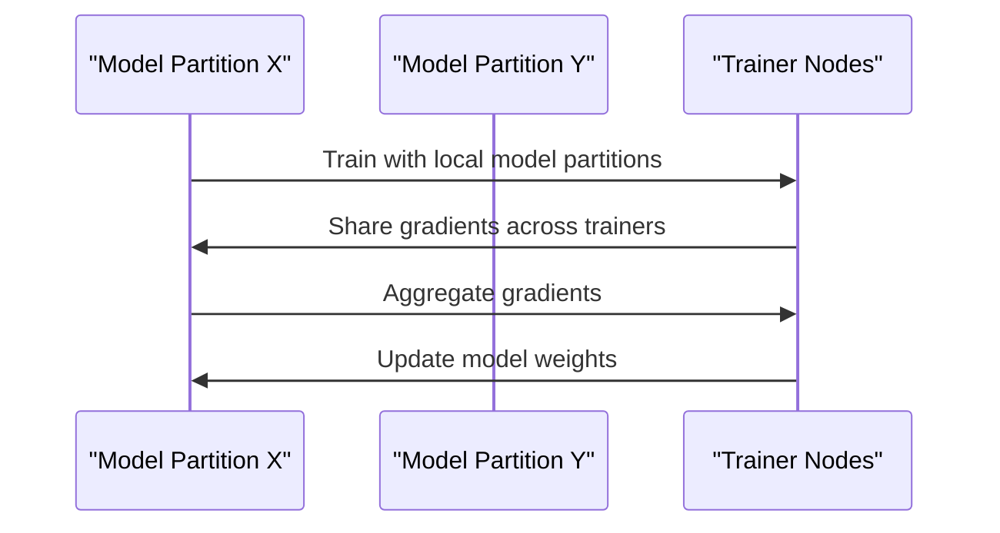

                 
# 大规模语言模型从理论到实践 分布式训练

作者：禅与计算机程序设计艺术 / Zen and the Art of Computer Programming

关键词：大规模语言模型 (Large Language Models), 分布式训练, 并行计算, 数据并行, 参数并行, 矩阵运算优化

## 1. 背景介绍

### 1.1 问题的由来

随着近年来自然语言处理 (NLP) 领域的快速发展，特别是在预训练语言模型的巨大成功之后，对更大规模、更强大能力的语言模型的需求日益增长。这些大模型通常涉及数十亿甚至数百亿参数，这使得它们难以在单个设备上进行有效的训练，从而催生了分布式训练的技术需求。

### 1.2 研究现状

当前，主流的大规模语言模型如 GPT-3 和通义千问等，都是通过分布式训练实现其庞大的参数量。研究界和工业界已经发展出多种成熟的分布式训练框架和技术，包括数据并行、模型并行、混合并行等多种方法，并持续探索如何进一步提升训练效率、减少通信开销以及提高模型泛化能力。

### 1.3 研究意义

大规模语言模型的分布式训练对于推动人工智能技术的边界具有重大意义。它不仅能够加速模型的开发周期，还能够构建更加复杂且具备更强泛化能力的语言模型，为解决实际世界的问题提供更多的可能性，如文本生成、问答系统、对话理解等领域。

### 1.4 本文结构

本篇文章将深入探讨大规模语言模型的分布式训练策略及其在理论和实践层面的应用。首先阐述分布式训练的核心概念与联系，然后详细介绍相关算法原理及具体操作步骤。接下来，我们将详细分析数学模型和公式的构建及其在分布式训练中的应用，最后以一个实际项目为例，展示分布式训练在代码层面的实现细节和运行效果。文章还将讨论分布式训练的实际应用场景、工具和资源推荐，并对未来发展趋势与面临的挑战做出预测。

## 2. 核心概念与联系

分布式训练涉及到多个关键概念，主要包括：

- **数据并行**（Data Parallelism）：将数据分割成多份，分别在不同的GPU或节点上进行训练。这种方法简单易实现，但可能受限于数据分割的均匀性。
  
- **模型并行**（Model Parallelism）：将大型模型拆分成多个子模型，每个子模型分布在不同设备上进行训练。这种方法有助于处理超大规模的模型参数集。

- **混合并行**（Hybrid Parallelism）：结合数据并行和模型并行的优势，同时考虑模型内部结构的划分，可以有效利用硬件资源，提高训练效率。

- **通信优化**（Communication Optimization）：减少模型训练过程中不同设备间的通信延迟，是提高分布式训练性能的关键因素之一。

## 3. 核心算法原理与具体操作步骤

### 3.1 算法原理概述

在分布式训练中，主要目标是在多台机器之间有效地分配和协调任务，同时最小化通信成本和同步开销。基于这一原则，以下是一些核心算法的设计思路：

#### 数据并行算法：
```mermaid
sequenceDiagram
    participant WorkerA as "Worker A"
    participant WorkerB as "Worker B"
    participant Trainer as "Trainer Node"
    
    loop Each Worker
        WorkerA->>Trainer: Send batch of data for training
        Trainer->>WorkerA: Receive gradients
        WorkerA->>Trainer: Send updated model parameters
    end
    
    note left of Trainer
        Update global model parameters based on received updates.
    end
```

#### 模型并行算法：


### 3.2 具体操作步骤

1. **模型加载与初始化**：加载大模型至各个训练节点，根据选择的数据并行或模型并行策略进行切分。
2. **数据准备**：将训练数据集分割成多个子集，确保分布均匀。
3. **并行训练**：在每个训练节点上并行执行前向传播和反向传播，计算梯度。
4. **梯度聚合**：通过网络通信机制将各节点的梯度汇总至一个中心节点，进行梯度平均或其他聚合策略。
5. **权重更新**：使用聚合后的梯度更新模型参数。
6. **迭代循环**：重复以上过程直至达到预定的训练轮数或满足收敛条件。

### 3.3 算法优缺点

- **优点**：充分利用多核处理器和分布式集群资源，显著缩短训练时间；易于实现，可扩展性强。
- **缺点**：数据通信开销大，尤其是模型并行时，需要频繁交换大量参数；存在同步问题，可能导致训练速度受限。

### 3.4 应用领域

分布式训练广泛应用于自然语言处理、计算机视觉、推荐系统等多个AI领域，尤其对那些参数量巨大、数据集庞大的模型尤为重要。

## 4. 数学模型和公式 & 详细讲解 & 举例说明

### 4.1 数学模型构建

假设我们有大小为 $m \times n$ 的矩阵 $\mathbf{W}$ 表示神经网络的权重矩阵，以及大小为 $n$ 的向量 $\mathbf{x}$ 表示输入特征。损失函数定义为 $L(\mathbf{W}, \mathbf{x})$，我们的目标是最小化该损失函数。

通过梯度下降方法更新权重，我们可以得到梯度 $\nabla_{\mathbf{W}} L = - \frac{\partial L}{\partial \mathbf{W}}$。在分布式设置下，每个节点负责计算局部梯度 $\nabla_{\mathbf{W}_i} L_i$，其中 $L_i$ 是每个节点上的局部损失函数。

### 4.2 公式推导过程

对于数据并行，如果将大矩阵 $\mathbf{W}$ 分割为若干块，每块在不同的设备上计算梯度，最终通过平均来合并所有设备的梯度：

$$ \hat{\nabla}_{\mathbf{W}} L = \frac{1}{k} \sum_{i=1}^{k} \nabla_{\mathbf{W}_i} L_i $$

其中 $k$ 是参与计算的设备数量。

### 4.3 案例分析与讲解

以大规模语言模型为例，在训练过程中，模型参数更新遵循上述公式，通过迭代优化损失函数。具体来说，每一层的参数矩阵 $\mathbf{W}$ 在每个训练周期被更新一次，以更接近全局最优解。

### 4.4 常见问题解答

常见问题包括但不限于：
- 如何平衡通信开销和训练效率？
- 怎样设计有效的梯度聚合策略？
- 对于超大规模模型，如何保证模型和数据的有效分布？

解决这些问题通常涉及到先进的通信协议设计、高效的数据存储方案、以及针对特定硬件架构的优化技术。

## 5. 项目实践：代码实例和详细解释说明

### 5.1 开发环境搭建

本项目假设使用PyTorch框架，并利用其DistributedDataParallel（DDP）模块支持多GPU训练。

```bash
pip install torch torchvision
# 配置环境变量指定GPU设备
export CUDA_VISIBLE_DEVICES="0,1" # 使用两个GPU
python train.py --num_gpus 2
```

### 5.2 源代码详细实现

以下是一个简单的代码示例展示如何使用 PyTorch 实现数据并行训练：

```python
import torch
from torch.nn.parallel import DistributedDataParallel as DDP
from torch.utils.data import DataLoader, Dataset

class MyDataset(Dataset):
    # 定义数据集类

def data_loader():
    # 创建数据加载器

model = YourModelClass() # 自定义模型类
device = torch.device("cuda")
model.to(device)
ddp_model = DDP(model)

for epoch in range(num_epochs):
    for batch_data in data_loader():
        optimizer.zero_grad()
        outputs = ddp_model(batch_data)
        loss = compute_loss(outputs, batch_data) # 计算损失
        loss.backward()
        optimizer.step()

print("Training completed.")
```

### 5.3 代码解读与分析

这段代码展示了如何使用 PyTorch 的 DDP 进行数据并行训练。关键点在于：
- **模型实例化**：创建模型对象，并将其迁移到 GPU 设备上。
- **封装模型**：使用 `DistributedDataParallel` 将模型包装起来，实现数据并行训练。
- **迭代训练**：遍历数据加载器中的批次数据，执行前向传播、计算损失、反向传播和梯度更新操作。

### 5.4 运行结果展示

运行此脚本后，可以观察到训练进度和性能指标的变化。例如，日志输出中可以看到损失值随迭代次数递减的趋势，表示模型正在学习。

## 6. 实际应用场景

分布式训练在实际应用中具有多种场景，主要包括：

- **超大规模模型训练**：如大型语言模型，通过分布式训练可以有效降低单个设备的内存需求和训练时间。
- **实时推荐系统**：用于在线学习用户行为模式，快速调整推荐策略。
- **复杂视觉任务**：如自动驾驶中的物体检测与识别，依赖于大规模预训练模型进行端到端学习。

## 7. 工具和资源推荐

### 7.1 学习资源推荐

- **官方文档**：PyTorch、TensorFlow等深度学习库的官方文档提供了丰富的分布式训练指南和技术细节。
- **论文阅读**：《Attention is All You Need》、《Scaling Transformer to GPUs with Efficient Parallelism and Memory Optimization》等研究论文介绍了分布式训练的关键技术和实践经验。

### 7.2 开发工具推荐

- **PyTorch Lightning**：提供了一种简洁的方式来进行模型训练和实验管理。
- **Horovod**：一个旨在简化并行训练的大规模机器学习库，特别适合多机多卡的分布式训练场景。

### 7.3 相关论文推荐

- **Deep Learning Scaling: From a Single Machine to Multiple Machines**：探讨了从单机到集群的迁移路径和优化方法。
- **Efficient Large-Scale Distributed Training of Neural Networks Using Tensor Processing Units (TPUs)**：针对TPU的分布式训练策略。

### 7.4 其他资源推荐

- **在线课程**：Coursera、Udacity等平台提供的深度学习课程通常包含分布式训练的部分内容。
- **GitHub仓库**：搜索“distributed training”或特定框架（如PyTorch、TensorFlow）的分布式训练相关代码仓库，可以获得实用的代码示例和开源项目。

## 8. 总结：未来发展趋势与挑战

### 8.1 研究成果总结

分布式训练已成为构建大规模语言模型和其他AI系统的基石技术之一，极大地推动了自然语言处理、计算机视觉等领域的发展。

### 8.2 未来发展趋势

- **硬件加速**：随着更快、更高效的GPU、FPGA、ASIC等硬件的发展，分布式训练的性能有望进一步提升。
- **算法创新**：探索新的分布式训练算法，减少通信成本，提高训练效率。
- **可扩展性**：开发更灵活的分布式训练框架，支持不同规模和类型的任务。

### 8.3 面临的挑战

- **通信瓶颈**：大模型训练过程中频繁的参数交换成为主要限制因素之一。
- **模型优化**：在保持性能的同时，优化模型大小以适应有限的资源约束。
- **可维护性和部署**：确保分布式训练系统的稳定性和易于维护，同时促进模型的快速部署。

### 8.4 研究展望

未来的研究将聚焦于解决上述挑战，推动分布式训练技术向更加高效、便捷和易用的方向发展，为人工智能领域的持续进步奠定坚实的基础。

## 9. 附录：常见问题与解答

### 常见问题解答汇总

#### Q: 如何最小化分布式训练过程中的通信延迟？
   A: 采用低延迟网络协议、优化数据传输格式、利用缓存机制以及减少同步频率等策略都可以帮助减少通信延迟。

#### Q: 分布式训练时如何确保模型收敛？
   A: 在设计分布式训练算法时，需要考虑梯度聚合策略的选择，避免局部最优解的影响，并监控训练过程中的损失变化来确保全局收敛。

#### Q: 大型语言模型如何在移动端进行有效的分布式训练？
   A: 使用轻量级的模型压缩技术、量化方法以及专门针对移动设备优化的硬件（如Mali GPU）来缩小模型尺寸，提高移动端的训练效率和性能。

#### Q: 分布式训练是否适用于所有类型的深度学习模型？
   A: 虽然分布式训练普遍适用于各种深度学习模型，但其效果受到硬件配置、模型结构、训练数据集等因素的影响。对于特定的模型或任务，可能需要定制化的优化方案。

这些问答涵盖了分布式训练中常见的技术和实践问题，希望对读者理解这一主题有所帮助。
