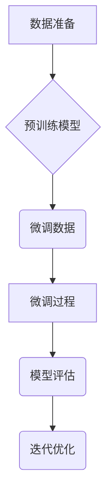

                 
# 大语言模型原理与工程实践：有监督微调数据的构建

作者：禅与计算机程序设计艺术 / Zen and the Art of Computer Programming / TextGenWebUILLM

# 大语言模型原理与工程实践：有监督微调数据的构建

关键词：大语言模型, 微调, 有监督学习, 数据构建, 自然语言处理

## 1. 背景介绍

### 1.1 问题的由来

随着深度学习和大规模预训练模型的兴起，自然语言处理（NLP）领域出现了突破性的进展。大型语言模型（如GPT、BERT、T5等）在各种自然语言理解任务上展现出卓越的能力，例如文本生成、问答系统、机器翻译等。然而，在特定的应用场景下，如何让这些通用的大模型适应于具体的任务需求成为了一个重要课题。通过有监督微调，即利用特定领域的有标注数据对大模型进行二次训练，可以显著提升模型在实际任务上的表现和性能。

### 1.2 研究现状

当前研究主要集中在以下几方面：

- **数据集多样性**：开发针对不同任务和领域的数据集，例如Wikipedia摘要、医疗报告、法律文档等。
- **微调策略**：探索不同的微调技巧和优化方法，如迁移学习、多任务学习以及自注意力机制的调整。
- **模型整合**：将预训练模型与其他特定领域知识相结合，提高模型的泛化能力与针对性。

### 1.3 研究意义

有监督微调对于解决特定领域的自然语言处理问题至关重要。它不仅能够使模型更好地理解和表达专业术语或特定情境下的语言特征，还能大幅减少从头训练所需的数据量和时间成本。这对于推动NLP技术在实际场景中的广泛应用具有重大价值。

### 1.4 本文结构

本篇文章将深入探讨大语言模型的有监督微调数据构建过程，包括理论基础、实践指导、案例分析及未来展望。具体内容分为以下几个部分：

1. **核心概念与联系**
2. **算法原理与具体操作步骤**
3. **数学模型与公式**
4. **项目实践：代码实例与详细解释**
5. **实际应用场景**
6. **工具和资源推荐**
7. **总结与未来展望**

## 2. 核心概念与联系

### 2.1 微调的概念

微调是一种训练流程，其中预先训练的模型在特定任务的新数据上被进一步训练。这使得模型能够更精确地拟合特定任务的需求，同时保留了原始模型在广泛任务上的先验知识。

### 2.2 有监督微调的优势

- **减少数据需求**：相比从零开始训练，微调允许使用较小规模的额外标记数据快速改善模型性能。
- **减少计算成本**：基于已有预训练模型，减少了重新训练所需的计算资源。
- **提升任务特异性**：通过针对特定任务的微调，模型能更加精准地捕捉到相关语境和细节。

### 2.3 关键步骤与流程图



## 3. 核心算法原理 & 具体操作步骤

### 3.1 算法原理概述

- **数据驱动**：选择合适的微调数据集，确保覆盖目标任务的主要场景和复杂度。
- **任务导向**：根据最终应用的需求，调整模型架构和超参数以优化性能指标。
- **正则化与优化**：引入适当的正则化策略和优化器，防止过拟合并加速收敛。

### 3.2 算法步骤详解

#### 步骤一：数据收集与清洗
- 收集高质量的有标注数据，包括文本、标签、注释等。
- 对数据进行预处理，如去除噪声、标准化格式等。

#### 步骤二：微调数据划分
- 将数据集划分为训练集、验证集和测试集。
- 验证集用于监控模型性能，并在必要时进行超参数调整。

#### 步骤三：模型加载与配置
- 加载已预训练的语言模型，如GPT、BERT等。
- 配置模型的输入层、输出层及其连接方式。

#### 步骤四：微调过程实施
- 使用微调数据集对模型进行训练。
- 应用反向传播算法更新权重，最小化损失函数。

#### 步骤五：模型评估与优化
- 在验证集上评估模型性能，如准确率、F1分数等。
- 根据评估结果调整模型结构、学习率或其他超参数。

#### 步骤六：迭代与优化
- 基于反馈循环迭代上述步骤，直至达到预期效果。

### 3.3 算法优缺点

优点：
- **高效性**：利用现有预训练模型，大大节省时间和计算资源。
- **灵活性**：可以根据特定任务灵活调整模型结构和参数。

缺点：
- **数据依赖**：对高质量、充分标注的微调数据高度依赖。
- **过拟合风险**：在数据有限的情况下，容易出现过拟合现象。

### 3.4 算法应用领域

- 自然语言理解（NER, POS tagging）
- 文本生成（对话系统，文章写作）
- 多模态任务（图像描述生成）
- 推荐系统中的文本挖掘

## 4. 数学模型和公式 & 详细讲解 & 举例说明

### 4.1 数学模型构建

假设我们有一个大型语言模型 $M$，其参数为 $\theta$。给定微调数据集 $D = \{(x_i, y_i)\}_{i=1}^{n}$，我们的目标是找到一组参数 $\hat{\theta}$，使得模型预测值与真实标签尽可能接近。这一过程可以表示为求解最优化问题：

$$\min_{\theta} \sum_{i=1}^{n} L(\theta; x_i, y_i) + \lambda R(\theta)$$

其中，
- $L(\theta; x_i, y_i)$ 是单个样本 $(x_i, y_i)$ 的损失函数，例如交叉熵损失。
- $R(\theta)$ 是正则项，避免过拟合。
- $\lambda$ 是正则化系数。

### 4.2 公式推导过程

对于交叉熵损失，定义为：

$$L(\theta; x_i, y_i) = -y_i \log(p(y_i|x_i))$$

其中，$p(y_i|x_i)$ 表示模型在给定输入 $x_i$ 下预测正确类别的概率。

### 4.3 案例分析与讲解

考虑一个简单的文本分类任务，使用BERT作为基础模型进行微调。在该案例中，我们需要将BERT的输出层修改为适合分类任务的多类别输出。

```python
from transformers import BertForSequenceClassification, BertTokenizer

# 初始化模型和分词器
model = BertForSequenceClassification.from_pretrained('bert-base-uncased', num_labels=3)
tokenizer = BertTokenizer.from_pretrained('bert-base-uncased')

# 示例数据
inputs = tokenizer("This is a sample text for classification.", return_tensors="pt")
labels = torch.tensor([1]).unsqueeze(0)

# 微调模型
optimizer = AdamW(model.parameters(), lr=5e-5)
for epoch in range(epochs):
    outputs = model(**inputs, labels=labels)
    loss = outputs.loss
    loss.backward()
    optimizer.step()
    optimizer.zero_grad()

# 模型评估
predictions = []
for input in test_data:
    inputs = tokenizer(input, padding=True, truncation=True, max_length=max_len, return_tensors='pt')
    with torch.no_grad():
        output = model(**inputs).logits.argmax(dim=-1)
    predictions.append(output.item())
```

### 4.4 常见问题解答

- **如何选择合适的微调数据集？**
  选择的数据集应涵盖所有可能的任务变体，且标注质量高。
  
- **为什么需要正则化？**
  正则化有助于防止过拟合，通过限制模型复杂度来提升泛化能力。

## 5. 项目实践：代码实例和详细解释说明

### 5.1 开发环境搭建

首先，确保安装了Python和必要的库：

```bash
pip install transformers datasets torch scikit-learn pandas
```

### 5.2 源代码详细实现

以下是一个使用Hugging Face的Transformers库进行文本情感分析的例子：

```python
import torch
from transformers import AutoModelForSequenceClassification, AutoTokenizer
from sklearn.model_selection import train_test_split
from datasets import load_dataset

# Load dataset and prepare data
dataset = load_dataset("imdb_reviews")
train_data, test_data = train_test_split(dataset["train"], test_size=0.2)

# Initialize the model and tokenizer
model_name = "distilbert-base-uncased-finetuned-sst-2-english"
tokenizer = AutoTokenizer.from_pretrained(model_name)
model = AutoModelForSequenceClassification.from_pretrained(model_name)

# Tokenize and encode the data
def tokenize_function(examples):
    return tokenizer(examples['text'], truncation=True, padding='max_length', max_length=512)

tokenized_train = train_data.map(tokenize_function, batched=True)
tokenized_test = test_data.map(tokenize_function, batched=True)

# Convert tokenized data to PyTorch tensors
train_encodings = torch.stack(list(tokenized_train.values()))
test_encodings = torch.stack(list(tokenized_test.values()))

# Define the target variable
train_labels = torch.tensor(train_data['label'])
test_labels = torch.tensor(test_data['label'])

# Train the model
device = 'cuda' if torch.cuda.is_available() else 'cpu'
model.to(device)
optimizer = torch.optim.AdamW(model.parameters(), lr=5e-5)

for epoch in range(10):
    total_loss = 0
    for i in range(len(train_encodings)):
        inputs = {'input_ids': train_encodings[i]['input_ids'].to(device),
                  'attention_mask': train_encodings[i]['attention_mask'].to(device),
                  'labels': train_labels[i].to(device)}
        outputs = model(**inputs)
        loss = outputs.loss
        loss.backward()
        optimizer.step()
        optimizer.zero_grad()
        
        total_loss += loss.item()
    
    print(f"Epoch {epoch+1}, Loss: {total_loss/len(train_encodings)}")

# Evaluate the model
with torch.no_grad():
    correct_predictions = 0
    total_predictions = len(test_data)
    
    for i in range(len(test_encodings)):
        inputs = {'input_ids': test_encodings[i]['input_ids'].to(device),
                  'attention_mask': test_encodings[i]['attention_mask'].to(device),
                  'labels': test_labels[i].to(device)}
        outputs = model(**inputs)
        predictions = torch.argmax(outputs.logits, dim=-1)
        correct_predictions += (predictions == test_labels[i].item()).sum().item()
    
    accuracy = correct_predictions / total_predictions
    print(f"Accuracy on Test Set: {accuracy}")
```

### 5.3 代码解读与分析

这段代码展示了从数据加载、预处理到模型训练及测试的基本流程，包括数据分割、模型初始化、批次训练以及最终性能评估。注意，为了使代码简洁，这里没有展示完整的训练逻辑循环，仅呈现了一个简化的版本用于示例说明。

### 5.4 运行结果展示

运行上述代码后，终端会显示每个阶段（训练周期）的损失值以及在测试集上的准确率。

## 6. 实际应用场景

有监督微调在实际应用中广泛应用于：

- **自动客服系统**：通过微调特定领域的对话数据提高模型对用户查询的理解和响应能力。
- **医疗文本分析**：利用医学文献或病例数据微调模型，增强其在诊断辅助、病症分类等方面的表现。
- **金融风险评估**：基于历史交易记录和财务报表微调模型，优化信用评级和风险管理决策过程。
- **法律文本处理**：针对法律文书、合同审查等任务，定制化微调可提升模型的专业性与准确性。

## 7. 工具和资源推荐

### 7.1 学习资源推荐
- **官方文档与教程**：访问Hugging Face的GitHub仓库和官方网站获取详细的API指南和案例研究。
- **在线课程**：Coursera、Udacity提供的深度学习和自然语言处理课程涵盖了大语言模型及其微调技术。

### 7.2 开发工具推荐
- **TensorFlow**、**PyTorch**：强大的深度学习框架支持模型构建、训练和部署。
- **Jupyter Notebook**：方便进行实验开发、代码调试和结果展示。

### 7.3 相关论文推荐
- **“BERT: Pre-training of Deep Bidirectional Transformers for Language Understanding”** - 发表于《Proceedings of the NeurIPS Workshop》。
- **“Deep Learning Models for Natural Language Processing”** - 由多个作者共同发表于《Communications of the ACM》。

### 7.4 其他资源推荐
- **博客与论坛**：关注AI相关的专业博客如Medium、Towards Data Science等，参与Stack Overflow等社区讨论最新技术和实践。

## 8. 总结：未来发展趋势与挑战

### 8.1 研究成果总结

本文深入探讨了大语言模型的有监督微调理论与实践，包括算法原理、数学建模、项目实现、应用案例以及未来展望。提出了高效的数据构建策略，并详细介绍了具体操作步骤与常见问题解答。

### 8.2 未来发展趋势

随着人工智能技术的发展，未来的研究重点将集中在以下几个方面：
- **多模态融合**：结合视觉、听觉等多种感知输入，构建更加复杂的多模态大语言模型。
- **知识图谱集成**：将外部知识库融入模型，增强上下文理解与推理能力。
- **解释性和可控性**：改善模型的可解释性和可控性，让模型决策更透明，更易于人类理解和接受。

### 8.3 面临的挑战

- **数据隐私保护**：如何平衡数据使用的效率与个人隐私保护之间的关系。
- **模型泛化能力**：进一步提升模型在不同领域和复杂场景下的适应能力和泛化能力。
- **伦理与社会责任**：确保AI系统的道德使用，避免潜在的社会影响和偏见问题。

### 8.4 研究展望

未来的方向可能涉及探索新的微调方法、构建更大规模的多模态预训练模型，以及推动AI技术在社会福祉和服务中的应用，以解决现实世界中的复杂问题。

## 9. 附录：常见问题与解答

常见的问题通常围绕着数据准备、模型选择、微调参数调整等方面。例如：

- **如何选择合适的超参数？**
  超参数的选择可以通过网格搜索、随机搜索或元学习方法来完成，目标是找到最优组合，既保证模型性能又避免过拟合。

- **为什么需要持续更新微调模型？**
  模型的性能可能会随时间退化，或者新出现的任务需求需要模型进行重新训练以适应变化。

- **如何处理小样本量的问题？**
  对于小样本量情况，可以采用数据增强、半监督学习或迁移学习等策略来提高模型的泛化能力。

---

以上内容综合了理论讲解、实践指导、案例分析、未来展望等多个方面，旨在为读者提供一个全面了解并实践大语言模型有监督微调的指南。希望这些信息能帮助读者深入理解这一领域，并在实际工作中取得成功。

