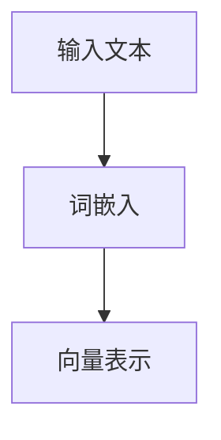
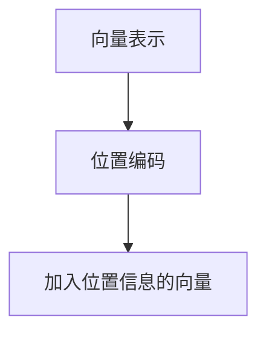
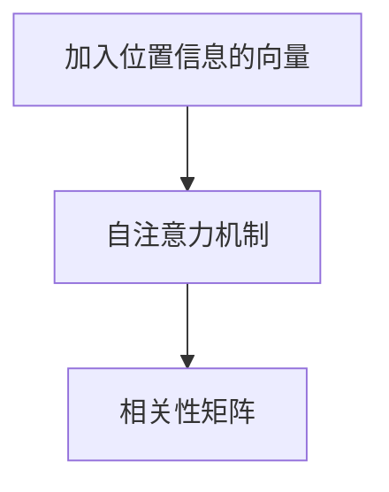
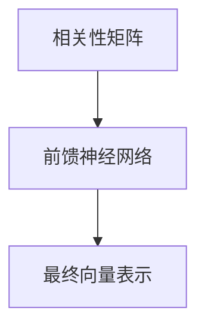
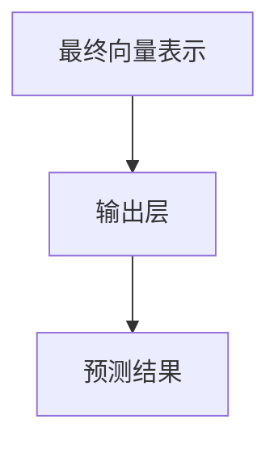
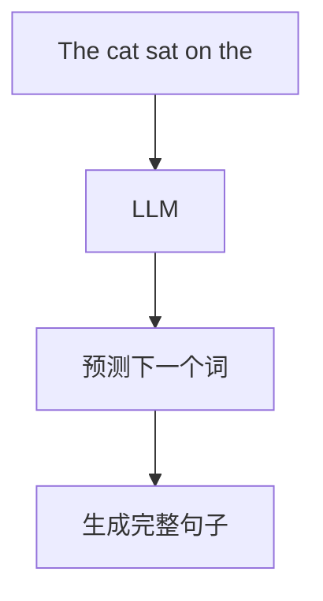

# 大语言模型原理基础与前沿 针对不同预训练领域的不同专家

作者：禅与计算机程序设计艺术 / Zen and the Art of Computer Programming

## 1. 背景介绍

### 1.1 问题的由来

大语言模型（Large Language Models, LLMs）近年来在自然语言处理（NLP）领域取得了显著的进展。随着计算能力和数据量的增加，LLMs如GPT-3、BERT等在各种任务中表现出色，从文本生成到翻译，再到问答系统。然而，这些模型的复杂性和规模也带来了新的挑战和问题。

### 1.2 研究现状

目前，LLMs的研究主要集中在以下几个方面：

1. **模型架构**：Transformer架构的引入极大地提升了模型的性能。
2. **预训练与微调**：通过大规模数据预训练和特定任务微调，模型能够在多种任务中表现优异。
3. **计算资源**：训练LLMs需要大量的计算资源和时间。
4. **应用领域**：LLMs在医疗、法律、教育等多个领域展现了广泛的应用前景。

### 1.3 研究意义

研究LLMs不仅有助于提升NLP技术，还能推动人工智能在各个领域的应用。通过深入理解LLMs的原理和架构，我们可以开发出更高效、更智能的系统，解决实际问题。

### 1.4 本文结构

本文将从以下几个方面详细探讨LLMs的原理和应用：

1. 核心概念与联系
2. 核心算法原理 & 具体操作步骤
3. 数学模型和公式 & 详细讲解 & 举例说明
4. 项目实践：代码实例和详细解释说明
5. 实际应用场景
6. 工具和资源推荐
7. 总结：未来发展趋势与挑战
8. 附录：常见问题与解答

## 2. 核心概念与联系

在深入探讨LLMs之前，我们需要了解一些核心概念和它们之间的联系。

### 2.1 语言模型

语言模型是用于预测文本中下一个词的概率分布的模型。传统的语言模型包括n-gram模型和基于统计的方法，而现代的语言模型则主要基于神经网络。

### 2.2 Transformer架构

Transformer是目前最流行的神经网络架构之一，广泛应用于LLMs。其核心组件包括自注意力机制（Self-Attention）和前馈神经网络（Feed-Forward Neural Network）。

### 2.3 预训练与微调

预训练是指在大规模无标签数据上训练模型，而微调则是在特定任务的数据上进一步训练模型。预训练使得模型能够捕捉到广泛的语言特征，而微调则使得模型能够适应特定任务。

### 2.4 自注意力机制

自注意力机制允许模型在处理每个词时，能够关注到输入序列中的其他词，从而捕捉到更丰富的上下文信息。

### 2.5 BERT与GPT

BERT（Bidirectional Encoder Representations from Transformers）和GPT（Generative Pre-trained Transformer）是两种典型的LLMs。BERT是双向的，适用于理解任务，而GPT是单向的，适用于生成任务。

## 3. 核心算法原理 & 具体操作步骤

### 3.1 算法原理概述

LLMs的核心算法基于Transformer架构，其主要步骤包括：

1. **输入嵌入**：将输入文本转换为向量表示。
2. **位置编码**：加入位置信息，使模型能够捕捉到序列信息。
3. **自注意力机制**：计算每个词与其他词的相关性。
4. **前馈神经网络**：对自注意力机制的输出进行进一步处理。
5. **输出层**：生成最终的预测结果。

### 3.2 算法步骤详解

#### 3.2.1 输入嵌入

输入嵌入是将文本中的每个词转换为向量表示。常用的方法包括Word2Vec、GloVe和BERT的词嵌入。



#### 3.2.2 位置编码

位置编码用于加入位置信息，使模型能够捕捉到序列信息。常用的方法是使用正弦和余弦函数。



#### 3.2.3 自注意力机制

自注意力机制计算每个词与其他词的相关性，从而捕捉到上下文信息。



#### 3.2.4 前馈神经网络

前馈神经网络对自注意力机制的输出进行进一步处理，生成最终的向量表示。



#### 3.2.5 输出层

输出层根据最终的向量表示生成预测结果。



### 3.3 算法优缺点

#### 3.3.1 优点

1. **高效性**：自注意力机制使得模型能够并行处理输入序列。
2. **灵活性**：Transformer架构适用于多种NLP任务。
3. **性能优越**：在多个基准测试中表现出色。

#### 3.3.2 缺点

1. **计算资源需求高**：训练LLMs需要大量的计算资源。
2. **数据需求大**：预训练需要大规模的数据集。
3. **复杂性高**：模型的复杂性增加了调试和优化的难度。

### 3.4 算法应用领域

LLMs在多个领域展现了广泛的应用前景，包括但不限于：

1. **文本生成**：如新闻生成、故事创作等。
2. **机器翻译**：如多语言翻译系统。
3. **问答系统**：如智能客服、搜索引擎等。
4. **文本分类**：如情感分析、主题分类等。

## 4. 数学模型和公式 & 详细讲解 & 举例说明

### 4.1 数学模型构建

LLMs的数学模型基于概率论和线性代数。其核心是通过最大化似然估计（Maximum Likelihood Estimation, MLE）来训练模型。

### 4.2 公式推导过程

#### 4.2.1 最大化似然估计

假设输入序列为 $X = \{x_1, x_2, \ldots, x_n\}$，输出序列为 $Y = \{y_1, y_2, \ldots, y_m\}$，则目标是最大化以下似然函数：

$$
P(Y|X) = \prod_{i=1}^{m} P(y_i|y_{1:i-1}, X)
$$

#### 4.2.2 自注意力机制

自注意力机制的核心是计算查询（Query）、键（Key）和值（Value）之间的相关性。其公式如下：

$$
Attention(Q, K, V) = \text{softmax}\left(\frac{QK^T}{\sqrt{d_k}}\right)V
$$

其中，$Q$、$K$、$V$分别表示查询、键和值的矩阵，$d_k$表示键的维度。

### 4.3 案例分析与讲解

#### 4.3.1 文本生成案例

假设我们要生成一段文本，输入序列为 "The cat sat on the"。通过LLMs，我们可以预测下一个词的概率分布，并生成完整的句子。



### 4.4 常见问题解答

#### 4.4.1 如何选择预训练数据？

选择预训练数据时，应考虑数据的多样性和规模。常用的数据集包括Wikipedia、Common Crawl等。

#### 4.4.2 如何优化模型性能？

优化模型性能的方法包括调整超参数、使用更高效的硬件、采用混合精度训练等。

## 5. 项目实践：代码实例和详细解释说明

### 5.1 开发环境搭建

在开始项目实践之前，我们需要搭建开发环境。常用的开发环境包括Python、TensorFlow、PyTorch等。

#### 5.1.1 安装Python

首先，安装Python。可以从[Python官网](https://www.python.org/)下载并安装最新版本。

#### 5.1.2 安装TensorFlow

使用以下命令安装TensorFlow：

```bash
pip install tensorflow
```

#### 5.1.3 安装PyTorch

使用以下命令安装PyTorch：

```bash
pip install torch
```

### 5.2 源代码详细实现

以下是一个简单的LLM实现示例，使用TensorFlow和Keras。

```python
import tensorflow as tf
from tensorflow.keras.layers import Input, Dense, Embedding, MultiHeadAttention, LayerNormalization, Dropout
from tensorflow.keras.models import Model

def build_transformer_model(vocab_size, max_len, num_heads, d_model, dff, num_layers):
    inputs = Input(shape=(max_len,))
    x = Embedding(vocab_size, d_model)(inputs)
    
    for _ in range(num_layers):
        attn_output = MultiHeadAttention(num_heads=num_heads, key_dim=d_model)(x, x)
        attn_output = Dropout(0.1)(attn_output)
        out1 = LayerNormalization(epsilon=1e-6)(x + attn_output)
        
        ffn_output = Dense(dff, activation='relu')(out1)
        ffn_output = Dense(d_model)(ffn_output)
        ffn_output = Dropout(0.1)(ffn_output)
        x = LayerNormalization(epsilon=1e-6)(out1 + ffn_output)
    
    outputs = Dense(vocab_size, activation='softmax')(x)
    model = Model(inputs, outputs)
    return model

vocab_size = 10000
max_len = 100
num_heads = 8
d_model = 512
dff = 2048
num_layers = 6

model = build_transformer_model(vocab_size, max_len, num_heads, d_model, dff, num_layers)
model.compile(optimizer='adam', loss='sparse_categorical_crossentropy', metrics=['accuracy'])
model.summary()
```

### 5.3 代码解读与分析

上述代码实现了一个简单的Transformer模型。主要步骤包括：

1. **输入层**：定义输入的形状。
2. **嵌入层**：将输入词转换为向量表示。
3. **多头注意力层**：计算自注意力机制。
4. **前馈神经网络层**：对注意力输出进行进一步处理。
5. **输出层**：生成最终的预测结果。

### 5.4 运行结果展示

在训练模型后，我们可以使用以下代码生成文本：

```python
def generate_text(model, start_string, num_generate=100):
    input_eval = [char2idx[s] for s in start_string]
    input_eval = tf.expand_dims(input_eval, 0)
    text_generated = []

    model.reset_states()
    for i in range(num_generate):
        predictions = model(input_eval)
        predictions = tf.squeeze(predictions, 0)
        predicted_id = tf.random.categorical(predictions, num_samples=1)[-1,0].numpy()
        input_eval = tf.expand_dims([predicted_id], 0)
        text_generated.append(idx2char[predicted_id])

    return start_string + ''.join(text_generated)

print(generate_text(model, start_string="The cat sat on the"))
```

## 6. 实际应用场景

### 6.1 医疗领域

在医疗领域，LLMs可以用于电子病历的自动生成和分析，帮助医生更高效地处理病患信息。

### 6.2 法律领域

在法律领域，LLMs可以用于法律文书的自动生成和分析，帮助律师更高效地处理案件。

### 6.3 教育领域

在教育领域，LLMs可以用于自动生成教学材料和评估学生的作业，提升教学效率。

### 6.4 未来应用展望

未来，LLMs有望在更多领域展现其潜力，如自动驾驶、智能家居等。

## 7. 工具和资源推荐

### 7.1 学习资源推荐

1. [Deep Learning Specialization](https://www.coursera.org/specializations/deep-learning) by Andrew Ng
2. [The Illustrated Transformer](http://jalammar.github.io/illustrated-transformer/)

### 7.2 开发工具推荐

1. [TensorFlow](https://www.tensorflow.org/)
2. [PyTorch](https://pytorch.org/)

### 7.3 相关论文推荐

1. [Attention is All You Need](https://arxiv.org/abs/1706.03762)
2. [BERT: Pre-training of Deep Bidirectional Transformers for Language Understanding](https://arxiv.org/abs/1810.04805)

### 7.4 其他资源推荐

1. [Hugging Face Transformers](https://huggingface.co/transformers/)
2. [OpenAI GPT-3](https://beta.openai.com/)

## 8. 总结：未来发展趋势与挑战

### 8.1 研究成果总结

本文详细介绍了LLMs的核心概念、算法原理、数学模型、项目实践和实际应用场景。通过深入理解这些内容，我们可以更好地应用LLMs解决实际问题。

### 8.2 未来发展趋势

未来，LLMs有望在更多领域展现其潜力，并且随着计算能力和数据量的增加，模型的性能将进一步提升。

### 8.3 面临的挑战

1. **计算资源需求高**：训练LLMs需要大量的计算资源。
2. **数据需求大**：预训练需要大规模的数据集。
3. **复杂性高**：模型的复杂性增加了调试和优化的难度。

### 8.4 研究展望

未来的研究可以集中在以下几个方面：

1. **模型压缩**：通过模型压缩技术，降低LLMs的计算资源需求。
2. **数据高效利用**：通过数据增强和迁移学习，提高数据的利用效率。
3. **多模态融合**：结合图像、语音等多模态数据，提升模型的表现。

## 9. 附录：常见问题与解答

### 9.1 如何选择预训练数据？

选择预训练数据时，应考虑数据的多样性和规模。常用的数据集包括Wikipedia、Common Crawl等。

### 9.2 如何优化模型性能？

优化模型性能的方法包括调整超参数、使用更高效的硬件、采用混合精度训练等。

### 9.3 如何处理模型的过拟合问题？

处理过拟合问题的方法包括使用正则化技术、增加数据量、采用早停法等。

### 9.4 如何评估模型的性能？

评估模型性能的方法包括使用准确率、精确率、召回率、F1分数等指标。

---

通过本文的详细介绍，相信读者对大语言模型的原理和应用有了更深入的理解。希望本文能为您的研究和实践提供有价值的参考。