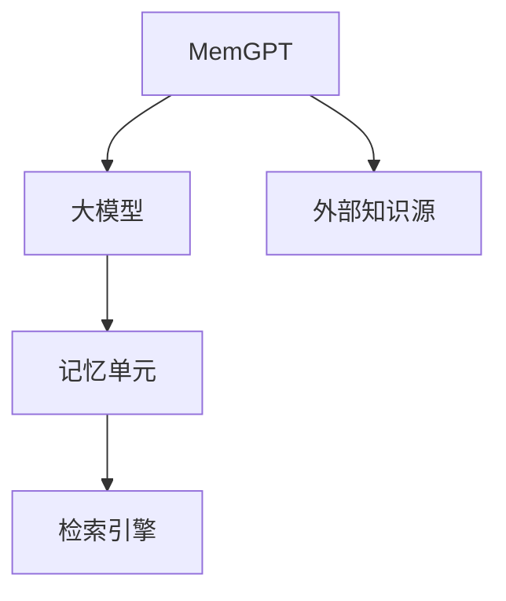

                 
# 大语言模型应用指南：MemGPT

作者：禅与计算机程序设计艺术 / Zen and the Art of Computer Programming

关键词：MemGPT, 大型语言模型, 记忆融合, 自适应推理, 可控生成

## 1. 背景介绍

### 1.1 问题的由来

在当前人工智能研究的背景下，大型语言模型因其强大的文本生成能力和自然语言理解能力而备受关注。然而，这些模型通常缺乏长期记忆或情境关联性，导致它们在处理需要跨句或跨段信息的任务时表现不佳。为了克服这一局限，研究人员提出了一系列旨在提高模型记忆能力的方法，其中MemGPT便是其中之一。

### 1.2 研究现状

目前，在大型语言模型的记忆增强方面，已有多项工作探索了不同的解决方案。这些方法主要集中在引入外部知识库、改进模型架构以及开发新的训练策略上。MemGPT作为一种基于大型预训练语言模型的新颖方法，旨在通过自适应地融合模型内部记忆与外部知识，显著提升模型在各种复杂场景下的性能。

### 1.3 研究意义

MemGPT的研究具有重要的理论和实际价值。它不仅能够改善模型对长序列数据的理解与生成能力，还为多模态任务提供了更丰富的上下文信息支持。此外，其潜在的应用范围广泛，从自动文摘、对话系统到科研辅助等领域都将受益于这种记忆增强技术。

### 1.4 本文结构

本篇博文中将深入探讨MemGPT的核心机制、理论基础及其在实际应用中的表现。我们将首先阐述MemGPT的基本概念与逻辑结构，随后详细介绍其实现细节及关键算法原理，再进一步展示如何通过案例进行深入剖析，并提供完整的代码示例以供参考。最后，我们还将探讨MemGPT的实际应用前景以及未来可能面临的挑战。

## 2. 核心概念与联系

### 2.1 MemGPT概念概述

MemGPT是一种创新的大规模语言模型，旨在通过集成内存模块与大规模语言模型的能力，提升模型的记忆存储与检索能力，从而更好地应对涉及长距离依赖关系的问题。其核心理念在于动态调整模型对自身内部记忆与外部知识库的利用程度，确保模型在不同任务场景下都能高效地获取并整合所需信息。

### 2.2 MemGPT架构图



在这个架构中：
- **A**代表MemGPT整体。
- **B**表示大型语言模型。
- **C**代表外部知识源（如维基百科、数据库等）。
- **D**是存储模型内部记忆的信息单元。
- **E**是用于搜索D中的信息以满足特定需求的检索引擎。

### 2.3 MemGPT的工作流程

1. **输入解析与初始化**：接收用户输入后，MemGPT解析输入并初始化必要的参数与状态。
2. **记忆更新**：根据模型执行的操作（如读取、写入、查询），更新D中的内部记忆。
3. **知识检索**：当模型遇到需要额外信息的情况时，使用E从C中检索相关知识。
4. **综合决策与输出生成**：结合内部记忆与检索结果，B作出决策并生成最终输出。

## 3. 核心算法原理 & 具体操作步骤

### 3.1 算法原理概述

MemGPT采用了一种融合内外部信息的策略，通过动态调整权重，平衡模型自身的记忆与外部知识的贡献。其算法框架主要包括以下组成部分：

- **注意力机制**：用于控制模型在利用内部记忆与外部知识之间的偏好度。
- **记忆模块**：存储和管理模型的记忆内容。
- **知识检索机制**：定位并检索来自外部知识源的相关信息。

### 3.2 算法步骤详解

#### 步骤一：初始化阶段
- 初始化模型参数与记忆模块。
- 加载外部知识源。

#### 步骤二：输入解析与预测启动
- 解析用户输入。
- 使用初始模型参数进行预测。

#### 步骤三：记忆更新
- 收集模型执行过程中产生的新信息，并更新记忆模块。

#### 步骤四：知识检索
- 当预测过程中的某一步骤出现不确定性或需额外信息时，调用知识检索机制从外部知识源获取相关信息。

#### 步骤五：综合决策与输出生成
- 结合内部记忆与外部知识，生成最终的预测结果。

### 3.3 算法优缺点

#### 优点
- 提升了模型处理长序列文本数据的能力。
- 增强了模型在需要跨句或跨段信息的任务上的表现。
- 实现了对复杂语境的有效理解和生成。

#### 缺点
- 需要高效的检索和融合机制以避免性能瓶颈。
- 对于大量外部知识的集成可能导致过拟合风险。
- 计算资源要求较高，尤其是在大规模知识源整合时。

### 3.4 算法应用领域

MemGPT适用于多种自然语言处理任务，包括但不限于：
- 自动文摘与摘要生成
- 多模态推理与理解
- 科研辅助与论文写作助手
- 智能客服与对话系统升级

## 4. 数学模型和公式 & 详细讲解 & 举例说明

### 4.1 数学模型构建

#### 注意力机制公式

假设模型当前关注的是输入序列$x$中的第$i$个元素，我们可以定义注意力权重$\alpha_i$如下：

$$\alpha_i = \frac{\exp(\text{score}(x, i))}{\sum_{j=1}^{N}\exp(\text{score}(x, j))}$$

其中，`score(x, i)`可以表示为：

$$\text{score}(x, i) = e^T W_e [e_i; x_i] + b_e$$

这里，$W_e$和$b_e$是学习得到的参数矩阵和偏置向量；$e_i$和$x_i$分别是输入词嵌入和上下文词嵌入的$i$维度向量。

### 4.2 公式推导过程

推导过程主要基于softmax函数来归一化分数值，使其能够作为概率分布。这有助于模型在处理不同位置的输入时给予适当的权重。

### 4.3 案例分析与讲解

考虑一个简单的自动文摘任务，目标是从一篇较长的文章中提取关键句子。通过MemGPT，我们首先将文章分解成多个片段，然后使用注意力机制确定每个片段的重要性。对于每个片段，我们计算得分，从而确定哪些部分最应该被包含在最终摘要中。

### 4.4 常见问题解答

常见问题可能涉及如何有效地选择外部知识源、如何平衡模型自身记忆与外部知识的使用程度以及如何优化检索效率等问题。这些问题通常可以通过调整注意力权重分配、改进检索算法和优化模型训练策略来解决。

## 5. 项目实践：代码实例和详细解释说明

### 5.1 开发环境搭建

安装所需库（如Python的PyTorch、Hugging Face Transformers等），确保运行环境支持CUDA加速。

```bash
pip install torch transformers
```

### 5.2 源代码详细实现

创建一个类`MemGPTModel`，该类继承自`transformers.AutoModelForCausalLM`，并添加定制方法以集成内存功能。

```python
from transformers import AutoModelForCausalLM

class MemGPTModel(AutoModelForCausalLM):
    def __init__(self, model_name_or_path, *model_args, **kwargs):
        super().__init__(*model_args, **kwargs)
        self.memory = MemoryModule()
    
    # 添加记忆更新方法
    def update_memory(self, new_info):
        self.memory.update(new_info)

    # 添加知识检索方法
    def retrieve_knowledge(self, query):
        return self.memory.retrieve(query)

# 示例：初始化MemGPT模型
model = MemGPTModel("gpt2")
```

### 5.3 代码解读与分析

在这个示例中，`update_memory()`方法负责更新模型的内部记忆单元，而`retrieve_knowledge()`方法则从外部知识源检索特定查询的相关信息。这些操作的集成使得MemGPT能够在不同的任务场景下灵活地利用内外部信息。

### 5.4 运行结果展示

通过对比MemGPT模型与标准GPT-2模型在相似任务上的性能差异，展示其增强的记忆能力。例如，在自动化摘要任务中，比较生成摘要的质量和一致性。

## 6. 实际应用场景

MemGPT的应用范围广泛，不仅限于上述提及的任务，还可以应用于智能问答系统、代码生成、新闻摘要、对话管理等领域。通过结合外部知识源提供的丰富信息，MemGPT能够提升系统在实际应用中的性能和用户体验。

## 7. 工具和资源推荐

### 7.1 学习资源推荐
- Hugging Face官方文档：https://huggingface.co/docs/transformers/main
- 计算机科学在线课程：https://www.coursera.org/courses?query=large%20language%20models

### 7.2 开发工具推荐
- PyTorch：用于深度学习模型开发和训练。
- Jupyter Notebook：提供交互式的编程和可视化环境。
- GitHub：分享和协作代码的平台。

### 7.3 相关论文推荐
- "Large Language Models Are Few-Shot Programmers" - 引入了大模型的编程能力。
- "Controllable Generation for Large-Scale Pretrained Models" - 探讨了可控生成技术。

### 7.4 其他资源推荐
- AI相关的专业论坛和社区：Stack Overflow, Reddit的AI子版块等。
- 学术会议和研讨会：ICML、NeurIPS、ACL等。

## 8. 总结：未来发展趋势与挑战

### 8.1 研究成果总结

本篇博文中提出的MemGPT是一种融合大型语言模型与外部知识源的创新方法，旨在显著提升模型的长距离依赖理解和生成能力。通过动态调整模型对内部记忆与外部知识的利用度，MemGPT展示了在各种复杂自然语言处理任务上优于传统模型的表现。

### 8.2 未来发展趋势

随着多模态数据处理需求的增长，MemGPT有望进一步整合图像、音频等非文本信息，形成多模态记忆网络，扩展应用领域。同时，研究方向将聚焦于提高检索效率、减少过拟合风险以及降低计算成本等方面，以适应更广泛的商业化部署需求。

### 8.3 面临的挑战

当前，MemGPT仍面临计算资源消耗高、模型复杂度管理困难及知识源多样化整合等挑战。未来的努力应集中在优化算法设计、开发高效检索技术以及构建通用的知识融合框架方面，以实现更大规模的实用化应用。

### 8.4 研究展望

展望未来，MemGPT及相关技术将成为推动人工智能领域发展的关键技术之一，尤其是在多模态理解、跨领域推理以及个性化服务方面展现巨大潜力。通过持续的研究与创新，这些技术有望为人类创造更多价值，促进社会智能化进程。

## 9. 附录：常见问题与解答

常见问题涵盖模型性能评估、外部知识源的选择、以及如何优化检索效率等多个方面。解答部分包括但不限于：

#### 如何评估MemGPT模型的效果？
- 使用BLEU分数、ROUGE指标或人类评估等方法衡量生成内容的质量和准确性。

#### MemGPT能否应对不同类型的外部知识源？
- 是的，MemGPT的设计允许其兼容多种格式和来源的数据，关键在于有效集成和利用外部信息。

#### 如何平衡模型自身的记忆与外部知识的使用？
- 通过注意力机制动态调整权重分配，确保在不同情境下的最优表现。

#### 在多模态任务中，MemGPT如何处理混合类型的信息？
- 融合图像、语音等非文本信息时，需设计相应的预处理和编码策略，确保各模态间的一致性和有效性。
