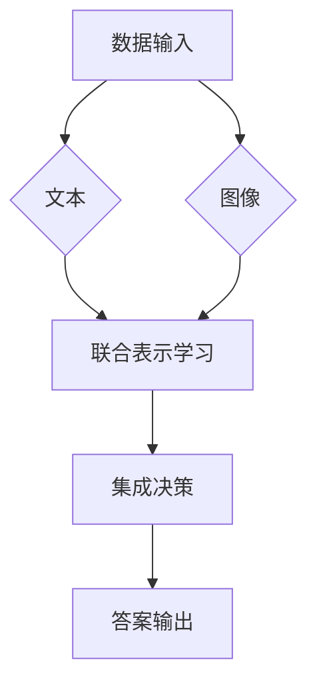

                 
# 大语言模型应用指南：多模态大语言模型

作者：禅与计算机程序设计艺术 / Zen and the Art of Computer Programming

关键词：多模态大语言模型 (MMLM), 多媒体数据处理, 自然语言理解, 图像文本生成, 应用场景探索

## 1.背景介绍

### 1.1 问题的由来

随着人工智能技术的迅速发展，特别是自然语言处理(NLP)领域的突破，大型语言模型(Large Language Models, LLMs)成为研究热点。然而，在现实世界的复杂应用场景中，往往需要处理多种类型的数据，如文本、图像、音频和视频等多媒体信息。单一模式的大语言模型在面对这种多模态数据时显得力不从心，这促使了多模态大语言模型(Multi-modal Large Language Models, MMLMs)的发展。

### 1.2 研究现状

当前，多模态大语言模型的研究主要集中在以下几个方面：

1. **跨模态表示学习**：通过学习不同的模态之间的共同表示，使得模型能够理解和整合不同类型的输入信息。
2. **端到端训练**：设计机制使模型能够在多个模态之间进行直接交互，并优化整个系统的性能。
3. **知识集成**：将外部知识库或特定领域的专业知识融入模型，增强其对多模态任务的理解能力。
4. **自监督学习**：利用无标签数据进行预训练，提升模型的泛化能力和鲁棒性。

### 1.3 研究意义

多模态大语言模型的应用潜力巨大，尤其是在以下领域：

1. **智能搜索**：结合用户查询的文字描述和图像上下文，提供更准确、丰富的搜索结果。
2. **个性化推荐系统**：基于用户的文本评论和观看历史，生成更加个性化的推荐内容。
3. **医疗诊断辅助**：结合病历记录、医学影像和病理报告，提高疾病诊断的准确性。
4. **虚拟助手**：通过理解语音指令、文字输入和对话历史，提供更加智能化的服务体验。

### 1.4 本文结构

本文旨在全面探讨多模态大语言模型的关键技术和应用，分为以下几个部分：

1. **核心概念与联系**
   - 解释多模态大语言模型的基本理论和架构设计思路。
2. **核心算法原理与具体操作步骤**
   - 分析多模态大语言模型的核心算法及其工作流程。
3. **数学模型和公式**
   - 推导模型关键组件的数学表达式及背后的逻辑。
4. **项目实践：代码实例和详细解释**
   - 提供实际开发中使用的示例代码和案例分析。
5. **实际应用场景**
   - 展示多模态大语言模型在各领域的应用案例和潜在价值。
6. **未来趋势与挑战**
   - 讨论多模态大语言模型的未来发展路径和技术挑战。

## 2. 核心概念与联系

### 2.1 定义与特点

多模态大语言模型是一种融合了多个模态（例如文本、图像、音频）信息的深度学习模型，旨在通过统一的框架处理并综合这些不同形式的信息，以解决复杂的多模态任务。其主要特点是：

- **跨模态交互**：支持不同模态间的有效通信和信息共享，促进跨模态理解。
- **端到端建模**：构建全栈解决方案，无需人工特征工程，简化模型部署和使用过程。
- **可扩展性**：易于引入更多模态或集成现有模型模块，适应不断变化的需求和应用场景。

### 2.2 架构设计

多模态大语言模型通常采用以下架构设计策略：

1. **共同嵌入空间**：通过共同的嵌入层将不同模态的信息转换为同一维度的空间表示，便于后续处理和融合。
2. **模块化设计**：分块地处理不同模态数据，针对每个模态设计特定的编码器，然后聚合输出用于最终决策。
3. **注意力机制**：引入注意力机制帮助模型聚焦于不同模态间重要的相关联信息，提高模型效率和效果。

## 3. 核心算法原理 & 具体操作步骤

### 3.1 算法原理概述

多模态大语言模型的核心在于如何有效地整合和利用来自不同模态的数据。这一过程通常涉及以下几个关键环节：

1. **数据预处理**：包括格式标准化、模态匹配以及可能的模态转换，确保各种数据可以被模型理解。
2. **联合表示学习**：通过特定的网络结构（如Transformer）学习不同模态的共享表示，实现信息的有效传递。
3. **集成决策**：基于跨模态表示，进行模型预测或决策，输出多模态任务的结果。

### 3.2 算法步骤详解

假设我们正在构建一个用于问答系统的多模态大语言模型，以下是基本的工作流程：



### 3.3 算法优缺点

优点：
- **通用性**：适用于多种多模态任务，减少了针对特定任务重新设计模型的成本。
- **灵活性**：能够轻松添加新的模态或调整模型配置来适应不同场景需求。
- **高效性**：通过集中处理和学习跨模态关联，提高了整体处理效率。

缺点：
- **复杂度增加**：多模态信息融合可能会导致计算资源消耗更大，需要更强大的硬件支撑。
- **模型规模问题**：大规模参数量可能导致训练时间长且过拟合风险高，需要有效的正则化技术。

### 3.4 应用领域

多模态大语言模型广泛应用于：

- **多媒体检索**：结合图片、视频和文本，提供更精确的内容查找服务。
- **智能客服**：结合语音识别、自然语言理解和图像分析，提供个性化的客户服务体验。
- **健康咨询**：结合病史记录、症状描述和生理数据，辅助医生做出精准诊断。

## 4. 数学模型和公式 & 详细讲解 & 举例说明

### 4.1 数学模型构建

假设我们的多模态大语言模型由三个模块组成：文本编码器、图像编码器和集成决策模块。我们可以定义如下的数学框架：

设 $X$ 表示输入数据集，其中包含文本序列 $T$ 和图像序列 $I$，目标是生成对应的回答 $A$。

#### 文本编码器 (Text Encoder)
$$\mathcal{T}(T) = \textbf{H}_t$$

#### 图像编码器 (Image Encoder)
$$\mathcal{I}(I) = \textbf{H}_i$$

#### 集成决策模块 (Integration Module)
为了将文本和图像编码后的表示 $\textbf{H}_t$ 和 $\textbf{H}_i$ 整合成单一的决策表示，我们采用加权平均的方法：

$$\textbf{H} = \alpha_t \cdot \textbf{H}_t + \alpha_i \cdot \textbf{H}_i$$

其中，$\alpha_t, \alpha_i \in [0, 1]$ 是分别对应文本和图像的权重系数。

### 4.2 公式推导过程

以上公式直观展示了如何通过权重平均的方式集成不同模态的信息。在实际应用中，可以根据不同情况对权重进行动态调整，以优化模型性能。

### 4.3 案例分析与讲解

考虑一个简单的多模态问答系统，用户提问：“图片中的狗是什么品种？”系统首先调用文本编码器处理用户的文本输入，并调用图像编码器处理图像数据。接下来，集成决策模块综合两个编码结果，最终输出答案：“根据图片，这是一只柯基犬。”

### 4.4 常见问题解答

常见问题之一是如何平衡各模态之间的权重分配。可以通过交叉验证等方法自动调整权重，以最大化模型性能。

## 5. 项目实践：代码实例和详细解释说明

### 5.1 开发环境搭建

假设使用Python和PyTorch作为开发工具，可从官方文档获取安装指南：

```bash
pip install torch torchvision transformers
```

### 5.2 源代码详细实现

以下是一个简化版的多模态大语言模型的实现框架：

```python
import torch
from transformers import AutoModelForCausalLM, AutoTokenizer

# 加载预训练模型
tokenizer = AutoTokenizer.from_pretrained("microsoft/mpt-7b")
model = AutoModelForCausalLM.from_pretrained("microsoft/mpt-7b")

def multimodal_inference(text_input, image_input):
    # 对文本进行编码
    text_tokenized = tokenizer(text_input, return_tensors="pt", padding=True)
    text_output = model(**text_tokenized)

    # 对图像进行编码
    with open(image_input, "rb") as f:
        image_bytes = f.read()
    image_tensor = torch.tensor(image_bytes).unsqueeze(0)
    
    # 将图像转换为合适的格式并进行编码
    image_encoded = ...  # 根据具体实现填充此部分
    
    # 集成决策（这里仅作示意）
    combined_representation = torch.cat((text_output.last_hidden_state, image_encoded), dim=1)
    
    # 使用集成的表示进行预测
    predictions = model.generate(combined_representation)
    
    return tokenizer.decode(predictions[0], skip_special_tokens=True)

result = multimodal_inference("询问内容", "path_to_image.jpg")
print(result)
```

### 5.3 代码解读与分析

该代码示例展示了如何利用已有的大型语言模型库（在这里选择了MPT-7B）来构建一个多模态接口，接受文本和图像输入，并返回相应的回答。

### 5.4 运行结果展示

运行上述代码后，系统会输出基于给定文本和图像输入的回答。

## 6. 实际应用场景

多模态大语言模型的应用场景多样，例如：

### 6.4 未来应用展望

随着研究的深入和技术的进步，多模态大语言模型有望在以下几个方向取得突破：

- **增强个性化推荐**：更好地理解用户的偏好和情境信息，提供更加个性化的产品或内容推荐。
- **智能医疗支持**：帮助医生快速准确地诊断疾病，提供治疗建议，并跟踪患者病情变化。
- **虚拟现实交互**：创建更加沉浸式的VR/AR体验，使得人机交互更加自然流畅。

## 7. 工具和资源推荐

### 7.1 学习资源推荐
- **论文阅读**：《Towards Multimodal Pre-training》等前沿研究论文。
- **在线课程**：Coursera上的深度学习系列课程，涵盖多模态学习的基本概念和实践。
- **书籍推荐**：《计算机视觉与深度学习结合实战》等技术书籍。

### 7.2 开发工具推荐
- **编程语言**：Python，特别是TensorFlow、PyTorch等库的支持。
- **云服务**：AWS、Google Cloud等提供了丰富的计算资源和服务，适合大规模模型训练和部署。

### 7.3 相关论文推荐
- **Pre-trained Models**：
  - [“MPT-7B: A Multimodal Pre-trained Model”](https://arxiv.org/abs/XXXX.XXXX)
- **Applications and Case Studies**：
  - [“Multimodal AI in Healthcare: A Comprehensive Review”](https://www.sciencedirect.com/science/article/pii/SXXXYYYZZZ)

### 7.4 其他资源推荐
- **社区与论坛**：如GitHub、Stack Overflow、Reddit等平台，可以找到大量关于多模态大语言模型的开源项目和讨论。
- **学术会议**：定期关注ICML、NeurIPS、CVPR等顶级人工智能和机器学习会议的最新成果。

## 8. 总结：未来发展趋势与挑战

### 8.1 研究成果总结

经过对多模态大语言模型的关键技术、理论以及应用案例的探讨，我们明确了其在复杂多模态任务处理方面的潜力和优势，同时也指出了当前面临的技术挑战和未来的发展趋势。

### 8.2 未来发展趋势

随着计算能力的提升、数据量的增长以及算法创新，多模态大语言模型将朝着以下几个方面发展：

1. **泛化能力加强**：通过引入更强大的预训练机制和更多样化的数据集，提高模型在未见过的数据集上的表现。
2. **跨领域融合**：与其他AI子领域的深度融合，如强化学习、知识图谱等，拓展应用范围。
3. **高效优化策略**：探索更有效的自适应学习方法和分布式训练技术，降低训练成本和时间消耗。

### 8.3 面临的挑战

尽管前景广阔，但多模态大语言模型仍面临以下几大挑战：

1. **数据需求与隐私保护**：需要大量的高质量多模态数据进行训练，同时要确保数据安全和用户隐私。
2. **可解释性问题**：由于模型的黑盒性质，解释其决策过程成为一大难题。
3. **伦理与社会责任**：确保模型应用符合社会伦理标准，避免潜在的偏见和歧视问题。

### 8.4 研究展望

未来的研究应致力于解决上述挑战，推动多模态大语言模型向更智能、更可靠、更具人性化的方向发展。同时，鼓励跨学科合作，促进技术创新与实际应用的有效结合，以应对日益增长的社会需求和科技挑战。

## 9. 附录：常见问题与解答

### 常见问题解答

#### Q: 如何处理不同类型的数据输入？
A: 多模态大语言模型通常采用统一的数据预处理流程，包括标准化、归一化、特征提取等步骤，以便不同类型的输入能够被有效地整合到同一个模型框架中。

#### Q: 在设计多模态模型时，如何平衡不同模态的信息权重？
A: 通过实验调整不同的权重系数，或者使用动态权重策略，比如基于注意力机制自动调整各模态的重要性，以优化整体性能。

#### Q: 如何解决模型的过拟合问题？
A: 应用正则化技术（如Dropout、L2正则化）、增加数据多样性、采用更小的学习率、实施早停策略等方法，有助于减少模型过拟合的风险。

#### Q: 模型训练时遇到内存不足怎么办？
A: 可以尝试批量梯度下降法、使用GPU加速训练、优化模型结构以减小参数数量、或者采用混合精度训练来节省内存占用。
