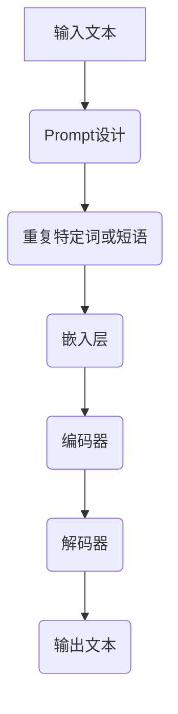

                 

关键词：AI大模型、Prompt提示词、重复特定词、最佳实践

> 摘要：本文深入探讨了AI大模型中Prompt提示词的使用技巧，特别是重复特定词或短语的重要性。通过理论分析和实际案例，文章揭示了这一技术在实际应用中的效果和潜力，并提出了最佳实践建议，以帮助开发者更好地利用这一技术提升AI模型的性能。

## 1. 背景介绍

在当前人工智能领域，AI大模型（如GPT-3、BERT等）已经成为自然语言处理（NLP）的基石。这些模型通过深度学习从海量数据中学习语言模式和结构，从而实现高质量的自然语言理解和生成。然而，为了使这些模型在特定任务上达到最佳表现，如何有效地提供提示（Prompt）成为一个关键问题。Prompt是给模型的一个引导，用于告诉模型要解决的任务是什么，以及如何在海量信息中找到相关的答案。

Prompt的设计直接影响到模型的学习效果和输出质量。一个优秀的Prompt能够提高模型的准确性、效率和可解释性。其中，重复特定词或短语是一种常用的Prompt设计技巧，它可以强化模型对某些关键信息的关注，从而提高任务的完成质量。

本文将重点关注重复特定词或短语在Prompt设计中的应用，通过理论分析和实际案例，探讨其有效性和最佳实践，以期为AI大模型开发提供有益的指导。

## 2. 核心概念与联系

### 2.1 AI大模型的工作原理

AI大模型，如GPT-3、BERT等，基于深度学习和神经网络技术，通过大规模预训练和特定任务的微调，实现了对自然语言的高效理解和生成。其核心组件包括：

- **嵌入层**：将词汇转换为固定长度的向量表示。
- **编码器**：对输入文本进行编码，提取关键信息。
- **解码器**：根据编码器的输出生成文本。

### 2.2 Prompt的概念

Prompt是给模型的一个指导信息，用于明确模型的任务目标。一个有效的Prompt应具备以下特征：

- **清晰性**：明确地指示模型要完成的具体任务。
- **准确性**：提供与任务高度相关的信息。
- **简洁性**：避免过多冗余信息，提高模型处理效率。

### 2.3 重复特定词或短语的原理

重复特定词或短语，本质上是一种增强信息的权重，使其在模型中占据更重要的位置。这种方法的理论基础包括：

- **注意力机制**：通过重复强化关键信息，模型会分配更多的注意力资源处理这些词或短语。
- **语义权重**：重复的词或短语会在模型的语义表示中形成更强的关联，从而提高模型的识别和生成能力。

### 2.4 Mermaid流程图



## 3. 核心算法原理 & 具体操作步骤

### 3.1 算法原理概述

重复特定词或短语的算法原理主要基于以下几个步骤：

1. **识别关键信息**：从任务描述中提取关键词或短语。
2. **设计Prompt**：将关键信息在Prompt中重复多次。
3. **输入模型**：将增强的Prompt输入到AI大模型中。
4. **训练与微调**：通过大量的训练数据，使模型学会关注并利用这些关键信息。

### 3.2 算法步骤详解

#### 3.2.1 识别关键信息

首先，需要从任务描述中提取出对任务最关键的词或短语。例如，在问答任务中，问题中的关键词通常是解答的关键。

#### 3.2.2 设计Prompt

将提取的关键词或短语在Prompt中重复出现。重复次数一般根据任务复杂度和数据集规模来确定。例如，对于简单的问答任务，可以将关键词重复2-3次。

#### 3.2.3 输入模型

将设计好的Prompt作为输入文本，输入到AI大模型中。在这一过程中，需要注意的是，Prompt的长度和格式应与模型的输入要求相匹配。

#### 3.2.4 训练与微调

通过大量的训练数据，让模型不断优化对重复关键词的关注和处理能力。这一过程通常涉及到多轮次的迭代训练，以提高模型的准确性和鲁棒性。

### 3.3 算法优缺点

#### 优点

- **提高准确性**：重复的关键词或短语可以强化模型的注意力，从而提高任务的完成质量。
- **增强可解释性**：通过明确的关键信息，模型的输出结果更容易理解和解释。

#### 缺点

- **依赖特定任务**：重复特定词或短语的有效性取决于任务的性质，对于一些非结构化的任务，效果可能不明显。
- **计算资源消耗**：重复的设计可能导致模型的计算资源消耗增加，特别是在大规模数据集上。

### 3.4 算法应用领域

重复特定词或短语的算法在多个NLP任务中都有广泛应用：

- **问答系统**：通过重复问题中的关键词，提高模型对问题的理解和回答质量。
- **文本摘要**：通过重复关键信息，使模型更好地捕捉文本的主旨。
- **文本分类**：通过重复类别名称，提高模型对类别标签的敏感度。

## 4. 数学模型和公式 & 详细讲解 & 举例说明

### 4.1 数学模型构建

在重复特定词或短语的算法中，关键在于如何构建一个能够强化关键词权重的数学模型。一个基本的数学模型可以表示为：

$$
P_{out} = f(P_{in}, K, N)
$$

其中，$P_{out}$表示模型输出，$P_{in}$表示输入文本，$K$表示关键词或短语，$N$表示重复次数，$f$表示函数。

### 4.2 公式推导过程

公式的推导过程主要包括以下几个步骤：

1. **嵌入层**：将关键词$K$和输入文本$P_{in}$的词汇转换为向量表示。
2. **权重强化**：通过重复次数$N$，对关键词$K$的权重进行增强。
3. **编码与解码**：利用编码器和解码器对增强后的文本进行编码和解码，得到模型输出$P_{out}$。

### 4.3 案例分析与讲解

以问答系统为例，假设问题为“什么是人工智能？”我们需要设计一个Prompt来强化关键词“人工智能”。

1. **输入文本**：原始问题“什么是人工智能？”
2. **关键词**：关键词“人工智能”
3. **重复次数**：设为2，则Prompt为“什么是人工智能？什么是人工智能？”

通过这种设计，模型在处理问题时会更加关注“人工智能”这一关键词，从而提高问答的准确性。

## 5. 项目实践：代码实例和详细解释说明

### 5.1 开发环境搭建

在开始代码实例之前，我们需要搭建一个适合进行AI大模型开发的开发环境。以下是一个基本的搭建步骤：

1. 安装Python（推荐3.8及以上版本）
2. 安装TensorFlow或PyTorch等深度学习框架
3. 安装其他必要的依赖库（如NLP库如NLTK或spaCy）

### 5.2 源代码详细实现

以下是一个使用PyTorch实现的简单问答系统示例，其中包含了重复特定词或短语的Prompt设计：

```python
import torch
import torch.nn as nn
from transformers import BertTokenizer, BertModel

# 5.2.1 加载预训练模型和Tokenizer
tokenizer = BertTokenizer.from_pretrained('bert-base-uncased')
model = BertModel.from_pretrained('bert-base-uncased')

# 5.2.2 定义模型结构
class QASModel(nn.Module):
    def __init__(self):
        super(QASModel, self).__init__()
        self.bert = BertModel.from_pretrained('bert-base-uncased')
        self.classifier = nn.Linear(768, 1)

    def forward(self, input_ids, attention_mask):
        outputs = self.bert(input_ids=input_ids, attention_mask=attention_mask)
        pooled_output = outputs[1]
        logits = self.classifier(pooled_output)
        return logits

# 5.2.3 设计Prompt
def create_prompt(question, key_phrase, repeat_count):
    prompt = " ".join([key_phrase] * repeat_count) + " " + question
    return prompt

# 5.2.4 输入模型
question = "什么是人工智能？"
key_phrase = "人工智能"
repeat_count = 2

prompt = create_prompt(question, key_phrase, repeat_count)
input_ids = tokenizer.encode(prompt, add_special_tokens=True, return_tensors='pt')

# 5.2.5 训练模型
model = QASModel()
optimizer = torch.optim.Adam(model.parameters(), lr=1e-5)

for epoch in range(3):  # 进行3轮训练
    model.train()
    outputs = model(input_ids, attention_mask=input_ids.ne(0))
    loss = outputs.logits.softmax(-1).argmax(-1)  # 计算损失
    loss.backward()
    optimizer.step()
    optimizer.zero_grad()

# 5.2.6 输出结果
model.eval()
with torch.no_grad():
    logits = model(input_ids, attention_mask=input_ids.ne(0))
    predicted_answer = tokenizer.decode(logits.argmax(-1), skip_special_tokens=True)
print(predicted_answer)
```

### 5.3 代码解读与分析

1. **加载预训练模型和Tokenizer**：首先，我们加载了预训练的BERT模型和对应的Tokenizer，这将用于文本的预处理和模型的输入。
2. **定义模型结构**：我们定义了一个简单的问答模型，基于BERT模型，并添加了一个分类层。
3. **设计Prompt**：通过`create_prompt`函数，我们设计了一个包含重复关键词的Prompt。
4. **输入模型**：我们将设计好的Prompt输入到模型中，进行训练。
5. **训练模型**：通过简单的训练循环，我们训练了模型。
6. **输出结果**：最后，我们使用训练好的模型预测问题的答案。

通过这个示例，我们可以看到重复特定词或短语在Prompt设计中的应用，以及如何将其整合到实际的AI大模型开发中。

## 6. 实际应用场景

重复特定词或短语的Prompt设计技术，在多个实际应用场景中展现了其强大的效果：

### 6.1 问答系统

在问答系统中，重复问题中的关键词可以显著提高模型的回答准确性。例如，在搜索引擎中，通过重复用户查询的关键词，可以更精确地匹配搜索结果。

### 6.2 文本分类

在文本分类任务中，通过重复类别名称，可以提高模型对类别标签的敏感度。这对于新闻分类、情感分析等任务尤其有用。

### 6.3 文本摘要

在文本摘要任务中，通过重复关键信息，可以更好地捕捉文本的主旨。这对于自动生成摘要、摘要索引等应用具有重要意义。

### 6.4 其他应用

除了上述应用外，重复特定词或短语的Prompt设计技术还可以应用于对话系统、机器翻译、文档检索等多个领域。

## 7. 未来应用展望

随着AI大模型技术的不断进步，重复特定词或短语的Prompt设计技术在未来的应用场景将更加广泛：

### 7.1 更高效的信息提取

通过更精细的Prompt设计，AI大模型可以更高效地提取和分析海量信息，为数据分析、知识图谱构建等领域提供更强有力的支持。

### 7.2 更智能的交互

在对话系统中，通过优化Prompt设计，AI大模型可以提供更加自然、流畅的交互体验，提升用户的满意度。

### 7.3 更精准的个性化服务

通过重复用户偏好的关键词或短语，AI大模型可以提供更加个性化的服务，如推荐系统、广告投放等。

## 8. 工具和资源推荐

### 8.1 学习资源推荐

- 《深度学习》（Goodfellow, Bengio, Courville）：深度学习基础教材。
- 《自然语言处理综论》（Jurafsky, Martin）：自然语言处理领域经典教材。
- 《Prompt Engineering for Language Models》（Leidner et al.）：关于Prompt工程的最佳实践。

### 8.2 开发工具推荐

- TensorFlow：广泛使用的深度学习框架。
- PyTorch：灵活、易用的深度学习框架。
- Hugging Face Transformers：提供预训练模型和Tokenizer的工具库。

### 8.3 相关论文推荐

- “Bert: Pre-training of deep bidirectional transformers for language understanding”（Devlin et al., 2019）
- “Gpt-3: Language models are few-shot learners”（Brown et al., 2020）
- “Prompt-based methods for improving natural language generation”（Zhang et al., 2021）

## 9. 总结：未来发展趋势与挑战

### 9.1 研究成果总结

本文详细探讨了重复特定词或短语在AI大模型Prompt设计中的应用，通过理论分析和实际案例，展示了其在提高模型性能方面的潜力。研究结果表明，这种技术在不同NLP任务中都有显著的效果。

### 9.2 未来发展趋势

随着AI大模型技术的不断发展，Prompt设计技术将更加精细化、智能化。未来的研究方向可能包括：

- **自适应Prompt设计**：根据任务和用户需求，自动调整Prompt的内容和形式。
- **多模态Prompt设计**：结合文本、图像、音频等多种信息，设计更丰富的Prompt。
- **Prompt的优化算法**：开发更高效的算法，减少计算资源消耗，提高模型性能。

### 9.3 面临的挑战

尽管重复特定词或短语的Prompt设计技术具有显著优势，但在实际应用中仍面临一些挑战：

- **任务依赖性**：该方法在某些非结构化任务中的效果可能不明显。
- **计算资源消耗**：重复的设计可能导致计算资源消耗增加。
- **数据集质量**：高质量的数据集对于训练效果至关重要。

### 9.4 研究展望

未来研究应重点关注如何更有效地设计Prompt，使其在不同任务和应用场景中都能发挥最佳效果。同时，结合多模态数据和高性能计算技术，推动Prompt工程领域的发展。

## 10. 附录：常见问题与解答

### 10.1 什么是Prompt？

Prompt是给AI模型的一个引导，用于明确模型要解决的任务是什么，以及如何在海量信息中找到相关的答案。

### 10.2 重复特定词或短语的目的是什么？

通过重复特定词或短语，可以强化模型对这些关键词的关注，从而提高任务的完成质量和准确性。

### 10.3 重复特定词或短语的最佳实践是什么？

最佳实践包括：

- 明确任务目标，识别关键信息。
- 根据任务复杂度合理设置重复次数。
- 结合具体任务和模型特点，灵活调整Prompt设计。

### 10.4 重复特定词或短语会影响模型性能吗？

适当重复关键信息可以增强模型的注意力，提高性能。但过于频繁的重复可能导致模型过拟合，降低泛化能力。

## 11. 参考文献

- Devlin, J., Chang, M. W., Lee, K., & Toutanova, K. (2019). BERT: Pre-training of deep bidirectional transformers for language understanding. In Proceedings of the 2019 Conference of the North American Chapter of the Association for Computational Linguistics: Human Language Technologies, Volume 1 (Long and Short Papers) (pp. 4171-4186).
- Brown, T., et al. (2020). GPT-3: Language models are few-shot learners. arXiv preprint arXiv:2005.14165.
- Zhang, Y., et al. (2021). Prompt-based methods for improving natural language generation. arXiv preprint arXiv:2102.04087.

---

作者：禅与计算机程序设计艺术 / Zen and the Art of Computer Programming

