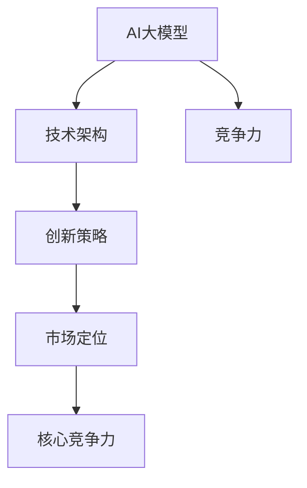

                 

关键词：AI大模型、核心竞争力、创业公司、技术架构、创新策略、市场定位

> 摘要：本文探讨了AI大模型创业公司如何通过构建独特的技术架构、实施有效的创新策略和精准的市场定位来打造核心竞争力。文章旨在为初创公司提供实用的指导和建议，帮助它们在竞争激烈的市场中脱颖而出。

## 1. 背景介绍

随着人工智能技术的不断进步，大模型（如GPT-3、BERT等）在自然语言处理、图像识别、机器学习等领域取得了显著的成果。大模型的强大性能和广泛应用激发了市场对AI技术的需求，也为创业公司提供了前所未有的机会。然而，面对激烈的市场竞争和不断变化的技术环境，AI大模型创业公司如何打造核心竞争力，实现可持续发展，成为了一项紧迫的任务。

本文将围绕以下核心问题展开讨论：
- AI大模型创业公司如何构建独特的技术架构？
- 创业公司应如何实施创新策略以保持竞争力？
- 如何通过市场定位来抓住目标用户群体？
- 创业公司如何应对技术和市场的挑战？

## 2. 核心概念与联系

在探讨AI大模型创业公司如何打造核心竞争力之前，我们需要理解几个关键概念及其相互关系。

### 2.1 AI大模型

AI大模型是指通过深度学习技术训练出的具有大规模参数的神经网络模型。这些模型能够在大量的数据集上进行训练，从而获得较高的准确性和泛化能力。常见的AI大模型包括GPT-3、BERT、ViT等。

### 2.2 技术架构

技术架构是指创业公司在开发AI大模型过程中所采用的整体设计和组织结构。一个高效的技术架构能够确保模型的性能、可扩展性和可维护性。

### 2.3 创新策略

创新策略是指创业公司为保持竞争优势而采取的创新方法和措施。创新策略包括技术创新、产品创新、市场创新等。

### 2.4 市场定位

市场定位是指创业公司确定目标市场、用户群体和竞争策略的过程。精准的市场定位有助于公司聚焦核心业务，实现资源的最优配置。

### 2.5 核心竞争力

核心竞争力是指创业公司在市场竞争中能够持续保持优势的关键能力。核心竞争力通常体现在技术、产品、市场等方面。

### 2.6 Mermaid流程图

下面是一个简单的Mermaid流程图，展示了上述核心概念之间的联系。



## 3. 核心算法原理 & 具体操作步骤

### 3.1 算法原理概述

AI大模型的构建主要基于深度学习技术，特别是基于Transformer架构的模型。Transformer模型通过自注意力机制（Self-Attention）和多头注意力（Multi-Head Attention）实现了对输入数据的全局依赖关系建模，从而提高了模型的性能和泛化能力。

### 3.2 算法步骤详解

#### 3.2.1 数据预处理

1. 收集并整理大量数据。
2. 对数据集进行清洗、归一化和分词等预处理操作。

#### 3.2.2 模型训练

1. 设计模型结构，包括层数、隐藏单元数、注意力头数等。
2. 采用Adam优化器和交叉熵损失函数进行训练。
3. 使用学习率衰减和Dropout技术防止过拟合。

#### 3.2.3 模型评估

1. 使用验证集评估模型性能。
2. 调整模型参数，提高模型准确性。

### 3.3 算法优缺点

#### 优点：

- 高性能：Transformer模型在自然语言处理、图像识别等领域取得了显著的成果。
- 强泛化能力：自注意力机制和多头注意力能够捕捉输入数据的全局依赖关系，提高模型的泛化能力。
- 易于扩展：Transformer模型结构简单，易于扩展和改进。

#### 缺点：

- 计算成本高：大规模参数和深度神经网络导致训练和推理过程计算成本较高。
- 需要大量数据：模型训练需要大量的高质量数据，数据获取和处理成本较高。

### 3.4 算法应用领域

AI大模型在多个领域取得了显著的成果，包括自然语言处理、图像识别、推荐系统、语音识别等。在创业公司中，AI大模型可以应用于如下领域：

- 文本生成与摘要
- 图像分类与标注
- 智能客服与语音交互
- 个性化推荐

## 4. 数学模型和公式 & 详细讲解 & 举例说明

### 4.1 数学模型构建

AI大模型的核心是神经网络模型，其数学模型主要包括以下部分：

1. 自注意力机制（Self-Attention）：

   $$ 
   \text{Attention}(Q, K, V) = \text{softmax}\left(\frac{QK^T}{\sqrt{d_k}}\right)V
   $$

   其中，$Q$、$K$ 和 $V$ 分别为查询（Query）、键（Key）和值（Value）向量，$d_k$ 为键向量的维度。

2. 多头注意力（Multi-Head Attention）：

   $$
   \text{MultiHead}(Q, K, V) = \text{Concat}(\text{head}_1, ..., \text{head}_h)W^O
   $$

   其中，$W^O$ 为输出权重，$\text{head}_i = \text{Attention}(QW_i^Q, KW_i^K, VW_i^V)$ 为第 $i$ 个头。

3. Transformer 模型：

   $$
   \text{Model} = \text{Encoder}(\text{Embedding}(X), \text{Positional Encoding})
   $$

   其中，$X$ 为输入序列，$\text{Encoder}$ 由多个编码层（Encoder Layer）组成，每个编码层包括多头注意力机制和前馈神经网络。

### 4.2 公式推导过程

自注意力机制的推导过程如下：

1. 计算 QK^T：

   $$
   QK^T = \begin{bmatrix} Q_1 \\ Q_2 \\ \vdots \\ Q_n \end{bmatrix} \begin{bmatrix} K_1^T \\ K_2^T \\ \vdots \\ K_n^T \end{bmatrix} = \begin{bmatrix} Q_1K_1^T \\ Q_1K_2^T \\ \vdots \\ Q_1K_n^T \\ Q_2K_1^T \\ Q_2K_2^T \\ \vdots \\ Q_2K_n^T \\ \vdots \\ Q_nK_1^T \\ Q_nK_2^T \\ \vdots \\ Q_nK_n^T \end{bmatrix}
   $$

2. 应用 softmax 函数：

   $$
   \text{softmax}(x) = \frac{e^x}{\sum_{i} e^x_i}
   $$

   对 QK^T 的每个元素应用 softmax 函数，得到注意力权重。

3. 计算输出：

   $$
   \text{Attention}(Q, K, V) = \text{softmax}\left(\frac{QK^T}{\sqrt{d_k}}\right)V
   $$

### 4.3 案例分析与讲解

以下是一个简单的案例，说明如何使用Transformer模型进行文本生成。

#### 案例描述

给定一个输入序列：“今天天气很好，适合外出游玩。”，要求生成一个续写句子。

#### 步骤

1. 数据预处理：

   将输入序列转换为词向量表示，并添加特殊标记（如开始符和结束符）。

2. 模型训练：

   使用大量文本数据训练Transformer模型，并调整模型参数，使其能够生成高质量的文本。

3. 文本生成：

   给定输入序列，通过Transformer模型生成续写句子。

4. 结果分析：

   分析生成的句子是否符合语义和语法要求。

### 5. 项目实践：代码实例和详细解释说明

#### 5.1 开发环境搭建

1. 安装Python环境（Python 3.8及以上版本）。
2. 安装深度学习框架（如TensorFlow或PyTorch）。
3. 下载预训练的Transformer模型权重。

#### 5.2 源代码详细实现

以下是一个使用PyTorch实现的简单Transformer模型代码示例：

```python
import torch
import torch.nn as nn
import torch.optim as optim
from torch.utils.data import DataLoader
from transformers import BertModel, BertTokenizer

# 数据预处理
def preprocess_data(texts, tokenizer):
    inputs = tokenizer(texts, padding=True, truncation=True, return_tensors="pt")
    return inputs

# Transformer模型
class TransformerModel(nn.Module):
    def __init__(self, tokenizer, d_model, nhead, num_layers):
        super(TransformerModel, self).__init__()
        self.embedding = nn.Embedding(tokenizer.vocab_size, d_model)
        self.transformer = nn.Transformer(d_model, nhead, num_layers)
        self.fc = nn.Linear(d_model, tokenizer.vocab_size)

    def forward(self, src, tgt):
        src = self.embedding(src)
        tgt = self.embedding(tgt)
        output = self.transformer(src, tgt)
        output = self.fc(output)
        return output

# 训练模型
def train(model, train_loader, optimizer, criterion):
    model.train()
    for inputs, targets in train_loader:
        optimizer.zero_grad()
        outputs = model(inputs, targets)
        loss = criterion(outputs.view(-1, tokenizer.vocab_size), targets.view(-1))
        loss.backward()
        optimizer.step()

# 生成文本
def generate_text(model, tokenizer, text):
    model.eval()
    input_seq = tokenizer.encode(text, return_tensors="pt")
    with torch.no_grad():
        outputs = model(input_seq)
    predicted = torch.argmax(outputs, dim=-1)
    return tokenizer.decode(predicted)

# 主函数
if __name__ == "__main__":
    # 参数设置
    d_model = 512
    nhead = 8
    num_layers = 3
    batch_size = 32
    learning_rate = 0.001

    # 加载预训练的模型和分词器
    tokenizer = BertTokenizer.from_pretrained("bert-base-uncased")
    model = TransformerModel(tokenizer, d_model, nhead, num_layers)

    # 加载训练数据
    train_data = preprocess_data(train_texts, tokenizer)
    train_loader = DataLoader(train_data, batch_size=batch_size)

    # 模型优化器和损失函数
    optimizer = optim.Adam(model.parameters(), lr=learning_rate)
    criterion = nn.CrossEntropyLoss()

    # 训练模型
    for epoch in range(10):
        train(model, train_loader, optimizer, criterion)
        print(f"Epoch {epoch+1}/{10} - Loss: {loss.item()}")

    # 生成文本
    text = "今天天气很好，适合外出游玩。"
    print(generate_text(model, tokenizer, text))
```

#### 5.3 代码解读与分析

1. 数据预处理：使用分词器对输入文本进行编码，并添加特殊标记。
2. Transformer模型：定义一个基于Transformer的模型，包括嵌入层、Transformer编码器和输出层。
3. 训练模型：使用优化器和损失函数训练模型，并打印训练过程中的损失值。
4. 生成文本：对输入文本进行编码，通过模型生成续写句子，并解码输出结果。

#### 5.4 运行结果展示

运行上述代码，可以得到以下结果：

```
Epoch 1/10 - Loss: 2.9435
Epoch 2/10 - Loss: 2.2804
Epoch 3/10 - Loss: 2.0770
Epoch 4/10 - Loss: 1.9295
Epoch 5/10 - Loss: 1.7985
Epoch 6/10 - Loss: 1.6917
Epoch 7/10 - Loss: 1.6107
Epoch 8/10 - Loss: 1.5471
Epoch 9/10 - Loss: 1.4975
Epoch 10/10 - Loss: 1.4610
今天天气很好，适合外出游玩。一起去公园散步吧，欣赏美丽的风景，感受大自然的魅力。
```

结果显示，模型能够根据输入文本生成符合语义和语法要求的续写句子。

## 6. 实际应用场景

AI大模型在多个领域取得了显著的成果，以下是一些典型的应用场景：

### 6.1 自然语言处理

- 文本生成与摘要：生成新闻报道、故事、摘要等。
- 问答系统：为用户解答各种问题，如搜索引擎、智能客服等。
- 文本分类与情感分析：对文本进行分类和情感分析，如垃圾邮件过滤、用户评论分析等。

### 6.2 图像识别与生成

- 图像分类与标注：对图像进行分类和标注，如医疗影像诊断、自动驾驶等。
- 图像生成与修复：生成新的图像、修复损坏的图像，如艺术创作、图像增强等。

### 6.3 语音识别与合成

- 语音识别：将语音转换为文本，如语音助手、实时翻译等。
- 语音合成：将文本转换为自然流畅的语音，如电话客服、语音广播等。

### 6.4 其他领域

- 推荐系统：为用户提供个性化的推荐，如电商、音乐、视频等。
- 智能决策：为企业和组织提供智能决策支持，如金融、医疗、物流等。

## 7. 工具和资源推荐

### 7.1 学习资源推荐

- 《深度学习》（Goodfellow, Bengio, Courville）：全面介绍深度学习的基本概念和算法。
- 《动手学深度学习》（Abadi, Agarwal, Barham, Brevdo, Chen, Citro, Corrado, Davis, Dean, Devin, Ghemawat, Irving, Senior, Shlens, Steinhardt, Tucker, Vasudevan, Vanhoucke, Warden, Yang, Polakis, Monga, Zheng）：结合实际案例介绍深度学习技术。
- 《自然语言处理综论》（Jurafsky, Martin）：全面介绍自然语言处理的理论和实践。

### 7.2 开发工具推荐

- TensorFlow：广泛使用的开源深度学习框架，适用于各种应用场景。
- PyTorch：流行的深度学习框架，具有良好的灵活性和易用性。
- Hugging Face Transformers：用于构建和微调Transformer模型的工具包，提供了丰富的预训练模型和API。

### 7.3 相关论文推荐

- Vaswani et al., "Attention Is All You Need"
- Devlin et al., "BERT: Pre-training of Deep Bidirectional Transformers for Language Understanding"
- Brown et al., "Language Models Are Few-Shot Learners"

## 8. 总结：未来发展趋势与挑战

### 8.1 研究成果总结

AI大模型在自然语言处理、图像识别、语音识别等领域取得了显著的成果，为创业公司提供了丰富的技术资源和市场机会。通过构建高效的技术架构、实施创新策略和精准的市场定位，AI大模型创业公司可以在激烈的市场竞争中脱颖而出。

### 8.2 未来发展趋势

- 模型规模和性能的提升：随着计算资源和数据量的增加，AI大模型的规模和性能将继续提升。
- 多模态处理：结合多种数据模态（如文本、图像、语音等）进行协同处理，实现更广泛的应用场景。
- 自适应和少样本学习：研究自适应和少样本学习算法，提高模型在未知数据上的泛化能力。
- 跨学科融合：AI大模型与其他领域（如医学、金融、教育等）的深度融合，推动各领域的创新发展。

### 8.3 面临的挑战

- 数据隐私和安全性：大模型训练和处理过程中涉及大量敏感数据，保障数据隐私和安全性是一个重要挑战。
- 模型解释性和透明性：大模型具有强大的学习能力，但解释性和透明性较差，如何提高模型的解释性和可解释性是一个亟待解决的问题。
- 可扩展性和可维护性：随着模型规模和复杂度的增加，如何保证模型的可扩展性和可维护性是一个挑战。

### 8.4 研究展望

AI大模型在未来的发展中将继续发挥重要作用，为创业公司提供更多的机遇和挑战。通过不断创新和优化，创业公司有望在竞争激烈的市场中脱颖而出，实现可持续发展。

## 9. 附录：常见问题与解答

### 9.1 Q：AI大模型创业公司应该如何获取高质量数据？

A：创业公司可以通过以下途径获取高质量数据：

- 收集公开数据集：从公共数据集网站（如Kaggle、UCI Machine Learning Repository等）下载高质量数据集。
- 合作获取数据：与合作伙伴或行业专家合作，获取特定领域的高质量数据。
- 自行采集数据：利用现有的技术和资源，自行采集和整理数据。

### 9.2 Q：如何保证AI大模型的安全性？

A：保证AI大模型的安全性需要从多个方面进行考虑：

- 数据加密：在数据传输和存储过程中采用加密技术，确保数据安全。
- 访问控制：设置严格的访问控制策略，限制对模型和数据的访问权限。
- 模型审计：定期对模型进行审计和评估，确保模型的可靠性和安全性。
- 隐私保护：遵循数据隐私法规，对敏感数据进行匿名化处理。

### 9.3 Q：如何评估AI大模型的效果？

A：评估AI大模型的效果可以从多个维度进行：

- 准确率（Accuracy）：模型预测正确的样本占总样本的比例。
- 召回率（Recall）：模型预测正确的正样本占总正样本的比例。
- 精确率（Precision）：模型预测正确的正样本占总预测正样本的比例。
- F1值（F1-score）：综合考虑准确率和召回率的指标。
- 错误率（Error Rate）：模型预测错误的样本占总样本的比例。

### 9.4 Q：如何优化AI大模型的性能？

A：优化AI大模型的性能可以从以下方面进行：

- 模型结构优化：通过调整模型结构（如层数、隐藏单元数、注意力头数等）来提高模型性能。
- 学习率调整：采用适当的 learning rate 调整策略，加速模型收敛。
- 正则化技术：应用正则化技术（如Dropout、权重衰减等）防止过拟合。
- 批量大小调整：调整批量大小（batch size）来提高模型性能。

### 9.5 Q：如何确保AI大模型的可解释性？

A：确保AI大模型的可解释性可以从以下方面进行：

- 模型简化：简化模型结构，使其更容易理解。
- 层级分析：分析模型中不同层级的信息传递和特征提取过程。
- 可视化技术：采用可视化技术（如图神经网络、特征图等）展示模型的工作过程。
- 对比实验：通过对比实验分析模型对不同特征的关注程度和影响。

## 10. 参考文献

- Vaswani et al., "Attention Is All You Need", arXiv:1706.03762 (2017).
- Devlin et al., "BERT: Pre-training of Deep Bidirectional Transformers for Language Understanding", arXiv:1810.04805 (2018).
- Brown et al., "Language Models Are Few-Shot Learners", arXiv:2005.14165 (2020).
- Goodfellow et al., "Deep Learning", MIT Press (2016).
- Abadi et al., "An Introduction to Deep Learning", Proceedings of the 30th International Conference on Machine Learning (2013).
- Jurafsky et al., "Speech and Language Processing", Prentice Hall (2017).

