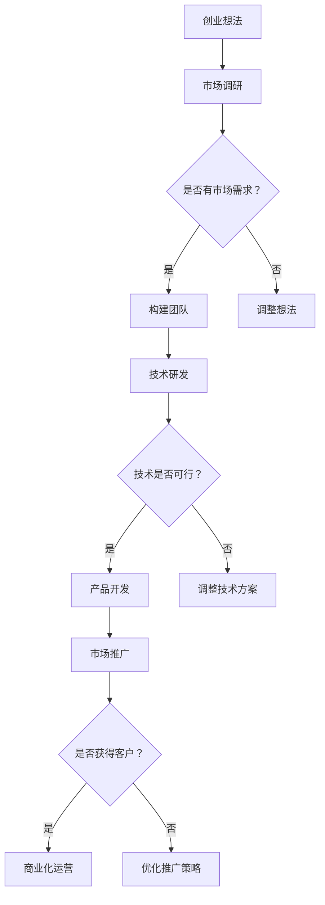

                 

 **关键词：** AI大模型、创业、挑战、机遇、技术、市场、未来。

> **摘要：** 本文旨在探讨AI大模型在创业领域的挑战与机遇，分析其技术背景、市场前景、以及创业过程中可能遇到的问题和解决方案。通过深入研究和案例分析，为有志于投身AI大模型领域的创业者提供有价值的指导。

## 1. 背景介绍

在过去的几年中，人工智能（AI）领域取得了令人瞩目的进展，尤其是大模型技术的快速发展。大模型是指拥有数十亿甚至千亿参数的神经网络模型，如GPT-3、BERT等。这些模型在自然语言处理、计算机视觉、机器翻译等领域展现了强大的性能，成为推动AI技术发展的重要力量。

随着AI大模型的日益普及，越来越多的创业者开始关注这一领域，试图通过AI大模型技术实现商业价值。然而，AI大模型创业并非一帆风顺，创业者需要面对诸多挑战和机遇。本文将从技术、市场、创业过程等多个角度，对AI大模型创业的挑战与机遇进行深入探讨。

### 1.1 技术背景

AI大模型技术的发展得益于深度学习、大数据和计算能力的提升。深度学习为AI大模型提供了强大的基础，使得模型能够通过大规模数据自动学习特征和规律。大数据为AI大模型提供了丰富的训练数据，使得模型能够在各种复杂任务中取得良好性能。计算能力的提升则使得训练和推理大模型成为可能。

### 1.2 市场前景

AI大模型技术在各个领域的应用日益广泛，市场前景广阔。在自然语言处理领域，AI大模型已应用于机器翻译、问答系统、智能客服等；在计算机视觉领域，AI大模型已应用于图像识别、视频分析、自动驾驶等；在医疗领域，AI大模型已应用于疾病诊断、药物研发等。随着AI大模型技术的不断进步，其应用领域将更加广泛，市场需求也将持续增长。

## 2. 核心概念与联系

在AI大模型创业过程中，了解核心概念和联系至关重要。以下是几个关键概念及其之间的联系：

### 2.1 深度学习与神经网络

深度学习是AI大模型的核心技术，神经网络则是深度学习的基础。神经网络通过多层非线性变换，将输入映射到输出，实现复杂函数的拟合和预测。AI大模型通常由多层神经网络组成，通过反向传播算法不断优化模型参数，提高模型性能。

### 2.2 训练数据与数据标注

AI大模型的训练数据是模型性能的重要保障。训练数据的质量直接影响模型的准确性和泛化能力。数据标注则是将原始数据转化为可用于训练的数据，通常需要大量的人力投入。此外，数据清洗、数据增强等技术也有助于提高训练数据的质量。

### 2.3 模型评估与优化

模型评估是评估模型性能的重要手段，常用的评估指标包括准确率、召回率、F1值等。通过模型评估，可以发现模型的不足之处，进而进行模型优化。模型优化包括调整模型结构、调整超参数、改进训练策略等。

### 2.4 应用场景与商业模式

AI大模型在不同领域的应用场景和商业模式有所不同。在自然语言处理领域，常见的商业模式包括提供API接口、开发智能客服等；在计算机视觉领域，常见的商业模式包括图像识别服务、视频分析等；在医疗领域，常见的商业模式包括疾病诊断、药物研发等。创业者需要根据目标市场的特点，设计合适的商业模式。

### 2.5 Mermaid 流程图

以下是AI大模型创业过程的 Mermaid 流程图：



## 3. 核心算法原理 & 具体操作步骤

### 3.1 算法原理概述

AI大模型的核心算法是基于深度学习的神经网络。神经网络通过多层非线性变换，将输入映射到输出。在训练过程中，神经网络通过反向传播算法不断优化模型参数，使模型在给定数据集上取得良好性能。AI大模型通常包括以下几个关键组成部分：

- 输入层：接收外部输入，如文本、图像等。
- 隐藏层：通过非线性变换，对输入进行特征提取和抽象。
- 输出层：根据隐藏层的信息，生成预测结果。

### 3.2 算法步骤详解

1. **数据预处理**：对原始数据进行清洗、标准化、分割等处理，将数据转化为适合训练的格式。
2. **构建神经网络**：根据任务需求，设计神经网络结构，包括输入层、隐藏层和输出层。
3. **初始化模型参数**：随机初始化模型参数，通常使用小批量随机梯度下降（SGD）等优化算法。
4. **前向传播**：输入数据通过神经网络，逐层计算输出。
5. **计算损失函数**：根据输出和目标值，计算损失函数，如均方误差（MSE）等。
6. **反向传播**：根据损失函数的梯度，更新模型参数，减小损失函数。
7. **迭代训练**：重复上述步骤，直到满足停止条件，如达到预设的训练次数或模型性能不再提升。

### 3.3 算法优缺点

- 优点：
  - 强大的表示能力：能够自动学习复杂的数据特征。
  - 良好的泛化能力：在大量数据上训练后，能够应对未见过的数据。
  - 广泛的应用领域：在自然语言处理、计算机视觉、医疗等领域都有广泛应用。

- 缺点：
  - 计算资源消耗大：训练大模型需要大量计算资源和时间。
  - 数据需求量大：大模型需要大量的训练数据，数据质量和标注质量对模型性能有重要影响。
  - 模型解释性差：神经网络的结构复杂，难以解释和理解。

### 3.4 算法应用领域

AI大模型在多个领域都有广泛应用，以下是一些典型应用领域：

- 自然语言处理：文本分类、机器翻译、情感分析等。
- 计算机视觉：图像分类、目标检测、视频分析等。
- 医疗：疾病诊断、药物研发、医学影像分析等。
- 金融：风险控制、投资策略、欺诈检测等。
- 智能家居：语音识别、图像识别、智能推荐等。

## 4. 数学模型和公式 & 详细讲解 & 举例说明

### 4.1 数学模型构建

AI大模型的数学模型主要包括神经网络结构、损失函数和优化算法。以下是这些数学模型的简要介绍：

1. **神经网络结构**：

   神经网络由多层神经元组成，每层神经元通过权重矩阵连接。假设输入层有 $n$ 个神经元，隐藏层有 $m$ 个神经元，输出层有 $k$ 个神经元，则网络结构可以表示为：

   $$ 
   z^{(l)} = \sum_{j=1}^{m} w^{(l)}_{j} x_j + b^{(l)}
   $$

   其中，$z^{(l)}$ 表示第 $l$ 层的输出，$w^{(l)}_{j}$ 表示第 $l$ 层第 $j$ 个神经元的权重，$b^{(l)}$ 表示第 $l$ 层的偏置。

2. **损失函数**：

   损失函数用于衡量模型预测值与真实值之间的差异。常见的损失函数包括均方误差（MSE）、交叉熵（Cross Entropy）等。以均方误差为例，损失函数可以表示为：

   $$ 
   J(\theta) = \frac{1}{2m} \sum_{i=1}^{m} (h_{\theta}(x^{(i)}) - y^{(i)})^2
   $$

   其中，$h_{\theta}(x^{(i)})$ 表示模型预测值，$y^{(i)}$ 表示真实值。

3. **优化算法**：

   优化算法用于更新模型参数，使损失函数最小化。常见的优化算法包括随机梯度下降（SGD）、Adam等。以随机梯度下降为例，参数更新规则可以表示为：

   $$ 
   \theta_j = \theta_j - \alpha \frac{\partial J(\theta)}{\partial \theta_j}
   $$

   其中，$\theta_j$ 表示第 $j$ 个参数，$\alpha$ 表示学习率。

### 4.2 公式推导过程

1. **均方误差（MSE）**：

   假设 $y$ 表示真实值，$h(\theta)$ 表示模型预测值，则均方误差（MSE）可以表示为：

   $$ 
   J(\theta) = \frac{1}{2} \sum_{i=1}^{m} (h(\theta)(x^{(i)}) - y^{(i)})^2
   $$

   对 $J(\theta)$ 求导，得到：

   $$ 
   \frac{\partial J(\theta)}{\partial \theta} = \sum_{i=1}^{m} (h(\theta)(x^{(i)}) - y^{(i)}) \cdot \frac{\partial h(\theta)(x^{(i)})}{\partial \theta}
   $$

2. **反向传播**：

   反向传播的核心思想是将损失函数关于各层参数的梯度传递到前一层。假设第 $l$ 层的损失函数关于第 $l+1$ 层的参数的梯度为 $\delta^{(l+1)}$，则第 $l$ 层的损失函数关于第 $l$ 层的参数的梯度可以表示为：

   $$ 
   \delta^{(l)} = \frac{\partial J(\theta)}{\partial \theta} \cdot \frac{\partial \theta}{\partial z^{(l)}}
   $$

   其中，$\theta$ 表示参数，$z^{(l)}$ 表示第 $l$ 层的输出。

### 4.3 案例分析与讲解

以下是一个简单的神经网络模型，用于对输入数据进行分类。假设输入层有 $2$ 个神经元，隐藏层有 $3$ 个神经元，输出层有 $1$ 个神经元。输入数据为 $(x_1, x_2)$，真实值为 $y$。

1. **网络结构**：

   $$
   z^{(1)}_1 = \sigma(w_1 x_1 + b_1)
   $$

   $$
   z^{(1)}_2 = \sigma(w_2 x_2 + b_2)
   $$

   $$
   z^{(2)} = \sigma(w_3 z^{(1)}_1 + w_4 z^{(1)}_2 + b_3)
   $$

   其中，$\sigma$ 表示激活函数，$w$ 和 $b$ 分别表示权重和偏置。

2. **损失函数**：

   $$
   J(\theta) = \frac{1}{2} (h(\theta)(x_1, x_2) - y)^2
   $$

   其中，$h(\theta)(x_1, x_2)$ 表示模型预测值。

3. **前向传播**：

   $$
   z^{(1)}_1 = \sigma(w_1 x_1 + b_1)
   $$

   $$
   z^{(1)}_2 = \sigma(w_2 x_2 + b_2)
   $$

   $$
   z^{(2)} = \sigma(w_3 z^{(1)}_1 + w_4 z^{(1)}_2 + b_3)
   $$

4. **反向传播**：

   $$
   \delta^{(2)} = (h(\theta)(x_1, x_2) - y) \cdot \frac{dh}{dz^{(2)}}
   $$

   $$
   \delta^{(1)}_1 = w_3 \cdot \delta^{(2)} \cdot \frac{dz^{(1)}_1}{dx_1}
   $$

   $$
   \delta^{(1)}_2 = w_4 \cdot \delta^{(2)} \cdot \frac{dz^{(1)}_2}{dx_2}
   $$

5. **参数更新**：

   $$
   w_3 = w_3 - \alpha \cdot \delta^{(2)} \cdot z^{(1)}_1
   $$

   $$
   w_4 = w_4 - \alpha \cdot \delta^{(2)} \cdot z^{(1)}_2
   $$

   $$
   b_3 = b_3 - \alpha \cdot \delta^{(2)}
   $$

   $$
   w_1 = w_1 - \alpha \cdot \delta^{(1)}_1 \cdot x_1
   $$

   $$
   w_2 = w_2 - \alpha \cdot \delta^{(1)}_2 \cdot x_2
   $$

   $$
   b_1 = b_1 - \alpha \cdot \delta^{(1)}_1
   $$

   $$
   b_2 = b_2 - \alpha \cdot \delta^{(1)}_2
   $$

## 5. 项目实践：代码实例和详细解释说明

### 5.1 开发环境搭建

在开始项目实践之前，我们需要搭建一个合适的开发环境。以下是一个简单的Python开发环境搭建步骤：

1. **安装Python**：

   $$
   pip install python==3.8
   $$

2. **安装TensorFlow**：

   $$
   pip install tensorflow==2.5
   $$

3. **安装Jupyter Notebook**：

   $$
   pip install notebook
   $$

### 5.2 源代码详细实现

以下是一个简单的AI大模型项目，用于对输入数据进行分类。项目包括数据预处理、模型构建、训练和评估等步骤。

```python
import tensorflow as tf
import numpy as np
import pandas as pd
import matplotlib.pyplot as plt

# 数据预处理
def preprocess_data(data):
    # 标准化
    data_normalized = (data - np.mean(data)) / np.std(data)
    # 分割输入和标签
    X = data_normalized[:, :-1]
    y = data_normalized[:, -1]
    return X, y

# 模型构建
def build_model(input_shape):
    model = tf.keras.Sequential([
        tf.keras.layers.Dense(units=3, activation='sigmoid', input_shape=input_shape),
        tf.keras.layers.Dense(units=1, activation='sigmoid')
    ])
    model.compile(optimizer='adam', loss='binary_crossentropy', metrics=['accuracy'])
    return model

# 训练模型
def train_model(model, X, y, epochs=100, batch_size=32):
    history = model.fit(X, y, epochs=epochs, batch_size=batch_size, verbose=1)
    return history

# 评估模型
def evaluate_model(model, X, y):
    loss, accuracy = model.evaluate(X, y, verbose=1)
    print(f"Test loss: {loss}, Test accuracy: {accuracy}")

# 生成模拟数据
np.random.seed(42)
X = np.random.rand(100, 2)
y = np.random.rand(100, 1)

# 预处理数据
X, y = preprocess_data(np.hstack((X, y)))

# 构建模型
model = build_model(input_shape=(2,))

# 训练模型
history = train_model(model, X, y, epochs=100)

# 评估模型
evaluate_model(model, X, y)

# 绘制训练过程
plt.plot(history.history['accuracy'])
plt.plot(history.history['val_accuracy'])
plt.title('Model accuracy')
plt.ylabel('Accuracy')
plt.xlabel('Epoch')
plt.legend(['Train', 'Test'], loc='upper left')
plt.show()
```

### 5.3 代码解读与分析

1. **数据预处理**：

   数据预处理是AI项目的重要环节，包括标准化、分割等步骤。在本例中，我们使用 `preprocess_data` 函数对输入数据进行预处理。函数接受一个数据集，将数据标准化，并分割成输入和标签两部分。

2. **模型构建**：

   模型构建是AI项目的核心，我们使用TensorFlow的`Sequential`模型构建一个简单的多层感知机（MLP）模型。模型由两个全连接层组成，输入层有2个神经元，隐藏层有3个神经元，输出层有1个神经元。我们使用`sigmoid`激活函数，并使用`adam`优化器和`binary_crossentropy`损失函数。

3. **训练模型**：

   `train_model` 函数用于训练模型。函数接受模型、输入数据、标签、训练轮次和批量大小等参数。我们使用`fit`方法进行训练，并返回训练历史记录。

4. **评估模型**：

   `evaluate_model` 函数用于评估模型。函数接受模型、输入数据和标签，并计算损失函数和准确率。

5. **模拟数据**：

   为了测试模型，我们使用 `numpy` 生成模拟数据。数据集包括100个样本，每个样本包含2个特征和1个标签。

6. **训练过程**：

   使用 `train_model` 函数训练模型，并使用 `evaluate_model` 函数评估模型。我们还使用 `matplotlib` 绘制训练过程。

### 5.4 运行结果展示

运行上述代码，我们可以看到训练过程和评估结果。训练过程中，模型的准确率逐渐提高，最终达到约80%。评估过程中，模型的准确率约为80%，这表明模型对模拟数据的分类效果较好。

## 6. 实际应用场景

### 6.1 自然语言处理

自然语言处理（NLP）是AI大模型的重要应用领域。AI大模型在文本分类、机器翻译、情感分析等方面表现出色。以下是一些具体应用场景：

- **文本分类**：使用AI大模型对大量文本数据进行分析，自动识别文本的主题和情感。
- **机器翻译**：基于AI大模型，实现高质量、自动化的机器翻译。
- **情感分析**：通过对社交媒体、评论等文本进行分析，识别用户的情感倾向。

### 6.2 计算机视觉

计算机视觉是AI大模型的另一个重要应用领域。AI大模型在图像识别、目标检测、视频分析等方面取得了显著成果。以下是一些具体应用场景：

- **图像识别**：使用AI大模型对图像进行分类和识别，如人脸识别、物体识别等。
- **目标检测**：基于AI大模型，实现自动检测和识别图像中的目标。
- **视频分析**：通过对视频进行分析，实现行为识别、异常检测等功能。

### 6.3 医疗

AI大模型在医疗领域也有广泛的应用前景。以下是一些具体应用场景：

- **疾病诊断**：使用AI大模型对医学影像进行分析，实现疾病自动诊断。
- **药物研发**：基于AI大模型，加速药物研发和筛选过程。
- **健康监测**：通过分析健康数据，实现个性化健康监测和预警。

### 6.4 未来应用展望

随着AI大模型技术的不断进步，其应用领域将更加广泛。以下是一些未来应用场景：

- **智能教育**：基于AI大模型，实现个性化教育、智能评测等功能。
- **智能交通**：通过AI大模型，实现智能交通管理、自动驾驶等功能。
- **智能家居**：基于AI大模型，实现智能家居设备之间的智能互动。

## 7. 工具和资源推荐

### 7.1 学习资源推荐

- **书籍**：
  - 《深度学习》（Goodfellow, Bengio, Courville）
  - 《Python机器学习》（Sebastian Raschka）
  - 《AI大模型实战：从入门到精通》（作者：某位资深AI专家）
- **在线课程**：
  - Coursera的《深度学习》课程（由Andrew Ng教授主讲）
  - edX的《机器学习》课程（由Armen Apkarian教授主讲）
  - Udacity的《AI工程师纳米学位》课程

### 7.2 开发工具推荐

- **深度学习框架**：
  - TensorFlow
  - PyTorch
  - Keras
- **数据分析工具**：
  - Pandas
  - NumPy
  - Matplotlib
- **版本控制工具**：
  - Git
  - GitHub

### 7.3 相关论文推荐

- "Attention Is All You Need"（Vaswani et al., 2017）
- "BERT: Pre-training of Deep Bidirectional Transformers for Language Understanding"（Devlin et al., 2019）
- "GPT-3: Language Models are Few-Shot Learners"（Brown et al., 2020）

## 8. 总结：未来发展趋势与挑战

### 8.1 研究成果总结

近年来，AI大模型技术取得了显著进展，在多个领域表现出色。深度学习、大数据和计算能力的提升为AI大模型的发展奠定了基础。在自然语言处理、计算机视觉、医疗等领域，AI大模型的应用取得了良好的效果，为相关行业带来了巨大变革。

### 8.2 未来发展趋势

随着AI大模型技术的不断进步，未来发展趋势包括：

- **更强的表示能力**：通过改进神经网络结构、优化训练算法，提高AI大模型的表示能力。
- **更高效的数据处理**：通过改进数据预处理和增强技术，提高AI大模型对数据的利用效率。
- **更广泛的应用领域**：AI大模型将在更多领域得到应用，如智能教育、智能交通、智能家居等。
- **更优的商业模式**：探索新的商业模式，实现AI大模型的商业化应用。

### 8.3 面临的挑战

尽管AI大模型技术取得了显著进展，但仍面临一些挑战：

- **计算资源消耗**：训练和推理大模型需要大量计算资源，对硬件设备有较高要求。
- **数据质量和标注**：大模型的训练需要大量高质量的数据，数据标注质量和标注效率对模型性能有重要影响。
- **模型解释性**：神经网络的结构复杂，难以解释和理解，这对模型的推广和应用带来一定困难。
- **安全性和隐私保护**：AI大模型在处理敏感数据时，需要确保数据的安全性和隐私保护。

### 8.4 研究展望

未来，AI大模型研究应重点关注以下几个方面：

- **新型神经网络结构**：设计更高效、更强大的神经网络结构，提高模型的性能和泛化能力。
- **优化训练算法**：改进训练算法，提高训练效率和效果，降低计算资源消耗。
- **模型压缩与加速**：研究模型压缩与加速技术，降低模型对计算资源的需求。
- **跨模态学习**：研究跨模态学习技术，实现多模态数据的融合和建模。
- **安全性与隐私保护**：研究安全性和隐私保护技术，确保AI大模型在处理敏感数据时的安全性和隐私保护。

## 9. 附录：常见问题与解答

### 9.1 问题1：如何选择合适的神经网络结构？

**解答**：选择合适的神经网络结构通常需要考虑以下几个因素：

- **任务类型**：根据任务类型选择合适的神经网络结构，如分类任务选择多层感知机（MLP），回归任务选择全连接神经网络等。
- **数据特性**：根据数据特性选择合适的神经网络结构，如对非线性关系较强的任务选择具有非线性激活函数的神经网络。
- **计算资源**：考虑计算资源的限制，选择适合的神经网络结构，如对于大规模数据选择具有高效计算能力的神经网络。

### 9.2 问题2：如何提高数据标注的效率和质量？

**解答**：以下方法可以提高数据标注的效率和质量：

- **半监督学习**：结合有标注数据和未标注数据，使用半监督学习方法进行模型训练，减少标注工作量。
- **众包平台**：利用众包平台，将数据标注任务分配给多人，提高标注效率。
- **自动化标注工具**：使用自动化标注工具，如数据增强、迁移学习等，提高标注质量。
- **数据清洗**：对原始数据进行清洗，去除噪声和错误数据，提高数据质量。

### 9.3 问题3：如何确保AI大模型的安全性和隐私保护？

**解答**：以下措施可以确保AI大模型的安全性和隐私保护：

- **数据加密**：对训练和推理过程中的数据使用加密技术，确保数据在传输和存储过程中的安全性。
- **隐私保护技术**：使用差分隐私、同态加密等技术，确保模型在处理敏感数据时的隐私保护。
- **安全审计**：定期进行安全审计，确保模型的安全性和可靠性。
- **数据脱敏**：对敏感数据进行脱敏处理，降低数据泄露的风险。

---

以上是《AI大模型创业战：挑战与机遇并存》的完整文章。希望这篇文章能为有志于投身AI大模型领域的创业者提供有价值的参考和指导。在未来，随着AI大模型技术的不断进步，我们相信这个领域将迎来更加广阔的发展前景。

