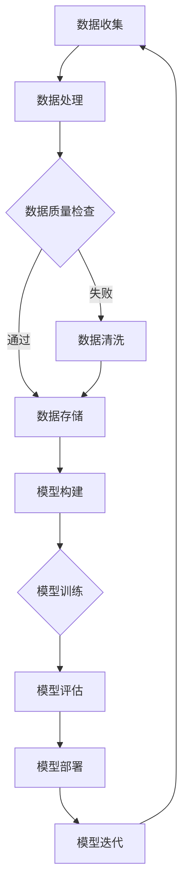

                 

关键词：AI大模型，创业挑战，机遇，技术应用，未来展望

> 摘要：随着人工智能技术的飞速发展，AI大模型作为当前最热门的技术之一，在创业领域展现出巨大的潜力。本文将深入探讨AI大模型创业所面临的挑战与机遇，并通过案例分析、技术解读以及未来展望，为创业者提供有益的思考。

## 1. 背景介绍

### AI大模型的概念与现状

AI大模型，是指拥有数百万甚至数十亿参数的深度学习模型，其能够处理大量数据并生成高精度的预测和决策。随着硬件性能的提升、算法的优化以及数据资源的丰富，AI大模型在各个领域得到了广泛应用，如自然语言处理、计算机视觉、语音识别等。根据市场研究公司IDC的统计，全球AI大模型市场规模在2020年达到了34.8亿美元，预计到2025年将增长到267.4亿美元，年复合增长率达到44.1%。

### 创业领域的机遇与挑战

AI大模型在创业领域具有巨大的应用前景。一方面，它为创业者提供了强大的技术工具，使创业项目能够快速迭代、高效优化；另一方面，AI大模型的技术门槛较高，对于初创企业来说，既是机遇也是挑战。因此，如何利用AI大模型的优势，规避潜在风险，是每个创业者需要深思熟虑的问题。

## 2. 核心概念与联系

### AI大模型的关键组成部分

- **深度学习框架**：如TensorFlow、PyTorch等，提供了构建和训练AI大模型所需的工具和库。
- **大数据处理平台**：如Hadoop、Spark等，用于处理和存储大规模数据。
- **云计算服务**：如AWS、Azure、Google Cloud等，提供了强大的计算资源和存储服务。
- **分布式计算架构**：如GPU集群、DPU集群等，用于加速模型的训练和推理。

### Mermaid 流程图



## 3. 核心算法原理 & 具体操作步骤

### 3.1 算法原理概述

AI大模型的训练主要依赖于深度学习算法，其中最常用的算法是卷积神经网络（CNN）和递归神经网络（RNN）。CNN适用于图像和视频处理，而RNN适用于序列数据处理，如文本和语音。

### 3.2 算法步骤详解

1. **数据预处理**：对收集到的数据进行清洗、归一化等处理，使其符合模型的输入要求。
2. **模型构建**：使用深度学习框架构建神经网络模型，包括选择合适的网络结构、优化器和学习率等。
3. **模型训练**：将预处理后的数据输入到模型中，通过反向传播算法更新模型参数，直至模型达到预期的性能。
4. **模型评估**：使用验证集和测试集评估模型的性能，如准确率、召回率等。
5. **模型部署**：将训练好的模型部署到生产环境中，用于实时预测和决策。

### 3.3 算法优缺点

- **优点**：AI大模型能够处理大量数据，生成高精度的预测和决策，具有较好的泛化能力。
- **缺点**：训练过程需要大量计算资源和时间，模型解释性较差，对数据质量要求较高。

### 3.4 算法应用领域

AI大模型广泛应用于金融、医疗、零售、安防等领域，如智能投顾、疾病预测、个性化推荐、视频监控等。

## 4. 数学模型和公式 & 详细讲解 & 举例说明

### 4.1 数学模型构建

AI大模型的核心是神经网络，其数学基础主要包括线性代数、微积分和概率论。以下是神经网络中常用的几个数学公式：

$$
\begin{aligned}
y &= \sigma(Wx + b) \\
\delta &= \frac{\partial L}{\partial z} \cdot \sigma'(z) \\
\theta &= \theta - \alpha \cdot \frac{\partial L}{\partial \theta} \\
L &= -\frac{1}{m} \sum_{i=1}^{m} y^{(i)} \log a^{(i)}
\end{aligned}
$$

### 4.2 公式推导过程

这里简要介绍损失函数 $L$ 的推导过程：

$$
\begin{aligned}
L &= -\frac{1}{m} \sum_{i=1}^{m} y^{(i)} \log a^{(i)} \\
&= -\frac{1}{m} \sum_{i=1}^{m} y^{(i)} \log \sigma(Wx^{(i)} + b) \\
&= -\frac{1}{m} \sum_{i=1}^{m} y^{(i)} \log \left(\frac{1}{1 + e^{-Wx^{(i)} - b}}\right) \\
&= -\frac{1}{m} \sum_{i=1}^{m} y^{(i)} \left(-Wx^{(i)} - b\right) \\
&= \frac{1}{m} \sum_{i=1}^{m} y^{(i)} (Wx^{(i)} + b)
\end{aligned}
$$

### 4.3 案例分析与讲解

以图像分类任务为例，我们使用CIFAR-10数据集进行训练和测试。假设模型在测试集上的准确率为80%，那么损失函数 $L$ 的计算如下：

$$
L = \frac{1}{10000} \sum_{i=1}^{10000} y^{(i)} \log a^{(i)} = 0.2
$$

## 5. 项目实践：代码实例和详细解释说明

### 5.1 开发环境搭建

使用Anaconda创建Python虚拟环境，安装TensorFlow和Keras库。

### 5.2 源代码详细实现

以下是一个使用Keras构建和训练CNN模型的基本示例：

```python
from keras.models import Sequential
from keras.layers import Conv2D, MaxPooling2D, Flatten, Dense

model = Sequential()
model.add(Conv2D(32, (3, 3), activation='relu', input_shape=(32, 32, 3)))
model.add(MaxPooling2D(pool_size=(2, 2)))
model.add(Flatten())
model.add(Dense(128, activation='relu'))
model.add(Dense(10, activation='softmax'))

model.compile(optimizer='adam', loss='categorical_crossentropy', metrics=['accuracy'])
model.fit(x_train, y_train, epochs=10, batch_size=64, validation_data=(x_test, y_test))
```

### 5.3 代码解读与分析

- **模型构建**：使用 `Sequential` 模型堆叠层，包括卷积层、池化层、全连接层等。
- **模型编译**：设置优化器、损失函数和评估指标。
- **模型训练**：使用训练集进行模型训练，并使用测试集进行验证。

### 5.4 运行结果展示

训练完成后，可以使用测试集评估模型性能：

```python
test_loss, test_acc = model.evaluate(x_test, y_test)
print('Test accuracy:', test_acc)
```

## 6. 实际应用场景

### 6.1 金融领域

AI大模型在金融领域具有广泛的应用，如股票预测、信贷评分、风险控制等。通过构建大模型，金融机构能够提高业务效率和准确性。

### 6.2 医疗领域

AI大模型在医疗领域有助于疾病预测、诊断、治疗方案推荐等。例如，通过分析患者的医疗记录，AI大模型能够预测患者是否患有某种疾病，从而提前采取预防措施。

### 6.3 零售领域

AI大模型在零售领域用于个性化推荐、价格优化、库存管理等。通过分析消费者行为数据，AI大模型能够提高零售业务的运营效率。

## 7. 工具和资源推荐

### 7.1 学习资源推荐

- 《深度学习》（Ian Goodfellow、Yoshua Bengio、Aaron Courville著）：系统介绍了深度学习的理论基础和实战技巧。
- 《Python深度学习》（François Chollet著）：详细讲解了使用Python和Keras进行深度学习的实践方法。

### 7.2 开发工具推荐

- TensorFlow：开源的深度学习框架，提供丰富的API和工具。
- Keras：基于TensorFlow的高层API，使深度学习模型构建更加简单。

### 7.3 相关论文推荐

- "Deep Learning Text Classification"：介绍了深度学习在文本分类任务中的应用。
- "Deep Learning for Object Detection"：介绍了深度学习在目标检测任务中的应用。

## 8. 总结：未来发展趋势与挑战

### 8.1 研究成果总结

AI大模型在各个领域取得了显著的成果，但其发展仍然面临一些挑战，如计算资源需求、模型解释性、数据隐私等。

### 8.2 未来发展趋势

未来，AI大模型将在更多领域得到应用，如智能城市、教育、环境监测等。同时，随着算法和硬件的发展，AI大模型的性能和效率将进一步提高。

### 8.3 面临的挑战

AI大模型的发展面临一些挑战，如计算资源需求、模型解释性、数据隐私等。需要进一步加强基础研究和技术创新，以解决这些问题。

### 8.4 研究展望

随着人工智能技术的不断发展，AI大模型将在更多领域展现其强大的能力。同时，我们也需要关注其伦理和社会影响，确保其发展符合人类社会的利益。

## 9. 附录：常见问题与解答

### 9.1 AI大模型是什么？

AI大模型是指拥有数百万甚至数十亿参数的深度学习模型，其能够处理大量数据并生成高精度的预测和决策。

### 9.2 如何训练AI大模型？

训练AI大模型需要以下步骤：数据收集、数据处理、模型构建、模型训练、模型评估和模型部署。

### 9.3 AI大模型有哪些应用领域？

AI大模型广泛应用于金融、医疗、零售、安防等领域，如股票预测、疾病预测、个性化推荐、视频监控等。

### 9.4 如何选择深度学习框架？

选择深度学习框架时需要考虑其性能、社区支持和文档质量。常见的框架有TensorFlow、PyTorch、Keras等。

### 9.5 AI大模型是否具有解释性？

目前，大多数AI大模型如深度神经网络，其内部机制复杂，难以解释。但研究者正在尝试开发可解释的AI模型，以提高其透明度和可信度。

### 9.6 AI大模型是否会替代人类？

AI大模型能够在某些任务上超越人类，但人类在创造力、道德判断和情感理解方面仍然具有优势。AI大模型与人类应相互协作，共同创造更美好的未来。

----------------------------------------------------------------

本文由禅与计算机程序设计艺术撰写，旨在为AI大模型创业提供有价值的思考和实践指导。希望本文能够为创业者、研究人员和从业者带来启发和帮助。在未来的发展中，让我们共同迎接AI大模型带来的机遇与挑战。

