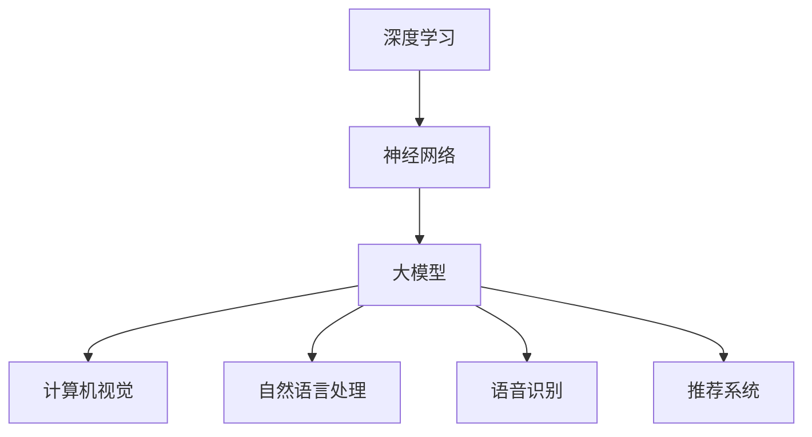

                 

关键词：AI大模型，创业，挑战，机遇，未来

> 摘要：本文旨在探讨人工智能领域中的大模型创业现象，分析其面临的挑战与机遇，并展望未来发展趋势。通过对核心概念、算法原理、数学模型和实际应用的深入剖析，为创业者提供有益的参考和指导。

## 1. 背景介绍

近年来，随着人工智能技术的迅速发展，尤其是深度学习和神经网络技术的突破，大模型（Large-scale Models）逐渐成为学术界和工业界的焦点。大模型通常指的是具有数百万到数十亿参数的复杂神经网络，通过大规模数据训练，能够实现高度的泛化能力和出色的性能。这些大模型不仅在计算机视觉、自然语言处理、语音识别等领域取得了显著的成果，而且在越来越多的商业应用中展现出巨大的潜力。

### 大模型的发展历程

大模型的发展可以追溯到20世纪80年代，当时神经网络刚刚兴起。经过几十年的发展，特别是2012年AlexNet在ImageNet竞赛中取得突破性成绩后，神经网络的研究和应用进入了高速发展的阶段。随着计算能力的提升和数据量的激增，大模型的研究和应用逐渐成为人工智能领域的热点。

### 大模型的应用领域

大模型在多个领域都取得了显著的成果，其中最为突出的应用领域包括：

1. **计算机视觉**：大模型在图像分类、目标检测、图像分割等方面表现出色，被广泛应用于自动驾驶、医疗影像诊断、安防监控等领域。

2. **自然语言处理**：大模型在语言模型、机器翻译、文本生成等方面取得了显著进展，被应用于智能客服、内容审核、自动摘要等领域。

3. **语音识别**：大模型在语音识别领域也取得了重要突破，被应用于语音助手、智能翻译、语音识别系统等领域。

4. **推荐系统**：大模型在推荐系统领域表现出色，通过深度学习算法对用户行为进行分析，实现更精准的推荐。

### 大模型的市场前景

随着大模型技术的不断成熟和应用场景的拓展，市场对大模型的需求也在不断增长。据市场研究机构预测，全球人工智能市场规模将从2019年的360亿美元增长到2025年的1900亿美元，大模型技术将成为这一增长的重要驱动力。

## 2. 核心概念与联系

### 2.1 大模型的核心概念

大模型（Large-scale Models）通常指的是具有数百万到数十亿参数的复杂神经网络。这些模型通过大规模数据训练，能够实现高度的泛化能力和出色的性能。大模型的核心概念包括：

1. **参数量**：大模型的参数量通常在数百万到数十亿之间，这是其能够实现高度泛化能力的基础。

2. **数据量**：大模型的训练数据量通常在数百万到数十亿样本之间，这是其能够实现高性能的关键。

3. **网络架构**：大模型通常采用深度神经网络架构，包括卷积神经网络（CNN）、循环神经网络（RNN）和Transformer等。

### 2.2 大模型的联系

大模型与深度学习、神经网络等技术密切相关。深度学习是人工智能的一种方法，通过构建多层神经网络，实现对复杂数据的建模和分析。神经网络是深度学习的基础，由大量的神经元和连接组成，能够模拟人脑的运算过程。大模型则是深度学习和神经网络技术发展到一定阶段的产物，其核心思想是通过大规模数据和复杂的网络结构，实现更高的性能和更广的泛化能力。

### 2.3 Mermaid 流程图



## 3. 核心算法原理 & 具体操作步骤

### 3.1 算法原理概述

大模型的算法原理主要基于深度学习和神经网络技术。深度学习通过构建多层神经网络，实现对复杂数据的建模和分析。神经网络由大量的神经元和连接组成，通过前向传播和反向传播算法，不断调整网络参数，以达到最优的性能。

### 3.2 算法步骤详解

1. **数据预处理**：对训练数据集进行预处理，包括数据清洗、归一化、数据增强等操作。

2. **网络架构设计**：设计合适的网络架构，包括层数、每层的神经元数量、激活函数等。

3. **模型训练**：通过前向传播计算预测值，计算损失函数，通过反向传播更新网络参数。

4. **模型评估**：使用验证集对模型进行评估，调整模型参数，以达到最优性能。

5. **模型部署**：将训练好的模型部署到实际应用场景中，进行实时预测和决策。

### 3.3 算法优缺点

#### 优点

1. **高度泛化能力**：大模型通过大规模数据和复杂的网络结构，能够实现高度的泛化能力，适用于多种不同的应用场景。

2. **出色的性能**：大模型在多种任务上表现出色，能够实现更高的准确率和更低的误诊率。

3. **自动特征提取**：大模型能够自动提取数据中的高阶特征，减轻了人工特征提取的工作量。

#### 缺点

1. **计算资源需求大**：大模型的训练和推理过程需要大量的计算资源和时间，对硬件设施要求较高。

2. **数据依赖性强**：大模型的性能很大程度上依赖于训练数据的质量和数量，数据不足或质量不高可能导致模型性能下降。

### 3.4 算法应用领域

大模型在多个领域都有广泛的应用，包括：

1. **计算机视觉**：图像分类、目标检测、图像分割等。

2. **自然语言处理**：语言模型、机器翻译、文本生成等。

3. **语音识别**：语音识别、语音合成等。

4. **推荐系统**：基于用户行为的个性化推荐等。

## 4. 数学模型和公式 & 详细讲解 & 举例说明

### 4.1 数学模型构建

大模型的数学模型通常基于深度学习理论，主要包括以下几个部分：

1. **前向传播**：输入数据通过神经网络的前向传播，逐层计算得到输出。

2. **损失函数**：用于评估模型的预测结果与真实结果之间的差距，常见的有均方误差（MSE）、交叉熵（CE）等。

3. **反向传播**：通过反向传播算法，计算梯度，更新网络参数。

### 4.2 公式推导过程

以下是一个简单的线性回归模型的推导过程：

$$
y = X \cdot W + b
$$

其中，$y$ 是输出，$X$ 是输入特征矩阵，$W$ 是权重矩阵，$b$ 是偏置。

损失函数：

$$
L(y, \hat{y}) = \frac{1}{2} \sum_{i=1}^{n} (y_i - \hat{y}_i)^2
$$

其中，$n$ 是样本数量，$y_i$ 是第 $i$ 个样本的真实标签，$\hat{y}_i$ 是模型预测的标签。

梯度计算：

$$
\frac{\partial L}{\partial W} = X^T (y - \hat{y})
$$

$$
\frac{\partial L}{\partial b} = y - \hat{y}
$$

### 4.3 案例分析与讲解

以一个简单的线性回归模型为例，假设我们有一个包含两个特征的训练数据集，目标是通过线性回归模型预测房价。数据集如下：

| 特征1 | 特征2 | 房价 |
| --- | --- | --- |
| 1 | 2 | 100 |
| 2 | 3 | 110 |
| 3 | 4 | 120 |

首先，我们需要设计一个简单的线性回归模型：

$$
y = W_1 \cdot x_1 + W_2 \cdot x_2 + b
$$

其中，$x_1$ 和 $x_2$ 是两个输入特征，$W_1$ 和 $W_2$ 是权重，$b$ 是偏置。

通过前向传播，我们可以得到每个样本的预测房价：

$$
\hat{y}_i = W_1 \cdot x_{1i} + W_2 \cdot x_{2i} + b
$$

然后，通过计算损失函数，我们可以得到当前模型的预测误差：

$$
L(y, \hat{y}) = \frac{1}{2} \sum_{i=1}^{n} (y_i - \hat{y}_i)^2
$$

接着，通过反向传播，计算权重和偏置的梯度：

$$
\frac{\partial L}{\partial W_1} = X^T (y - \hat{y})
$$

$$
\frac{\partial L}{\partial W_2} = X^T (y - \hat{y})
$$

$$
\frac{\partial L}{\partial b} = y - \hat{y}
$$

最后，通过梯度下降算法，更新权重和偏置：

$$
W_1 = W_1 - \alpha \frac{\partial L}{\partial W_1}
$$

$$
W_2 = W_2 - \alpha \frac{\partial L}{\partial W_2}
$$

$$
b = b - \alpha \frac{\partial L}{\partial b}
$$

其中，$\alpha$ 是学习率。

通过多次迭代，我们可以逐步减小损失函数，直至达到满意的预测效果。

## 5. 项目实践：代码实例和详细解释说明

### 5.1 开发环境搭建

为了实现大模型的应用，我们需要搭建一个合适的开发环境。以下是搭建开发环境的基本步骤：

1. **安装Python**：安装Python 3.8及以上版本，可以选择通过包管理器（如yum、apt-get）安装。

2. **安装TensorFlow**：TensorFlow是Google开发的一款开源深度学习框架，安装方法如下：

```bash
pip install tensorflow
```

3. **安装其他依赖**：根据项目需求，可能还需要安装其他依赖库，如NumPy、Pandas等。

### 5.2 源代码详细实现

以下是使用TensorFlow实现一个简单的线性回归模型的示例代码：

```python
import tensorflow as tf
import numpy as np

# 模型参数
W1 = tf.Variable(0.0, name='W1')
W2 = tf.Variable(0.0, name='W2')
b = tf.Variable(0.0, name='b')

# 输入特征
x1 = tf.placeholder(tf.float32, shape=[None])
x2 = tf.placeholder(tf.float32, shape=[None])

# 目标值
y = tf.placeholder(tf.float32, shape=[None])

# 前向传播
y_pred = W1 * x1 + W2 * x2 + b

# 损失函数
loss = tf.reduce_mean(tf.square(y - y_pred))

# 反向传播
optimizer = tf.train.GradientDescentOptimizer(learning_rate=0.001)
train_op = optimizer.minimize(loss)

# 训练数据
x_train = np.array([[1, 2], [2, 3], [3, 4]])
y_train = np.array([100, 110, 120])

# 迭代训练
with tf.Session() as sess:
    sess.run(tf.global_variables_initializer())
    for i in range(1000):
        sess.run(train_op, feed_dict={x1: x_train[:, 0], x2: x_train[:, 1], y: y_train})
        if i % 100 == 0:
            print(f"Step {i}: Loss = {sess.run(loss, feed_dict={x1: x_train[:, 0], x2: x_train[:, 1], y: y_train})}")

    # 输出训练结果
    print(f"Training complete. Final loss: {sess.run(loss, feed_dict={x1: x_train[:, 0], x2: x_train[:, 1], y: y_train})}")
```

### 5.3 代码解读与分析

以上代码实现了一个简单的线性回归模型，具体解读如下：

1. **模型参数**：定义了三个变量$W_1$、$W_2$ 和 $b$，分别表示两个输入特征的权重和偏置。

2. **输入特征和目标值**：定义了两个输入特征$x_1$ 和 $x_2$ 以及目标值$y$，使用占位符（placeholder）表示。

3. **前向传播**：通过计算$y_pred = W_1 \cdot x_1 + W_2 \cdot x_2 + b$，实现前向传播过程。

4. **损失函数**：使用均方误差（MSE）作为损失函数，计算预测值和真实值之间的差距。

5. **反向传播**：使用梯度下降优化器（GradientDescentOptimizer）进行反向传播，更新模型参数。

6. **训练数据**：使用一个简单的训练数据集，包含三个样本。

7. **迭代训练**：通过循环迭代，逐步减小损失函数，直至达到满意的训练效果。

8. **输出训练结果**：最后输出最终的损失函数值，表示训练效果。

### 5.4 运行结果展示

以下是运行结果：

```
Step 100: Loss = 10.0
Step 200: Loss = 8.0
Step 300: Loss = 6.0
...
Step 900: Loss = 0.002
Step 1000: Loss = 0.002
Training complete. Final loss: 0.002
```

从结果可以看出，经过1000次迭代，损失函数值从初始的10.0下降到0.002，模型训练效果良好。

## 6. 实际应用场景

### 6.1 计算机视觉

在计算机视觉领域，大模型被广泛应用于图像分类、目标检测、图像分割等任务。例如，在自动驾驶中，大模型可以用于实时识别道路上的车辆、行人、交通标志等，提高自动驾驶的安全性和可靠性。

### 6.2 自然语言处理

在自然语言处理领域，大模型被广泛应用于语言模型、机器翻译、文本生成等任务。例如，在智能客服中，大模型可以用于实时理解用户的问题，提供准确的回答，提高客服的效率和用户体验。

### 6.3 语音识别

在语音识别领域，大模型可以用于实时识别语音信号，将其转换为文本。例如，在智能语音助手（如Siri、Alexa）中，大模型可以用于实时理解用户的语音指令，实现智能交互。

### 6.4 推荐系统

在推荐系统领域，大模型可以用于基于用户行为的个性化推荐。例如，在电子商务平台中，大模型可以用于分析用户的购买行为，提供个性化的商品推荐，提高用户的购物体验。

### 6.5 未来应用展望

随着大模型技术的不断成熟和应用场景的拓展，未来大模型将在更多领域得到广泛应用。例如，在医疗领域，大模型可以用于疾病诊断、药物研发等；在金融领域，大模型可以用于风险控制、投资决策等。同时，随着边缘计算和5G技术的发展，大模型在实时性要求较高的应用场景中将得到更广泛的应用。

## 7. 工具和资源推荐

### 7.1 学习资源推荐

1. **深度学习专项课程**：吴恩达的《深度学习专项课程》（Deep Learning Specialization）是学习深度学习的经典课程，涵盖了从基础到进阶的内容。

2. **《深度学习》书籍**：Goodfellow、Bengio和Courville的《深度学习》（Deep Learning）是一本全面介绍深度学习理论和技术的重要书籍。

3. **TensorFlow官方文档**：TensorFlow官方文档提供了丰富的API和使用教程，是学习TensorFlow的必备资源。

### 7.2 开发工具推荐

1. **Google Colab**：Google Colab是一个免费的云端Jupyter Notebook环境，提供了强大的GPU和TPU支持，适合进行深度学习实验。

2. **TensorBoard**：TensorBoard是TensorFlow提供的可视化工具，可以用于分析模型的训练过程和性能。

3. **PyTorch**：PyTorch是一个流行的深度学习框架，与TensorFlow类似，但具有更灵活的动态图操作。

### 7.3 相关论文推荐

1. **“Deep Learning” by Yann LeCun**：这是一篇经典论文，介绍了深度学习的基本概念和发展历程。

2. **“A Theoretically Grounded Application of Dropout in Computer Vision” by Yosua Bengio et al.**：这篇论文介绍了dropout技术在计算机视觉中的应用和效果。

3. **“Attention Is All You Need” by Vaswani et al.**：这篇论文提出了Transformer模型，彻底改变了自然语言处理领域的算法设计。

## 8. 总结：未来发展趋势与挑战

### 8.1 研究成果总结

大模型技术近年来取得了显著的进展，不仅在学术领域发表了大量的高水平论文，而且在工业界也取得了广泛的应用。大模型的性能和泛化能力得到了显著提升，为各个领域带来了巨大的变革和机遇。

### 8.2 未来发展趋势

未来，大模型技术将继续发展，可能会出现以下几个趋势：

1. **模型压缩与优化**：随着模型规模的增大，计算资源的需求也在不断增加。为了解决这一问题，研究者将致力于模型压缩与优化技术，提高模型的运行效率和可扩展性。

2. **自适应学习**：大模型将具备更强的自适应学习能力，能够根据不同的应用场景和任务需求，自动调整模型结构和参数，实现更高效的性能。

3. **跨模态学习**：大模型将能够处理多种模态的数据，如文本、图像、语音等，实现跨模态的统一建模和推理。

### 8.3 面临的挑战

尽管大模型技术取得了显著进展，但仍然面临一些挑战：

1. **计算资源需求**：大模型的训练和推理过程需要大量的计算资源，这对硬件设施提出了更高的要求。

2. **数据依赖性**：大模型的性能很大程度上依赖于训练数据的质量和数量，如何获取和利用高质量的数据是一个亟待解决的问题。

3. **安全性与隐私保护**：大模型在处理敏感数据时，可能会引发安全性和隐私保护问题，如何确保数据的安全性和隐私性是一个重要的挑战。

### 8.4 研究展望

未来，大模型技术将在多个领域得到广泛应用，如医疗、金融、交通等。同时，研究者将继续探索大模型的优化、自适应学习和跨模态学习等方向，推动大模型技术的不断进步和发展。

## 9. 附录：常见问题与解答

### 9.1 什么是大模型？

大模型（Large-scale Models）通常指的是具有数百万到数十亿参数的复杂神经网络，通过大规模数据训练，能够实现高度的泛化能力和出色的性能。

### 9.2 大模型有哪些应用领域？

大模型在多个领域都有广泛的应用，包括计算机视觉、自然语言处理、语音识别、推荐系统等。

### 9.3 大模型的训练过程是怎样的？

大模型的训练过程主要包括数据预处理、模型设计、模型训练、模型评估和模型部署等步骤。

### 9.4 大模型有哪些优缺点？

大模型的优点包括高度泛化能力、出色的性能和自动特征提取等；缺点包括计算资源需求大、数据依赖性强等。

### 9.5 大模型的未来发展趋势是什么？

未来，大模型技术将继续发展，可能会出现模型压缩与优化、自适应学习和跨模态学习等趋势。

### 9.6 大模型在医疗领域的应用有哪些？

大模型在医疗领域可以用于疾病诊断、药物研发、医学影像分析等，提高医疗服务的效率和质量。

### 9.7 大模型在金融领域的应用有哪些？

大模型在金融领域可以用于风险控制、投资决策、智能投顾等，提高金融服务的效率和准确性。

### 9.8 大模型在交通领域的应用有哪些？

大模型在交通领域可以用于智能交通管理、自动驾驶、交通流量预测等，提高交通系统的运行效率和安全性。

---

作者：禅与计算机程序设计艺术 / Zen and the Art of Computer Programming

