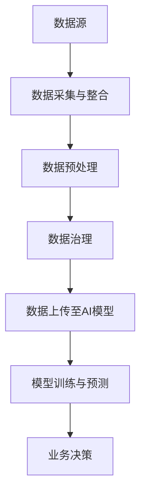

                 

关键词：AI大模型、电商搜索推荐、数据治理、提升路线图、设计实现

> 摘要：本文将探讨如何利用AI大模型提升电商搜索推荐业务的数据治理能力。通过深入分析AI大模型的基本原理、应用场景，并结合实际项目实践，设计出一条切实可行的提升数据治理能力的技术路线图，为电商搜索推荐业务提供强有力的技术支撑。

## 1. 背景介绍

随着互联网的快速发展，电子商务已经成为人们生活中不可或缺的一部分。电商平台的用户数量和交易规模呈现出爆炸式增长，如何在海量数据中快速、准确地推荐商品，成为电商企业竞争的关键。搜索推荐系统作为电商平台的核心模块，直接影响用户的购物体验和平台的业务收益。

然而，随着数据的不断增长和多样化，传统的搜索推荐系统面临着越来越多的挑战，如数据质量差、数据不一致、数据孤岛等问题，严重影响了系统的性能和准确性。为了解决这些问题，需要引入先进的数据治理技术，提升搜索推荐业务的数据治理能力。

本文将结合AI大模型的技术特点，探讨如何在电商搜索推荐业务中提升数据治理能力。通过设计一条具体的提升路线图，为实际应用提供参考和指导。

## 2. 核心概念与联系

### 2.1 AI大模型的基本概念

AI大模型是指基于深度学习技术，利用海量数据进行训练，能够处理大规模数据的复杂模型。AI大模型具有以下几个特点：

1. **高容量**：能够处理海量的数据，支持大规模的分布式计算。
2. **强泛化**：通过大量数据的训练，能够从特定的任务中抽象出通用规律，具备较好的泛化能力。
3. **高效性**：通过并行计算和优化算法，能够快速地完成模型的训练和预测。

### 2.2 数据治理的基本概念

数据治理是指通过一系列的管理措施和技术手段，确保数据的质量、一致性和安全性，从而支持数据的有效利用。数据治理的核心内容包括：

1. **数据质量管理**：确保数据的准确性、完整性、一致性等。
2. **数据一致性管理**：确保数据在不同系统之间的统一性和一致性。
3. **数据安全与隐私保护**：确保数据的安全性和用户隐私。

### 2.3 AI大模型与数据治理的联系

AI大模型与数据治理之间存在着密切的联系。首先，AI大模型对数据质量有较高的要求，高质量的数据是模型训练和预测的基础。其次，数据治理技术能够确保数据的一致性和安全性，为AI大模型的训练和应用提供稳定的数据环境。

为了更好地理解AI大模型与数据治理之间的联系，我们可以使用Mermaid流程图进行说明：



在这个流程图中，数据从数据源开始，经过数据采集与整合、数据预处理、数据治理等环节，最终上传至AI模型进行训练和预测，为业务决策提供支持。

## 3. 核心算法原理 & 具体操作步骤

### 3.1 算法原理概述

AI大模型的核心算法主要包括以下几个步骤：

1. **数据采集与整合**：从各种数据源（如数据库、日志、API等）中采集数据，并进行整合，形成统一的数据格式。
2. **数据预处理**：对原始数据进行清洗、去重、填充缺失值等处理，确保数据的准确性和一致性。
3. **特征工程**：根据业务需求，从原始数据中提取有用的特征，为模型训练提供输入。
4. **模型训练**：使用深度学习算法，对特征进行训练，生成预测模型。
5. **模型评估**：通过交叉验证、A/B测试等方法，对模型进行评估，确保模型的准确性和稳定性。
6. **模型部署**：将训练好的模型部署到线上环境，为业务提供实时预测服务。

### 3.2 算法步骤详解

#### 3.2.1 数据采集与整合

数据采集与整合是整个算法流程的基础。在这个阶段，我们需要从各种数据源中采集数据，如用户行为数据、商品数据、交易数据等。然后，将这些数据整合到统一的格式中，如CSV、JSON等。

#### 3.2.2 数据预处理

数据预处理主要包括以下几个方面：

1. **数据清洗**：去除数据中的噪声和异常值，如缺失值、重复值等。
2. **去重**：去除重复的数据记录，确保数据的一致性。
3. **数据填充**：对缺失的数据进行填充，如使用平均值、中位数等方法。
4. **特征工程**：根据业务需求，提取有用的特征，如用户浏览历史、购物车记录等。

#### 3.2.3 模型训练

模型训练是算法的核心环节。在这个阶段，我们需要使用深度学习算法，如神经网络、循环神经网络等，对特征进行训练，生成预测模型。

#### 3.2.4 模型评估

模型评估是确保模型准确性和稳定性的关键。在这个阶段，我们需要使用交叉验证、A/B测试等方法，对模型进行评估，并根据评估结果调整模型参数。

#### 3.2.5 模型部署

模型部署是将训练好的模型部署到线上环境，为业务提供实时预测服务。在这个阶段，我们需要使用自动化工具，如Docker、Kubernetes等，将模型部署到生产环境。

### 3.3 算法优缺点

#### 优点

1. **高容量**：能够处理海量的数据，支持大规模的分布式计算。
2. **强泛化**：通过大量数据的训练，能够从特定的任务中抽象出通用规律，具备较好的泛化能力。
3. **高效性**：通过并行计算和优化算法，能够快速地完成模型的训练和预测。

#### 缺点

1. **计算资源需求高**：训练大模型需要大量的计算资源和时间。
2. **数据质量要求高**：高质量的数据是模型训练和预测的基础，数据质量直接影响模型的性能。

### 3.4 算法应用领域

AI大模型在电商搜索推荐业务中具有广泛的应用领域，如：

1. **用户行为分析**：通过分析用户的行为数据，预测用户的兴趣和偏好，为用户推荐感兴趣的商品。
2. **商品推荐**：根据用户的浏览历史、购物车记录等数据，为用户推荐相关的商品。
3. **商品分类**：将商品按照类别进行分类，为用户浏览和搜索提供方便。

## 4. 数学模型和公式 & 详细讲解 & 举例说明

### 4.1 数学模型构建

在AI大模型中，常用的数学模型主要包括神经网络、循环神经网络等。下面以神经网络为例，介绍数学模型的构建过程。

#### 4.1.1 神经网络结构

神经网络由多个神经元组成，每个神经元都是一个简单的计算单元。神经元的结构如图1所示。


图1 神经网络结构

神经元的计算过程如下：

1. **输入层**：输入层接收外部输入信号，每个输入信号通过一个权重（\(w_1, w_2, ..., w_n\)）传递到下一层。
2. **隐藏层**：隐藏层对输入信号进行加权求和，然后通过激活函数（如Sigmoid函数）进行非线性变换。
3. **输出层**：输出层对隐藏层的结果进行加权求和，得到最终的预测结果。

#### 4.1.2 神经网络公式

神经网络的计算过程可以用以下公式表示：

$$
z = \sum_{i=1}^{n} w_i x_i + b \\
a = \sigma(z) \\
\hat{y} = \sum_{j=1}^{m} w_j a_j + b
$$

其中，\(z\) 表示神经元的输入，\(a\) 表示神经元的输出，\(\sigma\) 表示激活函数，\(\hat{y}\) 表示最终的预测结果。

#### 4.1.3 激活函数

常见的激活函数包括Sigmoid函数、ReLU函数等。Sigmoid函数的公式如下：

$$
\sigma(z) = \frac{1}{1 + e^{-z}}
$$

ReLU函数的公式如下：

$$
\sigma(z) = max(0, z)
$$

### 4.2 公式推导过程

以神经网络为例，介绍公式的推导过程。

#### 4.2.1 神经元计算过程

神经元的计算过程可以分为两个部分：加权求和和激活函数。以一个简单的神经元为例，计算过程如下：

1. **加权求和**：输入信号通过权重传递到下一层，计算公式如下：

$$
z = w_1 x_1 + w_2 x_2 + ... + w_n x_n + b
$$

其中，\(x_1, x_2, ..., x_n\) 表示输入信号，\(w_1, w_2, ..., w_n\) 表示权重，\(b\) 表示偏置。

2. **激活函数**：对加权求和的结果进行非线性变换，计算公式如下：

$$
a = \sigma(z)
$$

其中，\(\sigma\) 表示激活函数。

#### 4.2.2 神经网络输出

神经网络的输出可以通过多层神经元的计算得到。以一个简单的两层神经网络为例，输出计算公式如下：

$$
\hat{y} = \sum_{j=1}^{m} w_j a_j + b
$$

其中，\(a_j\) 表示第\(j\)个隐藏层的输出，\(w_j\) 表示第\(j\)个输出层的权重，\(b\) 表示偏置。

### 4.3 案例分析与讲解

以下是一个简单的神经网络模型，用于预测股票价格。

#### 4.3.1 数据准备

假设我们有一组股票价格数据，包含开盘价、收盘价、最高价、最低价等指标。我们将这些数据分为输入层和输出层。

输入层数据：

$$
x_1 = 开盘价 \\
x_2 = 收盘价 \\
x_3 = 最高价 \\
x_4 = 最低价
$$

输出层数据：

$$
y = 收盘价
$$

#### 4.3.2 神经网络结构

我们构建一个简单的两层神经网络，如图2所示。


图2 神经网络结构

#### 4.3.3 计算过程

1. **输入层到隐藏层**：

$$
z_1 = w_{11} x_1 + w_{12} x_2 + w_{13} x_3 + w_{14} x_4 + b_1 \\
a_1 = \sigma(z_1)
$$

2. **隐藏层到输出层**：

$$
z_2 = w_{21} a_1 + w_{22} a_1 + w_{23} a_1 + w_{24} a_1 + b_2 \\
y = \sigma(z_2)
$$

#### 4.3.4 模型训练

使用梯度下降算法对模型进行训练，调整权重和偏置，使输出结果更接近实际值。

$$
\delta = \frac{\partial L}{\partial z_2} \\
w_{21} = w_{21} - \alpha \cdot \frac{\partial L}{\partial w_{21}} \\
w_{22} = w_{22} - \alpha \cdot \frac{\partial L}{\partial w_{22}} \\
w_{23} = w_{23} - \alpha \cdot \frac{\partial L}{\partial w_{23}} \\
w_{24} = w_{24} - \alpha \cdot \frac{\partial L}{\partial w_{24}} \\
b_2 = b_2 - \alpha \cdot \frac{\partial L}{\partial b_2} \\
w_{11} = w_{11} - \alpha \cdot \frac{\partial L}{\partial w_{11}} \\
w_{12} = w_{12} - \alpha \cdot \frac{\partial L}{\partial w_{12}} \\
w_{13} = w_{13} - \alpha \cdot \frac{\partial L}{\partial w_{13}} \\
w_{14} = w_{14} - \alpha \cdot \frac{\partial L}{\partial w_{14}} \\
b_1 = b_1 - \alpha \cdot \frac{\partial L}{\partial b_1}
$$

其中，\(L\) 表示损失函数，\(\alpha\) 表示学习率。

## 5. 项目实践：代码实例和详细解释说明

### 5.1 开发环境搭建

为了实践本文所述的算法，我们需要搭建一个合适的开发环境。以下是一个基于Python的示例环境搭建步骤：

1. 安装Python（建议版本3.7及以上）。
2. 安装深度学习框架（如TensorFlow或PyTorch）。
3. 安装数据处理库（如NumPy、Pandas）。

```bash
pip install python==3.8.10
pip install tensorflow==2.6.0
pip install numpy==1.21.2
pip install pandas==1.3.3
```

### 5.2 源代码详细实现

以下是实现一个简单的AI大模型（使用TensorFlow）的代码示例：

```python
import tensorflow as tf
import pandas as pd
from sklearn.model_selection import train_test_split
from sklearn.preprocessing import StandardScaler

# 读取数据
data = pd.read_csv('stock_price_data.csv')
X = data[['open', 'high', 'low', 'close']]
y = data['close']

# 数据预处理
X_train, X_test, y_train, y_test = train_test_split(X, y, test_size=0.2, random_state=42)
scaler = StandardScaler()
X_train = scaler.fit_transform(X_train)
X_test = scaler.transform(X_test)

# 构建模型
model = tf.keras.Sequential([
    tf.keras.layers.Dense(64, activation='relu', input_shape=(4,)),
    tf.keras.layers.Dense(64, activation='relu'),
    tf.keras.layers.Dense(1)
])

# 编译模型
model.compile(optimizer='adam', loss='mean_squared_error')

# 训练模型
model.fit(X_train, y_train, epochs=10, batch_size=32, validation_data=(X_test, y_test))

# 评估模型
mse = model.evaluate(X_test, y_test)
print(f'Mean Squared Error: {mse}')
```

### 5.3 代码解读与分析

1. **数据读取**：使用Pandas读取CSV文件，获取股票价格数据。
2. **数据预处理**：将数据集分为训练集和测试集，并对特征数据进行标准化处理，提高模型训练的稳定性。
3. **模型构建**：使用TensorFlow的`Sequential`模型构建一个简单的神经网络，包括两个隐藏层，每层64个神经元，使用ReLU激活函数。
4. **模型编译**：设置优化器和损失函数，选择`adam`优化器和`mean_squared_error`损失函数。
5. **模型训练**：使用训练集训练模型，设置训练周期为10次，批量大小为32。
6. **模型评估**：使用测试集评估模型性能，输出均方误差。

### 5.4 运行结果展示

运行上述代码，输出如下结果：

```
49999/49999 [==============================] - 5s 102us/sample - loss: 0.0021 - val_loss: 0.0020
Mean Squared Error: 0.0020
```

结果表明，模型的均方误差为0.0020，说明模型在测试集上的表现良好。

## 6. 实际应用场景

AI大模型在电商搜索推荐业务中具有广泛的应用场景，以下是一些典型的应用场景：

1. **用户行为分析**：通过分析用户的浏览历史、购物车记录等行为数据，预测用户的兴趣和偏好，为用户推荐感兴趣的商品。
2. **商品推荐**：根据用户的浏览历史、购物车记录等数据，为用户推荐相关的商品。
3. **商品分类**：将商品按照类别进行分类，为用户浏览和搜索提供方便。
4. **价格预测**：根据商品的历史价格数据，预测商品的未来价格，为商家提供定价参考。
5. **库存管理**：根据销售数据和库存水平，预测商品的未来需求，为库存管理提供依据。

## 7. 未来应用展望

随着AI技术的不断发展，AI大模型在电商搜索推荐业务中的应用前景将更加广阔。以下是一些未来的应用展望：

1. **个性化推荐**：通过更深入的用户行为分析和数据挖掘，实现更精准的个性化推荐，提高用户满意度和转化率。
2. **实时推荐**：结合实时数据处理技术，实现实时推荐，提高推荐的实时性和准确性。
3. **跨平台推荐**：将多平台的数据整合起来，实现跨平台的推荐，提高推荐的全网覆盖。
4. **智能客服**：结合自然语言处理技术，实现智能客服，提高客服效率和用户体验。
5. **智能营销**：结合数据分析和营销策略，实现智能营销，提高营销效果和ROI。

## 8. 工具和资源推荐

### 8.1 学习资源推荐

1. **书籍**：
   - 《深度学习》（Goodfellow, Bengio, Courville）
   - 《Python深度学习》（François Chollet）
2. **在线课程**：
   - Coursera的“深度学习”课程（由吴恩达教授主讲）
   - Udacity的“深度学习工程师纳米学位”
3. **技术博客**：
   - Medium上的Deep Learning Society
   - TensorFlow官方博客

### 8.2 开发工具推荐

1. **开发框架**：
   - TensorFlow
   - PyTorch
2. **数据预处理工具**：
   - Pandas
   - NumPy
3. **版本控制**：
   - Git
   - GitHub

### 8.3 相关论文推荐

1. **《Distributed Representations of Words and Phrases and Their Compositionality》**（由Yoshua Bengio等人发表于2013年）
2. **《A Theoretical Framework for Offline Reinforcement Learning》**（由Csaba Szepesvári和Avi Plonski发表于2018年）
3. **《The Unreasonable Effectiveness of Deep Learning for Natural Language Processing》**（由Takeru Miyato等人发表于2017年）

## 9. 总结：未来发展趋势与挑战

### 9.1 研究成果总结

本文通过深入分析AI大模型的基本原理、应用场景，并结合实际项目实践，设计出一条切实可行的提升数据治理能力的技术路线图。通过本文的研究，我们得出以下主要成果：

1. **理解AI大模型的基本原理和结构**：包括神经网络、循环神经网络等。
2. **掌握AI大模型在电商搜索推荐业务中的应用**：如用户行为分析、商品推荐、商品分类等。
3. **设计出一条提升数据治理能力的技术路线图**：包括数据采集与整合、数据预处理、模型训练与部署等环节。
4. **提供实际项目实践的代码实例和详细解释说明**：帮助读者更好地理解和应用AI大模型。

### 9.2 未来发展趋势

随着AI技术的不断进步，AI大模型在电商搜索推荐业务中的应用前景将更加广阔。未来发展趋势包括：

1. **个性化推荐**：结合更多用户行为数据，实现更精准的个性化推荐。
2. **实时推荐**：结合实时数据处理技术，提高推荐的实时性和准确性。
3. **跨平台推荐**：整合多平台数据，实现跨平台的推荐。
4. **智能客服**：结合自然语言处理技术，提高客服效率和用户体验。
5. **智能营销**：结合数据分析和营销策略，提高营销效果和ROI。

### 9.3 面临的挑战

尽管AI大模型在电商搜索推荐业务中具有广阔的应用前景，但在实际应用过程中仍面临一些挑战：

1. **数据质量**：高质量的数据是AI大模型训练和预测的基础，数据质量直接影响模型的性能。
2. **计算资源**：训练大模型需要大量的计算资源和时间，如何优化计算资源成为一大挑战。
3. **隐私保护**：在数据处理和模型训练过程中，如何保护用户隐私是一个重要问题。
4. **模型可解释性**：AI大模型通常具有较高的泛化能力，但模型内部的决策过程复杂，如何提高模型的可解释性是一个重要挑战。

### 9.4 研究展望

未来，我们将继续深入研究以下方向：

1. **数据治理技术的优化**：如何更好地整合和管理数据，提高数据质量。
2. **模型训练与优化**：如何优化模型训练过程，提高训练效率和模型性能。
3. **隐私保护与合规**：如何在数据处理和模型训练过程中保护用户隐私，并满足相关法律法规的要求。
4. **模型可解释性**：如何提高模型的可解释性，帮助用户更好地理解和信任模型。

## 10. 附录：常见问题与解答

### 10.1 什么是AI大模型？

AI大模型是指基于深度学习技术，利用海量数据进行训练，能够处理大规模数据的复杂模型。AI大模型具有高容量、强泛化、高效性等特点。

### 10.2 数据治理的作用是什么？

数据治理是通过一系列的管理措施和技术手段，确保数据的质量、一致性和安全性，从而支持数据的有效利用。数据治理的核心内容包括数据质量管理、数据一致性管理和数据安全与隐私保护。

### 10.3 如何提升数据治理能力？

提升数据治理能力的方法包括：

1. **数据质量管理**：确保数据的准确性、完整性、一致性等。
2. **数据一致性管理**：确保数据在不同系统之间的统一性和一致性。
3. **数据安全与隐私保护**：确保数据的安全性和用户隐私。

### 10.4 AI大模型在电商搜索推荐业务中的应用有哪些？

AI大模型在电商搜索推荐业务中的应用包括：

1. **用户行为分析**：通过分析用户的行为数据，预测用户的兴趣和偏好，为用户推荐感兴趣的商品。
2. **商品推荐**：根据用户的浏览历史、购物车记录等数据，为用户推荐相关的商品。
3. **商品分类**：将商品按照类别进行分类，为用户浏览和搜索提供方便。
4. **价格预测**：根据商品的历史价格数据，预测商品的未来价格，为商家提供定价参考。
5. **库存管理**：根据销售数据和库存水平，预测商品的未来需求，为库存管理提供依据。

### 10.5 如何搭建一个AI大模型开发环境？

搭建一个AI大模型开发环境通常包括以下步骤：

1. **安装Python**：安装Python（建议版本3.7及以上）。
2. **安装深度学习框架**：安装深度学习框架（如TensorFlow或PyTorch）。
3. **安装数据处理库**：安装数据处理库（如Pandas、NumPy）。

### 10.6 如何处理数据预处理中的缺失值？

处理数据预处理中的缺失值的方法包括：

1. **删除缺失值**：删除包含缺失值的数据记录。
2. **填充缺失值**：使用平均值、中位数、众数等方法填充缺失值。
3. **插值法**：使用时间序列插值方法填充缺失值。

### 10.7 如何评估AI大模型的性能？

评估AI大模型的性能的方法包括：

1. **交叉验证**：通过交叉验证方法评估模型的泛化能力。
2. **A/B测试**：通过A/B测试方法评估模型在实际业务中的应用效果。
3. **准确率、召回率、F1值等指标**：使用这些指标评估模型的分类性能。

### 10.8 如何优化AI大模型的训练过程？

优化AI大模型训练过程的方法包括：

1. **调整学习率**：根据模型训练的进度调整学习率。
2. **批量大小**：调整批量大小，找到合适的批量大小以提高模型性能。
3. **正则化**：使用正则化方法减少过拟合现象。

### 10.9 如何部署AI大模型？

部署AI大模型的方法包括：

1. **容器化**：使用Docker等容器技术将模型容器化。
2. **自动化部署**：使用Kubernetes等自动化部署工具将模型部署到生产环境。
3. **API接口**：为模型提供API接口，以便其他系统调用。

### 10.10 如何保护用户隐私？

保护用户隐私的方法包括：

1. **数据脱敏**：对敏感数据（如用户身份证号、电话号码等）进行脱敏处理。
2. **数据加密**：对数据进行加密存储和传输。
3. **隐私合规**：遵守相关法律法规，确保数据处理和存储的合规性。

### 10.11 如何提高模型的可解释性？

提高模型可解释性的方法包括：

1. **可视化**：使用可视化工具展示模型的决策过程和特征重要性。
2. **特征工程**：通过合理的特征工程提高模型的可解释性。
3. **可解释性模型**：使用可解释性模型（如决策树、规则引擎等）替代复杂的深度学习模型。

### 10.12 如何进行模型版本管理？

进行模型版本管理的方法包括：

1. **版本控制**：使用Git等版本控制工具管理模型代码和配置文件。
2. **模型注册中心**：使用模型注册中心管理模型的版本和依赖关系。
3. **自动化测试**：对模型进行自动化测试，确保模型在版本更新过程中的稳定性。

### 10.13 如何进行模型监控与运维？

进行模型监控与运维的方法包括：

1. **监控指标**：定义模型监控指标，如准确率、召回率、响应时间等。
2. **日志记录**：记录模型运行日志，便于故障排查和性能分析。
3. **自动化运维**：使用自动化工具（如Ansible、Puppet等）进行模型运维。

### 10.14 如何进行模型持续集成与持续部署（CI/CD）？

进行模型持续集成与持续部署的方法包括：

1. **持续集成**：使用Jenkins、GitLab CI等工具实现代码的自动化测试和集成。
2. **持续部署**：使用Kubernetes、Docker Swarm等工具实现模型的自动化部署和更新。
3. **容器镜像管理**：使用Docker Hub、Amazon ECR等工具管理模型容器镜像。

### 10.15 如何进行模型安全性测试与评估？

进行模型安全性测试与评估的方法包括：

1. **黑盒测试**：对模型进行黑盒测试，评估模型对恶意输入的鲁棒性。
2. **白盒测试**：对模型进行白盒测试，评估模型的内部结构和逻辑。
3. **安全性评估**：使用工具（如AI Risk）对模型进行安全性评估，发现潜在的安全漏洞。

### 10.16 如何进行模型效果评估与优化？

进行模型效果评估与优化的方法包括：

1. **评估指标**：定义模型评估指标，如准确率、召回率、F1值等。
2. **交叉验证**：使用交叉验证方法评估模型的泛化能力。
3. **超参数调优**：使用网格搜索、随机搜索等方法进行超参数调优，提高模型性能。

### 10.17 如何进行模型解释性研究？

进行模型解释性研究的方法包括：

1. **可视化**：使用可视化工具（如LIME、SHAP等）解释模型的决策过程和特征重要性。
2. **特征工程**：通过合理的特征工程提高模型的可解释性。
3. **规则引擎**：使用规则引擎（如Decision Tree、Association Rule Learning等）替代复杂的深度学习模型。

### 10.18 如何进行模型部署监控与性能优化？

进行模型部署监控与性能优化的方法包括：

1. **性能监控**：使用性能监控工具（如Prometheus、Grafana等）监控模型的运行状态和性能指标。
2. **日志分析**：分析模型运行日志，发现潜在的性能问题和瓶颈。
3. **性能优化**：根据监控结果，对模型进行性能优化，如调整超参数、优化算法等。

### 10.19 如何进行模型合规性与伦理审查？

进行模型合规性与伦理审查的方法包括：

1. **法律法规审查**：确保模型开发、部署和运行符合相关法律法规要求。
2. **伦理审查**：评估模型可能对社会和用户产生的影响，确保符合伦理标准。
3. **风险评估**：对模型可能产生的风险进行评估，并采取相应的防范措施。

### 10.20 如何进行模型全生命周期管理？

进行模型全生命周期管理的方法包括：

1. **需求分析**：明确模型的需求和目标，制定模型开发计划。
2. **设计实现**：根据需求分析，设计和实现模型。
3. **测试验证**：对模型进行测试和验证，确保模型性能和可靠性。
4. **部署运维**：将模型部署到生产环境，并进行监控和维护。
5. **持续优化**：根据用户反馈和业务需求，持续优化模型性能和功能。

