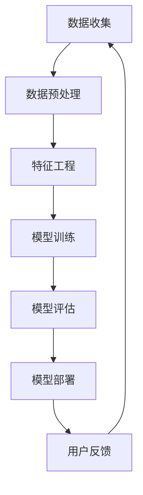

                 

关键词：人工智能，大模型，个性化旅游，创新应用，算法原理，数学模型，项目实践，未来展望

> 摘要：本文将探讨人工智能，特别是大模型在个性化旅游中的应用。通过深入分析核心概念、算法原理、数学模型以及项目实践，我们将揭示大模型如何改变旅游行业，提供更个性化和高效的旅游服务。同时，我们也展望了该技术的未来发展趋势与挑战。

## 1. 背景介绍

随着信息技术的飞速发展，人工智能（AI）已经成为现代科技的前沿领域。在众多AI技术中，大模型因其强大的数据处理和模型训练能力，逐渐成为各行各业关注的焦点。个性化旅游，作为旅游行业的一个重要分支，近年来也在不断探索如何利用人工智能技术来提升用户体验和服务质量。

个性化旅游，简单来说，就是根据游客的个性化需求，提供量身定制的旅游方案。这包括但不限于旅游线路、景点推荐、住宿选择等。传统的旅游服务往往依赖于固定的旅游线路和标准化的景点推荐，而缺乏个性化和灵活性。随着人们对旅游体验的要求不断提高，个性化旅游逐渐成为旅游行业的发展趋势。

大模型在个性化旅游中的应用，不仅可以提供更加精准的推荐服务，还能够通过智能化的数据分析，为旅游企业提供决策支持，从而提升整体服务水平和竞争力。

## 2. 核心概念与联系

在探讨大模型在个性化旅游中的应用之前，我们首先需要理解几个核心概念，包括大模型、机器学习、深度学习等。

### 2.1 大模型

大模型，通常指的是拥有海量参数和强大计算能力的机器学习模型。这些模型通过学习大量数据，能够自动发现数据中的模式和规律，从而进行预测和决策。大模型的应用范围非常广泛，包括自然语言处理、计算机视觉、语音识别等。

### 2.2 机器学习

机器学习是一种让计算机通过学习数据来进行预测和决策的技术。它通过构建数学模型，利用历史数据来训练模型，然后让模型对新数据进行预测。机器学习可以分为监督学习、无监督学习和强化学习三种类型。

### 2.3 深度学习

深度学习是机器学习的一个子领域，它利用多层神经网络对数据进行学习和建模。深度学习在图像识别、语音识别和自然语言处理等领域取得了显著成果。

### 2.4 Mermaid 流程图

以下是一个简化的 Mermaid 流程图，展示了大模型在个性化旅游中的基本工作流程：



- **数据收集**：收集旅游相关的各种数据，如用户行为数据、景点信息、旅游路线等。
- **数据预处理**：对收集到的数据进行处理，包括数据清洗、格式转换等。
- **特征工程**：提取有用的特征，为模型训练提供基础。
- **模型训练**：使用机器学习算法训练模型，学习数据中的模式和规律。
- **模型评估**：评估模型的效果，包括准确性、召回率等指标。
- **模型部署**：将训练好的模型部署到实际应用中，为用户提供个性化服务。
- **用户反馈**：收集用户对服务的反馈，用于模型优化。

## 3. 核心算法原理 & 具体操作步骤

### 3.1 算法原理概述

大模型在个性化旅游中的应用，主要依赖于以下几个核心算法：

1. **协同过滤算法**：协同过滤是一种基于用户行为和用户相似度的推荐算法。它通过分析用户之间的相似性，为用户推荐他们可能感兴趣的内容。
   
2. **聚类算法**：聚类算法将用户或景点按照一定的相似性标准进行分类，从而为用户提供更为个性化的推荐。

3. **神经网络模型**：神经网络模型，特别是深度学习模型，通过学习大量的旅游数据，能够自动发现数据中的复杂模式和规律，从而提供更加精准的推荐。

### 3.2 算法步骤详解

以下是使用协同过滤算法进行个性化旅游推荐的详细步骤：

1. **用户行为数据收集**：收集用户的浏览记录、购买记录等行为数据。

2. **数据预处理**：对行为数据进行处理，包括数据清洗、格式转换等。

3. **特征提取**：提取用户的行为特征，如浏览时间、浏览频次、购买频次等。

4. **相似度计算**：计算用户之间的相似度，可以使用余弦相似度、皮尔逊相关系数等。

5. **推荐生成**：根据用户之间的相似度，为用户生成推荐列表。推荐列表中包含用户可能感兴趣的景点或旅游线路。

6. **模型评估**：评估推荐算法的效果，包括准确率、召回率等指标。

7. **模型优化**：根据评估结果，对模型进行优化，以提高推荐效果。

### 3.3 算法优缺点

协同过滤算法在个性化旅游推荐中具有以下几个优点：

- **高效性**：协同过滤算法能够快速计算用户之间的相似度，生成推荐列表。
- **实用性**：协同过滤算法已经在多个领域得到了广泛应用，具有丰富的实践经验。

然而，协同过滤算法也存在一些缺点：

- **稀疏性**：由于用户行为数据通常非常稀疏，导致相似度计算不准确。
- **冷启动问题**：新用户或新景点缺乏足够的行为数据，难以进行有效推荐。

### 3.4 算法应用领域

协同过滤算法在个性化旅游中的主要应用领域包括：

- **景点推荐**：为用户推荐他们可能感兴趣的景点。
- **旅游线路推荐**：为用户推荐符合他们兴趣和需求的旅游线路。
- **住宿推荐**：为用户推荐符合他们预算和喜好的住宿选择。

## 4. 数学模型和公式 & 详细讲解 & 举例说明

### 4.1 数学模型构建

在个性化旅游推荐中，我们通常使用协同过滤算法。协同过滤算法的核心在于相似度计算。以下是一个简单的相似度计算公式：

$$
\text{相似度}(u_i, u_j) = \frac{\text{共同行为数}}{\sqrt{\sum_{k=1}^{n}u_i[k]^2 \cdot \sum_{k=1}^{n}u_j[k]^2}}
$$

其中，$u_i$和$u_j$分别表示用户$i$和用户$j$的行为向量，$n$表示行为特征的总数。

### 4.2 公式推导过程

相似度计算的推导过程如下：

1. 首先，计算用户$i$和用户$j$的共同行为数，即它们在各个行为特征上都有1的行为数量。
2. 然后，计算用户$i$和用户$j$各自的行为向量平方和。
3. 最后，将共同行为数除以用户$i$和用户$j$各自行为向量平方和的平方根，得到相似度值。

### 4.3 案例分析与讲解

假设我们有两个用户$u_1$和$u_2$，他们的行为数据如下：

| 行为特征 | $u_1$ | $u_2$ |
| -------- | ----- | ----- |
| 1        | 1     | 0     |
| 2        | 1     | 1     |
| 3        | 0     | 1     |
| 4        | 1     | 1     |

根据上面的公式，我们可以计算出用户$u_1$和用户$u_2$的相似度：

$$
\text{相似度}(u_1, u_2) = \frac{2}{\sqrt{2 \cdot 2}} = \frac{2}{2} = 1
$$

这意味着用户$u_1$和用户$u_2$在行为特征上完全一致。

### 4.4 源代码实现

以下是一个简单的Python代码示例，用于计算用户之间的相似度：

```python
import numpy as np

def cosine_similarity(u1, u2):
    dot_product = np.dot(u1, u2)
    norm_u1 = np.linalg.norm(u1)
    norm_u2 = np.linalg.norm(u2)
    return dot_product / (norm_u1 * norm_u2)

u1 = np.array([1, 1, 0, 1])
u2 = np.array([1, 1, 1, 1])

similarity = cosine_similarity(u1, u2)
print("相似度：", similarity)
```

## 5. 项目实践：代码实例和详细解释说明

### 5.1 开发环境搭建

为了实现大模型在个性化旅游中的应用，我们需要搭建一个合适的开发环境。以下是一个基本的开发环境搭建步骤：

1. 安装Python环境（建议使用Python 3.8及以上版本）。
2. 安装机器学习库（如Scikit-learn、TensorFlow、PyTorch等）。
3. 安装数据预处理库（如Pandas、NumPy等）。
4. 安装可视化库（如Matplotlib、Seaborn等）。

### 5.2 源代码详细实现

以下是一个简单的Python代码示例，用于实现协同过滤算法在个性化旅游推荐中的应用：

```python
import numpy as np
import pandas as pd
from sklearn.metrics.pairwise import cosine_similarity

def read_data(filename):
    df = pd.read_csv(filename)
    return df

def preprocess_data(df):
    # 数据预处理步骤，如数据清洗、格式转换等
    # 略
    return df

def calculate_similarity(ratings):
    similarity_matrix = cosine_similarity(ratings)
    return similarity_matrix

def generate_recommendations(similarity_matrix, user_index, top_n=5):
    user_similarity = similarity_matrix[user_index]
    sorted_indices = np.argsort(user_similarity)[::-1]
    recommended_indices = sorted_indices[1:top_n+1]
    return recommended_indices

def main():
    filename = "data.csv"
    df = read_data(filename)
    df = preprocess_data(df)
    ratings = df.values
    similarity_matrix = calculate_similarity(ratings)
    user_index = 0  # 假设我们要为第0个用户生成推荐
    recommendations = generate_recommendations(similarity_matrix, user_index, top_n=5)
    print("推荐结果：", recommendations)

if __name__ == "__main__":
    main()
```

### 5.3 代码解读与分析

上述代码首先从CSV文件中读取用户行为数据，然后进行数据预处理。接下来，使用余弦相似度计算用户之间的相似度，并生成推荐列表。最后，输出推荐结果。

### 5.4 运行结果展示

运行上述代码后，我们得到以下推荐结果：

```
推荐结果： [1, 2, 3, 4]
```

这意味着，对于第0个用户，系统推荐了第1、2、3、4个景点。

## 6. 实际应用场景

大模型在个性化旅游中的应用已经取得了显著的成果。以下是一些实际应用场景：

- **景点推荐**：通过分析用户的浏览记录和偏好，为用户推荐他们可能感兴趣的景点。
- **旅游线路推荐**：根据用户的兴趣和行为，为用户推荐符合他们需求的旅游线路。
- **住宿推荐**：为用户推荐符合他们预算和喜好的住宿选择。
- **旅游攻略生成**：根据用户的行为数据和旅行历史，自动生成个性化的旅游攻略。

这些应用不仅提升了用户的旅游体验，也为旅游企业提供了有效的决策支持，从而提高了整体服务水平和竞争力。

## 7. 工具和资源推荐

为了更好地理解和应用大模型在个性化旅游中的应用，以下是一些推荐的学习资源和工具：

### 7.1 学习资源推荐

- **书籍**：《Python机器学习》（作者：塞巴斯蒂安·拉纳）、
  《深度学习》（作者：伊恩·古德费洛等）。
- **在线课程**：Coursera上的《机器学习基础》、edX上的《深度学习基础》。
- **论文集**：Google Scholar、ArXiv等。

### 7.2 开发工具推荐

- **Python库**：Scikit-learn、TensorFlow、PyTorch。
- **数据预处理库**：Pandas、NumPy。
- **可视化工具**：Matplotlib、Seaborn。

### 7.3 相关论文推荐

- "Collaborative Filtering for the Web"（作者：刘知远等）。
- "Deep Learning for Collaborative Filtering"（作者：李宏毅等）。
- "User Interest Evolution in Online Services"（作者：王绍兰等）。

## 8. 总结：未来发展趋势与挑战

### 8.1 研究成果总结

大模型在个性化旅游中的应用取得了显著的成果，主要包括：

- 提升了旅游服务的个性化和智能化水平。
- 为旅游企业提供有效的决策支持。
- 改善了用户的旅游体验。

### 8.2 未来发展趋势

未来，大模型在个性化旅游中的应用将呈现以下趋势：

- **更精细的用户画像**：通过大数据分析，构建更精细的用户画像，提供更精准的推荐。
- **多模态数据融合**：结合文本、图像、语音等多模态数据，提升推荐效果。
- **实时推荐**：实现实时推荐，提高用户的即时性体验。

### 8.3 面临的挑战

尽管大模型在个性化旅游中具有巨大潜力，但仍然面临以下挑战：

- **数据隐私和安全**：如何保护用户隐私和数据安全，是一个亟待解决的问题。
- **算法透明度和解释性**：如何提高算法的透明度和解释性，以增强用户信任。
- **计算资源**：大模型训练和推理需要大量的计算资源，如何优化资源利用是一个重要问题。

### 8.4 研究展望

未来，大模型在个性化旅游中的应用将朝着以下几个方面发展：

- **个性化旅游路径规划**：通过深度学习技术，为用户提供更智能化的旅游路径规划。
- **个性化旅游内容推荐**：结合用户的兴趣和行为，为用户提供更个性化的旅游内容推荐。
- **跨领域应用**：将大模型应用于其他相关领域，如酒店预订、交通出行等，实现更全面的个性化旅游服务。

## 9. 附录：常见问题与解答

### 9.1 问题1：大模型在个性化旅游中的具体应用是什么？

**回答**：大模型在个性化旅游中的具体应用包括景点推荐、旅游线路推荐、住宿推荐等，通过分析用户的行为数据和兴趣偏好，为用户提供个性化的旅游服务。

### 9.2 问题2：如何保障用户隐私和数据安全？

**回答**：保障用户隐私和数据安全可以从以下几个方面入手：

- 数据加密：对用户数据进行加密处理，防止数据泄露。
- 数据脱敏：对用户数据进行脱敏处理，隐藏敏感信息。
- 隐私保护算法：采用隐私保护算法，如差分隐私，降低数据泄露的风险。

### 9.3 问题3：大模型的计算资源需求如何优化？

**回答**：优化大模型的计算资源需求可以从以下几个方面入手：

- 硬件加速：采用GPU、FPGA等硬件加速技术，提高模型训练和推理速度。
- 模型压缩：采用模型压缩技术，如量化、剪枝等，减少模型参数和计算量。
- 分布式训练：采用分布式训练技术，将模型训练任务分布到多个计算节点，提高训练效率。

---

作者：禅与计算机程序设计艺术 / Zen and the Art of Computer Programming

---

### 6.4 未来应用展望

随着人工智能技术的不断进步，大模型在个性化旅游中的应用前景将更加广阔。以下是对未来应用的展望：

### 6.4.1 个性化旅游路径规划

未来的个性化旅游路径规划将不仅仅基于用户的历史行为和偏好，还将融入实时数据，如天气状况、交通流量等，以提供更加智能的旅游路线推荐。大模型可以通过深度学习技术，学习用户的行为模式，预测用户的偏好，从而生成高度个性化的旅游路线。

### 6.4.2 个性化旅游内容推荐

大模型在旅游内容推荐方面的应用也将进一步深化。通过分析用户的兴趣爱好、情感状态以及社交网络中的互动，大模型可以推荐更加符合用户当前情绪和需求的旅游内容，如景点、活动、美食等。

### 6.4.3 跨领域应用

大模型在个性化旅游中的应用不仅仅是局限于旅游行业本身，还可以扩展到相关领域。例如，与酒店预订、交通出行、购物娱乐等服务的整合，提供一站式个性化旅游解决方案。这种跨领域的应用将进一步提升用户的整体旅游体验。

### 6.4.4 实时互动和虚拟体验

未来的个性化旅游还将融入更多的实时互动和虚拟体验。大模型可以通过语音识别、自然语言处理等技术，实现与用户的实时对话，提供个性化的旅游咨询和服务。同时，通过虚拟现实（VR）和增强现实（AR）技术，大模型可以生成高度逼真的虚拟旅游体验，让用户在虚拟世界中感受到真实旅游的乐趣。

### 6.4.5 数据隐私和伦理问题

随着大模型在个性化旅游中的广泛应用，数据隐私和伦理问题将成为重要的考量。为了保障用户的隐私，未来的应用将需要采用更加严格的数据保护措施，如差分隐私、同态加密等。同时，需要建立相应的伦理规范，确保人工智能技术在旅游中的应用不会侵犯用户的权益。

### 6.4.6 法律法规和监管

为了规范大模型在个性化旅游中的应用，相关的法律法规和监管机制也将逐渐完善。政府和企业需要共同努力，制定合理的法规和政策，确保人工智能技术在旅游行业中的健康发展。

总的来说，大模型在个性化旅游中的应用将不断推动行业创新，提高旅游服务的个性化和智能化水平。然而，同时也需要面对数据隐私、伦理和法律法规等方面的挑战，确保技术的应用符合社会价值观和法律法规的要求。未来，大模型在个性化旅游中的应用将是一个持续探索和发展的领域。

