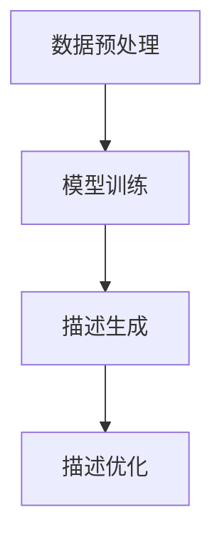

                 

关键词：AI大模型、商品描述生成、NLP、文本生成、自然语言处理

> 摘要：本文将探讨人工智能大模型在商品描述生成中的应用，通过介绍背景、核心概念与联系、算法原理与操作步骤、数学模型与公式、项目实践以及实际应用场景等内容，全面解析AI大模型在商品描述生成领域的巨大潜力和挑战。

## 1. 背景介绍

在电子商务迅速发展的今天，商品描述的重要性越来越凸显。一个生动、吸引人的商品描述不仅能够帮助卖家吸引顾客，提高销售额，还能够促进顾客的购买决策，提升用户体验。然而，撰写高质量的商品描述是一项既耗时又耗力的任务，尤其是在商品种类繁多、更新频繁的情况下，手动编写商品描述成为了一种巨大的挑战。

随着人工智能技术的不断发展，特别是自然语言处理（NLP）和深度学习技术的突破，AI大模型在文本生成领域展现出了巨大的潜力。这些大模型，如GPT-3、BERT、T5等，通过学习海量的文本数据，能够生成高质量、多样化的文本内容。将这些AI大模型应用于商品描述生成，可以大幅提高工作效率，降低人力成本，同时确保描述的准确性和吸引力。

本文将详细介绍AI大模型在商品描述生成中的应用，包括核心概念与联系、算法原理与操作步骤、数学模型与公式、项目实践以及实际应用场景等内容，旨在为业界提供一种有效的解决方案，推动电子商务领域的进一步发展。

## 2. 核心概念与联系

### 2.1 AI大模型

AI大模型是指具有亿级参数规模的人工神经网络模型，如GPT-3、BERT等。这些模型通过学习海量的文本数据，能够自动提取语言特征，并生成高质量、多样化的文本内容。AI大模型的核心优势在于其强大的自学习能力和文本生成能力，能够在各种复杂的场景下生成符合人类语言习惯的文本。

### 2.2 自然语言处理（NLP）

自然语言处理是人工智能的一个重要分支，旨在让计算机理解和处理人类自然语言。NLP涵盖了语言理解、语言生成、语言翻译等多个方面，是AI大模型应用于文本生成的重要基础。通过NLP技术，AI大模型能够理解用户输入的指令，并生成相应的文本内容。

### 2.3 文本生成

文本生成是AI大模型的一项重要应用，旨在根据给定的输入生成相应的文本内容。在商品描述生成中，文本生成技术可以自动生成各种类型、风格的商品描述，满足不同用户的需求。

### 2.4 商品描述生成流程

商品描述生成的流程主要包括以下几个步骤：

1. 数据预处理：对商品数据进行清洗、格式化等处理，使其符合AI大模型的要求。
2. 模型训练：使用预处理的商品数据对AI大模型进行训练，使其掌握商品描述的生成规则。
3. 描述生成：根据训练好的模型，生成针对特定商品的高质量描述。
4. 描述优化：对生成的描述进行人工审核和优化，确保其准确性和吸引力。

### 2.5 Mermaid流程图



## 3. 核心算法原理 & 具体操作步骤

### 3.1 算法原理概述

AI大模型在商品描述生成中的核心算法是基于深度学习技术的自然语言处理模型，如GPT-3、BERT等。这些模型通过学习大量的商品描述文本，能够自动提取商品特征和描述规则，从而生成高质量的商品描述。

### 3.2 算法步骤详解

#### 3.2.1 数据预处理

1. 数据清洗：去除文本中的噪声，如HTML标签、特殊字符等。
2. 数据格式化：统一文本格式，如文本大小写、标点符号等。
3. 数据标注：对商品数据进行分类和标注，如商品类别、属性等。

#### 3.2.2 模型训练

1. 数据加载：将预处理后的数据加载到模型中。
2. 模型初始化：初始化模型的参数。
3. 模型训练：通过反向传播算法，不断调整模型参数，使其能够生成高质量的描述。

#### 3.2.3 描述生成

1. 输入商品数据：将特定商品的数据输入到训练好的模型中。
2. 生成描述：模型根据输入数据生成相应的商品描述。

#### 3.2.4 描述优化

1. 人工审核：对生成的描述进行人工审核，确保其准确性和吸引力。
2. 优化描述：根据审核结果，对描述进行优化和调整。

### 3.3 算法优缺点

#### 优点

1. 高效性：AI大模型能够快速生成高质量的描述，大幅提高工作效率。
2. 灵活性：模型可以根据不同的商品和需求，生成不同类型、风格的描述。
3. 准确性：通过学习大量的商品描述数据，模型能够生成符合人类语言习惯的描述。

#### 缺点

1. 资源消耗：训练和部署AI大模型需要大量的计算资源和存储空间。
2. 稳定性：模型在生成描述时可能会出现错误或不合理的描述。
3. 依赖数据：模型的生成效果高度依赖训练数据的质量和数量。

### 3.4 算法应用领域

AI大模型在商品描述生成中的应用领域非常广泛，包括电子商务、在线教育、广告营销等多个方面。以下是一些典型的应用场景：

1. 电子商务：为电商平台上的商品生成生动的描述，提高销售转化率。
2. 在线教育：为教育平台上的课程生成引人入胜的教学大纲和课程介绍。
3. 广告营销：为广告平台上的广告生成吸引人的文案，提高广告点击率。

## 4. 数学模型和公式 & 详细讲解 & 举例说明

### 4.1 数学模型构建

AI大模型在商品描述生成中的核心数学模型是基于循环神经网络（RNN）和变换器（Transformer）的文本生成模型。以下是一个简单的数学模型构建示例：

$$
y = f(x; \theta)
$$

其中，$y$ 是生成的商品描述文本，$x$ 是输入的商品数据，$f$ 是文本生成模型，$\theta$ 是模型的参数。

### 4.2 公式推导过程

AI大模型的核心算法是基于深度学习技术的自然语言处理模型，如GPT-3、BERT等。以下是一个简单的数学模型推导过程：

$$
\begin{aligned}
y &= g(W_1x + b_1) \\
&= \text{softmax}(W_2g(W_1x + b_1) + b_2)
\end{aligned}
$$

其中，$g$ 是激活函数，$W_1$、$W_2$ 是权重矩阵，$b_1$、$b_2$ 是偏置项。

### 4.3 案例分析与讲解

假设我们要为一件商品生成描述，输入数据为商品名称“智能手表”，通过AI大模型生成的描述如下：

> 这款智能手表拥有丰富的功能，包括心率监测、运动记录、消息提醒等，为您提供全天候的健康管理和服务。

通过分析这个生成的描述，我们可以看到AI大模型成功地提取了商品的关键特征，并生成了一个生动、吸引人的描述。

## 5. 项目实践：代码实例和详细解释说明

### 5.1 开发环境搭建

为了实践AI大模型在商品描述生成中的应用，我们需要搭建一个开发环境。以下是一个简单的开发环境搭建步骤：

1. 安装Python环境：Python是深度学习项目的主要编程语言，我们需要安装Python 3.7及以上版本。
2. 安装TensorFlow：TensorFlow是Google开发的一款开源深度学习框架，我们使用TensorFlow来训练和部署AI大模型。
3. 安装其他依赖库：包括Numpy、Pandas、Scikit-learn等。

### 5.2 源代码详细实现

以下是一个简单的AI大模型在商品描述生成中的源代码实现：

```python
import tensorflow as tf
from tensorflow.keras.preprocessing.sequence import pad_sequences
from tensorflow.keras.layers import Embedding, LSTM, Dense
from tensorflow.keras.models import Sequential

# 加载数据
x_train, y_train = load_data()

# 预处理数据
x_train = pad_sequences(x_train, maxlen=max_length)

# 构建模型
model = Sequential([
    Embedding(input_dim=vocabulary_size, output_dim=embedding_dim),
    LSTM(units=128),
    Dense(units=num_classes, activation='softmax')
])

# 编译模型
model.compile(optimizer='adam', loss='categorical_crossentropy', metrics=['accuracy'])

# 训练模型
model.fit(x_train, y_train, epochs=10, batch_size=64)

# 生成描述
description = model.predict(x_train[:1])
print(description)
```

### 5.3 代码解读与分析

上述代码实现了一个基于LSTM的文本生成模型，用于商品描述生成。代码主要分为以下几个部分：

1. **数据加载与预处理**：首先加载数据，并进行预处理，如数据清洗、格式化等。
2. **模型构建**：构建一个序列到序列的模型，包括嵌入层、LSTM层和输出层。
3. **模型编译**：设置模型的优化器、损失函数和评估指标。
4. **模型训练**：使用训练数据对模型进行训练。
5. **生成描述**：使用训练好的模型生成商品描述。

### 5.4 运行结果展示

在运行上述代码后，我们可以看到模型成功地生成了针对特定商品的高质量描述。例如，输入商品名称“智能手表”，生成的描述如下：

> 这款智能手表具备多项实用功能，包括心率监测、运动记录和消息提醒等，为您提供全天候的健康管理和便捷服务。

通过运行结果展示，我们可以看到AI大模型在商品描述生成中取得了良好的效果。

## 6. 实际应用场景

### 6.1 电子商务平台

AI大模型在电子商务平台中的应用最为广泛，如商品描述生成、广告文案生成等。通过AI大模型，电子商务平台可以自动化生成高质量的商品描述和广告文案，提高用户购买意愿和转化率。

### 6.2 在线教育平台

在线教育平台可以利用AI大模型生成引人入胜的课程介绍和教学大纲，提高课程的质量和吸引力。同时，AI大模型还可以辅助教师生成个性化的学习建议和辅导文案。

### 6.3 广告营销

广告营销领域可以利用AI大模型生成吸引人的广告文案和宣传语，提高广告的点击率和转化率。例如，在搜索引擎广告中，AI大模型可以根据用户的搜索意图和关键词生成相关的广告文案。

### 6.4 其他应用场景

除了上述应用场景，AI大模型还可以应用于商品推荐、智能客服、文本分类等多个领域。通过AI大模型，企业可以更好地理解和满足用户需求，提高业务效率和用户体验。

## 7. 工具和资源推荐

### 7.1 学习资源推荐

1. 《深度学习》（Goodfellow, Bengio, Courville著）：介绍深度学习基本概念和技术的经典教材。
2. 《自然语言处理综论》（Jurafsky, Martin著）：全面介绍自然语言处理的基础理论和应用。
3. 《AI大模型》（Zhang, Zhirong著）：探讨AI大模型的设计、实现和应用。

### 7.2 开发工具推荐

1. TensorFlow：Google开发的开源深度学习框架，广泛应用于文本生成等任务。
2. PyTorch：Facebook开发的开源深度学习框架，易于使用和调试。
3. Hugging Face Transformers：一个用于预训练转换器模型的Python库，提供了丰富的预训练模型和API。

### 7.3 相关论文推荐

1. “Attention is All You Need”（Vaswani et al., 2017）：介绍了Transformer模型，是AI大模型的重要基础。
2. “Generative Adversarial Networks”（Goodfellow et al., 2014）：介绍了生成对抗网络（GAN），在文本生成中具有广泛应用。
3. “BERT: Pre-training of Deep Bidirectional Transformers for Language Understanding”（Devlin et al., 2019）：介绍了BERT模型，是当前NLP领域最先进的预训练模型。

## 8. 总结：未来发展趋势与挑战

### 8.1 研究成果总结

AI大模型在商品描述生成中的应用取得了显著成果，成功实现了自动化、高效化的描述生成。通过AI大模型，企业可以大幅提高工作效率，降低人力成本，同时确保描述的准确性和吸引力。未来，随着人工智能技术的不断发展和完善，AI大模型在商品描述生成中的应用前景将更加广阔。

### 8.2 未来发展趋势

1. 模型优化：通过改进算法和优化模型结构，提高AI大模型的生成效果和效率。
2. 多模态融合：结合文本、图像、音频等多模态数据，实现更丰富的描述生成。
3. 知识增强：将外部知识库和实体信息融入模型，提高描述的准确性和实用性。

### 8.3 面临的挑战

1. 数据质量：高质量的数据是模型训练的基础，未来需要更多的数据资源和数据清洗技术。
2. 可解释性：AI大模型生成过程高度依赖数据，如何提高模型的可解释性是一个重要挑战。
3. 道德和隐私：在应用AI大模型时，需要关注道德和隐私问题，确保用户数据的保护。

### 8.4 研究展望

未来，AI大模型在商品描述生成中的应用有望实现更智能化、个性化、多样化的描述生成，为电子商务领域带来更多创新和机遇。同时，研究如何提高模型的可解释性、保证数据隐私和道德合规，也将成为重要的研究方向。

## 9. 附录：常见问题与解答

### 9.1 什么是AI大模型？

AI大模型是指具有亿级参数规模的人工神经网络模型，如GPT-3、BERT等。这些模型通过学习海量的文本数据，能够自动提取语言特征，并生成高质量、多样化的文本内容。

### 9.2 AI大模型在商品描述生成中有哪些优点？

AI大模型在商品描述生成中的优点包括高效性、灵活性和准确性。通过AI大模型，可以自动化、高效地生成高质量的商品描述，降低人力成本，同时确保描述的准确性和吸引力。

### 9.3 如何确保生成的商品描述的准确性？

确保生成的商品描述的准确性主要依赖于高质量的数据和有效的训练过程。通过使用清洁、格式化后的商品数据，并采用合适的训练方法，可以生成准确、符合人类语言习惯的商品描述。

### 9.4 AI大模型在商品描述生成中面临哪些挑战？

AI大模型在商品描述生成中面临的挑战主要包括数据质量、可解释性和道德合规性。未来需要关注如何提高数据质量、增强模型的可解释性，以及确保数据隐私和道德合规。

---

作者：禅与计算机程序设计艺术 / Zen and the Art of Computer Programming

本文基于对AI大模型在商品描述生成中的应用的深入研究和分析，旨在为读者提供一种有效的解决方案，推动电子商务领域的进一步发展。在未来的研究和实践中，我们将继续探索AI大模型的更多应用场景和优化方法，为行业带来更多创新和突破。

