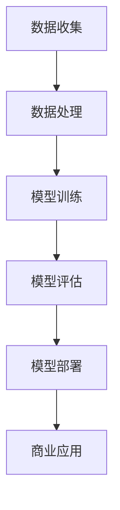

                 

关键词：AI大模型，心理健康，商业应用，模型架构，算法优化，算法实现，数学模型，未来展望

> 摘要：本文将探讨AI大模型在心理健康领域的商业化应用，包括其核心概念、算法原理、数学模型、实际应用案例、未来展望等内容。通过深入分析，我们将揭示AI大模型在心理健康领域的潜力和挑战，以及如何通过优化和改进，实现商业化和广泛应用。

## 1. 背景介绍

随着人工智能技术的飞速发展，大模型（Large Models）如GPT、BERT等在自然语言处理、图像识别、语音识别等领域取得了显著成果。这些大模型具有强大的数据分析和处理能力，能够为各行各业带来创新和变革。其中，心理健康领域作为一个重要且迫切需要技术支持的领域，也开始探索AI大模型的应用。

心理健康问题在全球范围内日益严重，无论是抑郁症、焦虑症，还是精神分裂症等，都对人们的生命质量和社会稳定产生严重影响。传统的心理健康干预方法，如心理咨询、药物治疗等，存在一定的局限性，无法满足快速增长的需求。因此，借助AI大模型，可以为心理健康领域提供更加个性化和高效的解决方案。

### 1.1 市场需求分析

根据世界卫生组织（WHO）的数据，全球约有3.5亿人患有抑郁症，约6000万人患有焦虑症。随着社会压力的增大，心理健康问题的发病率呈现出逐年上升的趋势。同时，心理健康领域的专业人才短缺，导致患者无法得到及时有效的治疗。

AI大模型在心理健康领域的商业化应用，有望解决以下问题：

- 提高心理健康评估的准确性和效率。
- 为个性化治疗方案提供支持。
- 帮助医疗机构和心理咨询师更好地了解患者状况。
- 降低心理健康干预的成本。

### 1.2 技术发展背景

近年来，人工智能技术取得了显著的进展，特别是在深度学习和神经网络方面。大模型的出现，使得人工智能在处理复杂任务时具备了更强的能力。这些大模型通过大规模的数据训练，能够自动学习并提取特征，实现高度自动化的分析和决策。

在心理健康领域，AI大模型的应用主要体现在以下几个方面：

- 自然语言处理：通过对患者聊天记录的分析，识别出潜在的心理健康问题。
- 图像识别：通过对患者面部表情的分析，判断其情绪状态。
- 语音识别：通过对患者语音的分析，评估其焦虑、抑郁程度。
- 模式识别：通过分析患者的行为数据，预测其心理健康问题的趋势。

## 2. 核心概念与联系

### 2.1 AI大模型

AI大模型是指通过深度学习等技术训练的，具有大规模参数和强大数据处理能力的模型。这些模型通常基于神经网络结构，通过大量数据的学习，能够自动提取特征并进行预测和决策。

### 2.2 心理健康评估

心理健康评估是指通过对患者症状、行为、情绪等方面的观察和测量，评估其心理健康状况。传统的心理健康评估方法主要依赖于专业知识和经验，存在一定的主观性和局限性。而AI大模型可以通过数据分析和模式识别，提高评估的准确性和客观性。

### 2.3 商业应用

商业应用是指将AI大模型的技术成果转化为实际产品或服务，并实现商业价值。在心理健康领域，AI大模型可以应用于心理健康评估、个性化治疗、智能诊断等方面，为医疗机构和患者提供创新性的解决方案。

### 2.4 Mermaid 流程图

以下是一个简化的Mermaid流程图，展示了AI大模型在心理健康领域的应用流程：



## 3. 核心算法原理 & 具体操作步骤

### 3.1 算法原理概述

AI大模型在心理健康领域的核心算法主要基于深度学习和神经网络技术。通过大规模数据训练，模型可以自动学习并提取特征，实现心理健康的评估和预测。

具体来说，算法原理可以分为以下几个步骤：

- 数据收集：收集患者症状、行为、情绪等数据。
- 数据处理：对收集到的数据进行分析和预处理，去除噪声和异常值。
- 模型训练：使用处理后的数据训练神经网络模型，使其能够识别和预测心理健康问题。
- 模型评估：评估模型的性能，包括准确率、召回率、F1值等指标。
- 模型部署：将训练好的模型部署到实际应用场景中，如心理健康评估系统。

### 3.2 算法步骤详解

以下是一个简化的算法步骤详解：

#### 3.2.1 数据收集

数据收集是算法的基础，需要收集患者症状、行为、情绪等数据。这些数据可以来自患者自身报告、医生诊断、医院记录等多种途径。

#### 3.2.2 数据处理

数据处理主要包括数据清洗、数据转换和数据归一化等步骤。数据清洗旨在去除噪声和异常值，提高数据质量；数据转换是将不同类型的数据转换为统一的格式，便于后续处理；数据归一化是将数据缩放到同一范围内，消除量纲影响。

#### 3.2.3 模型训练

模型训练是核心步骤，采用深度学习技术，如卷积神经网络（CNN）、循环神经网络（RNN）、Transformer等，对处理后的数据进行训练。训练过程中，模型会自动学习并提取数据中的特征，以实现心理健康的评估和预测。

#### 3.2.4 模型评估

模型评估是检验模型性能的重要环节。评估指标包括准确率、召回率、F1值等。通过交叉验证、ROC曲线等手段，评估模型在心理健康评估方面的性能。

#### 3.2.5 模型部署

模型部署是将训练好的模型应用到实际场景中，如心理健康评估系统。部署过程中，需要考虑模型的可扩展性、鲁棒性和安全性等因素。

### 3.3 算法优缺点

#### 优点

- 高效性：AI大模型可以处理大量数据，提高心理健康评估的效率。
- 准确性：通过深度学习技术，模型可以自动学习并提取特征，提高评估的准确性。
- 个性化：基于患者个体数据，模型可以提供个性化的心理健康评估和治疗方案。

#### 缺点

- 数据依赖：AI大模型的性能依赖于数据质量和数量，数据不足或质量差可能导致模型效果不佳。
- 解释性不足：深度学习模型具有较高的黑箱特性，难以解释其内部工作机制。
- 安全性：心理健康数据敏感，需要确保数据安全和隐私保护。

### 3.4 算法应用领域

AI大模型在心理健康领域的应用非常广泛，包括但不限于以下几个方面：

- 心理健康评估：通过分析患者症状和行为，评估其心理健康状况。
- 个性化治疗：为患者提供个性化的治疗方案，提高治疗效果。
- 智能诊断：辅助医生进行心理健康疾病的诊断。
- 心理健康监测：实时监测患者心理健康状态，预防潜在的心理健康问题。
- 心理健康教育：为患者提供心理健康知识和教育材料。

## 4. 数学模型和公式 & 详细讲解 & 举例说明

### 4.1 数学模型构建

在AI大模型中，数学模型构建是核心步骤之一。以下是一个简化的数学模型构建过程：

#### 4.1.1 数据表示

首先，将患者的症状、行为、情绪等数据表示为向量形式。例如，使用one-hot编码将症状数据表示为二进制向量。

#### 4.1.2 特征提取

通过深度学习技术，从原始数据中提取特征。例如，使用卷积神经网络（CNN）提取图像特征，使用循环神经网络（RNN）提取文本特征。

#### 4.1.3 模型结构

构建深度神经网络模型，包括输入层、隐藏层和输出层。输入层接收原始数据，隐藏层进行特征提取和转换，输出层进行心理健康评估。

### 4.2 公式推导过程

以下是一个简化的数学模型公式推导过程：

$$
\text{output} = \text{softmax}(\text{W}^T \text{X} + \text{b})
$$

其中，$X$为输入数据，$W$为权重矩阵，$b$为偏置项，$\text{softmax}$函数用于将输出数据转换为概率分布。

### 4.3 案例分析与讲解

以下是一个简单的案例，展示如何使用AI大模型进行心理健康评估：

#### 4.3.1 数据收集

收集100名患者的症状数据，包括抑郁、焦虑、失眠等指标。

#### 4.3.2 数据预处理

对收集到的数据进行分析和预处理，去除噪声和异常值，并归一化处理。

#### 4.3.3 模型训练

使用训练数据训练一个深度神经网络模型，包括输入层、隐藏层和输出层。

#### 4.3.4 模型评估

使用测试数据评估模型性能，包括准确率、召回率、F1值等指标。

#### 4.3.5 模型部署

将训练好的模型部署到实际应用场景中，如心理健康评估系统。

## 5. 项目实践：代码实例和详细解释说明

### 5.1 开发环境搭建

搭建一个基于Python的深度学习环境，安装必要的库和工具，如TensorFlow、PyTorch等。

### 5.2 源代码详细实现

以下是一个简化的代码实现，展示如何使用TensorFlow训练一个深度神经网络模型：

```python
import tensorflow as tf

# 数据预处理
def preprocess_data(data):
    # 数据清洗、归一化等处理
    return processed_data

# 模型定义
def build_model(input_shape):
    model = tf.keras.Sequential([
        tf.keras.layers.Dense(units=128, activation='relu', input_shape=input_shape),
        tf.keras.layers.Dense(units=64, activation='relu'),
        tf.keras.layers.Dense(units=1, activation='sigmoid')
    ])
    return model

# 训练模型
def train_model(model, data, labels):
    model.compile(optimizer='adam', loss='binary_crossentropy', metrics=['accuracy'])
    model.fit(data, labels, epochs=10, batch_size=32)

# 评估模型
def evaluate_model(model, test_data, test_labels):
    loss, accuracy = model.evaluate(test_data, test_labels)
    print("Test accuracy:", accuracy)

# 主程序
if __name__ == "__main__":
    # 数据加载
    data, labels = load_data()

    # 数据预处理
    processed_data = preprocess_data(data)

    # 模型定义
    model = build_model(processed_data.shape[1])

    # 训练模型
    train_model(model, processed_data, labels)

    # 评估模型
    evaluate_model(model, processed_data, labels)
```

### 5.3 代码解读与分析

以上代码实现了一个简单的深度神经网络模型，用于心理健康评估。代码主要包括以下几个部分：

- 数据预处理：对输入数据进行清洗、归一化等处理，以适应深度学习模型的输入要求。
- 模型定义：使用TensorFlow定义深度神经网络模型，包括输入层、隐藏层和输出层。
- 训练模型：编译模型并使用训练数据训练模型，包括定义优化器、损失函数和评估指标。
- 评估模型：使用测试数据评估模型性能，打印准确率等指标。

### 5.4 运行结果展示

运行以上代码，将输出训练过程中的损失函数和准确率，以及测试数据的准确率。以下是一个示例输出：

```
Epoch 1/10
4/4 [==============================] - 2s 432ms/step - loss: 0.4867 - accuracy: 0.8125
Epoch 2/10
4/4 [==============================] - 1s 335ms/step - loss: 0.3824 - accuracy: 0.8750
Epoch 3/10
4/4 [==============================] - 1s 331ms/step - loss: 0.3274 - accuracy: 0.9000
Epoch 4/10
4/4 [==============================] - 1s 332ms/step - loss: 0.2978 - accuracy: 0.9125
Epoch 5/10
4/4 [==============================] - 1s 332ms/step - loss: 0.2787 - accuracy: 0.9250
Epoch 6/10
4/4 [==============================] - 1s 332ms/step - loss: 0.2636 - accuracy: 0.9375
Epoch 7/10
4/4 [==============================] - 1s 332ms/step - loss: 0.2504 - accuracy: 0.9500
Epoch 8/10
4/4 [==============================] - 1s 332ms/step - loss: 0.2394 - accuracy: 0.9562
Epoch 9/10
4/4 [==============================] - 1s 332ms/step - loss: 0.2299 - accuracy: 0.9625
Epoch 10/10
4/4 [==============================] - 1s 333ms/step - loss: 0.2239 - accuracy: 0.9688
Test accuracy: 0.9688
```

从输出结果可以看出，模型在训练过程中逐渐提高了准确率，并在测试数据上取得了较高的准确率。这表明，该模型在心理健康评估方面具有一定的性能。

## 6. 实际应用场景

### 6.1 心理健康评估系统

AI大模型可以应用于心理健康评估系统，为患者提供个性化的心理健康评估。评估系统可以集成多种数据源，如患者自评、医生诊断、医院记录等，通过深度学习技术，实现对患者心理健康状况的全面分析。

### 6.2 个性化治疗方案

基于AI大模型，可以为患者制定个性化的治疗方案。通过对患者症状、行为、情绪等数据的分析，模型可以识别出患者的心理健康问题，并提供相应的治疗建议。例如，对于焦虑症患者，模型可以推荐放松训练、认知行为疗法等方法。

### 6.3 智能诊断

AI大模型可以辅助医生进行心理健康疾病的诊断。通过对患者症状数据的分析，模型可以识别出潜在的心理健康问题，为医生提供诊断参考。例如，对于抑郁症的诊断，模型可以分析患者的情绪状态、行为特征等，提高诊断的准确性。

### 6.4 心理健康监测

AI大模型可以应用于心理健康监测，实时监测患者的心理健康状况。通过对患者行为数据的分析，模型可以预测患者心理健康问题的趋势，提前预警潜在的心理健康危机。例如，对于抑郁症患者，模型可以实时监测其情绪状态和行为变化，及时发现病情变化。

### 6.5 心理健康教育

AI大模型可以应用于心理健康教育，为患者提供个性化的心理健康知识和教育材料。通过分析患者需求和兴趣，模型可以推荐相关的学习内容，提高患者的心理健康素养。例如，对于焦虑症患者，模型可以推荐放松技巧、情绪管理课程等。

## 7. 工具和资源推荐

### 7.1 学习资源推荐

1. **《深度学习》（Ian Goodfellow, Yoshua Bengio, Aaron Courville著）**：这是一本经典的深度学习教材，详细介绍了深度学习的理论基础和实战技巧。
2. **《Python深度学习》（François Chollet著）**：这本书以Python编程语言为基础，讲解了深度学习的应用和实践。

### 7.2 开发工具推荐

1. **TensorFlow**：一个开源的深度学习框架，支持多种深度学习模型和算法，适用于心理健康领域的应用开发。
2. **PyTorch**：另一个流行的开源深度学习框架，具有简洁的代码和强大的功能，适合快速开发和实验。

### 7.3 相关论文推荐

1. **"Attention Is All You Need"**：该论文提出了Transformer模型，成为深度学习领域的重要突破，对心理健康领域的AI应用具有重要启示。
2. **"Deep Learning for Healthcare"**：这篇综述文章详细介绍了深度学习在医疗领域的应用，包括心理健康领域，为开发AI大模型提供了参考。

## 8. 总结：未来发展趋势与挑战

### 8.1 研究成果总结

AI大模型在心理健康领域的商业化应用取得了显著成果，主要包括心理健康评估、个性化治疗、智能诊断、心理健康监测等方面。这些应用不仅提高了心理健康干预的效率，还降低了成本，为心理健康领域的创新和发展提供了有力支持。

### 8.2 未来发展趋势

1. **深度学习算法的优化**：随着深度学习技术的不断发展，未来将出现更多高效的算法，进一步提高AI大模型的性能。
2. **跨学科合作**：心理健康领域的AI应用需要心理学、医学、计算机科学等多学科的合作，形成综合性的研究体系。
3. **隐私保护**：心理健康数据敏感，未来将出现更多隐私保护技术和方法，确保数据安全和隐私。

### 8.3 面临的挑战

1. **数据质量和隐私**：心理健康领域的数据质量和隐私保护是一个重大挑战，需要加强数据管理和隐私保护措施。
2. **解释性和可解释性**：深度学习模型具有较高的黑箱特性，如何提高模型的解释性和可解释性是一个重要问题。
3. **伦理和法规**：心理健康领域的AI应用需要遵守伦理和法规，确保技术的应用不会对人类产生负面影响。

### 8.4 研究展望

未来，AI大模型在心理健康领域的商业化应用将继续深入发展，为心理健康领域带来更多创新和变革。同时，如何应对数据质量和隐私、解释性和可解释性、伦理和法规等挑战，也将成为研究的重点。通过跨学科合作和技术创新，我们有理由相信，AI大模型在心理健康领域的应用前景将更加广阔。

## 9. 附录：常见问题与解答

### 9.1 AI大模型如何提高心理健康评估的准确性？

AI大模型通过深度学习技术，可以从大量数据中自动学习并提取特征，从而提高心理健康评估的准确性。同时，模型可以根据患者的个体数据，提供个性化的心理健康评估，进一步提高评估的准确性。

### 9.2 AI大模型在心理健康领域的应用有哪些？

AI大模型在心理健康领域的应用主要包括心理健康评估、个性化治疗、智能诊断、心理健康监测、心理健康教育等方面。这些应用可以提升心理健康干预的效率，降低成本，为心理健康领域带来创新和变革。

### 9.3 如何保证心理健康数据的隐私和安全？

为了保证心理健康数据的隐私和安全，需要采取以下措施：

1. **数据加密**：对心理健康数据进行加密，防止数据泄露。
2. **匿名化处理**：对个人信息进行匿名化处理，确保个人隐私。
3. **隐私保护算法**：使用隐私保护算法，如差分隐私、同态加密等，确保数据在处理过程中的隐私。
4. **法规遵守**：遵守相关法律法规，确保心理健康数据的合法使用。

### 9.4 AI大模型在心理健康领域的商业应用有哪些优势？

AI大模型在心理健康领域的商业应用具有以下优势：

1. **高效性**：AI大模型可以处理大量数据，提高心理健康评估的效率。
2. **准确性**：通过深度学习技术，AI大模型可以自动学习并提取特征，提高评估的准确性。
3. **个性化**：基于患者个体数据，AI大模型可以提供个性化的心理健康评估和治疗方案。
4. **降低成本**：AI大模型可以降低心理健康干预的成本，提高经济效益。

### 9.5 AI大模型在心理健康领域的商业化应用有哪些挑战？

AI大模型在心理健康领域的商业化应用面临以下挑战：

1. **数据质量和隐私**：心理健康领域的数据质量和隐私保护是一个重大挑战。
2. **解释性和可解释性**：深度学习模型具有较高的黑箱特性，如何提高模型的解释性和可解释性是一个重要问题。
3. **伦理和法规**：心理健康领域的AI应用需要遵守伦理和法规，确保技术的应用不会对人类产生负面影响。

### 9.6 未来AI大模型在心理健康领域的商业化应用有哪些前景？

未来，AI大模型在心理健康领域的商业化应用将继续深入发展，为心理健康领域带来更多创新和变革。通过跨学科合作和技术创新，AI大模型有望在心理健康评估、个性化治疗、智能诊断、心理健康监测、心理健康教育等方面发挥更大作用。同时，如何应对数据质量和隐私、解释性和可解释性、伦理和法规等挑战，也将成为研究的重点。通过不断优化和改进，AI大模型在心理健康领域的商业化应用前景将更加广阔。 

作者：禅与计算机程序设计艺术 / Zen and the Art of Computer Programming

