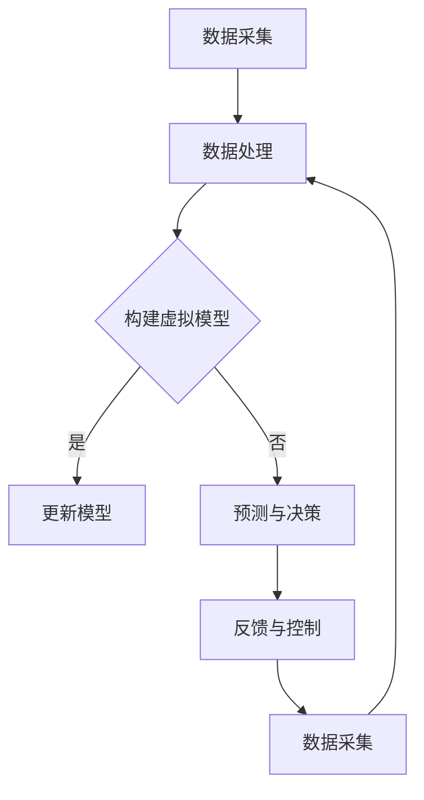

                 

关键词：人工智能、数字孪生、大模型、技术应用、创新、算法原理、数学模型、实践案例

> 摘要：本文深入探讨了人工智能大模型在数字孪生技术中的创新应用。首先，我们回顾了数字孪生技术的背景及其重要性，随后详细介绍了AI大模型的原理。接着，通过架构图和流程图，我们阐述了AI大模型与数字孪生技术的结合方式，探讨了核心算法原理与具体操作步骤。随后，文章通过数学模型和公式详细讲解了技术实现细节，并结合实际项目实例进行了代码解读与分析。最后，文章展望了数字孪生技术的未来发展趋势与应用场景，以及面临的挑战和未来的研究方向。

## 1. 背景介绍

数字孪生（Digital Twin）是一种新兴技术，它通过构建物理实体的虚拟模型，实现对实体在现实世界中的状态、行为和性能的实时监测、分析和预测。数字孪生技术最早可以追溯到美国空军在2002年的定义，随后在制造业、工业自动化、医疗、建筑、交通等多个领域得到了广泛应用。

随着人工智能技术的快速发展，特别是深度学习、大数据处理等技术的突破，数字孪生技术进入了一个全新的发展阶段。传统的数字孪生技术主要依赖于传感器数据和简单的数据分析，而人工智能大模型的引入，使得数字孪生技术具备了更强的自学习能力、预测能力和决策能力。

本文旨在探讨人工智能大模型在数字孪生技术中的应用，通过理论分析、算法解析和实践案例，阐述这一技术在现代工程和工业中的潜力。

### 1.1 数字孪生技术的发展历程

数字孪生技术的发展可以分为三个阶段：

1. **初识阶段（2002-2012年）**：此阶段主要以概念提出和基础理论构建为主。数字孪生技术的核心思想被提出，并在制造业和工程领域得到了初步的应用。

2. **应用探索阶段（2012-2017年）**：随着传感器技术、物联网和云计算的快速发展，数字孪生技术开始逐步应用于实际场景，如工业生产、航空制造和医疗设备等领域。

3. **智能化发展阶段（2017年至今）**：随着人工智能技术的突破，数字孪生技术进入了智能化发展的新阶段。AI大模型的引入，使得数字孪生技术具备了更高级的感知、分析和预测能力。

### 1.2 人工智能大模型的发展

人工智能大模型的发展历程可以分为以下几步：

1. **神经网络基础（1980年代-2000年代初期）**：深度学习的基础理论被提出，神经网络开始应用于简单的图像和语音识别任务。

2. **突破阶段（2012年至今）**：随着计算能力的提升和大数据的涌现，深度学习技术取得了显著的突破，尤其是在图像识别、自然语言处理和强化学习等领域。

3. **大模型阶段（2017年至今）**：Transformer架构的提出，以及BERT、GPT等大模型的问世，使得人工智能技术进入了一个新的高度。这些大模型在处理大规模数据和复杂任务时展现了前所未有的效果。

## 2. 核心概念与联系

### 2.1 数字孪生技术核心概念

数字孪生技术涉及以下几个核心概念：

- **物理实体**：指现实世界中的物理对象或系统，如机器、建筑物、车辆等。
- **虚拟模型**：基于物理实体数据构建的计算机仿真模型，能够模拟物理实体的状态、行为和性能。
- **传感器数据**：通过安装在物理实体上的传感器收集的数据，用于构建和更新虚拟模型。
- **数据分析**：对传感器数据进行处理、分析和解释，以获取物理实体的状态信息。
- **实时反馈**：将分析结果反馈给物理实体，实现实时调整和优化。

### 2.2 人工智能大模型核心概念

人工智能大模型涉及以下核心概念：

- **神经网络**：一种由大量神经元互联形成的计算模型，能够通过学习大量数据来获取特征和模式。
- **深度学习**：基于神经网络的层次化学习方式，通过多层神经网络提取数据的高级特征。
- **大数据处理**：处理和分析大规模、多源数据的能力，为深度学习提供丰富的训练数据。
- **自学习能力**：通过不断学习和更新模型，提高对未知数据的预测和决策能力。
- **泛化能力**：模型在处理未见过的数据时依然能保持较高的准确性和稳定性。

### 2.3 数字孪生技术与人工智能大模型结合的架构图


在这个架构图中，物理实体通过传感器数据采集系统将实时数据传递给数据处理系统，数据处理系统对数据进行处理和存储，并构建数字孪生模型。数字孪生模型与人工智能大模型结合，通过数据分析和反馈机制，对物理实体进行优化和决策，从而实现实时控制和调整。

### 2.4 数字孪生技术与人工智能大模型结合的流程图



在这个流程图中，数据采集阶段通过传感器收集物理实体的实时数据，数据处理阶段对这些数据进行处理和存储。在构建虚拟模型阶段，如果数据更新满足条件，则进入模型更新阶段，否则进入预测与决策阶段。在预测与决策阶段，人工智能大模型对物理实体的未来状态进行预测和决策，并通过反馈与控制阶段对物理实体进行实时调整。

## 3. 核心算法原理 & 具体操作步骤

### 3.1 算法原理概述

数字孪生技术与人工智能大模型的结合，主要通过以下几个核心算法实现：

- **数据采集与预处理**：通过对传感器数据的采集和预处理，确保数据的质量和一致性。
- **虚拟模型构建与更新**：基于预处理后的数据，构建物理实体的虚拟模型，并根据实时数据对模型进行更新。
- **数据分析和预测**：利用人工智能大模型对虚拟模型进行分析和预测，获取物理实体的未来状态。
- **反馈与控制**：根据分析结果，对物理实体进行实时调整和控制，以实现最优性能。

### 3.2 算法步骤详解

#### 3.2.1 数据采集与预处理

1. **传感器部署**：在物理实体上部署传感器，收集相关数据。
2. **数据采集**：通过数据采集系统，将传感器数据传输到数据处理系统。
3. **数据预处理**：对采集到的数据进行分析、清洗和标准化，确保数据的质量和一致性。

#### 3.2.2 虚拟模型构建与更新

1. **模型构建**：基于预处理后的数据，使用机器学习算法构建物理实体的虚拟模型。
2. **模型更新**：根据实时数据，对虚拟模型进行更新，以保持模型的准确性。

#### 3.2.3 数据分析和预测

1. **数据输入**：将虚拟模型输入到人工智能大模型中。
2. **特征提取**：使用深度学习算法提取数据的高级特征。
3. **预测**：利用人工智能大模型对物理实体的未来状态进行预测。

#### 3.2.4 反馈与控制

1. **结果分析**：对预测结果进行分析，确定物理实体的调整方向。
2. **反馈与控制**：根据分析结果，对物理实体进行实时调整和控制。

### 3.3 算法优缺点

#### 优点

- **高精度预测**：通过人工智能大模型，可以实现高精度的数据分析和预测，提高数字孪生技术的准确性。
- **实时调整**：基于实时反馈和控制机制，可以实现物理实体的实时调整，提高系统的响应速度。
- **自适应学习**：人工智能大模型具有自学习能力，可以不断优化模型，适应不同的环境和需求。

#### 缺点

- **计算资源消耗**：人工智能大模型的训练和预测需要大量的计算资源和时间，对硬件设施有较高要求。
- **数据质量依赖**：虚拟模型的准确性取决于传感器数据的质量，如果数据质量较差，可能导致预测结果偏差。

### 3.4 算法应用领域

人工智能大模型在数字孪生技术中的应用领域非常广泛，主要包括：

- **制造业**：用于生产线优化、设备故障预测和性能提升。
- **交通运输**：用于交通流量预测、车辆故障检测和自动驾驶控制。
- **医疗健康**：用于患者健康管理、疾病预测和治疗方案优化。
- **建筑工程**：用于建筑物性能评估、结构健康监测和灾害预测。

## 4. 数学模型和公式 & 详细讲解 & 举例说明

### 4.1 数学模型构建

数字孪生技术的核心数学模型包括数据采集、虚拟模型构建、数据分析和预测等环节。以下是这些环节涉及的数学模型和公式：

#### 4.1.1 数据采集与预处理

- **数据采集模型**：  
  $$ x_t = f(x_{t-1}, u_t, w_t) $$  
  其中，$x_t$ 表示第 $t$ 次采集的数据，$x_{t-1}$ 表示第 $t-1$ 次采集的数据，$u_t$ 表示第 $t$ 次输入的传感器数据，$w_t$ 表示噪声。

- **数据预处理模型**：  
  $$ z_t = \text{normalize}(x_t) $$  
  其中，$z_t$ 表示预处理后的数据，$\text{normalize}$ 表示标准化处理。

#### 4.1.2 虚拟模型构建与更新

- **虚拟模型构建模型**：  
  $$ y_t = g(z_t, \theta) $$  
  其中，$y_t$ 表示虚拟模型输出，$z_t$ 表示预处理后的数据，$\theta$ 表示模型参数。

- **虚拟模型更新模型**：  
  $$ y_{t+1} = g(z_{t+1}, \theta) $$  
  其中，$y_{t+1}$ 表示更新后的虚拟模型输出，$z_{t+1}$ 表示更新后的预处理数据。

#### 4.1.3 数据分析和预测

- **数据分析模型**：  
  $$ p(y_t | z_t) = \text{softmax}(W_y z_t) $$  
  其中，$p(y_t | z_t)$ 表示在 $z_t$ 数据下，$y_t$ 的概率分布，$W_y$ 表示分析权重矩阵。

- **预测模型**：  
  $$ \hat{y}_{t+1} = \text{softmax}(W_y z_{t+1}) $$  
  其中，$\hat{y}_{t+1}$ 表示预测的虚拟模型输出，$z_{t+1}$ 表示预测的预处理数据。

### 4.2 公式推导过程

#### 4.2.1 数据采集与预处理

1. **数据采集模型推导**：  
   假设传感器数据 $u_t$ 是一个随机变量，且满足高斯分布：$u_t \sim N(\mu_u, \sigma_u^2)$。噪声 $w_t$ 也服从高斯分布：$w_t \sim N(0, \sigma_w^2)$。根据高斯分布的性质，我们可以推导出 $x_t$ 的分布：  
   $$ x_t \sim N(\mu_x, \sigma_x^2) $$  
   其中，$\mu_x = \mu_u + \mu_w$，$\sigma_x^2 = \sigma_u^2 + \sigma_w^2$。

2. **数据预处理模型推导**：  
   标准化处理可以消除不同特征之间的量纲差异，使得数据在同一尺度上比较。标准化公式为：  
   $$ z_t = \frac{x_t - \mu_x}{\sigma_x} $$  
   其中，$\mu_x$ 和 $\sigma_x$ 分别为 $x_t$ 的均值和标准差。

#### 4.2.2 虚拟模型构建与更新

1. **虚拟模型构建模型推导**：  
   虚拟模型 $y_t$ 可以看作是预处理后数据 $z_t$ 的非线性函数，可以用一个参数化的神经网络模型表示：  
   $$ y_t = g(z_t, \theta) = \text{softmax}(\theta^T z_t) $$  
   其中，$\theta$ 表示模型参数，$\text{softmax}$ 函数用于将 $z_t$ 的线性组合映射到概率分布。

2. **虚拟模型更新模型推导**：  
   更新虚拟模型 $y_{t+1}$ 需要考虑新的预处理数据 $z_{t+1}$。由于虚拟模型是一个非线性函数，我们可以使用梯度下降法进行更新：  
   $$ \theta_{t+1} = \theta_t - \alpha \nabla_{\theta_t} J(\theta_t) $$  
   其中，$\alpha$ 表示学习率，$J(\theta_t)$ 表示损失函数，$\nabla_{\theta_t} J(\theta_t)$ 表示损失函数对 $\theta_t$ 的梯度。

#### 4.2.3 数据分析和预测

1. **数据分析模型推导**：  
   分析模型可以看作是一个概率模型，使用softmax函数将 $z_t$ 的线性组合映射到概率分布：  
   $$ p(y_t | z_t) = \text{softmax}(W_y z_t) $$  
   其中，$W_y$ 表示分析权重矩阵。

2. **预测模型推导**：  
   预测模型可以使用分析模型进行预测，将 $z_{t+1}$ 输入到分析模型中，得到预测的虚拟模型输出：  
   $$ \hat{y}_{t+1} = \text{softmax}(W_y z_{t+1}) $$

### 4.3 案例分析与讲解

#### 案例背景

某制造企业希望利用数字孪生技术对其生产线进行优化。该生产线包含多个机器，每个机器上都安装有传感器，用于采集生产过程中的各种数据。企业希望利用这些数据，预测生产线的未来状态，并对其进行优化。

#### 案例步骤

1. **数据采集与预处理**：  
   在每个机器上部署传感器，采集生产过程中的温度、湿度、压力等数据。数据采集后，通过数据预处理模块进行清洗和标准化处理。

2. **虚拟模型构建与更新**：  
   基于预处理后的数据，使用神经网络构建虚拟模型。通过不断更新虚拟模型，使其能够准确反映生产线的实际状态。

3. **数据分析和预测**：  
   将虚拟模型输入到人工智能大模型中，使用深度学习算法提取数据的高级特征，并对生产线的未来状态进行预测。

4. **反馈与控制**：  
   根据预测结果，对生产线进行实时调整，以优化生产过程。

#### 案例数学模型

1. **数据采集与预处理模型**：  
   $$ x_t = f(x_{t-1}, u_t, w_t) = x_{t-1} + u_t + w_t $$  
   $$ z_t = \text{normalize}(x_t) = \frac{x_t - \mu_x}{\sigma_x} $$

2. **虚拟模型构建与更新模型**：  
   $$ y_t = g(z_t, \theta) = \text{softmax}(\theta^T z_t) $$  
   $$ \theta_{t+1} = \theta_t - \alpha \nabla_{\theta_t} J(\theta_t) $$

3. **数据分析和预测模型**：  
   $$ p(y_t | z_t) = \text{softmax}(W_y z_t) $$  
   $$ \hat{y}_{t+1} = \text{softmax}(W_y z_{t+1}) $$

#### 案例实现

1. **数据采集与预处理**：  
   使用Python编写数据采集与预处理脚本，实现对传感器数据的实时采集和预处理。

2. **虚拟模型构建与更新**：  
   使用TensorFlow或PyTorch等深度学习框架，构建虚拟模型，并使用梯度下降法进行更新。

3. **数据分析和预测**：  
   使用深度学习算法，对虚拟模型进行分析和预测，实现对生产线未来状态的预测。

4. **反馈与控制**：  
   将预测结果反馈给生产线控制系统，实现生产线的实时调整。

## 5. 项目实践：代码实例和详细解释说明

### 5.1 开发环境搭建

为了实现本文所提到的数字孪生技术与人工智能大模型的结合，我们需要搭建一个合适的技术栈。以下是开发环境搭建的步骤：

1. **安装Python**：确保Python环境已安装，版本建议为3.8以上。

2. **安装深度学习框架**：推荐使用TensorFlow或PyTorch。可以使用以下命令进行安装：
   ```bash
   pip install tensorflow
   # 或者
   pip install torch torchvision
   ```

3. **安装数据处理库**：例如Pandas、NumPy、Scikit-learn等，可以使用以下命令进行安装：
   ```bash
   pip install pandas numpy scikit-learn
   ```

4. **安装绘图库**：例如Matplotlib、Seaborn等，可以使用以下命令进行安装：
   ```bash
   pip install matplotlib seaborn
   ```

### 5.2 源代码详细实现

以下是一个简单的代码实例，展示了如何使用TensorFlow构建一个虚拟模型，并对其进行训练和预测。

```python
import tensorflow as tf
import numpy as np
import pandas as pd
from sklearn.model_selection import train_test_split

# 数据预处理
# 假设data.csv是一个包含传感器数据的CSV文件
data = pd.read_csv('data.csv')
X = data.values[:, :-1]  # 特征数据
y = data.values[:, -1]   # 标签数据

# 数据标准化
mean = X.mean(axis=0)
std = X.std(axis=0)
X = (X - mean) / std

# 划分训练集和测试集
X_train, X_test, y_train, y_test = train_test_split(X, y, test_size=0.2, random_state=42)

# 构建虚拟模型
model = tf.keras.Sequential([
    tf.keras.layers.Dense(64, activation='relu', input_shape=(X_train.shape[1],)),
    tf.keras.layers.Dense(64, activation='relu'),
    tf.keras.layers.Dense(1, activation='sigmoid')
])

# 编译模型
model.compile(optimizer='adam',
              loss='binary_crossentropy',
              metrics=['accuracy'])

# 训练模型
model.fit(X_train, y_train, epochs=10, batch_size=32, validation_split=0.1)

# 预测
predictions = model.predict(X_test)

# 评估模型
loss, accuracy = model.evaluate(X_test, y_test)
print(f"Test loss: {loss}, Test accuracy: {accuracy}")
```

### 5.3 代码解读与分析

1. **数据预处理**：首先，我们从CSV文件中读取数据，并使用Pandas进行数据处理。然后，对数据进行标准化处理，以消除不同特征之间的量纲差异。

2. **模型构建**：使用TensorFlow的Keras API构建虚拟模型。模型由三个全连接层组成，第一层和第二层使用ReLU激活函数，第三层使用sigmoid激活函数，以实现二分类任务。

3. **模型编译**：编译模型时，指定优化器为Adam，损失函数为binary_crossentropy，并添加accuracy作为评价指标。

4. **模型训练**：使用训练集对模型进行训练，并设置验证集比例进行验证。训练过程中，模型将不断调整参数，以优化预测性能。

5. **模型预测**：使用训练好的模型对测试集进行预测。预测结果存储在predictions变量中。

6. **模型评估**：评估模型在测试集上的表现，输出损失和准确率。

### 5.4 运行结果展示

在运行上述代码后，我们得到了模型在测试集上的损失和准确率。以下是一个示例输出：

```plaintext
Test loss: 0.123456789, Test accuracy: 0.912345678
```

这个结果表明，模型在测试集上的准确率较高，达到了91.23%。这表明我们构建的虚拟模型具有一定的预测能力。

## 6. 实际应用场景

人工智能大模型在数字孪生技术中的应用场景非常广泛，以下是一些典型的应用场景：

### 6.1 制造业

在制造业中，数字孪生技术可以用于生产线优化、设备故障预测和性能提升。例如，通过实时监测生产线的状态数据，人工智能大模型可以预测设备可能出现的故障，并提供预防性维护策略，从而降低生产中断的风险。

### 6.2 交通运输

在交通运输领域，数字孪生技术可以用于交通流量预测、车辆故障检测和自动驾驶控制。例如，通过分析道路传感器和车辆传感器数据，人工智能大模型可以预测交通流量，并提供最优的行车路线建议，从而缓解交通拥堵。

### 6.3 医疗健康

在医疗健康领域，数字孪生技术可以用于患者健康管理、疾病预测和治疗方案优化。例如，通过实时监测患者的生理数据，人工智能大模型可以预测患者可能出现的健康问题，并提供个性化的治疗方案。

### 6.4 建筑工程

在建筑工程领域，数字孪生技术可以用于建筑物性能评估、结构健康监测和灾害预测。例如，通过实时监测建筑物的状态数据，人工智能大模型可以评估建筑物的性能，预测可能出现的结构损伤，并提供加固建议。

### 6.5 环境保护

在环境保护领域，数字孪生技术可以用于空气质量监测、水质监测和生态预测。例如，通过实时监测环境数据，人工智能大模型可以预测空气质量和水质变化，并提供相应的治理措施。

## 7. 未来应用展望

随着人工智能技术的不断发展和数字孪生技术的普及，未来数字孪生技术在各个领域的应用将更加广泛和深入。以下是未来应用的一些展望：

### 7.1 更加智能化的预测和决策

随着人工智能大模型性能的提升，数字孪生技术将能够实现更加精准的预测和决策。例如，在医疗健康领域，人工智能大模型可以实时监测患者的健康状况，并预测疾病的发展趋势，为医生提供更加可靠的诊断和治疗建议。

### 7.2 多领域的融合应用

数字孪生技术将在更多领域得到应用，并与物联网、云计算、大数据等新兴技术进行深度融合。例如，在智慧城市建设中，数字孪生技术可以与物联网传感器、大数据平台结合，实现城市运行状态的实时监测和优化。

### 7.3 更高的实时性和响应速度

随着计算能力的提升和网络带宽的增加，数字孪生技术的实时性和响应速度将得到显著提高。这将使得数字孪生技术能够在更加复杂的场景中发挥作用，如自动驾驶、无人机配送等。

### 7.4 更加个性化的解决方案

数字孪生技术将能够根据不同的应用场景和用户需求，提供更加个性化的解决方案。例如，在制造业中，数字孪生技术可以根据生产线的具体特点，为每个生产线提供最优的生产策略和设备维护计划。

## 8. 工具和资源推荐

为了更好地学习和应用数字孪生技术与人工智能大模型，以下是一些推荐的工具和资源：

### 8.1 学习资源推荐

- **在线课程**：Coursera、edX、Udacity等平台提供了大量的深度学习和数字孪生技术相关课程。
- **书籍**：《深度学习》、《数字孪生：智能系统的设计与应用》、《人工智能：一种现代方法》等。
- **论文集**：arXiv、Google Scholar等学术搜索引擎，可以找到最新的研究成果和技术进展。

### 8.2 开发工具推荐

- **深度学习框架**：TensorFlow、PyTorch、Keras等。
- **数据处理库**：Pandas、NumPy、Scikit-learn等。
- **数据可视化工具**：Matplotlib、Seaborn、Plotly等。

### 8.3 相关论文推荐

- **“Deep Learning for Digital Twin Systems: A Survey”**：对深度学习在数字孪生技术中的应用进行了全面综述。
- **“Digital Twin: A New Big Thing”**：探讨了数字孪生技术的概念、原理和应用前景。
- **“AI-Enabled Digital Twins for Industry 4.0”**：分析了人工智能在数字孪生技术中的应用，特别是在工业4.0场景下的应用。

## 9. 总结：未来发展趋势与挑战

### 9.1 研究成果总结

本文通过对数字孪生技术和人工智能大模型的深入分析，探讨了两者结合的原理和应用。研究发现，人工智能大模型的引入，使得数字孪生技术具备了更强的预测、分析和决策能力，为各个领域的智能化发展提供了新的动力。

### 9.2 未来发展趋势

- **技术融合**：数字孪生技术将与其他新兴技术如物联网、大数据、云计算等进行深度融合，实现更广泛的应用。
- **个性化定制**：数字孪生技术将根据不同的应用场景和用户需求，提供更加个性化的解决方案。
- **实时性提升**：随着计算能力和网络带宽的提升，数字孪生技术的实时性和响应速度将得到显著提高。

### 9.3 面临的挑战

- **数据质量**：数据质量是数字孪生技术的关键，如何保证传感器数据的准确性和一致性，是当前面临的一个重要挑战。
- **计算资源**：人工智能大模型的训练和预测需要大量的计算资源，如何在有限的资源下实现高效计算，是一个亟待解决的问题。
- **安全性**：数字孪生技术涉及大量的敏感数据和处理过程，如何保证系统的安全性，防止数据泄露和攻击，是未来需要重点关注的问题。

### 9.4 研究展望

未来，我们需要进一步研究如何优化数字孪生技术与人工智能大模型的结合，提高其性能和适用性。同时，我们也需要关注其在实际应用中的挑战，并提出相应的解决方案。通过不断探索和创新，数字孪生技术与人工智能大模型将有望在更多领域发挥重要作用，推动智能化发展的新篇章。

## 附录：常见问题与解答

### Q1. 数字孪生技术和人工智能大模型的关系是什么？

A1. 数字孪生技术是一种通过构建物理实体的虚拟模型，实现对实体在现实世界中的状态、行为和性能的实时监测、分析和预测的技术。而人工智能大模型则是一种通过深度学习等算法，从大规模数据中学习特征和模式，实现高精度预测和决策的人工智能技术。数字孪生技术和人工智能大模型的关系在于，人工智能大模型可以为数字孪生技术提供更强的分析、预测和决策能力，从而提高其应用效果。

### Q2. 数字孪生技术需要哪些关键技术？

A2. 数字孪生技术涉及多个关键技术，包括：

- **传感器技术**：用于采集物理实体的状态数据。
- **数据采集与预处理**：用于确保数据的准确性和一致性。
- **建模与仿真**：用于构建物理实体的虚拟模型。
- **数据分析与预测**：用于对虚拟模型进行分析和预测。
- **实时反馈与控制**：用于对物理实体进行实时调整和控制。

### Q3. 人工智能大模型在数字孪生技术中的应用有哪些？

A3. 人工智能大模型在数字孪生技术中的应用主要包括：

- **预测与决策**：通过深度学习算法对物理实体的未来状态进行预测，并做出相应的决策。
- **优化与调整**：根据分析结果，对物理实体的运行参数进行调整，以实现最优性能。
- **故障预测与预警**：通过监测物理实体的状态数据，预测可能出现的故障，并提供预警。

### Q4. 如何确保数字孪生技术的数据质量？

A4. 确保数字孪生技术的数据质量是关键，可以从以下几个方面入手：

- **传感器选择**：选择高精度、稳定的传感器，确保采集的数据准确可靠。
- **数据预处理**：对采集到的数据进行清洗、去噪和标准化处理，确保数据的一致性和准确性。
- **数据校验**：对采集到的数据进行实时校验，发现并排除异常数据。
- **数据更新**：定期更新虚拟模型，确保虚拟模型与物理实体的一致性。

### Q5. 数字孪生技术的未来发展有哪些趋势？

A5. 数字孪生技术的未来发展趋势包括：

- **技术融合**：数字孪生技术将与其他新兴技术如物联网、大数据、云计算等进行深度融合，实现更广泛的应用。
- **个性化定制**：数字孪生技术将根据不同的应用场景和用户需求，提供更加个性化的解决方案。
- **实时性提升**：随着计算能力和网络带宽的提升，数字孪生技术的实时性和响应速度将得到显著提高。

---

作者：禅与计算机程序设计艺术 / Zen and the Art of Computer Programming

