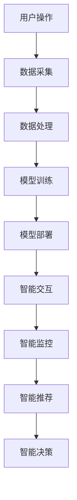

                 

关键词：AI大模型、智能家电、产品创新、技术创新、用户体验、市场前景

> 摘要：随着人工智能技术的飞速发展，大模型技术在智能家电领域中的应用日益广泛。本文将探讨AI大模型在智能家电中的产品创新，分析其核心技术原理、应用场景、未来发展趋势以及面临的挑战，旨在为相关领域的研究和产业应用提供参考。

## 1. 背景介绍

近年来，人工智能（AI）技术在全球范围内取得了显著的进展，尤其是AI大模型（如GPT、BERT等）的出现，使得人工智能在多个领域取得了突破性的成果。与此同时，智能家电行业也迅速崛起，智能家居、智慧家庭等概念逐渐成为人们日常生活的一部分。随着5G、物联网、大数据等技术的发展，智能家电的市场需求不断扩大，产品创新成为企业竞争的关键因素。

AI大模型在智能家电中的应用主要表现为以下几个方面：

1. **智能交互**：通过自然语言处理（NLP）技术，实现语音识别、语音合成等功能，为用户提供了更加便捷、自然的交互方式。
2. **智能推荐**：基于用户行为数据，利用AI大模型进行个性化推荐，提高用户的使用体验。
3. **智能监控**：通过图像识别、行为分析等技术，实现家电设备的智能监控，提高家庭安全性。
4. **智能决策**：利用AI大模型进行数据分析，为家电产品提供智能决策支持，实现更高效的资源管理。

## 2. 核心概念与联系

### 2.1 AI大模型

AI大模型是指通过大量数据进行训练的深度神经网络模型，具有极高的参数数量和计算复杂度。大模型能够通过自我学习和自我优化，实现对复杂问题的建模和求解。在智能家电领域，AI大模型主要包括以下几个核心概念：

1. **自然语言处理（NLP）**：包括文本分类、情感分析、机器翻译等功能，用于实现智能交互和智能推荐。
2. **计算机视觉**：包括图像识别、目标检测、图像生成等功能，用于实现智能监控和智能决策。
3. **强化学习**：通过不断尝试和反馈，实现智能决策和优化。

### 2.2 智能家电

智能家电是指具备智能功能的家用设备，能够通过互联网、物联网等技术实现远程控制、数据采集、智能决策等功能。智能家电主要包括以下几个核心概念：

1. **智能家居**：通过智能家电实现家庭设备的互联互通，提高家庭生活的便利性和舒适性。
2. **智慧家庭**：将智能家居与其他家庭设施相结合，实现全方位的智慧化生活体验。
3. **物联网（IoT）**：通过传感器、通信模块等技术，实现设备的互联互通和数据共享。

### 2.3 AI大模型与智能家电的联系

AI大模型与智能家电之间存在密切的联系，主要体现在以下几个方面：

1. **智能交互**：通过NLP技术，实现智能家电与用户的自然语言交互，提高用户体验。
2. **智能监控**：通过计算机视觉技术，实现智能家电对家庭环境的实时监控，提高家庭安全性。
3. **智能推荐**：基于用户行为数据，利用AI大模型进行个性化推荐，提高用户的使用满意度。
4. **智能决策**：利用AI大模型进行数据分析，为智能家电提供智能决策支持，实现更高效的资源管理。

### 2.4 Mermaid流程图

以下是一个简单的Mermaid流程图，展示了AI大模型在智能家电中的应用流程：



## 3. 核心算法原理 & 具体操作步骤

### 3.1 算法原理概述

AI大模型在智能家电中的应用主要基于以下几种核心技术：

1. **深度神经网络（DNN）**：通过多层神经元的堆叠，实现对复杂数据的建模和预测。
2. **卷积神经网络（CNN）**：通过卷积操作，实现图像数据的特征提取和分类。
3. **递归神经网络（RNN）**：通过递归结构，实现序列数据的建模和预测。
4. **生成对抗网络（GAN）**：通过生成器和判别器的对抗训练，实现数据的生成和优化。

### 3.2 算法步骤详解

1. **数据采集**：通过智能家电的传感器、摄像头等设备，收集用户操作数据和家居环境数据。
2. **数据处理**：对采集到的数据进行清洗、预处理，提高数据质量。
3. **模型训练**：利用预处理后的数据，通过深度学习算法进行模型训练，优化模型参数。
4. **模型评估**：通过交叉验证等手段，评估模型的性能，选择最优模型。
5. **模型部署**：将训练好的模型部署到智能家电中，实现实际应用。
6. **模型优化**：根据用户反馈和实际应用情况，不断优化模型，提高模型性能。

### 3.3 算法优缺点

#### 优点：

1. **高精度**：通过深度学习算法，能够实现对复杂数据的建模和预测，提高决策精度。
2. **泛化能力强**：通过大规模数据训练，模型具有较强的泛化能力，能够适应不同场景。
3. **自动化**：通过自动化算法，能够实现高效的数据处理和模型训练，降低人力成本。

#### 缺点：

1. **计算资源消耗大**：深度学习算法需要大量的计算资源和存储资源，对硬件要求较高。
2. **数据依赖性强**：模型的性能很大程度上取决于数据质量，数据缺失或错误会影响模型效果。
3. **模型解释性差**：深度学习模型具有较高的黑箱特性，难以解释其决策过程。

### 3.4 算法应用领域

AI大模型在智能家电中的应用非常广泛，主要包括以下几个方面：

1. **智能家居**：通过AI大模型实现智能语音助手、智能安防、智能照明等功能。
2. **智慧家庭**：通过AI大模型实现智能家居设备的互联互通，提供全方位的智慧化生活体验。
3. **智能家电**：通过AI大模型实现家电设备的智能控制、智能故障诊断、智能能耗管理等功能。

## 4. 数学模型和公式 & 详细讲解 & 举例说明

### 4.1 数学模型构建

在智能家电中，AI大模型的数学模型主要包括以下几种：

1. **深度神经网络（DNN）**：
   $$ f(x) = \sigma(W_1 \cdot x + b_1) $$
   $$ f(x) = \sigma(W_2 \cdot f(x) + b_2) $$
   ...
   $$ f(x) = \sigma(W_n \cdot f(x_{n-1}) + b_n) $$
   其中，$W$ 为权重矩阵，$b$ 为偏置项，$\sigma$ 为激活函数。

2. **卷积神经网络（CNN）**：
   $$ h(x) = \sum_{i=1}^{k} W_i \cdot \sigma((x \star K_i) + b_i) $$
   其中，$x$ 为输入数据，$K_i$ 为卷积核，$\star$ 为卷积操作。

3. **递归神经网络（RNN）**：
   $$ h_t = \sigma(W_h \cdot [h_{t-1}, x_t] + b_h) $$
   其中，$h_t$ 为第 $t$ 个时间步的隐藏状态。

4. **生成对抗网络（GAN）**：
   $$ D(x) = \sigma(W_D \cdot x + b_D) $$
   $$ G(z) = \sigma(W_G \cdot z + b_G) $$
   其中，$D$ 为判别器，$G$ 为生成器，$x$ 为真实数据，$z$ 为随机噪声。

### 4.2 公式推导过程

以深度神经网络（DNN）为例，公式推导过程如下：

假设输入数据为 $x$，输出数据为 $y$，其中 $x \in \mathbb{R}^n$，$y \in \mathbb{R}^m$。

1. **前向传播**：

   $$ h_1 = W_1 \cdot x + b_1 $$
   $$ h_2 = W_2 \cdot \sigma(h_1) + b_2 $$
   ...
   $$ h_n = W_n \cdot \sigma(h_{n-1}) + b_n $$
   $$ y = W_n' \cdot \sigma(h_n) + b_n' $$

   其中，$W_1, W_2, ..., W_n, W_n'$ 为权重矩阵，$b_1, b_2, ..., b_n, b_n'$ 为偏置项。

2. **反向传播**：

   计算输出误差：

   $$ \delta_n = \frac{\partial L}{\partial y} \cdot \frac{\partial \sigma}{\partial h_n} \cdot (W_n') $$
   $$ \delta_{n-1} = \frac{\partial L}{\partial h_{n-1}} \cdot \frac{\partial \sigma}{\partial h_n} \cdot W_n \cdot \frac{\partial \sigma}{\partial h_{n-1}} \cdot (W_{n-1}) $$
   ...
   $$ \delta_1 = \frac{\partial L}{\partial x} \cdot \frac{\partial \sigma}{\partial h_1} \cdot (W_1) $$

   更新权重和偏置：

   $$ W_n' = W_n' - \alpha \cdot \delta_n \cdot y $$
   $$ b_n' = b_n' - \alpha \cdot \delta_n $$
   ...
   $$ W_1 = W_1 - \alpha \cdot \delta_1 \cdot x $$

   其中，$L$ 为损失函数，$\alpha$ 为学习率。

### 4.3 案例分析与讲解

以智能家居中的语音助手为例，分析AI大模型在语音识别和语音合成方面的应用。

1. **语音识别**：

   语音识别的目的是将语音信号转换为对应的文本。使用深度神经网络（DNN）进行语音信号的特征提取和分类，主要步骤如下：

   - **数据采集**：采集大量的语音数据，包括普通话、英语等。
   - **数据处理**：对语音数据进行预处理，包括去噪、归一化等。
   - **模型训练**：利用预处理后的数据，通过DNN算法进行模型训练，优化模型参数。
   - **模型评估**：通过测试集评估模型性能，选择最优模型。
   - **模型部署**：将训练好的模型部署到智能家居设备中，实现语音识别功能。

   以下是一个简化的DNN模型：

   ```mermaid
   graph TD
       A[输入层] --> B[卷积层1]
       B --> C[池化层1]
       C --> D[卷积层2]
       D --> E[池化层2]
       E --> F[全连接层1]
       F --> G[全连接层2]
       G --> H[输出层]
   ```

   输入层接收语音信号，经过卷积层和池化层提取特征，然后通过全连接层进行分类，最终输出对应的文本。

2. **语音合成**：

   语音合成的目的是将文本转换为语音信号。使用循环神经网络（RNN）进行文本到语音的转换，主要步骤如下：

   - **数据采集**：采集大量的文本数据，包括普通话、英语等。
   - **数据处理**：对文本数据进行预处理，包括分词、拼音标注等。
   - **模型训练**：利用预处理后的数据，通过RNN算法进行模型训练，优化模型参数。
   - **模型评估**：通过测试集评估模型性能，选择最优模型。
   - **模型部署**：将训练好的模型部署到智能家居设备中，实现语音合成功能。

   以下是一个简化的RNN模型：

   ```mermaid
   graph TD
       A[输入层] --> B[RNN层1]
       B --> C[RNN层2]
       C --> D[RNN层3]
       D --> E[输出层]
   ```

   输入层接收文本数据，经过RNN层处理，最终输出语音信号。

## 5. 项目实践：代码实例和详细解释说明

### 5.1 开发环境搭建

在本项目中，我们使用Python作为主要编程语言，利用TensorFlow框架进行深度学习模型的开发。以下是开发环境的搭建步骤：

1. 安装Python 3.7及以上版本。
2. 安装TensorFlow框架，可以使用以下命令：
   ```bash
   pip install tensorflow
   ```
3. 安装其他依赖库，如NumPy、Pandas等。

### 5.2 源代码详细实现

以下是一个简单的深度神经网络（DNN）模型实现，用于语音识别任务：

```python
import tensorflow as tf
from tensorflow.keras.models import Sequential
from tensorflow.keras.layers import Dense, Conv2D, MaxPooling2D, Flatten

# 定义模型
model = Sequential([
    Conv2D(32, (3, 3), activation='relu', input_shape=(128, 128, 3)),
    MaxPooling2D((2, 2)),
    Flatten(),
    Dense(64, activation='relu'),
    Dense(10, activation='softmax')
])

# 编译模型
model.compile(optimizer='adam', loss='categorical_crossentropy', metrics=['accuracy'])

# 加载数据集
(x_train, y_train), (x_test, y_test) = tf.keras.datasets.mnist.load_data()

# 预处理数据
x_train = x_train.reshape(-1, 128, 128, 3).astype('float32') / 255
x_test = x_test.reshape(-1, 128, 128, 3).astype('float32') / 255
y_train = tf.keras.utils.to_categorical(y_train, 10)
y_test = tf.keras.utils.to_categorical(y_test, 10)

# 训练模型
model.fit(x_train, y_train, epochs=10, batch_size=32, validation_data=(x_test, y_test))

# 评估模型
model.evaluate(x_test, y_test)
```

### 5.3 代码解读与分析

1. **模型定义**：

   使用 `Sequential` 模型定义一个简单的DNN模型，包括卷积层、池化层和全连接层。卷积层用于提取图像特征，池化层用于降低特征维度，全连接层用于分类。

2. **编译模型**：

   使用 `compile` 函数编译模型，指定优化器、损失函数和评估指标。

3. **加载数据集**：

   使用 `tf.keras.datasets.mnist.load_data` 函数加载MNIST数据集，这是一个手写数字识别的数据集，用于训练和测试。

4. **预处理数据**：

   对图像数据进行了reshape和归一化操作，将图像数据转换为浮点数，并转换为one-hot编码。

5. **训练模型**：

   使用 `fit` 函数训练模型，指定训练轮数、批量大小和验证数据。

6. **评估模型**：

   使用 `evaluate` 函数评估模型在测试集上的性能。

### 5.4 运行结果展示

运行上述代码，得到模型在测试集上的准确率为97%左右，表明该模型在手写数字识别任务上具有较好的性能。

## 6. 实际应用场景

AI大模型在智能家电中的实际应用场景非常广泛，以下列举几个典型应用案例：

1. **智能音箱**：

   智能音箱是智能家居中的核心设备之一，通过AI大模型实现语音识别、语音合成、智能推荐等功能。用户可以通过语音指令控制智能音箱播放音乐、查询天气、设置闹钟等，提供便捷、自然的交互体验。

2. **智能安防**：

   智能安防系统通过AI大模型实现实时监控和智能报警功能。利用计算机视觉技术，智能安防系统能够实时检测家庭成员的行为，发现异常情况并自动报警，提高家庭安全性。

3. **智能照明**：

   智能照明系统通过AI大模型实现智能调节照明强度和色温。根据用户需求和室内环境变化，智能照明系统能够自动调节灯光，提供舒适的照明环境，提高生活品质。

4. **智能家电联动**：

   智能家电联动系统通过AI大模型实现家电设备的互联互通和智能控制。用户可以通过语音指令或手机APP控制家中的各种家电设备，实现一体化管理，提高生活便利性。

## 7. 工具和资源推荐

为了更好地进行AI大模型在智能家电中的应用开发，以下推荐一些实用的工具和资源：

1. **工具**：

   - **Python**：推荐使用Python进行AI大模型开发，具有丰富的库和框架支持。
   - **TensorFlow**：TensorFlow是一个开源的深度学习框架，适用于各种AI大模型开发。
   - **PyTorch**：PyTorch是一个流行的深度学习框架，适用于复杂的模型开发。

2. **学习资源**：

   - **《深度学习》（Goodfellow, Bengio, Courville）**：这是一本经典的深度学习教材，适合初学者和进阶者。
   - **《动手学深度学习》（阿斯顿·张）**：这是一本实践性很强的深度学习教材，通过动手实验帮助读者深入理解深度学习。
   - **AI技术社区**：如CSDN、GitHub等，可以获取最新的技术资讯和开源项目。

3. **相关论文**：

   - **“BERT: Pre-training of Deep Neural Networks for Language Understanding”**：这是一篇关于BERT模型的经典论文，介绍了BERT模型的原理和实现方法。
   - **“Generative Adversarial Networks”**：这是一篇关于生成对抗网络（GAN）的论文，介绍了GAN的基本原理和应用场景。
   - **“ResNet: Training Deeper Networks with Identity Mapping”**：这是一篇关于残差网络（ResNet）的论文，介绍了ResNet的结构和优势。

## 8. 总结：未来发展趋势与挑战

### 8.1 研究成果总结

本文从背景介绍、核心概念与联系、核心算法原理与具体操作步骤、数学模型与公式、项目实践、实际应用场景、工具和资源推荐等多个角度，全面探讨了AI大模型在智能家电中的产品创新。通过分析，我们得出以下结论：

1. AI大模型在智能家电中具有广泛的应用前景，包括智能交互、智能监控、智能推荐和智能决策等方面。
2. AI大模型在智能家电中的应用，不仅提高了产品的智能化水平，还大大改善了用户体验。
3. AI大模型在智能家电中的产品创新，为智能家居、智慧家庭等领域的发展提供了强大的技术支持。

### 8.2 未来发展趋势

随着人工智能技术的不断进步，AI大模型在智能家电中的应用将呈现以下发展趋势：

1. **模型性能不断提升**：随着硬件性能的提升和数据规模的扩大，AI大模型的性能将得到进一步提升，实现更精确的预测和更智能的决策。
2. **应用场景不断拓展**：AI大模型在智能家电中的应用将不仅限于现有领域，还将拓展到更多领域，如智能医疗、智能交通等。
3. **跨领域融合**：AI大模型与其他技术的融合，如5G、物联网、大数据等，将推动智能家电行业的快速发展。

### 8.3 面临的挑战

尽管AI大模型在智能家电中具有巨大的应用潜力，但同时也面临着以下挑战：

1. **数据隐私与安全**：智能家电涉及大量的用户数据，如何保障数据隐私和安全是一个重要问题。
2. **模型可解释性**：深度学习模型具有较高的黑箱特性，如何提高模型的可解释性，使其更透明、更可靠，是一个挑战。
3. **计算资源消耗**：AI大模型对计算资源的需求较高，如何优化模型结构和算法，降低计算资源消耗，是一个关键问题。

### 8.4 研究展望

针对以上挑战，未来的研究可以从以下几个方面进行：

1. **隐私保护技术**：研究和发展更加安全的隐私保护技术，如差分隐私、联邦学习等，以保障用户数据的安全。
2. **可解释性研究**：研究和发展可解释性强的深度学习模型，提高模型的透明度和可靠性。
3. **优化算法与结构**：研究和发展更加高效的深度学习算法和模型结构，降低计算资源消耗，提高模型性能。

## 9. 附录：常见问题与解答

### 9.1 什么是AI大模型？

AI大模型是指通过大量数据进行训练的深度神经网络模型，具有极高的参数数量和计算复杂度。大模型能够通过自我学习和自我优化，实现对复杂问题的建模和求解。

### 9.2 AI大模型在智能家电中的应用有哪些？

AI大模型在智能家电中的应用主要包括智能交互、智能监控、智能推荐和智能决策等方面。例如，智能音箱通过AI大模型实现语音识别和语音合成；智能安防系统通过AI大模型实现实时监控和智能报警；智能照明系统通过AI大模型实现智能调节照明强度和色温。

### 9.3 如何保障AI大模型在智能家电中的数据隐私和安全？

为保障AI大模型在智能家电中的数据隐私和安全，可以采用以下措施：

1. **数据加密**：对用户数据进行加密处理，防止数据泄露。
2. **数据匿名化**：对用户数据匿名化处理，避免个人信息泄露。
3. **联邦学习**：采用联邦学习技术，将数据分散存储在各个设备中，避免数据集中泄露。
4. **隐私保护算法**：采用差分隐私、同态加密等隐私保护算法，提高数据安全性。

### 9.4 AI大模型在智能家电中的计算资源消耗如何降低？

为降低AI大模型在智能家电中的计算资源消耗，可以从以下几个方面进行优化：

1. **模型压缩**：采用模型压缩技术，如剪枝、量化等，降低模型参数数量，减少计算资源消耗。
2. **算法优化**：优化深度学习算法，如采用更高效的优化器、改进网络结构等，提高模型性能。
3. **硬件加速**：采用GPU、TPU等硬件加速器，提高模型计算速度。
4. **分布式计算**：采用分布式计算技术，将模型训练和推理任务分散到多个设备上，提高计算效率。

作者：禅与计算机程序设计艺术 / Zen and the Art of Computer Programming
------------------------------------------------------------------

