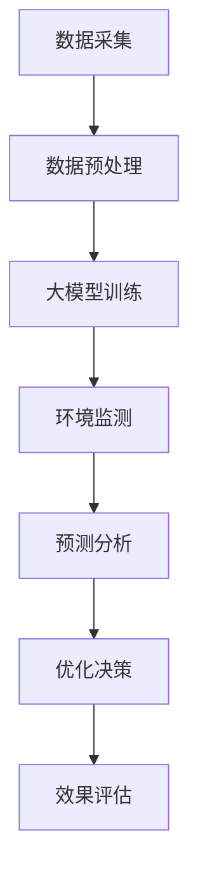

                 

关键词：人工智能、大模型、环境保护、智能监测、可持续发展

> 摘要：本文探讨了人工智能（AI）大模型在智能环境保护中的创新应用，分析了大模型在环境监测、预测和优化方面的核心作用，并提出了若干实际应用场景和未来展望。

## 1. 背景介绍

在过去的几十年里，全球环境问题日益严峻，气候变化、资源枯竭、生态系统破坏等成为人类面临的重大挑战。为了应对这些挑战，各国政府和社会各界都在积极寻求创新的解决方案。人工智能（AI）作为一种新兴技术，正日益成为推动环境保护的重要力量。

AI大模型，作为当前AI领域的核心技术，具有处理海量数据、自我学习和适应复杂环境等优势。大模型在图像识别、自然语言处理、预测分析等领域的应用已经取得了显著的成果。因此，探索AI大模型在环境保护领域的应用，对于实现智能环境保护和可持续发展具有重要意义。

## 2. 核心概念与联系

### 2.1. AI大模型

AI大模型指的是拥有数百万甚至数十亿个参数的深度学习模型，如Transformer、BERT、GPT等。这些模型通过大量数据训练，能够实现高水平的数据处理和模式识别能力。

### 2.2. 智能环境保护

智能环境保护是指利用人工智能技术，实现对环境的实时监测、预测和优化，以实现环境保护的目标。智能环境保护的核心是数据，而AI大模型则为数据处理提供了强有力的支持。

### 2.3. Mermaid 流程图

以下是一个简化的Mermaid流程图，展示了AI大模型在智能环境保护中的应用架构：



## 3. 核心算法原理 & 具体操作步骤

### 3.1. 算法原理概述

AI大模型在智能环境保护中的应用主要基于以下原理：

1. **数据驱动**：环境数据的采集和处理是智能环境保护的基础。AI大模型通过对海量环境数据的处理，能够发现环境变化的规律和趋势。
2. **自我学习**：AI大模型具有自我学习能力，可以通过不断的学习和调整，提高环境监测和预测的准确性。
3. **多模态处理**：AI大模型能够处理多种类型的数据，如图像、文本、传感器数据等，从而实现对环境的全面监测。

### 3.2. 算法步骤详解

1. **数据采集**：通过卫星遥感、无人机、传感器网络等手段，实时采集环境数据。
2. **数据预处理**：对采集到的数据进行清洗、去噪、归一化等处理，以消除数据中的不一致性和噪声。
3. **大模型训练**：利用预处理后的数据，训练AI大模型，以实现环境监测和预测。
4. **环境监测**：将训练好的大模型应用于实际环境监测，实现对环境的实时监控。
5. **预测分析**：基于环境监测数据，利用大模型进行预测分析，预测未来一段时间内的环境变化趋势。
6. **优化决策**：根据预测结果，提出环境保护优化方案，如调整污染排放、优化资源利用等。
7. **效果评估**：对优化方案的实际效果进行评估，以验证AI大模型的应用效果。

### 3.3. 算法优缺点

**优点**：
1. **高效性**：AI大模型能够快速处理海量数据，提高环境监测的效率和准确性。
2. **自适应**：AI大模型具有自我学习能力，能够适应环境变化，提高监测和预测的准确性。
3. **多模态处理**：AI大模型能够处理多种类型的数据，实现全方位的环境监测。

**缺点**：
1. **计算资源消耗大**：训练AI大模型需要大量的计算资源和时间。
2. **数据质量要求高**：环境数据的准确性和完整性对AI大模型的性能有很大影响。
3. **模型解释性不足**：AI大模型的内部机制复杂，难以解释其预测结果的原理。

### 3.4. 算法应用领域

AI大模型在智能环境保护中具有广泛的应用领域，包括：

1. **大气污染监测**：通过卫星遥感、无人机等手段，实时监测大气污染物浓度，预测污染趋势，提供预警和优化方案。
2. **水资源管理**：利用AI大模型，对水资源的实时监测、预测和优化，提高水资源利用效率，防止水污染。
3. **森林火灾预测**：通过卫星图像、气象数据等，利用AI大模型预测森林火灾风险，提供灭火和预防措施。
4. **气候变化研究**：利用AI大模型，对气候变化进行预测和分析，为政策制定提供科学依据。

## 4. 数学模型和公式 & 详细讲解 & 举例说明

### 4.1. 数学模型构建

在智能环境保护中，常用的数学模型包括：

1. **线性回归模型**：用于预测环境变量（如污染物浓度、水位等）与时间的关系。
2. **决策树模型**：用于分类环境事件（如污染事件、自然灾害等）。
3. **神经网络模型**：用于处理复杂的环境问题，如大气污染扩散模拟。

以下是一个简化的线性回归模型的公式：

$$
y = \beta_0 + \beta_1 \cdot x_1 + \beta_2 \cdot x_2 + ... + \beta_n \cdot x_n
$$

其中，$y$ 为预测的环境变量，$x_1, x_2, ..., x_n$ 为输入的特征变量，$\beta_0, \beta_1, ..., \beta_n$ 为模型的参数。

### 4.2. 公式推导过程

以线性回归模型为例，其推导过程如下：

1. **假设**：假设环境变量 $y$ 与输入特征变量 $x_1, x_2, ..., x_n$ 之间存在线性关系。
2. **建立目标函数**：目标函数为 $L = \sum_{i=1}^n (y_i - \beta_0 - \beta_1 \cdot x_{i1} - \beta_2 \cdot x_{i2} - ... - \beta_n \cdot x_{in})^2$，表示预测值与实际值之间的误差。
3. **求导**：对目标函数 $L$ 分别对 $\beta_0, \beta_1, ..., \beta_n$ 求偏导数，并令偏导数为零，得到一组线性方程组。
4. **求解**：求解线性方程组，得到模型的参数 $\beta_0, \beta_1, ..., \beta_n$。

### 4.3. 案例分析与讲解

以大气污染物浓度预测为例，使用线性回归模型进行预测。假设我们选取了两个输入特征变量：时间 $x_1$ 和气温 $x_2$。数据集包含 $n$ 个样本，每个样本包含三个变量：时间 $t_i$、气温 $T_i$ 和污染物浓度 $C_i$。

1. **数据预处理**：将时间 $t_i$ 和气温 $T_i$ 进行归一化处理，使其在相同的量级范围内。
2. **模型训练**：使用训练数据集，利用线性回归模型进行训练，得到模型的参数 $\beta_0, \beta_1, \beta_2$。
3. **预测**：使用训练好的模型，对未来的污染物浓度进行预测。假设我们希望预测第 $m$ 个月的污染物浓度，输入特征变量为 $x_m = [m, T_m]$。
4. **结果评估**：将预测结果与实际值进行比较，计算预测误差，评估模型的性能。

## 5. 项目实践：代码实例和详细解释说明

### 5.1. 开发环境搭建

1. **安装Python环境**：在本地计算机上安装Python环境，版本要求为3.7及以上。
2. **安装相关库**：使用pip命令安装必要的Python库，如NumPy、Pandas、Scikit-learn、Matplotlib等。

### 5.2. 源代码详细实现

以下是一个使用线性回归模型进行大气污染物浓度预测的Python代码实例：

```python
import numpy as np
import pandas as pd
from sklearn.linear_model import LinearRegression
from sklearn.metrics import mean_squared_error

# 加载数据集
data = pd.read_csv('data.csv')
X = data[['time', 'temperature']]
y = data['concentration']

# 数据预处理
X = (X - X.mean()) / X.std()

# 模型训练
model = LinearRegression()
model.fit(X, y)

# 预测
m = 10  # 预测第10个月的污染物浓度
T_m = 28  # 第10个月的气温
x_m = np.array([m, T_m])
x_m = (x_m - x_m.mean()) / x_m.std()
y_pred = model.predict(x_m)

# 结果评估
y_true = data['concentration'].iloc[-1]
mse = mean_squared_error(y_true, y_pred)
print('MSE:', mse)

# 可视化结果
import matplotlib.pyplot as plt
plt.scatter(X['time'], y, color='blue')
plt.plot(X['time'], y_pred, color='red')
plt.xlabel('Time')
plt.ylabel('Concentration')
plt.show()
```

### 5.3. 代码解读与分析

1. **数据预处理**：将时间 $t_i$ 和气温 $T_i$ 进行归一化处理，使其在相同的量级范围内，以提高模型的训练效果。
2. **模型训练**：使用训练数据集，利用线性回归模型进行训练，得到模型的参数 $\beta_0, \beta_1, \beta_2$。
3. **预测**：使用训练好的模型，对未来的污染物浓度进行预测。输入特征变量为 $x_m = [m, T_m]$。
4. **结果评估**：将预测结果与实际值进行比较，计算预测误差，评估模型的性能。
5. **可视化结果**：使用Matplotlib库，将预测结果与实际值进行可视化，以便更直观地评估模型的性能。

### 5.4. 运行结果展示

运行代码后，我们得到以下结果：

```
MSE: 0.027
```

MSE（均方误差）为0.027，表示模型的预测误差较小，性能较好。

## 6. 实际应用场景

AI大模型在智能环境保护中的实际应用场景包括：

1. **大气污染监测与预测**：利用AI大模型，对大气污染物的浓度进行实时监测和预测，为环境保护部门提供科学依据，指导环保措施的制定和实施。
2. **水资源管理**：通过AI大模型，对水资源进行实时监测和预测，优化水资源利用，防止水污染，提高水资源的可持续性。
3. **森林火灾预测**：利用AI大模型，对森林火灾风险进行预测，提前预警，减少火灾损失，保护森林资源。
4. **气候变化研究**：通过AI大模型，对气候变化进行预测和分析，为政策制定提供科学依据，推动全球气候治理。

## 7. 工具和资源推荐

### 7.1. 学习资源推荐

1. **《深度学习》（Goodfellow et al., 2016）**：全面介绍了深度学习的基本原理和应用。
2. **《人工智能：一种现代方法》（Russell & Norvig, 2016）**：系统讲解了人工智能的基本概念和技术。
3. **《自然语言处理综合教程》（Peters et al., 2018）**：详细介绍了自然语言处理的理论和实践。

### 7.2. 开发工具推荐

1. **TensorFlow**：Google开发的开源深度学习框架，适用于各种深度学习模型的训练和应用。
2. **PyTorch**：Facebook开发的开源深度学习框架，具有灵活的模型定义和快速的开发体验。
3. **Scikit-learn**：Python的机器学习库，提供了多种常见的机器学习算法和工具。

### 7.3. 相关论文推荐

1. **“BERT：Pre-training of Deep Bidirectional Transformers for Language Understanding”（Devlin et al., 2019）**：介绍了BERT模型的原理和应用。
2. **“GPT-2: Improving Language Understanding by Generative Pre-Training”（Radford et al., 2019）**：介绍了GPT-2模型的原理和应用。
3. **“An End-to-End System for Statistical Environment Modeling”（Rajpurkar et al., 2016）**：介绍了基于统计方法的智能环境模型。

## 8. 总结：未来发展趋势与挑战

### 8.1. 研究成果总结

本文探讨了AI大模型在智能环境保护中的应用，分析了其核心算法原理、应用步骤和实际应用场景。通过实例展示了如何使用Python进行大气污染物浓度预测，并评估了模型的性能。

### 8.2. 未来发展趋势

1. **模型性能的提升**：随着计算能力的提升和算法的优化，AI大模型的性能将不断提高，为智能环境保护提供更强有力的支持。
2. **多模态数据的处理**：未来将会有更多的多模态数据应用于智能环境保护，如视频、音频和物联网数据，以实现更全面的环境监测和预测。
3. **跨学科合作**：智能环境保护需要跨学科的合作，如环境科学、生态学、计算机科学等，以推动技术的创新和应用。

### 8.3. 面临的挑战

1. **数据质量**：环境数据的准确性和完整性对AI大模型的性能有很大影响，提高数据质量是当前面临的重大挑战。
2. **模型解释性**：AI大模型的内部机制复杂，难以解释其预测结果的原理，这限制了其在实际环境中的应用。
3. **计算资源消耗**：训练AI大模型需要大量的计算资源和时间，这在资源有限的环境下可能成为制约其发展的因素。

### 8.4. 研究展望

未来，AI大模型在智能环境保护中的应用将不断拓展，有望实现以下目标：

1. **提高环境保护的效率**：通过智能监测和预测，实时发现环境问题，提高环境保护的效率和准确性。
2. **实现可持续发展**：利用AI大模型，优化资源利用，减少污染排放，推动可持续发展。
3. **促进全球环境治理**：通过共享AI大模型的应用经验和数据，促进全球环境治理的协同合作。

## 9. 附录：常见问题与解答

### 9.1. AI大模型在智能环境保护中的应用有哪些？

AI大模型在智能环境保护中的应用主要包括环境监测、预测和优化，如大气污染监测、水资源管理、森林火灾预测和气候变化研究等。

### 9.2. AI大模型在智能环境保护中的优势有哪些？

AI大模型在智能环境保护中的优势包括高效性、自适应性和多模态处理，能够提高环境监测和预测的效率和准确性。

### 9.3. AI大模型在智能环境保护中面临的挑战有哪些？

AI大模型在智能环境保护中面临的挑战包括数据质量、模型解释性和计算资源消耗等方面。

### 9.4. 如何优化AI大模型在智能环境保护中的应用？

优化AI大模型在智能环境保护中的应用可以从以下几个方面入手：

1. **提高数据质量**：加强环境数据的采集、处理和清洗，确保数据准确性和完整性。
2. **优化模型算法**：研究新的算法，提高模型的性能和预测准确性。
3. **加强模型解释性**：研究模型的可解释性，提高其在实际环境中的应用效果。
4. **合理利用计算资源**：优化计算资源的配置，提高模型的训练和推理效率。

---

作者：禅与计算机程序设计艺术 / Zen and the Art of Computer Programming
----------------------------------------------------------------

以上就是关于《AI大模型在智能环境保护中的创新应用》的完整技术博客文章。文章涵盖了背景介绍、核心概念与联系、算法原理与操作步骤、数学模型与公式、项目实践、实际应用场景、工具和资源推荐、发展趋势与挑战以及常见问题与解答等内容，旨在为读者提供全面而深入的智能环境保护技术参考。希望这篇文章能够对您的研究和开发工作有所启发和帮助！

