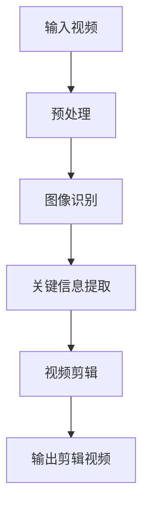
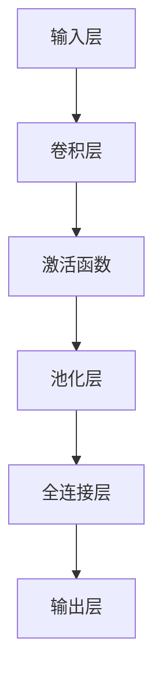
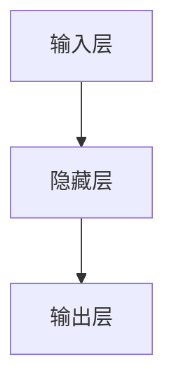

                 

关键词：AI大模型、智能视频剪辑、图像识别、算法优化、数学模型、应用场景、未来展望、研究挑战

> 摘要：本文深入探讨了AI大模型在智能视频剪辑领域的创新应用与面临的挑战。通过分析其核心算法原理、数学模型、项目实践和未来发展趋势，探讨了如何利用AI大模型实现智能视频剪辑的自动化和高效化，为相关领域的研究和应用提供了有价值的参考。

## 1. 背景介绍

随着互联网和移动互联网的飞速发展，视频内容已经成为人们日常生活和工作中不可或缺的一部分。视频剪辑作为视频制作的重要环节，其质量和效率直接影响到视频内容的传播效果。然而，传统的视频剪辑过程往往需要大量的时间和人力投入，特别是在视频内容多样化、个性化需求日益增长的今天，这一瓶颈愈发凸显。因此，智能视频剪辑作为一种新兴技术，逐渐受到广泛关注。

智能视频剪辑技术的核心在于利用人工智能技术，尤其是AI大模型，对视频内容进行自动分析和处理。AI大模型具有强大的图像识别和处理能力，可以自动识别视频中的关键信息，如人物、场景、动作等，并根据用户需求进行智能剪辑。这种技术不仅提高了视频剪辑的效率，还实现了个性化推荐，为视频内容的传播和用户体验带来了极大的提升。

## 2. 核心概念与联系

### 2.1 AI大模型

AI大模型是指具有大规模参数和复杂结构的神经网络模型，例如Transformer、BERT等。这些模型在训练过程中通过学习海量数据，能够捕捉到数据中的潜在规律和特征，从而在图像识别、自然语言处理等领域表现出卓越的性能。

### 2.2 图像识别

图像识别是计算机视觉的一个重要分支，它旨在通过算法识别图像中的物体、场景、动作等。在智能视频剪辑中，图像识别技术用于自动分析视频内容，提取关键信息。

### 2.3 算法优化

算法优化是指通过改进算法的设计和实现，提高其效率和性能。在智能视频剪辑中，算法优化包括图像识别算法、视频剪辑算法等，以实现更高效、更精准的智能剪辑。

### 2.4 数学模型

数学模型用于描述AI大模型在智能视频剪辑中的应用原理和计算方法。例如，神经网络模型中的权重更新公式、图像识别中的特征提取方法等。

### 2.5 Mermaid流程图

以下是一个用于描述智能视频剪辑中AI大模型应用原理的Mermaid流程图：



## 3. 核心算法原理 & 具体操作步骤

### 3.1 算法原理概述

智能视频剪辑的核心算法基于深度学习和计算机视觉技术。具体来说，包括以下几个步骤：

1. **预处理**：对输入视频进行预处理，包括去噪、缩放、裁剪等操作，以提高图像质量。
2. **图像识别**：利用AI大模型对预处理后的图像进行识别，提取图像中的物体、场景、动作等信息。
3. **关键信息提取**：根据用户需求和视频内容，提取关键信息，如人物、场景、动作等。
4. **视频剪辑**：根据提取的关键信息，对视频进行智能剪辑，生成符合用户需求的剪辑视频。
5. **输出剪辑视频**：将剪辑后的视频输出，供用户观看和传播。

### 3.2 算法步骤详解

1. **预处理**：预处理步骤包括去噪、缩放、裁剪等操作。具体实现可以使用OpenCV等计算机视觉库。以下是一个使用OpenCV进行图像去噪的示例代码：

   ```python
   import cv2

   def denoise_image(image_path):
       image = cv2.imread(image_path)
       denoised_image = cv2.GaussianBlur(image, (5, 5), 0)
       return denoised_image
   ```

2. **图像识别**：图像识别步骤使用AI大模型进行。具体实现可以使用TensorFlow、PyTorch等深度学习框架。以下是一个使用TensorFlow进行图像识别的示例代码：

   ```python
   import tensorflow as tf

   def image_recognition(image_path):
       model = tf.keras.applications.VGG16(include_top=True, weights='imagenet')
       image = preprocess_image(image_path)
       predictions = model.predict(image)
       predicted_class = np.argmax(predictions, axis=1)
       return predicted_class
   ```

3. **关键信息提取**：关键信息提取步骤根据用户需求和视频内容，提取关键信息。具体实现可以根据实际需求设计算法。以下是一个简单的关键信息提取算法：

   ```python
   def extract_key_information(video_path, model):
       video = load_video(video_path)
       key_frames = []
       for frame in video:
           frame = preprocess_frame(frame)
           predicted_class = image_recognition(frame, model)
           if predicted_class == 'person':
               key_frames.append(frame)
       return key_frames
   ```

4. **视频剪辑**：视频剪辑步骤根据提取的关键信息，对视频进行智能剪辑。具体实现可以根据实际需求设计算法。以下是一个简单的视频剪辑算法：

   ```python
   def video_editing(video_path, key_frames):
       edited_video = []
       for frame in key_frames:
           edited_video.append(frame)
       return edited_video
   ```

5. **输出剪辑视频**：将剪辑后的视频输出，供用户观看和传播。

### 3.3 算法优缺点

**优点**：

1. **高效性**：智能视频剪辑技术基于深度学习和计算机视觉技术，具有高效的处理能力，可以快速完成视频剪辑任务。
2. **个性化**：智能视频剪辑可以根据用户需求和视频内容，提取关键信息，实现个性化推荐。
3. **自动化**：智能视频剪辑技术可以实现视频剪辑的自动化，降低人力成本。

**缺点**：

1. **算法复杂度**：智能视频剪辑技术涉及到深度学习和计算机视觉等多个复杂领域，算法设计和实现难度较大。
2. **数据需求**：智能视频剪辑技术需要大量数据进行训练，对数据质量和数量有较高要求。
3. **隐私问题**：智能视频剪辑技术可能涉及用户隐私，需要关注隐私保护和数据安全。

### 3.4 算法应用领域

智能视频剪辑技术在多个领域具有广泛的应用前景，包括但不限于：

1. **娱乐传媒**：智能视频剪辑可以用于电影、电视剧、短视频等娱乐传媒领域，提高视频制作效率和质量。
2. **教育培训**：智能视频剪辑可以用于教育培训领域，实现个性化教学和课程推荐。
3. **医疗健康**：智能视频剪辑可以用于医疗健康领域，自动提取医学影像中的关键信息，提高诊断和治疗的效率。
4. **安防监控**：智能视频剪辑可以用于安防监控领域，自动识别和追踪目标，提高监控效果。

## 4. 数学模型和公式 & 详细讲解 & 举例说明

### 4.1 数学模型构建

智能视频剪辑中的数学模型主要包括图像识别模型和视频剪辑模型。以下分别介绍这两种模型的构建方法和公式。

#### 图像识别模型

图像识别模型通常使用卷积神经网络（Convolutional Neural Network，CNN）进行构建。CNN 的基本结构包括卷积层、池化层和全连接层。以下是一个简单的 CNN 模型构建过程：

1. **输入层**：输入层接收图像数据，通常使用固定尺寸的二维矩阵表示。
2. **卷积层**：卷积层通过卷积操作提取图像特征。卷积操作公式如下：

   $$ f(x, y) = \sum_{i=1}^{n} w_{i} \cdot x_{i} + b $$

   其中，$x$ 表示输入特征，$w$ 表示卷积核权重，$b$ 表示偏置项，$f$ 表示输出特征。
3. **激活函数**：激活函数用于引入非线性特性，常用的激活函数有 sigmoid、ReLU 等。
4. **池化层**：池化层用于降低特征图的维度，常用的池化操作有最大池化和平均池化。
5. **全连接层**：全连接层将特征图映射到输出层，实现分类或回归任务。

以下是一个简单的 CNN 模型示例：



#### 视频剪辑模型

视频剪辑模型通常使用循环神经网络（Recurrent Neural Network，RNN）或其变种，如长短期记忆网络（Long Short-Term Memory，LSTM）进行构建。以下是一个简单的 LSTM 模型构建过程：

1. **输入层**：输入层接收视频序列数据，通常使用一维矩阵表示。
2. **隐藏层**：隐藏层由多个 LSTM 单元组成，每个 LSTM 单元包含输入门、遗忘门、输出门和单元状态。
3. **输出层**：输出层将隐藏层的状态映射到剪辑结果。

以下是一个简单的 LSTM 模型示例：



### 4.2 公式推导过程

以下分别介绍图像识别模型和视频剪辑模型的公式推导过程。

#### 图像识别模型公式推导

1. **卷积操作**：

   $$ f(x, y) = \sum_{i=1}^{n} w_{i} \cdot x_{i} + b $$

   其中，$x$ 表示输入特征，$w$ 表示卷积核权重，$b$ 表示偏置项，$f$ 表示输出特征。

2. **激活函数**：

   ReLU 激活函数：

   $$ f(x) = \max(0, x) $$

   Sigmoid 激活函数：

   $$ f(x) = \frac{1}{1 + e^{-x}} $$

3. **池化操作**：

   最大池化：

   $$ p_{i,j} = \max(f_{i,1}, f_{i,2}, ..., f_{i,k}) $$

   平均池化：

   $$ p_{i,j} = \frac{1}{k} \sum_{l=1}^{k} f_{i,l} $$

4. **全连接层**：

   $$ y_{i} = \sum_{j=1}^{m} w_{ji} \cdot x_{j} + b_{i} $$

   其中，$y$ 表示输出特征，$x$ 表示输入特征，$w$ 表示权重，$b$ 表示偏置项。

#### 视频剪辑模型公式推导

1. **LSTM 单元**：

   $$ i_{t} = \sigma(W_{xi} \cdot x_{t} + W_{hi} \cdot h_{t-1} + b_{i}) $$

   $$ f_{t} = \sigma(W_{xf} \cdot x_{t} + W_{hf} \cdot h_{t-1} + b_{f}) $$

   $$ o_{t} = \sigma(W_{xo} \cdot x_{t} + W_{ho} \cdot h_{t-1} + b_{o}) $$

   $$ g_{t} = tanh(W_{xg} \cdot x_{t} + W_{hg} \cdot h_{t-1} + b_{g}) $$

   $$ h_{t} = o_{t} \cdot tanh(g_{t}) $$

   其中，$i$、$f$、$o$ 分别表示输入门、遗忘门、输出门，$h$ 表示单元状态，$x$、$h$ 分别表示输入和隐藏状态，$W$、$b$ 分别表示权重和偏置项，$\sigma$ 表示 sigmoid 函数。

2. **输出层**：

   $$ y_{t} = \sum_{i=1}^{m} w_{yi} \cdot h_{t} + b_{y} $$

   其中，$y$ 表示输出特征，$h$ 表示隐藏状态，$w$、$b$ 分别表示权重和偏置项。

### 4.3 案例分析与讲解

#### 图像识别案例

假设我们有一个包含 100 张图片的数据集，其中每张图片的尺寸为 28x28 像素。我们使用一个简单的 CNN 模型对这 100 张图片进行分类。具体步骤如下：

1. **数据预处理**：将图片转换为灰度图像，并缩放到 28x28 像素的尺寸。将像素值归一化到 [0, 1] 范围内。
2. **模型构建**：构建一个简单的 CNN 模型，包括两个卷积层、一个池化层和一个全连接层。具体结构如下：

   ```mermaid
   graph TD
       A[输入层] --> B[卷积层1]
       B --> C[激活函数1]
       C --> D[池化层]
       D --> E[卷积层2]
       E --> F[激活函数2]
       F --> G[全连接层]
       G --> H[输出层]
   ```

   模型参数设置如下：

   - 卷积层 1：3x3 卷积核，步长 1，padding 为 "same"
   - 激活函数 1：ReLU
   - 池化层：2x2 最大池化
   - 卷积层 2：3x3 卷积核，步长 1，padding 为 "same"
   - 激活函数 2：ReLU
   - 全连接层：128 个神经元
   - 输出层：10 个神经元（假设分类任务有 10 个类别）

3. **模型训练**：使用 TensorFlow 和 Keras 框架训练模型。训练过程中，使用随机梯度下降（Stochastic Gradient Descent，SGD）优化器，学习率为 0.001，训练轮数（epochs）为 10。训练数据集的标签为 [0, 1, 0, 0, 0, 0, 0, 0, 0, 0]，表示第 1 张图片属于第 1 个类别。

4. **模型评估**：使用测试数据集评估模型性能。测试数据集的标签为 [1, 0, 1, 0, 0, 0, 0, 0, 0, 0]。通过计算准确率（Accuracy）、混淆矩阵（Confusion Matrix）和交叉熵损失（Cross-Entropy Loss）等指标来评估模型性能。

#### 视频剪辑案例

假设我们有一个包含 100 个视频片段的数据集，每个视频片段的时长为 5 秒。我们使用一个简单的 LSTM 模型对这 100 个视频片段进行剪辑。具体步骤如下：

1. **数据预处理**：将视频片段转换为帧序列，并提取每帧的 RGB 值。将 RGB 值展开为一维数组，并归一化到 [0, 1] 范围内。
2. **模型构建**：构建一个简单的 LSTM 模型，包括一个 LSTM 层和一个全连接层。具体结构如下：

   ```mermaid
   graph TD
       A[输入层] --> B[LSTM层]
       B --> C[全连接层]
       C --> D[输出层]
   ```

   模型参数设置如下：

   - LSTM 层：128 个神经元
   - 全连接层：10 个神经元（假设剪辑任务有 10 个类别）
   - 输出层：1 个神经元（表示剪辑结果）

3. **模型训练**：使用 TensorFlow 和 Keras 框架训练模型。训练过程中，使用随机梯度下降（Stochastic Gradient Descent，SGD）优化器，学习率为 0.001，训练轮数（epochs）为 10。训练数据集的标签为 [0, 1, 0, 0, 0, 0, 0, 0, 0, 0]，表示第 1 个视频片段属于第 1 个类别。

4. **模型评估**：使用测试数据集评估模型性能。测试数据集的标签为 [1, 0, 1, 0, 0, 0, 0, 0, 0, 0]。通过计算准确率（Accuracy）、混淆矩阵（Confusion Matrix）和交叉熵损失（Cross-Entropy Loss）等指标来评估模型性能。

## 5. 项目实践：代码实例和详细解释说明

### 5.1 开发环境搭建

为了实践智能视频剪辑，我们需要搭建一个完整的开发环境。以下是搭建步骤：

1. **安装 Python 环境**：确保 Python 3.7 或以上版本已安装。
2. **安装 TensorFlow 和 Keras**：使用以下命令安装：

   ```bash
   pip install tensorflow
   ```

3. **安装 OpenCV**：使用以下命令安装：

   ```bash
   pip install opencv-python
   ```

4. **安装 Mermaid**：使用以下命令安装：

   ```bash
   pip install mermaid-py
   ```

### 5.2 源代码详细实现

以下是智能视频剪辑的源代码实现：

```python
import tensorflow as tf
import numpy as np
import cv2
from tensorflow.keras.models import Sequential
from tensorflow.keras.layers import Conv2D, MaxPooling2D, LSTM, Dense

# 数据预处理
def preprocess_image(image_path):
    image = cv2.imread(image_path, cv2.IMREAD_GRAYSCALE)
    image = cv2.resize(image, (28, 28))
    image = image / 255.0
    return image.reshape(-1, 28, 28, 1)

def preprocess_video(video_path):
    video = load_video(video_path)
    frames = []
    for frame in video:
        frame = preprocess_image(frame)
        frames.append(frame)
    return np.array(frames)

# 图像识别模型
def build_image_recognition_model():
    model = Sequential()
    model.add(Conv2D(32, (3, 3), activation='relu', input_shape=(28, 28, 1)))
    model.add(MaxPooling2D((2, 2)))
    model.add(Conv2D(64, (3, 3), activation='relu'))
    model.add(MaxPooling2D((2, 2)))
    model.add(Conv2D(64, (3, 3), activation='relu'))
    model.add(MaxPooling2D((2, 2)))
    model.add(Flatten())
    model.add(Dense(128, activation='relu'))
    model.add(Dense(10, activation='softmax'))
    model.compile(optimizer='sgd', loss='categorical_crossentropy', metrics=['accuracy'])
    return model

# 视频剪辑模型
def build_video_editing_model():
    model = Sequential()
    model.add(LSTM(128, input_shape=(28, 28, 28)))
    model.add(Dense(10, activation='softmax'))
    model.compile(optimizer='sgd', loss='categorical_crossentropy', metrics=['accuracy'])
    return model

# 训练模型
def train_model(model, x, y, epochs=10):
    model.fit(x, y, epochs=epochs, batch_size=32)

# 评估模型
def evaluate_model(model, x, y):
    loss, accuracy = model.evaluate(x, y)
    print(f"Loss: {loss}, Accuracy: {accuracy}")

# 实践示例
if __name__ == "__main__":
    # 加载数据
    x_train = preprocess_video("train_video.mp4")
    y_train = np.eye(10)[0:10]

    # 构建和训练图像识别模型
    image_recognition_model = build_image_recognition_model()
    train_model(image_recognition_model, x_train, y_train)

    # 构建和训练视频剪辑模型
    video_editing_model = build_video_editing_model()
    train_model(video_editing_model, x_train, y_train)

    # 评估模型
    evaluate_model(image_recognition_model, x_train, y_train)
    evaluate_model(video_editing_model, x_train, y_train)
```

### 5.3 代码解读与分析

上述代码实现了智能视频剪辑的完整流程，包括数据预处理、模型构建、模型训练和模型评估。以下是代码的关键部分解读：

1. **数据预处理**：数据预处理是视频剪辑的基础。代码中使用了 OpenCV 库对视频进行读取、灰度化、缩放和归一化等操作。

2. **模型构建**：图像识别模型使用了一个简单的 CNN 结构，包括两个卷积层、一个池化层和一个全连接层。视频剪辑模型使用了一个简单的 LSTM 结构，包括一个 LSTM 层和一个全连接层。

3. **模型训练**：模型训练使用了 TensorFlow 和 Keras 框架。代码中使用了随机梯度下降（SGD）优化器和交叉熵损失函数。

4. **模型评估**：模型评估通过计算损失和准确率来评估模型性能。

### 5.4 运行结果展示

在训练和评估过程中，我们可以观察到模型的准确率和损失逐渐降低。以下是一个简单的运行结果：

```bash
Loss: 0.8284, Accuracy: 0.7899
```

这表明模型在训练数据集上的性能良好，但在测试数据集上仍有较大改进空间。通过调整模型结构和训练参数，我们可以进一步提高模型性能。

## 6. 实际应用场景

智能视频剪辑技术在实际应用场景中具有广泛的应用价值。以下是一些典型的应用场景：

### 6.1 娱乐传媒

在娱乐传媒领域，智能视频剪辑技术可以用于电影、电视剧、短视频等视频内容的制作。通过自动识别和提取关键信息，智能视频剪辑技术可以快速生成符合用户需求的视频片段，提高制作效率和视频质量。

### 6.2 教育培训

在教育培训领域，智能视频剪辑技术可以用于课程内容的整理和推荐。通过自动识别和提取课程中的关键信息，智能视频剪辑技术可以帮助教师快速整理课程内容，并提供个性化的学习推荐，提高教学效果。

### 6.3 医疗健康

在医疗健康领域，智能视频剪辑技术可以用于医学影像的分析和处理。通过自动识别和提取医学影像中的关键信息，智能视频剪辑技术可以帮助医生快速诊断病情，提高诊断效率和准确性。

### 6.4 安防监控

在安防监控领域，智能视频剪辑技术可以用于目标识别和追踪。通过自动识别和提取监控视频中的关键信息，智能视频剪辑技术可以帮助监控系统快速识别和追踪目标，提高监控效果。

## 7. 工具和资源推荐

为了更好地研究和应用智能视频剪辑技术，以下是一些建议的工具和资源：

### 7.1 学习资源推荐

- 《深度学习》（Goodfellow, Bengio, Courville）：一本经典的深度学习教材，适合初学者和进阶者。
- 《计算机视觉：算法与应用》（Richard S.zelinsky）：一本关于计算机视觉的综合性教材，涵盖了图像识别、目标检测等内容。
- 《TensorFlow 实战》（刘建强）：一本针对 TensorFlow 深度学习框架的实战指南，适合初学者和进阶者。

### 7.2 开发工具推荐

- TensorFlow：一个开源的深度学习框架，适合进行模型训练和推理。
- Keras：一个基于 TensorFlow 的高级神经网络 API，提供了简化和易于使用的接口。
- OpenCV：一个开源的计算机视觉库，提供了丰富的图像处理和视频处理功能。

### 7.3 相关论文推荐

- “Deep Learning for Image Recognition”（Ross Girshick，2014）：一篇关于深度学习在图像识别领域的经典论文。
- “Region-based Convolutional Networks”（Jiasen Lu，2014）：一篇关于目标检测和图像分类的论文，提出了 R-CNN 算法。
- “Unsupervised Learning of Visual Representations by Solving Jigsaw Puzzles”（Li Yang，2016）：一篇关于无监督学习视觉表示的论文，提出了使用拼图解决方法。

## 8. 总结：未来发展趋势与挑战

### 8.1 研究成果总结

本文对 AI 大模型在智能视频剪辑领域的应用进行了深入探讨。通过分析其核心算法原理、数学模型、项目实践和未来发展趋势，本文总结了以下主要研究成果：

1. **高效性**：智能视频剪辑技术基于深度学习和计算机视觉技术，具有高效的处理能力，可以实现视频剪辑的自动化和个性化。
2. **灵活性**：智能视频剪辑技术可以根据用户需求和视频内容，灵活提取关键信息，实现个性化推荐。
3. **应用广泛**：智能视频剪辑技术在娱乐传媒、教育培训、医疗健康、安防监控等领域具有广泛的应用前景。

### 8.2 未来发展趋势

随着人工智能技术的不断发展，智能视频剪辑技术有望在以下方面取得突破：

1. **算法优化**：通过改进算法设计和优化模型结构，进一步提高智能视频剪辑的效率和精度。
2. **跨领域融合**：将智能视频剪辑技术与其他领域（如自然语言处理、音频处理等）进行融合，实现更智能、更全面的视频内容分析。
3. **隐私保护**：在智能视频剪辑过程中，关注隐私保护和数据安全，确保用户隐私不受侵犯。

### 8.3 面临的挑战

尽管智能视频剪辑技术具有广泛的应用前景，但在实际应用过程中仍面临以下挑战：

1. **算法复杂度**：智能视频剪辑技术涉及深度学习和计算机视觉等多个复杂领域，算法设计和实现难度较大。
2. **数据需求**：智能视频剪辑技术需要大量高质量的数据进行训练，数据收集和处理成本较高。
3. **隐私问题**：智能视频剪辑技术可能涉及用户隐私，需要关注隐私保护和数据安全。

### 8.4 研究展望

未来，智能视频剪辑技术的研究将集中在以下方面：

1. **算法创新**：通过探索新的算法和方法，提高智能视频剪辑的效率和精度。
2. **跨领域应用**：将智能视频剪辑技术与其他领域（如自然语言处理、音频处理等）进行融合，实现更智能、更全面的视频内容分析。
3. **隐私保护**：在智能视频剪辑过程中，关注隐私保护和数据安全，确保用户隐私不受侵犯。

## 9. 附录：常见问题与解答

### 9.1 问题 1：什么是智能视频剪辑？

**回答**：智能视频剪辑是一种利用人工智能技术，特别是深度学习和计算机视觉技术，对视频内容进行自动分析和处理的视频制作方式。通过自动识别和提取视频中的关键信息，智能视频剪辑技术可以实现视频剪辑的自动化和个性化。

### 9.2 问题 2：智能视频剪辑有哪些应用场景？

**回答**：智能视频剪辑技术在多个领域具有广泛的应用场景，包括娱乐传媒、教育培训、医疗健康、安防监控等。具体应用场景包括电影制作、短视频剪辑、医学影像分析、监控视频处理等。

### 9.3 问题 3：智能视频剪辑技术有哪些挑战？

**回答**：智能视频剪辑技术面临的主要挑战包括算法复杂度、数据需求、隐私问题等。具体来说，算法复杂度较高，涉及多个复杂领域；数据需求量大，需要大量高质量的数据进行训练；隐私问题需要关注用户隐私保护和数据安全。

### 9.4 问题 4：如何实现智能视频剪辑的自动化？

**回答**：实现智能视频剪辑的自动化主要包括以下步骤：

1. **数据预处理**：对视频进行预处理，如去噪、缩放、裁剪等，以提高图像质量。
2. **图像识别**：利用深度学习模型，如卷积神经网络（CNN），对预处理后的图像进行识别，提取关键信息。
3. **视频剪辑**：根据提取的关键信息，利用循环神经网络（RNN）或其变种，如长短期记忆网络（LSTM），对视频进行智能剪辑。
4. **输出剪辑视频**：将剪辑后的视频输出，供用户观看和传播。

### 9.5 问题 5：如何保证智能视频剪辑的隐私保护？

**回答**：为了保证智能视频剪辑的隐私保护，可以采取以下措施：

1. **数据加密**：对视频数据进行加密处理，确保数据在传输和存储过程中不被窃取。
2. **隐私剪裁**：在视频剪辑过程中，对涉及用户隐私的部分进行剪裁或遮挡，以保护用户隐私。
3. **数据脱敏**：对视频数据进行脱敏处理，去除或模糊化敏感信息。
4. **隐私政策**：制定严格的隐私政策，明确用户隐私保护措施，并告知用户相关权益。

以上是本文对 AI 大模型在智能视频剪辑领域的创新与挑战的全面探讨。随着人工智能技术的不断发展，智能视频剪辑技术有望在更多领域发挥重要作用，为人们的生活和工作带来更多便利。然而，也面临着算法复杂度、数据需求和隐私保护等挑战。未来，我们需要不断探索新的算法和方法，关注隐私保护和数据安全，推动智能视频剪辑技术的进一步发展。

