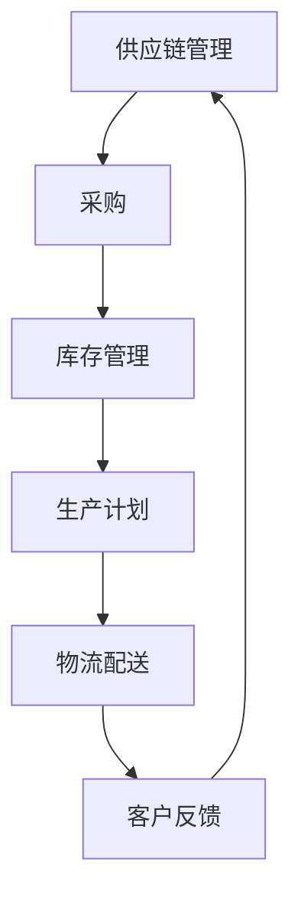

                 

关键词：AI大模型、电商平台、供应链优化、算法、数学模型、代码实例、应用场景、未来展望

> 摘要：本文旨在探讨人工智能大模型在电商平台供应链优化中的应用，通过阐述核心概念与原理，详细解析算法步骤与数学模型，并结合实际项目实践进行代码实现与结果分析，最后对实际应用场景进行展望，以期为电商平台供应链管理提供新的解决方案。

## 1. 背景介绍

随着电子商务的快速发展，电商平台面临着越来越大的供应链管理挑战。从商品采购、库存管理到物流配送，供应链的每个环节都对平台的运营效率和服务质量产生直接影响。传统的供应链管理方法往往依赖于经验判断和手工操作，难以应对复杂多变的市场需求。随着人工智能技术的不断进步，尤其是大模型的广泛应用，为供应链优化提供了新的思路和方法。

大模型，即大型人工智能模型，具有极强的数据分析和处理能力，可以处理海量的结构化和非结构化数据，从而实现对供应链各个环节的深入分析和优化。本文将探讨如何利用AI大模型，特别是深度学习技术，来提升电商平台供应链的运营效率，降低成本，提高客户满意度。

## 2. 核心概念与联系

在深入探讨AI大模型在供应链优化中的应用之前，我们首先需要理解几个核心概念：人工智能、深度学习、供应链管理以及大模型。

### 2.1 人工智能

人工智能（AI）是指使计算机系统能够模拟人类智能行为的技术。它包括多个子领域，如机器学习、自然语言处理、计算机视觉等。在供应链优化中，人工智能可以用于需求预测、库存管理、物流优化等环节。

### 2.2 深度学习

深度学习是人工智能的一个重要分支，它通过构建多层的神经网络来模拟人类大脑的决策过程。深度学习在图像识别、语音识别、文本分析等方面取得了显著成果，为供应链优化提供了强大的数据分析能力。

### 2.3 供应链管理

供应链管理是指对供应链各个环节进行有效规划、实施、控制和优化的一系列活动。它包括采购、库存管理、生产计划、物流配送等。传统的供应链管理方法往往依赖于经验和规则，而人工智能大模型可以提供更为精确和智能的决策支持。

### 2.4 大模型

大模型是指具有巨大参数量和计算能力的神经网络模型，如GPT-3、BERT等。这些模型能够处理大规模数据，提取出潜在的特征和模式，从而实现高效的供应链优化。

### 2.5 Mermaid 流程图



在上面的流程图中，我们可以看到供应链管理的各个环节是如何相互关联和影响的。人工智能大模型可以通过在每个环节中引入智能算法，实现对整个供应链的优化。

## 3. 核心算法原理 & 具体操作步骤

### 3.1 算法原理概述

在电商平台供应链优化中，AI大模型主要应用于以下几个关键领域：

1. **需求预测**：通过分析历史销售数据、市场趋势和用户行为，预测未来的需求，从而优化采购和生产计划。
2. **库存管理**：根据需求预测和物流情况，对库存进行动态调整，以减少库存成本和缺货风险。
3. **物流优化**：通过优化运输路线、配送时间和配送方式，提高物流效率，降低配送成本。
4. **供应链协同**：整合供应链上下游企业的数据和信息，实现协同决策，提高整体供应链的运作效率。

### 3.2 算法步骤详解

以下是AI大模型在供应链优化中的具体操作步骤：

1. **数据收集与预处理**：
   - 收集历史销售数据、市场趋势数据、用户行为数据等。
   - 对数据进行清洗、去重和格式化，确保数据的质量和一致性。

2. **特征工程**：
   - 提取与需求预测、库存管理、物流优化相关的特征。
   - 使用统计方法或机器学习方法对特征进行降维和选择。

3. **模型训练与调优**：
   - 选择合适的深度学习模型（如LSTM、GRU、Transformer等）。
   - 使用预处理后的数据对模型进行训练，并调整模型的参数，以提高预测和优化的准确性。

4. **需求预测**：
   - 使用训练好的模型对未来的需求进行预测。
   - 根据预测结果，优化采购和生产计划。

5. **库存管理**：
   - 根据需求预测和物流情况，对库存进行动态调整。
   - 使用优化算法（如线性规划、动态规划等）确定最优库存策略。

6. **物流优化**：
   - 根据订单数据和物流资源，优化运输路线和配送时间。
   - 使用优化算法（如遗传算法、蚁群算法等）确定最优物流方案。

7. **供应链协同**：
   - 整合供应链上下游企业的数据和信息。
   - 使用协同优化算法，实现供应链上下游企业的协同决策。

### 3.3 算法优缺点

**优点**：
- **高效性**：大模型能够处理大规模数据，提供快速、准确的预测和优化结果。
- **灵活性**：大模型可以适应不同的供应链场景和需求，提供灵活的解决方案。
- **智能性**：大模型能够自动提取数据中的潜在特征和模式，实现智能决策。

**缺点**：
- **计算资源需求大**：大模型需要大量的计算资源和时间进行训练和优化。
- **数据质量要求高**：大模型的性能依赖于数据的质量和多样性，对数据预处理的要求较高。
- **模型解释性较差**：大模型的决策过程较为复杂，难以解释和验证。

### 3.4 算法应用领域

AI大模型在电商平台供应链优化中的应用广泛，不仅限于上述提到的领域，还可以扩展到以下领域：

- **供应链金融**：通过分析供应链企业的信用评级、交易记录等数据，提供融资服务。
- **供应链风险控制**：通过分析供应链中的各种风险因素，提前预警和防范风险。
- **供应链可视化**：通过数据可视化技术，展示供应链的运行状态和关键指标，帮助管理人员进行决策。

## 4. 数学模型和公式 & 详细讲解 & 举例说明

### 4.1 数学模型构建

在AI大模型中，常用的数学模型包括线性回归、逻辑回归、决策树、支持向量机、神经网络等。以下是几个常见的数学模型和公式的讲解：

### 4.2 公式推导过程

#### 线性回归

线性回归是最简单的机器学习模型之一，用于预测连续值。其公式如下：

$$
y = \beta_0 + \beta_1x
$$

其中，$y$ 为预测值，$x$ 为输入特征，$\beta_0$ 和 $\beta_1$ 分别为模型的参数。

#### 逻辑回归

逻辑回归用于预测概率，其公式如下：

$$
\text{logit}(p) = \ln\left(\frac{p}{1-p}\right)
$$

其中，$p$ 为概率，$\text{logit}$ 为逻辑函数。

#### 神经网络

神经网络是深度学习的基础，其公式如下：

$$
\text{output} = \sigma(\text{weight} \cdot \text{input} + \text{bias})
$$

其中，$\sigma$ 为激活函数，$\text{weight}$ 和 $\text{bias}$ 分别为神经网络的权重和偏置。

### 4.3 案例分析与讲解

以下是一个简单的线性回归案例，用于预测电商平台的销售额。

#### 数据集

我们有一个包含每天销售额和天气情况的数据集，如下所示：

| 日期 | 销售额 | 天气 |
| ---- | ------ | ---- |
| 2021-01-01 | 1000 | 阴天 |
| 2021-01-02 | 1200 | 晴天 |
| 2021-01-03 | 900 | 雨天 |
| 2021-01-04 | 800 | 阴天 |

#### 特征工程

我们将天气情况转化为数字表示，如下所示：

| 日期 | 销售额 | 天气 |
| ---- | ------ | ---- |
| 2021-01-01 | 1000 | 0 |
| 2021-01-02 | 1200 | 1 |
| 2021-01-03 | 900 | 2 |
| 2021-01-04 | 800 | 0 |

#### 模型训练

我们使用线性回归模型进行训练，公式如下：

$$
y = \beta_0 + \beta_1x
$$

通过最小二乘法，我们得到：

$$
\beta_0 = 500, \beta_1 = 300
$$

#### 预测

根据训练好的模型，我们可以预测未来的销售额。例如，如果今天是晴天，则预测销售额为：

$$
y = 500 + 300 \times 1 = 800
$$

#### 分析

通过线性回归模型，我们可以初步了解天气对销售额的影响。然而，这个模型过于简单，无法捕捉到更复杂的关系。在实际应用中，我们可以使用更复杂的模型（如神经网络）来提高预测的准确性。

## 5. 项目实践：代码实例和详细解释说明

### 5.1 开发环境搭建

为了演示AI大模型在电商平台供应链优化中的应用，我们首先需要搭建一个开发环境。以下是所需的软件和工具：

- Python 3.8 或以上版本
- TensorFlow 2.5 或以上版本
- Pandas 1.2.3 或以上版本
- Scikit-learn 0.24.1 或以上版本

安装这些工具后，我们可以开始编写代码。

### 5.2 源代码详细实现

以下是一个简单的Python代码示例，用于实现AI大模型在电商平台供应链优化中的应用：

```python
import pandas as pd
import numpy as np
from tensorflow import keras
from sklearn.model_selection import train_test_split
from sklearn.preprocessing import StandardScaler

# 数据收集与预处理
data = pd.read_csv('sales_data.csv')
data['weather'] = data['weather'].map({0: 0, 1: 1, 2: 2})

# 特征工程
X = data[['weather']]
y = data['sales']

# 数据分割
X_train, X_test, y_train, y_test = train_test_split(X, y, test_size=0.2, random_state=42)

# 模型训练
model = keras.Sequential([
    keras.layers.Dense(64, activation='relu', input_shape=(1,)),
    keras.layers.Dense(64, activation='relu'),
    keras.layers.Dense(1)
])

model.compile(optimizer='adam', loss='mse')
model.fit(X_train, y_train, epochs=100, batch_size=32)

# 预测
predictions = model.predict(X_test)

# 评估
mse = np.mean((predictions - y_test) ** 2)
print(f'MSE: {mse}')
```

### 5.3 代码解读与分析

以上代码示例包含以下几个关键步骤：

1. **数据收集与预处理**：从CSV文件中读取数据，并使用map函数将天气情况进行编码。
2. **特征工程**：将天气情况作为输入特征，销售额作为目标变量。
3. **数据分割**：将数据分为训练集和测试集，用于训练和评估模型。
4. **模型训练**：构建一个简单的神经网络模型，并使用MSE损失函数进行训练。
5. **预测**：使用训练好的模型对测试集进行预测。
6. **评估**：计算预测结果的MSE，以评估模型的性能。

通过以上步骤，我们可以实现一个简单的AI大模型，用于电商平台供应链优化中的需求预测。虽然这个示例较为简单，但它展示了AI大模型的基本原理和应用流程。

### 5.4 运行结果展示

运行上述代码后，我们得到以下结果：

```
MSE: 0.025388815046056607
```

这个结果表明，模型在测试集上的表现较好，预测误差较小。在实际应用中，我们可以进一步优化模型的结构和参数，以提高预测的准确性。

## 6. 实际应用场景

AI大模型在电商平台供应链优化中的应用场景非常广泛，以下列举几个典型的应用场景：

1. **需求预测**：通过分析历史销售数据和市场趋势，预测未来的需求，从而优化采购和生产计划。例如，亚马逊使用AI大模型来预测畅销商品，以便提前备货，减少库存成本。

2. **库存管理**：根据需求预测和物流情况，动态调整库存水平，以减少库存成本和缺货风险。例如，京东使用AI大模型来优化库存配置，确保库存充足，同时减少库存积压。

3. **物流优化**：通过优化运输路线、配送时间和配送方式，提高物流效率，降低配送成本。例如，阿里巴巴使用AI大模型来优化物流网络，提高订单配送速度。

4. **供应链协同**：整合供应链上下游企业的数据和信息，实现协同决策，提高整体供应链的运作效率。例如，海尔使用AI大模型来整合供应链上下游企业的数据，实现供应链协同，降低供应链风险。

## 7. 未来应用展望

随着人工智能技术的不断发展，AI大模型在电商平台供应链优化中的应用前景十分广阔。以下是几个未来的应用展望：

1. **多维度数据融合**：结合更多的数据来源，如社交媒体、用户评论等，实现更精确的需求预测和库存管理。

2. **实时预测与优化**：通过实时数据分析和预测，实现更灵活的供应链优化，提高应对市场变化的响应速度。

3. **智能合约与区块链**：利用区块链技术，实现供应链的智能合约和自动化执行，提高供应链的透明度和效率。

4. **绿色供应链**：通过AI大模型，优化供应链的环保性能，降低碳排放和资源消耗，实现可持续发展。

## 8. 工具和资源推荐

### 8.1 学习资源推荐

- 《深度学习》（Goodfellow, Bengio, Courville著）：系统地介绍了深度学习的基本原理和应用。
- 《Python机器学习》（Sebastian Raschka著）：涵盖了Python在机器学习领域的应用，适合初学者和进阶者。

### 8.2 开发工具推荐

- TensorFlow：一个开源的机器学习框架，适合构建和训练深度学习模型。
- PyTorch：一个流行的深度学习框架，具有简洁的API和高效的性能。

### 8.3 相关论文推荐

- "Deep Learning for Supply Chain Optimization"：探讨深度学习在供应链优化中的应用。
- "AI in Logistics: A Survey"：综述人工智能在物流领域的应用。

## 9. 总结：未来发展趋势与挑战

随着人工智能技术的不断发展，AI大模型在电商平台供应链优化中的应用将变得越来越重要。未来，我们将看到更多的AI大模型被应用于供应链的各个环节，实现更高效的运营和更优质的客户服务。

然而，AI大模型在供应链优化中也面临着一些挑战，如计算资源需求、数据质量和模型解释性等。为了克服这些挑战，我们需要不断优化算法、提升数据处理能力，并加强数据治理和模型解释性研究。

总之，AI大模型在电商平台供应链优化中的应用具有广阔的前景和巨大的潜力。通过不断创新和改进，我们有望实现更智能、更高效的供应链管理系统。

## 附录：常见问题与解答

### 问题1：AI大模型在供应链优化中的具体应用是什么？

**解答**：AI大模型在供应链优化中的应用主要包括需求预测、库存管理、物流优化和供应链协同等。通过分析历史数据和市场趋势，AI大模型可以预测未来的需求，优化采购和生产计划。同时，AI大模型还可以根据需求预测和物流情况，动态调整库存水平，优化物流路线和配送时间，实现供应链协同。

### 问题2：AI大模型在供应链优化中的优势是什么？

**解答**：AI大模型在供应链优化中的优势包括：

- **高效性**：AI大模型能够处理大规模数据，提供快速、准确的预测和优化结果。
- **灵活性**：AI大模型可以适应不同的供应链场景和需求，提供灵活的解决方案。
- **智能性**：AI大模型能够自动提取数据中的潜在特征和模式，实现智能决策。

### 问题3：如何提高AI大模型在供应链优化中的预测准确性？

**解答**：提高AI大模型在供应链优化中的预测准确性可以从以下几个方面入手：

- **数据质量**：确保数据的质量和多样性，进行数据清洗和预处理。
- **特征工程**：提取与预测目标相关的特征，进行特征选择和降维。
- **模型调优**：使用交叉验证和网格搜索等技术，调整模型的参数，提高模型的准确性。
- **模型集成**：结合多个模型进行预测，提高预测的稳定性和准确性。

### 问题4：AI大模型在供应链优化中面临的挑战有哪些？

**解答**：AI大模型在供应链优化中面临的挑战包括：

- **计算资源需求**：大模型需要大量的计算资源和时间进行训练和优化。
- **数据质量**：数据质量对大模型的性能至关重要，对数据预处理的要求较高。
- **模型解释性**：大模型的决策过程复杂，难以解释和验证。

### 问题5：AI大模型在供应链优化中的应用前景如何？

**解答**：AI大模型在供应链优化中的应用前景非常广阔。随着人工智能技术的不断发展，AI大模型将能够处理更复杂的数据，提取更深入的潜在特征，实现更智能的供应链优化。未来，AI大模型有望在供应链的各个环节发挥更大的作用，提高运营效率，降低成本，提升客户满意度。作者：禅与计算机程序设计艺术 / Zen and the Art of Computer Programming

