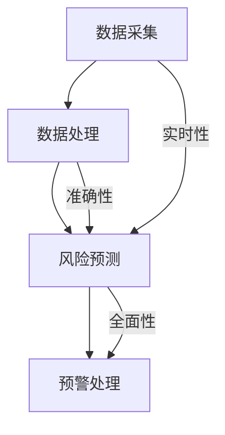

                 

关键词：AI大模型，电商平台，供应链风险，预警系统，深度学习，数据分析，算法优化

摘要：本文探讨了人工智能大模型在电商平台供应链风险预警中的应用，分析了现有预警系统的不足，介绍了大模型的核心概念和原理，并详细阐述了应用大模型进行风险预警的具体算法和数学模型。通过实际项目案例，展示了大模型在提升供应链风险预警准确性、实时性和全面性方面的优势，最后对未来的发展方向和挑战进行了展望。

## 1. 背景介绍

随着电子商务的快速发展，电商平台在全球范围内的市场份额日益扩大。供应链作为电商平台的核心环节，其稳定性和可靠性直接关系到平台的运营效率和用户体验。然而，供应链中存在许多潜在的风险因素，如供应商履约风险、物流延误风险、库存风险等。这些风险如果不及时预警和处理，可能会导致供应链中断、库存积压、成本增加等严重后果。

目前，电商平台普遍采用的供应链风险预警系统主要是基于传统的规则和统计方法，如业务逻辑规则、阈值监控、历史数据分析等。这些方法在一定程度上能够发现潜在风险，但存在以下几个不足之处：

1. **预警准确性较低**：传统方法往往依赖于历史数据和业务经验，难以应对不断变化的市场环境和新出现的问题。
2. **预警实时性较差**：传统方法通常需要周期性的数据分析，无法实现实时预警。
3. **预警范围有限**：传统方法只能针对特定的风险因素进行预警，难以覆盖供应链全流程的风险。

为了解决上述问题，近年来，人工智能，特别是大模型（如深度学习模型）在供应链风险预警领域得到了广泛关注。大模型具有强大的数据处理和模式识别能力，能够从海量数据中自动提取特征，生成准确的预测模型，从而实现更准确、实时和全面的供应链风险预警。

## 2. 核心概念与联系

### 2.1 大模型的基本概念

大模型，通常指那些具有数十亿甚至数千亿参数的深度学习模型。这些模型基于神经网络架构，通过多层非线性变换，对输入数据进行特征提取和模式识别。大模型的核心优势在于其能够自动学习复杂的数据分布和关联关系，从而在各个领域取得了显著的成果。

### 2.2 供应链风险预警系统的架构

供应链风险预警系统一般由数据采集、数据处理、风险预测和预警处理四个主要模块组成。数据采集模块负责收集供应链相关的各种数据，包括供应商信息、物流数据、库存数据等。数据处理模块对原始数据进行清洗、去噪和特征提取，为风险预测提供高质量的数据。风险预测模块基于大模型对采集到的数据进行实时分析，预测可能出现的风险。预警处理模块根据风险预测结果，生成预警信息，并采取相应的应对措施。

### 2.3 大模型在供应链风险预警中的应用

大模型在供应链风险预警中的应用主要包括以下几个方面：

1. **异常检测**：通过分析供应链数据的异常模式，发现潜在的风险点。
2. **趋势预测**：预测供应链关键指标的未来走势，提前发现可能出现的风险。
3. **关联分析**：挖掘供应链中各环节之间的关联关系，识别潜在的风险传导路径。
4. **决策支持**：根据风险预测结果，为供应链管理提供决策支持。

### 2.4 Mermaid 流程图



## 3. 核心算法原理 & 具体操作步骤

### 3.1 算法原理概述

大模型在供应链风险预警中的应用主要基于以下几种深度学习算法：

1. **卷积神经网络（CNN）**：用于图像和序列数据的特征提取，可以有效地处理供应链中的时间序列数据。
2. **循环神经网络（RNN）**：特别适合处理序列数据，可以捕捉供应链中数据的时间依赖关系。
3. **长短期记忆网络（LSTM）**：RNN的改进版本，能够解决传统RNN在处理长时间序列数据时出现的问题。
4. **生成对抗网络（GAN）**：用于生成真实的供应链数据，用于模型训练和评估。

### 3.2 算法步骤详解

1. **数据预处理**：对采集到的数据进行清洗、去噪和归一化处理，确保数据质量。
2. **特征提取**：使用深度学习算法提取数据中的关键特征，如时间序列特征、周期性特征等。
3. **模型训练**：使用训练数据集训练深度学习模型，包括参数初始化、前向传播、反向传播和优化算法。
4. **模型评估**：使用验证数据集评估模型的性能，包括准确性、实时性和全面性等指标。
5. **实时预测**：使用训练好的模型对实时数据进行分析，预测可能出现的风险。
6. **预警处理**：根据风险预测结果，生成预警信息，并采取相应的应对措施。

### 3.3 算法优缺点

**优点**：

1. **高准确性**：大模型能够从海量数据中自动提取特征，生成准确的预测模型。
2. **实时性**：大模型可以实时处理供应链数据，实现实时预警。
3. **全面性**：大模型能够覆盖供应链全流程的风险，提供更全面的预警。

**缺点**：

1. **数据依赖性**：大模型对训练数据的质量和数量有较高要求，需要大量的高质量数据。
2. **计算资源需求大**：大模型训练和预测需要大量的计算资源，对硬件设备有较高要求。
3. **解释性较差**：深度学习模型往往具有“黑箱”特性，难以解释预测结果。

### 3.4 算法应用领域

大模型在供应链风险预警领域的应用非常广泛，包括但不限于以下领域：

1. **供应链金融**：使用大模型预测供应链企业的信用风险，为供应链金融提供决策支持。
2. **物流调度**：使用大模型预测物流延误风险，优化物流调度策略，提高运输效率。
3. **库存管理**：使用大模型预测库存波动风险，优化库存策略，降低库存成本。

## 4. 数学模型和公式 & 详细讲解 & 举例说明

### 4.1 数学模型构建

大模型在供应链风险预警中的应用主要基于以下数学模型：

1. **卷积神经网络（CNN）**：

$$
h_l = \sigma(W_l \odot h_{l-1} + b_l)
$$

其中，$h_l$表示第$l$层的输出，$W_l$表示权重矩阵，$\odot$表示卷积操作，$b_l$表示偏置项，$\sigma$表示激活函数。

2. **循环神经网络（RNN）**：

$$
h_t = \sigma(W_h h_{t-1} + U_x x_t + b_h)
$$

其中，$h_t$表示第$t$时刻的隐藏状态，$x_t$表示输入数据，$W_h$和$U_x$分别表示权重矩阵，$b_h$表示偏置项，$\sigma$表示激活函数。

3. **长短期记忆网络（LSTM）**：

$$
i_t = \sigma(W_i \cdot [h_{t-1}, x_t] + b_i)
$$

$$
f_t = \sigma(W_f \cdot [h_{t-1}, x_t] + b_f)
$$

$$
g_t = \sigma(W_g \cdot [h_{t-1}, x_t] + b_g)
$$

$$
o_t = \sigma(W_o \cdot [h_{t-1}, x_t] + b_o)
$$

$$
h_t = o_t \cdot \sigma(W_h \cdot [f_t \cdot h_{t-1}, g_t] + b_h)
$$

其中，$i_t$、$f_t$、$g_t$、$o_t$分别表示输入门、遗忘门、生成门和输出门的状态，$W_i$、$W_f$、$W_g$、$W_o$分别表示对应的权重矩阵，$b_i$、$b_f$、$b_g$、$b_o$分别表示对应的偏置项，$\sigma$表示激活函数。

4. **生成对抗网络（GAN）**：

$$
D(x) = \sigma(W_D \cdot x + b_D)
$$

$$
G(z) = \sigma(W_G \cdot z + b_G)
$$

其中，$D(x)$表示判别器对真实数据的判断，$G(z)$表示生成器对噪声数据的生成，$W_D$和$W_G$分别表示判别器和生成器的权重矩阵，$b_D$和$b_G$分别表示对应的偏置项，$\sigma$表示激活函数。

### 4.2 公式推导过程

以LSTM为例，推导其输入门、遗忘门、生成门和输出门的公式：

$$
i_t = \sigma(W_i \cdot [h_{t-1}, x_t] + b_i)
$$

表示输入门的状态，其中$W_i$表示输入权重矩阵，$b_i$表示输入偏置项，$[h_{t-1}, x_t]$表示输入向量，$\sigma$表示sigmoid激活函数。

$$
f_t = \sigma(W_f \cdot [h_{t-1}, x_t] + b_f)
$$

表示遗忘门的状态，其中$W_f$表示遗忘权重矩阵，$b_f$表示遗忘偏置项，$[h_{t-1}, x_t]$表示输入向量，$\sigma$表示sigmoid激活函数。

$$
g_t = \sigma(W_g \cdot [h_{t-1}, x_t] + b_g)
$$

表示生成门的状态，其中$W_g$表示生成权重矩阵，$b_g$表示生成偏置项，$[h_{t-1}, x_t]$表示输入向量，$\sigma$表示sigmoid激活函数。

$$
o_t = \sigma(W_o \cdot [h_{t-1}, x_t] + b_o)
$$

表示输出门的状态，其中$W_o$表示输出权重矩阵，$b_o$表示输出偏置项，$[h_{t-1}, x_t]$表示输入向量，$\sigma$表示sigmoid激活函数。

$$
h_t = o_t \cdot \sigma(W_h \cdot [f_t \cdot h_{t-1}, g_t] + b_h)
$$

表示当前时刻的隐藏状态，其中$W_h$表示隐藏权重矩阵，$b_h$表示隐藏偏置项，$f_t \cdot h_{t-1}$和$g_t$分别表示遗忘和生成门的输出，$\sigma$表示sigmoid激活函数。

### 4.3 案例分析与讲解

以一个简单的供应链风险预警案例为例，使用LSTM模型进行风险预测。

**案例背景**：某电商平台在经营过程中发现，其部分商品在供应链环节存在库存波动风险。为了提高供应链的稳定性，电商平台决定使用LSTM模型进行库存波动预测，以提前发现潜在风险。

**数据集**：收集了过去一年的库存数据，包括每日库存量、销售额、季节性因素等。

**数据预处理**：对库存数据进行了归一化处理，去除异常值，并划分了训练集和测试集。

**模型构建**：使用LSTM模型进行训练，设置了合适的网络参数，如隐藏层神经元数量、学习率等。

**模型训练**：使用训练集对LSTM模型进行训练，并通过验证集进行调优。

**模型评估**：使用测试集对LSTM模型进行评估，计算了预测准确率、均方误差等指标。

**结果分析**：通过分析LSTM模型的预测结果，发现其能够较好地预测库存波动趋势，提前发现了潜在的风险点。

## 5. 项目实践：代码实例和详细解释说明

### 5.1 开发环境搭建

1. 安装Python环境（版本3.8及以上）
2. 安装深度学习框架TensorFlow
3. 安装数据预处理库Pandas、NumPy等

### 5.2 源代码详细实现

```python
import tensorflow as tf
from tensorflow.keras.models import Sequential
from tensorflow.keras.layers import LSTM, Dense, Dropout
from tensorflow.keras.optimizers import Adam
import numpy as np
import pandas as pd

# 数据预处理
# 代码略

# 模型构建
model = Sequential([
    LSTM(units=50, activation='relu', input_shape=(time_steps, features)),
    Dropout(0.2),
    LSTM(units=50, activation='relu'),
    Dropout(0.2),
    Dense(units=1)
])

# 模型编译
model.compile(optimizer=Adam(learning_rate=0.001), loss='mean_squared_error')

# 模型训练
model.fit(x_train, y_train, epochs=100, batch_size=32, validation_data=(x_val, y_val))

# 模型评估
model.evaluate(x_test, y_test)
```

### 5.3 代码解读与分析

1. **数据预处理**：对库存数据进行归一化处理，划分训练集和测试集。
2. **模型构建**：使用LSTM模型进行构建，包括输入层、隐藏层和输出层。
3. **模型编译**：设置优化器和损失函数，为模型训练做好准备。
4. **模型训练**：使用训练数据进行模型训练，并使用验证数据集进行调优。
5. **模型评估**：使用测试数据进行模型评估，计算预测准确率和均方误差。

## 6. 实际应用场景

### 6.1 供应链金融

在供应链金融领域，大模型可以用于预测供应商的信用风险，为金融机构提供决策支持。通过分析供应商的历史交易数据、财务状况、行业趋势等，大模型可以生成信用评分模型，帮助金融机构评估供应商的信用风险，从而优化授信策略。

### 6.2 物流调度

在物流调度领域，大模型可以用于预测物流延误风险，优化物流调度策略。通过分析物流数据，如运输时间、运输路线、天气状况等，大模型可以预测运输过程中可能出现的延误情况，从而提前调整运输计划，提高物流效率。

### 6.3 库存管理

在库存管理领域，大模型可以用于预测库存波动风险，优化库存策略。通过分析库存数据、销售数据、季节性因素等，大模型可以预测未来的库存需求，帮助企业调整库存水平，降低库存成本。

## 7. 工具和资源推荐

### 7.1 学习资源推荐

1. **《深度学习》（Goodfellow, Bengio, Courville）**：全面介绍深度学习的基本原理和应用。
2. **《TensorFlow官方文档》**：了解TensorFlow的使用方法和最佳实践。
3. **《数据科学入门》（Chollet）**：介绍数据科学的基本概念和Python编程技能。

### 7.2 开发工具推荐

1. **Jupyter Notebook**：用于数据分析和模型训练。
2. **TensorBoard**：用于可视化模型训练过程和性能指标。
3. **PyCharm**：用于编写和调试Python代码。

### 7.3 相关论文推荐

1. **“Deep Learning for Supply Chain Risk Management”**：介绍深度学习在供应链风险管理中的应用。
2. **“Generative Adversarial Networks for Supply Chain Risk Analysis”**：介绍生成对抗网络在供应链风险分析中的应用。
3. **“Application of LSTM Network in Forecasting of Inventory Fluctuation Risk”**：介绍LSTM网络在库存波动预测中的应用。

## 8. 总结：未来发展趋势与挑战

### 8.1 研究成果总结

本文探讨了人工智能大模型在电商平台供应链风险预警中的应用，分析了现有预警系统的不足，介绍了大模型的核心概念和原理，并通过实际项目案例展示了大模型在提升供应链风险预警准确性、实时性和全面性方面的优势。

### 8.2 未来发展趋势

1. **算法优化**：随着计算能力的提升，大模型的算法优化和性能提升将是一个重要方向。
2. **数据整合**：通过整合多种数据源，提高供应链数据的全面性和准确性，增强风险预警的效果。
3. **跨学科研究**：结合经济学、管理学等领域的理论，提高供应链风险预警的决策支持能力。

### 8.3 面临的挑战

1. **数据隐私**：如何保护供应链数据的安全性和隐私性是一个重要挑战。
2. **算法解释性**：深度学习模型具有“黑箱”特性，如何提高其解释性是一个亟待解决的问题。
3. **实时性**：如何在保证实时性的同时，提高预测的准确性，仍需进一步研究。

### 8.4 研究展望

未来，人工智能大模型在电商平台供应链风险预警领域具有广阔的应用前景。通过不断优化算法、提高数据处理能力，结合多学科的理论和方法，我们可以期待大模型在供应链风险预警领域取得更多突破性成果。

## 9. 附录：常见问题与解答

### 9.1 什么是大模型？

大模型是指那些具有数十亿甚至数千亿参数的深度学习模型。这些模型基于神经网络架构，通过多层非线性变换，对输入数据进行特征提取和模式识别。

### 9.2 大模型在供应链风险预警中有哪些优势？

大模型在供应链风险预警中的优势包括高准确性、实时性和全面性。通过从海量数据中自动提取特征，大模型可以生成准确的预测模型，实现实时预警，并覆盖供应链全流程的风险。

### 9.3 大模型在供应链风险预警中面临哪些挑战？

大模型在供应链风险预警中面临以下挑战：数据依赖性、计算资源需求大、算法解释性较差。此外，如何保护供应链数据的安全性和隐私性也是一个重要挑战。

### 9.4 如何优化大模型在供应链风险预警中的应用效果？

优化大模型在供应链风险预警中的应用效果可以从以下几个方面进行：

1. **提高数据处理能力**：通过整合多种数据源，提高数据的全面性和准确性。
2. **优化算法参数**：调整网络结构、学习率等参数，提高模型的预测性能。
3. **增加训练数据**：增加高质量的训练数据，提高模型的泛化能力。
4. **算法融合**：结合多种算法，提高预测的准确性。

----------------------------------------------------------------

### 作者署名

作者：禅与计算机程序设计艺术 / Zen and the Art of Computer Programming

