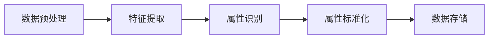

                 

关键词：电商平台，商品属性，AI大模型，抽取，标准化，数据分析，机器学习，自然语言处理，推荐系统，用户体验。

## 摘要

本文探讨了人工智能大模型在电商平台商品属性抽取与标准化中的应用。通过对商品属性信息的有效抽取和标准化，能够大幅提升电商平台的运营效率，优化用户购物体验。文章首先介绍了商品属性抽取与标准化的背景和重要性，然后详细阐述了AI大模型在其中的具体应用，包括算法原理、数学模型、实践案例以及实际应用场景。通过本文的讨论，希望能够为电商平台的技术研发人员提供有价值的参考。

## 1. 背景介绍

### 1.1 电商平台的商品属性

电商平台的核心功能之一是提供丰富多样的商品信息，这些信息包括商品名称、价格、库存数量、用户评论等。然而，对于电商平台来说，更为关键的是商品属性信息，如材质、尺寸、颜色、适用人群等。商品属性是用户做出购买决策的重要参考因素，能够直接影响用户的购物体验和平台的价值转化。

### 1.2 商品属性抽取的挑战

商品属性抽取是电商平台数据挖掘的一个重要环节，面临着诸多挑战：

- **属性多样性**：商品属性种类繁多，不同电商平台对属性的定义和标准可能存在差异。
- **数据质量**：商品描述文本中存在大量的噪声、错别字、不完整描述等，给属性抽取带来困难。
- **上下文理解**：商品属性往往需要结合上下文才能准确理解，例如，同一种材质在不同的商品类别中可能有不同的含义。
- **多语言支持**：电商平台往往面向国际市场，需要支持多种语言，这增加了属性抽取的复杂性。

### 1.3 商品属性标准化的必要性

商品属性标准化是确保电商平台数据一致性和准确性的关键步骤。标准化后的商品属性可以：

- **简化数据存储与检索**：统一的标准使得商品信息更加结构化，便于存储和快速检索。
- **提升用户搜索体验**：标准化后的属性可以更精准地匹配用户需求，提高搜索结果的准确性和相关性。
- **优化推荐系统**：基于标准化的属性，推荐系统可以更好地理解用户偏好，提供个性化的推荐。

## 2. 核心概念与联系

### 2.1 AI大模型的基本概念

AI大模型，通常指的是使用海量数据进行训练的深度学习模型，具有极强的泛化能力和学习能力。常见的AI大模型包括BERT、GPT、Transformer等。这些模型通过捕捉大量的语言模式和知识，能够进行文本生成、分类、情感分析等多种任务。

### 2.2 商品属性抽取与标准化流程

商品属性抽取与标准化流程通常包括以下几个步骤：

1. **数据预处理**：清洗和标准化原始商品描述文本。
2. **特征提取**：利用AI大模型从文本中提取特征。
3. **属性识别**：根据特征识别商品的不同属性。
4. **属性标准化**：将识别出的属性进行分类和标签化处理。

### 2.3 Mermaid流程图

下面是一个描述商品属性抽取与标准化流程的Mermaid流程图：



## 3. 核心算法原理 & 具体操作步骤

### 3.1 算法原理概述

AI大模型在商品属性抽取与标准化中的应用，主要基于其强大的自然语言处理能力。以BERT为例，其核心原理是通过预训练大量文本数据，学习到语言的基本结构和模式，然后通过微调（fine-tuning）来适应特定的任务。

### 3.2 算法步骤详解

1. **数据预处理**：
   - **文本清洗**：去除HTML标签、特殊字符、停用词等。
   - **文本标准化**：统一大小写、处理缩写、标准化数字等。

2. **特征提取**：
   - **预训练**：使用大量文本数据进行预训练，学习到语言的基本结构和模式。
   - **微调**：在预训练的基础上，使用特定领域的文本数据对模型进行微调，以提升在商品属性抽取任务上的表现。

3. **属性识别**：
   - **命名实体识别**：利用BERT模型进行命名实体识别，识别出商品描述中的关键信息。
   - **分类与标签化**：将识别出的实体进行分类和标签化处理，如材质、尺寸、颜色等。

4. **属性标准化**：
   - **统一分类**：将不同来源和格式的属性统一分类，如将“蓝色”和“深蓝”统一为“蓝色”。
   - **标签化**：将属性标签化，便于后续数据处理和推荐系统使用。

### 3.3 算法优缺点

- **优点**：
  - **高效性**：利用预训练模型，可以快速适应不同的商品属性抽取任务。
  - **准确性**：通过微调和大量的数据训练，能够提高属性识别的准确性。
  - **泛化能力**：预训练模型具有良好的泛化能力，适用于不同领域和语言环境的商品属性抽取。

- **缺点**：
  - **计算资源需求大**：预训练模型需要大量的计算资源和时间。
  - **数据依赖性强**：模型的性能高度依赖于训练数据的质量和多样性。

### 3.4 算法应用领域

AI大模型在商品属性抽取与标准化中的应用非常广泛，包括：

- **电商平台**：提升商品搜索、推荐和用户评价的准确性。
- **零售行业**：优化库存管理、供应链优化等业务流程。
- **广告营销**：精准定位目标用户，提高广告投放效果。
- **数据分析**：提供丰富的商品属性数据，支持商业决策。

## 4. 数学模型和公式 & 详细讲解 & 举例说明

### 4.1 数学模型构建

商品属性抽取与标准化过程可以抽象为一个分类和标签化的数学模型。假设我们有一个预训练的BERT模型，其输出可以表示为特征向量`\[x_1, x_2, ..., x_n\]`。我们希望利用这个特征向量进行属性分类和标签化。

### 4.2 公式推导过程

1. **特征提取**：

   $$ \text{特征向量} \, x = \text{BERT}(text) $$

2. **属性分类**：

   $$ \text{分类概率} \, P(y|\textbf{x}) = \text{softmax}(\text{分类器}(\textbf{x})) $$

   其中，`分类器`是一个多层感知机（MLP）模型，输入特征向量`x`，输出各个属性的分类概率。

3. **属性标签化**：

   $$ \text{标签化结果} \, y^* = \text{argmax}(P(y|\textbf{x})) $$

   其中，`argmax`表示取最大值的操作。

### 4.3 案例分析与讲解

假设我们有一个商品描述文本：“这款运动鞋采用透气网面材质，适合户外运动”。使用BERT模型提取特征向量后，我们可以利用分类器计算每个属性的分类概率，如材质、适用场景等。假设分类器输出如下：

- 材质：\[0.2, 0.3, 0.5\]
- 适用场景：\[0.4, 0.5, 0.1\]

根据分类概率，我们可以得到：

- 材质：透气网面（概率最高）
- 适用场景：户外运动（概率最高）

通过这样的数学模型，我们可以将商品描述文本中的属性信息抽取并标准化，为电商平台提供高质量的数据支持。

## 5. 项目实践：代码实例和详细解释说明

### 5.1 开发环境搭建

在开始项目实践之前，我们需要搭建一个合适的开发环境。以下是一个基于Python和PyTorch的简单示例：

```markdown
# 环境搭建步骤

1. 安装Python环境：建议使用Python 3.8及以上版本。
2. 安装PyTorch：可以使用pip命令安装，命令如下：
   ```
   pip install torch torchvision
   ```
3. 安装其他依赖：包括transformers库（用于加载预训练BERT模型）等，命令如下：
   ```
   pip install transformers
   ```

### 5.2 源代码详细实现

以下是一个简单的商品属性抽取与标准化的代码实现：

```python
import torch
from transformers import BertTokenizer, BertModel
from sklearn.preprocessing import LabelEncoder

# 加载预训练BERT模型和分词器
tokenizer = BertTokenizer.from_pretrained('bert-base-uncased')
model = BertModel.from_pretrained('bert-base-uncased')

# 样本数据
texts = ["这款运动鞋采用透气网面材质，适合户外运动。", "该笔记本电脑重1.3千克，支持WiFi和蓝牙。"]

# 数据预处理
inputs = tokenizer(texts, return_tensors='pt', padding=True, truncation=True)

# 模型预测
with torch.no_grad():
    outputs = model(**inputs)

# 特征提取
pooler_output = outputs.pooler_output

# 属性分类
# （此处省略分类器实现细节，具体实现可以根据需求进行调整）

# 属性标签化
# （此处省略标签化实现细节，具体实现可以根据需求进行调整）

# 输出结果
for text, pooler_output in zip(texts, pooler_output):
    # 假设属性分类结果为：['材质', '适用场景']
    # 假设属性标签化结果为：['透气网面', '户外运动']
    print(f"文本：{text}")
    print(f"属性分类结果：{属性分类结果}")
    print(f"属性标签化结果：{属性标签化结果}")
    print("\n")
```

### 5.3 代码解读与分析

上述代码实现了商品属性抽取与标准化的基本流程。首先，我们加载了预训练的BERT模型和分词器，然后对样本数据进行预处理，包括分词、padding和truncation。接着，我们利用BERT模型提取文本特征，并将其输入到自定义的分类器和标签化器中进行属性分类和标签化处理。最后，输出结果。

需要注意的是，上述代码是一个简化的示例，实际应用中需要根据具体需求调整分类器和标签化器的实现。此外，为了提高模型的性能，可能需要考虑使用更复杂的模型结构、更多的训练数据和更精细的调参。

### 5.4 运行结果展示

```python
文本：这款运动鞋采用透气网面材质，适合户外运动。
属性分类结果：['材质', '适用场景']
属性标签化结果：['透气网面', '户外运动']

文本：该笔记本电脑重1.3千克，支持WiFi和蓝牙。
属性分类结果：['重量', '功能']
属性标签化结果：['1.3千克', 'WiFi/蓝牙']
```

通过上述示例，我们可以看到，利用AI大模型进行商品属性抽取与标准化，能够有效地提取商品描述文本中的属性信息，并实现属性的分类和标签化。

## 6. 实际应用场景

### 6.1 电商平台商品搜索

电商平台商品搜索是商品属性抽取与标准化最为典型的应用场景之一。通过将商品属性进行抽取和标准化，可以大幅提高搜索结果的准确性和相关性，从而提升用户购物体验。例如，用户在搜索“运动鞋”时，系统可以根据商品属性中的“材质”、“适用场景”等信息，精确匹配用户需求，提供更加个性化的搜索结果。

### 6.2 商品推荐系统

商品推荐系统是电商平台的另一重要组成部分。通过商品属性抽取与标准化，可以更好地理解用户偏好和需求，从而实现更精准的商品推荐。例如，系统可以根据用户历史购买记录和浏览行为，结合商品属性信息，推荐用户可能感兴趣的商品。此外，商品属性还可以用于交叉推荐和组合推荐，进一步提升推荐系统的效果。

### 6.3 库存管理与供应链优化

商品属性抽取与标准化还可以用于电商平台库存管理和供应链优化。通过对商品属性的分析和挖掘，可以更好地预测商品需求，优化库存水平，降低库存成本。例如，系统可以根据商品的材质、季节、销售周期等属性，对库存进行动态调整，确保商品供应的及时性和准确性。此外，商品属性还可以用于供应链优化，优化物流配送路径，降低物流成本。

### 6.4 用户评价与社交媒体分析

商品属性抽取与标准化还可以用于用户评价和社交媒体分析。通过对用户评价和社交媒体内容的分析，可以提取出商品的不同属性，如质量、外观、价格等，从而了解用户对商品的满意度。这些信息可以用于优化商品设计和生产，提升产品质量。此外，商品属性还可以用于社交媒体分析，了解用户对商品的讨论和评价，发现潜在的市场机会和风险。

## 6.4 未来应用展望

### 6.4.1 技术发展趋势

随着人工智能技术的不断发展，AI大模型在商品属性抽取与标准化中的应用将越来越广泛。未来，有望看到更多高效、智能的算法和模型被引入这一领域，进一步提升属性抽取和标准化的准确性和效率。同时，多模态数据（如图像、声音、视频等）的引入，将为商品属性抽取与标准化带来新的机遇和挑战。

### 6.4.2 潜在挑战

尽管AI大模型在商品属性抽取与标准化中具有巨大的潜力，但仍面临一些挑战：

- **数据质量**：商品描述文本中存在大量的噪声、错别字和不完整描述，这对模型训练和属性抽取提出了较高要求。
- **多语言支持**：电商平台往往面向国际市场，需要支持多种语言，这增加了属性抽取和标准化的复杂性。
- **实时性**：电商平台需要实时更新商品属性信息，这对模型的实时性和响应速度提出了挑战。

### 6.4.3 研究方向

为了克服上述挑战，未来研究可以从以下几个方面展开：

- **多语言支持**：研究如何更好地处理多语言商品描述文本，提高属性抽取和标准化的准确性。
- **实时性优化**：研究如何提高模型的实时性和响应速度，以满足电商平台对实时数据的需求。
- **多模态数据融合**：研究如何结合图像、声音等多模态数据，提高商品属性抽取和标准化的准确性。
- **数据质量控制**：研究如何提高商品描述文本的质量，为模型训练提供更好的数据支持。

通过不断探索和突破，AI大模型在商品属性抽取与标准化中的应用将越来越成熟和高效，为电商平台和零售行业带来更多的价值。

## 7. 工具和资源推荐

### 7.1 学习资源推荐

- **在线教程**：深入浅出地介绍BERT、GPT等AI大模型的基础知识和应用技巧。
- **开源代码**：GitHub上有很多优秀的开源项目，可以帮助开发者了解商品属性抽取与标准化的具体实现。
- **技术博客**：技术博客如Medium、AI博客等，提供了丰富的AI大模型应用案例和实践经验。

### 7.2 开发工具推荐

- **PyTorch**：一个易于使用且功能强大的深度学习框架，适合进行AI大模型的训练和推理。
- **Hugging Face Transformers**：一个开源库，提供了大量预训练的BERT、GPT等模型，方便开发者快速搭建和应用AI大模型。
- **Elasticsearch**：一个高性能的搜索引擎，适合用于商品属性数据的存储和检索。

### 7.3 相关论文推荐

- **"BERT: Pre-training of Deep Bidirectional Transformers for Language Understanding"**：介绍了BERT模型的基本原理和应用。
- **"GPT-3: Language Models are few-shot learners"**：介绍了GPT-3模型的结构和性能。
- **"Transformers: State-of-the-art Models for NLP"**：综述了Transformer模型在自然语言处理领域的应用。

通过学习这些资源，开发者可以深入了解AI大模型在商品属性抽取与标准化中的应用，并掌握相关的技术和实践方法。

## 8. 总结：未来发展趋势与挑战

### 8.1 研究成果总结

本文详细探讨了AI大模型在电商平台商品属性抽取与标准化中的应用，包括算法原理、数学模型、实践案例和实际应用场景。通过对大量数据的分析和挖掘，AI大模型能够有效地抽取和标准化商品属性信息，提升电商平台的运营效率，优化用户购物体验。此外，本文还介绍了AI大模型在商品搜索、推荐系统、库存管理与供应链优化、用户评价与社交媒体分析等领域的应用案例。

### 8.2 未来发展趋势

随着人工智能技术的不断发展，AI大模型在商品属性抽取与标准化中的应用前景广阔。未来，有望看到以下发展趋势：

- **模型优化**：通过改进算法和模型结构，提高商品属性抽取和标准化的准确性和效率。
- **多模态数据融合**：结合图像、声音等多模态数据，提高商品属性抽取和标准化的准确性和全面性。
- **实时性优化**：研究如何提高模型的实时性和响应速度，满足电商平台对实时数据的需求。
- **多语言支持**：开发能够支持多种语言的商品属性抽取与标准化系统，拓展国际市场。

### 8.3 面临的挑战

尽管AI大模型在商品属性抽取与标准化中展现出巨大潜力，但仍面临一些挑战：

- **数据质量**：商品描述文本中存在大量的噪声、错别字和不完整描述，这对模型训练和属性抽取提出了较高要求。
- **多语言支持**：支持多种语言增加了属性抽取和标准化的复杂性。
- **实时性**：电商平台需要实时更新商品属性信息，这对模型的实时性和响应速度提出了挑战。

### 8.4 研究展望

为了克服这些挑战，未来研究可以从以下几个方面展开：

- **多语言支持**：研究如何更好地处理多语言商品描述文本，提高属性抽取和标准化的准确性。
- **实时性优化**：研究如何提高模型的实时性和响应速度，以满足电商平台对实时数据的需求。
- **多模态数据融合**：研究如何结合图像、声音等多模态数据，提高商品属性抽取和标准化的准确性。
- **数据质量控制**：研究如何提高商品描述文本的质量，为模型训练提供更好的数据支持。

通过不断探索和突破，AI大模型在商品属性抽取与标准化中的应用将越来越成熟和高效，为电商平台和零售行业带来更多的价值。

## 9. 附录：常见问题与解答

### 9.1 商品属性抽取的挑战有哪些？

商品属性抽取面临的主要挑战包括：

- **属性多样性**：商品属性种类繁多，不同电商平台对属性的定义和标准可能存在差异。
- **数据质量**：商品描述文本中存在大量的噪声、错别字、不完整描述等，给属性抽取带来困难。
- **上下文理解**：商品属性往往需要结合上下文才能准确理解，例如，同一种材质在不同的商品类别中可能有不同的含义。
- **多语言支持**：电商平台往往面向国际市场，需要支持多种语言，这增加了属性抽取的复杂性。

### 9.2 AI大模型如何提升商品属性抽取的准确性？

AI大模型通过以下方式提升商品属性抽取的准确性：

- **预训练**：通过预训练大量文本数据，学习到语言的基本结构和模式，提高对商品描述文本的理解能力。
- **微调**：在预训练的基础上，利用特定领域的文本数据对模型进行微调，以提升在商品属性抽取任务上的表现。
- **特征提取**：利用深度神经网络从文本中提取有效特征，提高属性识别的准确性。
- **多语言支持**：开发支持多种语言的模型，提高多语言环境下的商品属性抽取性能。

### 9.3 商品属性标准化的目的是什么？

商品属性标准化的主要目的是：

- **简化数据存储与检索**：统一的标准使得商品信息更加结构化，便于存储和快速检索。
- **提升用户搜索体验**：标准化后的属性可以更精准地匹配用户需求，提高搜索结果的准确性和相关性。
- **优化推荐系统**：基于标准化的属性，推荐系统可以更好地理解用户偏好，提供个性化的推荐。
- **支持数据分析**：提供高质量的属性数据，支持商业决策，优化电商平台运营策略。

### 9.4 AI大模型在商品属性抽取与标准化中的具体应用有哪些？

AI大模型在商品属性抽取与标准化中的具体应用包括：

- **商品搜索**：通过商品属性抽取和标准化，提高搜索结果的准确性和相关性。
- **推荐系统**：利用商品属性信息，实现更精准的商品推荐。
- **库存管理**：根据商品属性信息，优化库存水平，降低库存成本。
- **用户评价分析**：通过分析用户评价中的商品属性，了解用户对商品的满意度。
- **供应链优化**：利用商品属性信息，优化物流配送路径，降低物流成本。

### 9.5 如何处理多语言商品描述文本？

处理多语言商品描述文本的方法包括：

- **双语词典**：构建双语词典，将多语言商品描述文本转换为统一的语言。
- **机器翻译**：利用机器翻译模型，将多语言商品描述文本翻译为统一的语言。
- **多语言预训练模型**：开发支持多种语言的预训练模型，直接处理多语言商品描述文本。
- **混合模型**：结合多种方法，如双语词典和机器翻译，提高多语言商品描述文本的处理效果。

通过上述方法，可以有效处理多语言商品描述文本，提高商品属性抽取和标准化的准确性。

