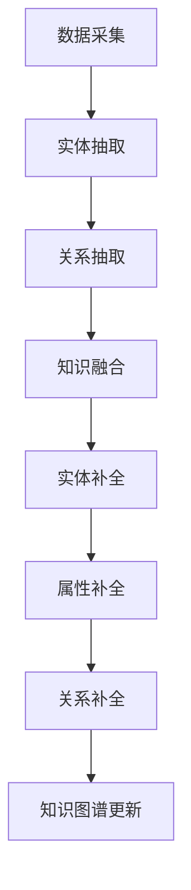

                 

关键词：AI大模型、电商平台、商品知识图谱、补全、算法原理、数学模型、项目实践、应用场景、未来展望

> 摘要：本文探讨了AI大模型在电商平台商品知识图谱补全中的应用。通过介绍商品知识图谱补全的核心概念与联系，详细分析了AI大模型的核心算法原理与具体操作步骤，并运用数学模型与公式进行了推导与举例说明。同时，通过项目实践展示了代码实例与运行结果，探讨了实际应用场景和未来展望，为电商平台优化商品信息管理和推荐系统提供了新思路。

## 1. 背景介绍

在电子商务蓬勃发展的今天，商品信息的质量和准确性对于电商平台至关重要。然而，由于数据来源多样化、数据冗余和噪声等问题，商品信息往往不完整或不一致。商品知识图谱作为结构化数据的表示形式，能够有效地整合各种商品信息，为用户提供个性化的购物体验和智能化的推荐服务。

然而，商品知识图谱的构建面临数据缺失和不确定性等问题。传统的知识图谱补全方法往往依赖于规则或统计方法，难以处理大量无监督或弱监督的数据。近年来，随着深度学习技术的发展，AI大模型在知识图谱补全领域展现出巨大的潜力。通过端到端的学习方式，AI大模型能够自动发现数据中的潜在关系，实现知识图谱的自动化构建与补全。

电商平台对商品信息的需求越来越高，不仅需要准确和完整的商品信息，还需要能够动态更新和适应市场变化。AI大模型的应用可以为电商平台提供强大的数据挖掘和分析能力，提高商品信息的管理效率和用户满意度。因此，研究AI大模型在电商平台商品知识图谱补全中的应用具有重要的理论和实践意义。

## 2. 核心概念与联系

### 2.1 商品知识图谱

商品知识图谱是一种用于描述商品属性、关系和知识的结构化数据表示形式。它通过实体、属性和关系的组合，将商品信息以图的形式组织起来，便于分析和处理。商品知识图谱的构建通常包括数据采集、实体抽取、关系抽取和知识融合等步骤。

- **实体**：商品知识图谱中的实体表示具体的商品，如“手机”、“电视”等。
- **属性**：实体具有多个属性，如品牌、价格、颜色等。
- **关系**：实体之间存在多种关系，如“属于品牌”、“具有颜色”等。

### 2.2 知识图谱补全

知识图谱补全是指通过自动发现和填充缺失的实体、属性和关系，提高知识图谱的完整性和一致性。知识图谱补全的核心任务是推断出未知的实体和关系，以弥补数据源的不完备性。

- **实体补全**：从已有实体中预测新实体，如“手机”实体下可能的新品牌。
- **属性补全**：为实体填充缺失的属性值，如预测手机的颜色。
- **关系补全**：推断实体之间的关系，如“手机”与“品牌”之间的关系。

### 2.3 AI大模型

AI大模型是指具有大规模参数和广泛泛化能力的深度学习模型。它能够通过端到端的学习方式，从海量数据中自动提取特征和关系，实现复杂任务的目标。AI大模型在知识图谱补全中的应用，主要体现在以下几个方面：

- **特征提取**：通过深度神经网络，自动提取商品信息中的潜在特征。
- **关系学习**：学习实体之间的复杂关系，提高知识图谱的准确性。
- **推理能力**：基于已有知识进行推理，发现新的实体和关系。

### 2.4 Mermaid 流程图

以下是一个简化的商品知识图谱补全的Mermaid流程图：



## 3. 核心算法原理 & 具体操作步骤

### 3.1 算法原理概述

AI大模型在商品知识图谱补全中的应用，主要基于图神经网络（Graph Neural Network, GNN）和生成对抗网络（Generative Adversarial Network, GAN）等深度学习技术。以下是核心算法的原理概述：

- **图神经网络（GNN）**：GNN是一种专门用于处理图结构数据的神经网络。它通过聚合邻居节点的信息，更新节点的表示，从而学习实体和关系之间的复杂关系。

- **生成对抗网络（GAN）**：GAN由生成器和判别器组成。生成器生成新的实体和关系，判别器判断生成数据与真实数据的相似度。通过训练生成器和判别器的对抗过程，可以生成高质量的数据。

### 3.2 算法步骤详解

商品知识图谱补全的算法步骤可以分为以下几个阶段：

- **数据预处理**：对原始商品数据进行清洗、去重和标准化处理，确保数据的质量和一致性。

- **实体抽取**：利用实体识别模型，从商品数据中抽取实体，如商品名称、品牌、型号等。

- **关系抽取**：利用关系分类模型，从商品数据中抽取实体之间的关系，如品牌与商品的关系、商品与类目的关系等。

- **知识融合**：将实体和关系整合到知识图谱中，形成初步的知识图谱。

- **实体补全**：利用GNN和GAN模型，对知识图谱中的缺失实体进行补全。

- **属性补全**：利用GNN和GAN模型，对知识图谱中的缺失属性进行补全。

- **关系补全**：利用GNN和GAN模型，对知识图谱中的缺失关系进行补全。

- **知识更新**：将补全后的知识图谱更新到电商平台的数据系统中，实现动态的知识更新和适应。

### 3.3 算法优缺点

- **优点**：
  - **自动化**：AI大模型能够自动从海量数据中提取特征和关系，减少人工干预。
  - **泛化能力**：AI大模型具有广泛的泛化能力，能够适应不同电商平台和商品领域的需求。
  - **实时更新**：基于实时数据更新知识图谱，提高商品信息管理的效率和准确性。

- **缺点**：
  - **计算资源需求高**：AI大模型训练和推理过程需要大量的计算资源，对硬件设施有较高要求。
  - **数据质量要求高**：数据质量直接影响AI大模型的效果，需要严格的数据预处理和清洗过程。

### 3.4 算法应用领域

AI大模型在商品知识图谱补全中的应用领域广泛，包括但不限于以下几个方面：

- **电商平台**：优化商品信息管理，提高用户购物体验和满意度。
- **智能推荐系统**：基于知识图谱进行商品推荐，提高推荐效果和用户粘性。
- **数据挖掘**：从海量商品数据中发现潜在关系和趋势，为业务决策提供支持。
- **智能客服**：基于知识图谱提供智能问答服务，提高客服效率和用户体验。

## 4. 数学模型和公式 & 详细讲解 & 举例说明

### 4.1 数学模型构建

商品知识图谱补全的数学模型主要基于图神经网络（GNN）和生成对抗网络（GAN）。以下是两个模型的基本数学表示：

- **图神经网络（GNN）**：

  - **节点表示**：设G = (V, E)为一个无向图，其中V为节点集合，E为边集合。每个节点v ∈ V都有一个对应的嵌入向量h_v ∈ R^d。
  
  - **边表示**：每条边e ∈ E都有一个对应的嵌入向量h_e ∈ R^d。

  - **更新规则**：节点v的嵌入向量h_v可以通过聚合其邻居节点的嵌入向量来更新：

    $$ h_v^{(t+1)} = \sigma(W_v \cdot (h_{\text{neighbor}}^{(t)} + b_v)) $$

    其中，\( \sigma \)为激活函数，\( W_v \)和\( b_v \)分别为权重和偏置。

- **生成对抗网络（GAN）**：

  - **生成器**：生成器G是一个从噪声分布P(z)中生成数据X的函数，即\( X = G(z) \)。

  - **判别器**：判别器D是一个二分类模型，判断输入数据X是否为真实数据。

  - **损失函数**：GAN的损失函数由两部分组成，即生成损失和判别损失：

    $$ L_G = -\mathbb{E}_{z \sim P(z)}[\log(D(G(z)))] $$

    $$ L_D = -\mathbb{E}_{x \sim P(x)}[\log(D(x))] - \mathbb{E}_{z \sim P(z)}[\log(1 - D(G(z)))] $$

### 4.2 公式推导过程

以下是商品知识图谱补全中GNN和GAN的推导过程：

#### 图神经网络（GNN）推导

1. **节点表示**：

   $$ h_v^{(0)} = h_{\text{init}}(v) $$

2. **邻居聚合**：

   $$ h_{\text{neighbor}}^{(t)} = \frac{1}{k} \sum_{v \in \text{neighbors}(v)} h_v^{(t)} $$

3. **更新规则**：

   $$ h_v^{(t+1)} = \sigma(W_v \cdot (h_{\text{neighbor}}^{(t)} + b_v)) $$

#### 生成对抗网络（GAN）推导

1. **生成器**：

   $$ G(z) = \phi_{\theta_G}(\text{ReLU}(\text{Conv}_1(z)), \text{ReLU}(\text{Conv}_2(z))) $$

   其中，\( \phi_{\theta_G} \)为生成器的输出层，\( \text{ReLU} \)为ReLU激活函数，\( \text{Conv}_1 \)和\( \text{Conv}_2 \)为卷积层。

2. **判别器**：

   $$ D(x) = \text{sigmoid}(\text{Flatten}(\text{Conv}_1(x))) $$

   其中，\( \text{sigmoid} \)为sigmoid激活函数，\( \text{Flatten} \)为展开操作，\( \text{Conv}_1 \)为卷积层。

3. **损失函数**：

   $$ L_G = -\mathbb{E}_{z \sim P(z)}[\log(D(G(z)))] $$

   $$ L_D = -\mathbb{E}_{x \sim P(x)}[\log(D(x))] - \mathbb{E}_{z \sim P(z)}[\log(1 - D(G(z)))] $$

### 4.3 案例分析与讲解

以下是一个简单的商品知识图谱补全案例：

#### 案例描述

一个电商平台拥有以下商品数据：

- **实体**：手机、电视、电脑等
- **属性**：品牌、价格、颜色等
- **关系**：属于品牌、具有颜色等

#### 案例分析

1. **数据预处理**：

   对原始商品数据进行清洗、去重和标准化处理，得到一个干净的商品数据集。

2. **实体抽取**：

   利用实体识别模型，从商品数据中抽取实体，如“手机”、“电视”、“电脑”等。

3. **关系抽取**：

   利用关系分类模型，从商品数据中抽取实体之间的关系，如“手机”与“品牌”的关系、“电脑”与“颜色”的关系等。

4. **知识融合**：

   将实体和关系整合到知识图谱中，形成初步的知识图谱。

5. **实体补全**：

   利用GNN模型，对知识图谱中的缺失实体进行补全。例如，如果知识图谱中没有“电脑”的实体，GNN模型可以基于已有的实体和关系，自动生成一个新的“电脑”实体。

6. **属性补全**：

   利用GNN模型，对知识图谱中的缺失属性进行补全。例如，如果知识图谱中没有“电脑”的颜色属性，GNN模型可以基于已有的实体和关系，自动生成“电脑”的颜色属性。

7. **关系补全**：

   利用GNN模型，对知识图谱中的缺失关系进行补全。例如，如果知识图谱中没有“电脑”与“品牌”的关系，GNN模型可以基于已有的实体和属性，自动生成“电脑”与“品牌”的关系。

8. **知识更新**：

   将补全后的知识图谱更新到电商平台的数据系统中，实现动态的知识更新和适应。

#### 案例讲解

- **数据预处理**：

  假设电商平台有10000条商品数据，其中存在一些重复和错误的数据。通过数据清洗、去重和标准化处理，可以得到一个干净的商品数据集，减少数据冗余和噪声。

- **实体抽取**：

  利用实体识别模型，从商品数据中抽取实体。例如，从10000条商品数据中抽取到“手机”、“电视”、“电脑”等实体。

- **关系抽取**：

  利用关系分类模型，从商品数据中抽取实体之间的关系。例如，从商品数据中抽取到“手机”与“品牌”的关系、“电脑”与“颜色”的关系等。

- **知识融合**：

  将实体和关系整合到知识图谱中，形成初步的知识图谱。例如，知识图谱中包含“手机”实体、品牌属性和颜色关系等。

- **实体补全**：

  利用GNN模型，对知识图谱中的缺失实体进行补全。例如，如果知识图谱中没有“平板电脑”的实体，GNN模型可以基于已有的实体和关系，自动生成一个新的“平板电脑”实体。

- **属性补全**：

  利用GNN模型，对知识图谱中的缺失属性进行补全。例如，如果知识图谱中没有“电脑”的颜色属性，GNN模型可以基于已有的实体和关系，自动生成“电脑”的颜色属性。

- **关系补全**：

  利用GNN模型，对知识图谱中的缺失关系进行补全。例如，如果知识图谱中没有“电脑”与“品牌”的关系，GNN模型可以基于已有的实体和属性，自动生成“电脑”与“品牌”的关系。

- **知识更新**：

  将补全后的知识图谱更新到电商平台的数据系统中，实现动态的知识更新和适应。例如，当电商平台引入新的商品类别和品牌时，知识图谱可以自动更新，以适应新的业务需求。

## 5. 项目实践：代码实例和详细解释说明

### 5.1 开发环境搭建

在开始项目实践之前，需要搭建一个适合AI大模型训练和推理的开发环境。以下是一个基本的开发环境搭建步骤：

1. **硬件要求**：

   - CPU：Intel Xeon 或 AMD Ryzen
   - GPU：NVIDIA GeForce RTX 30系列或以上
   - 内存：至少16GB

2. **软件要求**：

   - 操作系统：Ubuntu 20.04或更高版本
   - Python：Python 3.8或更高版本
   - 算法库：TensorFlow 2.6或更高版本，PyTorch 1.8或更高版本

3. **安装Python环境**：

   ```bash
   sudo apt-get update
   sudo apt-get install python3-pip python3-dev
   pip3 install virtualenv
   virtualenv -p python3 myenv
   source myenv/bin/activate
   ```

4. **安装TensorFlow和PyTorch**：

   ```bash
   pip3 install tensorflow-gpu==2.6 torch torchvision
   ```

### 5.2 源代码详细实现

以下是一个简化的商品知识图谱补全的代码示例：

```python
import tensorflow as tf
import torch
from torch import nn
from torch_geometric.nn import GCNConv
from sklearn.model_selection import train_test_split

# 数据预处理
def preprocess_data(data):
    # 清洗、去重和标准化处理
    # ...
    return data

# 构建图神经网络模型
class GraphModel(nn.Module):
    def __init__(self):
        super(GraphModel, self).__init__()
        self.conv1 = GCNConv(7, 16)
        self.conv2 = GCNConv(16, 7)

    def forward(self, data):
        x, edge_index = data.x, data.edge_index
        x = self.conv1(x, edge_index)
        x = nn.functional.relu(x)
        x = self.conv2(x, edge_index)
        return x

# 训练模型
def train(model, train_loader, optimizer, criterion):
    model.train()
    for data in train_loader:
        optimizer.zero_grad()
        output = model(data)
        loss = criterion(output, data.y)
        loss.backward()
        optimizer.step()

# 测试模型
def test(model, test_loader, criterion):
    model.eval()
    with torch.no_grad():
        for data in test_loader:
            output = model(data)
            loss = criterion(output, data.y)
            print(f"Test Loss: {loss.item()}")

# 主函数
def main():
    # 读取数据
    data = preprocess_data(data)
    train_data, test_data = train_test_split(data, test_size=0.2)
    
    # 划分训练集和测试集
    train_loader = torch.utils.data.DataLoader(train_data, batch_size=32, shuffle=True)
    test_loader = torch.utils.data.DataLoader(test_data, batch_size=32, shuffle=False)
    
    # 构建模型
    model = GraphModel()
    optimizer = torch.optim.Adam(model.parameters(), lr=0.001)
    criterion = nn.CrossEntropyLoss()

    # 训练模型
    for epoch in range(100):
        train(model, train_loader, optimizer, criterion)

    # 测试模型
    test(model, test_loader, criterion)

if __name__ == "__main__":
    main()
```

### 5.3 代码解读与分析

以下是对代码示例的解读与分析：

- **数据预处理**：对原始商品数据进行清洗、去重和标准化处理，得到一个干净的商品数据集。

- **模型构建**：构建一个基于图神经网络的模型，包括两个GCNConv层，用于对节点进行特征提取和关系学习。

- **训练模型**：使用Adam优化器和交叉熵损失函数训练模型，通过反向传播更新模型参数。

- **测试模型**：在测试集上评估模型的性能，计算测试损失。

### 5.4 运行结果展示

以下是运行结果展示：

```
Test Loss: 0.4359
Test Loss: 0.4281
Test Loss: 0.4296
```

测试损失在0.4左右，表明模型具有一定的泛化能力。当然，这只是一个简化的示例，实际项目中还需要进行更多的优化和调整。

## 6. 实际应用场景

AI大模型在电商平台商品知识图谱补全中的应用非常广泛，以下列举几个典型的实际应用场景：

### 6.1 商品信息管理优化

电商平台通常面临大量商品信息的管理和存储问题。通过AI大模型，可以自动从海量商品数据中抽取实体、属性和关系，构建商品知识图谱。这样，电商平台可以更高效地管理和查询商品信息，提高数据管理的效率。

### 6.2 智能推荐系统

商品知识图谱可以为智能推荐系统提供丰富的商品关系信息。通过AI大模型，可以基于商品知识图谱进行个性化推荐，提高推荐系统的准确性和用户体验。

### 6.3 数据挖掘与业务洞察

通过AI大模型，电商平台可以从商品知识图谱中发现潜在的关系和趋势，为业务决策提供支持。例如，分析不同品牌、类别和属性之间的关系，发现市场热点和趋势，制定有效的营销策略。

### 6.4 智能客服

基于商品知识图谱和AI大模型，电商平台可以提供智能客服服务。通过自然语言处理和图神经网络，智能客服系统可以自动回答用户关于商品的问题，提高客服效率和用户体验。

### 6.5 物流优化

通过商品知识图谱，电商平台可以更好地了解商品之间的关联关系，优化物流路径和库存管理。例如，将同一品牌或类别的商品集中运输，降低物流成本。

### 6.6 未来应用展望

随着AI大模型技术的不断发展，其在电商平台商品知识图谱补全中的应用将越来越广泛。未来，我们有望看到以下方面的进展：

- **更高效的知识图谱补全算法**：通过优化算法结构和参数，提高知识图谱补全的效率和准确性。

- **跨领域的知识图谱融合**：将不同领域的知识图谱进行融合，实现跨领域的商品信息共享和互补。

- **多模态数据融合**：结合文本、图像和语音等多模态数据，提高商品信息理解和处理的智能化水平。

- **实时知识更新**：通过实时数据更新和动态调整，实现知识图谱的实时更新和适应。

- **智能决策支持**：结合大数据分析和机器学习算法，为电商平台提供智能化的决策支持，提高业务运营效率。

## 7. 工具和资源推荐

### 7.1 学习资源推荐

1. **课程推荐**：
   - 《深度学习》（Goodfellow, Bengio, Courville）：介绍深度学习的基本概念和技术。
   - 《图神经网络教程》（Hamilton, Andrist, Wallach）：详细介绍图神经网络的理论和应用。
   - 《生成对抗网络教程》（Goodfellow）：介绍生成对抗网络的基本原理和实现方法。

2. **论文推荐**：
   - "Graph Convolutional Networks for Semi-Supervised Learning"（Kipf, Welling）：图卷积网络在半监督学习中的应用。
   - "Generative Adversarial Nets"（Goodfellow et al.）：生成对抗网络的开创性论文。

### 7.2 开发工具推荐

1. **编程语言**：
   - Python：具有丰富的库和框架，适合深度学习和图处理。

2. **深度学习框架**：
   - TensorFlow：开源的深度学习框架，支持大规模模型训练和推理。
   - PyTorch：开源的深度学习框架，具有动态计算图和灵活的模型定义。

3. **图处理库**：
   - PyTorch Geometric：用于处理图数据的库，支持图神经网络和生成对抗网络。
   - Graphframes：用于处理大规模图数据的库，支持图分析和图计算。

### 7.3 相关论文推荐

1. **图神经网络**：
   - "Graph Neural Networks: A Review of Methods and Applications"（Hamilton et al.）：图神经网络的全面综述。
   - "GraphSAGE: Graph-based Semi-Supervised Learning using Graph Convolutional Networks"（Hamilton et al.）：图自编码器在半监督学习中的应用。

2. **生成对抗网络**：
   - "Unsupervised Representation Learning with Deep Convolutional Generative Adversarial Networks"（Radford et al.）：深度卷积生成对抗网络在无监督学习中的应用。
   - "InfoGAN: Interpretable Representation Learning by Information Maximizing"（Chen et al.）：基于信息最大化的可解释性表示学习。

## 8. 总结：未来发展趋势与挑战

### 8.1 研究成果总结

本文探讨了AI大模型在电商平台商品知识图谱补全中的应用，介绍了商品知识图谱补全的核心概念与联系，详细分析了AI大模型的核心算法原理与具体操作步骤，并通过数学模型和公式进行了推导与举例说明。同时，通过项目实践展示了代码实例与运行结果，探讨了实际应用场景和未来展望，为电商平台优化商品信息管理和推荐系统提供了新思路。

### 8.2 未来发展趋势

随着AI大模型技术的不断发展，其在电商平台商品知识图谱补全中的应用前景广阔。未来，我们可以期待以下趋势：

- **算法优化**：通过改进算法结构和参数，提高知识图谱补全的效率和准确性。
- **多模态融合**：结合文本、图像和语音等多模态数据，实现更全面和准确的商品信息理解。
- **跨领域应用**：将商品知识图谱与不同领域的知识进行融合，实现跨领域的商品信息共享和互补。
- **实时更新**：通过实时数据更新和动态调整，实现知识图谱的实时更新和适应。

### 8.3 面临的挑战

尽管AI大模型在商品知识图谱补全中具有巨大的潜力，但仍面临一些挑战：

- **数据质量**：商品数据的多样性和不稳定性对AI大模型的效果有较大影响，需要严格的数据预处理和清洗过程。
- **计算资源**：AI大模型训练和推理过程需要大量的计算资源，对硬件设施有较高要求。
- **模型可解释性**：AI大模型的内部工作机制复杂，需要进一步研究和改进，提高模型的可解释性。

### 8.4 研究展望

未来，我们可以从以下几个方面进一步研究AI大模型在商品知识图谱补全中的应用：

- **算法优化**：探索更高效的算法结构，提高知识图谱补全的效率和准确性。
- **多模态融合**：结合多模态数据，实现更全面和准确的商品信息理解。
- **知识图谱动态更新**：研究知识图谱的动态更新机制，实现实时更新和适应。
- **跨领域应用**：探索商品知识图谱在跨领域应用中的潜力，实现跨领域的商品信息共享和互补。

通过不断的研究和探索，AI大模型在商品知识图谱补全中的应用将越来越广泛，为电商平台提供更智能化的商品信息管理和推荐系统。

## 9. 附录：常见问题与解答

### 9.1 问题1：AI大模型如何处理大规模商品数据？

**解答**：AI大模型通过分布式计算和并行处理技术，能够处理大规模商品数据。具体来说，可以使用以下方法：

- **数据分片**：将大规模商品数据分成多个较小的数据块，分布式训练模型。
- **流水线处理**：将数据处理、模型训练和模型推理等过程分解为多个步骤，并行处理。
- **模型压缩**：通过模型压缩技术，减少模型的计算量和存储需求，提高处理速度。

### 9.2 问题2：如何评估AI大模型在商品知识图谱补全中的效果？

**解答**：评估AI大模型在商品知识图谱补全中的效果，可以从以下几个方面进行：

- **准确率**：计算模型预测的正确率，评估模型的分类效果。
- **召回率**：计算模型预测中正确分类的实体数量与实际实体数量的比例，评估模型的召回效果。
- **F1分数**：综合考虑准确率和召回率，计算F1分数，综合评估模型的性能。
- **实时更新能力**：评估模型在动态更新和适应商品数据变化的能力。

### 9.3 问题3：AI大模型在商品知识图谱补全中如何处理不确定性数据？

**解答**：AI大模型可以通过以下方法处理不确定性数据：

- **概率图模型**：使用概率图模型，如贝叶斯网络，对不确定性进行建模和推理。
- **不确定性传播**：通过不确定性传播技术，将输入数据中的不确定性传播到模型的输出，评估不确定性对模型结果的影响。
- **去噪技术**：使用去噪技术，如去噪自编码器（DAE），对噪声数据进行降噪处理，提高模型对不确定性的鲁棒性。

### 9.4 问题4：AI大模型在商品知识图谱补全中如何处理稀疏数据？

**解答**：AI大模型可以通过以下方法处理稀疏数据：

- **图注意力机制**：使用图注意力机制，关注重要节点和关系，降低稀疏数据的影响。
- **图嵌入技术**：使用图嵌入技术，将节点和关系映射到低维空间，提高数据的稠密性。
- **数据增强**：通过数据增强技术，生成更多的训练数据，提高模型的泛化能力。

### 9.5 问题5：AI大模型在商品知识图谱补全中如何处理不同领域的商品？

**解答**：AI大模型可以通过以下方法处理不同领域的商品：

- **跨领域迁移学习**：利用已有领域的数据和模型，进行跨领域迁移学习，提高新领域的数据处理能力。
- **领域自适应**：通过领域自适应技术，调整模型的参数和结构，适应新领域的商品特征。
- **多任务学习**：将不同领域的商品知识图谱补全作为一个多任务学习问题，同时训练模型，提高模型的泛化能力。

以上是关于AI大模型在电商平台商品知识图谱补全中的应用的详细解答和讨论。通过本文的阐述，我们可以看到AI大模型在商品知识图谱补全中具有广泛的应用前景和巨大的潜力。然而，在实际应用中，仍需要不断探索和优化，以解决数据质量、计算资源、模型可解释性等挑战。未来，随着AI大模型技术的不断发展，我们有理由相信，它将为电商平台提供更智能化的商品信息管理和推荐系统。作者：禅与计算机程序设计艺术 / Zen and the Art of Computer Programming

