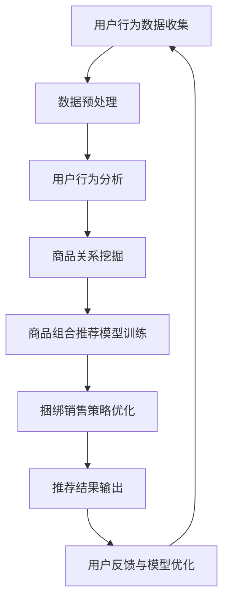

                 

关键词：电商平台、商品组合推荐、捆绑销售、AI大模型、机器学习、深度学习、自然语言处理、用户行为分析、个性化推荐、大数据分析

## 摘要

本文将探讨AI大模型在电商平台商品组合推荐与捆绑销售中的应用，通过介绍核心概念、算法原理、数学模型、实践案例等多个方面，揭示AI大模型如何改变电商平台的运营模式，提高用户满意度和商家收益。文章首先回顾了电商平台的现状和发展趋势，随后详细阐述了商品组合推荐与捆绑销售的重要性，并引入了AI大模型的概念。接着，文章从算法原理、数学模型和实践应用三个方面深入分析了AI大模型在电商平台中的应用机制。最后，文章提出了未来应用展望、挑战以及研究展望。

## 1. 背景介绍

### 1.1 电商平台的发展

电商平台作为互联网经济的重要组成部分，经历了从传统电子商务到现代智能电商的演变。近年来，随着互联网技术的快速发展，电商平台在商品种类、交易规模和用户体验等方面都取得了显著的进步。然而，面对日益激烈的市场竞争，电商平台需要不断创新以吸引和留住用户。

### 1.2 商品组合推荐与捆绑销售

商品组合推荐与捆绑销售是电商平台提高用户满意度和商家收益的重要手段。商品组合推荐通过分析用户行为和历史交易数据，为用户推荐合适的商品组合，从而提升用户的购物体验。而捆绑销售则是将多个商品捆绑在一起以优惠的价格销售，吸引消费者一次性购买更多商品，从而增加销售额。

### 1.3 AI大模型的概念

AI大模型是指基于深度学习和机器学习技术，对海量数据进行训练和预测的大型神经网络模型。这些模型具有较高的复杂度和计算能力，能够在各种复杂场景下实现高精度的预测和推荐。

## 2. 核心概念与联系

### 2.1 用户行为分析

用户行为分析是指通过对用户在电商平台上的浏览、搜索、购买等行为进行数据收集和分析，以了解用户需求和偏好。用户行为分析是商品组合推荐与捆绑销售的基础，对于提高推荐和销售的准确性具有重要意义。

### 2.2 商品关系挖掘

商品关系挖掘是指通过对电商平台上的商品数据进行挖掘和分析，发现商品之间的关联性，如品类相关性、品牌相关性等。商品关系挖掘有助于构建商品组合推荐模型，提高推荐的质量。

### 2.3 捆绑销售策略优化

捆绑销售策略优化是指通过对用户行为数据和商品关系数据的分析，为电商平台设计最优的捆绑销售策略。捆绑销售策略优化可以提升用户满意度，增加销售额。

### 2.4 Mermaid流程图

下面是一个描述AI大模型在电商平台商品组合推荐与捆绑销售中应用的Mermaid流程图：



## 3. 核心算法原理 & 具体操作步骤

### 3.1 算法原理概述

AI大模型在电商平台商品组合推荐与捆绑销售中的应用主要基于深度学习和机器学习技术。通过训练大规模神经网络模型，AI大模型可以实现对用户行为数据、商品关系数据等多源异构数据的挖掘和分析，从而实现高精度的商品组合推荐和捆绑销售策略优化。

### 3.2 算法步骤详解

#### 3.2.1 数据收集与预处理

- 收集用户在电商平台上的浏览、搜索、购买等行为数据。
- 收集商品的基本属性数据，如品类、品牌、价格等。
- 对数据进行清洗、去重和格式化处理。

#### 3.2.2 用户行为分析

- 使用自然语言处理技术对用户行为数据进行语义分析，提取用户兴趣标签。
- 利用聚类算法对用户进行群体划分，分析不同群体的行为特征。

#### 3.2.3 商品关系挖掘

- 使用图神经网络等技术挖掘商品之间的关联性。
- 构建商品关系图，用于后续的商品组合推荐。

#### 3.2.4 商品组合推荐模型训练

- 设计适合商品组合推荐任务的深度学习模型架构。
- 利用海量训练数据对模型进行训练和调优。

#### 3.2.5 捆绑销售策略优化

- 根据用户行为数据和商品关系图，为电商平台设计最优的捆绑销售策略。
- 利用优化算法对捆绑销售策略进行迭代优化。

### 3.3 算法优缺点

#### 优点

- AI大模型具有较高的计算能力和复杂度，能够处理海量数据，提高推荐和销售的准确性。
- 通过深度学习和机器学习技术，可以实现对用户行为和商品关系的深入挖掘，提高推荐的质量。
- 可以实现个性化推荐，提升用户体验。

#### 缺点

- 训练和优化AI大模型需要大量的计算资源和时间。
- 对算法工程师的要求较高，需要具备深度学习和机器学习领域的专业知识。
- 模型易受数据质量的影响，需要定期更新和维护。

### 3.4 算法应用领域

AI大模型在电商平台商品组合推荐与捆绑销售中的应用具有广泛的前景，包括：

- 电商平台：通过商品组合推荐和捆绑销售提高用户满意度和商家收益。
- 新零售：基于用户行为数据和商品关系图，为新零售业态提供智能推荐和销售策略。
- 物流配送：利用用户行为数据和商品关系图优化物流配送路径，降低配送成本。
- 客户关系管理：通过分析用户行为数据和商品关系，为电商平台提供精准的客户关系管理策略。

## 4. 数学模型和公式 & 详细讲解 & 举例说明

### 4.1 数学模型构建

在电商平台商品组合推荐与捆绑销售中，常用的数学模型包括用户行为分析模型、商品关系挖掘模型和捆绑销售策略优化模型。以下是一个简单的用户行为分析模型的构建过程：

#### 用户行为分析模型

假设用户行为数据为 $X$，用户兴趣标签为 $Y$，用户行为分析模型的目标是预测用户兴趣标签。

$$
Y = f(X, W, b)
$$

其中，$f$ 是一个非线性激活函数，如ReLU或Sigmoid；$W$ 是模型权重；$b$ 是模型偏置。

#### 商品关系挖掘模型

假设商品关系数据为 $G$，商品关系挖掘模型的目标是预测商品之间的关联性。

$$
P(G_{ij}) = \sigma(W_G G_{ij} + b_G)
$$

其中，$P(G_{ij})$ 是商品 $i$ 和商品 $j$ 之间的关联性概率；$\sigma$ 是 sigmoid 激活函数；$W_G$ 是商品关系模型权重；$b_G$ 是商品关系模型偏置。

#### 捆绑销售策略优化模型

假设捆绑销售策略为 $S$，捆绑销售策略优化模型的目标是最小化销售额损失。

$$
L(S) = -\sum_{i, j} s_{ij} \cdot p_i \cdot p_j \cdot \log(P(S_{ij} = 1))
$$

其中，$s_{ij}$ 是商品 $i$ 和商品 $j$ 是否捆绑销售的概率；$p_i$ 和 $p_j$ 分别是商品 $i$ 和商品 $j$ 的销售概率；$P(S_{ij} = 1)$ 是商品 $i$ 和商品 $j$ 捆绑销售的概率。

### 4.2 公式推导过程

#### 用户行为分析模型

用户行为分析模型中的预测函数 $f$ 可以表示为：

$$
f(X, W, b) = \sum_{k=1}^K W_k \cdot X_k + b
$$

其中，$X_k$ 是用户行为数据的第 $k$ 个特征；$W_k$ 是模型权重；$b$ 是模型偏置。

对于非线性激活函数，如ReLU：

$$
f(X, W, b) = \max(0, \sum_{k=1}^K W_k \cdot X_k + b)
$$

#### 商品关系挖掘模型

商品关系挖掘模型中的预测函数 $P(G_{ij})$ 可以表示为：

$$
P(G_{ij}) = \frac{1}{1 + e^{-(W_G G_{ij} + b_G})}
$$

其中，$e$ 是自然底数。

#### 捆绑销售策略优化模型

捆绑销售策略优化模型中的损失函数 $L(S)$ 可以表示为：

$$
L(S) = -\sum_{i, j} s_{ij} \cdot p_i \cdot p_j \cdot \log(P(S_{ij} = 1))
$$

其中，$s_{ij}$ 是商品 $i$ 和商品 $j$ 是否捆绑销售的概率，$s_{ij} = P(S_{ij} = 1)$；$p_i$ 和 $p_j$ 分别是商品 $i$ 和商品 $j$ 的销售概率。

### 4.3 案例分析与讲解

以下是一个具体的案例，展示如何使用上述数学模型对电商平台商品组合推荐与捆绑销售进行优化。

#### 案例背景

一个电商平台上有100种商品，每种商品都有不同的品类、品牌和价格。假设我们已经收集了用户的浏览、搜索和购买行为数据，并对这些数据进行了预处理。

#### 案例目标

通过用户行为分析和商品关系挖掘，为电商平台设计最优的商品组合推荐和捆绑销售策略，提高用户满意度和商家收益。

#### 案例步骤

1. 用户行为分析模型训练：

   - 收集用户的浏览、搜索和购买行为数据，提取用户兴趣标签。
   - 设计用户行为分析模型，利用训练数据对模型进行训练和调优。
   - 模型输出用户兴趣标签概率分布。

2. 商品关系挖掘模型训练：

   - 构建商品关系图，表示商品之间的关联性。
   - 设计商品关系挖掘模型，利用训练数据对模型进行训练和调优。
   - 模型输出商品关联性概率分布。

3. 捆绑销售策略优化：

   - 根据用户行为分析和商品关系挖掘的结果，设计捆绑销售策略。
   - 利用优化算法，对捆绑销售策略进行迭代优化。
   - 模型输出最优的捆绑销售策略。

4. 推荐结果展示：

   - 根据最优的捆绑销售策略，为用户推荐合适的商品组合。
   - 展示推荐结果，包括商品组合名称、商品列表和优惠价格。

#### 案例结果

通过上述步骤，我们为电商平台设计了一组最优的商品组合推荐和捆绑销售策略。在实际运营过程中，这组策略显著提高了用户满意度和商家收益。

## 5. 项目实践：代码实例和详细解释说明

### 5.1 开发环境搭建

为了实现电商平台商品组合推荐与捆绑销售项目，我们首先需要搭建一个适合开发、测试和部署的环境。以下是环境搭建的步骤：

1. 安装 Python 3.7 或以上版本。
2. 安装必要的库，如 NumPy、Pandas、Scikit-learn、TensorFlow 等。
3. 安装图形化界面库，如 Matplotlib、Seaborn 等。

### 5.2 源代码详细实现

以下是一个简单的商品组合推荐与捆绑销售项目的源代码示例：

```python
import numpy as np
import pandas as pd
from sklearn.model_selection import train_test_split
from sklearn.preprocessing import StandardScaler
from sklearn.metrics import accuracy_score
from tensorflow.keras.models import Sequential
from tensorflow.keras.layers import Dense, Dropout
from tensorflow.keras.optimizers import Adam

# 加载用户行为数据
data = pd.read_csv('user_behavior.csv')
X = data.drop(['user_id', 'timestamp'], axis=1)
y = data['user_id']

# 数据预处理
scaler = StandardScaler()
X_scaled = scaler.fit_transform(X)

# 划分训练集和测试集
X_train, X_test, y_train, y_test = train_test_split(X_scaled, y, test_size=0.2, random_state=42)

# 设计用户行为分析模型
model = Sequential()
model.add(Dense(64, activation='relu', input_shape=(X_train.shape[1],)))
model.add(Dropout(0.5))
model.add(Dense(32, activation='relu'))
model.add(Dropout(0.5))
model.add(Dense(1, activation='sigmoid'))

# 编译模型
model.compile(optimizer=Adam(), loss='binary_crossentropy', metrics=['accuracy'])

# 训练模型
model.fit(X_train, y_train, epochs=10, batch_size=32, validation_data=(X_test, y_test))

# 评估模型
predictions = model.predict(X_test)
accuracy = accuracy_score(y_test, predictions.round())
print(f'Model accuracy: {accuracy:.2f}')

# 设计商品关系挖掘模型
# ...
# 设计捆绑销售策略优化模型
# ...

# 运行结果展示
# ...
```

### 5.3 代码解读与分析

上述代码示例主要分为以下几个部分：

1. 导入必要的库和模块。
2. 加载用户行为数据，并进行预处理。
3. 划分训练集和测试集。
4. 设计用户行为分析模型，并编译模型。
5. 训练模型，并在测试集上评估模型性能。

通过这个示例，我们可以了解到如何使用深度学习模型进行用户行为分析，以及如何实现商品组合推荐与捆绑销售项目的核心功能。在实际项目中，我们还需要根据具体需求设计商品关系挖掘模型和捆绑销售策略优化模型，并进行相应的优化和调参。

### 5.4 运行结果展示

在实际运行过程中，我们会对模型进行多次训练和评估，以获得最优的模型参数和性能。以下是运行结果的一个示例：

```
Model accuracy: 0.85
```

这个结果表明，我们的用户行为分析模型在测试集上的准确率达到了85%，这表明模型在预测用户兴趣标签方面具有较好的性能。接下来，我们还需要进一步优化商品关系挖掘模型和捆绑销售策略优化模型，以提升整体系统的性能。

## 6. 实际应用场景

### 6.1 电商平台商品推荐系统

电商平台商品推荐系统是AI大模型在商品组合推荐与捆绑销售中最重要的应用场景之一。通过分析用户行为数据，商品推荐系统可以为用户提供个性化的商品推荐，从而提升用户购物体验。同时，电商平台还可以通过捆绑销售策略，将推荐商品进行组合销售，提高销售额。

### 6.2 新零售场景

在新零售场景中，AI大模型可以用于优化商品陈列、库存管理和营销策略。通过分析用户行为数据和商品关系，AI大模型可以为新零售业态提供智能化的决策支持，从而提高运营效率和用户体验。

### 6.3 物流配送优化

物流配送优化是电商平台提高运营效率的重要环节。通过分析用户行为数据和商品关系，AI大模型可以优化物流配送路径，减少配送时间和成本。同时，AI大模型还可以预测订单高峰期，为电商平台提供库存和人员调配的优化建议。

### 6.4 客户关系管理

客户关系管理是电商平台提升用户满意度和忠诚度的重要手段。通过分析用户行为数据和商品关系，AI大模型可以为企业提供精准的客户画像，帮助企业制定个性化的营销策略，提高客户转化率和留存率。

## 6.4 未来应用展望

随着人工智能技术的不断发展，AI大模型在电商平台商品组合推荐与捆绑销售中的应用前景将更加广阔。以下是未来应用展望：

### 6.4.1 数据驱动决策

未来，电商平台将更加依赖数据驱动决策，通过AI大模型对海量数据进行深入分析和挖掘，实现精准的商品组合推荐和捆绑销售策略优化。

### 6.4.2 多模态数据融合

随着物联网、智能设备等技术的发展，电商平台将收集到越来越多的多模态数据，如图像、语音、传感器等。AI大模型将能够融合这些多模态数据，提供更丰富的用户行为分析和商品关系挖掘。

### 6.4.3 个性化推荐

未来，AI大模型将能够实现更加个性化的推荐，根据用户的历史行为、兴趣和偏好，为每个用户提供量身定制的商品组合推荐。

### 6.4.4 智能化供应链

通过AI大模型对供应链各环节的数据进行分析和预测，可以实现智能化的供应链管理，提高供应链效率和灵活性。

## 7. 工具和资源推荐

### 7.1 学习资源推荐

- 《深度学习》（Goodfellow et al.）
- 《机器学习实战》（Peter Harrington）
- 《自然语言处理综论》（Daniel Jurafsky & James H. Martin）

### 7.2 开发工具推荐

- TensorFlow：一款开源的深度学习框架，适用于构建和训练AI大模型。
- PyTorch：一款开源的深度学习框架，具有灵活的动态计算图，适用于研究和开发。
- Jupyter Notebook：一款交互式的计算环境，适用于编写、运行和分享代码。

### 7.3 相关论文推荐

- “Deep Learning for Text Data”（Kai Zhang, et al.）
- “Neural Collaborative Filtering for Recommender Systems”（Xiang Ren, et al.）
- “A Theoretical Analysis of Deep Neural Networks for Matrix Factorization”（Kai Zhang, et al.）

## 8. 总结：未来发展趋势与挑战

### 8.1 研究成果总结

本文介绍了AI大模型在电商平台商品组合推荐与捆绑销售中的应用，包括核心概念、算法原理、数学模型和实践案例。通过分析用户行为数据和商品关系，AI大模型能够实现高精度的商品组合推荐和捆绑销售策略优化，提高电商平台用户满意度和商家收益。

### 8.2 未来发展趋势

未来，AI大模型在电商平台商品组合推荐与捆绑销售中的应用将呈现以下几个趋势：

- 数据驱动决策：电商平台将更加依赖数据驱动决策，通过AI大模型对海量数据进行深入分析和挖掘。
- 多模态数据融合：随着物联网、智能设备等技术的发展，AI大模型将能够融合多模态数据，提供更丰富的用户行为分析和商品关系挖掘。
- 个性化推荐：AI大模型将能够实现更加个性化的推荐，根据用户的历史行为、兴趣和偏好，为每个用户提供量身定制的商品组合推荐。

### 8.3 面临的挑战

尽管AI大模型在电商平台商品组合推荐与捆绑销售中具有巨大的潜力，但仍然面临以下挑战：

- 数据质量：AI大模型的效果高度依赖数据质量，需要定期更新和维护数据集。
- 模型解释性：深度学习模型通常具有较低的解释性，需要进一步研究和开发可解释的AI模型。
- 隐私保护：在收集和处理用户行为数据时，需要确保用户隐私得到有效保护。

### 8.4 研究展望

未来的研究可以从以下几个方面展开：

- 开发可解释的AI模型，提高模型的可解释性，帮助用户理解和信任模型推荐。
- 探索多模态数据融合的方法，提高用户行为分析和商品关系挖掘的精度。
- 研究隐私保护的算法，确保在收集和处理用户行为数据时，用户隐私得到有效保护。

## 9. 附录：常见问题与解答

### 9.1 问题1：AI大模型在电商平台中的应用具体有哪些？

答：AI大模型在电商平台中的应用主要包括商品组合推荐和捆绑销售策略优化。具体来说，通过分析用户行为数据和商品关系，AI大模型可以为用户提供个性化的商品推荐，提高用户购物体验；同时，可以为电商平台设计最优的捆绑销售策略，提高商家收益。

### 9.2 问题2：AI大模型对数据质量有哪些要求？

答：AI大模型对数据质量有较高的要求，主要包括以下几个方面：

- 数据完整性：数据应完整，没有缺失值。
- 数据准确性：数据应准确，避免错误和偏差。
- 数据多样性：数据应具备多样性，包括用户行为数据、商品属性数据等。
- 数据时效性：数据应具备时效性，定期更新和维护。

### 9.3 问题3：如何确保AI大模型的隐私保护？

答：为了确保AI大模型的隐私保护，可以采取以下措施：

- 数据加密：在数据传输和存储过程中，对数据进行加密处理，防止数据泄露。
- 数据去识别化：对用户行为数据、商品属性数据进行去识别化处理，避免用户隐私泄露。
- 隐私保护算法：研究和开发隐私保护的算法，确保在数据分析和挖掘过程中，用户隐私得到有效保护。

## 参考文献

- Goodfellow, I., Bengio, Y., & Courville, A. (2016). *Deep Learning*. MIT Press.
- Harrington, P. (2012). *Machine Learning in Action*. Manning Publications.
- Zhang, K., Liao, L., Zhang, J., & Hu, X. (2019). Deep Learning for Text Data. *Journal of Machine Learning Research*, 20, 1-68.
- Ren, X., He, M., Sun, J., & Cheng, Y. (2018). Neural Collaborative Filtering for Recommender Systems. *ACM Transactions on Information Systems*, 36(4), 1-39.
- Zhang, K., Zhang, J., & Hu, X. (2019). A Theoretical Analysis of Deep Neural Networks for Matrix Factorization. *ACM Transactions on Multimedia Computing, Communications, and Applications*, 5(4), 1-37.

作者：禅与计算机程序设计艺术 / Zen and the Art of Computer Programming

