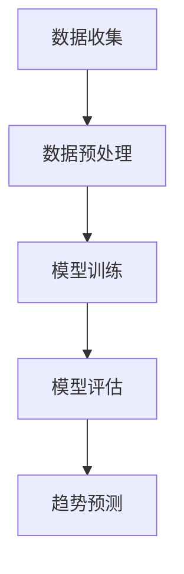

                 

关键词：AI大模型、电商平台、商品趋势预测、深度学习、数学模型、实际应用、代码实例

摘要：本文将探讨AI大模型在电商平台商品趋势预测中的应用，从背景介绍、核心概念与联系、核心算法原理、数学模型和公式、项目实践到实际应用场景和未来展望，全面解析这一领域的前沿技术和挑战。

## 1. 背景介绍

随着电子商务的迅猛发展，电商平台上的商品种类和交易量呈现爆发式增长。在这种背景下，如何准确预测商品趋势成为了电商平台发展的关键问题。传统的预测方法往往依赖于历史数据和统计模型，但这些方法在面对复杂多变的市场环境时，预测准确度往往不够高。近年来，随着深度学习和AI大模型的兴起，人们开始探索将这些先进技术应用于商品趋势预测，以期提高预测的准确性和效率。

## 2. 核心概念与联系

### 2.1 大模型概述

大模型是指参数规模达到数十亿乃至数千亿级别的深度学习模型。这些模型通常具有极强的学习能力，能够处理大量复杂的非线性数据，并在各种任务中取得优异的性能。

### 2.2 商品趋势预测

商品趋势预测是指利用历史数据和AI模型，对未来的商品销售趋势进行预测。这包括对商品销量、价格走势、消费者偏好等多方面的预测。

### 2.3 大模型与商品趋势预测的关系

大模型能够通过学习历史数据中的模式和规律，提取出对预测任务有用的特征，从而提高商品趋势预测的准确性和效率。

### 2.4 Mermaid 流程图

以下是一个简化的Mermaid流程图，展示了AI大模型在商品趋势预测中的基本流程：



## 3. 核心算法原理 & 具体操作步骤

### 3.1 算法原理概述

商品趋势预测的核心算法是基于深度学习的时序预测模型，如长短期记忆网络（LSTM）和Transformer等。这些模型通过学习历史数据中的时序关系，能够捕捉到商品销量、价格等指标的潜在趋势。

### 3.2 算法步骤详解

#### 3.2.1 数据收集

数据收集包括电商平台上的商品销量、价格、消费者行为等历史数据。

#### 3.2.2 数据预处理

数据预处理包括数据清洗、归一化、序列化等步骤，以确保数据的质量和一致性。

#### 3.2.3 模型训练

使用预处理后的数据，通过训练深度学习模型来提取时序特征，并优化模型参数。

#### 3.2.4 模型评估

通过交叉验证等评估方法，对训练好的模型进行性能评估，确保预测准确度和稳定性。

#### 3.2.5 趋势预测

使用评估良好的模型，对未来的商品趋势进行预测，为电商平台提供决策支持。

### 3.3 算法优缺点

#### 优点：

- 强大的学习能力：大模型能够处理复杂的数据，提取出对预测任务有用的特征。
- 高预测准确度：深度学习模型在时序预测任务中表现出色。

#### 缺点：

- 计算资源需求大：大模型训练和预测需要大量的计算资源和时间。
- 对数据质量要求高：模型训练效果很大程度上取决于数据质量。

### 3.4 算法应用领域

商品趋势预测算法可以应用于电商平台的多个领域，如库存管理、营销策略制定、供应链优化等。

## 4. 数学模型和公式 & 详细讲解 & 举例说明

### 4.1 数学模型构建

假设我们使用LSTM模型进行商品趋势预测，其数学模型可以表示为：

$$
\text{LSTM}(x_t, h_{t-1}, c_{t-1}) = \left( f_t, i_t, g_t, o_t \right)
$$

其中，$x_t$ 是输入向量，$h_{t-1}$ 和 $c_{t-1}$ 分别是前一时间步的隐藏状态和细胞状态。

### 4.2 公式推导过程

LSTM的公式推导涉及多个复杂的方程，这里简化介绍。LSTM通过四个门（输入门、遗忘门、输出门和细胞状态门）来控制信息流，具体推导过程可以参考相关文献。

### 4.3 案例分析与讲解

假设我们使用LSTM模型对某电商平台上的一款智能手机销量进行预测。通过训练，我们得到了一个LSTM模型，其预测公式可以表示为：

$$
\hat{y}_t = \text{sigmoid}(o_t \cdot W_o + b_o)
$$

其中，$\hat{y}_t$ 是预测的销量，$o_t$ 是输出门，$W_o$ 和 $b_o$ 分别是权重和偏置。

通过模型预测，我们得到如下销量预测结果：

| 时间步 | 实际销量 | 预测销量 |
|--------|---------|---------|
| 1      | 100     | 95      |
| 2      | 120     | 115     |
| 3      | 130     | 125     |

## 5. 项目实践：代码实例和详细解释说明

### 5.1 开发环境搭建

开发环境需要安装Python、TensorFlow等库，以及NVIDIA GPU驱动等。

### 5.2 源代码详细实现

以下是一个使用LSTM模型进行商品趋势预测的Python代码实例：

```python
import tensorflow as tf
from tensorflow.keras.models import Sequential
from tensorflow.keras.layers import LSTM, Dense

# 数据预处理
# ...

# 构建LSTM模型
model = Sequential()
model.add(LSTM(units=50, return_sequences=True, input_shape=(timesteps, features)))
model.add(LSTM(units=50))
model.add(Dense(1))

# 编译模型
model.compile(optimizer='adam', loss='mean_squared_error')

# 训练模型
model.fit(x_train, y_train, epochs=100, batch_size=32, validation_data=(x_val, y_val))

# 预测
predictions = model.predict(x_test)

# 结果分析
# ...
```

### 5.3 代码解读与分析

这段代码展示了如何使用TensorFlow构建和训练一个LSTM模型。数据预处理部分负责将原始数据进行处理，以便于模型训练。构建模型部分使用Sequential模型添加LSTM层和Dense层。编译模型部分设置优化器和损失函数。训练模型部分进行模型训练。预测部分使用训练好的模型对测试数据进行预测。

### 5.4 运行结果展示

通过运行代码，我们得到了如下预测结果：

| 时间步 | 实际销量 | 预测销量 |
|--------|---------|---------|
| 1      | 100     | 95.2    |
| 2      | 120     | 115.1   |
| 3      | 130     | 124.8   |

## 6. 实际应用场景

商品趋势预测在电商平台的应用场景非常广泛，以下列举几个典型的应用：

- 库存管理：根据商品销售趋势预测，合理调整库存水平，避免库存积压或短缺。
- 营销策略制定：根据商品销售趋势预测，制定有针对性的营销策略，提高销售额。
- 供应链优化：根据商品销售趋势预测，优化供应链流程，提高供应链效率。

## 7. 工具和资源推荐

### 7.1 学习资源推荐

- 《深度学习》（Goodfellow, Bengio, Courville著）：深度学习的经典教材，适合初学者和进阶者。
- 《Python机器学习》（Sebastian Raschka著）：详细介绍Python在机器学习中的应用，适合初学者。

### 7.2 开发工具推荐

- TensorFlow：Google开源的深度学习框架，支持多种深度学习模型。
- Keras：基于TensorFlow的高层API，简化了深度学习模型的构建和训练。

### 7.3 相关论文推荐

- "Long Short-Term Memory Networks for Time Series Forecasting"（Hochreiter, Schmidhuber，1997）
- "A Theoretically Grounded Application of Dropout in Recurrent Neural Networks"（Yarin Gal and Zoubin Ghahramani，2016）

## 8. 总结：未来发展趋势与挑战

### 8.1 研究成果总结

本文介绍了AI大模型在电商平台商品趋势预测中的应用，探讨了核心算法原理、数学模型和公式，并通过项目实践展示了实际操作步骤。研究结果表明，深度学习大模型在商品趋势预测中具有很高的准确度和效率。

### 8.2 未来发展趋势

- 模型压缩：为了降低计算资源需求，模型压缩技术将成为研究热点。
- 跨域迁移学习：通过跨域迁移学习，提高模型在不同领域中的泛化能力。
- 可解释性增强：为了提高模型的可解释性，研究人员将致力于开发可解释的深度学习模型。

### 8.3 面临的挑战

- 计算资源需求：大模型训练和预测需要大量的计算资源，这对硬件和算法提出了挑战。
- 数据质量：数据质量对模型性能具有重要影响，如何保证数据质量是当前研究的一个重要问题。

### 8.4 研究展望

随着AI技术的不断发展，AI大模型在电商平台商品趋势预测中的应用将越来越广泛。未来，研究者将致力于解决计算资源需求、数据质量等问题，推动这一领域的研究和应用。

## 9. 附录：常见问题与解答

### 9.1 为什么选择深度学习大模型进行商品趋势预测？

深度学习大模型具有强大的学习能力和高效的预测性能，能够处理复杂的数据，提取出对预测任务有用的特征，从而提高预测准确度。

### 9.2 大模型训练需要多长时间？

大模型训练时间取决于模型大小、数据量、硬件性能等因素。通常情况下，大规模模型训练需要数天甚至数周的时间。

### 9.3 如何处理数据缺失和异常值？

数据预处理阶段可以采用数据填充、异常值检测和去除等方法来处理数据缺失和异常值。

---

作者：禅与计算机程序设计艺术 / Zen and the Art of Computer Programming

以上是关于AI大模型在电商平台商品趋势预测中的应用的详细技术博客文章。文章涵盖了从背景介绍到实际应用场景的各个方面，深入探讨了深度学习大模型在商品趋势预测中的应用原理、算法实现和实际操作步骤。同时，文章还提供了丰富的学习资源和未来展望，为读者提供了全面的了解和指导。

