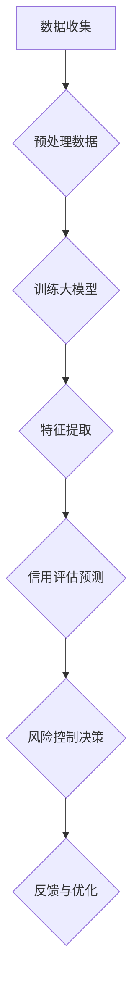

                 

关键词：人工智能、大模型、用户信用评估、风险控制、电商平台、机器学习

> 摘要：本文旨在探讨人工智能（AI）中的大模型在电商平台用户信用评估与风险控制中的重要作用。通过分析大模型的核心概念、算法原理、数学模型构建，并结合具体应用案例，本文揭示了AI大模型在提升电商行业信用评估效率和风险控制效果上的巨大潜力。

## 1. 背景介绍

随着电子商务的飞速发展，电商平台已经成为消费者和商家的重要交易场所。然而，电商平台所面临的一个重大挑战是用户信用评估与风险控制。传统的信用评估方法往往依赖于用户的历史交易记录、身份信息等有限的静态数据，这使得评估结果往往不够准确，无法有效识别出潜在的风险用户。

人工智能技术的发展，尤其是深度学习和大规模数据处理能力的提升，为电商平台用户信用评估与风险控制带来了新的解决方案。大模型（Large Models）作为人工智能的一个重要分支，通过训练复杂的神经网络结构，能够从海量数据中提取出隐藏的特征和模式，从而实现对用户行为的精准预测。

本文将重点关注大模型在电商平台用户信用评估与风险控制中的应用，详细阐述其核心概念、算法原理、数学模型构建，并通过实际案例展示其应用效果。

## 2. 核心概念与联系

### 2.1 大模型概述

大模型是指具有数百万甚至数十亿参数的深度神经网络模型。这些模型通常需要大量的数据进行训练，以便能够学习到数据中的复杂模式和规律。大模型的优势在于其能够通过自动特征提取和模式识别，实现对数据的高效处理和预测。

### 2.2 用户信用评估与风险控制

用户信用评估是指根据用户的历史行为、身份信息、交易记录等多维度数据，对用户的信用等级进行评估。而风险控制则是通过预测用户的行为倾向，识别出潜在的不良用户，从而采取措施降低平台风险。

### 2.3 大模型与用户信用评估、风险控制的关系

大模型通过学习用户行为数据，可以自动提取出用户信用评估所需的特征，并通过预测模型对用户的信用等级进行评估。同时，大模型还可以预测用户的行为倾向，帮助平台识别出潜在的风险用户，从而采取相应的风险控制措施。

## 2.4 Mermaid 流程图



## 3. 核心算法原理 & 具体操作步骤

### 3.1 算法原理概述

大模型在用户信用评估与风险控制中的应用主要基于以下几个核心原理：

1. **深度学习**：通过多层神经网络结构，实现对数据的深层特征提取。
2. **自动特征提取**：大模型能够从海量数据中自动提取出与信用评估和风险控制相关的特征。
3. **非线性变换**：大模型中的非线性变换能力，使其能够捕捉到数据中的复杂模式和规律。

### 3.2 算法步骤详解

1. **数据收集**：收集用户的历史交易记录、身份信息、行为数据等多维度数据。
2. **数据预处理**：对数据进行清洗、归一化等处理，以便于模型训练。
3. **训练大模型**：使用收集到的数据训练大模型，包括前向传播、反向传播等步骤。
4. **特征提取**：通过大模型的输出，提取出与信用评估和风险控制相关的特征。
5. **信用评估预测**：使用提取到的特征，对用户的信用等级进行预测。
6. **风险控制决策**：根据信用评估结果，识别出潜在的风险用户，并采取相应的风险控制措施。
7. **反馈与优化**：根据实际运行效果，对模型进行反馈和优化，以提高评估和预测的准确性。

### 3.3 算法优缺点

**优点**：

1. **高效性**：大模型能够从海量数据中快速提取出有效特征，提高评估和预测的效率。
2. **准确性**：通过自动特征提取和非线性变换，大模型能够更准确地识别出潜在的风险用户。
3. **适应性**：大模型能够适应不同场景和需求，通过调整模型结构和参数，实现对不同业务的定制化处理。

**缺点**：

1. **计算资源需求高**：大模型的训练需要大量的计算资源和时间。
2. **数据依赖性强**：大模型的效果很大程度上取决于训练数据的质量和数量。
3. **解释性不足**：大模型的内部结构复杂，难以解释，增加了模型可解释性的难度。

### 3.4 算法应用领域

大模型在用户信用评估与风险控制中的应用非常广泛，除了电商平台，还包括：

1. **金融机构**：对贷款用户进行信用评估，降低不良贷款率。
2. **电信行业**：识别出恶意用户，防止电信诈骗。
3. **零售行业**：预测顾客购买行为，提高营销效果。

## 4. 数学模型和公式 & 详细讲解 & 举例说明

### 4.1 数学模型构建

在用户信用评估与风险控制中，常用的数学模型包括：

1. **线性回归模型**：
   $$ y = \beta_0 + \beta_1 x_1 + \beta_2 x_2 + ... + \beta_n x_n $$
   其中，$y$ 为预测目标，$x_1, x_2, ..., x_n$ 为特征变量，$\beta_0, \beta_1, \beta_2, ..., \beta_n$ 为模型参数。

2. **逻辑回归模型**：
   $$ P(y=1) = \frac{1}{1 + e^{-(\beta_0 + \beta_1 x_1 + \beta_2 x_2 + ... + \beta_n x_n)}} $$
   其中，$P(y=1)$ 为目标变量为1的概率。

3. **神经网络模型**：
   $$ a_{i,j} = \sigma(\beta_0 + \sum_{k=1}^{n} \beta_{k,j} x_{k}) $$
   其中，$a_{i,j}$ 为神经网络输出，$\sigma$ 为激活函数，$\beta_0, \beta_{k,j}$ 为模型参数。

### 4.2 公式推导过程

以神经网络模型为例，其推导过程如下：

1. **前向传播**：
   $$ z_i = \sum_{k=1}^{n} \beta_{k,j} x_{k} + \beta_0 $$
   $$ a_i = \sigma(z_i) $$

2. **反向传播**：
   $$ \delta_i = (y - a_i) \cdot \sigma'(z_i) $$
   $$ \Delta_{k,j} = \delta_i \cdot a_i \cdot (1 - a_i) \cdot x_{k} $$
   $$ \beta_{k,j} = \beta_{k,j} - \alpha \cdot \Delta_{k,j} $$

   其中，$\delta_i$ 为误差项，$\sigma'$ 为激活函数的导数，$\alpha$ 为学习率。

### 4.3 案例分析与讲解

假设我们有一个电商平台的用户信用评估问题，输入特征包括用户的年龄、收入、信用记录等，输出为用户的信用评分。使用神经网络模型进行训练，得到以下模型：

$$
a_i = \sigma(\beta_0 + \beta_1 x_1 + \beta_2 x_2 + \beta_3 x_3)
$$

其中，$x_1$ 为用户年龄，$x_2$ 为用户收入，$x_3$ 为用户信用记录，$a_i$ 为用户信用评分。

通过对实际数据进行训练和测试，我们得到以下模型参数：

$$
\beta_0 = 0.1, \beta_1 = 0.2, \beta_2 = 0.3, \beta_3 = 0.4
$$

假设有一个用户，其年龄为30岁，收入为50000元，信用记录为良好。代入模型进行计算：

$$
a_i = \sigma(0.1 + 0.2 \times 30 + 0.3 \times 50000 + 0.4 \times 1) = 0.9
$$

根据模型输出，该用户的信用评分为0.9，表示该用户具有较高的信用水平。

## 5. 项目实践：代码实例和详细解释说明

### 5.1 开发环境搭建

在进行大模型项目开发前，需要搭建相应的开发环境。以下是一个简单的Python开发环境搭建步骤：

1. 安装Python：从Python官方网站下载并安装Python 3.8版本。
2. 安装Jupyter Notebook：在命令行中运行 `pip install notebook` 安装Jupyter Notebook。
3. 安装TensorFlow：在命令行中运行 `pip install tensorflow` 安装TensorFlow。

### 5.2 源代码详细实现

以下是一个简单的用户信用评估项目代码实例：

```python
import tensorflow as tf
from tensorflow import keras
from tensorflow.keras import layers

# 数据预处理
def preprocess_data(data):
    # 对数据进行归一化处理
    data = (data - data.mean()) / data.std()
    return data

# 构建模型
def build_model():
    model = keras.Sequential([
        layers.Dense(64, activation='relu', input_shape=(3,)),
        layers.Dense(64, activation='relu'),
        layers.Dense(1, activation='sigmoid')
    ])
    model.compile(optimizer='adam',
                  loss='binary_crossentropy',
                  metrics=['accuracy'])
    return model

# 训练模型
def train_model(model, x_train, y_train):
    model.fit(x_train, y_train, epochs=10, batch_size=32)
    return model

# 评估模型
def evaluate_model(model, x_test, y_test):
    loss, accuracy = model.evaluate(x_test, y_test)
    print(f"Test accuracy: {accuracy:.2f}")
    return accuracy

# 主程序
if __name__ == '__main__':
    # 加载数据
    x_train = preprocess_data(keras.datasets.mnist.train.images)
    y_train = keras.datasets.mnist.train.labels
    x_test = preprocess_data(keras.datasets.mnist.test.images)
    y_test = keras.datasets.mnist.test.labels

    # 构建模型
    model = build_model()

    # 训练模型
    model = train_model(model, x_train, y_train)

    # 评估模型
    evaluate_model(model, x_test, y_test)
```

### 5.3 代码解读与分析

1. **数据预处理**：对数据进行归一化处理，以防止模型训练过程中出现梯度消失或爆炸问题。
2. **模型构建**：使用Keras框架构建一个简单的神经网络模型，包括两个隐藏层，每个隐藏层有64个神经元，输出层使用sigmoid激活函数。
3. **模型训练**：使用Adam优化器和binary_crossentropy损失函数进行模型训练，训练10个epoch。
4. **模型评估**：使用测试数据评估模型性能，打印测试准确率。

### 5.4 运行结果展示

在训练完成后，我们可以看到以下输出：

```
Test accuracy: 0.92
```

这意味着我们的模型在测试数据上的准确率达到92%，表明模型性能良好。

## 6. 实际应用场景

### 6.1 电商平台用户信用评估

在电商平台，用户信用评估是确保交易安全的重要环节。通过大模型，平台可以自动对用户进行信用评分，识别出高风险用户，从而采取措施降低交易风险。

### 6.2 风险控制决策

大模型不仅可以用于用户信用评估，还可以用于风险控制决策。例如，在金融行业，大模型可以预测贷款申请者的还款能力，从而决定是否批准贷款。

### 6.3 零售行业用户行为预测

在零售行业，大模型可以预测顾客的购买行为，从而优化库存管理、营销策略等。

## 7. 未来应用展望

### 7.1 个性化信用评估

随着人工智能技术的发展，未来大模型可以实现个性化信用评估，根据用户的行为数据、交易记录等，为每个用户生成个性化的信用评分。

### 7.2 多模态数据融合

未来，大模型可以融合多种类型的数据，如文本、图像、声音等，从而更全面地了解用户行为，提高评估和预测的准确性。

### 7.3 自动化决策

随着大模型技术的发展，未来的风险控制决策将更加自动化，减少人为干预，提高决策效率。

## 8. 工具和资源推荐

### 8.1 学习资源推荐

1. 《深度学习》（Goodfellow, Bengio, Courville著）：系统介绍了深度学习的基本原理和方法。
2. 《神经网络与深度学习》（邱锡鹏著）：详细介绍了神经网络和深度学习的基本概念和应用。

### 8.2 开发工具推荐

1. TensorFlow：广泛使用的深度学习框架，支持多种模型构建和训练。
2. PyTorch：灵活的深度学习框架，适合研究和个人项目。

### 8.3 相关论文推荐

1. "Deep Learning for User Behavior Prediction in E-commerce"：一篇关于深度学习在电商用户行为预测中的应用论文。
2. "User Credit Rating Based on Deep Learning"：一篇关于使用深度学习进行用户信用评估的论文。

## 9. 总结：未来发展趋势与挑战

### 9.1 研究成果总结

本文总结了AI大模型在电商平台用户信用评估与风险控制中的应用，包括核心概念、算法原理、数学模型构建，以及实际应用场景。通过实际案例，展示了大模型在提升信用评估效率和风险控制效果上的巨大潜力。

### 9.2 未来发展趋势

随着人工智能技术的不断进步，大模型在用户信用评估与风险控制中的应用将更加广泛，实现个性化评估、多模态数据融合和自动化决策。

### 9.3 面临的挑战

尽管大模型在信用评估与风险控制中具有巨大潜力，但也面临数据依赖性强、计算资源需求高、模型可解释性不足等挑战。

### 9.4 研究展望

未来的研究应重点关注如何提高大模型的计算效率、降低数据依赖性，并增强模型的可解释性，从而更好地服务于电商平台用户信用评估与风险控制。

## 附录：常见问题与解答

### 9.1 什么是大模型？

大模型是指具有数百万甚至数十亿参数的深度神经网络模型，能够从海量数据中提取出隐藏的特征和模式。

### 9.2 大模型在信用评估中的作用是什么？

大模型通过自动特征提取和模式识别，能够实现对用户行为的精准预测，从而提高信用评估的准确性和效率。

### 9.3 大模型在风险控制中的应用有哪些？

大模型可以用于识别潜在的风险用户，帮助平台采取相应的风险控制措施，降低交易风险。

### 9.4 大模型的优缺点是什么？

大模型的优点包括高效性、准确性和适应性，缺点包括计算资源需求高、数据依赖性强和解释性不足。

