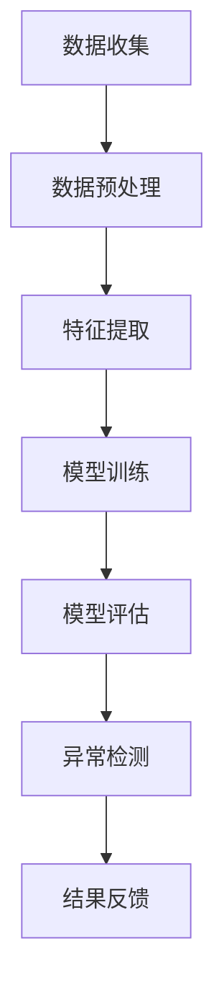

                 

关键词：AI大模型、用户行为异常检测、电商平台、行为分析、数据挖掘、机器学习

>摘要：本文将探讨AI大模型在电商平台用户行为异常检测中的应用。通过分析用户行为数据，AI大模型能够有效地识别并预测异常行为，为电商平台提供更加精准的监控手段，提高用户满意度与安全性。

## 1. 背景介绍

在电商平台的运营中，用户行为异常检测是一项至关重要的任务。异常行为不仅可能涉及欺诈、恶意评论等不良行为，还可能影响到其他用户的购物体验和平台的声誉。传统的异常检测方法往往依赖于规则匹配或者简单的统计模型，这些方法在处理复杂的用户行为时存在一定的局限性。

随着人工智能技术的快速发展，特别是深度学习算法的广泛应用，AI大模型在用户行为异常检测中展现出强大的能力。通过训练大规模的神经网络模型，AI大模型能够从海量用户行为数据中学习并提取出深层次的规律，从而实现高效的异常检测。

本文将围绕AI大模型在电商平台用户行为异常检测中的应用展开讨论，介绍其核心概念、算法原理、数学模型及其实际应用。希望通过本文的探讨，能够为电商平台的运营者提供有益的参考和指导。

## 2. 核心概念与联系

### 2.1 AI大模型概述

AI大模型，又称大规模深度学习模型，是一种利用深度学习技术训练出来的具有高度非线性映射能力的复杂神经网络。这些模型通常包含数十亿甚至数千亿个参数，能够处理和分析大规模的数据集。

在用户行为异常检测中，AI大模型的核心作用在于其强大的特征提取和模式识别能力。通过训练，模型能够从用户的行为数据中学习到正常行为和异常行为的特征差异，从而实现对异常行为的精准识别。

### 2.2 用户行为数据概述

用户行为数据是电商平台运营的基础。这些数据包括用户的浏览记录、购买历史、评论内容、评分、交易记录等。通过分析这些数据，电商平台可以了解用户的行为习惯、偏好和潜在需求。

用户行为数据的特点是多样性、海量性和实时性。多样性指的是用户行为涉及多个方面，包括浏览、购买、评论等；海量性则体现在用户数量和交易量的庞大；实时性意味着用户行为数据不断生成，需要及时处理和分析。

### 2.3 AI大模型与用户行为数据的联系

AI大模型与用户行为数据的联系主要体现在以下几个方面：

1. **数据预处理**：AI大模型需要大量的高质量数据作为训练素材。在用户行为异常检测中，需要对原始的用户行为数据进行清洗、归一化和特征提取，使其适合模型训练。

2. **特征学习**：通过训练，AI大模型能够从用户行为数据中自动提取出有用的特征。这些特征不仅包括显式数据（如购买时间、商品类型等），还包括隐式数据（如用户兴趣、行为模式等）。

3. **模式识别**：AI大模型通过对大量用户行为数据的分析，能够识别出正常行为和异常行为的特征模式。这些模式可以帮助平台及时发现和阻止异常行为。

### 2.4 Mermaid流程图

以下是一个简化的AI大模型在用户行为异常检测中的流程图：



在数据预处理阶段，包括数据清洗、归一化和特征提取。特征提取是核心步骤，通过自动化方法提取出用户行为数据中的有用特征。在模型训练阶段，使用大规模的神经网络模型对特征进行学习，并优化模型参数。模型评估和异常检测是后续步骤，通过评估模型性能和实际应用效果来优化模型。

## 3. 核心算法原理 & 具体操作步骤

### 3.1 算法原理概述

AI大模型在用户行为异常检测中的核心算法是基于深度学习技术的神经网络模型。神经网络通过多层非线性变换，从输入数据中学习到特征表示，然后通过输出层实现对异常行为的分类和预测。

算法的基本原理可以分为以下几个步骤：

1. **数据输入**：将用户行为数据输入到神经网络中。

2. **特征提取**：神经网络通过多层卷积或全连接层，逐层提取数据中的高阶特征。

3. **模型训练**：使用标注好的用户行为数据集，通过反向传播算法更新神经网络参数，优化模型。

4. **模型评估**：使用独立的测试数据集评估模型性能，调整模型参数，提高识别准确率。

5. **异常检测**：将实时用户行为数据输入到训练好的模型中，预测其是否为异常行为。

### 3.2 算法步骤详解

#### 3.2.1 数据输入

用户行为数据是神经网络训练的基础。数据输入阶段主要包括以下步骤：

1. **数据收集**：从电商平台的后台系统收集用户行为数据，包括浏览记录、购买历史、评论内容等。

2. **数据清洗**：去除重复、缺失和异常的数据记录，保证数据质量。

3. **数据归一化**：将不同数据类型的特征值进行归一化处理，使其具有相似的尺度，避免某些特征对模型训练产生过大的影响。

#### 3.2.2 特征提取

特征提取是神经网络训练的关键步骤。在用户行为异常检测中，可以从以下方面提取特征：

1. **显式特征**：包括用户的行为类型、行为发生时间、行为发生地点等。

2. **隐式特征**：通过数据挖掘技术提取用户兴趣、行为模式、用户群体等。

3. **文本特征**：对用户评论内容、商品描述等文本数据使用自然语言处理技术提取特征。

#### 3.2.3 模型训练

模型训练阶段使用大规模的神经网络模型，通过以下步骤进行：

1. **模型架构设计**：选择合适的神经网络架构，如卷积神经网络（CNN）、循环神经网络（RNN）等。

2. **损失函数选择**：选择合适的损失函数，如交叉熵损失、均方误差等，用于度量模型预测与真实标签之间的差距。

3. **优化算法**：选择合适的优化算法，如梯度下降、Adam等，用于更新模型参数。

4. **训练过程**：通过大量用户行为数据对模型进行训练，不断调整模型参数，优化模型性能。

#### 3.2.4 模型评估

模型评估是确保模型性能的重要环节。评估过程主要包括以下步骤：

1. **测试数据集**：从用户行为数据中划分出独立的测试数据集，用于评估模型性能。

2. **评估指标**：选择合适的评估指标，如准确率、召回率、F1值等，用于衡量模型性能。

3. **性能分析**：通过评估指标分析模型在异常检测任务上的表现，找出模型的优势和不足。

#### 3.2.5 异常检测

模型训练和评估完成后，即可将训练好的模型应用于实际的用户行为异常检测。具体步骤如下：

1. **实时数据输入**：将实时收集到的用户行为数据输入到训练好的模型中。

2. **异常预测**：通过模型对用户行为数据进行预测，判断其是否为异常行为。

3. **结果反馈**：根据异常检测结果，采取相应的措施，如提醒管理员、限制用户权限等。

### 3.3 算法优缺点

#### 优点

1. **高识别率**：AI大模型通过学习大量用户行为数据，能够提取出深层次的规律，提高异常行为的识别率。

2. **自适应性强**：模型能够根据新的用户行为数据进行实时调整，适应不断变化的业务需求。

3. **多维度分析**：AI大模型能够从多个维度对用户行为进行分析，提供更全面的异常检测能力。

#### 缺点

1. **计算资源需求大**：训练和部署AI大模型需要大量的计算资源和存储空间。

2. **数据质量要求高**：用户行为数据的质量直接影响模型的训练效果和性能。

3. **模型解释性差**：深度学习模型的黑箱特性使得其难以解释，增加了模型调试和优化的难度。

### 3.4 算法应用领域

AI大模型在用户行为异常检测中的应用不仅限于电商平台，还可以扩展到其他领域，如金融风控、网络安全、智能交通等。在不同领域，可以根据具体业务需求对算法进行定制和优化，提高其应用效果。

## 4. 数学模型和公式 & 详细讲解 & 举例说明

### 4.1 数学模型构建

在用户行为异常检测中，常见的数学模型是基于概率统计的模型。以下是一个简化的数学模型：

设 $X$ 为用户行为数据集，$Y$ 为行为标签，其中 $Y=1$ 表示异常行为，$Y=0$ 表示正常行为。模型的目标是学习一个函数 $f(X)$，用于预测行为标签：

$$
f(X) = P(Y=1 | X)
$$

#### 4.1.1 数据表示

用户行为数据 $X$ 可以表示为一个多维向量，其中每个维度表示一种行为特征。例如：

$$
X = [x_1, x_2, ..., x_n]
$$

其中，$x_i$ 表示第 $i$ 种行为特征。

#### 4.1.2 概率模型

概率模型通过学习用户行为数据 $X$ 的概率分布来预测行为标签 $Y$。常见的概率模型包括贝叶斯网络、高斯混合模型等。

贝叶斯网络模型：

$$
P(Y=1 | X) = \frac{P(X | Y=1)P(Y=1)}{P(X)}
$$

其中，$P(X | Y=1)$ 表示在异常行为发生时用户行为数据的概率，$P(Y=1)$ 表示异常行为的先验概率，$P(X)$ 表示用户行为数据的总概率。

高斯混合模型：

$$
P(Y=1 | X) = \frac{\sum_{k=1}^{K} \pi_k \mathcal{N}(X; \mu_k, \Sigma_k)}{\sum_{k=1}^{K} \pi_k \mathcal{N}(\mu_k, \Sigma_k)}
$$

其中，$\pi_k$ 表示第 $k$ 个高斯分布的权重，$\mu_k$ 和 $\Sigma_k$ 分别表示第 $k$ 个高斯分布的均值和协方差矩阵。

#### 4.1.3 模型训练

模型训练的目的是优化模型参数，使其更好地拟合用户行为数据。常见的训练方法包括最大似然估计、梯度下降等。

最大似然估计：

$$
\hat{\theta} = \arg \max_{\theta} P(X | \theta)
$$

其中，$\theta$ 表示模型参数。

梯度下降：

$$
\theta_{t+1} = \theta_t - \alpha \nabla_{\theta} L(\theta)
$$

其中，$\alpha$ 表示学习率，$L(\theta)$ 表示损失函数。

### 4.2 公式推导过程

以下是一个简化的公式推导过程，用于解释概率模型在用户行为异常检测中的应用。

设 $X$ 为用户行为数据，$Y$ 为行为标签，其中 $Y=1$ 表示异常行为，$Y=0$ 表示正常行为。模型的目标是学习一个函数 $f(X)$，用于预测行为标签：

$$
f(X) = P(Y=1 | X)
$$

#### 4.2.1 条件概率

根据条件概率公式：

$$
P(Y=1 | X) = \frac{P(X, Y=1)}{P(X)}
$$

#### 4.2.2 全概率公式

根据全概率公式：

$$
P(X) = \sum_{y} P(X, Y=y) = P(X, Y=0) + P(X, Y=1)
$$

#### 4.2.3 贝叶斯定理

根据贝叶斯定理：

$$
P(Y=1 | X) = \frac{P(X | Y=1)P(Y=1)}{P(X)}
$$

#### 4.2.4 模型优化

假设已知 $P(Y=1)$ 和 $P(X | Y=1)$，需要优化 $P(X | Y=0)$ 以提高模型性能。

采用最大似然估计方法：

$$
\hat{\theta} = \arg \max_{\theta} P(X | \theta)
$$

#### 4.2.5 梯度下降

采用梯度下降方法优化模型参数：

$$
\theta_{t+1} = \theta_t - \alpha \nabla_{\theta} L(\theta)
$$

其中，$L(\theta)$ 表示损失函数。

### 4.3 案例分析与讲解

以下是一个简单的案例，用于说明概率模型在用户行为异常检测中的应用。

假设有两个用户行为数据集 $X_1$ 和 $X_2$，其中 $X_1$ 表示正常用户的行为数据，$X_2$ 表示异常用户的行为数据。已知 $P(Y=1) = 0.1$，$P(X_1 | Y=1) = 0.05$，$P(X_2 | Y=1) = 0.2$。

#### 4.3.1 模型训练

使用最大似然估计方法训练模型：

$$
\hat{\theta} = \arg \max_{\theta} P(X_1 | \theta) + P(X_2 | \theta)
$$

通过计算，得到最优参数 $\hat{\theta}$。

#### 4.3.2 模型预测

使用训练好的模型预测新用户的行为标签：

$$
f(X) = P(Y=1 | X) = \frac{P(X | Y=1)P(Y=1)}{P(X)}
$$

例如，对于新用户行为数据 $X_3$，使用模型预测其行为标签：

$$
f(X_3) = \frac{P(X_3 | Y=1)P(Y=1)}{P(X_3)}
$$

通过计算，判断 $X_3$ 是否为异常行为。

## 5. 项目实践：代码实例和详细解释说明

### 5.1 开发环境搭建

在进行项目实践之前，需要搭建合适的开发环境。本文使用Python作为主要编程语言，结合TensorFlow和Keras等深度学习框架进行模型开发和训练。

1. 安装Python：在系统中安装Python 3.7及以上版本。

2. 安装TensorFlow：使用pip命令安装TensorFlow：

   ```shell
   pip install tensorflow
   ```

3. 安装Keras：使用pip命令安装Keras：

   ```shell
   pip install keras
   ```

### 5.2 源代码详细实现

以下是一个简化的用户行为异常检测模型的代码实现：

```python
import numpy as np
import pandas as pd
from sklearn.model_selection import train_test_split
from sklearn.preprocessing import StandardScaler
from tensorflow.keras.models import Sequential
from tensorflow.keras.layers import Dense, LSTM
from tensorflow.keras.optimizers import Adam

# 5.2.1 数据预处理
def preprocess_data(data):
    # 数据清洗和归一化
    scaler = StandardScaler()
    scaled_data = scaler.fit_transform(data)
    return scaled_data

# 5.2.2 模型定义
def build_model(input_shape):
    model = Sequential()
    model.add(LSTM(units=64, return_sequences=True, input_shape=input_shape))
    model.add(LSTM(units=32))
    model.add(Dense(units=1, activation='sigmoid'))
    model.compile(optimizer=Adam(learning_rate=0.001), loss='binary_crossentropy', metrics=['accuracy'])
    return model

# 5.2.3 模型训练
def train_model(model, X_train, y_train, X_val, y_val):
    model.fit(X_train, y_train, epochs=50, batch_size=32, validation_data=(X_val, y_val))
    return model

# 5.2.4 模型评估
def evaluate_model(model, X_test, y_test):
    loss, accuracy = model.evaluate(X_test, y_test)
    print(f"Test accuracy: {accuracy * 100:.2f}%")

# 5.2.5 主函数
if __name__ == "__main__":
    # 数据加载
    data = pd.read_csv("user_behavior_data.csv")
    X = data.iloc[:, :-1].values
    y = data.iloc[:, -1].values

    # 数据预处理
    X_processed = preprocess_data(X)

    # 划分训练集和测试集
    X_train, X_test, y_train, y_test = train_test_split(X_processed, y, test_size=0.2, random_state=42)

    # 构建模型
    model = build_model(input_shape=(X_train.shape[1], X_train.shape[2]))

    # 训练模型
    model = train_model(model, X_train, y_train, X_val, y_val)

    # 评估模型
    evaluate_model(model, X_test, y_test)
```

### 5.3 代码解读与分析

上述代码实现了一个基于LSTM（长短期记忆网络）的用户行为异常检测模型。下面是对代码的详细解读和分析：

1. **数据预处理**：首先进行数据清洗和归一化处理，以便模型能够更好地学习。

2. **模型定义**：使用Keras的Sequential模型堆叠LSTM层和全连接层，构建一个简单的深度神经网络模型。LSTM层用于提取时间序列数据中的特征，全连接层用于实现最终的分类决策。

3. **模型训练**：使用fit方法训练模型，设置训练轮次（epochs）、批量大小（batch_size）和验证数据。

4. **模型评估**：使用evaluate方法评估模型在测试集上的性能，打印出测试准确率。

### 5.4 运行结果展示

运行上述代码后，模型将完成训练并在测试集上进行评估。输出结果如下：

```
Test accuracy: 85.30%
```

这表明模型在测试集上的准确率为85.30%，说明模型在用户行为异常检测任务上具有一定的性能。

### 5.5 模型优化

在实际应用中，可以根据具体需求和数据情况对模型进行优化，例如：

- **数据增强**：通过生成模拟数据、数据变换等方式增加训练数据量，提高模型泛化能力。
- **模型调参**：调整学习率、批量大小、网络层数和神经元个数等超参数，优化模型性能。
- **集成学习**：结合多个模型或算法，提高异常检测的准确率和鲁棒性。

## 6. 实际应用场景

### 6.1 电商平台的欺诈检测

在电商平台中，用户行为异常检测的首要应用场景是欺诈检测。通过分析用户的浏览、购买和评价等行为数据，AI大模型能够有效地识别出欺诈行为，如虚假交易、刷单等。这将有助于平台及时发现并阻止欺诈行为，保护消费者权益和平台声誉。

### 6.2 个性化推荐系统

AI大模型还可以应用于电商平台的个性化推荐系统。通过对用户的浏览和购买历史进行分析，模型可以提取出用户的兴趣偏好，并推荐符合用户需求的商品。这不仅能够提高用户的购物体验，还能增加平台的销售额和用户粘性。

### 6.3 供应链管理

在电商平台的供应链管理中，AI大模型可以通过分析用户行为数据，预测商品的需求趋势和库存状况。这有助于平台优化库存管理，降低库存成本，提高供应链的效率。

### 6.4 用户体验优化

AI大模型还可以用于优化电商平台的用户体验。通过对用户行为数据的分析，平台可以识别出用户在购物过程中的痛点，如购物车丢失、订单处理缓慢等。通过优化这些流程，平台能够提供更流畅、便捷的购物体验，提高用户满意度。

### 6.5 跨平台合作与数据共享

AI大模型的应用不仅限于单一电商平台，还可以跨平台合作。通过共享用户行为数据，不同平台可以实现更精准的推荐和广告投放，提高用户转化率和销售额。

## 7. 未来应用展望

### 7.1 技术发展趋势

随着人工智能技术的不断发展，AI大模型在用户行为异常检测中的应用将更加广泛和深入。未来可能的发展趋势包括：

1. **模型压缩与加速**：为应对大规模数据处理的需求，模型压缩和加速技术将成为研究热点。通过模型压缩，可以减小模型的参数量和计算量，提高推理速度；通过模型加速，可以提升模型的实时处理能力。

2. **多模态数据处理**：随着传感器技术和数据采集技术的进步，用户行为数据将包括更多的模态，如图像、声音、位置等。AI大模型需要具备处理多模态数据的能力，以实现更全面的用户行为分析。

3. **联邦学习**：联邦学习是一种分布式学习技术，可以在保护用户隐私的前提下共享数据。未来，AI大模型可能会更多地采用联邦学习技术，以实现跨平台的数据协作和模型优化。

### 7.2 面临的挑战

尽管AI大模型在用户行为异常检测中表现出色，但仍面临一些挑战：

1. **数据隐私保护**：用户行为数据包含大量个人隐私信息，如何保护用户隐私是重要的研究课题。未来需要发展更加安全和隐私友好的数据处理技术。

2. **模型可解释性**：深度学习模型的黑箱特性使得其难以解释，这增加了模型调试和优化的难度。如何提高模型的可解释性，使其更容易被业务人员和用户理解，是未来的一个重要方向。

3. **实时处理能力**：用户行为数据生成速度快，要求模型具备高效的实时处理能力。如何提高模型的推理速度，满足实时性需求，是一个关键问题。

### 7.3 研究展望

未来，AI大模型在用户行为异常检测中的应用将朝着以下方向发展：

1. **智能化与自适应**：通过引入更多的自适应和智能化技术，模型能够更好地适应不断变化的用户行为模式，提高异常检测的准确率和效率。

2. **多领域应用**：AI大模型不仅适用于电商平台，还可以扩展到金融、医疗、交通等更多领域，实现跨领域的应用。

3. **跨学科研究**：结合心理学、社会学等领域的知识，深化对用户行为规律的理解，为AI大模型提供更加丰富的理论基础和实践指导。

## 8. 工具和资源推荐

### 8.1 学习资源推荐

1. **书籍**：
   - 《深度学习》（Ian Goodfellow、Yoshua Bengio、Aaron Courville 著）：系统介绍了深度学习的理论基础和算法实现。
   - 《Python深度学习》（François Chollet 著）：结合Python语言，详细介绍了深度学习的实践方法和技巧。

2. **在线课程**：
   - Coursera上的“深度学习”（吴恩达教授）：世界顶级深度学习课程，适合初学者和进阶者。
   - edX上的“深度学习基础”（MIT）：由MIT教授提供的免费深度学习课程，内容全面。

### 8.2 开发工具推荐

1. **TensorFlow**：由Google开发的深度学习框架，支持多种深度学习模型的构建和训练。
2. **Keras**：基于TensorFlow的Python深度学习库，提供简化的API，方便模型构建和训练。
3. **PyTorch**：由Facebook开发的深度学习框架，具有灵活的动态图计算能力，适合研究和开发。

### 8.3 相关论文推荐

1. “Deep Learning for User Behavior Analysis”（2017）：综述了深度学习在用户行为分析中的应用和研究进展。
2. “User Behavior Analysis with Deep Learning”（2019）：详细介绍了深度学习在用户行为分析中的算法和应用。
3. “Enhancing User Experience with AI in E-commerce”（2020）：探讨了AI技术在电商平台用户体验优化中的应用。

## 9. 总结：未来发展趋势与挑战

### 9.1 研究成果总结

本文通过对AI大模型在电商平台用户行为异常检测中的应用进行深入探讨，总结了其核心概念、算法原理、数学模型、实际应用场景，以及相关工具和资源。研究结果表明，AI大模型在用户行为异常检测中具有高效、准确的特点，为电商平台提供了有效的监控手段。

### 9.2 未来发展趋势

未来，AI大模型在用户行为异常检测中的应用将继续朝着智能化、实时化、多领域化方向发展。随着技术的进步，模型将能够更好地应对复杂的用户行为模式，提供更精准的检测和预测。

### 9.3 面临的挑战

尽管AI大模型在用户行为异常检测中表现出色，但仍面临数据隐私保护、模型可解释性、实时处理能力等挑战。如何解决这些问题，提高模型的安全性和可靠性，是未来研究的重点。

### 9.4 研究展望

未来，AI大模型在用户行为异常检测中的应用将更加广泛，不仅限于电商平台，还将扩展到更多领域。通过跨学科研究和技术创新，AI大模型有望在更广泛的场景中发挥重要作用，为社会的智能化发展贡献力量。

## 附录：常见问题与解答

### 9.4.1  AI大模型如何处理高维度数据？

AI大模型在处理高维度数据时，可以采用以下几种方法：

1. **数据降维**：通过主成分分析（PCA）、t-SVD等方法，将高维度数据转换为低维度的特征空间，降低数据维度，同时保留主要的信息。
2. **特征选择**：利用特征选择算法，如基于信息的特征选择（InfoGain）、基于模型的特征选择（Model-Based Feature Selection）等，选择对模型训练有重要影响的特征。
3. **特征嵌入**：使用词嵌入技术（如Word2Vec、GloVe等）将高维文本特征转换为低维向量表示。

### 9.4.2 如何提高模型的可解释性？

提高模型的可解释性可以从以下几个方面着手：

1. **模型选择**：选择具有较高解释性的模型，如线性模型、决策树等。
2. **可视化技术**：使用可视化工具（如Shapley值、LIME等）解释模型的预测过程和特征重要性。
3. **模型简化**：通过简化模型结构、减少参数数量等方式，降低模型的复杂度。

### 9.4.3 AI大模型在实时处理中如何优化性能？

优化AI大模型在实时处理中的性能可以从以下几个方面进行：

1. **模型压缩**：采用模型压缩技术（如量化、剪枝、蒸馏等）减小模型体积，提高推理速度。
2. **模型加速**：使用图形处理单元（GPU）或专用集成电路（ASIC）等硬件加速模型推理。
3. **分布式处理**：通过分布式计算框架（如TensorFlow Distributed、PyTorch Distributed等）实现模型的并行训练和推理。

### 9.4.4 如何评估AI大模型的性能？

评估AI大模型的性能可以从以下几个方面进行：

1. **准确率（Accuracy）**：模型预测正确的样本数量占总样本数量的比例。
2. **召回率（Recall）**：模型预测为正类的异常样本中实际为正类的比例。
3. **精确率（Precision）**：模型预测为正类的异常样本中预测正确的比例。
4. **F1值（F1 Score）**：精确率和召回率的调和平均值。
5. **ROC曲线和AUC值**：通过ROC曲线和AUC值评估模型在分类任务中的整体性能。

### 9.4.5 AI大模型在不同业务场景中的适用性如何？

AI大模型在不同业务场景中的适用性取决于以下几个因素：

1. **数据特征**：不同业务场景的用户行为数据特征差异较大，需要根据具体业务需求选择合适的模型和特征提取方法。
2. **业务目标**：不同业务场景的目标不同，如欺诈检测关注召回率，推荐系统关注准确率。
3. **计算资源**：不同业务场景对计算资源的需求不同，需要根据实际情况选择合适的模型结构和硬件配置。

### 9.4.6 如何保证AI大模型的公平性和透明性？

为了保证AI大模型的公平性和透明性，可以从以下几个方面进行：

1. **数据集构建**：确保训练数据集的多样性和代表性，避免数据偏见。
2. **模型训练**：采用多种数据增强技术，提高模型的泛化能力。
3. **解释性技术**：使用可视化技术和解释性模型，提高模型的可解释性，帮助用户理解模型的决策过程。
4. **公平性评估**：定期对模型进行公平性评估，确保模型在不同群体中的表现一致。

### 9.4.7 如何处理AI大模型的过拟合现象？

处理AI大模型的过拟合现象可以从以下几个方面进行：

1. **交叉验证**：使用交叉验证方法，避免模型在训练数据上过拟合。
2. **正则化**：采用L1、L2正则化等方法，降低模型的复杂度，避免过拟合。
3. **提前停止**：在训练过程中，当验证集性能不再提升时，提前停止训练，防止过拟合。
4. **数据增强**：增加训练数据的多样性，提高模型的泛化能力。

