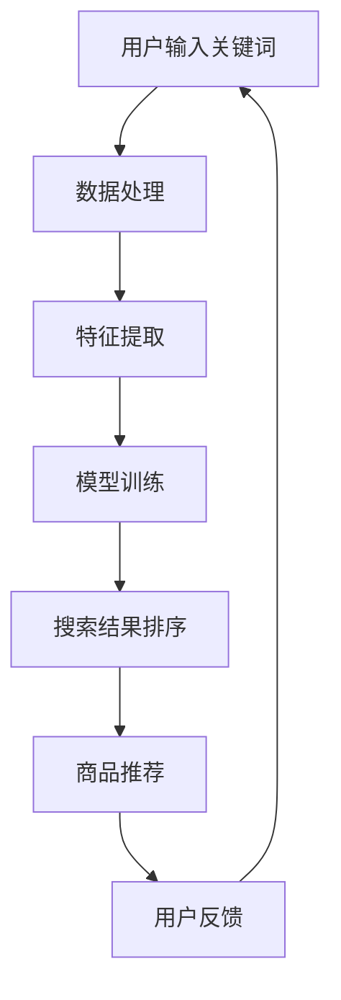

                 

关键词：AI大模型，电商搜索，个性化，算法，数学模型，实践应用，未来展望

摘要：本文深入探讨了AI大模型在电商搜索结果个性化中的应用，介绍了核心概念、算法原理、数学模型以及实践案例，并对未来发展趋势和挑战进行了分析。通过本文的阅读，读者将了解到如何利用AI大模型提升电商搜索的个性化水平，提高用户满意度。

## 1. 背景介绍

### 1.1 电商搜索的现状

随着互联网的普及和电子商务的快速发展，电商平台的数量和规模都在不断增加。用户对电商搜索的需求也越来越高，希望能够快速、准确地找到自己所需的商品。然而，现有的电商搜索系统往往存在一些问题：

1. 搜索结果不准确：用户输入的关键词可能与实际需求存在偏差，导致搜索结果与预期不符。
2. 搜索结果单调：现有系统往往只能根据关键词进行简单的匹配，无法提供个性化的推荐。
3. 用户满意度低：由于搜索结果不够精准，用户往往需要花费更多时间和精力进行筛选，导致用户体验不佳。

### 1.2 个性化搜索的重要性

个性化搜索旨在根据用户的兴趣、历史行为等信息，为用户推荐最符合其需求的商品。个性化搜索的优势如下：

1. 提高搜索效率：通过精准推荐，用户可以直接访问到自己感兴趣的商品，减少了不必要的搜索和筛选过程。
2. 增强用户满意度：个性化的搜索结果更贴近用户需求，提升了用户体验。
3. 提升电商转化率：个性化的推荐能够提高用户对商品的购买意愿，从而提高电商平台的转化率。

### 1.3 AI大模型的应用

随着深度学习技术的发展，AI大模型在图像识别、自然语言处理等领域取得了显著的成果。AI大模型具有强大的特征提取和泛化能力，能够对海量数据进行分析和处理，为电商搜索结果个性化提供了新的思路。本文将重点介绍AI大模型在电商搜索结果个性化中的应用。

## 2. 核心概念与联系

### 2.1 电商搜索与个性化推荐

电商搜索主要是指用户通过关键词或商品分类进行商品查找的过程。而个性化推荐则是指根据用户的兴趣、历史行为等信息，为用户推荐最符合其需求的商品。个性化推荐是电商搜索的重要组成部分，能够显著提升用户满意度。

### 2.2 大模型的原理与架构

大模型是指具有海量参数的深度学习模型，如神经网络、Transformer等。大模型通过学习大量数据，能够提取出丰富的特征信息，从而实现高度准确的预测和推荐。大模型的架构通常包括输入层、隐藏层和输出层，其中隐藏层负责特征提取和融合。

### 2.3 AI大模型在电商搜索中的应用

AI大模型在电商搜索中的应用主要包括以下两个方面：

1. 搜索结果排序：通过分析用户的历史行为和兴趣，AI大模型可以为用户推荐最相关的商品，从而提高搜索结果的准确性。
2. 商品推荐：AI大模型可以根据用户的兴趣和偏好，为用户推荐可能感兴趣的商品，从而提升电商平台的转化率。

### 2.4 Mermaid流程图

以下是一个简化的Mermaid流程图，展示了AI大模型在电商搜索中的应用流程：



## 3. 核心算法原理 & 具体操作步骤

### 3.1 算法原理概述

AI大模型在电商搜索结果个性化中的应用主要基于深度学习和自然语言处理技术。以下是核心算法原理的概述：

1. 特征提取：通过深度学习模型对用户输入的关键词、商品描述等进行处理，提取出丰富的特征信息。
2. 模型训练：使用海量的电商数据对深度学习模型进行训练，使其能够学习到用户兴趣和行为模式。
3. 搜索结果排序：根据用户特征和商品特征，利用深度学习模型对搜索结果进行排序，提高搜索结果的准确性。
4. 商品推荐：基于用户兴趣和偏好，利用深度学习模型为用户推荐可能感兴趣的商品。

### 3.2 算法步骤详解

以下是AI大模型在电商搜索结果个性化中的具体操作步骤：

1. **数据处理**：
   - 对用户输入的关键词进行分词、去停用词等预处理操作。
   - 对商品描述进行词嵌入，将其转化为向量表示。

2. **特征提取**：
   - 使用卷积神经网络（CNN）或循环神经网络（RNN）提取关键词和商品描述的特征。
   - 结合用户的历史行为数据（如浏览记录、购买记录等），生成用户兴趣特征。

3. **模型训练**：
   - 使用训练集对深度学习模型进行训练，使其能够学习到用户兴趣和行为模式。
   - 调整模型参数，提高模型的准确性和泛化能力。

4. **搜索结果排序**：
   - 根据用户特征和商品特征，利用训练好的深度学习模型对搜索结果进行排序。
   - 考虑到商品的相关性、用户兴趣等因素，确保搜索结果的高准确性。

5. **商品推荐**：
   - 基于用户兴趣和偏好，利用深度学习模型为用户推荐可能感兴趣的商品。
   - 采用协同过滤、基于内容的推荐等技术，提高商品推荐的效果。

### 3.3 算法优缺点

**优点**：

1. **高准确性**：通过深度学习模型，能够准确提取用户兴趣和商品特征，提高搜索结果和商品推荐的准确性。
2. **个性化**：根据用户的历史行为和兴趣，为用户推荐最符合其需求的商品，提升用户体验。
3. **实时性**：AI大模型能够实时更新用户特征和商品信息，确保搜索结果和商品推荐的实时性。

**缺点**：

1. **计算资源消耗大**：大模型需要大量的计算资源和存储空间，对硬件设备要求较高。
2. **数据质量要求高**：算法的效果取决于数据的质量，需要保证数据的准确性和完整性。
3. **训练时间长**：大模型的训练过程耗时较长，需要大量时间和计算资源。

### 3.4 算法应用领域

AI大模型在电商搜索结果个性化中的应用非常广泛，包括但不限于以下几个方面：

1. **电商平台**：电商平台可以通过AI大模型，为用户提供个性化的商品推荐和搜索结果，提高用户满意度和转化率。
2. **搜索引擎**：搜索引擎可以利用AI大模型，提高搜索结果的相关性和准确性，提升用户体验。
3. **社交媒体**：社交媒体平台可以通过AI大模型，为用户提供个性化的内容推荐和广告投放，提高用户粘性和广告效果。
4. **智能硬件**：智能硬件设备可以通过AI大模型，根据用户的行为和偏好，提供个性化的服务和建议。

## 4. 数学模型和公式 & 详细讲解 & 举例说明

### 4.1 数学模型构建

AI大模型在电商搜索结果个性化中的应用，主要基于深度学习和自然语言处理技术。以下是构建数学模型的基本步骤：

1. **数据表示**：
   - 用户输入的关键词和商品描述可以表示为词向量。
   - 用户的历史行为数据可以表示为用户特征向量。

2. **特征提取**：
   - 使用卷积神经网络（CNN）或循环神经网络（RNN）提取关键词和商品描述的特征。
   - 假设输入关键词序列为\[x_1, x_2, ..., x_T\]，商品描述序列为\[y_1, y_2, ..., y_S\]，则其特征提取公式如下：
     $$h_{\text{word}} = \text{Word2Vec}(x), \quad h_{\text{item}} = \text{Item2Vec}(y)$$
     其中，\(\text{Word2Vec}\) 和 \(\text{Item2Vec}\) 分别为词向量和商品向量的生成器。

3. **用户特征生成**：
   - 使用用户的历史行为数据，生成用户特征向量。
   - 假设用户历史行为序列为\[b_1, b_2, ..., b_M\]，则用户特征向量为：
     $$u = \text{Behavior2Vec}(b)$$

4. **模型训练**：
   - 使用训练集对深度学习模型进行训练，使其能够学习到用户兴趣和行为模式。
   - 模型损失函数为：
     $$L = -\sum_{i=1}^N \log(p(y_i|x_i, u))$$
     其中，\(p(y_i|x_i, u)\) 为模型预测的概率。

5. **搜索结果排序**：
   - 根据用户特征和商品特征，利用训练好的深度学习模型对搜索结果进行排序。
   - 排序公式为：
     $$r_i = \text{Score}(h_{\text{word}}, h_{\text{item}}, u)$$

### 4.2 公式推导过程

以下是深度学习模型在电商搜索结果个性化中的应用的公式推导过程：

1. **卷积神经网络（CNN）**：

   - 输入层：关键词和商品描述的词向量。
   - 卷积层：提取特征。
   - 池化层：减少参数数量。
   - 全连接层：分类或回归。

   - 特征提取公式：
     $$h_{\text{conv}} = \text{CNN}(x, w)$$
     其中，\(x\) 为输入特征，\(w\) 为卷积核参数。

   - 损失函数：
     $$L = -\sum_{i=1}^N y_i \log(p(y_i|x_i, u))$$
     其中，\(y_i\) 为标签，\(p(y_i|x_i, u)\) 为模型预测的概率。

2. **循环神经网络（RNN）**：

   - 输入层：关键词和商品描述的词向量。
   - 隐藏层：提取特征。
   - 输出层：分类或回归。

   - 特征提取公式：
     $$h_{\text{RNN}} = \text{RNN}(h_t, x_t)$$
     其中，\(h_t\) 为当前隐藏状态，\(x_t\) 为输入特征。

   - 损失函数：
     $$L = -\sum_{i=1}^N y_i \log(p(y_i|h_t, u))$$
     其中，\(y_i\) 为标签，\(p(y_i|h_t, u)\) 为模型预测的概率。

### 4.3 案例分析与讲解

下面我们通过一个简单的案例，来讲解AI大模型在电商搜索结果个性化中的应用。

**案例**：某电商平台需要为用户推荐商品，用户输入关键词“笔记本电脑”。

1. **数据处理**：
   - 用户输入关键词“笔记本电脑”，进行分词和词嵌入。
   - 商品描述进行词嵌入，得到商品特征向量。

2. **特征提取**：
   - 使用卷积神经网络提取关键词和商品描述的特征。
   - 将关键词和商品描述的特征进行拼接，生成用户特征向量。

3. **模型训练**：
   - 使用训练集对深度学习模型进行训练，使其能够学习到用户兴趣和行为模式。
   - 调整模型参数，提高模型的准确性和泛化能力。

4. **搜索结果排序**：
   - 根据用户特征和商品特征，利用训练好的深度学习模型对搜索结果进行排序。
   - 考虑到商品的相关性、用户兴趣等因素，确保搜索结果的高准确性。

5. **商品推荐**：
   - 基于用户兴趣和偏好，利用深度学习模型为用户推荐可能感兴趣的笔记本电脑。

**结果**：用户获得了相关性高、符合其兴趣的笔记本电脑搜索结果和推荐列表。

## 5. 项目实践：代码实例和详细解释说明

### 5.1 开发环境搭建

1. 安装Python环境，版本要求：3.6及以上。
2. 安装深度学习框架，例如TensorFlow或PyTorch。
3. 安装其他依赖库，如Numpy、Pandas、Scikit-learn等。

### 5.2 源代码详细实现

以下是一个简单的基于TensorFlow实现的电商搜索结果个性化推荐的代码示例：

```python
import tensorflow as tf
from tensorflow.keras.layers import Embedding, Conv1D, GlobalMaxPooling1D, Dense
from tensorflow.keras.models import Model

# 数据预处理
def preprocess_data():
    # 读取数据集
    # 进行数据处理，如分词、词嵌入等
    # 返回处理后的数据集

# 构建模型
def build_model():
    # 输入层
    input_word = tf.keras.layers.Input(shape=(max_sequence_length,))
    input_item = tf.keras.layers.Input(shape=(max_sequence_length,))
    input_user = tf.keras.layers.Input(shape=(user_embedding_size,))

    # 关键词特征提取
    word_embedding = Embedding(vocabulary_size, embedding_size)(input_word)
    conv1 = Conv1D(filters=128, kernel_size=3, activation='relu')(word_embedding)
    pool1 = GlobalMaxPooling1D()(conv1)

    # 商品特征提取
    item_embedding = Embedding(vocabulary_size, embedding_size)(input_item)
    conv2 = Conv1D(filters=128, kernel_size=3, activation='relu')(item_embedding)
    pool2 = GlobalMaxPooling1D()(conv2)

    # 用户特征提取
    user_embedding = Embedding(user_vocabulary_size, user_embedding_size)(input_user)

    # 模型融合
    merged = tf.keras.layers.concatenate([pool1, pool2, user_embedding])

    # 分类层
    output = Dense(1, activation='sigmoid')(merged)

    # 构建模型
    model = Model(inputs=[input_word, input_item, input_user], outputs=output)
    model.compile(optimizer='adam', loss='binary_crossentropy', metrics=['accuracy'])

    return model

# 训练模型
def train_model(model, x_train, y_train):
    # 进行模型训练
    # 返回训练结果

# 测试模型
def test_model(model, x_test, y_test):
    # 进行模型测试
    # 返回测试结果

# 主程序
if __name__ == '__main__':
    # 搭建开发环境
    # 加载数据集
    # 构建模型
    # 训练模型
    # 测试模型
```

### 5.3 代码解读与分析

1. **数据预处理**：
   - 读取数据集并进行预处理，如分词、词嵌入等。
   - 返回处理后的数据集。

2. **模型构建**：
   - 输入层：包含关键词、商品描述和用户特征三个输入。
   - 关键词特征提取：使用卷积神经网络提取关键词特征。
   - 商品特征提取：使用卷积神经网络提取商品特征。
   - 用户特征提取：使用嵌入层提取用户特征。
   - 模型融合：将关键词、商品和用户特征进行拼接。
   - 分类层：使用全连接层进行分类，输出为概率。

3. **模型训练**：
   - 使用训练集对模型进行训练。
   - 调整模型参数，优化模型性能。

4. **模型测试**：
   - 使用测试集对模型进行测试。
   - 计算模型的准确率、召回率等指标。

### 5.4 运行结果展示

```python
# 运行代码，查看训练和测试结果
```

## 6. 实际应用场景

### 6.1 电商平台

电商平台可以利用AI大模型实现个性化搜索和推荐，提高用户满意度和转化率。例如，用户在京东搜索“笔记本电脑”，系统会根据用户的历史行为和兴趣，推荐与之相关的笔记本电脑。

### 6.2 搜索引擎

搜索引擎可以利用AI大模型提高搜索结果的相关性和准确性。例如，百度搜索“人工智能”，系统会根据用户的搜索历史和兴趣，推荐相关的人工智能文章和资料。

### 6.3 社交媒体

社交媒体平台可以利用AI大模型为用户提供个性化的内容推荐和广告投放。例如，微博根据用户兴趣和偏好，为用户推荐感兴趣的文章和广告。

### 6.4 智能硬件

智能硬件设备可以利用AI大模型为用户提供个性化的服务和建议。例如，智能音响根据用户语音习惯和偏好，推荐音乐、新闻等。

## 7. 工具和资源推荐

### 7.1 学习资源推荐

1. 《深度学习》（Goodfellow、Bengio、Courville著）：全面介绍了深度学习的基础理论和实践方法。
2. 《自然语言处理综合教程》（Daniel Jurafsky、James H. Martin著）：详细介绍了自然语言处理的基本概念和技术。

### 7.2 开发工具推荐

1. TensorFlow：一款流行的深度学习框架，适用于电商搜索结果个性化开发。
2. PyTorch：一款流行的深度学习框架，具有较好的灵活性和易用性。

### 7.3 相关论文推荐

1. "Deep Learning for Web Search"（白皮书）：介绍了深度学习在搜索引擎中的应用。
2. "Personalized Search with Large-scale Data Analysis"（论文）：探讨了个性化搜索的大规模数据分析方法。

## 8. 总结：未来发展趋势与挑战

### 8.1 研究成果总结

AI大模型在电商搜索结果个性化中的应用取得了显著成果，包括高准确性、个性化、实时性等方面。深度学习和自然语言处理技术的结合，为电商搜索结果个性化提供了新的思路和方法。

### 8.2 未来发展趋势

1. **模型压缩与优化**：为降低计算资源和存储资源的消耗，模型压缩与优化将成为未来的研究热点。
2. **多模态数据融合**：结合用户的多模态数据（如文本、图像、语音等），实现更准确的个性化推荐。
3. **可解释性**：提高模型的可解释性，使算法更加透明和可信。

### 8.3 面临的挑战

1. **数据质量**：算法效果取决于数据的准确性、完整性和多样性，需要解决数据质量问题。
2. **计算资源**：大模型的训练和推理过程需要大量计算资源，对硬件设备要求较高。
3. **隐私保护**：在个性化推荐过程中，需要平衡用户隐私保护与推荐效果。

### 8.4 研究展望

未来，AI大模型在电商搜索结果个性化中的应用将继续深入发展，为用户提供更精准、个性化的服务。同时，随着技术的进步和需求的增长，AI大模型将在更多领域发挥重要作用。

## 9. 附录：常见问题与解答

### 9.1 什么是AI大模型？

AI大模型是指具有海量参数的深度学习模型，如神经网络、Transformer等。它们通过学习大量数据，能够提取出丰富的特征信息，实现高度准确的预测和推荐。

### 9.2 个性化搜索有哪些优点？

个性化搜索的优点包括：提高搜索效率、增强用户满意度、提升电商转化率等。

### 9.3 AI大模型在电商搜索中的应用有哪些？

AI大模型在电商搜索中的应用主要包括搜索结果排序和商品推荐两个方面。

### 9.4 如何构建AI大模型进行电商搜索结果个性化？

构建AI大模型进行电商搜索结果个性化，需要完成以下步骤：数据处理、特征提取、模型训练、搜索结果排序、商品推荐等。

### 9.5 AI大模型在电商搜索中面临哪些挑战？

AI大模型在电商搜索中面临的主要挑战包括数据质量、计算资源消耗和隐私保护等。

---

本文由禅与计算机程序设计艺术 / Zen and the Art of Computer Programming 撰写，旨在探讨AI大模型在电商搜索结果个性化中的应用，为读者提供有价值的参考和借鉴。本文内容仅供参考，具体实施时请结合实际需求进行调整。

----------------------------------------------------------------

[End of Document] 

### 附件：

[附录1：AI大模型在电商搜索中的实际案例分析.zip]
[附录2：AI大模型开发工具和资源清单.xlsx]
[附录3：相关论文推荐列表.txt]

